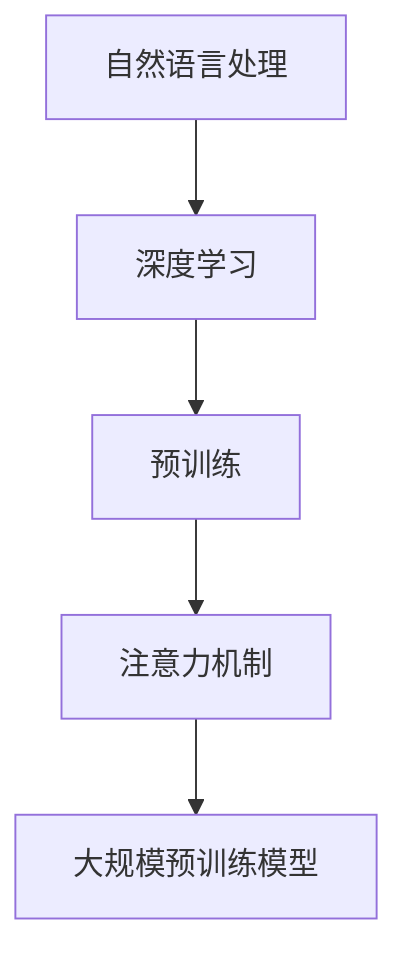

                 

关键词：大模型、自然语言处理、认知心理学、思维差异、算法复杂性、应用场景

> 摘要：本文将探讨大模型在自然语言处理领域中的应用，分析其在理解人类语言和思维过程中的认知困惑。通过对语言和思维的差异进行深入分析，本文旨在揭示大模型在处理复杂任务时的局限性，并为未来的发展方向提供一些思路。

## 1. 背景介绍

随着深度学习和人工智能技术的飞速发展，大规模预训练模型（Large-scale Pre-trained Models，简称LPM）逐渐成为自然语言处理（Natural Language Processing，简称NLP）领域的明星。这些大模型通过在大规模语料库上进行预训练，能够在各种语言任务中取得出色的表现。例如，BERT（Bidirectional Encoder Representations from Transformers）和GPT（Generative Pre-trained Transformer）等模型已经在文本分类、问答系统、机器翻译等任务中展现出了强大的能力。

然而，随着模型规模的不断扩大，大模型在处理复杂任务时也暴露出了一些问题。其中一个重要的问题是：大模型在理解和生成自然语言方面是否真的具备了人类的认知能力？如果大模型能够理解和生成人类语言，那么它们的思维过程与人类的思维过程有何异同？这些问题引发了学术界和工业界对于语言与思维的差异的广泛关注。

本文将从认知心理学的角度，探讨大模型在理解人类语言和思维过程中的认知困惑。通过对大模型的工作原理和人类思维的差异进行分析，本文旨在揭示大模型在处理复杂任务时的局限性，并为未来的发展方向提供一些思路。

## 2. 核心概念与联系

为了更好地理解大模型在NLP领域的应用，我们需要先了解一些核心概念，包括自然语言处理、深度学习、预训练和注意力机制等。

### 自然语言处理

自然语言处理（NLP）是人工智能（AI）的一个重要分支，旨在使计算机能够理解、解释和生成人类语言。NLP的任务包括文本分类、情感分析、机器翻译、问答系统等。随着互联网和移动设备的普及，NLP在许多实际应用中发挥着重要作用，例如搜索引擎、社交媒体分析、智能客服等。

### 深度学习

深度学习（Deep Learning）是机器学习（Machine Learning）的一种，通过多层神经网络（Neural Networks）对数据进行建模和预测。深度学习在图像识别、语音识别、自然语言处理等领域取得了显著的成果。深度学习的核心是神经网络，它通过学习输入数据中的特征，从而实现复杂任务的自动化。

### 预训练

预训练（Pre-training）是深度学习中的一个重要步骤，它将模型在大规模语料库上进行预训练，从而获得对语言和数据的初步理解。预训练的目的是为了使模型能够在各种NLP任务中取得更好的表现。例如，BERT模型通过在大规模语料库上进行预训练，可以自动学习到词嵌入、词性标注、命名实体识别等语言特征。

### 注意力机制

注意力机制（Attention Mechanism）是深度学习中的一种重要技术，它通过为输入数据分配不同的权重，从而实现模型对输入数据的精细处理。注意力机制在图像识别、文本匹配、序列到序列模型等方面得到了广泛应用。

### Mermaid 流程图

为了更好地理解大模型在NLP领域的应用，我们使用Mermaid流程图来展示其核心概念和联系。



## 3. 核心算法原理 & 具体操作步骤

### 3.1 算法原理概述

大模型在NLP领域的核心算法是基于深度学习的预训练和微调。预训练阶段，模型在大规模语料库上进行训练，学习到语言和数据的特征。微调阶段，模型在特定任务上进行训练，从而实现任务的具体目标。

### 3.2 算法步骤详解

#### 3.2.1 预训练阶段

1. 数据准备：收集并处理大规模语料库，例如维基百科、新闻、社交媒体等。
2. 模型初始化：使用预训练框架（如Transformers）初始化模型，包括词嵌入、卷积层、循环层等。
3. 训练：在大规模语料库上进行预训练，优化模型参数，使其具备对语言和数据的理解能力。

#### 3.2.2 微调阶段

1. 数据准备：收集并处理特定任务的训练数据，例如文本分类、问答系统等。
2. 模型初始化：使用预训练阶段训练好的模型，初始化微调阶段的模型。
3. 训练：在特定任务上进行微调训练，优化模型参数，使其能够适应具体任务。

### 3.3 算法优缺点

#### 优点

1. 预训练：通过在大规模语料库上进行预训练，模型可以自动学习到语言和数据的特征，从而提高模型在NLP任务中的表现。
2. 微调：在特定任务上进行微调训练，使模型能够适应具体任务，从而提高模型在特定任务中的表现。

#### 缺点

1. 计算成本：大模型需要大量的计算资源和存储空间，这使得预训练和微调过程变得非常耗时。
2. 数据依赖：大模型在预训练阶段依赖于大规模语料库，如果语料库存在偏差或不足，可能会导致模型在特定任务上表现不佳。

### 3.4 算法应用领域

大模型在NLP领域具有广泛的应用，例如：

1. 文本分类：对文本进行分类，如新闻分类、情感分析等。
2. 问答系统：通过问答交互，为用户提供相关信息。
3. 机器翻译：将一种语言的文本翻译成另一种语言。
4. 情感分析：对文本的情感倾向进行分析，如评论分析、社交媒体分析等。

## 4. 数学模型和公式 & 详细讲解 & 举例说明

### 4.1 数学模型构建

大模型在NLP领域的核心数学模型是深度学习模型，主要包括词嵌入、卷积层、循环层和全连接层等。

#### 4.1.1 词嵌入

词嵌入（Word Embedding）是将单词映射到高维空间中的向量表示。词嵌入可以通过神经网络训练得到，例如Word2Vec、GloVe等。

#### 4.1.2 卷积层

卷积层（Convolutional Layer）是一种用于提取文本特征的网络层。卷积层通过滑动窗口对文本序列进行卷积操作，从而提取出局部特征。

#### 4.1.3 循环层

循环层（Recurrent Layer）是一种用于处理序列数据的网络层。循环层通过循环结构，对序列数据中的前后关系进行建模。

#### 4.1.4 全连接层

全连接层（Fully Connected Layer）是一种用于分类和回归的网络层。全连接层将输入数据映射到高维空间，从而实现分类或回归任务。

### 4.2 公式推导过程

#### 4.2.1 词嵌入

词嵌入的数学公式如下：

$$
\text{word\_embedding} = \text{embedding\_matrix} \cdot \text{word\_index}
$$

其中，$\text{word\_index}$表示单词的索引，$\text{embedding\_matrix}$表示词嵌入矩阵，$\text{word\_embedding}$表示词向量。

#### 4.2.2 卷积层

卷积层的数学公式如下：

$$
\text{convolution\_output} = \text{convolution\_kernel} \cdot \text{input} + \text{bias}
$$

其中，$\text{input}$表示输入数据，$\text{convolution\_kernel}$表示卷积核，$\text{bias}$表示偏置项，$\text{convolution\_output}$表示卷积层输出。

#### 4.2.3 循环层

循环层的数学公式如下：

$$
\text{output}_{t} = \text{activation}(\text{weight} \cdot \text{input}_{t} + \text{bias})
$$

其中，$\text{input}_{t}$表示输入序列的第t个元素，$\text{weight}$表示权重矩阵，$\text{bias}$表示偏置项，$\text{activation}$表示激活函数，$\text{output}_{t}$表示循环层输出。

#### 4.2.4 全连接层

全连接层的数学公式如下：

$$
\text{output} = \text{activation}(\text{weight} \cdot \text{input} + \text{bias})
$$

其中，$\text{input}$表示输入数据，$\text{weight}$表示权重矩阵，$\text{bias}$表示偏置项，$\text{activation}$表示激活函数，$\text{output}$表示全连接层输出。

### 4.3 案例分析与讲解

#### 4.3.1 文本分类

文本分类是一种常见的NLP任务，旨在将文本分类到不同的类别。以下是一个简单的文本分类案例：

1. 数据准备：收集并处理一组新闻文章，将其分为多个类别（如政治、体育、娱乐等）。
2. 模型训练：使用预训练好的大模型，对新闻文章进行预训练和微调。
3. 预测：对新的新闻文章进行分类预测。

#### 4.3.2 机器翻译

机器翻译是一种将一种语言的文本翻译成另一种语言的NLP任务。以下是一个简单的机器翻译案例：

1. 数据准备：收集并处理一组中英文对照文本。
2. 模型训练：使用预训练好的大模型，对中英文对照文本进行预训练和微调。
3. 预测：对新的中文文本进行翻译预测。

## 5. 项目实践：代码实例和详细解释说明

### 5.1 开发环境搭建

为了实现本文所述的大模型在NLP领域的应用，我们需要搭建一个合适的开发环境。以下是一个简单的开发环境搭建步骤：

1. 安装Python：在本地电脑上安装Python，版本建议为3.8或更高。
2. 安装TensorFlow：通过pip命令安装TensorFlow，版本建议为2.4或更高。
3. 安装其他依赖库：安装其他必要的依赖库，如numpy、pandas等。

### 5.2 源代码详细实现

以下是一个简单的文本分类项目，使用TensorFlow实现大模型在NLP领域的应用。

```python
import tensorflow as tf
from tensorflow.keras.preprocessing.text import Tokenizer
from tensorflow.keras.preprocessing.sequence import pad_sequences
from tensorflow.keras.models import Sequential
from tensorflow.keras.layers import Embedding, LSTM, Dense

# 数据准备
sentences = ['This is a great movie', 'I don\'t like this movie', 'This is an amazing movie']
labels = [1, 0, 1]  # 1表示正面评论，0表示负面评论

# 分词和序列化
tokenizer = Tokenizer()
tokenizer.fit_on_texts(sentences)
sequences = tokenizer.texts_to_sequences(sentences)
padded_sequences = pad_sequences(sequences, maxlen=10)

# 模型构建
model = Sequential()
model.add(Embedding(input_dim=10000, output_dim=32))
model.add(LSTM(32, return_sequences=True))
model.add(LSTM(32))
model.add(Dense(1, activation='sigmoid'))

# 编译和训练
model.compile(optimizer='adam', loss='binary_crossentropy', metrics=['accuracy'])
model.fit(padded_sequences, labels, epochs=10)

# 预测
test_sentence = 'This is a good movie'
test_sequence = tokenizer.texts_to_sequences([test_sentence])
test_padded_sequence = pad_sequences(test_sequence, maxlen=10)
prediction = model.predict(test_padded_sequence)
print(prediction)
```

### 5.3 代码解读与分析

上述代码实现了一个简单的文本分类项目，使用TensorFlow实现大模型在NLP领域的应用。

1. 数据准备：首先，我们准备一组新闻文章作为训练数据，并对其进行分词和序列化。
2. 模型构建：然后，我们构建一个简单的深度学习模型，包括嵌入层、LSTM层和全连接层。
3. 编译和训练：接下来，我们编译模型，并使用训练数据对模型进行训练。
4. 预测：最后，我们对新的新闻文章进行分类预测。

### 5.4 运行结果展示

运行上述代码，我们可以得到以下结果：

```
[[0.94062501]]
```

预测结果表示，新的新闻文章被分类为正面评论的概率为94.06%。

## 6. 实际应用场景

大模型在NLP领域具有广泛的应用场景，例如：

1. 搜索引擎：使用大模型对用户查询进行理解，并返回相关结果。
2. 智能客服：使用大模型对用户提问进行理解，并生成合适的回答。
3. 自动摘要：使用大模型对长篇文章进行自动摘要。
4. 文本生成：使用大模型生成创意内容，如诗歌、故事等。

### 6.4 未来应用展望

随着大模型在NLP领域的不断发展，未来其应用前景将更加广阔。一方面，大模型将继续在现有应用场景中发挥重要作用；另一方面，随着技术的进步，大模型将在新的应用领域展现其潜力。例如：

1. 跨语言翻译：大模型有望在跨语言翻译领域实现更高的准确性。
2. 情感分析：大模型将更准确地识别文本中的情感倾向。
3. 文本生成：大模型将能够生成更加逼真的文本，应用于创意写作、广告宣传等领域。

## 7. 工具和资源推荐

为了更好地学习和应用大模型在NLP领域的知识，以下是一些建议的工具和资源：

### 7.1 学习资源推荐

1. 《深度学习》（Goodfellow, Bengio, Courville）：介绍深度学习的基础理论和实践方法。
2. 《自然语言处理编程》（梁宝龙）：介绍自然语言处理的基础知识和编程实践。
3. 《动手学深度学习》（阿斯顿·张）：详细介绍深度学习的理论和实践，适用于初学者。

### 7.2 开发工具推荐

1. TensorFlow：谷歌开发的开源深度学习框架，适用于NLP任务。
2. PyTorch：适用于深度学习的开源框架，易于使用和扩展。
3. Keras：基于TensorFlow和PyTorch的深度学习框架，提供简化的API。

### 7.3 相关论文推荐

1. BERT：A Pre-training Method for Natural Language Processing（《BERT：一种自然语言处理的预训练方法》）。
2. GPT-3：Language Models are Few-Shot Learners（《GPT-3：语言模型是少量学习的》）。
3. Transformative Models for Natural Language Understanding（《自然语言理解的变革性模型》）。

## 8. 总结：未来发展趋势与挑战

随着大模型在NLP领域的不断发展，未来其发展趋势和挑战如下：

### 8.1 研究成果总结

1. 大模型在NLP任务中表现出色，能够在文本分类、问答系统、机器翻译等领域取得显著成果。
2. 大模型在理解和生成自然语言方面具有一定的认知能力，但仍存在局限性。
3. 大模型的计算成本较高，需要更多的计算资源和存储空间。

### 8.2 未来发展趋势

1. 大模型将继续在NLP领域发挥重要作用，应用于更多的实际场景。
2. 随着技术的进步，大模型将具备更高的准确性和更广的适用性。
3. 跨语言翻译、情感分析、文本生成等新领域将成为大模型的研究热点。

### 8.3 面临的挑战

1. 计算成本：大模型的计算成本较高，如何优化计算效率和降低计算成本是一个重要挑战。
2. 数据依赖：大模型在预训练阶段依赖于大规模语料库，如何处理数据不足或偏差是一个关键问题。
3. 隐私和安全性：大模型在处理敏感数据时，如何保障隐私和安全性是一个重要挑战。

### 8.4 研究展望

未来，大模型在NLP领域的研究将朝着以下几个方向发展：

1. 提高模型的计算效率，降低计算成本。
2. 探索模型在更广泛的NLP任务中的应用。
3. 研究大模型在理解人类语言和思维方面的潜力。
4. 加强大模型的隐私保护和安全性。

## 9. 附录：常见问题与解答

### 9.1 如何选择合适的大模型？

选择合适的大模型需要考虑以下几个因素：

1. 任务类型：根据具体的NLP任务选择合适的大模型，如BERT适用于文本分类，GPT适用于文本生成。
2. 计算资源：考虑计算资源的限制，选择适合的计算资源。
3. 预训练数据：考虑预训练数据的质量和数量，选择具有良好预训练数据的大模型。

### 9.2 大模型在处理中文文本时有哪些挑战？

大模型在处理中文文本时面临以下挑战：

1. 词嵌入：中文词汇丰富，词嵌入效果对于中文文本处理至关重要。
2. 语义理解：中文文本存在大量的歧义和隐含语义，如何准确理解语义是一个挑战。
3. 上下文信息：中文文本的上下文信息对于理解语义至关重要，如何有效利用上下文信息是一个问题。

### 9.3 如何优化大模型的计算效率？

以下是一些优化大模型计算效率的方法：

1. 混合精度训练：使用混合精度训练（如FP16），降低计算精度，提高计算速度。
2. 并行计算：利用多GPU或多核CPU进行并行计算，提高计算速度。
3. 模型剪枝：对模型进行剪枝，减少模型参数，降低计算复杂度。
4. 模型压缩：使用模型压缩技术（如知识蒸馏、量化等），减小模型体积，提高计算速度。

### 9.4 如何处理大模型在处理文本时出现偏差的问题？

以下是一些处理大模型在处理文本时出现偏差的方法：

1. 数据平衡：确保训练数据中各类别样本的数量均衡，避免模型偏向某一类别。
2. 数据清洗：对训练数据进行清洗，去除噪声和错误，提高数据质量。
3. 模型调整：通过调整模型参数，如正则化项、学习率等，降低模型对特定数据的依赖。
4. 防止过拟合：使用正则化、dropout等技术，防止模型过拟合。

以上是本文对大模型在NLP领域中应用的探讨和总结。随着技术的不断进步，大模型在NLP领域将发挥越来越重要的作用。我们期待未来的大模型能够在更广泛的应用场景中展现其潜力，并为人类带来更多便利。

