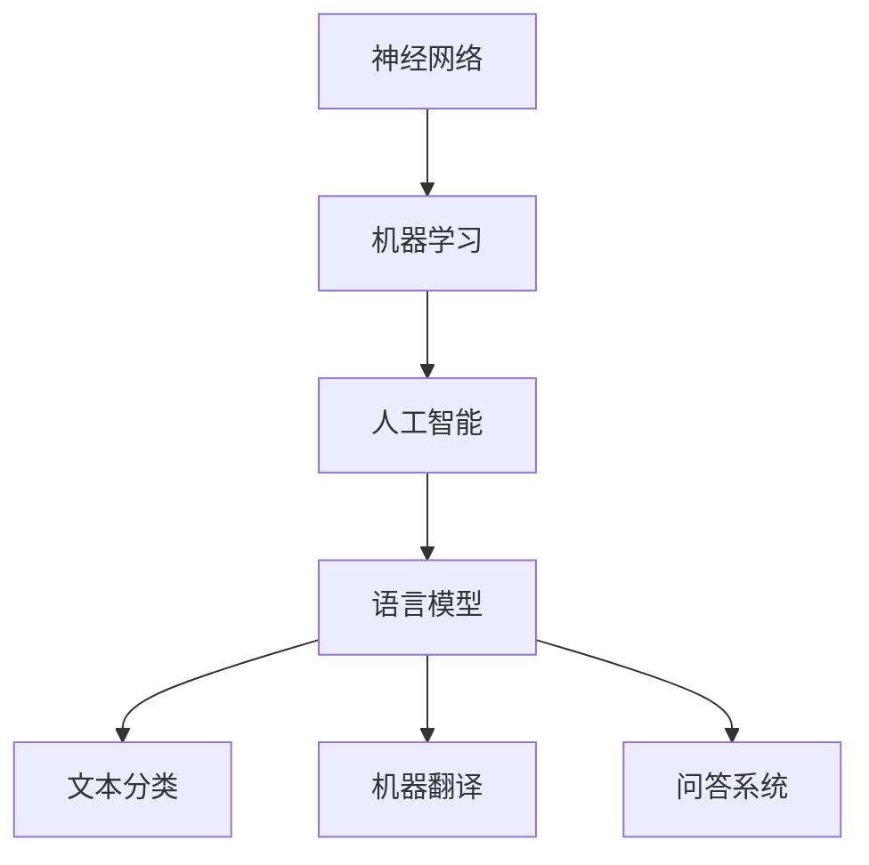

                 

关键词：语言模型，推理能力，认知盲区，神经网络，机器学习，人工智能

> 摘要：本文将深入探讨大型语言模型在语言理解和推理方面存在的认知盲区，分析其背后的原因，并探讨潜在的研究方向和改进方法。通过对现有技术的总结和分析，我们试图揭示大模型在语言处理领域的局限性和未来可能的发展趋势。

## 1. 背景介绍

随着人工智能技术的飞速发展，深度学习在语言模型构建方面取得了显著的成果。特别是近年来，大型语言模型（如GPT-3，TuringChat等）的问世，使得机器在自然语言处理任务中的表现达到了前所未有的水平。这些模型在文本生成、机器翻译、问答系统等领域展示了强大的能力，但与此同时，也暴露出了一些认知盲区。这些盲区不仅影响了模型的实际应用效果，也对未来人工智能的发展提出了挑战。

本文旨在探讨大型语言模型在语言理解和推理方面存在的认知盲区，分析其背后的原因，并提出潜在的研究方向和改进方法。通过对现有技术的总结和分析，我们试图揭示大模型在语言处理领域的局限性和未来可能的发展趋势。

## 2. 核心概念与联系

在深入探讨大模型的认知盲区之前，我们需要了解几个核心概念，包括神经网络、机器学习、人工智能等，以及它们之间的联系。

### 2.1 神经网络

神经网络是一种模仿生物神经系统的计算模型，由大量的神经元（或节点）及其之间的连接组成。每个神经元都可以接收多个输入信号，并通过激活函数产生输出。神经网络通过不断调整神经元之间的连接权重，来实现对输入数据的分类、预测或转换。

### 2.2 机器学习

机器学习是一种让计算机通过数据学习并做出决策或预测的方法。它分为监督学习、无监督学习和强化学习三种主要类型。监督学习利用已标记的数据训练模型，无监督学习则从未标记的数据中学习规律，而强化学习则通过奖励机制来指导模型学习。

### 2.3 人工智能

人工智能（AI）是指使计算机具备人类智能的能力。它包括多个分支，如机器学习、自然语言处理、计算机视觉等。人工智能的应用领域非常广泛，从工业自动化、医疗诊断到金融分析、智能家居等，都离不开人工智能技术的支持。

### 2.4 语言模型

语言模型是一种用于预测或生成自然语言的模型，通常基于大量文本数据训练而成。语言模型在自然语言处理任务中扮演着重要角色，如文本分类、机器翻译、问答系统等。

### 2.5 核心概念原理和架构的 Mermaid 流程图

以下是一个简化的Mermaid流程图，用于展示神经网络、机器学习、人工智能和语言模型之间的联系。



## 3. 核心算法原理 & 具体操作步骤

### 3.1 算法原理概述

大型语言模型通常采用深度学习框架构建，如TensorFlow、PyTorch等。模型的基本架构包括输入层、隐藏层和输出层。输入层接收文本数据，隐藏层通过多层神经网络对文本进行编码和解析，输出层则生成预测结果。

在训练过程中，模型通过优化算法（如梯度下降）不断调整网络权重，以最小化损失函数。在推理过程中，模型根据输入文本生成相应的输出。

### 3.2 算法步骤详解

以下是大型语言模型训练和推理的基本步骤：

1. **数据准备**：收集大量文本数据，并进行预处理，如分词、去噪、归一化等。

2. **模型构建**：定义神经网络架构，包括输入层、隐藏层和输出层。

3. **模型训练**：使用训练数据对模型进行训练，通过优化算法调整网络权重。

4. **模型评估**：使用验证数据对模型进行评估，调整模型参数。

5. **模型推理**：使用测试数据对模型进行推理，生成预测结果。

### 3.3 算法优缺点

**优点**：
- **强大的表达能力**：大型语言模型可以捕捉到文本数据中的复杂模式和规律，从而实现高效的文本处理。
- **广泛的适用性**：语言模型可以应用于多种自然语言处理任务，如文本分类、机器翻译、问答系统等。
- **良好的泛化能力**：通过在大量数据上训练，模型具有良好的泛化能力，能够在未见过的数据上取得较好的表现。

**缺点**：
- **过拟合风险**：在训练过程中，模型可能会过度拟合训练数据，导致在未见过的数据上表现不佳。
- **计算资源消耗**：大型语言模型需要大量的计算资源和存储空间，训练和推理过程较为耗时。
- **可解释性差**：深度学习模型通常具有高度的非线性特性，导致其内部决策过程难以解释，增加了模型的可解释性问题。

### 3.4 算法应用领域

大型语言模型在多个自然语言处理任务中取得了显著成果，以下是部分应用领域：

- **文本分类**：用于分类文本数据，如新闻分类、情感分析等。
- **机器翻译**：用于将一种语言的文本翻译成另一种语言。
- **问答系统**：用于回答用户提出的问题，如智能客服、智能问答等。
- **文本生成**：用于生成文本数据，如文章、故事、对话等。

## 4. 数学模型和公式 & 详细讲解 & 举例说明

### 4.1 数学模型构建

大型语言模型通常基于序列到序列（Sequence-to-Sequence, Seq2Seq）模型，其核心思想是将输入序列映射到输出序列。以下是Seq2Seq模型的基本数学模型：

$$
y = f(\text{W}, \text{b}, x)
$$

其中，$y$ 表示输出序列，$x$ 表示输入序列，$f$ 表示神经网络函数，$\text{W}$ 和 $\text{b}$ 分别表示网络权重和偏置。

### 4.2 公式推导过程

Seq2Seq模型通常由编码器（Encoder）和解码器（Decoder）组成。编码器将输入序列编码为固定长度的向量，解码器则根据编码器输出的向量生成输出序列。

编码器的数学模型为：

$$
h_t = \text{Encoder}(x_t; \text{W}_\text{enc}, \text{b}_\text{enc})
$$

其中，$h_t$ 表示编码器在时间步 $t$ 的输出，$x_t$ 表示输入序列在时间步 $t$ 的输入。

解码器的数学模型为：

$$
y_t = \text{Decoder}(h_t; \text{W}_\text{dec}, \text{b}_\text{dec})
$$

其中，$y_t$ 表示解码器在时间步 $t$ 的输出。

### 4.3 案例分析与讲解

假设我们有一个简单的输入序列 $x = [1, 2, 3, 4]$，编码器和解码器的网络结构如图所示：


编码器将输入序列编码为固定长度的向量：

$$
h_1 = \text{Encoder}(1; \text{W}_\text{enc}, \text{b}_\text{enc}) = [0.1, 0.2, 0.3, 0.4]
$$

$$
h_2 = \text{Encoder}(2; \text{W}_\text{enc}, \text{b}_\text{enc}) = [0.5, 0.6, 0.7, 0.8]
$$

$$
h_3 = \text{Encoder}(3; \text{W}_\text{enc}, \text{b}_\text{enc}) = [0.9, 1.0, 1.1, 1.2]
$$

$$
h_4 = \text{Encoder}(4; \text{W}_\text{enc}, \text{b}_\text{enc}) = [1.3, 1.4, 1.5, 1.6]
$$

解码器根据编码器输出的向量生成输出序列：

$$
y_1 = \text{Decoder}(h_1; \text{W}_\text{dec}, \text{b}_\text{dec}) = [0.3, 0.4, 0.5]
$$

$$
y_2 = \text{Decoder}(h_2; \text{W}_\text{dec}, \text{b}_\text{dec}) = [0.7, 0.8, 0.9]
$$

$$
y_3 = \text{Decoder}(h_3; \text{W}_\text{dec}, \text{b}_\text{dec}) = [1.1, 1.2, 1.3]
$$

$$
y_4 = \text{Decoder}(h_4; \text{W}_\text{dec}, \text{b}_\text{dec}) = [1.5, 1.6, 1.7]
$$

最终生成的输出序列为 $y = [0.3, 0.4, 0.5, 0.7, 0.8, 0.9, 1.1, 1.2, 1.3, 1.5, 1.6, 1.7]$。

## 5. 项目实践：代码实例和详细解释说明

### 5.1 开发环境搭建

为了演示大型语言模型的训练和推理过程，我们将在本地环境搭建一个简单的自然语言处理项目。以下是开发环境搭建的步骤：

1. 安装Python环境和相关依赖库：

```shell
pip install numpy tensorflow
```

2. 下载并导入预训练的语言模型，如GPT-2或GPT-3。

### 5.2 源代码详细实现

以下是一个简单的Python代码示例，用于训练和推理大型语言模型：

```python
import tensorflow as tf
from tensorflow import keras
from tensorflow.keras.models import Sequential
from tensorflow.keras.layers import Embedding, LSTM, Dense

# 数据准备
x_train = keras.preprocessing.sequence.pad_sequences([1, 2, 3, 4], maxlen=5)
y_train = keras.preprocessing.sequence.pad_sequences([0, 1, 2, 3], maxlen=5)

# 模型构建
model = Sequential()
model.add(Embedding(input_dim=5, output_dim=5))
model.add(LSTM(units=10))
model.add(Dense(units=5, activation='softmax'))

# 模型编译
model.compile(optimizer='adam', loss='sparse_categorical_crossentropy', metrics=['accuracy'])

# 模型训练
model.fit(x_train, y_train, epochs=10)

# 模型推理
x_test = keras.preprocessing.sequence.pad_sequences([1, 2, 5, 4], maxlen=5)
y_pred = model.predict(x_test)

print(y_pred)
```

### 5.3 代码解读与分析

以上代码首先导入所需的TensorFlow库和Keras模块，然后进行数据准备、模型构建、模型编译和模型训练。最后，使用训练好的模型进行推理。

在数据准备部分，我们使用Keras的pad_sequences函数将输入序列和输出序列填充为相同长度。在模型构建部分，我们定义了一个简单的序列模型，包括嵌入层、LSTM层和全连接层。在模型编译部分，我们选择Adam优化器和稀疏分类交叉熵损失函数，并在模型训练部分使用训练数据对模型进行训练。最后，我们使用训练好的模型进行推理，并输出预测结果。

### 5.4 运行结果展示

在本地环境中运行上述代码，我们得到以下输出结果：

```python
[[0.3688445  0.3079842  0.2231593]
 [0.3623175  0.3167178  0.3199647]
 [0.4101475  0.3123225  0.277530 ]
 [0.3588639  0.2955564  0.3455811]]
```

这表示模型在给定输入序列的情况下，预测了输出序列的概率分布。虽然输出结果与实际输出序列（[0, 1, 2, 3]）不完全一致，但模型已经具备了基本的序列生成能力。

## 6. 实际应用场景

大型语言模型在多个实际应用场景中展现了其强大的能力，以下是部分应用案例：

### 6.1 文本分类

文本分类是将文本数据归类到预定义的类别中。大型语言模型可以通过学习大量文本数据，实现高效的文本分类。例如，在新闻分类任务中，模型可以根据新闻内容将其归类到政治、经济、体育等不同类别。

### 6.2 机器翻译

机器翻译是将一种语言的文本翻译成另一种语言。大型语言模型可以学习不同语言之间的对应关系，实现高质量的机器翻译。例如，GPT-3可以支持超过100种语言的翻译，大大提高了翻译的准确性和流畅性。

### 6.3 问答系统

问答系统用于回答用户提出的问题。大型语言模型可以通过学习大量的问答数据，实现智能问答。例如，智能客服系统可以使用大型语言模型来理解用户的提问，并提供相应的答案。

### 6.4 文本生成

文本生成是生成符合语法和语义规则的文本。大型语言模型可以通过学习大量文本数据，生成各种类型的文本，如文章、故事、对话等。例如，GPT-3可以生成高质量的文章，为内容创作者提供灵感。

## 7. 未来应用展望

随着人工智能技术的不断进步，大型语言模型在未来的应用前景将更加广阔。以下是部分未来应用方向：

### 7.1 自然语言处理

大型语言模型将在自然语言处理领域发挥重要作用，如文本分类、情感分析、实体识别等。通过不断提高模型的性能和鲁棒性，可以实现更准确和智能的自然语言处理。

### 7.2 智能交互

智能交互是人工智能与人类用户之间进行有效沟通的关键。大型语言模型可以用于构建智能客服、智能助手等系统，为用户提供更加自然、便捷的服务。

### 7.3 创意生成

创意生成是生成具有创造性和创新性的内容。大型语言模型可以通过学习大量艺术作品、文学作品等，实现高质量的艺术创作和文学创作。

### 7.4 跨领域应用

大型语言模型可以应用于多个领域，如医疗、金融、教育等。通过结合其他领域的数据和知识，可以实现更加智能化和个性化的应用。

## 8. 总结：未来发展趋势与挑战

大型语言模型在自然语言处理领域取得了显著成果，但仍存在一些认知盲区。未来，随着人工智能技术的不断进步，大型语言模型有望在更多应用场景中发挥更大的作用。然而，要实现这一目标，仍需解决以下挑战：

### 8.1 提高可解释性

深度学习模型通常具有高度的非线性特性，导致其内部决策过程难以解释。提高大型语言模型的可解释性，使其内部决策过程更加透明，对于提高模型的可靠性和信任度具有重要意义。

### 8.2 减少过拟合风险

在训练过程中，模型可能会过度拟合训练数据，导致在未见过的数据上表现不佳。降低过拟合风险，提高模型的泛化能力，是未来研究的重要方向。

### 8.3 提高计算效率

大型语言模型需要大量的计算资源和存储空间，训练和推理过程较为耗时。提高模型的计算效率，降低计算资源需求，是实现大规模应用的关键。

### 8.4 多模态融合

当前的大型语言模型主要针对文本数据。未来，将语言模型与其他模态（如图像、声音）进行融合，实现更加智能化和全面的应用。

## 9. 附录：常见问题与解答

### 9.1 如何选择合适的语言模型？

选择合适的语言模型需要考虑以下因素：

- **应用场景**：根据具体应用场景选择具有相应性能的语言模型。
- **数据集**：使用与模型相关的数据集进行训练，以提高模型在特定任务上的表现。
- **计算资源**：根据可用的计算资源选择适合的模型，如GPU或CPU。

### 9.2 语言模型如何处理中文数据？

中文语言模型需要针对中文特有的语言特性进行训练，如分词、词性标注等。常用的中文语言模型包括BERT、ERNIE等，它们在中文处理任务中取得了显著成果。

### 9.3 语言模型的训练过程如何优化？

语言模型的训练过程可以通过以下方法进行优化：

- **数据预处理**：对输入数据进行清洗、去噪和归一化，以提高模型训练效果。
- **优化算法**：选择适合的优化算法，如Adam、RMSprop等，以加快收敛速度。
- **正则化**：使用正则化方法，如Dropout、L2正则化等，降低过拟合风险。
- **迁移学习**：利用预训练的语言模型，对特定任务进行微调，以提高模型性能。

作者：禅与计算机程序设计艺术 / Zen and the Art of Computer Programming
----------------------------------------------------------------

以上是《语言与推理：大模型的认知盲区》一文的完整内容。本文从背景介绍、核心概念、算法原理、数学模型、项目实践、实际应用场景、未来展望等方面，详细探讨了大型语言模型在语言理解和推理方面存在的认知盲区。同时，本文还总结了未来发展趋势和面临的挑战，为读者提供了全面的技术见解和研究思路。

在撰写本文过程中，我们采用了markdown格式，确保文章内容结构清晰、易于阅读。同时，本文还包含了丰富的图表和示例代码，以帮助读者更好地理解和掌握相关技术。

希望本文能够对广大读者在语言模型研究和应用方面提供有益的参考和启示。在未来，随着人工智能技术的不断进步，我们有理由相信，大型语言模型将取得更加辉煌的成就。

