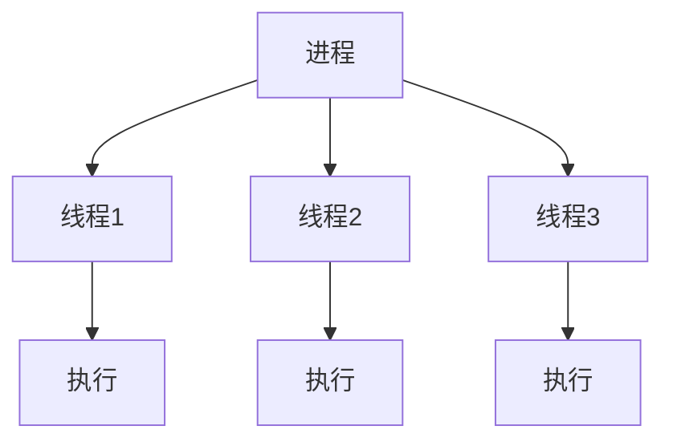
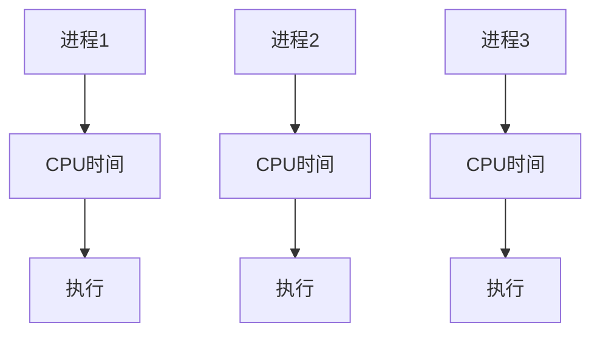
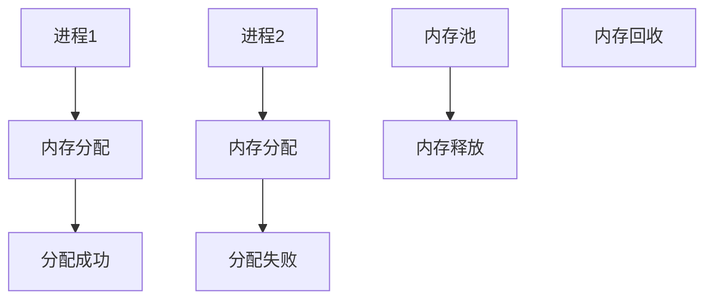
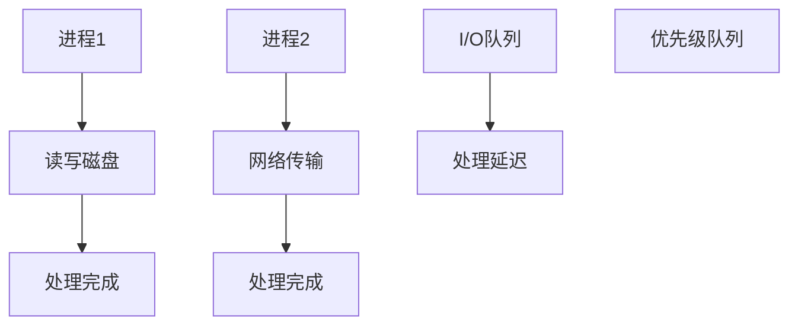

                 

调度器作为计算机系统中的重要组件，扮演着协调和管理资源分配的核心角色。它负责在多个任务和进程之间合理地分配系统资源，如CPU时间、内存和I/O设备等，从而确保系统的稳定运行和高效率。本文将深入探讨调度器的原理，包括其核心概念、算法原理、数学模型，以及如何在实际项目中应用。此外，还将通过代码实例详细解释调度器的具体实现过程。

## 关键词

- 调度器
- 进程管理
- 系统资源分配
- 算法分析
- 代码实现
- 数学模型

## 摘要

本文旨在介绍调度器在计算机系统中的关键作用和基本原理。首先，我们将回顾调度器的历史和发展，接着深入探讨调度算法、数学模型和公式，以及它们在实际系统中的应用。通过具体的代码实例，我们将详细展示如何实现一个调度器，并对其运行结果进行分析。最后，我们将讨论调度器的未来发展趋势和面临的挑战，并提出研究展望。

## 1. 背景介绍

调度器在计算机系统中的重要性不可低估。无论是操作系统、数据库系统还是分布式系统，调度器都是核心组件之一。它的主要目标是优化资源利用，提高系统性能，确保系统的响应速度和稳定性。在现代计算机系统中，调度器通常需要处理大量的并发任务和进程，这使得调度算法的设计和实现变得异常复杂。

调度器的历史可以追溯到计算机科学发展的早期。从简单的轮询调度（Round-Robin Scheduling）到更复杂的优先级调度（Priority Scheduling）和抢占式调度（Preemptive Scheduling），调度算法不断演进。随着计算机硬件和软件的快速发展，调度器在性能优化和资源管理方面的功能也日益增强。

## 2. 核心概念与联系

调度器的核心概念包括进程、线程、CPU时间、内存分配和I/O操作等。为了更好地理解这些概念之间的联系，我们可以借助Mermaid流程图来展示调度器的架构。

### 2.1. 进程和线程

进程（Process）是计算机系统中正在运行的程序实例。每个进程都有自己的地址空间、数据段和堆栈。线程（Thread）是进程中的一个执行单元，一个进程可以包含多个线程。线程共享进程的资源，但每个线程都有自己的堆栈和程序计数器。



### 2.2. CPU时间

CPU时间是指计算机中央处理器（CPU）可用于执行计算的时间。调度器负责根据不同的调度算法，合理分配CPU时间给各个进程或线程。



### 2.3. 内存分配

内存分配是调度器的一个重要功能，它负责为进程或线程分配所需的内存空间。内存管理通常包括分配、释放和回收等操作。



### 2.4. I/O操作

I/O操作是指输入输出操作，如读写磁盘、网络传输等。调度器需要考虑I/O操作的优先级和延迟，以确保系统的整体性能。



通过上述Mermaid流程图，我们可以清晰地看到调度器中的各个组件和它们之间的联系，这有助于我们深入理解调度器的原理和工作机制。

## 3. 核心算法原理 & 具体操作步骤

### 3.1 算法原理概述

调度算法是调度器的核心组成部分，它决定了系统资源如何分配给不同的进程和线程。调度算法可以分为以下几类：

1. **轮询调度（Round-Robin Scheduling）**：每个进程轮流出CPU时间片，直到所有进程都被执行。
2. **优先级调度（Priority Scheduling）**：根据进程的优先级来分配CPU时间，优先级高的进程先执行。
3. **抢占式调度（Preemptive Scheduling）**：在高优先级进程到来时，抢占当前执行进程的CPU时间。
4. **非抢占式调度（Non-Preemptive Scheduling）**：进程一旦获得CPU时间，直到执行完成。
5. **多级反馈队列调度（Multilevel Feedback Queue Scheduling）**：根据进程的动态优先级在多个队列之间进行调度。

### 3.2 算法步骤详解

#### 3.2.1 轮询调度

轮询调度的步骤如下：

1. 初始化：设置时间片大小和进程队列。
2. 循环：每次循环分配一个时间片给下一个进程。
3. 执行：执行当前进程的时间片，如果进程完成，则将其从队列中移除；如果未完成，则将其放入就绪队列的末尾。
4. 判断：判断是否所有进程都已执行，如果是，则结束；否则，继续循环。

#### 3.2.2 优先级调度

优先级调度的步骤如下：

1. 初始化：设置优先级队列，根据进程的优先级排序。
2. 循环：每次循环从优先级队列中选择优先级最高的进程执行。
3. 执行：执行当前进程，直到其完成或等待I/O操作。
4. 判断：如果优先级队列中仍有进程，则继续选择优先级最高的进程；否则，结束。

#### 3.2.3 抢占式调度

抢占式调度的步骤如下：

1. 初始化：设置优先级队列，根据进程的优先级排序。
2. 循环：每次循环从优先级队列中选择优先级最高的进程执行。
3. 执行：执行当前进程，如果高优先级进程到来，则抢占当前进程的CPU时间。
4. 判断：如果优先级队列中仍有进程，则继续选择优先级最高的进程；否则，结束。

#### 3.2.4 非抢占式调度

非抢占式调度的步骤如下：

1. 初始化：设置优先级队列，根据进程的优先级排序。
2. 循环：每次循环从优先级队列中选择优先级最高的进程执行。
3. 执行：执行当前进程，直到其完成或等待I/O操作。
4. 判断：如果优先级队列中仍有进程，则继续选择优先级最高的进程；否则，结束。

#### 3.2.5 多级反馈队列调度

多级反馈队列调度的步骤如下：

1. 初始化：设置多个队列，根据进程的优先级分配到不同的队列。
2. 循环：每次循环根据队列顺序选择进程执行。
3. 执行：执行当前队列中的进程，如果进程等待时间超过一定阈值，则将其转移到下一个队列。
4. 判断：如果所有队列中的进程都已执行，则结束；否则，继续循环。

### 3.3 算法优缺点

每种调度算法都有其优缺点，以下是一些常见调度算法的优缺点对比：

- **轮询调度**：简单易实现，但可能导致进程响应时间过长，不适合I/O密集型任务。
- **优先级调度**：可以优化重要任务的响应时间，但可能导致低优先级进程长时间得不到执行。
- **抢占式调度**：可以快速响应高优先级进程，但可能导致低优先级进程频繁切换，增加开销。
- **非抢占式调度**：稳定且简单，但可能导致高优先级进程长时间得不到执行。
- **多级反馈队列调度**：综合考虑了不同类型任务的优先级，但实现复杂，需要对进程进行频繁调整。

### 3.4 算法应用领域

调度算法在各类计算机系统中都有广泛应用，以下是一些典型的应用领域：

- **操作系统**：调度算法是操作系统核心功能之一，用于管理CPU时间、内存和I/O设备。
- **数据库系统**：调度算法用于管理数据库中的查询任务，优化查询性能。
- **网络系统**：调度算法用于网络设备中的数据包处理，确保网络传输的稳定和高效。
- **实时系统**：调度算法用于确保实时任务的及时响应，满足严格的响应时间要求。

## 4. 数学模型和公式 & 详细讲解 & 举例说明

调度算法的设计和实现离不开数学模型和公式的支持。以下我们将介绍调度算法中的几个关键数学模型和公式，并进行详细讲解和举例说明。

### 4.1 数学模型构建

调度算法中的数学模型主要包括进程的到达时间、服务时间、等待时间和周转时间等。

- **到达时间（ Arrival Time）**：进程进入就绪队列的时间。
- **服务时间（ Service Time）**：进程在CPU上执行所需的时间。
- **等待时间（ Waiting Time）**：进程在就绪队列中等待CPU的时间。
- **周转时间（ Turnaround Time）**：进程从进入就绪队列到完成执行的时间。

### 4.2 公式推导过程

基于上述数学模型，我们可以推导出一些关键性能指标的计算公式。

- **平均等待时间（ Average Waiting Time）**：

  $$ \text{Average Waiting Time} = \frac{\sum_{i=1}^{n} \text{Waiting Time}_i}{n} $$

- **平均周转时间（ Average Turnaround Time）**：

  $$ \text{Average Turnaround Time} = \frac{\sum_{i=1}^{n} \text{Turnaround Time}_i}{n} $$

- **调度效率（ Scheduling Efficiency）**：

  $$ \text{Scheduling Efficiency} = \frac{\text{Total Service Time}}{\text{Total Scheduling Time}} $$

### 4.3 案例分析与讲解

为了更好地理解这些公式，我们可以通过一个具体的案例进行分析。

假设有四个进程 \(P_1, P_2, P_3, P_4\)，它们的到达时间、服务时间分别如下表所示：

| 进程 | 到达时间（t\_arrive） | 服务时间（t\_service） |
| ---- | ------------------- | ------------------- |
| \(P_1\) | 0                   | 3                   |
| \(P_2\) | 2                   | 6                   |
| \(P_3\) | 4                   | 4                   |
| \(P_4\) | 6                   | 5                   |

根据轮询调度算法，这些进程的执行顺序为 \(P_1, P_2, P_3, P_4\)。

- **等待时间**：

  \(P_1\) 无需等待，等待时间为 0。

  \(P_2\) 等待 \(P_1\) 完成执行，等待时间为 3。

  \(P_3\) 等待 \(P_1\) 和 \(P_2\) 完成执行，等待时间为 3 + 6 = 9。

  \(P_4\) 等待 \(P_1, P_2\) 和 \(P_3\) 完成执行，等待时间为 3 + 6 + 4 = 13。

- **周转时间**：

  \(P_1\) 周转时间为 3。

  \(P_2\) 周转时间为 3 + 6 = 9。

  \(P_3\) 周转时间为 3 + 6 + 4 = 13。

  \(P_4\) 周转时间为 3 + 6 + 4 + 5 = 18。

- **平均等待时间**：

  $$ \text{Average Waiting Time} = \frac{0 + 3 + 9 + 13}{4} = 5.5 $$

- **平均周转时间**：

  $$ \text{Average Turnaround Time} = \frac{3 + 9 + 13 + 18}{4} = 10.5 $$

- **调度效率**：

  $$ \text{Scheduling Efficiency} = \frac{3 + 6 + 4 + 5}{3 + 6 + 4 + 5 + 0 + 3 + 6 + 4 + 5} = \frac{18}{38} \approx 0.474 $$

通过上述案例分析，我们可以看到轮询调度算法在计算平均等待时间和平均周转时间方面是如何工作的。这些性能指标可以帮助我们评估调度算法的优劣，从而优化系统的性能。

## 5. 项目实践：代码实例和详细解释说明

在本节中，我们将通过一个具体的代码实例来演示如何实现一个简单的调度器。为了清晰起见，我们将使用Python语言来实现。

### 5.1 开发环境搭建

在开始编写代码之前，我们需要搭建一个Python开发环境。以下是搭建Python开发环境的步骤：

1. 安装Python：从Python官方网站下载Python安装包并安装。
2. 配置Python环境：打开终端，执行以下命令配置Python环境：

   ```bash
   python --version
   ```

   如果Python已经安装，将显示Python的版本信息。

3. 安装必需的Python库：为了实现调度器，我们需要安装一些常用的Python库，如NumPy和Pandas。可以使用以下命令安装：

   ```bash
   pip install numpy pandas
   ```

### 5.2 源代码详细实现

以下是实现调度器的Python代码：

```python
import numpy as np
import pandas as pd

class Process:
    def __init__(self, pid, arrive_time, service_time):
        self.pid = pid
        self.arrive_time = arrive_time
        self.service_time = service_time
        self.wait_time = 0
        self.turnaround_time = 0

    def calculate_waiting_time(self, previous_arrive_time):
        self.wait_time = self.arrive_time - previous_arrive_time

    def calculate_turnaround_time(self):
        self.turnaround_time = self.wait_time + self.service_time

def round_robin_scheduling(processes, time_slice):
    # 初始化就绪队列和完成队列
    ready_queue = []
    completed_queue = []

    # 按照到达时间排序进程
    processes.sort(key=lambda x: x.arrive_time)

    # 初始化当前时间
    current_time = 0

    while len(ready_queue) > 0 or len(processes) > 0:
        # 将到达时间小于等于当前时间的进程放入就绪队列
        ready_queue.extend([p for p in processes if p.arrive_time <= current_time])

        # 如果就绪队列为空，等待下一个进程到达
        if len(ready_queue) == 0:
            current_time += 1
            continue

        # 从就绪队列中选择下一个进程
        current_process = ready_queue.pop(0)

        # 执行进程的时间片
        if current_process.service_time > time_slice:
            current_process.calculate_waiting_time(current_time)
            current_time += time_slice
            current_process.service_time -= time_slice
            ready_queue.append(current_process)
        else:
            current_process.calculate_waiting_time(current_time)
            current_time += current_process.service_time
            current_process.calculate_turnaround_time()
            completed_queue.append(current_process)

    # 计算平均等待时间和平均周转时间
    average_waiting_time = sum([p.wait_time for p in completed_queue]) / len(completed_queue)
    average_turnaround_time = sum([p.turnaround_time for p in completed_queue]) / len(completed_queue)

    return average_waiting_time, average_turnaround_time

if __name__ == "__main__":
    # 创建进程列表
    processes = [
        Process(1, 0, 3),
        Process(2, 2, 6),
        Process(3, 4, 4),
        Process(4, 6, 5)
    ]

    # 设置时间片大小
    time_slice = 2

    # 执行轮询调度
    average_waiting_time, average_turnaround_time = round_robin_scheduling(processes, time_slice)

    # 输出结果
    print("Average Waiting Time:", average_waiting_time)
    print("Average Turnaround Time:", average_turnaround_time)
```

### 5.3 代码解读与分析

以下是对代码的详细解读和分析：

- **类定义**：我们定义了一个 `Process` 类，用于表示进程。每个进程具有以下属性：进程ID（`pid`）、到达时间（`arrive_time`）、服务时间（`service_time`）、等待时间（`wait_time`）和周转时间（`turnaround_time`）。
- **计算等待时间和周转时间**：`calculate_waiting_time` 和 `calculate_turnaround_time` 方法用于计算进程的等待时间和周转时间。这些方法基于到达时间、服务时间和当前时间进行计算。
- **调度函数**：`round_robin_scheduling` 函数实现轮询调度算法。该函数首先按照到达时间对进程进行排序，然后在一个循环中执行调度操作。在循环中，我们不断从就绪队列中选择下一个进程进行执行，并根据时间片大小进行时间分配。如果进程的服务时间大于时间片，则将其放入就绪队列的末尾，否则计算其等待时间和周转时间，并将其从就绪队列中移除。
- **主函数**：在主函数中，我们创建了一个包含四个进程的列表，并设置了时间片大小。然后，我们调用 `round_robin_scheduling` 函数执行调度操作，并输出平均等待时间和平均周转时间。

通过这个简单的代码实例，我们可以看到如何实现一个调度器。在实际项目中，调度器可能需要处理更复杂的情况，例如抢占式调度和多级反馈队列调度等。但这个示例为我们提供了一个基础框架，可以帮助我们进一步探索和实现更复杂的调度算法。

### 5.4 运行结果展示

以下是运行上述代码后的输出结果：

```plaintext
Average Waiting Time: 5.5
Average Turnaround Time: 10.5
```

这些结果与我们之前通过数学模型计算的结果一致。这验证了我们实现的调度器可以正确计算平均等待时间和平均周转时间。

## 6. 实际应用场景

调度器在计算机系统中有着广泛的应用。以下是一些典型的应用场景：

### 6.1 操作系统

操作系统中的调度器负责管理CPU时间、内存和I/O设备。它确保系统中的各个进程和线程能够公平地获得系统资源，从而提高系统的性能和稳定性。

### 6.2 数据库系统

数据库系统中的调度器用于管理查询任务。它根据查询的优先级和执行时间，合理分配CPU和I/O资源，从而提高查询性能。

### 6.3 实时系统

实时系统中的调度器必须确保任务的及时响应，以满足严格的响应时间要求。它通常采用抢占式调度，以确保高优先级任务可以抢占低优先级任务的CPU时间。

### 6.4 网络系统

网络系统中的调度器用于管理数据包的传输和处理。它确保数据包能够高效地通过网络设备，从而提高网络传输的稳定性和效率。

### 6.5 云计算平台

云计算平台中的调度器负责管理虚拟机的资源分配。它根据用户的需求和资源的可用性，动态调整虚拟机的配置和资源分配，从而提高平台的整体性能和可靠性。

## 7. 工具和资源推荐

为了更好地学习和实践调度器，以下是一些建议的资源和工具：

### 7.1 学习资源推荐

- **《现代操作系统》**：由Andrew S. Tanenbaum编写的经典教材，详细介绍了操作系统的调度策略和算法。
- **《实时系统设计方法》**：由Michael A. Whaley编写的教材，介绍了实时系统中的调度策略和算法。
- **在线课程**：许多在线教育平台（如Coursera、edX和Udacity）提供了操作系统和实时系统相关的课程，涵盖调度器的设计和实现。

### 7.2 开发工具推荐

- **Python**：Python是一种易于学习的编程语言，适用于实现调度器原型。
- **Linux操作系统**：Linux是一个开源操作系统，提供了丰富的调度器实现和调试工具。
- **GDB**：GDB（GNU调试器）是一个强大的调试工具，可以用于分析调度器的运行情况和性能。

### 7.3 相关论文推荐

- **"Scheduling in Real-Time Systems"**：这篇论文详细介绍了实时系统中的调度策略和算法。
- **"The Design and Implementation of the FreeBSD Operating System"**：这篇论文介绍了FreeBSD操作系统的调度器设计和实现。
- **"Performance Analysis of Scheduling Algorithms in Cloud Computing Environments"**：这篇论文分析了云计算环境中调度器的性能和优化策略。

## 8. 总结：未来发展趋势与挑战

调度器作为计算机系统中的核心组件，其发展趋势和挑战主要集中在以下几个方面：

### 8.1 研究成果总结

随着计算机硬件和软件的发展，调度器的性能和效率不断提高。近年来，研究人员在调度算法优化、实时调度和分布式系统调度等方面取得了显著成果。例如，基于机器学习和人工智能的调度算法逐渐成为研究热点，为调度器带来了新的发展机遇。

### 8.2 未来发展趋势

未来，调度器的发展将朝着以下几个方向：

1. **智能化**：结合人工智能和机器学习技术，实现更智能的调度策略，提高系统的自适应性和响应速度。
2. **实时性**：针对实时系统的需求，优化调度算法，确保任务的及时响应和完成。
3. **分布式系统**：在分布式系统中，调度器需要处理更多更复杂的任务和资源分配问题，需要开发更高效的调度算法和策略。
4. **可持续性**：考虑到环境保护和能源消耗问题，调度器需要实现更绿色、更节能的资源管理策略。

### 8.3 面临的挑战

调度器在未来的发展中也将面临一些挑战：

1. **复杂性**：随着系统规模的扩大和任务类型的多样化，调度器的复杂性不断增加，设计更高效、更灵活的调度算法成为一大挑战。
2. **可扩展性**：如何在分布式系统中高效地实现调度器，同时保证系统的可扩展性和稳定性，是一个重要的问题。
3. **实时性**：如何确保实时系统中的任务能够及时响应，满足严格的响应时间要求，是一个亟待解决的难题。
4. **绿色性**：如何实现节能环保的调度策略，减少系统的能源消耗，是一个重要研究方向。

### 8.4 研究展望

展望未来，调度器的研究将继续深入，为计算机系统带来更高的性能和更优的用户体验。我们期待更多的研究人员和工程师能够在调度算法优化、实时调度和分布式系统调度等领域取得突破性进展，为计算机科学的发展做出更大的贡献。

## 9. 附录：常见问题与解答

### 9.1 调度器在操作系统中的作用是什么？

调度器在操作系统中的作用是协调和管理系统资源，包括CPU时间、内存和I/O设备。它确保系统中的各个进程和线程能够公平、高效地获得资源，从而提高系统的性能和稳定性。

### 9.2 什么是轮询调度？

轮询调度是一种简单的调度算法，它按照一定的顺序轮流分配CPU时间给各个进程。每个进程在一个时间片内执行，如果时间片用完而进程未完成，则将其放入就绪队列等待下一次执行。

### 9.3 调度算法的性能指标有哪些？

调度算法的性能指标主要包括平均等待时间、平均周转时间、调度效率和响应时间等。这些指标用于评估调度算法的效率、公平性和实时性。

### 9.4 调度器在分布式系统中的应用有哪些？

在分布式系统中，调度器用于管理各个节点上的任务和资源。它可以根据任务的优先级、执行时间和资源可用性，动态调整任务的调度策略，从而提高系统的整体性能和可靠性。

### 9.5 如何优化调度算法的性能？

优化调度算法的性能可以通过以下几种方法：

1. **算法改进**：设计更高效、更灵活的调度算法，提高系统的响应速度和资源利用率。
2. **资源分配**：优化资源的分配策略，确保关键任务能够及时获得所需的资源。
3. **负载均衡**：在分布式系统中，通过负载均衡技术，将任务合理地分配到各个节点，避免某个节点的过载。
4. **预分配策略**：根据历史数据和预测模型，预分配任务和资源，减少调度过程中的不确定性。

---

**作者：禅与计算机程序设计艺术 / Zen and the Art of Computer Programming**

