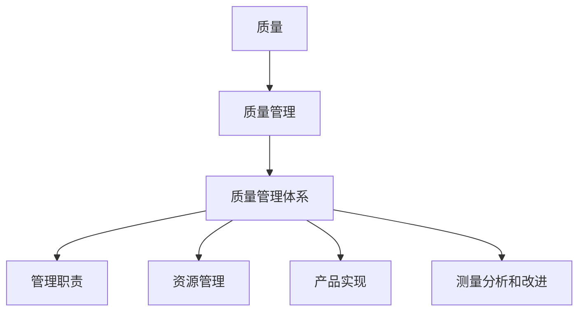

                 

质量在企业的成功中起着至关重要的作用，尤其在创业领域，质量管理体系的有效建立与持续改进更是确保企业快速发展的关键。本文旨在探讨质量管理体系在创业过程中的重要性，以及质量管理经理在其中应承担的职责和应采取的具体行动。

## 文章关键词

- 质量管理
- 创业
- 质量管理体系
- 持续改进
- 质量管理经理

## 文章摘要

本文首先介绍了质量管理体系在创业过程中的重要性，并分析了质量管理经理的职责。接着，文章详细探讨了质量管理体系建立的具体步骤，以及如何通过持续改进来提升企业的质量管理水平。最后，文章提出了质量管理体系在实际应用中的挑战和未来发展趋势。

## 1. 背景介绍

在当今竞争激烈的市场环境中，企业要想在市场中脱颖而出，必须具备高质量的产品和服务。质量不仅是企业竞争力的体现，更是企业生存和发展的基石。对于创业企业而言，由于资源有限，市场不稳定，更需要在产品质量上做到精益求精，以赢得客户的信任和支持。

质量管理体系是一个系统化的管理框架，旨在通过计划、实施、检查和改进等循环过程，确保产品和服务的高质量。它不仅能够提升企业的管理水平，还能够提高产品的市场竞争力，降低成本，增强客户满意度。

质量管理体系的标准，如ISO 9001，为企业提供了一套系统化的方法和工具，帮助企业在质量管理方面实现标准化和规范化。这些标准已经被全球范围内的众多企业所采用，证明了其在提升企业质量管理水平方面的有效性。

## 2. 核心概念与联系

在探讨质量管理体系之前，我们需要明确几个核心概念，如质量、质量管理、质量管理体系等。

### 2.1 质量

质量是指产品或服务满足规定或潜在要求的特征和特性的总和。这些特征和特性可以是性能、可靠性、安全性、可用性、耐用性、可维护性等。

### 2.2 质量管理

质量管理是指为了实现质量目标而进行的组织协调的活动。它包括质量策划、质量控制、质量保证和质量改进等。

### 2.3 质量管理体系

质量管理体系是一个组织的管理框架，旨在通过计划、实施、检查和改进等循环过程，确保产品和服务的高质量。它包括一系列相互关联的过程，如管理职责、资源管理、产品实现、测量分析和改进等。

下面是一个简单的 Mermaid 流程图，用于描述质量管理体系的核心概念和联系：



## 3. 质量管理经理的职责

质量管理经理在创业企业中扮演着至关重要的角色。他们需要承担以下职责：

### 3.1 制定质量策略

质量管理经理需要根据企业的愿景和目标，制定质量策略和规划，确保企业的质量目标和战略方向一致。

### 3.2 建立质量管理体系

质量管理经理需要根据国际标准，如ISO 9001，建立企业的质量管理体系，确保企业具备系统化的质量管理方法。

### 3.3 质量监控与改进

质量管理经理需要定期监控企业的质量状况，发现问题和不足，并采取有效的改进措施。

### 3.4 培训与指导

质量管理经理需要组织质量培训，提高员工的质量意识，确保他们能够正确理解和执行质量管理体系。

### 3.5 与其他部门的协作

质量管理经理需要与其他部门，如研发、生产、销售、客户服务等部门紧密协作，确保企业的质量策略和目标得以实现。

### 3.6 沟通与报告

质量管理经理需要定期向上级和管理层报告质量状况，确保管理层能够及时了解企业的质量情况，并作出相应的决策。

## 4. 建立质量管理体系的具体步骤

建立质量管理体系是一个系统化的过程，需要遵循以下步骤：

### 4.1 质量策划

质量策划是建立质量管理体系的起点，它包括确定企业的质量方针和目标，制定质量计划，确定所需的过程、活动和资源等。

### 4.2 资源管理

资源管理包括人力资源管理、基础设施管理、环境管理等方面。质量管理经理需要确保企业具备所需的人力、物力、财力等资源，以支持质量管理活动的开展。

### 4.3 产品实现

产品实现包括市场调研、需求分析、产品设计、生产制造、包装和交付等过程。质量管理经理需要确保这些过程的质量得到有效控制。

### 4.4 测量分析和改进

测量分析和改进是质量管理体系的持续改进环节。质量管理经理需要定期收集和分析质量数据，识别质量问题，并采取有效的改进措施。

### 4.5 检查与评估

检查与评估是质量管理体系的重要环节，它包括内部审核、管理评审等。质量管理经理需要确保企业的质量管理体系得到有效实施和持续改进。

## 5. 持续改进

持续改进是质量管理体系的核心，它要求企业不断寻求改进的机会，持续提升产品质量和服务水平。质量管理经理需要采取以下措施来实现持续改进：

### 5.1 建立改进机制

质量管理经理需要建立一套完善的改进机制，包括问题识别、分析、解决和跟踪等环节。

### 5.2 鼓励员工参与

质量管理经理需要鼓励员工积极参与改进活动，提供必要的培训和资源支持。

### 5.3 利用数据驱动改进

质量管理经理需要利用数据驱动改进，通过数据分析和统计工具，识别质量改进的机会和方向。

### 5.4 建立反馈机制

质量管理经理需要建立有效的反馈机制，收集客户、员工和其他利益相关者的反馈，及时调整和改进质量管理策略。

## 6. 质量管理体系在实际应用中的挑战

尽管质量管理体系在提升企业管理水平方面具有显著作用，但在实际应用中仍面临一些挑战：

### 6.1 领导层的支持

质量管理体系的有效实施需要企业领导层的支持和重视，但在创业企业中，领导层往往更加关注短期业绩和市场份额，可能忽视质量管理体系的重要性。

### 6.2 员工的参与度

质量管理体系的实施需要全体员工的参与和支持，但在创业企业中，员工往往需要应对繁重的工作任务，可能缺乏时间和精力参与质量管理活动。

### 6.3 数据收集与分析

质量管理体系的持续改进需要大量的数据支持，但在创业企业中，数据收集和分析可能存在一定的困难，如数据质量不高、数据分析工具不足等。

## 7. 未来发展趋势与挑战

随着市场竞争的加剧和消费者对产品质量要求的提高，质量管理体系在创业企业中的重要性将越来越受到关注。未来，质量管理体系将朝着以下方向发展：

### 7.1 更加数字化和智能化

随着大数据、人工智能等技术的不断发展，质量管理体系将更加数字化和智能化，通过数据分析和人工智能技术，实现质量管理的自动化和精细化。

### 7.2 更加客户化

随着消费者个性化需求的增加，质量管理体系将更加注重客户需求和满意度，通过定制化服务和技术创新，提升产品质量和服务水平。

### 7.3 更加全球化

随着全球化进程的加速，质量管理体系将更加注重跨国界的协同与合作，通过建立国际化的质量管理标准，提升企业的全球竞争力。

## 8. 总结

质量管理体系是创业企业成功的关键之一，它能够提升企业的管理水平，提高产品质量和服务水平，降低成本，增强客户满意度。质量管理经理在建立和持续改进质量管理体系过程中扮演着重要角色，需要承担一系列职责和采取具体行动。未来，质量管理体系将朝着数字化、智能化、客户化和全球化的方向发展，为创业企业的发展提供更加有力的支持。

## 9. 附录：常见问题与解答

### 问题1：创业企业是否需要建立质量管理体系？

回答：是的，创业企业同样需要建立质量管理体系。尽管资源有限，但通过质量管理体系，企业可以确保产品和服务的高质量，提高市场竞争力，降低成本，增强客户满意度。

### 问题2：质量管理经理在创业企业中的职责是什么？

回答：质量管理经理在创业企业中的职责包括制定质量策略、建立质量管理体系、质量监控与改进、培训与指导、与其他部门的协作以及沟通与报告等。

### 问题3：如何持续改进质量管理体系？

回答：持续改进质量管理体系需要建立改进机制、鼓励员工参与、利用数据驱动改进以及建立反馈机制。通过这些措施，企业可以不断寻求改进的机会，持续提升产品质量和服务水平。

## 作者署名

作者：禅与计算机程序设计艺术 / Zen and the Art of Computer Programming

---

文章撰写完毕，以下为文章的Markdown格式代码：

```markdown
# 质量管理经理的创业职责：建立质量管理体系与持续改进

> 关键词：质量管理、创业、质量管理体系、持续改进、质量管理经理

> 摘要：本文探讨了质量管理体系在创业过程中的重要性，分析了质量管理经理的职责，并详细介绍了建立和持续改进质量管理体系的具体步骤。

## 1. 背景介绍

## 2. 核心概念与联系

### 2.1 质量
### 2.2 质量管理
### 2.3 质量管理体系


## 3. 质量管理经理的职责

### 3.1 制定质量策略
### 3.2 建立质量管理体系
### 3.3 质量监控与改进
### 3.4 培训与指导
### 3.5 与其他部门的协作
### 3.6 沟通与报告

## 4. 建立质量管理体系的具体步骤

### 4.1 质量策划
### 4.2 资源管理
### 4.3 产品实现
### 4.4 测量分析和改进
### 4.5 检查与评估

## 5. 持续改进

### 5.1 建立改进机制
### 5.2 鼓励员工参与
### 5.3 利用数据驱动改进
### 5.4 建立反馈机制

## 6. 质量管理体系在实际应用中的挑战

### 6.1 领导层的支持
### 6.2 员工的参与度
### 6.3 数据收集与分析

## 7. 未来发展趋势与挑战

### 7.1 更加数字化和智能化
### 7.2 更加客户化
### 7.3 更加全球化

## 8. 总结

## 9. 附录：常见问题与解答

### 问题1：创业企业是否需要建立质量管理体系？
### 问题2：质量管理经理在创业企业中的职责是什么？
### 问题3：如何持续改进质量管理体系？

## 作者署名

作者：禅与计算机程序设计艺术 / Zen and the Art of Computer Programming
```

