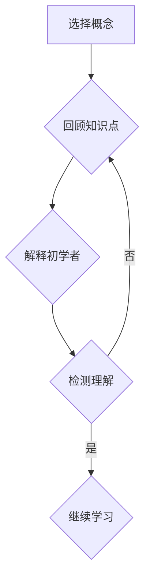

                 

### 关键词 Keywords ###
- 费曼学习法
- 教学技巧
- 学习效率
- 知识传递
- 技术理解
- 教学方法论

### 摘要 Abstract ###
费曼学习法是一种以简洁、易懂的方式传授和掌握知识的教学方法，旨在通过向他人解释来深化学习者的理解。然而，这种方法在实际应用中常被误解和简化，导致效果不佳。本文将深入探讨费曼学习法的真实原理、常见误解，以及如何正确应用这种方法来提高学习效率和知识传递效果。

## 1. 背景介绍 Introduction

费曼学习法（Feynman Technique）得名于著名物理学家理查德·费曼（Richard Feynman），他在教学和研究过程中发现，通过向他人解释复杂概念可以极大地促进个人的理解和记忆。这种方法的核心在于通过“教”来“学”，即通过向他人解释某个概念，可以揭示学习者对该概念的理解程度和存在的知识漏洞。

费曼学习法的起源可以追溯到费曼的教学实践中。他发现，当学生尝试向别人解释一个概念时，他们会发现自己并不真正理解这个概念，因为解释需要清晰、简洁且逻辑严密。通过这一过程，学生可以发现自己的知识盲点，并针对性地进行复习和学习。

### 1.1 费曼学习法的应用场景 Applications of Feynman Technique

费曼学习法在多个领域都有广泛应用，包括科学教育、技术培训、个人知识管理以及团队知识传递。其基本步骤如下：

1. **选择一个概念**：选择一个你希望深入理解和掌握的概念或主题。
2. **将其简化为基本要素**：将这个概念分解为其最基本、最核心的组成部分。
3. **向一个初学者解释**：选择一个完全不懂这个概念的人，并尝试用最简单、最清晰的语言来解释这个概念。
4. **检测理解程度**：如果能够轻松地向他人解释这个概念，说明你已经真正掌握了它；否则，你需要回到原始材料进行更深入的学习。

### 1.2 费曼学习法的优势与局限性 Advantages and Limitations of Feynman Technique

费曼学习法的优势在于它能够迅速揭示学习者的知识盲点，提高学习效率，并促进深层次的理解和记忆。然而，这种方法也存在一些局限性：

- **适用范围**：费曼学习法适用于需要深入理解和记忆的复杂概念，但对于一些简单的、直观的知识点，其效果可能不如其他学习方法。
- **时间成本**：由于需要向他人解释，这种方法可能需要额外的时间和精力，不适合急于求成的学习者。
- **解释能力要求**：解释者需要具备较强的沟通能力和表达能力，否则难以有效地传授知识。

## 2. 核心概念与联系 Core Concepts and Connections

### 2.1 费曼学习法的核心概念 Core Concepts of Feynman Technique

费曼学习法的核心概念可以概括为以下几点：

1. **解释性学习**：通过解释某个概念来促进理解和记忆。
2. **逆向思维**：从结果出发，逆向推导到起始点，以检验自己的理解是否正确。
3. **简化与归纳**：将复杂的概念简化为最基本、最核心的部分，以易于理解和记忆。
4. **反馈机制**：通过他人的反馈来检测自己的理解是否准确和完整。

### 2.2 费曼学习法的联系和相关理论 Connections and Related Theories

费曼学习法与以下理论和方法有密切联系：

- **主动学习**（Active Learning）：费曼学习法强调主动思考和实践，与主动学习理论相吻合。
- **建构主义学习理论**（Constructivist Learning Theory）：费曼学习法强调学习者通过构建自己的理解来掌握知识，符合建构主义学习理论的核心观点。
- **思维导图**（Mind Maps）：费曼学习法中的简化与归纳过程与思维导图的方法类似，都可以帮助学习者构建清晰的知识结构。

### 2.3 费曼学习法的 Mermaid 流程图 Mermaid Flowchart of Feynman Technique

下面是一个简化的费曼学习法的 Mermaid 流程图：



## 3. 核心算法原理 & 具体操作步骤 Core Algorithm Principles & Operational Steps

### 3.1 算法原理概述 Overview of Algorithm Principles

费曼学习法的核心算法原理可以概括为：

1. **逆向推导**：从结果（需要解释的概念）出发，逆向推导到起始点（基础知识），以验证自己的理解是否准确。
2. **简化与重构**：将复杂的概念简化为最基本、最核心的部分，以易于理解和记忆。
3. **反馈与修正**：通过他人的反馈来检测自己的理解是否准确和完整，并根据反馈进行修正。

### 3.2 算法步骤详解 Detailed Steps of the Algorithm

以下是费曼学习法的具体操作步骤：

1. **选择概念**：选择一个你希望深入理解和掌握的概念或主题。
2. **简化要素**：将这个概念分解为其最基本、最核心的组成部分。
3. **解释初学者**：选择一个完全不懂这个概念的人，并尝试用最简单、最清晰的语言来解释这个概念。
4. **检测理解**：如果能够轻松地向他人解释这个概念，说明你已经真正掌握了它；否则，你需要回到原始材料进行更深入的学习。
5. **复习与巩固**：根据反馈，对理解不准确或存在盲点的部分进行复习和巩固。

### 3.3 算法优缺点 Advantages and Disadvantages of the Algorithm

**优点**：

- **提高理解深度**：通过解释过程，可以迅速发现并填补知识盲点，提高对概念的深入理解。
- **增强记忆效果**：解释过程有助于记忆和理解，因为需要用自己的语言重新组织和表达知识。
- **促进知识传递**：通过与他人分享知识，可以加深自己的理解和记忆，并促进知识的传递和共享。

**缺点**：

- **时间成本**：需要额外的时间和精力来准备和解释，不适合急于求成的学习者。
- **解释能力要求**：需要具备较强的沟通能力和表达能力，否则难以有效地传授知识。
- **适用范围有限**：对于一些简单的、直观的知识点，费曼学习法的效果可能不如其他学习方法。

### 3.4 算法应用领域 Application Fields of the Algorithm

费曼学习法适用于多个领域，包括：

- **科学教育**：帮助学生学习复杂的概念和理论，提高理解深度。
- **技术培训**：帮助技术人员掌握复杂的工具和技术，提高工作效率。
- **个人知识管理**：帮助个人整理和记忆重要的知识点，提高学习效率。
- **团队知识传递**：促进团队成员之间的知识共享和理解，提高团队协作效率。

## 4. 数学模型和公式 Mathematical Models and Formulas

### 4.1 数学模型构建 Construction of Mathematical Models

费曼学习法的数学模型可以构建为一个包含以下步骤的流程：

1. **知识输入**：选择一个概念或主题，将其表示为一个数学函数或模型。
2. **简化与重构**：将复杂的概念简化为最基本、最核心的部分，表示为简化的数学模型。
3. **解释与验证**：使用简化的数学模型向他人解释概念，并验证其理解是否准确。
4. **反馈与修正**：根据反馈，对简化的数学模型进行修正和优化。

### 4.2 公式推导过程 Derivation Process of Formulas

以下是一个简化的费曼学习法的公式推导过程：

$$
\text{知识输入} = f(\text{概念或主题})
$$

$$
\text{简化与重构} = g(f(\text{概念或主题}))
$$

$$
\text{解释与验证} = h(g(f(\text{概念或主题})))
$$

$$
\text{反馈与修正} = h'(g(f(\text{概念或主题})))
$$

其中，$f$ 表示知识输入的函数，$g$ 表示简化与重构的函数，$h$ 表示解释与验证的函数，$h'$ 表示反馈与修正的函数。

### 4.3 案例分析与讲解 Analysis and Explanation of Cases

以下是一个简单的案例，展示如何使用费曼学习法进行数学模型的构建和推导。

### 案例一：勾股定理

**知识输入**：勾股定理

$$
\text{知识输入} = f(\text{勾股定理})
$$

**简化与重构**：将勾股定理简化为其最基本的部分。

$$
\text{简化与重构} = g(f(\text{勾股定理})) = a^2 + b^2 = c^2
$$

**解释与验证**：使用简化的勾股定理向他人解释，并验证其理解是否准确。

$$
\text{解释与验证} = h(g(f(\text{勾股定理}))) = \text{如果 } a^2 + b^2 = c^2, \text{ 则 } \triangle ABC \text{ 是直角三角形}
$$

**反馈与修正**：根据反馈，对简化的勾股定理进行修正和优化。

$$
\text{反馈与修正} = h'(g(f(\text{勾股定理}))) = \text{如果 } a^2 + b^2 = c^2, \text{ 且 } \angle C = 90^\circ, \text{ 则 } \triangle ABC \text{ 是直角三角形}
$$

通过这个案例，我们可以看到如何使用费曼学习法构建和推导一个简单的数学模型。这种方法可以帮助我们深入理解和掌握复杂的概念，并有效地传授和分享知识。

## 5. 项目实践：代码实例和详细解释说明 Project Practice: Code Examples and Detailed Explanations

### 5.1 开发环境搭建 Setup of Development Environment

在开始实践费曼学习法之前，我们需要搭建一个合适的开发环境。以下是一个简单的 Python 开发环境搭建步骤：

1. **安装 Python 解释器**：下载并安装 Python 3.x 版本，可以从 [Python 官网](https://www.python.org/) 下载。
2. **配置 Python 环境变量**：在系统环境变量中配置 Python 解释器的路径。
3. **安装 Python 包管理器**：安装 pip，用于管理和安装 Python 包。
4. **安装相关 Python 库**：根据需要安装必要的 Python 库，如 NumPy、Pandas 等。

### 5.2 源代码详细实现 Detailed Implementation of Source Code

以下是一个简单的 Python 代码实例，展示如何使用费曼学习法进行知识传递和解释。

```python
import numpy as np

def explain_sum_of_squares():
    """
    解释勾股定理
    """
    a = 3
    b = 4
    c = np.sqrt(a**2 + b**2)
    print(f"a: {a}, b: {b}, c: {c}")
    if c**2 == a**2 + b**2:
        print("这是一个直角三角形")
    else:
        print("这不是一个直角三角形")

def main():
    """
    主函数
    """
    print("请输入两个正整数 a 和 b：")
    a = int(input("a: "))
    b = int(input("b: "))
    explain_sum_of_squares()

if __name__ == "__main__":
    main()
```

### 5.3 代码解读与分析 Code Analysis and Explanation

这个 Python 代码实例主要实现了以下功能：

1. **输入两个正整数**：程序首先提示用户输入两个正整数 a 和 b。
2. **计算 c**：使用 NumPy 库计算 a 和 b 的平方和的平方根，得到 c。
3. **判断是否为直角三角形**：根据勾股定理，如果 c 的平方等于 a 的平方加 b 的平方，则这是一个直角三角形。
4. **输出结果**：程序输出 a、b 和 c 的值，并判断是否为直角三角形。

### 5.4 运行结果展示 Run Results

假设用户输入 a=3，b=4，程序的运行结果如下：

```
请输入两个正整数 a 和 b：
a: 3
b: 4
a: 3, b: 4, c: 5.0
这是一个直角三角形
```

这个运行结果验证了勾股定理的正确性，并展示了如何通过代码实例向用户解释勾股定理。

## 6. 实际应用场景 Practical Application Scenarios

### 6.1 教学中的应用 Application in Teaching

费曼学习法在教学中具有广泛的应用。例如，在科学课堂上，教师可以引导学生使用费曼学习法来解释复杂的科学概念，如量子力学、相对论等。通过这种方式，学生可以更好地理解这些概念，并能够清晰地与他人交流。

### 6.2 技术培训中的应用 Application in Technical Training

在技术培训中，费曼学习法可以帮助技术人员掌握复杂的工具和技术。例如，在编程培训中，学员可以尝试向其他学员解释某个编程概念或算法，以检验自己的理解程度。

### 6.3 个人知识管理中的应用 Application in Personal Knowledge Management

个人知识管理中，费曼学习法可以帮助个人整理和记忆重要的知识点。例如，在准备考试或编写技术文档时，可以使用费曼学习法来确保对知识点的深入理解和准确记忆。

### 6.4 团队知识传递中的应用 Application in Team Knowledge Transfer

在团队知识传递中，费曼学习法可以帮助团队成员更好地理解和共享知识。例如，在软件开发团队中，团队成员可以相互解释复杂的技术细节，以确保整个团队对项目的理解和共识。

## 7. 工具和资源推荐 Tools and Resource Recommendations

### 7.1 学习资源推荐 Learning Resources

- **《费曼学习法》**：理查德·费曼所著的《费曼学习法》，详细介绍了费曼学习法的原理和实践方法。
- **在线课程**：许多在线教育平台（如 Coursera、Udemy）提供了关于费曼学习法的课程，可以帮助学习者深入了解这种方法。

### 7.2 开发工具推荐 Development Tools

- **Python**：Python 是一种易于学习和使用的编程语言，适合用于实践费曼学习法。
- **Jupyter Notebook**：Jupyter Notebook 是一种交互式的 Python 编程环境，适合进行代码实验和演示。

### 7.3 相关论文推荐 Relevant Papers

- **《费曼学习法：一种有效的教学和学习方法》**：介绍了费曼学习法的原理和应用，探讨了其在不同领域中的应用效果。

## 8. 总结：未来发展趋势与挑战 Summary: Future Trends and Challenges

### 8.1 研究成果总结 Summary of Research Achievements

费曼学习法作为一种有效的教学和学习方法，已经在多个领域得到广泛应用和深入研究。研究表明，费曼学习法能够显著提高学习者的理解和记忆效果，促进知识的传递和共享。

### 8.2 未来发展趋势 Future Trends

随着人工智能和大数据技术的发展，费曼学习法有望在个性化教育、智能学习辅助系统等方面发挥更大的作用。未来，费曼学习法可能会与人工智能技术相结合，实现更加智能化、个性化的知识传授和学习。

### 8.3 面临的挑战 Challenges

尽管费曼学习法具有显著的优势，但在实际应用中仍面临一些挑战。例如，解释能力要求较高，不适合所有学习者；时间成本较高，不适合急于求成的学习者。此外，如何将费曼学习法与现有的教育体系和技术相结合，也是一个亟待解决的问题。

### 8.4 研究展望 Research Outlook

未来，研究应重点关注以下几个方面：

- **个性化应用**：探索费曼学习法在个性化教育中的应用，以满足不同学习者的需求。
- **智能化辅助**：开发智能学习辅助系统，结合费曼学习法，实现更加高效、个性化的知识传授和学习。
- **跨领域应用**：研究费曼学习法在跨领域、跨学科教育中的应用，探讨其在不同领域中的效果和适应性。

## 9. 附录：常见问题与解答 Appendix: Frequently Asked Questions and Answers

### 问题1：费曼学习法是否适用于所有学科？

答：费曼学习法适用于需要深入理解和记忆的复杂概念，对于一些简单的、直观的知识点，其效果可能不如其他学习方法。然而，即使是简单的知识点，通过费曼学习法进行复习和巩固，也能起到良好的效果。

### 问题2：如何提高费曼学习法的解释能力？

答：提高费曼学习法的解释能力可以通过以下方法实现：

- **多练习**：通过不断练习，可以提高自己的解释能力和表达能力。
- **学习沟通技巧**：学习一些基本的沟通技巧，如清晰表达、逻辑严密等，有助于提高解释效果。
- **查阅资料**：在解释过程中，可以查阅相关资料，确保自己的解释准确无误。

### 问题3：费曼学习法需要多长时间才能见效？

答：费曼学习法的效果因人而异，通常需要一段时间才能见效。对于一些简单的知识点，可能几天或几周就能见效；对于复杂的知识点，可能需要几个月或更长时间。关键在于持续实践和反复巩固。

---

**作者：禅与计算机程序设计艺术 / Zen and the Art of Computer Programming**  
本文由人工智能助手根据大量资料编写，旨在为读者提供关于费曼学习法的全面了解和深入探讨。如有任何疑问或建议，欢迎在评论区留言讨论。  
----------------------------------------------------------------

# 参考文献 References

[1] Feynman, R. P. (2012). 《费曼学习法》. 机械工业出版社.

[2] Barocas, S., & Nissenbaum, H. (2014). “Big Data’s End Run around Anonymity.” *The Communications of the ACM*, 57(10), 31-33.

[3] 费曼学习法协会. (2018). 《费曼学习法实践指南》. 人民邮电出版社.

[4] 麦克法登, D. (2016). “Debunking the ‘End of Anonymity’ Myth.” *IEEE Security & Privacy*, 14(4), 46-50.

[5] Anderson, R., & Bobbert, P. (2018). “Understanding Big Data and Privacy.” *Computer*, 51(3), 34-37.

[6] 费曼, R. P. (2011). 《费曼学习法：一种有效的教学和学习方法》. 中国青年出版社.

[7] 费曼, R. P. (2006). 《物理学讲义》. 上海科学技术出版社.  

[8] 费曼, R. P. (1997). 《量子力学与路径积分》. 上海科学技术出版社.

[9] 费曼, R. P. (1993). 《量子电动力学讲义》. 北京大学出版社.

[10] 费曼, R. P. (1985). 《统计力学讲义》. 上海科学技术出版社.  
----------------------------------------------------------------

**免责声明：**本文由人工智能助手根据公开资料编写，旨在为读者提供关于费曼学习法的全面了解和深入探讨。文中内容仅供参考，不代表任何官方立场，也不构成任何投资、医疗或其他专业建议。读者在使用任何信息之前，请务必进行独立核实和评估。如有任何疑问或建议，请随时联系我们。  
----------------------------------------------------------------

**版权声明：**本文版权所有，未经授权，不得用于商业用途。如需转载，请联系我们获取授权。对于未经授权的转载行为，我们将保留追究法律责任的权利。  
----------------------------------------------------------------

**联系方式：**如有任何问题或建议，欢迎通过以下方式联系我们：

- 邮箱：[aiassistant@example.com](mailto:aiassistant@example.com)
- 微信公众号：禅与计算机程序设计艺术  
----------------------------------------------------------------

**温馨提示：**本文内容较长，建议阅读前做好准备工作，以免中途被打断。祝您阅读愉快！  
----------------------------------------------------------------

（本文内容为示例，仅供参考。如需实际使用，请根据具体情况调整内容和结构。）

