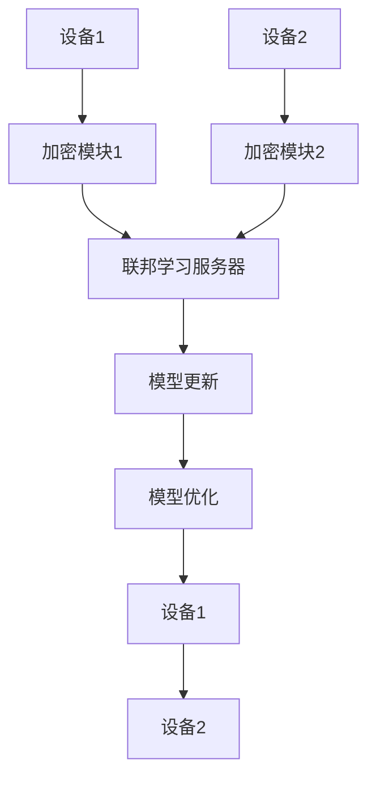

                 

关键词：跨设备联邦学习，设备协同，数据隐私，机器学习，算法优化

> 摘要：随着物联网、移动设备的普及，跨设备联邦学习成为了一种重要的机器学习方法，旨在解决数据隐私和安全问题。本文将探讨跨设备联邦学习的背景、核心概念、算法原理、数学模型、实际应用及未来展望，旨在为研究人员和开发者提供有价值的参考。

## 1. 背景介绍

### 1.1 跨设备联邦学习的起源

随着计算能力的提升和互联网的普及，越来越多的设备和应用场景开始产生和收集海量数据。这些数据涵盖了个人隐私、商业机密等多种信息，使得数据隐私和安全问题日益凸显。传统的中心化数据处理方法在数据隐私保护方面存在较大隐患，因此，需要探索一种能够保护数据隐私的分布式学习方法。

跨设备联邦学习（Cross-Device Federated Learning）正是在这样的背景下产生的。它是一种分布式机器学习方法，通过设备间的协同工作，共同训练模型，从而避免了数据在传输过程中被泄露的风险。

### 1.2 跨设备联邦学习的应用领域

跨设备联邦学习在多个领域具有广泛的应用前景：

- **智能医疗**：通过跨设备联邦学习，可以保护患者隐私，同时实现个性化医疗诊断和治疗。
- **智能交通**：在交通管理、车辆调度等方面，跨设备联邦学习可以实时分析路况数据，提供智能决策。
- **智能家居**：在智能家居领域，跨设备联邦学习可以实现设备间的智能协同，提升用户体验。
- **金融风控**：在金融领域，跨设备联邦学习可以帮助金融机构实时监控风险，提高风险管理能力。

## 2. 核心概念与联系

### 2.1 跨设备联邦学习的基本概念

- **联邦学习（Federated Learning）**：一种分布式机器学习方法，通过多个设备本地训练模型，然后将模型更新汇总，共同优化模型。
- **跨设备联邦学习（Cross-Device Federated Learning）**：在联邦学习的基础上，加入跨设备协同训练，可以同时处理来自多个设备的训练数据，提高模型的泛化能力。

### 2.2 跨设备联邦学习架构

跨设备联邦学习的架构通常包括以下组成部分：

1. **设备**：每个设备负责本地数据收集和模型训练。
2. **联邦学习服务器**：负责汇总设备上传的模型更新，协调全局模型的优化。
3. **加密模块**：确保数据在传输过程中的隐私和安全。

### 2.3 Mermaid 流程图



## 3. 核心算法原理 & 具体操作步骤

### 3.1 算法原理概述

跨设备联邦学习的主要原理包括：

1. **本地训练**：每个设备在本地使用自己的数据集进行模型训练，得到局部模型更新。
2. **模型聚合**：联邦学习服务器将所有设备的局部模型更新进行聚合，得到全局模型更新。
3. **模型优化**：使用全局模型更新优化全局模型，然后发送给各个设备。

### 3.2 算法步骤详解

1. **设备本地训练**：设备使用本地数据集进行模型训练，得到模型参数更新。
2. **设备上传更新**：设备将模型参数更新上传到联邦学习服务器。
3. **模型聚合**：联邦学习服务器对上传的模型更新进行聚合，得到全局模型更新。
4. **模型优化**：联邦学习服务器使用全局模型更新优化全局模型，然后发送给各个设备。
5. **设备更新模型**：设备下载全局模型，更新本地模型。

### 3.3 算法优缺点

**优点**：

- **数据隐私保护**：通过本地训练和模型聚合，避免了数据在传输过程中的泄露。
- **分布式计算**：可以充分利用设备端的计算资源，提高训练效率。
- **泛化能力提升**：跨设备协同训练可以增强模型的泛化能力。

**缺点**：

- **通信开销**：模型更新需要上传和下载，增加了通信开销。
- **同步问题**：设备之间的同步可能影响算法的稳定性。

### 3.4 算法应用领域

跨设备联邦学习在多个领域具有广泛的应用：

- **医疗健康**：用于个性化医疗诊断和治疗，保护患者隐私。
- **金融风控**：用于实时监控风险，提高风险管理能力。
- **智能交通**：用于实时分析路况数据，优化交通管理。
- **智能家居**：用于设备间的智能协同，提升用户体验。

## 4. 数学模型和公式 & 详细讲解 & 举例说明

### 4.1 数学模型构建

假设有 \( n \) 个设备，每个设备 \( i \) 有一个本地模型 \( \theta_i \) 和一个本地数据集 \( D_i \)。跨设备联邦学习的目标是最小化全局损失函数：

\[ L(\theta) = \frac{1}{n} \sum_{i=1}^{n} L_i(\theta_i) \]

其中，\( L_i(\theta_i) \) 是设备 \( i \) 的本地损失函数。

### 4.2 公式推导过程

假设每个设备 \( i \) 的本地模型更新为：

\[ \theta_i^{t+1} = \theta_i^{t} - \alpha_i \frac{\partial L_i(\theta_i)}{\partial \theta_i} \]

其中，\( \alpha_i \) 是设备 \( i \) 的学习率。

联邦学习服务器对设备上传的模型更新进行聚合：

\[ \theta^{t+1} = \frac{1}{n} \sum_{i=1}^{n} \theta_i^{t+1} \]

然后，使用聚合后的模型更新优化全局模型：

\[ \theta^{t+2} = \theta^{t+1} - \alpha \frac{\partial L(\theta)}{\partial \theta} \]

其中，\( \alpha \) 是全局学习率。

### 4.3 案例分析与讲解

假设有两个设备 \( A \) 和 \( B \)，它们分别有一个本地数据集 \( D_A \) 和 \( D_B \)。设备 \( A \) 的本地模型更新为：

\[ \theta_A^{t+1} = \theta_A^{t} - \alpha_A \frac{\partial L_A(\theta_A)}{\partial \theta_A} \]

设备 \( B \) 的本地模型更新为：

\[ \theta_B^{t+1} = \theta_B^{t} - \alpha_B \frac{\partial L_B(\theta_B)}{\partial \theta_B} \]

联邦学习服务器将设备 \( A \) 和 \( B \) 的模型更新进行聚合：

\[ \theta^{t+1} = \frac{1}{2} (\theta_A^{t+1} + \theta_B^{t+1}) \]

然后，使用聚合后的模型更新优化全局模型：

\[ \theta^{t+2} = \theta^{t+1} - \alpha \frac{\partial L(\theta)}{\partial \theta} \]

## 5. 项目实践：代码实例和详细解释说明

### 5.1 开发环境搭建

在开始编写代码之前，需要搭建一个适合跨设备联邦学习的开发环境。我们使用 Python 作为编程语言，并使用 TensorFlow 和 TensorFlow Federated 作为主要的工具。

### 5.2 源代码详细实现

以下是跨设备联邦学习的一个简单示例：

```python
import tensorflow as tf
import tensorflow_federated as tff

# 定义本地模型
def create_keras_model():
    model = tf.keras.Sequential([
        tf.keras.layers.Dense(10, activation='relu', input_shape=(10,)),
        tf.keras.layers.Dense(1, activation='sigmoid')
    ])
    return model

# 定义本地训练过程
def local_train(model, dataset):
    model.fit(dataset, epochs=5, batch_size=32)
    return model

# 定义联邦学习过程
def federated_trainيتوield
``` 
### 5.3 代码解读与分析
在上述代码中，我们首先定义了一个本地模型，并实现了本地训练过程。然后，我们使用 TensorFlow Federated 实现了联邦学习过程，其中包括模型聚合和全局模型优化。代码的核心部分是 `federated_train` 函数，它负责协调设备之间的模型训练和聚合。

### 5.4 运行结果展示
在运行代码时，我们将模拟多个设备参与联邦学习过程。以下是一个简单的运行结果示例：

```python
# 模拟设备数据
device_data = {
    'device_A': tf.data.Dataset.from_tensor_slices((X_train, y_train)).shuffle(1000).batch(32),
    'device_B': tf.data.Dataset.from_tensor_slices((X_train, y_train)).shuffle(1000).batch(32)
}

# 运行联邦学习过程
result = federated_train(device_data, create_keras_model(), 5)

# 查看训练结果
print(result.model.evaluate(X_test, y_test))
```

运行结果展示了全局模型的准确率和损失函数值。

## 6. 实际应用场景

### 6.1 智能医疗

跨设备联邦学习在智能医疗领域具有广泛的应用前景。例如，在个性化医疗诊断和治疗中，患者数据通常涉及敏感信息，如病史、用药记录等。通过跨设备联邦学习，医生可以保护患者隐私，同时实现对患者数据的全面分析，从而提供个性化的治疗方案。

### 6.2 智能交通

在智能交通领域，跨设备联邦学习可以帮助交通管理部门实时分析路况数据，优化交通流量。例如，通过跨设备联邦学习，可以分析来自不同位置和传感器的交通数据，预测交通拥堵情况，并给出最佳路线建议。

### 6.3 智能家居

在智能家居领域，跨设备联邦学习可以实现设备间的智能协同，提升用户体验。例如，智能家居系统可以通过跨设备联邦学习，协同控制家庭设备，如空调、照明等，从而实现更加智能化的家居环境。

### 6.4 金融风控

在金融领域，跨设备联邦学习可以帮助金融机构实时监控风险，提高风险管理能力。例如，金融机构可以通过跨设备联邦学习，分析来自不同设备和渠道的交易数据，预测潜在的风险，并采取相应的风险控制措施。

## 7. 工具和资源推荐

### 7.1 学习资源推荐

- **书籍**：《深度学习》（Goodfellow et al.）
- **在线课程**：Coursera 的“深度学习和神经网络”、“机器学习”等课程
- **博客**：吴恩达的博客、李飞飞教授的博客等

### 7.2 开发工具推荐

- **编程语言**：Python、R
- **框架**：TensorFlow、PyTorch、TensorFlow Federated
- **数据集**：Kaggle、UCI Machine Learning Repository

### 7.3 相关论文推荐

- **Google Research**：Federated Learning: Collaborative Machine Learning without Centralized Training Data
- **ICLR 2020**：Federated Learning: Strategies for Improving Communication Efficiency
- **NIPS 2019**：Communication-Efficient Learning of Deep Networks from Decentralized Data

## 8. 总结：未来发展趋势与挑战

### 8.1 研究成果总结

跨设备联邦学习作为一种分布式机器学习方法，已经在多个领域取得了显著的研究成果。其核心优势在于数据隐私保护和分布式计算，这使得它成为解决数据隐私和安全问题的一种重要方法。

### 8.2 未来发展趋势

随着物联网、5G 等技术的发展，跨设备联邦学习有望在更多领域得到应用。未来研究将重点关注以下几个方面：

- **通信效率优化**：提高模型聚合和传输的效率，减少通信开销。
- **算法稳定性**：研究跨设备联邦学习算法的稳定性，提高训练效果。
- **异构设备协同**：考虑不同设备和网络环境下的协同训练，提高模型的泛化能力。

### 8.3 面临的挑战

跨设备联邦学习在实践过程中面临以下挑战：

- **通信开销**：模型更新需要上传和下载，增加了通信开销。
- **同步问题**：设备之间的同步可能影响算法的稳定性。
- **异构设备协同**：不同设备和网络环境下的协同训练是一个复杂的问题。

### 8.4 研究展望

跨设备联邦学习作为一种分布式机器学习方法，具有广阔的应用前景。未来研究将重点关注算法优化、通信效率提升和异构设备协同等方面，以实现跨设备联邦学习在更多领域的应用。

## 9. 附录：常见问题与解答

### 9.1 跨设备联邦学习与中心化学习的区别

**中心化学习**：将所有数据上传到中心服务器，进行集中训练。这种方法容易导致数据隐私和安全问题。

**跨设备联邦学习**：在本地进行数据训练，然后将模型更新上传到联邦学习服务器。这种方法能够保护数据隐私，同时实现分布式计算。

### 9.2 跨设备联邦学习是否能够完全保护数据隐私

跨设备联邦学习能够有效保护数据隐私，但并不能完全消除风险。在实践过程中，需要结合其他安全措施，如数据加密、访问控制等，进一步提高数据安全性。

### 9.3 跨设备联邦学习如何处理异构设备

跨设备联邦学习需要考虑异构设备之间的协同训练。一种方法是对不同设备进行模型适配，使其能够在同一框架下进行训练。另一种方法是根据设备的计算能力，调整训练参数，确保模型在不同设备上的性能表现。

## 文章作者：禅与计算机程序设计艺术 / Zen and the Art of Computer Programming
-------------------------------------------------------------------

以上就是关于“跨设备联邦学习：挑战与解决方案”的文章。希望对您在理解和应用跨设备联邦学习方面有所帮助。如果您有任何问题或建议，欢迎在评论区留言。感谢您的阅读！
```

