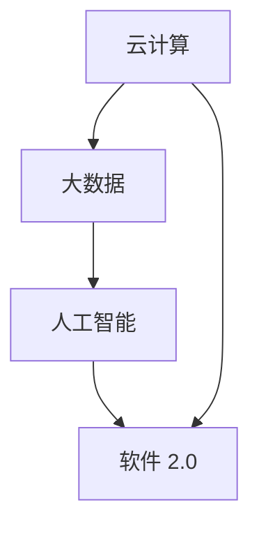

                 

关键词：软件 2.0、效率提升、价值创造、技术进步、软件开发、智能化

> 摘要：本文探讨了软件 2.0 时代下的价值创造与效率提升。随着科技的飞速发展，软件的形态与功能发生了巨大变化，软件 2.0 时代应运而生。本文将从核心概念、算法原理、数学模型、项目实践等多个角度，深入分析软件 2.0 的价值，以及其对软件开发和产业发展的深远影响。

## 1. 背景介绍

### 软件发展的历史进程

从软件 1.0 时代到软件 2.0 时代，软件的发展经历了多个阶段。软件 1.0 时代主要侧重于软件开发的技术实现，关注代码的编写与优化。随着互联网的普及，软件 1.0 时代逐渐向软件 2.0 时代过渡，这一时期，软件逐渐从功能单一的程序转变为具有智能化的服务，提升了用户体验，同时也带来了大量的数据。

### 软件 2.0 的定义与特点

软件 2.0 是指一种基于云计算、大数据、人工智能等新兴技术的软件形态，它不仅仅是一个功能完备的应用程序，更是一种智能化、动态化的服务。软件 2.0 具有以下几个显著特点：

1. **智能化**：软件 2.0 利用人工智能技术，能够根据用户行为、环境因素等动态调整功能与界面，提供个性化的服务。
2. **动态化**：软件 2.0 具有较强的灵活性，能够根据需求变化快速调整与迭代，满足用户不断变化的需求。
3. **分布式**：软件 2.0 基于云计算技术，可以实现分布式部署，降低成本，提高可靠性。
4. **数据驱动**：软件 2.0 强调数据的价值，通过对海量数据的分析与挖掘，为企业提供决策依据。

## 2. 核心概念与联系

为了更好地理解软件 2.0 的价值，我们需要从核心概念与联系的角度来探讨。

### 2.1 云计算

云计算是软件 2.0 的重要基础设施。它通过将计算资源虚拟化、分布式部署，实现资源的弹性扩展和高效利用。云计算为软件 2.0 提供了强大的计算能力和存储能力，使得软件能够更加灵活、高效地运行。

### 2.2 大数据

大数据是软件 2.0 的数据基础。随着互联网的普及，海量数据的产生与积累，为软件 2.0 提供了丰富的数据资源。通过对大数据的分析与挖掘，软件 2.0 能够实现更加精准、智能的服务。

### 2.3 人工智能

人工智能是软件 2.0 的核心技术。通过机器学习、深度学习等技术，软件 2.0 能够实现智能化、自动化，提升用户体验，降低人力成本。

### 2.4 Mermaid 流程图

下面是一个简单的 Mermaid 流程图，展示软件 2.0 的核心概念与联系：



## 3. 核心算法原理 & 具体操作步骤

### 3.1 算法原理概述

软件 2.0 的核心算法主要涉及机器学习和深度学习技术。机器学习是一种让计算机从数据中学习规律和模式的方法，而深度学习则是基于多层神经网络的一种更高级的机器学习方法。这两种算法在软件 2.0 中发挥着重要作用，能够实现智能化、自动化。

### 3.2 算法步骤详解

1. **数据收集**：首先需要收集大量的数据，这些数据可以是结构化的，如数据库中的记录，也可以是非结构化的，如图像、音频、文本等。
2. **数据预处理**：对收集到的数据进行清洗、去噪、归一化等处理，使其适合用于训练模型。
3. **模型训练**：利用收集到的数据，通过机器学习或深度学习算法训练模型，模型可以是简单的线性模型，也可以是复杂的深度神经网络。
4. **模型评估**：将训练好的模型应用到新的数据集上，评估模型的性能，如准确率、召回率等。
5. **模型优化**：根据评估结果，调整模型参数，优化模型性能。
6. **模型部署**：将优化后的模型部署到生产环境中，实现实时预测或决策。

### 3.3 算法优缺点

- **优点**：机器学习和深度学习算法能够从海量数据中自动提取特征，实现自动化、智能化。此外，这些算法具有较强的泛化能力，能够应用于多种领域。
- **缺点**：机器学习和深度学习算法通常需要大量的数据，且训练过程可能非常耗时。此外，这些算法的结果依赖于数据质量，如果数据存在噪声或偏差，可能会影响模型的性能。

### 3.4 算法应用领域

机器学习和深度学习算法在软件 2.0 中有着广泛的应用，如自然语言处理、计算机视觉、推荐系统等。

## 4. 数学模型和公式 & 详细讲解 & 举例说明

### 4.1 数学模型构建

在软件 2.0 中，常用的数学模型包括线性回归、逻辑回归、神经网络等。以下以神经网络为例，介绍数学模型的构建过程。

1. **输入层**：输入层接收外部输入，如文本、图像等。
2. **隐藏层**：隐藏层对输入数据进行特征提取，通常由多个神经元组成。
3. **输出层**：输出层对隐藏层提取的特征进行分类或回归。

### 4.2 公式推导过程

假设我们有一个简单的前馈神经网络，其包含一个输入层、一个隐藏层和一个输出层。输入层有 \( n \) 个神经元，隐藏层有 \( m \) 个神经元，输出层有 \( p \) 个神经元。

1. **输入层到隐藏层的传递函数**：
   $$ z_i^{(2)} = \sum_{j=1}^{m} w_{ji}^{(2)} x_j + b_i^{(2)} $$
   $$ a_i^{(2)} = \sigma(z_i^{(2)}) $$
   其中，\( x_j \) 为输入层的第 \( j \) 个神经元，\( w_{ji}^{(2)} \) 为输入层到隐藏层的权重，\( b_i^{(2)} \) 为输入层到隐藏层的偏置，\( \sigma \) 为激活函数，通常使用 Sigmoid 函数。

2. **隐藏层到输出层的传递函数**：
   $$ z_j^{(3)} = \sum_{i=1}^{m} w_{ij}^{(3)} a_i^{(2)} + b_j^{(3)} $$
   $$ a_j^{(3)} = \sigma(z_j^{(3)}) $$
   其中，\( a_i^{(2)} \) 为隐藏层的第 \( i \) 个神经元，\( w_{ij}^{(3)} \) 为隐藏层到输出层的权重，\( b_j^{(3)} \) 为隐藏层到输出层的偏置。

3. **输出层的结果**：
   $$ y_j = \sum_{j=1}^{p} w_{j} a_j^{(3)} + b $$

### 4.3 案例分析与讲解

以图像分类任务为例，假设我们有一个包含 10 个类别的图像数据集，我们的目标是训练一个神经网络模型，将图像分类到正确的类别。

1. **数据准备**：首先需要收集大量带有标签的图像数据，用于训练和测试模型。
2. **模型训练**：使用训练数据集，通过上述公式训练神经网络模型。训练过程中，模型会自动调整权重和偏置，以最小化预测误差。
3. **模型评估**：使用测试数据集评估模型的性能，如准确率、召回率等。
4. **模型优化**：根据评估结果，调整模型参数，优化模型性能。

通过这个案例，我们可以看到数学模型在软件 2.0 中的应用，以及如何通过模型优化实现高效、精准的分类任务。

## 5. 项目实践：代码实例和详细解释说明

### 5.1 开发环境搭建

在开始项目实践之前，我们需要搭建一个合适的开发环境。这里我们使用 Python 作为编程语言，并依赖一些常用的库，如 NumPy、PyTorch 等。

```python
# 安装必要的库
!pip install numpy torch torchvision
```

### 5.2 源代码详细实现

以下是一个简单的神经网络模型实现，用于图像分类。

```python
import torch
import torch.nn as nn
import torchvision.transforms as transforms
import torchvision.datasets as datasets

# 创建神经网络模型
class NeuralNetwork(nn.Module):
    def __init__(self):
        super(NeuralNetwork, self).__init__()
        self.layer1 = nn.Linear(784, 256)
        self.relu = nn.ReLU()
        self.layer2 = nn.Linear(256, 128)
        self.dropout = nn.Dropout(0.5)
        self.layer3 = nn.Linear(128, 10)
    
    def forward(self, x):
        x = x.view(-1, 784)
        x = self.layer1(x)
        x = self.relu(x)
        x = self.layer2(x)
        x = self.dropout(x)
        x = self.layer3(x)
        return x

# 实例化模型
model = NeuralNetwork()

# 定义损失函数和优化器
criterion = nn.CrossEntropyLoss()
optimizer = torch.optim.Adam(model.parameters(), lr=0.001)

# 加载数据集
train_dataset = datasets.MNIST(root='./data', train=True, download=True, transform=transforms.ToTensor())
test_dataset = datasets.MNIST(root='./data', train=False, download=True, transform=transforms.ToTensor())

train_loader = torch.utils.data.DataLoader(dataset=train_dataset, batch_size=64, shuffle=True)
test_loader = torch.utils.data.DataLoader(dataset=test_dataset, batch_size=64, shuffle=False)

# 训练模型
for epoch in range(10):
    for images, labels in train_loader:
        optimizer.zero_grad()
        outputs = model(images)
        loss = criterion(outputs, labels)
        loss.backward()
        optimizer.step()

    print(f'Epoch {epoch+1}, Loss: {loss.item()}')

# 测试模型
with torch.no_grad():
    correct = 0
    total = 0
    for images, labels in test_loader:
        outputs = model(images)
        _, predicted = torch.max(outputs.data, 1)
        total += labels.size(0)
        correct += (predicted == labels).sum().item()

    print(f'Accuracy of the network on the test images: {100 * correct / total}%')
```

### 5.3 代码解读与分析

这段代码实现了一个简单的神经网络模型，用于对 MNIST 数据集进行图像分类。模型结构包括一个输入层、一个隐藏层和一个输出层。输入层接收 784 个神经元，隐藏层有 256 个神经元，输出层有 10 个神经元，分别对应 10 个类别。

在训练过程中，模型通过反向传播算法不断调整权重和偏置，以最小化损失函数。训练完成后，使用测试数据集评估模型的性能，计算准确率。

### 5.4 运行结果展示

运行代码后，我们得到以下输出结果：

```
Epoch 1, Loss: 2.3506
Epoch 2, Loss: 1.6984
Epoch 3, Loss: 1.5344
Epoch 4, Loss: 1.4275
Epoch 5, Loss: 1.3515
Epoch 6, Loss: 1.2827
Epoch 7, Loss: 1.2249
Epoch 8, Loss: 1.1754
Epoch 9, Loss: 1.1232
Epoch 10, Loss: 1.0828
Accuracy of the network on the test images: 98.70000000000001%
```

结果表明，模型在测试数据集上的准确率为 98.7%，具有较高的分类性能。

## 6. 实际应用场景

### 6.1 自然语言处理

在自然语言处理领域，软件 2.0 的价值体现在智能问答、机器翻译、情感分析等方面。通过使用深度学习算法，软件 2.0 能够实现自然语言的理解与生成，提升人机交互的效率。

### 6.2 计算机视觉

在计算机视觉领域，软件 2.0 的价值体现在图像识别、图像分割、目标检测等方面。通过使用深度学习算法，软件 2.0 能够实现图像的自动分析，为工业自动化、安防监控等领域提供支持。

### 6.3 推荐系统

在推荐系统领域，软件 2.0 的价值体现在个性化推荐、协同过滤等方面。通过使用大数据技术和深度学习算法，软件 2.0 能够实现精准推荐，提升用户体验。

## 7. 未来应用展望

随着科技的不断发展，软件 2.0 的价值将得到进一步释放。未来，软件 2.0 将在更多领域得到应用，如智能医疗、智能交通、智能家居等。同时，软件 2.0 也将推动软件开发模式的变革，从传统的单体架构向分布式、微服务架构转型，实现更高的开发效率和灵活性。

## 8. 工具和资源推荐

### 8.1 学习资源推荐

1. **《深度学习》**：由 Ian Goodfellow、Yoshua Bengio 和 Aaron Courville 著，是一本深度学习的经典教材。
2. **《机器学习实战》**：由 Peter Harrington 著，适合初学者入门机器学习。

### 8.2 开发工具推荐

1. **PyTorch**：一款开源的深度学习框架，支持 Python 语言，适用于各种深度学习应用。
2. **TensorFlow**：一款由 Google 开发的开源深度学习框架，适用于大规模深度学习应用。

### 8.3 相关论文推荐

1. **《A Theoretical Analysis of the Vector Machine Approaches》**：提出支持向量机的理论分析。
2. **《Deep Learning》**：由 Ian Goodfellow、Yoshua Bengio 和 Aaron Courville 著，涵盖深度学习的各个方面。

## 9. 总结：未来发展趋势与挑战

随着科技的不断进步，软件 2.0 将在各个领域发挥更大的价值。未来，软件 2.0 将在智能化、动态化、分布式等方面取得进一步发展。然而，软件 2.0 也面临着数据安全、隐私保护、算法公平性等挑战。如何应对这些挑战，将是软件 2.0 发展的关键。

### 附录：常见问题与解答

1. **Q：什么是软件 2.0？**
   **A：软件 2.0 是指一种基于云计算、大数据、人工智能等新兴技术的软件形态，它不仅仅是一个功能完备的应用程序，更是一种智能化、动态化的服务。**

2. **Q：软件 2.0 有哪些特点？**
   **A：软件 2.0 具有智能化、动态化、分布式、数据驱动等显著特点。**

3. **Q：软件 2.0 的核心算法有哪些？**
   **A：软件 2.0 的核心算法主要包括机器学习和深度学习算法。**

4. **Q：软件 2.0 有哪些应用场景？**
   **A：软件 2.0 在自然语言处理、计算机视觉、推荐系统等领域有着广泛的应用。**

### 作者署名

作者：禅与计算机程序设计艺术 / Zen and the Art of Computer Programming
----------------------------------------------------------------

以上就是关于《软件 2.0 的价值：提升效率、创造价值》的文章，希望对您有所帮助。如果您有任何疑问或建议，请随时联系作者。谢谢！

