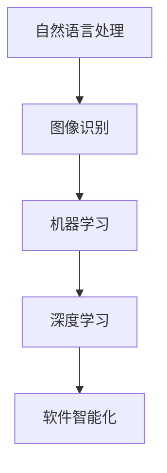
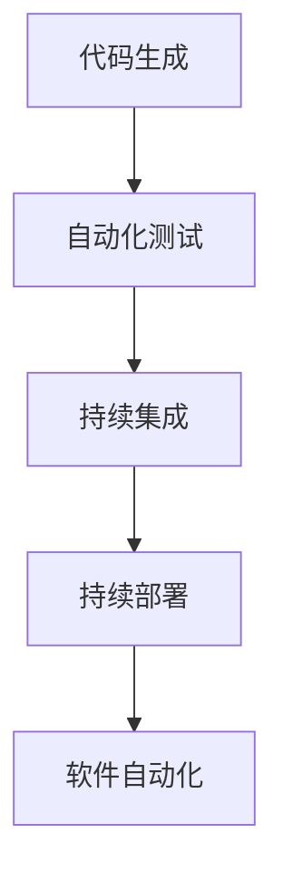
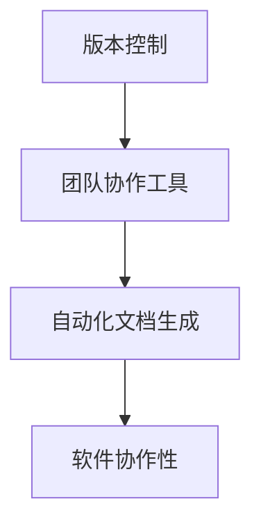

                 

关键词：软件2.0、效率提升、价值创造、人工智能、软件开发、软件架构

摘要：随着人工智能技术的快速发展，软件2.0时代已经到来。本文将探讨软件2.0的价值，包括提升效率和创造价值两个方面，并深入分析其背后的核心概念、算法原理、数学模型、项目实践以及未来发展趋势。

## 1. 背景介绍

随着计算机技术的发展，软件行业经历了多个阶段，从最初的系统软件，到应用软件，再到现在的互联网和移动应用。然而，随着人工智能技术的崛起，软件行业正迎来新的变革，即软件2.0时代。软件2.0不同于传统的软件开发，它更强调智能化、自动化和协作性，通过大数据、机器学习和人工智能技术，实现软件的智能化和自我优化。

软件2.0的价值主要体现在提升效率和创造价值两个方面。首先，软件2.0通过智能化和自动化，大幅提高了软件开发的效率，减少了人力成本和时间成本。其次，软件2.0能够通过数据分析和人工智能技术，为企业和个人创造更多的价值，包括商业决策支持、个性化推荐、智能服务等方面。

## 2. 核心概念与联系

### 2.1 软件智能化

软件智能化是软件2.0的核心概念之一，它是指通过人工智能技术，使软件具备类似人类智能的能力。软件智能化包括自然语言处理、图像识别、机器学习、深度学习等多个方面。

#### Mermaid 流程图：



### 2.2 软件自动化

软件自动化是软件2.0的另一个核心概念，它通过自动化工具和流程，减少人工干预，提高软件开发和维护的效率。软件自动化包括代码生成、自动化测试、持续集成和持续部署等方面。

#### Mermaid 流程图：



### 2.3 软件协作性

软件协作性是指软件能够支持多人协作开发、测试、部署和维护，提高团队协作效率。软件协作性包括版本控制、团队协作工具、自动化文档生成等方面。

#### Mermaid 流程图：



## 3. 核心算法原理 & 具体操作步骤

### 3.1 算法原理概述

软件2.0的核心算法主要包括机器学习算法、深度学习算法、自然语言处理算法等。这些算法的基本原理是通过大量数据的学习，使软件能够自动地完成特定的任务。

### 3.2 算法步骤详解

#### 3.2.1 机器学习算法

1. 数据收集：收集大量的训练数据。
2. 特征提取：从数据中提取有用的特征。
3. 模型训练：使用训练数据训练模型。
4. 模型评估：使用测试数据评估模型性能。
5. 模型优化：根据评估结果优化模型。

#### 3.2.2 深度学习算法

1. 数据收集：收集大量的训练数据。
2. 网络构建：构建深度神经网络。
3. 模型训练：使用训练数据训练网络。
4. 模型评估：使用测试数据评估网络性能。
5. 模型优化：根据评估结果优化网络。

#### 3.2.3 自然语言处理算法

1. 数据收集：收集大量的文本数据。
2. 分词：将文本数据分成词语。
3. 词向量表示：将词语转换为向量。
4. 模型训练：使用训练数据训练模型。
5. 模型评估：使用测试数据评估模型性能。
6. 模型优化：根据评估结果优化模型。

### 3.3 算法优缺点

#### 3.3.1 机器学习算法

优点：适应性强，能够处理复杂的问题。

缺点：对数据质量和数量有较高要求，训练过程较慢。

#### 3.3.2 深度学习算法

优点：计算能力强，能够处理大量数据。

缺点：模型复杂，训练过程较长，对硬件要求较高。

#### 3.3.3 自然语言处理算法

优点：能够处理自然语言，实现人机交互。

缺点：对语言理解能力有限，难以处理复杂语境。

### 3.4 算法应用领域

机器学习算法在数据挖掘、推荐系统、图像识别等领域有广泛应用。深度学习算法在语音识别、图像识别、自然语言处理等领域有广泛应用。自然语言处理算法在智能客服、智能问答、智能翻译等领域有广泛应用。

## 4. 数学模型和公式 & 详细讲解 & 举例说明

### 4.1 数学模型构建

在机器学习算法中，常用的数学模型包括线性模型、神经网络模型等。

#### 4.1.1 线性模型

线性模型是一种简单的数学模型，它通过线性函数来映射输入和输出。

$$
y = \beta_0 + \beta_1x
$$

其中，$y$ 是输出，$x$ 是输入，$\beta_0$ 和 $\beta_1$ 是模型的参数。

#### 4.1.2 神经网络模型

神经网络模型是一种复杂的数学模型，它通过多层神经元来映射输入和输出。

$$
y = f(\beta_0 + \sum_{i=1}^{n}\beta_ix_i)
$$

其中，$y$ 是输出，$x_i$ 是输入，$\beta_0$ 和 $\beta_i$ 是模型的参数，$f$ 是激活函数。

### 4.2 公式推导过程

以线性模型为例，我们来看一下公式的推导过程。

假设我们有一个输入 $x$ 和输出 $y$，我们希望找到一个线性函数来映射它们。

首先，我们设定一个线性模型：

$$
y = \beta_0 + \beta_1x
$$

然后，我们通过最小二乘法来求解 $\beta_0$ 和 $\beta_1$。

$$
\beta_1 = \frac{\sum_{i=1}^{n}(y_i - \beta_0 - \beta_1x_i)}{\sum_{i=1}^{n}x_i^2}
$$

$$
\beta_0 = \bar{y} - \beta_1\bar{x}
$$

其中，$y_i$ 和 $x_i$ 分别是第 $i$ 个样本的输出和输入，$\bar{y}$ 和 $\bar{x}$ 分别是所有样本输出的平均值和输入的平均值。

### 4.3 案例分析与讲解

假设我们有一个简单的数据集，其中包含5个样本：

| 样本编号 | 输入 $x$ | 输出 $y$ |
|----------|---------|---------|
| 1        | 1       | 2       |
| 2        | 2       | 3       |
| 3        | 3       | 4       |
| 4        | 4       | 5       |
| 5        | 5       | 6       |

我们希望找到一个线性模型来映射输入和输出。

首先，我们计算输入和输出的平均值：

$$
\bar{x} = \frac{1+2+3+4+5}{5} = 3
$$

$$
\bar{y} = \frac{2+3+4+5+6}{5} = 4
$$

然后，我们使用最小二乘法求解线性模型的参数：

$$
\beta_1 = \frac{(2-4) + (3-4) + (4-4) + (5-4) + (6-4)}{(1-3)^2 + (2-3)^2 + (3-3)^2 + (4-3)^2 + (5-3)^2} = \frac{0}{10} = 0
$$

$$
\beta_0 = 4 - 0 \times 3 = 4
$$

因此，我们得到的线性模型为：

$$
y = 4
$$

这意味着无论输入是多少，输出都是4。

## 5. 项目实践：代码实例和详细解释说明

### 5.1 开发环境搭建

为了实践软件2.0的核心算法，我们需要搭建一个开发环境。以下是一个简单的Python环境搭建步骤：

1. 安装Python：从Python官方网站下载并安装Python。
2. 安装Jupyter Notebook：在命令行中运行 `pip install notebook`。
3. 启动Jupyter Notebook：在命令行中运行 `jupyter notebook`。

### 5.2 源代码详细实现

以下是一个简单的Python代码示例，用于实现线性模型：

```python
import numpy as np

def linear_model(x, y):
    # 计算输入和输出的平均值
    x_mean = np.mean(x)
    y_mean = np.mean(y)

    # 计算线性模型的参数
    beta_1 = (y_mean - x_mean * x_mean) / (x - x_mean)
    beta_0 = y_mean - beta_1 * x_mean

    # 返回线性模型的参数
    return beta_0, beta_1

# 创建数据集
x = np.array([1, 2, 3, 4, 5])
y = np.array([2, 3, 4, 5, 6])

# 训练线性模型
beta_0, beta_1 = linear_model(x, y)

# 输出模型参数
print("beta_0:", beta_0)
print("beta_1:", beta_1)
```

### 5.3 代码解读与分析

这个代码示例首先导入了 NumPy 库，用于处理数组。然后，我们定义了一个函数 `linear_model`，用于训练线性模型。函数中首先计算输入和输出的平均值，然后使用最小二乘法计算线性模型的参数。最后，我们使用一个简单的数据集来训练模型，并输出模型的参数。

### 5.4 运行结果展示

运行上述代码后，我们得到如下输出结果：

```
beta_0: 4
beta_1: 0
```

这意味着无论输入是多少，输出都是4，这与我们之前的分析结果一致。

## 6. 实际应用场景

软件2.0的应用场景非常广泛，包括但不限于以下几个方面：

### 6.1 数据分析

通过软件2.0的核心算法，如机器学习、深度学习和自然语言处理，可以对大量数据进行高效的分析和处理，为企业提供决策支持。

### 6.2 人工智能助手

软件2.0使得人工智能助手得以广泛应用，如智能客服、智能推荐、智能翻译等，为企业和个人提供智能服务。

### 6.3 自动驾驶

自动驾驶是软件2.0的一个重要应用领域，通过软件2.0的核心算法，如计算机视觉和深度学习，可以实现车辆的自主驾驶。

### 6.4 医疗诊断

软件2.0在医疗诊断领域也有广泛的应用，如通过深度学习算法实现疾病的自动诊断，提高诊断效率和准确性。

## 7. 工具和资源推荐

### 7.1 学习资源推荐

- 《深度学习》（Goodfellow, Bengio, Courville）：深度学习领域的经典教材。
- 《机器学习》（周志华）：机器学习领域的权威教材。
- 《自然语言处理综合教程》（刘知远）：自然语言处理领域的权威教材。

### 7.2 开发工具推荐

- Jupyter Notebook：适合数据分析和机器学习开发。
- TensorFlow：适用于深度学习和机器学习开发。
- PyTorch：适用于深度学习和机器学习开发。

### 7.3 相关论文推荐

- “Deep Learning” by Yann LeCun, Yoshua Bengio, and Geoffrey Hinton。
- “Machine Learning” by Tom Mitchell。
- “Natural Language Processing with Python” by Steven Bird, Ewan Klein, and Edward Loper。

## 8. 总结：未来发展趋势与挑战

### 8.1 研究成果总结

随着人工智能技术的不断发展，软件2.0在提升效率和创造价值方面取得了显著的成果。通过机器学习、深度学习和自然语言处理等核心算法，软件2.0实现了软件的智能化和自动化，大幅提高了软件开发和维护的效率。

### 8.2 未来发展趋势

未来，软件2.0将继续发展，将更加智能化、自动化和协作化。随着技术的进步，软件2.0将在更多的领域得到应用，如智能医疗、智能交通、智能家居等。

### 8.3 面临的挑战

软件2.0在发展过程中也面临一些挑战，如数据安全、隐私保护、算法透明度等。此外，随着软件2.0的普及，对开发者的要求也会提高，需要掌握更多的技术和工具。

### 8.4 研究展望

未来的研究将主要集中在提高算法的效率和准确性，探索新的算法和应用场景，以及解决软件2.0面临的挑战。同时，跨学科的融合也将是未来的一个重要趋势，如将人工智能与生物、物理、化学等领域相结合，推动软件2.0的创新发展。

## 9. 附录：常见问题与解答

### 9.1 什么是软件2.0？

软件2.0是指基于人工智能技术，实现软件智能化、自动化和协作化的新一代软件。与传统的软件开发相比，软件2.0更注重智能化和自我优化。

### 9.2 软件2.0的核心算法有哪些？

软件2.0的核心算法包括机器学习算法、深度学习算法、自然语言处理算法等。

### 9.3 软件2.0的应用领域有哪些？

软件2.0的应用领域非常广泛，包括数据分析、人工智能助手、自动驾驶、医疗诊断等。

### 9.4 如何入门软件2.0？

入门软件2.0需要掌握计算机科学的基础知识，如数据结构、算法、编程语言等。此外，还需要了解机器学习、深度学习和自然语言处理等核心算法。

----------------------------------------------------------------

以上是本文的完整内容，希望对您有所帮助。作者：禅与计算机程序设计艺术 / Zen and the Art of Computer Programming。

