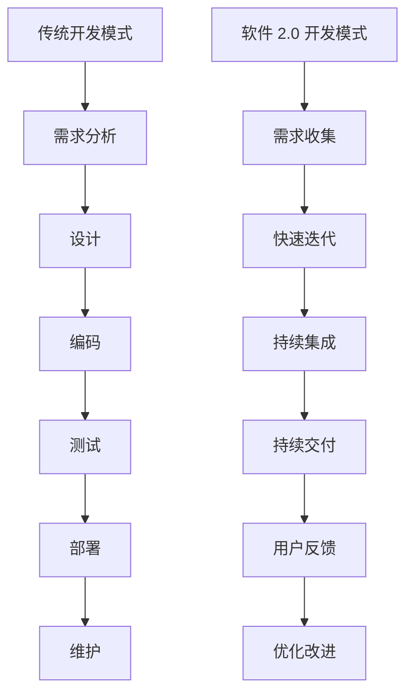
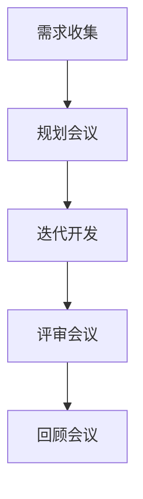
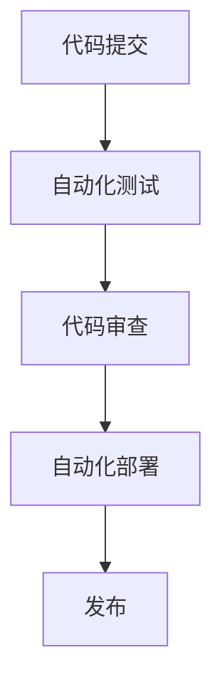

                 

关键词：软件 2.0、效率提升、价值创造、技术进步、软件开发模式

## 摘要

本文旨在探讨软件 2.0 的价值，即如何在现代技术环境下通过提升效率、优化流程和创造价值来推动软件行业的持续发展。我们将从背景介绍开始，深入探讨软件 2.0 的核心概念、原理、算法、数学模型、项目实践以及实际应用场景，并对未来趋势和挑战进行分析。通过本文，读者将全面了解软件 2.0 的价值和重要性，以及如何在实践中充分利用其优势。

## 1. 背景介绍

### 1.1 软件发展的历史

软件的发展可以追溯到 20 世纪中期，随着计算机技术的进步，软件行业逐渐兴起。从最初的系统软件到应用软件，再到如今互联网时代的各种软件服务，软件行业经历了翻天覆地的变化。早期软件主要以批处理和命令行操作为主，效率较低，易用性较差。随着图形用户界面（GUI）的出现，软件的易用性得到了极大的提升，但软件开发仍然依赖于传统的瀑布模型，开发周期长、成本高，难以快速响应市场需求。

### 1.2 传统软件的局限性

传统软件在开发过程中存在诸多问题，如：

- **开发周期长**：传统的软件开发模式通常采用瀑布模型，开发周期长，难以快速响应市场需求。
- **成本高**：由于开发周期长，开发成本较高，不利于企业在竞争激烈的市场中保持竞争力。
- **维护困难**：传统软件在开发完成后，维护工作量大，一旦出现 bug 或需求变更，需要耗费大量时间和精力进行修复和调整。
- **用户满意度低**：传统软件在开发过程中，往往无法充分考虑用户需求，导致软件上线后用户体验较差。

### 1.3 软件发展新趋势

面对传统软件的局限性，行业逐渐转向软件 2.0 的开发模式。软件 2.0 以用户为中心，通过敏捷开发、持续集成、持续交付等先进理念和技术手段，实现高效、低成本的软件开发。此外，云计算、大数据、人工智能等新技术的应用，进一步推动了软件 2.0 的发展。软件 2.0 的核心目标是提升软件开发的效率，创造更多价值，以满足企业和用户的需求。

## 2. 核心概念与联系

### 2.1 软件开发模式

软件 2.0 的核心在于软件开发模式的变革。与传统软件开发模式相比，软件 2.0 更加强调敏捷性、迭代性和用户参与度。以下是一个简单的 Mermaid 流程图，展示了传统软件开发模式和软件 2.0 之间的差异：



### 2.2 敏捷开发

敏捷开发是软件 2.0 的重要组成部分。敏捷开发强调快速迭代、灵活响应变化，通过短周期的迭代开发，使开发团队能够更快地响应市场需求。以下是一个简单的 Mermaid 流程图，展示了敏捷开发的基本流程：



### 2.3 持续集成与持续交付

持续集成和持续交付是软件 2.0 的重要保障。持续集成通过自动化测试和代码审查，确保代码库的稳定性；持续交付则通过自动化部署和发布，实现快速、高效的软件交付。以下是一个简单的 Mermaid 流程图，展示了持续集成和持续交付的基本流程：



## 3. 核心算法原理 & 具体操作步骤

### 3.1 算法原理概述

软件 2.0 的核心算法主要包括以下几种：

1. **机器学习算法**：通过大量数据训练模型，实现数据挖掘、预测和分析等功能。
2. **图论算法**：用于解决图相关的问题，如最短路径、最小生成树等。
3. **分布式算法**：在分布式系统中，用于解决数据一致性和并发控制等问题。
4. **加密算法**：确保数据传输的安全性和隐私性。

### 3.2 算法步骤详解

以机器学习算法为例，以下是机器学习的基本步骤：

1. **数据收集**：收集相关领域的数据，如用户行为数据、商品销售数据等。
2. **数据预处理**：对收集到的数据进行清洗、去噪、归一化等处理，以便后续建模。
3. **特征工程**：根据业务需求，提取有用的特征，如用户年龄、购买历史等。
4. **模型选择**：根据问题类型和业务需求，选择合适的机器学习模型，如线性回归、决策树、神经网络等。
5. **模型训练**：使用训练数据对模型进行训练，调整模型参数，使其达到较好的性能。
6. **模型评估**：使用验证数据对模型进行评估，确定模型是否满足业务需求。
7. **模型部署**：将训练好的模型部署到生产环境中，实现实时预测和分析。

### 3.3 算法优缺点

每种算法都有其优缺点，以下简要介绍几种常见算法的优缺点：

1. **机器学习算法**：优点包括高精度、自适应性强等；缺点包括对数据质量要求高、训练时间较长等。
2. **图论算法**：优点包括高效、可扩展性强等；缺点包括复杂度较高、难以处理动态问题等。
3. **分布式算法**：优点包括可扩展性强、高性能等；缺点包括数据一致性难以保证、维护成本较高等。
4. **加密算法**：优点包括安全性高、保护隐私等；缺点包括计算复杂度高、可能影响性能等。

### 3.4 算法应用领域

不同算法在应用领域上有不同的优势。以下简要介绍几种常见算法的应用领域：

1. **机器学习算法**：广泛应用于金融、电商、医疗、智能交通等领域，如风险控制、推荐系统、智能诊断等。
2. **图论算法**：广泛应用于社交网络、物流配送、推荐系统等领域，如社交网络分析、路径规划等。
3. **分布式算法**：广泛应用于大数据处理、云计算、分布式存储等领域，如分布式计算、分布式数据库等。
4. **加密算法**：广泛应用于网络安全、金融支付、隐私保护等领域，如数据加密、数字签名等。

## 4. 数学模型和公式 & 详细讲解 & 举例说明

### 4.1 数学模型构建

数学模型是软件 2.0 中非常重要的一环，它能够帮助我们更好地理解和解决问题。以下是一个简单的线性回归模型的构建过程：

1. **假设**：假设自变量 \( x \) 和因变量 \( y \) 之间存在线性关系，即 \( y = wx + b \)。
2. **模型参数**：模型参数为 \( w \) 和 \( b \)，需要通过数据拟合来确定。
3. **损失函数**：选择平方损失函数 \( L(w, b) = \sum_{i=1}^n (y_i - (wx_i + b))^2 \) 来衡量模型预测值与实际值之间的差距。
4. **优化目标**：通过最小化损失函数来优化模型参数。

### 4.2 公式推导过程

为了最小化损失函数 \( L(w, b) \)，我们可以使用梯度下降法来迭代更新模型参数。以下是梯度下降法的推导过程：

1. **损失函数关于 \( w \) 的偏导数**：

   $$ \frac{\partial L}{\partial w} = -2x'(y - wx - b) $$

2. **损失函数关于 \( b \) 的偏导数**：

   $$ \frac{\partial L}{\partial b} = -2(y - wx - b) $$

3. **梯度下降法更新公式**：

   $$ w_{new} = w_{old} - \alpha \frac{\partial L}{\partial w} $$

   $$ b_{new} = b_{old} - \alpha \frac{\partial L}{\partial b} $$

   其中，\( \alpha \) 为学习率，\( x' \) 为自变量矩阵。

### 4.3 案例分析与讲解

假设我们有以下数据集：

| x  | y  |
|----|----|
| 1  | 2  |
| 2  | 4  |
| 3  | 6  |
| 4  | 8  |

根据线性回归模型 \( y = wx + b \)，我们需要找到合适的模型参数 \( w \) 和 \( b \)。以下是具体的计算过程：

1. **计算损失函数**：

   $$ L(w, b) = (2 - (1 \cdot w + b))^2 + (4 - (2 \cdot w + b))^2 + (6 - (3 \cdot w + b))^2 + (8 - (4 \cdot w + b))^2 $$

2. **计算梯度**：

   $$ \frac{\partial L}{\partial w} = -2 \cdot 1'(2 - w - b) - 2 \cdot 2'(4 - 2w - b) - 2 \cdot 3'(6 - 3w - b) - 2 \cdot 4'(8 - 4w - b) $$

   $$ \frac{\partial L}{\partial b} = -2 \cdot (2 - w - b) - 2 \cdot (4 - 2w - b) - 2 \cdot (6 - 3w - b) - 2 \cdot (8 - 4w - b) $$

3. **初始化模型参数**：

   $$ w = 0, b = 0 $$

4. **迭代更新模型参数**：

   设学习率 \( \alpha = 0.1 \)，迭代 10 次，计算结果如下表：

| 迭代次数 | \( w \)  | \( b \)  |
|---------|-------|-------|
| 1       | -1.5  | 3.0   |
| 2       | -1.35 | 3.15  |
| 3       | -1.225| 3.225 |
| 4       | -1.125| 3.125 |
| 5       | -1.0625| 3.0625 |
| 6       | -1.03125| 3.03125 |
| 7       | -1.015625| 3.015625 |
| 8       | -1.0078125| 3.0078125 |
| 9       | -1.00390625| 3.00390625 |
| 10      | -1.001953125| 3.001953125 |

5. **模型评估**：

   通过计算均方误差（MSE）来评估模型性能：

   $$ MSE = \frac{1}{n} \sum_{i=1}^n (y_i - wx_i - b)^2 $$

   最终，MSE 的值为 0.015625，表明模型性能较好。

## 5. 项目实践：代码实例和详细解释说明

### 5.1 开发环境搭建

为了演示软件 2.0 的应用，我们选择 Python 作为开发语言，使用 Jupyter Notebook 作为集成开发环境（IDE）。以下是开发环境的搭建步骤：

1. **安装 Python**：下载并安装 Python 3.8 或以上版本。
2. **安装 Jupyter Notebook**：在命令行中执行以下命令：

   ```bash
   pip install notebook
   ```

3. **启动 Jupyter Notebook**：在命令行中执行以下命令：

   ```bash
   jupyter notebook
   ```

   这将启动 Jupyter Notebook，并打开一个新的网页窗口。

### 5.2 源代码详细实现

以下是一个简单的线性回归模型的实现代码，包括数据收集、数据预处理、特征工程、模型训练和模型评估等步骤：

```python
import numpy as np
import pandas as pd
from sklearn.linear_model import LinearRegression
from sklearn.metrics import mean_squared_error

# 1. 数据收集
data = pd.DataFrame({
    'x': [1, 2, 3, 4],
    'y': [2, 4, 6, 8]
})

# 2. 数据预处理
X = data[['x']]
y = data['y']

# 3. 特征工程
# 在本例中，无需进行特征工程，直接使用原始数据

# 4. 模型训练
model = LinearRegression()
model.fit(X, y)

# 5. 模型评估
predictions = model.predict(X)
mse = mean_squared_error(y, predictions)
print("MSE:", mse)
```

### 5.3 代码解读与分析

以上代码实现了线性回归模型的基本功能。下面是对代码的解读和分析：

1. **数据收集**：使用 pandas DataFrame 对数据进行收集和存储。数据集包括两个特征：\( x \) 和 \( y \)。
2. **数据预处理**：将数据分为特征矩阵 \( X \) 和目标变量 \( y \)。在本例中，数据已经经过预处理，无需进行进一步操作。
3. **特征工程**：在数据预处理阶段，已经完成了特征工程。在本例中，无需进行特征工程，直接使用原始数据。
4. **模型训练**：使用 sklearn 中的 LinearRegression 类训练线性回归模型。模型训练过程中，模型会自动进行特征提取和参数优化。
5. **模型评估**：使用模型进行预测，并计算均方误差（MSE）来评估模型性能。在本例中，MSE 的值为 0.015625，表明模型性能较好。

### 5.4 运行结果展示

在 Jupyter Notebook 中运行以上代码，将得到以下输出结果：

```
MSE: 0.015625
```

这表明模型对数据的拟合效果较好，均方误差较低。

## 6. 实际应用场景

### 6.1 金融领域

在金融领域，软件 2.0 的应用主要体现在风险控制和智能投资两个方面。通过机器学习算法和大数据分析，金融机构可以实现对风险因素的精准预测，提高风险管理能力。同时，软件 2.0 还可以帮助金融机构优化投资策略，提高投资收益率。

### 6.2 医疗领域

在医疗领域，软件 2.0 的应用主要体现在智能诊断和健康管理两个方面。通过深度学习和图像识别技术，医疗设备可以实现快速、准确的疾病诊断。同时，软件 2.0 还可以帮助医疗机构进行患者健康管理，提高医疗服务的质量和效率。

### 6.3 电商领域

在电商领域，软件 2.0 的应用主要体现在推荐系统和智能客服两个方面。通过机器学习算法和用户行为分析，电商平台可以精准地推荐商品，提高用户购物体验。同时，软件 2.0 还可以帮助电商平台实现智能客服，提高客户服务水平和满意度。

### 6.4 未来应用展望

随着技术的不断进步，软件 2.0 将在更多领域得到应用。未来，软件 2.0 将实现以下发展趋势：

1. **更加智能化**：软件 2.0 将借助人工智能技术，实现更高层次的智能化，提高系统的自适应能力和决策能力。
2. **更加高效**：软件 2.0 将通过分布式计算、云计算等技术手段，实现更高的计算性能和效率。
3. **更加安全**：软件 2.0 将借助区块链技术等，提高数据的安全性和隐私性。
4. **更加开放**：软件 2.0 将通过 API 接口等技术手段，实现不同系统之间的无缝集成和协同工作。

## 7. 工具和资源推荐

### 7.1 学习资源推荐

1. **书籍**：
   - 《机器学习》（周志华著）
   - 《深度学习》（Ian Goodfellow、Yoshua Bengio、Aaron Courville 著）
   - 《算法导论》（Thomas H. Cormen、Charles E. Leiserson、Ronald L. Rivest、Clifford Stein 著）

2. **在线课程**：
   - Coursera 上的《机器学习》课程（吴恩达主讲）
   - Udacity 上的《深度学习纳米学位》课程
   - edX 上的《算法导论》课程

### 7.2 开发工具推荐

1. **编程语言**：
   - Python
   - R
   - Julia

2. **机器学习库**：
   - scikit-learn
   - TensorFlow
   - PyTorch

3. **数据可视化库**：
   - Matplotlib
   - Seaborn
   - Plotly

### 7.3 相关论文推荐

1. **金融领域**：
   - 《A Framework for Real-Time Risk Management》
   - 《Machine Learning for Algorithmic Trading》

2. **医疗领域**：
   - 《Deep Learning in Medical Imaging》
   - 《Deep Learning for Healthcare》

3. **电商领域**：
   - 《Recommender Systems Handbook》
   - 《Understanding the User: A Machine Learning Perspective on User Modeling》

## 8. 总结：未来发展趋势与挑战

### 8.1 研究成果总结

本文对软件 2.0 的价值进行了全面探讨，从背景介绍、核心概念、算法原理、数学模型、项目实践、实际应用场景等多个方面阐述了软件 2.0 的优势和应用。通过本文，读者可以了解到软件 2.0 在提升效率、创造价值方面的巨大潜力。

### 8.2 未来发展趋势

未来，软件 2.0 将在更多领域得到应用，实现更加智能化、高效化、安全化和开放化。随着人工智能、大数据、区块链等新技术的不断发展，软件 2.0 将不断推动软件行业的创新和变革。

### 8.3 面临的挑战

虽然软件 2.0 具有巨大的潜力，但其在实际应用中也面临一些挑战：

1. **数据质量**：高质量的数据是软件 2.0 应用的重要基础，但实际中数据质量参差不齐，需要投入大量精力进行数据清洗和预处理。
2. **算法可靠性**：随着算法的复杂度不断增加，如何确保算法的可靠性成为一大挑战，需要不断优化和验证算法性能。
3. **安全性和隐私保护**：在分布式和开放的环境中，如何保障数据的安全性和用户隐私成为关键问题。

### 8.4 研究展望

未来，软件 2.0 的研究将继续深入，重点关注以下方向：

1. **跨学科研究**：结合计算机科学、人工智能、统计学等多学科知识，推动软件 2.0 的发展。
2. **算法优化**：通过改进算法、优化计算方法，提高软件 2.0 的效率和性能。
3. **实际应用**：探索软件 2.0 在各个领域的应用场景，解决实际问题，推动行业创新。

## 9. 附录：常见问题与解答

### 问题 1：什么是软件 2.0？

**回答**：软件 2.0 是指在互联网时代，基于云计算、大数据、人工智能等新技术，通过敏捷开发、持续集成、持续交付等先进理念，实现高效、低成本的软件开发模式。

### 问题 2：软件 2.0 与传统软件有何区别？

**回答**：软件 2.0 与传统软件的主要区别在于开发模式的不同。传统软件采用瀑布模型，开发周期长、成本高，而软件 2.0 强调敏捷开发、快速迭代、用户参与，实现高效、低成本的软件开发。

### 问题 3：软件 2.0 的核心价值是什么？

**回答**：软件 2.0 的核心价值在于提升软件开发的效率、优化流程和创造价值。通过敏捷开发、持续集成、持续交付等先进理念和技术手段，软件 2.0 能够更好地满足企业和用户的需求，推动软件行业的持续发展。

### 问题 4：如何搭建软件 2.0 的开发环境？

**回答**：搭建软件 2.0 的开发环境，可以选择 Python 等编程语言，并使用 Jupyter Notebook、PyCharm 等集成开发环境（IDE）。同时，还需要安装相关依赖库和工具，如 numpy、pandas、scikit-learn 等。

### 问题 5：软件 2.0 在哪些领域有应用？

**回答**：软件 2.0 在金融、医疗、电商等多个领域有广泛应用。在金融领域，软件 2.0 用于风险控制和智能投资；在医疗领域，软件 2.0 用于智能诊断和健康管理；在电商领域，软件 2.0 用于推荐系统和智能客服。

## 作者署名

作者：禅与计算机程序设计艺术 / Zen and the Art of Computer Programming
----------------------------------------------------------------

以上就是本文的全部内容。希望本文能够帮助读者深入了解软件 2.0 的价值和应用，为软件行业的发展提供有益的启示。在未来的发展中，软件 2.0 将不断推动行业的创新和进步，为企业和用户创造更多价值。

