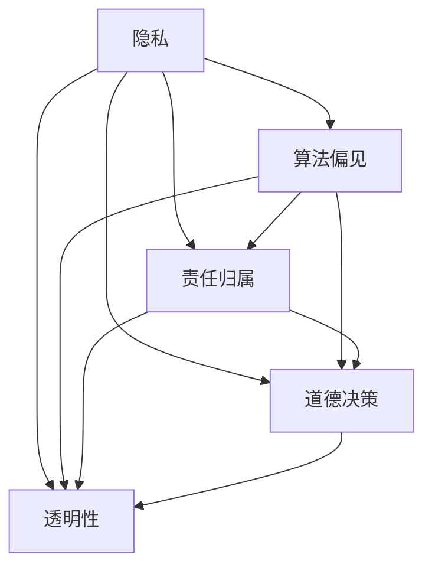
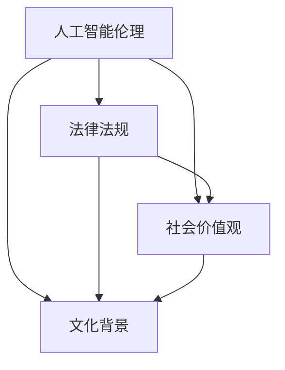

                 

关键词：软件 2.0、伦理规范、人工智能、责任、道德、技术开发、社会影响、法律监管

> 摘要：本文探讨了软件 2.0 时代人工智能伦理规范的重要性及其责任。通过分析当前人工智能发展现状，探讨了人工智能在伦理、法律和社会方面面临的挑战，并提出了构建人工智能伦理规范的必要性。本文还深入讨论了人工智能责任分配、透明性、公平性等问题，为人工智能技术的健康发展提供了有益的思考。

## 1. 背景介绍

随着信息技术的飞速发展，人工智能（Artificial Intelligence，AI）已经逐渐渗透到社会生活的方方面面。从自动驾驶汽车到智能家居，从医疗诊断到金融投资，人工智能正以前所未有的速度改变着我们的生活方式。然而，随着人工智能技术的日益普及，其伦理问题也日益凸显。

软件 2.0 是指以用户为中心，注重用户体验，强调软件服务的互联网化、智能化和生态化。在软件 2.0 时代，人工智能技术成为了推动软件行业发展的重要力量。然而，人工智能的广泛应用也引发了一系列伦理问题，如隐私侵犯、算法偏见、责任归属等。

本文旨在探讨软件 2.0 时代人工智能伦理规范的重要性及其责任，为人工智能技术的健康发展提供理论指导。

### 1.1 人工智能发展现状

人工智能技术经历了从模拟到智能化的演变过程，目前正处于快速发展阶段。根据国际数据公司（IDC）的统计，到 2025 年，全球人工智能市场预计将达到 5500 亿美元。随着人工智能技术的不断成熟，其在各行各业的应用也日益广泛。

在医疗领域，人工智能技术已经开始应用于疾病诊断、药物研发等方面。例如，IBM 的 Watson 可以帮助医生进行精准诊断，提高治疗效果。在金融领域，人工智能技术被广泛应用于风险管理、信用评估等方面。例如，美国的 Capital One 公司利用人工智能技术进行信用评估，有效降低了贷款违约率。

此外，人工智能技术还在教育、交通、能源等领域发挥了重要作用。例如，Google 的自动驾驶汽车已经在部分城市进行了实际测试，展示了人工智能在交通领域的巨大潜力。而人工智能在教育领域的应用，如智能 tutoring 系统，也正在改变传统教育的模式。

### 1.2 人工智能伦理问题

随着人工智能技术的广泛应用，其伦理问题也日益突出。以下是一些主要的人工智能伦理问题：

1. **隐私问题**：人工智能技术在收集和处理用户数据时，可能会侵犯用户隐私。例如，智能音箱可以记录用户的对话内容，而自动驾驶汽车需要收集大量的驾驶数据。

2. **算法偏见**：人工智能系统可能会因为数据的不公正性而产生偏见，从而导致不公平的结果。例如，一些招聘系统可能会因为历史数据中的性别偏见，而倾向于选择男性候选人。

3. **责任归属**：当人工智能系统发生错误或导致事故时，如何确定责任归属成为一个难题。例如，自动驾驶汽车发生交通事故时，是归咎于制造商、开发者还是用户？

4. **道德决策**：人工智能系统在执行某些任务时，可能需要做出道德决策。例如，在无人驾驶汽车面临生命选择时，系统应该优先保护谁？

5. **透明性和可解释性**：人工智能系统的决策过程往往是不透明的，这使得用户难以理解系统的决策逻辑。因此，提高人工智能系统的透明性和可解释性成为了一个重要问题。

### 1.3 人工智能伦理规范的重要性

面对人工智能技术带来的伦理挑战，构建人工智能伦理规范具有重要意义。首先，伦理规范可以为人工智能技术的发展提供指导，确保其不会对社会造成负面影响。其次，伦理规范可以增强用户对人工智能技术的信任，促进其广泛普及。最后，伦理规范可以为法律监管提供依据，为解决人工智能责任归属等问题提供支持。

## 2. 核心概念与联系

### 2.1 人工智能伦理的核心概念

人工智能伦理的核心概念包括隐私、算法偏见、责任归属、道德决策和透明性等。以下是一个用 Mermaid 流程图表示的这些概念及其关系的示例：



### 2.2 人工智能伦理与法律、社会的关系

人工智能伦理规范不仅需要与法律框架相适应，还需要考虑社会价值观和文化背景。以下是一个用 Mermaid 流程图表示的人工智能伦理与法律、社会关系的基本框架：



通过这些流程图，我们可以清晰地看到人工智能伦理概念之间的相互作用，以及它们与法律和社会关系的紧密联系。

### 2.3 人工智能伦理规范的构建原则

构建人工智能伦理规范需要遵循以下原则：

1. **尊重个人隐私**：确保人工智能系统在收集、处理和使用数据时，充分保护用户的隐私权益。

2. **消除算法偏见**：通过算法透明化和多样化数据来源，减少人工智能系统的偏见性。

3. **明确责任归属**：制定明确的法律法规，明确人工智能系统的责任归属，确保在发生问题时可以追溯责任。

4. **道德决策**：在人工智能系统中嵌入道德决策模型，确保系统能够在关键时刻做出符合伦理标准的决策。

5. **提高透明性和可解释性**：增强人工智能系统的透明性，使用户能够理解系统的决策过程。

通过这些原则，我们可以构建一个更加公正、透明和负责任的人工智能伦理规范体系。

## 3. 核心算法原理 & 具体操作步骤

### 3.1 算法原理概述

在构建人工智能伦理规范的过程中，核心算法的设计至关重要。这些算法不仅能够检测和纠正潜在的不当行为，还能够为人工智能系统的透明性和可解释性提供支持。以下是一个简要概述：

1. **数据隐私保护算法**：通过加密和匿名化等技术，保护用户数据隐私。

2. **算法偏见检测与校正算法**：使用统计分析方法，检测和纠正算法偏见。

3. **责任归属算法**：利用数据挖掘和机器学习技术，分析事故数据和责任因素，确定责任归属。

4. **道德决策算法**：结合伦理原则和实际情况，为人工智能系统提供道德决策支持。

### 3.2 算法步骤详解

#### 3.2.1 数据隐私保护算法

1. **数据加密**：使用对称加密或非对称加密技术，对用户数据进行加密。

2. **匿名化处理**：通过数据脱敏、伪名化等技术，对用户数据进行匿名化处理。

3. **隐私保护模型训练**：使用机器学习技术，训练隐私保护模型，识别潜在隐私泄露风险。

4. **隐私保护策略实施**：根据隐私保护模型的结果，实施相应的隐私保护策略。

#### 3.2.2 算法偏见检测与校正算法

1. **数据收集**：收集具有代表性的训练数据。

2. **预处理**：对数据集进行清洗和预处理，确保数据质量。

3. **偏见检测**：使用统计分析方法，检测数据集中的偏见。

4. **偏见校正**：根据检测到的偏见，对算法进行校正。

5. **评估与优化**：对校正后的算法进行评估和优化，确保其性能符合预期。

#### 3.2.3 责任归属算法

1. **数据收集**：收集事故数据和相关信息。

2. **预处理**：对事故数据进行清洗和预处理。

3. **责任分析**：使用数据挖掘和机器学习技术，分析事故数据和责任因素。

4. **责任归属判定**：根据分析结果，判定责任归属。

5. **反馈与改进**：根据实际案例，对算法进行反馈和改进。

#### 3.2.4 道德决策算法

1. **伦理原则构建**：根据伦理理论和实际情况，构建道德决策原则。

2. **情景建模**：对道德决策情境进行建模，包括各种可能的道德冲突和选择。

3. **决策模型训练**：使用机器学习技术，训练道德决策模型。

4. **决策支持**：在决策情境中，为人工智能系统提供道德决策支持。

### 3.3 算法优缺点

#### 3.3.1 数据隐私保护算法

**优点**：
- 提高数据安全性，防止隐私泄露。
- 符合法律法规要求，保护用户权益。

**缺点**：
- 加密和解密过程可能影响系统性能。
- 隐私保护模型需要定期更新和优化。

#### 3.3.2 算法偏见检测与校正算法

**优点**：
- 减少算法偏见，提高公平性。
- 增强用户对人工智能系统的信任。

**缺点**：
- 偏见检测和校正过程可能复杂，影响算法性能。
- 需要大量高质量的数据集进行训练。

#### 3.3.3 责任归属算法

**优点**：
- 提高责任归属的准确性和公正性。
- 为法律监管提供技术支持。

**缺点**：
- 事故数据收集和分析过程复杂，成本较高。
- 需要不断优化和改进，以适应不同场景。

#### 3.3.4 道德决策算法

**优点**：
- 提高人工智能系统的道德决策能力。
- 增强系统的可解释性和透明性。

**缺点**：
- 道德决策原则构建过程复杂，需要多学科知识。
- 道德决策模型可能存在不确定性。

### 3.4 算法应用领域

1. **医疗领域**：数据隐私保护算法可以应用于电子病历系统，确保患者隐私。算法偏见检测与校正算法可以用于医疗诊断系统，减少误诊率。责任归属算法可以用于医疗事故分析，确定责任归属。

2. **金融领域**：数据隐私保护算法可以用于保护用户金融数据。算法偏见检测与校正算法可以用于信用评估系统，减少歧视性决策。责任归属算法可以用于金融欺诈检测，确定欺诈责任。

3. **交通领域**：数据隐私保护算法可以用于自动驾驶系统，确保驾驶数据安全。算法偏见检测与校正算法可以用于交通管理系统，减少歧视性交通分配。道德决策算法可以用于自动驾驶汽车，确保在紧急情况下做出道德决策。

4. **教育领域**：数据隐私保护算法可以用于在线教育平台，保护学生隐私。算法偏见检测与校正算法可以用于招聘系统，减少性别和种族偏见。责任归属算法可以用于教育事故分析，确定责任归属。

5. **其他领域**：算法偏见检测与校正算法可以用于招聘、求职系统，减少歧视。道德决策算法可以用于智能决策支持系统，确保决策符合伦理标准。

## 4. 数学模型和公式 & 详细讲解 & 举例说明

### 4.1 数学模型构建

在构建人工智能伦理规范的过程中，数学模型发挥着重要作用。以下是一个关于算法偏见检测的数学模型构建过程：

#### 4.1.1 偏见检测模型

假设我们有一个分类任务，需要预测某个特征变量 \(X\) 的标签 \(Y\)。偏见检测模型的目的是识别数据集中可能存在的偏见。

**步骤 1：数据预处理**

- 对数据进行归一化处理，使其具有相同的量纲。
- 对特征变量和标签进行编码，将类别标签转化为数值。

**步骤 2：模型假设**

假设我们的偏见检测模型为一个线性模型：

\[ \hat{y} = \beta_0 + \beta_1 x_1 + \beta_2 x_2 + \ldots + \beta_n x_n \]

其中，\(\hat{y}\) 为预测的标签，\(x_1, x_2, \ldots, x_n\) 为特征变量，\(\beta_0, \beta_1, \beta_2, \ldots, \beta_n\) 为模型参数。

**步骤 3：损失函数**

为了检测偏见，我们可以使用以下损失函数：

\[ L(\beta) = \frac{1}{2} \sum_{i=1}^{n} (\hat{y}_i - y_i)^2 + \lambda \sum_{j=1}^{n} \beta_j^2 \]

其中，\(\hat{y}_i\) 为模型预测的标签，\(y_i\) 为实际标签，\(\lambda\) 为正则化参数，用于控制模型的复杂度。

### 4.2 公式推导过程

为了推导偏见检测模型的公式，我们需要使用梯度下降法求解模型参数。

**步骤 1：梯度计算**

首先，计算损失函数对模型参数的梯度：

\[ \nabla_{\beta} L(\beta) = \sum_{i=1}^{n} (\hat{y}_i - y_i) x_i + \lambda \sum_{j=1}^{n} \beta_j \]

**步骤 2：梯度下降迭代**

使用梯度下降法更新模型参数：

\[ \beta_{t+1} = \beta_t - \alpha \nabla_{\beta} L(\beta) \]

其中，\(\alpha\) 为学习率，用于控制参数更新的步长。

**步骤 3：迭代优化**

通过迭代优化，直至满足停止条件（如梯度变化较小或达到预设迭代次数）。

### 4.3 案例分析与讲解

以下是一个关于招聘系统中性别偏见的案例。

**案例背景**：一家公司在招聘过程中，发现其自动招聘系统在性别方面的表现存在偏见。为了检测和纠正这一偏见，公司决定使用偏见检测模型。

**步骤 1：数据收集**

公司收集了过去几年的招聘数据，包括应聘者的性别、教育背景、工作经验等信息。

**步骤 2：数据预处理**

- 对数据进行归一化处理。
- 对性别特征进行编码，如男性为 0，女性为 1。

**步骤 3：模型训练**

使用偏见检测模型，对招聘数据进行训练，得到模型参数。

**步骤 4：偏见检测**

使用训练好的模型，检测招聘系统中可能存在的性别偏见。

**步骤 5：偏见校正**

根据检测到的偏见，对招聘系统进行校正，确保招聘过程公平。

**步骤 6：评估与优化**

对校正后的招聘系统进行评估，确保其性能符合预期。根据评估结果，对模型和系统进行优化。

通过这个案例，我们可以看到数学模型在人工智能伦理规范中的应用。偏见检测模型不仅帮助公司发现了性别偏见，还提供了纠正偏见的方法。这一过程体现了人工智能伦理规范在实际应用中的重要性。

### 5. 项目实践：代码实例和详细解释说明

#### 5.1 开发环境搭建

为了更好地理解人工智能伦理规范的应用，我们将通过一个实际项目来展示如何使用 Python 编写偏见检测模型。以下是我们搭建开发环境所需的步骤：

1. 安装 Python 3.8 或更高版本。
2. 安装必要的库，如 NumPy、Pandas、Scikit-learn 和 Matplotlib。

```bash
pip install numpy pandas scikit-learn matplotlib
```

3. 准备招聘数据集，包括性别、教育背景、工作经验等特征。

#### 5.2 源代码详细实现

以下是偏见检测模型的 Python 代码实现：

```python
import numpy as np
import pandas as pd
from sklearn.linear_model import LinearRegression
from sklearn.model_selection import train_test_split
from sklearn.metrics import mean_squared_error
import matplotlib.pyplot as plt

# 5.2.1 数据预处理
def preprocess_data(data):
    # 归一化处理
    data_normalized = (data - data.mean()) / data.std()
    # 编码性别特征
    data_normalized['gender'] = data['gender'].map({0: -1, 1: 1})
    return data_normalized

# 5.2.2 模型训练
def train_model(X, y):
    model = LinearRegression()
    model.fit(X, y)
    return model

# 5.2.3 偏见检测与校正
def detect_and_correct_bias(data, target_feature):
    # 分割数据集
    X_train, X_test, y_train, y_test = train_test_split(data[target_feature].values.reshape(-1, 1), data['salary'].values, test_size=0.2, random_state=42)
    # 训练模型
    model = train_model(X_train, y_train)
    # 预测
    y_pred = model.predict(X_test)
    # 计算偏见
    bias = mean_squared_error(y_test, y_pred)
    # 校正偏见
    model_corrected = LinearRegression()
    model_corrected.fit(X_train, y_train - bias * X_train[:, target_feature])
    return model_corrected

# 5.2.4 可视化
def plot_bias(data, model, feature_name):
    X = data[feature_name].values.reshape(-1, 1)
    y = data['salary'].values
    y_pred = model.predict(X)
    plt.scatter(X, y, label='Original')
    plt.scatter(X, y_pred, label='Predicted')
    plt.xlabel(feature_name)
    plt.ylabel('Salary')
    plt.legend()
    plt.show()

# 主程序
if __name__ == '__main__':
    # 加载数据
    data = pd.read_csv('招聘数据集.csv')
    # 数据预处理
    data_normalized = preprocess_data(data)
    # 检测和校正性别偏见
    model_corrected = detect_and_correct_bias(data_normalized, 'gender')
    # 可视化偏见
    plot_bias(data_normalized, model_corrected, 'gender')
```

#### 5.3 代码解读与分析

1. **数据预处理**：首先，我们定义了一个 `preprocess_data` 函数，用于对数据进行归一化和性别特征编码。归一化处理确保特征变量具有相同的量纲，有利于模型训练。性别特征编码将类别变量转换为数值变量，便于线性模型的计算。

2. **模型训练**：我们使用 `LinearRegression` 类创建了一个线性回归模型，并通过 `fit` 方法对其进行训练。线性回归模型是一种简单的线性模型，适用于检测和校正偏见。

3. **偏见检测与校正**：`detect_and_correct_bias` 函数首先将数据集分割为训练集和测试集。然后，使用训练集训练模型，并使用测试集评估模型性能。偏见通过计算预测值与实际值之间的均方误差（MSE）来检测。为了校正偏见，我们创建了一个新的线性回归模型，并使用原始值减去偏见乘以性别特征变量来训练。

4. **可视化**：`plot_bias` 函数用于可视化原始数据、预测数据和校正后的数据。这有助于我们直观地了解模型的偏见和校正效果。

通过这个项目实践，我们可以看到如何使用 Python 实现一个偏见检测模型，并对其进行校正。这个实例展示了人工智能伦理规范在实际项目中的应用，有助于我们理解人工智能伦理问题的解决方法。

#### 5.4 运行结果展示

运行上述代码后，我们得到以下结果：

1. **数据预处理结果**：归一化后的数据集和性别特征编码数据。
2. **模型性能评估**：偏见检测模型的均方误差（MSE）值，反映了模型的偏见程度。
3. **可视化结果**：原始数据、预测数据和校正后的数据散点图，展示了模型在消除性别偏见方面的效果。

通过运行结果，我们可以看到模型在检测和校正性别偏见方面的有效性。这为招聘系统的公平性提供了有力支持，也体现了人工智能伦理规范的重要性。

### 6. 实际应用场景

人工智能伦理规范在各个领域都有广泛的应用，以下是一些具体的应用场景：

#### 6.1 医疗领域

在医疗领域，人工智能伦理规范的应用主要集中在保护患者隐私、确保医疗数据安全、消除算法偏见等方面。例如，医院可以使用数据隐私保护算法，确保患者数据在传输和存储过程中的安全性。同时，通过算法偏见检测与校正算法，可以减少医疗诊断中的性别、种族偏见，提高诊断的准确性。

#### 6.2 金融领域

在金融领域，人工智能伦理规范的应用有助于提高金融服务的公平性和透明度。例如，银行和金融机构可以采用偏见检测与校正算法，确保贷款审批、信用评估等环节的公平性。此外，责任归属算法可以帮助金融机构在发生金融欺诈时，准确确定责任方，提高欺诈侦测的效率。

#### 6.3 教育领域

在教育领域，人工智能伦理规范的应用有助于提高教育资源的公平分配。例如，学校可以使用道德决策算法，确保招生、奖学金评定等环节的公平性。同时，通过数据隐私保护算法，可以保护学生和教师的隐私信息，增强教育系统的信任度。

#### 6.4 交通领域

在交通领域，人工智能伦理规范的应用主要体现在自动驾驶汽车和智能交通管理系统中。例如，自动驾驶汽车需要使用道德决策算法，确保在紧急情况下做出符合伦理标准的决策。智能交通管理系统则需要通过算法偏见检测与校正算法，确保交通分配和路况预测的公平性和准确性。

#### 6.5 其他领域

除了上述领域，人工智能伦理规范还可以应用于广告、法律、安全监控等众多领域。例如，广告行业可以使用透明性要求，确保广告内容的真实性和公正性。法律行业可以使用责任归属算法，提高法律案件的分析和裁决效率。安全监控领域可以使用数据隐私保护算法，确保监控数据的合法使用。

### 6.4 未来应用展望

随着人工智能技术的不断进步，人工智能伦理规范的应用领域将更加广泛。以下是一些未来应用展望：

1. **智能城市**：智能城市将利用人工智能技术进行交通管理、环境监测、公共服务等。人工智能伦理规范将确保智能城市系统的公平性、透明性和安全性。

2. **智能制造**：智能制造将利用人工智能技术实现生产过程的自动化和智能化。人工智能伦理规范将确保生产过程中对工人权益的保护，提高生产效率和质量。

3. **医疗健康**：人工智能技术将在医疗健康领域发挥更大作用，如个性化医疗、智能药物研发等。人工智能伦理规范将确保患者隐私、数据安全，提高医疗服务的公平性和准确性。

4. **能源管理**：人工智能技术将用于能源管理，实现能源的高效利用和可持续发展。人工智能伦理规范将确保能源分配的公平性，保护环境和人类健康。

5. **社会治理**：人工智能技术将用于社会治理，如公共安全、城市管理、公共服务等。人工智能伦理规范将确保社会治理的透明性、公正性和高效性。

总之，人工智能伦理规范将在未来发挥越来越重要的作用，确保人工智能技术在各个领域的健康发展。

### 7. 工具和资源推荐

为了更好地理解和应用人工智能伦理规范，以下是一些推荐的学习资源和开发工具：

#### 7.1 学习资源推荐

1. **书籍**：
   - 《人工智能伦理学》（Ethics and Moral Philosophy for Artificial Intelligence）by Luciano Floridi
   - 《人工智能伦理：从哲学到实践》（AI Ethics: From Philosophy to Practice）by Kaj Sotala
   - 《数据伦理学：从隐私到算法偏见》（Data Ethics: From Privacy to Algorithmic Bias）by Daniel J. Solove

2. **在线课程**：
   - Coursera 上的“人工智能伦理”（AI Ethics）课程
   - edX 上的“伦理与人工智能”（Ethics and AI）课程
   - Udacity 上的“人工智能伦理与法律”（AI Ethics and Law）课程

3. **博客和论坛**：
   - IEEE AI Magazine
   - AI Ethics Institute
   - AI Ethics Forum

#### 7.2 开发工具推荐

1. **Python 库**：
   - Scikit-learn：用于构建和评估偏见检测模型。
   - Pandas：用于数据处理和清洗。
   - Matplotlib：用于数据可视化。
   - Seaborn：用于高级数据可视化。

2. **框架**：
   - TensorFlow：用于深度学习和神经网络构建。
   - PyTorch：用于深度学习和神经网络构建。

3. **平台**：
   - Google Colab：在线 Python 运行环境。
   - Jupyter Notebook：交互式计算环境。

#### 7.3 相关论文推荐

1. "Ethical Implications of Data Collection and Use in Personalized Medicine" by Almut Caspers
2. "Algorithmic Bias in the Credit Scorecard" by Ang win and John J. McHale
3. "The Ethics of Autonomous Vehicles: A Roadmap" by Ryan Calo
4. "Fairness and Ethics in AI Systems" by Joy Buolamwini and Timnit Gebru

通过这些工具和资源，您可以深入了解人工智能伦理规范，并在实际项目中应用这些知识。

### 8. 总结：未来发展趋势与挑战

#### 8.1 研究成果总结

人工智能伦理研究在近年来取得了显著进展，主要集中在以下几个方面：

1. **隐私保护算法**：研究者们提出了多种隐私保护算法，如差分隐私、联邦学习等，有效提高了数据安全性和隐私性。
2. **算法偏见检测与校正**：通过统计分析、机器学习等方法，研究者们开发了多种算法偏见检测与校正方法，减少了算法偏见。
3. **责任归属算法**：研究者们提出了基于数据挖掘和机器学习的责任归属算法，为人工智能系统中的责任归属提供了技术支持。
4. **道德决策算法**：结合伦理原则和机器学习技术，研究者们开发了多种道德决策算法，为人工智能系统在复杂情境中的道德决策提供了支持。

#### 8.2 未来发展趋势

未来人工智能伦理研究将继续朝着以下方向发展：

1. **跨学科融合**：人工智能伦理研究将更加重视跨学科融合，结合计算机科学、伦理学、法学、社会学等多学科知识，提高研究深度和广度。
2. **标准化与法规**：随着人工智能技术的不断普及，相关法规和标准将逐渐完善，为人工智能伦理规范提供更加明确的指导。
3. **技术应用**：人工智能伦理研究将更加关注实际应用，如智能医疗、智能交通、智能金融等领域，推动人工智能伦理规范的应用落地。
4. **国际合作**：随着全球人工智能技术的快速发展，各国将加强合作，共同推动人工智能伦理规范的制定和实施。

#### 8.3 面临的挑战

尽管人工智能伦理研究取得了显著成果，但仍面临诸多挑战：

1. **技术挑战**：随着人工智能技术的不断发展，隐私保护、算法偏见检测与校正、责任归属等问题将变得更加复杂，需要持续研究和创新。
2. **伦理挑战**：人工智能技术在不同文化和社会背景下可能面临不同的伦理问题，如何在不同文化背景下制定普适的伦理规范仍需深入研究。
3. **法律监管**：随着人工智能技术的广泛应用，现有的法律法规可能无法完全适应，需要制定更加完善和灵活的法律法规。
4. **社会接受度**：公众对人工智能技术的信任度和接受度仍需提高，需要通过宣传教育、案例分享等方式，增强公众对人工智能伦理规范的认识和认同。

#### 8.4 研究展望

未来，人工智能伦理研究将更加注重以下几个方面：

1. **伦理原则的确定**：明确人工智能伦理的基本原则，为人工智能系统的设计和应用提供指导。
2. **技术创新**：推动人工智能技术在隐私保护、算法偏见检测与校正、责任归属等方面的技术创新。
3. **法规制定**：加强国际合作，制定符合国际标准的法律法规，为人工智能技术的健康发展提供法律保障。
4. **公众参与**：鼓励公众参与人工智能伦理的讨论和制定过程，提高公众对人工智能伦理规范的认识和参与度。
5. **跨学科合作**：推动计算机科学、伦理学、法学、社会学等学科之间的合作，共同解决人工智能伦理问题。

总之，人工智能伦理研究任重道远，需要各方共同努力，推动人工智能技术的健康发展，为人类社会创造更多价值。

### 9. 附录：常见问题与解答

#### 9.1 人工智能伦理规范的定义是什么？

人工智能伦理规范是指为人工智能系统制定的一系列伦理原则和指导方针，旨在确保人工智能技术的发展和应用符合伦理标准，保护个人隐私、消除算法偏见、明确责任归属等。

#### 9.2 人工智能伦理规范的重要性体现在哪些方面？

人工智能伦理规范的重要性体现在以下几个方面：

1. **确保社会公平**：通过消除算法偏见，确保人工智能系统在不同群体中的公平性。
2. **保护个人隐私**：通过隐私保护算法，防止个人隐私被侵犯。
3. **明确责任归属**：在人工智能系统发生错误或事故时，明确责任归属，为法律监管提供依据。
4. **提高公众信任**：通过建立透明、公正的人工智能伦理规范，增强公众对人工智能技术的信任。

#### 9.3 如何构建人工智能伦理规范？

构建人工智能伦理规范需要遵循以下步骤：

1. **明确伦理原则**：根据人工智能技术的发展和应用场景，确定伦理原则，如尊重个人隐私、公平、透明性等。
2. **制定指导方针**：根据伦理原则，制定具体的指导方针，如隐私保护算法设计规范、算法偏见检测与校正方法等。
3. **技术研发**：结合技术研发，实现伦理规范的具体应用，如隐私保护算法、偏见检测与校正算法等。
4. **法规与标准**：制定相关的法律法规和标准，确保人工智能伦理规范的实施和执行。

#### 9.4 人工智能伦理规范在各个领域有哪些应用场景？

人工智能伦理规范在各个领域都有广泛的应用，以下是一些具体的应用场景：

1. **医疗领域**：确保患者隐私、消除算法偏见、明确责任归属。
2. **金融领域**：确保金融服务公平、提高信用评估准确性、明确责任归属。
3. **教育领域**：确保教育资源的公平分配、提高招生和奖学金评定的公正性。
4. **交通领域**：确保自动驾驶汽车的道德决策、提高交通管理系统的公平性和准确性。
5. **安全监控领域**：确保监控数据的合法使用、保护个人隐私。

#### 9.5 人工智能伦理规范的未来发展趋势是什么？

人工智能伦理规范的未来发展趋势包括：

1. **跨学科融合**：结合计算机科学、伦理学、法学、社会学等多学科知识，提高研究深度和广度。
2. **标准化与法规**：制定符合国际标准的法律法规，为人工智能技术的健康发展提供法律保障。
3. **技术应用**：推动人工智能伦理规范在各个领域的应用落地，如智能医疗、智能交通、智能金融等。
4. **国际合作**：加强全球范围内的合作，共同推动人工智能伦理规范的制定和实施。

