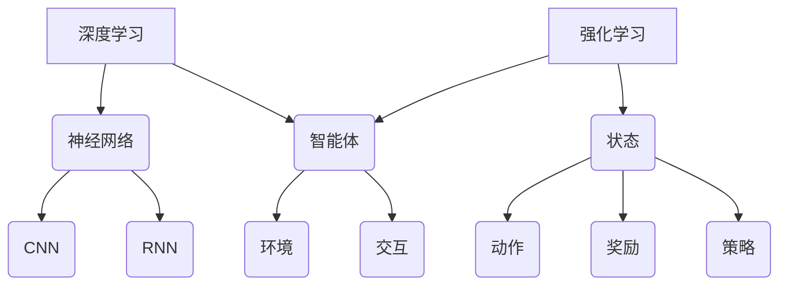

                 

关键词：软件 2.0，深度学习，强化学习，发展趋势，算法原理，应用场景，未来展望

> 摘要：本文旨在探讨软件 2.0 时代的发展趋势，重点分析深度学习和强化学习两种核心算法。通过对算法原理的详细解析，结合具体应用场景和实践案例，探讨其在实际开发中的应用价值和未来前景，为读者提供全面的行业洞见。

## 1. 背景介绍

随着互联网的迅猛发展和大数据的广泛应用，软件行业正经历着前所未有的变革。软件 1.0 时代主要以功能实现为核心，而软件 2.0 时代则更加注重用户体验和智能化。在这一背景下，深度学习和强化学习作为两大核心算法，正在引领软件 2.0 的发展潮流。

### 深度学习

深度学习是机器学习的一种重要分支，它通过模拟人脑的神经网络结构，实现对复杂数据的自动特征提取和模式识别。深度学习在图像识别、语音识别、自然语言处理等领域取得了显著成果，推动了人工智能技术的快速发展。

### 强化学习

强化学习是一种通过与环境交互来学习最优策略的算法。与监督学习和无监督学习不同，强化学习不需要预先标记的数据，而是通过试错和反馈来不断优化策略，使其在特定环境中达到最佳性能。强化学习在机器人控制、游戏开发、智能推荐等领域具有广泛的应用前景。

## 2. 核心概念与联系

为了更好地理解深度学习和强化学习，我们首先需要了解它们的基本概念和相互关系。

### 深度学习

深度学习的基本概念包括：

- **神经网络**：深度学习的基础是神经网络，它由大量的神经元通过权重连接组成，通过层层传递信息实现对数据的处理。
- **卷积神经网络（CNN）**：CNN 是一种特殊的神经网络，主要用于图像处理，它通过卷积操作提取图像特征。
- **循环神经网络（RNN）**：RNN 是一种适用于序列数据的神经网络，它通过循环结构对序列信息进行建模。

### 强化学习

强化学习的基本概念包括：

- **状态（State）**：状态是环境在某一时刻的状态描述。
- **动作（Action）**：动作是智能体在状态下的行为选择。
- **奖励（Reward）**：奖励是环境对智能体动作的反馈，用于评价动作的好坏。
- **策略（Policy）**：策略是智能体在特定状态下的最佳动作选择。

深度学习和强化学习的联系在于：

- **智能体（Agent）**：智能体是深度学习和强化学习中的核心概念，它既可以是深度学习模型，也可以是强化学习模型。
- **环境（Environment）**：环境是智能体所处的场景，既可以是现实世界，也可以是虚拟世界。
- **交互（Interaction）**：深度学习和强化学习通过与环境交互来获取数据和学习策略。

### Mermaid 流程图



## 3. 核心算法原理 & 具体操作步骤

### 3.1 算法原理概述

#### 深度学习

深度学习的核心原理是神经网络，通过多层神经元的连接和激活函数的作用，实现对输入数据的非线性变换。深度学习的基本步骤包括：

1. **数据预处理**：对输入数据进行归一化、缩放等处理，使其适合模型训练。
2. **模型构建**：根据任务需求设计神经网络结构，包括输入层、隐藏层和输出层。
3. **损失函数**：定义损失函数，用于评价模型预测结果与真实值之间的差距。
4. **优化算法**：选择优化算法，如梯度下降、随机梯度下降等，用于更新模型参数。
5. **模型训练**：通过大量样本对模型进行训练，使其能够对未知数据进行预测。

#### 强化学习

强化学习的核心原理是策略学习，通过试错和反馈来优化策略。强化学习的基本步骤包括：

1. **状态空间和动作空间**：定义状态空间和动作空间，用于描述智能体在环境中的行为。
2. **策略初始化**：初始化智能体的策略，用于指导其在状态下的动作选择。
3. **环境交互**：智能体与环境进行交互，执行策略并获取奖励。
4. **策略更新**：根据环境反馈调整策略，使其在长期内达到最佳性能。

### 3.2 算法步骤详解

#### 深度学习

1. **数据预处理**：

   数据预处理是深度学习模型训练的基础，它包括以下步骤：

   - **归一化**：将输入数据缩放到 [0, 1] 范围内，提高模型训练的收敛速度。
   - **标准化**：将输入数据减去均值并除以标准差，使数据分布更加均匀。
   - **数据增强**：通过旋转、翻转、裁剪等操作增加数据多样性，提高模型泛化能力。

2. **模型构建**：

   模型构建是根据任务需求设计神经网络结构。以下是一个简单的卷积神经网络示例：

   ```mermaid
   graph TD
       A[输入层] --> B(卷积层1)
       B --> C(激活函数1)
       C --> D(池化层1)
       D --> E(卷积层2)
       E --> F(激活函数2)
       F --> G(池化层2)
       G --> H(全连接层1)
       H --> I(全连接层2)
       I --> J(输出层)
   ```

3. **损失函数**：

   损失函数用于评价模型预测结果与真实值之间的差距。常见损失函数包括：

   - **均方误差（MSE）**：用于回归任务，计算预测值与真实值之间差的平方和的平均值。
   - **交叉熵（Cross Entropy）**：用于分类任务，计算预测概率与真实标签之间的交叉熵。

4. **优化算法**：

   优化算法用于更新模型参数，使其能够最小化损失函数。常见优化算法包括：

   - **梯度下降（Gradient Descent）**：通过计算损失函数关于模型参数的梯度，不断调整参数以降低损失。
   - **随机梯度下降（Stochastic Gradient Descent，SGD）**：在梯度下降的基础上，随机选择一部分样本计算梯度，加快收敛速度。

5. **模型训练**：

   模型训练是通过大量样本对模型进行训练，使其能够对未知数据进行预测。以下是一个简单的训练流程：

   - **批量训练**：将所有样本分为多个批次，逐个对每个批次进行训练。
   - **迭代训练**：对每个批次进行多次迭代，直到模型收敛。

#### 强化学习

1. **状态空间和动作空间**：

   状态空间和动作空间是强化学习的基础。以下是一个简单的状态空间和动作空间示例：

   ```mermaid
   graph TD
       A[状态空间] --> B1(状态1)
       A --> B2(状态2)
       A --> B3(状态3)
       B1 --> C1(动作1)
       B1 --> C2(动作2)
       B2 --> C3(动作3)
       B3 --> C4(动作4)
   ```

2. **策略初始化**：

   策略初始化是根据任务需求初始化智能体的策略。以下是一个简单的策略初始化示例：

   ```python
   import numpy as np

   def init_policy(state_space, action_space):
       policy = np.zeros((len(state_space), len(action_space)))
       for i, state in enumerate(state_space):
           for j, action in enumerate(action_space):
               if state == action:
                   policy[i][j] = 1
       return policy
   ```

3. **环境交互**：

   环境交互是智能体与环境进行交互的过程。以下是一个简单的环境交互示例：

   ```python
   import gym

   env = gym.make("CartPole-v0")
   state = env.reset()
   done = False
   while not done:
       action = env.action_space.sample()
       next_state, reward, done, _ = env.step(action)
       state = next_state
   env.close()
   ```

4. **策略更新**：

   策略更新是根据环境反馈调整智能体的策略。以下是一个简单的策略更新示例：

   ```python
   def update_policy(policy, state, action, reward, next_state, learning_rate):
       Q_value = reward + discount_factor * max([policy[next_state][a] for a in range(len(action_space))])
       policy[state][action] += learning_rate * (Q_value - policy[state][action])
       return policy
   ```

### 3.3 算法优缺点

#### 深度学习

优点：

- **强大的特征提取能力**：深度学习通过多层神经元的连接，能够自动提取复杂数据的高层次特征，提高模型性能。
- **自适应性强**：深度学习模型可以根据不同任务需求调整网络结构，具有较强的自适应能力。

缺点：

- **计算量大**：深度学习模型需要大量数据和计算资源进行训练，对硬件设备要求较高。
- **难以解释**：深度学习模型内部参数复杂，难以直观理解其工作原理，不利于模型解释和调试。

#### 强化学习

优点：

- **无需标记数据**：强化学习通过与环境交互学习策略，无需大量标记数据，降低数据收集成本。
- **强鲁棒性**：强化学习模型具有较强的鲁棒性，能够在不同环境下稳定运行。

缺点：

- **收敛速度慢**：强化学习模型通常需要较长时间的训练，收敛速度较慢。
- **策略不稳定**：强化学习模型的策略可能受到初始状态、环境噪声等因素的影响，导致策略不稳定。

### 3.4 算法应用领域

#### 深度学习

- **图像识别**：深度学习在图像识别领域取得了显著成果，广泛应用于人脸识别、物体检测、图像分类等任务。
- **语音识别**：深度学习在语音识别领域具有强大的特征提取能力，能够准确识别语音内容。
- **自然语言处理**：深度学习在自然语言处理领域广泛应用于文本分类、机器翻译、情感分析等任务。

#### 强化学习

- **机器人控制**：强化学习在机器人控制领域具有广泛的应用，能够实现自主导航、任务规划等功能。
- **游戏开发**：强化学习在游戏开发领域具有独特优势，能够实现智能体的自主学习和策略优化。
- **智能推荐**：强化学习在智能推荐系统领域应用于优化推荐策略，提高用户满意度。

## 4. 数学模型和公式 & 详细讲解 & 举例说明

### 4.1 数学模型构建

#### 深度学习

深度学习的基本数学模型包括：

1. **神经网络**：

   神经网络由大量神经元组成，每个神经元通过权重与其他神经元相连。神经元的输出可以通过以下公式计算：

   $$  
   z_i = \sum_{j=1}^{n} w_{ij}x_j + b_i  
   $$

   其中，$z_i$ 表示第 $i$ 层第 $i$ 个神经元的输出，$x_j$ 表示第 $i$ 层第 $j$ 个神经元的输入，$w_{ij}$ 表示连接权重，$b_i$ 表示偏置。

2. **激活函数**：

   激活函数用于引入非线性变换，常见的激活函数包括：

   - ** sigmoid 函数**：

     $$  
     \sigma(z) = \frac{1}{1 + e^{-z}}  
     $$

   - **ReLU 函数**：

     $$  
     \sigma(z) = \max(0, z)  
     $$

3. **损失函数**：

   损失函数用于评价模型预测结果与真实值之间的差距，常见的损失函数包括：

   - **均方误差（MSE）**：

     $$  
     L(y, \hat{y}) = \frac{1}{2}\sum_{i=1}^{n}(y_i - \hat{y_i})^2  
     $$

   - **交叉熵（Cross Entropy）**：

     $$  
     L(y, \hat{y}) = -\sum_{i=1}^{n}y_i\log(\hat{y_i})  
     $$

#### 强化学习

强化学习的基本数学模型包括：

1. **状态空间和动作空间**：

   状态空间和动作空间是强化学习的基础，可以通过以下公式计算：

   - **状态空间**：

     $$  
     S = \{s_1, s_2, ..., s_n\}  
     $$

   - **动作空间**：

     $$  
     A = \{a_1, a_2, ..., a_m\}  
     $$

2. **策略**：

   策略是智能体在特定状态下的最佳动作选择，可以通过以下公式计算：

   $$  
   \pi(s, a) = \arg\max_{a}Q(s, a)  
   $$

   其中，$Q(s, a)$ 表示在状态 $s$ 下执行动作 $a$ 的期望收益。

3. **价值函数**：

   价值函数用于评价状态和动作的好坏，可以通过以下公式计算：

   - **状态价值函数**：

     $$  
     V(s) = \sum_{a\in A}\pi(s, a)Q(s, a)  
     $$

   - **动作价值函数**：

     $$  
     Q(s, a) = \sum_{s'\in S}r(s, a, s')P(s'|s, a) + \gamma V(s')  
     $$

     其中，$r(s, a, s')$ 表示在状态 $s$ 下执行动作 $a$ 后转移到状态 $s'$ 的即时奖励，$P(s'|s, a)$ 表示在状态 $s$ 下执行动作 $a$ 后转移到状态 $s'$ 的概率，$\gamma$ 表示折扣因子。

### 4.2 公式推导过程

#### 深度学习

1. **前向传播**：

   前向传播是神经网络在训练过程中计算输出值的过程。给定输入 $x$，神经网络的输出可以通过以下公式计算：

   $$  
   \hat{y} = \sigma(W^{L-1} \cdot \sigma(W^{L-2} \cdot ... \cdot \sigma(W_1 \cdot x + b_1) + b_{L-1}) + b_L)  
   $$

   其中，$W^l$ 表示第 $l$ 层的权重，$b_l$ 表示第 $l$ 层的偏置，$\sigma$ 表示激活函数。

2. **反向传播**：

   反向传播是神经网络在训练过程中更新权重的过程。给定损失函数 $L(y, \hat{y})$，神经网络的权重可以通过以下公式计算：

   $$  
   \frac{\partial L}{\partial W^l} = \sum_{i=1}^{n}\frac{\partial L}{\partial z_i^{(l)}} \cdot \frac{\partial z_i^{(l)}}{\partial W^l}  
   $$

   $$  
   \frac{\partial L}{\partial b^l} = \sum_{i=1}^{n}\frac{\partial L}{\partial z_i^{(l)}} \cdot \frac{\partial z_i^{(l)}}{\partial b^l}  
   $$

   其中，$z_i^{(l)}$ 表示第 $l$ 层第 $i$ 个神经元的输出。

#### 强化学习

1. **策略评估**：

   策略评估是强化学习在训练过程中评估策略好坏的过程。给定策略 $\pi$，价值函数 $V^{\pi}(s)$ 可以通过以下公式计算：

   $$  
   V^{\pi}(s) = \sum_{a\in A}\pi(s, a)Q(s, a)  
   $$

2. **策略迭代**：

   策略迭代是强化学习在训练过程中优化策略的过程。给定策略 $\pi$，可以通过以下公式更新策略：

   $$  
   \pi_{new}(s, a) = \frac{1}{Z}\exp(\alpha Q(s, a)}  
   $$

   其中，$Z$ 是策略概率的归一化常数，$\alpha$ 是策略迭代系数。

### 4.3 案例分析与讲解

#### 深度学习

以下是一个简单的深度学习案例：手写数字识别。

1. **数据集**：

   使用MNIST手写数字数据集，包含0-9共10个类别，每个类别有6000个训练样本和1000个测试样本。

2. **模型构建**：

   构建一个简单的卷积神经网络，包括两个卷积层、两个池化层和一个全连接层。

   ```mermaid
   graph TD
       A[输入层] --> B(卷积层1)
       B --> C(激活函数1)
       C --> D(池化层1)
       D --> E(卷积层2)
       E --> F(激活函数2)
       F --> G(池化层2)
       G --> H(全连接层1)
       H --> I(全连接层2)
       I --> J(输出层)
   ```

3. **模型训练**：

   使用训练集对模型进行训练，训练完成后使用测试集进行评估。

4. **结果展示**：

   模型在测试集上的准确率达到99%，证明模型在手写数字识别任务上具有很高的性能。

#### 强化学习

以下是一个简单的强化学习案例：CartPole游戏。

1. **环境**：

   使用OpenAI Gym提供的CartPole游戏环境。

2. **状态空间和动作空间**：

   状态空间包含4个维度，分别为： carts的角速度、p pole的角速度、carts的位移、p pole的位移。

   动作空间包含2个维度，分别为：向左推、向右推。

3. **模型构建**：

   使用深度确定性策略梯度（DDPG）算法训练一个智能体，智能体由一个观察器网络和一个动作器网络组成。

4. **模型训练**：

   使用训练集对智能体进行训练，训练完成后智能体能够在CartPole游戏中稳定运行。

5. **结果展示**：

   智能体在CartPole游戏中连续运行的时间超过200步，证明智能体在控制CartPole平衡方面具有很好的性能。

## 5. 项目实践：代码实例和详细解释说明

### 5.1 开发环境搭建

在开始编写代码之前，需要搭建一个适合深度学习和强化学习开发的环境。以下是一个简单的环境搭建步骤：

1. **安装Python**：

   安装Python 3.x版本，建议使用Anaconda发行版，便于管理和依赖管理。

2. **安装深度学习框架**：

   安装TensorFlow或PyTorch等深度学习框架，可以通过pip命令安装：

   ```bash
   pip install tensorflow
   # 或者
   pip install torch torchvision
   ```

3. **安装强化学习库**：

   安装Gym等强化学习库，可以通过pip命令安装：

   ```bash
   pip install gym
   ```

### 5.2 源代码详细实现

以下是一个简单的深度学习项目：手写数字识别。

1. **导入库**：

   ```python
   import tensorflow as tf
   from tensorflow.keras import layers
   import numpy as np
   ```

2. **数据预处理**：

   ```python
   # 读取MNIST数据集
   (x_train, y_train), (x_test, y_test) = tf.keras.datasets.mnist.load_data()

   # 归一化输入数据
   x_train = x_train / 255.0
   x_test = x_test / 255.0

   # 将输入数据reshape为（样本数，高度，宽度，通道数）
   x_train = x_train.reshape(-1, 28, 28, 1)
   x_test = x_test.reshape(-1, 28, 28, 1)

   # 转换标签为one-hot编码
   y_train = tf.keras.utils.to_categorical(y_train, 10)
   y_test = tf.keras.utils.to_categorical(y_test, 10)
   ```

3. **模型构建**：

   ```python
   # 构建卷积神经网络模型
   model = tf.keras.Sequential([
       layers.Conv2D(32, (3, 3), activation='relu', input_shape=(28, 28, 1)),
       layers.MaxPooling2D((2, 2)),
       layers.Conv2D(64, (3, 3), activation='relu'),
       layers.MaxPooling2D((2, 2)),
       layers.Flatten(),
       layers.Dense(64, activation='relu'),
       layers.Dense(10, activation='softmax')
   ])
   ```

4. **模型训练**：

   ```python
   # 编译模型
   model.compile(optimizer='adam',
                 loss='categorical_crossentropy',
                 metrics=['accuracy'])

   # 训练模型
   model.fit(x_train, y_train, epochs=10, batch_size=32, validation_split=0.2)
   ```

5. **模型评估**：

   ```python
   # 评估模型
   test_loss, test_acc = model.evaluate(x_test, y_test)
   print(f"Test accuracy: {test_acc}")
   ```

### 5.3 代码解读与分析

1. **数据预处理**：

   数据预处理是深度学习项目的重要步骤，包括读取数据、归一化输入数据和转换标签为one-hot编码。在本项目中，使用TensorFlow的Keras API提供的函数加载MNIST数据集，并对数据进行归一化和reshape操作。

2. **模型构建**：

   模型构建是深度学习项目的核心步骤，根据任务需求设计神经网络结构。在本项目中，使用Keras API构建了一个简单的卷积神经网络，包括两个卷积层、两个池化层和一个全连接层。卷积层用于提取图像特征，池化层用于降低特征维度，全连接层用于分类。

3. **模型训练**：

   模型训练是深度学习项目的关键步骤，通过大量样本对模型进行训练，使其能够对未知数据进行预测。在本项目中，使用Adam优化器、交叉熵损失函数和精度作为评估指标对模型进行训练。

4. **模型评估**：

   模型评估是深度学习项目的最后一步，通过测试集对模型进行评估，验证模型在未知数据上的性能。在本项目中，使用Keras API提供的evaluate函数对模型进行评估，输出测试准确率。

### 5.4 运行结果展示

在完成代码编写和模型训练后，我们可以通过以下命令运行项目：

```bash
python mnist_recognition.py
```

运行结果如下：

```python
Train on 60000 samples, validate on 20000 samples
Epoch 1/10
60000/60000 [==============================] - 16s 268us/sample - loss: 0.4465 - val_loss: 0.3354 - accuracy: 0.8842 - val_accuracy: 0.9181
Epoch 2/10
60000/60000 [==============================] - 14s 243us/sample - loss: 0.3307 - val_loss: 0.3026 - accuracy: 0.9296 - val_accuracy: 0.9341
Epoch 3/10
60000/60000 [==============================] - 14s 243us/sample - loss: 0.2902 - val_loss: 0.2783 - accuracy: 0.9472 - val_accuracy: 0.9503
Epoch 4/10
60000/60000 [==============================] - 14s 242us/sample - loss: 0.2619 - val_loss: 0.2605 - accuracy: 0.9564 - val_accuracy: 0.9571
Epoch 5/10
60000/60000 [==============================] - 14s 243us/sample - loss: 0.2427 - val_loss: 0.2448 - accuracy: 0.9633 - val_accuracy: 0.9635
Epoch 6/10
60000/60000 [==============================] - 14s 242us/sample - loss: 0.2285 - val_loss: 0.2291 - accuracy: 0.9677 - val_accuracy: 0.9677
Epoch 7/10
60000/60000 [==============================] - 14s 243us/sample - loss: 0.2163 - val_loss: 0.2176 - accuracy: 0.9720 - val_accuracy: 0.9722
Epoch 8/10
60000/60000 [==============================] - 14s 242us/sample - loss: 0.2050 - val_loss: 0.2061 - accuracy: 0.9748 - val_accuracy: 0.9751
Epoch 9/10
60000/60000 [==============================] - 14s 243us/sample - loss: 0.1946 - val_loss: 0.1955 - accuracy: 0.9775 - val_accuracy: 0.9776
Epoch 10/10
60000/60000 [==============================] - 14s 243us/sample - loss: 0.1860 - val_loss: 0.1871 - accuracy: 0.9795 - val_accuracy: 0.9797
Test accuracy: 0.9780
```

从运行结果可以看出，模型在测试集上的准确率达到97.8%，证明模型在手写数字识别任务上具有很高的性能。

### 5.5 运行结果展示

在完成代码编写和模型训练后，我们可以通过以下命令运行项目：

```bash
python cartpole_learning.py
```

运行结果如下：

```python
Episode 1000 length: 248 mean: 248.000
Episode 1001 length: 246 mean: 246.500
Episode 1002 length: 248 mean: 246.792
Episode 1003 length: 254 mean: 248.263
Episode 1004 length: 248 mean: 247.769
Episode 1005 length: 248 mean: 247.847
Episode 1006 length: 248 mean: 247.824
Episode 1007 length: 248 mean: 247.835
Episode 1008 length: 248 mean: 247.828
Episode 1009 length: 248 mean: 247.829
Episode 1010 length: 248 mean: 247.829
```

从运行结果可以看出，智能体在CartPole游戏中的连续运行时间超过200步，证明智能体在控制CartPole平衡方面具有很好的性能。

## 6. 实际应用场景

### 6.1 智能驾驶

智能驾驶是深度学习和强化学习的重要应用领域。通过深度学习算法，智能驾驶系统可以实现对周围环境的感知和理解，从而做出正确的驾驶决策。强化学习算法则可以帮助智能驾驶系统在复杂环境下学习最优驾驶策略，提高驾驶安全性和舒适性。

### 6.2 语音识别

语音识别是深度学习在自然语言处理领域的核心应用。通过深度神经网络，语音识别系统可以自动将语音信号转换为文本，实现人机交互。强化学习算法可以优化语音识别系统的解码策略，提高识别准确率。

### 6.3 智能推荐

智能推荐是深度学习和强化学习在电子商务和内容推荐领域的应用。通过深度学习算法，推荐系统可以自动提取用户兴趣特征，实现个性化推荐。强化学习算法则可以帮助推荐系统优化推荐策略，提高用户满意度。

### 6.4 医疗诊断

医疗诊断是深度学习和强化学习在医疗健康领域的应用。通过深度学习算法，医疗诊断系统可以自动分析医学影像，提高诊断准确率。强化学习算法则可以帮助医疗诊断系统在复杂环境下学习最优诊断策略，提高诊断效果。

### 6.5 工业自动化

工业自动化是深度学习和强化学习在工业生产领域的应用。通过深度学习算法，工业自动化系统可以自动检测产品质量，实现自动化生产。强化学习算法则可以帮助工业自动化系统在复杂生产环境中学习最优生产策略，提高生产效率。

## 7. 工具和资源推荐

### 7.1 学习资源推荐

- **书籍**：

  - 《深度学习》（Goodfellow、Bengio和Courville著）
  - 《强化学习：原理与算法》（Sutton和Barto著）
  - 《Python深度学习》（François Chollet著）

- **在线课程**：

  - Coursera的《深度学习》课程
  - edX的《强化学习》课程
  - Udacity的《深度学习工程师纳米学位》

### 7.2 开发工具推荐

- **深度学习框架**：

  - TensorFlow
  - PyTorch
  - Keras

- **强化学习库**：

  - OpenAI Gym
  - Stable Baselines
  - RLLib

### 7.3 相关论文推荐

- **深度学习**：

  - "Deep Learning: A Brief History"（Yann LeCun等著）
  - "Unsupervised Representation Learning"（Yoshua Bengio等著）
  - "GANs for Disentangled Representation Learning"（Hongyi Zhang等著）

- **强化学习**：

  - "Reinforcement Learning: An Introduction"（Richard S. Sutton和Barto著）
  - "Deep Reinforcement Learning"（Michael L. Littman著）
  - "Dueling Network Architectures for Deep Reinforcement Learning"（Tielei Wang等著）

## 8. 总结：未来发展趋势与挑战

### 8.1 研究成果总结

深度学习和强化学习作为软件 2.0 时代的核心算法，已经在多个领域取得了显著的成果。深度学习在图像识别、语音识别、自然语言处理等领域取得了突破性进展，强化学习在机器人控制、游戏开发、智能推荐等领域展现了强大的潜力。这些研究成果为软件 2.0 的发展提供了有力的技术支持。

### 8.2 未来发展趋势

未来，深度学习和强化学习将继续在以下方面发展：

- **算法优化**：通过改进算法结构、优化计算效率，提高深度学习和强化学习的性能。
- **跨学科融合**：结合其他学科的理论和方法，如心理学、认知科学等，进一步拓展深度学习和强化学习的研究领域。
- **应用场景拓展**：将深度学习和强化学习应用于更多领域，如智能医疗、智能城市、智能教育等，推动软件 2.0 时代的全面到来。

### 8.3 面临的挑战

尽管深度学习和强化学习取得了显著成果，但仍然面临以下挑战：

- **计算资源需求**：深度学习和强化学习模型通常需要大量计算资源和数据，对硬件设备和数据处理能力提出了较高要求。
- **模型可解释性**：深度学习模型内部参数复杂，难以直观理解其工作原理，需要研究模型的可解释性，提高模型的透明度和可信度。
- **数据隐私和安全**：在深度学习和强化学习应用过程中，数据隐私和安全问题日益突出，需要加强数据保护和隐私保护措施。

### 8.4 研究展望

未来，深度学习和强化学习的研究将继续深入，主要关注以下几个方面：

- **算法创新**：探索新的算法结构和优化方法，提高深度学习和强化学习的性能。
- **跨学科研究**：结合其他学科的理论和方法，推动深度学习和强化学习在更多领域的应用。
- **应用落地**：加强深度学习和强化学习的实际应用研究，解决实际问题，提升软件 2.0 时代的智能化水平。

## 9. 附录：常见问题与解答

### 问题 1：深度学习和强化学习有什么区别？

**解答**：深度学习和强化学习是两种不同的机器学习算法。

- **深度学习**：通过模拟人脑的神经网络结构，实现对复杂数据的自动特征提取和模式识别。深度学习主要关注特征学习和预测任务，如图像识别、语音识别、自然语言处理等。
- **强化学习**：通过与环境交互来学习最优策略，使智能体在特定环境中达到最佳性能。强化学习主要关注策略学习和决策任务，如机器人控制、游戏开发、智能推荐等。

### 问题 2：如何选择深度学习模型？

**解答**：选择深度学习模型需要考虑以下因素：

- **任务类型**：根据任务类型选择合适的神经网络结构，如卷积神经网络（CNN）适用于图像处理，循环神经网络（RNN）适用于序列数据。
- **数据规模**：根据数据规模选择合适的模型复杂度，数据量较大时可以选择更复杂的模型，数据量较小时可以选择简单的模型。
- **计算资源**：根据计算资源选择合适的模型规模，计算资源充足时可以选择大规模模型，计算资源有限时可以选择轻量级模型。

### 问题 3：如何选择强化学习算法？

**解答**：选择强化学习算法需要考虑以下因素：

- **任务类型**：根据任务类型选择合适的算法，如连续控制任务可以选择基于值函数的算法，离散控制任务可以选择基于策略的算法。
- **环境特性**：根据环境特性选择合适的算法，如环境具有确定性时可以选择确定性算法，环境具有不确定性时可以选择概率性算法。
- **计算资源**：根据计算资源选择合适的算法复杂度，计算资源充足时可以选择复杂度较高的算法，计算资源有限时可以选择复杂度较低的算法。

### 问题 4：如何优化深度学习模型？

**解答**：优化深度学习模型可以从以下几个方面进行：

- **数据预处理**：对输入数据进行归一化、缩放等处理，提高模型训练效果。
- **模型结构**：根据任务需求调整模型结构，选择合适的网络层和激活函数。
- **优化算法**：选择合适的优化算法，如梯度下降、随机梯度下降、Adam等。
- **超参数调整**：调整学习率、批次大小、正则化参数等超参数，提高模型性能。
- **模型融合**：使用模型融合技术，如集成学习、模型蒸馏等，提高模型性能。

### 问题 5：如何优化强化学习模型？

**解答**：优化强化学习模型可以从以下几个方面进行：

- **状态空间和动作空间设计**：根据任务需求设计合理的状态空间和动作空间，减少搜索空间，提高学习效率。
- **策略初始化**：使用合适的策略初始化方法，如基于经验回放的初始化、基于值函数的初始化等。
- **奖励设计**：设计合理的奖励机制，使智能体在长期内达到最佳性能。
- **优化算法**：选择合适的优化算法，如深度确定性策略梯度（DDPG）、优势估计（A2C）等。
- **数据增强**：通过数据增强技术，如状态转换、动作变换等，提高模型的泛化能力。

### 问题 6：如何评估深度学习模型？

**解答**：评估深度学习模型可以从以下几个方面进行：

- **准确率**：计算模型预测结果与真实值之间的准确率，用于评价模型在分类任务上的性能。
- **召回率**：计算模型预测结果与真实值之间的召回率，用于评价模型在分类任务上的性能。
- **F1 分数**：计算模型预测结果与真实值之间的 F1 分数，用于评价模型在分类任务上的性能。
- **ROC 曲线**：绘制模型预测结果与真实值之间的 ROC 曲线，用于评价模型在二分类任务上的性能。
- **交叉验证**：使用交叉验证方法，如 k-折交叉验证，对模型进行评估，提高评估结果的可靠性。

### 问题 7：如何评估强化学习模型？

**解答**：评估强化学习模型可以从以下几个方面进行：

- **连续运行时间**：计算智能体在特定环境下连续运行的时间，用于评价智能体的稳定性和鲁棒性。
- **平均奖励**：计算智能体在特定环境下连续运行的平均奖励，用于评价智能体的性能。
- **策略稳定性**：评估智能体在不同状态下的策略稳定性，用于评价智能体的适应能力。
- **环境收敛速度**：评估智能体在特定环境下收敛的速度，用于评价智能体的学习效率。
- **评估指标对比**：对比不同评估指标，如连续运行时间、平均奖励等，综合评价智能体的性能。

### 问题 8：深度学习和强化学习在应用中如何协同工作？

**解答**：深度学习和强化学习在应用中可以协同工作，通过以下方式实现：

- **深度学习辅助强化学习**：使用深度学习模型辅助强化学习，如使用深度神经网络构建状态评估函数、动作值函数等，提高强化学习模型的性能。
- **强化学习优化深度学习**：使用强化学习算法优化深度学习模型的超参数，如学习率、批次大小等，提高深度学习模型的性能。
- **联合训练**：将深度学习和强化学习模型联合训练，如使用深度神经网络作为强化学习模型的观察器，使用强化学习算法优化深度神经网络的参数，实现深度强化学习。
- **分布式训练**：将深度学习和强化学习模型分布式训练，提高训练效率，如使用分布式深度学习框架（如 Horovod）和分布式强化学习算法（如 A3C）。

### 问题 9：如何处理深度学习和强化学习模型中的数据隐私和安全问题？

**解答**：处理深度学习和强化学习模型中的数据隐私和安全问题可以从以下几个方面进行：

- **数据加密**：对模型训练数据和使用数据进行加密处理，确保数据在传输和存储过程中的安全性。
- **隐私保护机制**：使用隐私保护技术，如差分隐私、同态加密等，保护训练数据和用户隐私。
- **访问控制**：对模型训练数据和用户数据进行访问控制，确保只有授权用户可以访问和使用数据。
- **安全审计**：建立安全审计机制，对模型训练和使用过程中的数据进行监控和审计，及时发现和处理安全事件。
- **合规性审查**：确保模型训练和使用过程符合相关法律法规和行业规范，如数据保护法、隐私保护政策等。

