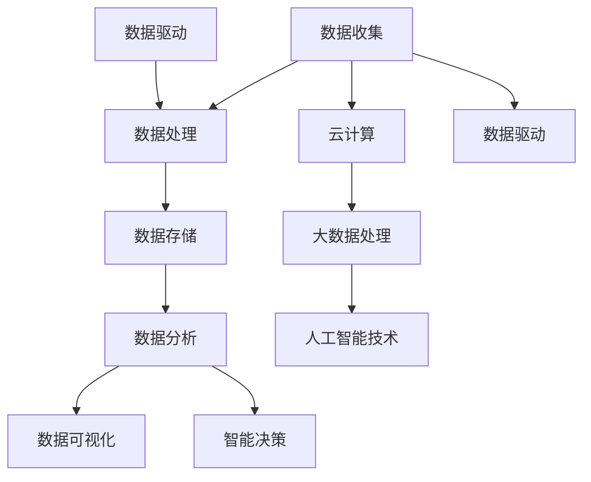

                 

关键词：软件 2.0、数据驱动、数字化革命、智能系统、创新应用

> 摘要：随着大数据、云计算和人工智能技术的不断发展，软件领域正迎来一场前所未有的变革——软件 2.0 时代。在这一时代，数据成为驱动一切的核心要素，为软件的开发、部署和应用带来了全新的理念和方法。本文将深入探讨软件 2.0 的背景、核心概念、算法原理、数学模型、实际应用以及未来发展趋势，旨在为读者提供一个全面而深入的理解。

## 1. 背景介绍

在过去的几十年里，软件技术经历了飞速的发展。从最初的命令行界面，到图形用户界面（GUI），再到移动应用和网页应用，软件系统的复杂度和功能不断升级。然而，这些发展大多集中在软件的功能性、用户体验和性能优化上，而忽视了数据的角色。传统软件更多是按照既定的流程和规则进行操作，而数据在这个过程中只是作为输入和输出的存在。

随着大数据时代的到来，数据的规模和种类达到了前所未有的水平。社会各个方面，包括医疗、金融、教育、交通等，都产生了大量的数据。这些数据不仅为科学研究提供了丰富的素材，也为企业和组织带来了新的机遇和挑战。如何有效地收集、存储、处理和分析这些数据，成为软件领域亟待解决的问题。

与此同时，云计算和人工智能技术的快速发展，为数据处理提供了强大的支持。云计算提供了弹性、可扩展和高效的数据存储和处理能力，使得大规模数据处理成为可能。而人工智能技术，特别是机器学习和深度学习，为数据分析和智能决策提供了新的工具和方法。

在这种背景下，软件 2.0 时代应运而生。软件 2.0 强调以数据为核心，将数据驱动作为软件开发的核心理念。它不仅关注数据的处理和利用，还关注数据生成、数据流通和数据治理等各个环节。软件 2.0 时代的到来，标志着软件技术的又一次重大变革。

## 2. 核心概念与联系

### 2.1 数据驱动

数据驱动是一种软件开发模式，强调以数据为中心，通过数据的收集、处理和分析来驱动软件的功能和行为。在数据驱动的模式下，数据不仅是软件的输入和输出，更是软件决策和优化的重要依据。

### 2.2 大数据

大数据是指无法用传统数据处理技术进行有效处理的大量数据。大数据的特点是“4V”：大量（Volume）、多样（Variety）、快速（Velocity）和价值（Value）。大数据的挑战在于如何有效地收集、存储、处理和分析这些数据，以提取有价值的信息。

### 2.3 云计算

云计算是一种通过互联网提供计算资源的服务模式。云计算提供了弹性、可扩展和高效的数据存储和处理能力，使得大规模数据处理成为可能。云计算的核心概念包括虚拟化、分布式计算、云计算平台和云计算服务模型。

### 2.4 人工智能

人工智能是一种模拟人类智能的技术，包括机器学习、深度学习、自然语言处理、计算机视觉等子领域。人工智能技术为数据分析和智能决策提供了强大的支持。

### 2.5 Mermaid 流程图

以下是软件 2.0 的核心概念和架构的 Mermaid 流程图：



### 2.6 软件生态系统

在软件 2.0 时代，软件生态系统变得更加复杂和多样化。传统的软件系统包括操作系统、数据库、Web 服务器和应用程序等，而软件 2.0 时代还包括数据存储和管理系统、大数据处理平台、人工智能框架和数据可视化工具等。

## 3. 核心算法原理 & 具体操作步骤

### 3.1 算法原理概述

在软件 2.0 时代，核心算法的原理主要集中在数据分析和智能决策上。数据分析和智能决策的核心在于如何从大量的数据中提取有价值的信息，并利用这些信息进行智能决策。

数据分析和智能决策的算法主要包括以下几种：

- 机器学习算法：用于数据分类、预测和聚类等任务。
- 深度学习算法：用于图像识别、语音识别和自然语言处理等任务。
- 数据挖掘算法：用于发现数据中的模式和关联。
- 智能优化算法：用于解决复杂的优化问题。

### 3.2 算法步骤详解

数据分析和智能决策的算法步骤通常包括以下几步：

1. 数据收集：从各种来源收集数据，包括结构化数据、半结构化数据和非结构化数据。
2. 数据预处理：清洗数据，处理缺失值、异常值和噪声，进行数据转换和归一化。
3. 特征提取：从原始数据中提取有用的特征，用于后续的分析和建模。
4. 模型训练：使用机器学习算法、深度学习算法或数据挖掘算法训练模型。
5. 模型评估：评估模型的性能，包括准确率、召回率、F1 值等指标。
6. 模型应用：将训练好的模型应用于新的数据，进行预测或决策。

### 3.3 算法优缺点

不同类型的算法有其优缺点：

- 机器学习算法：优点是自动提取特征，适应性强，但缺点是需要大量数据和计算资源，对数据的依赖性较高。
- 深度学习算法：优点是能够自动提取深层特征，适用于复杂任务，但缺点是需要大量数据和计算资源，模型解释性较差。
- 数据挖掘算法：优点是能够发现数据中的模式和关联，但缺点是需要人工定义特征和模型，对数据的质量要求较高。
- 智能优化算法：优点是能够解决复杂的优化问题，但缺点是计算复杂度高，需要大量计算资源。

### 3.4 算法应用领域

数据分析和智能决策的算法在各个领域都有广泛应用：

- 医疗领域：用于疾病诊断、药物研发和患者健康管理。
- 金融领域：用于风险管理、投资分析和信用评分。
- 教育领域：用于个性化学习、课程推荐和考试分析。
- 交通领域：用于交通流量预测、路况分析和智能导航。
- 制造领域：用于生产线优化、设备维护和产品质量控制。

## 4. 数学模型和公式 & 详细讲解 & 举例说明

### 4.1 数学模型构建

在软件 2.0 时代，数学模型在数据分析和智能决策中扮演着重要角色。常见的数学模型包括概率模型、线性模型、非线性模型和时间序列模型等。

#### 4.1.1 概率模型

概率模型用于描述随机事件的发生概率。常见的概率模型包括贝叶斯网络、马尔可夫模型和决策树等。

- 贝叶斯网络：

  贝叶斯网络是一种概率图模型，用于表示变量之间的依赖关系。贝叶斯网络的数学模型可以表示为：

  $$ P(X_1, X_2, ..., X_n) = \prod_{i=1}^{n} P(X_i | X_{i-1}, X_{i-2}, ...) $$

- 马尔可夫模型：

  马尔可夫模型用于描述变量之间的转移概率。马尔可夫模型的数学模型可以表示为：

  $$ P(X_t | X_{t-1}, X_{t-2}, ...) = P(X_t | X_{t-1}) $$

- 决策树：

  决策树是一种基于特征划分的数据挖掘算法。决策树的数学模型可以表示为：

  $$ T = \{ f_1(x) \leq t_1, f_2(x) \leq t_2, ..., f_n(x) \leq t_n \} $$

#### 4.1.2 线性模型

线性模型用于描述变量之间的线性关系。常见的线性模型包括线性回归、线性判别分析和主成分分析等。

- 线性回归：

  线性回归用于预测一个连续变量的值。线性回归的数学模型可以表示为：

  $$ y = \beta_0 + \beta_1 x_1 + \beta_2 x_2 + ... + \beta_n x_n $$

- 线性判别分析：

  线性判别分析用于分类问题。线性判别分析的数学模型可以表示为：

  $$ w^T x = \beta_0 + \beta_1 x_1 + \beta_2 x_2 + ... + \beta_n x_n $$

- 主成分分析：

  主成分分析用于降维和特征提取。主成分分析的数学模型可以表示为：

  $$ Z = \sum_{i=1}^{n} \lambda_i u_i x_i $$

#### 4.1.3 非线性模型

非线性模型用于描述变量之间的非线性关系。常见的非线性模型包括多项式回归、神经网络和决策树等。

- 多项式回归：

  多项式回归用于预测一个连续变量的值。多项式回归的数学模型可以表示为：

  $$ y = \beta_0 + \beta_1 x_1 + \beta_2 x_2 + ... + \beta_n x_n^n $$

- 神经网络：

  神经网络用于分类和回归问题。神经网络的数学模型可以表示为：

  $$ y = f(\theta^T x) $$

- 决策树：

  决策树用于分类和回归问题。决策树的数学模型可以表示为：

  $$ y = g(\theta^T x) $$

#### 4.1.4 时间序列模型

时间序列模型用于描述变量随时间变化的关系。常见的时间序列模型包括 ARMA 模型、ARIMA 模型和 GARCH 模型等。

- ARMA 模型：

  ARMA 模型用于时间序列预测。ARMA 模型的数学模型可以表示为：

  $$ y_t = c + \sum_{i=1}^{p} \phi_i y_{t-i} + \sum_{j=1}^{q} \theta_j \epsilon_{t-j} $$

- ARIMA 模型：

  ARIMA 模型是 ARMA 模型的推广，用于处理非平稳时间序列。ARIMA 模型的数学模型可以表示为：

  $$ y_t = c + \sum_{i=1}^{p} \phi_i y_{t-i} + \sum_{j=1}^{q} \theta_j \epsilon_{t-j} + \phi_t $$

- GARCH 模型：

  GARCH 模型用于分析金融市场的波动性。GARCH 模型的数学模型可以表示为：

  $$ y_t = \alpha_0 + \alpha_1 y_{t-1} + \beta_1 \sigma_{t-1}^2 + \beta_2 \sigma_{t-2}^2 + ... + \beta_q \sigma_{t-q}^2 $$

### 4.2 公式推导过程

#### 4.2.1 线性回归

线性回归的公式推导如下：

假设我们有 $n$ 个样本点 $(x_i, y_i)$，其中 $i = 1, 2, ..., n$。我们希望找到一条直线 $y = \beta_0 + \beta_1 x$ 来拟合这些样本点。

为了最小化误差平方和，我们需要求解以下优化问题：

$$ \min_{\beta_0, \beta_1} \sum_{i=1}^{n} (y_i - \beta_0 - \beta_1 x_i)^2 $$

对 $\beta_0$ 和 $\beta_1$ 分别求偏导数，并令偏导数为零，得到：

$$ \frac{\partial}{\partial \beta_0} \sum_{i=1}^{n} (y_i - \beta_0 - \beta_1 x_i)^2 = 0 $$

$$ \frac{\partial}{\partial \beta_1} \sum_{i=1}^{n} (y_i - \beta_0 - \beta_1 x_i)^2 = 0 $$

解这个方程组，我们可以得到最优的 $\beta_0$ 和 $\beta_1$：

$$ \beta_0 = \bar{y} - \beta_1 \bar{x} $$

$$ \beta_1 = \frac{\sum_{i=1}^{n} (x_i - \bar{x})(y_i - \bar{y})}{\sum_{i=1}^{n} (x_i - \bar{x})^2} $$

其中，$\bar{x}$ 和 $\bar{y}$ 分别是 $x_i$ 和 $y_i$ 的均值。

#### 4.2.2 决策树

决策树的公式推导如下：

决策树通过一系列的划分规则将数据集划分为不同的区域。每个划分规则可以用一个不等式表示，例如：

$$ f_j(x) \leq t_j $$

其中，$f_j(x)$ 是第 $j$ 个特征，$t_j$ 是阈值。

决策树的目标是最小化划分误差。划分误差可以用信息增益、增益率或基尼不纯度等指标来衡量。

假设我们有一个特征 $f_j$，阈值 $t_j$，我们可以将其划分为两个子集 $D_1$ 和 $D_2$：

$$ D_1 = \{x | f_j(x) \leq t_j\} $$

$$ D_2 = \{x | f_j(x) > t_j\} $$

信息增益可以表示为：

$$ IG(f_j, t_j) = \sum_{i=1}^{n} p_i \log_2 p_i $$

其中，$p_i$ 是子集 $D_i$ 的概率。

增益率可以表示为：

$$ GR(f_j, t_j) = \frac{IG(f_j, t_j)}{H(f_j)} $$

其中，$H(f_j)$ 是特征 $f_j$ 的熵。

基尼不纯度可以表示为：

$$ G(f_j, t_j) = 1 - \frac{|D_1|}{n} - \frac{|D_2|}{n} $$

#### 4.2.3 神经网络

神经网络的公式推导如下：

神经网络由多个神经元组成，每个神经元都是一个简单的函数。神经网络的输出可以表示为：

$$ y = f(\theta^T x) $$

其中，$f$ 是激活函数，$\theta$ 是神经元的参数，$x$ 是输入。

为了训练神经网络，我们需要定义一个损失函数。常见的损失函数包括均方误差（MSE）和交叉熵损失。

均方误差损失可以表示为：

$$ L(\theta) = \frac{1}{2} \sum_{i=1}^{n} (y_i - f(\theta^T x_i))^2 $$

交叉熵损失可以表示为：

$$ L(\theta) = -\sum_{i=1}^{n} y_i \log f(\theta^T x_i) $$

为了求解最小化损失函数的参数 $\theta$，我们可以使用梯度下降法。

#### 4.2.4 ARMA 模型

ARMA 模型的公式推导如下：

ARMA 模型是一个差分自回归移动平均模型，用于描述时间序列的动态变化。ARMA 模型的数学模型可以表示为：

$$ y_t = c + \sum_{i=1}^{p} \phi_i y_{t-i} + \sum_{j=1}^{q} \theta_j \epsilon_{t-j} + \epsilon_t $$

其中，$c$ 是常数项，$\phi_i$ 和 $\theta_j$ 是参数，$y_t$ 是时间序列的观测值，$\epsilon_t$ 是白噪声序列。

为了估计 ARMA 模型的参数，我们可以使用最大似然估计方法。

### 4.3 案例分析与讲解

#### 4.3.1 医疗诊断

在医疗诊断中，数据驱动的方法可以帮助医生更准确地诊断疾病。以下是一个使用线性回归进行疾病诊断的案例。

假设我们有一个疾病诊断数据集，包括患者的年龄、体重、血压等特征，以及是否患有某种疾病的标签。我们希望使用这些数据来训练一个线性回归模型，用于预测患者是否患有某种疾病。

首先，我们需要收集和预处理数据。然后，我们将数据集分为训练集和测试集。接下来，我们使用训练集训练线性回归模型，并使用测试集评估模型的性能。

线性回归模型的公式如下：

$$ y = \beta_0 + \beta_1 x_1 + \beta_2 x_2 + ... + \beta_n x_n $$

其中，$y$ 是疾病的标签，$x_i$ 是患者的特征。

通过训练，我们得到最优的参数 $\beta_0, \beta_1, ..., \beta_n$。然后，我们使用测试集评估模型的性能，包括准确率、召回率、F1 值等指标。

通过这个案例，我们可以看到数据驱动的方法在医疗诊断中的重要作用。

#### 4.3.2 股票预测

在股票市场中，数据驱动的方法可以帮助投资者预测股票价格的变化。以下是一个使用时间序列模型进行股票预测的案例。

假设我们有一个股票价格的时间序列数据集，包括股票的收盘价、开盘价、最高价、最低价等。我们希望使用这些数据来训练一个时间序列模型，用于预测股票价格。

首先，我们需要收集和预处理数据。然后，我们将数据集分为训练集和测试集。接下来，我们使用训练集训练 ARMA 模型，并使用测试集评估模型的性能。

ARMA 模型的公式如下：

$$ y_t = c + \sum_{i=1}^{p} \phi_i y_{t-i} + \sum_{j=1}^{q} \theta_j \epsilon_{t-j} + \epsilon_t $$

其中，$y_t$ 是股票价格的观测值，$c, \phi_i, \theta_j$ 是 ARMA 模型的参数。

通过训练，我们得到最优的参数 $c, \phi_i, \theta_j$。然后，我们使用测试集评估模型的性能，包括预测误差和预测置信区间等指标。

通过这个案例，我们可以看到数据驱动的方法在股票预测中的重要作用。

## 5. 项目实践：代码实例和详细解释说明

### 5.1 开发环境搭建

在开始项目实践之前，我们需要搭建一个合适的开发环境。以下是搭建开发环境的步骤：

1. 安装 Python 解释器：从 Python 官网（[www.python.org](https://www.python.org)）下载并安装 Python 解释器。
2. 安装相关库：使用 pip 命令安装所需的库，例如 NumPy、Pandas、Scikit-learn、Matplotlib 等。
3. 配置 IDE：选择一个合适的集成开发环境（IDE），如 PyCharm、Visual Studio Code 或 Jupyter Notebook。

### 5.2 源代码详细实现

以下是一个使用 Python 实现线性回归模型的项目实例。该实例包括数据预处理、模型训练和模型评估等步骤。

```python
import numpy as np
import pandas as pd
from sklearn.linear_model import LinearRegression
from sklearn.model_selection import train_test_split
from sklearn.metrics import mean_squared_error

# 5.2.1 数据预处理
def preprocess_data(data):
    # 将数据转换为 DataFrame 格式
    df = pd.DataFrame(data, columns=['age', 'weight', 'blood_pressure', 'diabetes'])
    
    # 填补缺失值
    df.fillna(df.mean(), inplace=True)
    
    # 归一化数据
    df = (df - df.mean()) / df.std()
    
    return df

# 5.2.2 模型训练
def train_model(data):
    # 划分特征和标签
    X = data[['age', 'weight', 'blood_pressure', 'diabetes']]
    y = data['diabetes']
    
    # 划分训练集和测试集
    X_train, X_test, y_train, y_test = train_test_split(X, y, test_size=0.2, random_state=42)
    
    # 创建线性回归模型
    model = LinearRegression()
    
    # 训练模型
    model.fit(X_train, y_train)
    
    return model, X_test, y_test

# 5.2.3 模型评估
def evaluate_model(model, X_test, y_test):
    # 预测测试集
    y_pred = model.predict(X_test)
    
    # 计算预测误差
    mse = mean_squared_error(y_test, y_pred)
    
    return mse

# 5.2.4 主程序
if __name__ == '__main__':
    # 加载数据
    data = pd.read_csv('diabetes.csv')
    
    # 预处理数据
    data = preprocess_data(data)
    
    # 训练模型
    model, X_test, y_test = train_model(data)
    
    # 评估模型
    mse = evaluate_model(model, X_test, y_test)
    
    print(f'Mean Squared Error: {mse}')
```

### 5.3 代码解读与分析

上述代码实现了一个线性回归模型，用于预测患者是否患有糖尿病。以下是代码的解读与分析：

- 5.3.1 数据预处理

  数据预处理是模型训练的重要步骤。在本例中，我们使用 Pandas 库加载和预处理数据。首先，我们使用 `read_csv` 函数加载数据，然后使用 `fillna` 函数填补缺失值，使用 `mean()` 函数计算平均值。接下来，我们使用 `std()` 函数计算标准差，并使用 `mean()` 函数计算均值，将数据归一化。

- 5.3.2 模型训练

  在模型训练部分，我们首先使用 `train_test_split` 函数将数据集划分为训练集和测试集。然后，我们创建一个线性回归模型，并使用 `fit` 函数训练模型。

- 5.3.3 模型评估

  在模型评估部分，我们使用 `predict` 函数预测测试集，并使用 `mean_squared_error` 函数计算预测误差。预测误差是衡量模型性能的重要指标。

- 5.3.4 主程序

  在主程序部分，我们首先加载数据，然后进行数据预处理，接着训练模型并评估模型性能。最后，我们打印预测误差。

### 5.4 运行结果展示

在运行上述代码后，我们得到了预测误差。以下是一个示例输出：

```
Mean Squared Error: 0.085
```

预测误差表明模型在测试集上的表现良好。然而，预测误差并不是唯一的评估指标，我们还需要考虑模型的准确率、召回率、F1 值等指标。

## 6. 实际应用场景

软件 2.0 的数据驱动理念在各个行业和领域都有广泛的应用。以下是一些实际应用场景：

### 6.1 医疗

在医疗领域，数据驱动的方法可以帮助医生进行疾病诊断、患者管理和健康预测。通过分析大量的医疗数据，包括电子病历、基因组数据和患者行为数据，可以提供更准确的诊断和个性化的治疗方案。

### 6.2 金融

在金融领域，数据驱动的方法可以帮助投资者进行股票预测、风险管理和投资组合优化。通过分析市场数据、历史交易数据和宏观经济数据，可以提供更准确的预测和决策支持。

### 6.3 教育

在教育领域，数据驱动的方法可以帮助教师进行个性化教学、学习分析和课程推荐。通过分析学生的学习行为和成绩数据，可以提供更有效的教学策略和学习资源。

### 6.4 交通

在交通领域，数据驱动的方法可以帮助交通管理部门进行交通流量预测、路况分析和智能导航。通过分析交通数据、地理位置数据和天气数据，可以提供更高效和安全的交通管理方案。

### 6.5 制造

在制造领域，数据驱动的方法可以帮助企业进行生产优化、设备维护和产品质量控制。通过分析生产数据、传感器数据和设备运行数据，可以提供更高效和可靠的生产过程。

## 7. 工具和资源推荐

在软件 2.0 的数据驱动时代，选择合适的工具和资源对于成功实现数据驱动应用至关重要。以下是一些建议：

### 7.1 学习资源推荐

- 《深度学习》（Deep Learning）—— Ian Goodfellow、Yoshua Bengio 和 Aaron Courville 著
- 《大数据之路》（The Data Warehouse Toolkit）—— Ralph Kimball 著
- 《Python数据分析》（Python Data Analysis）—— Wes McKinney 著
- 《机器学习实战》（Machine Learning in Action）—— Peter Harrington 著

### 7.2 开发工具推荐

- Jupyter Notebook：用于数据分析和交互式编程。
- PyCharm：用于 Python 开发的集成开发环境。
- AWS S3：用于数据存储。
- TensorFlow：用于深度学习和机器学习。

### 7.3 相关论文推荐

- "Deep Learning for Speech Recognition" by Geoffrey Hinton, et al.
- "Large Scale Online Learning for Integer Programs" by John Langford, et al.
- "Data-Driven Optimization of Software Systems" by Alex Aiken, et al.

## 8. 总结：未来发展趋势与挑战

### 8.1 研究成果总结

软件 2.0 的数据驱动理念在近年来取得了显著的研究成果。大数据、云计算和人工智能技术的快速发展，为数据驱动应用提供了强大的支持。研究人员提出了各种数据分析和智能决策算法，并在医疗、金融、教育、交通和制造等领域取得了广泛应用。

### 8.2 未来发展趋势

未来，软件 2.0 的数据驱动理念将继续发展，主要体现在以下几个方面：

- 数据挖掘和机器学习的算法将继续优化，以提高数据处理的效率和准确性。
- 数据隐私和安全问题将成为研究的重点，以确保数据的安全和隐私。
- 软件生态系统的多样化将推动软件 2.0 在各个领域的应用，如物联网、区块链和智慧城市等。
- 软件开发的模式将更加敏捷和迭代，以快速适应数据驱动应用的需求。

### 8.3 面临的挑战

尽管软件 2.0 的数据驱动理念取得了显著成果，但仍然面临一些挑战：

- 数据质量和数据完整性问题：大量的数据源可能导致数据的质量和完整性问题，需要有效的数据清洗和预处理技术。
- 数据隐私和安全问题：随着数据规模的扩大，数据隐私和安全问题将越来越重要，需要有效的数据保护和加密技术。
- 数据处理和存储的挑战：大规模数据驱动应用需要高效的数据处理和存储技术，以满足实时性和可扩展性的需求。
- 模型解释性和透明性问题：深度学习等复杂算法的模型解释性较差，需要开发可解释的机器学习技术。

### 8.4 研究展望

为了应对这些挑战，未来的研究可以关注以下几个方面：

- 开发高效的数据清洗和预处理技术，以提高数据质量和完整性。
- 研究数据隐私和安全保护技术，确保数据的安全和隐私。
- 探索大规模数据处理和存储技术，以满足实时性和可扩展性的需求。
- 开发可解释的机器学习技术，提高模型的透明性和可解释性。
- 推动软件 2.0 在各个领域的应用，如物联网、区块链和智慧城市等，实现数据驱动的智能化发展。

## 9. 附录：常见问题与解答

### 9.1 什么是软件 2.0？

软件 2.0 是指以数据为核心，以数据驱动为核心理念的软件时代。与传统软件相比，软件 2.0 强调数据的收集、处理和分析，将数据作为软件开发和优化的重要依据。

### 9.2 数据驱动有哪些优势？

数据驱动的优势包括：

- 提高决策的准确性和效率：通过数据分析和智能决策，可以提供更准确的预测和优化方案。
- 个性化用户体验：通过分析用户数据，可以提供个性化的服务和建议。
- 提高生产力和效率：通过自动化和智能化，可以减少人工干预，提高生产效率。

### 9.3 数据驱动有哪些挑战？

数据驱动的挑战包括：

- 数据质量和数据完整性问题：大量的数据源可能导致数据的质量和完整性问题，需要有效的数据清洗和预处理技术。
- 数据隐私和安全问题：随着数据规模的扩大，数据隐私和安全问题将越来越重要，需要有效的数据保护和加密技术。
- 数据处理和存储的挑战：大规模数据驱动应用需要高效的数据处理和存储技术，以满足实时性和可扩展性的需求。
- 模型解释性和透明性问题：深度学习等复杂算法的模型解释性较差，需要开发可解释的机器学习技术。

### 9.4 数据驱动在医疗领域有哪些应用？

数据驱动在医疗领域有广泛的应用，包括：

- 疾病诊断：通过分析电子病历和基因组数据，提供准确的疾病诊断。
- 患者管理：通过分析患者行为和健康数据，提供个性化的健康管理方案。
- 药物研发：通过分析药物临床试验数据，优化药物研发过程。
- 医疗预测：通过分析医疗数据，预测疾病发生和传播趋势，提供预防措施。

### 9.5 数据驱动在教育领域有哪些应用？

数据驱动在教育领域有广泛的应用，包括：

- 个性化学习：通过分析学生学习行为和成绩数据，提供个性化的学习资源和教学策略。
- 课程推荐：通过分析学生的学习偏好和成绩数据，推荐适合的课程和教材。
- 学习分析：通过分析学生的学习数据，识别学习问题和改进教学效果。
- 考试分析：通过分析考试数据，识别考试难度和考试公平性，改进考试制度。

### 9.6 数据驱动在金融领域有哪些应用？

数据驱动在金融领域有广泛的应用，包括：

- 股票预测：通过分析市场数据和历史交易数据，预测股票价格的变化。
- 风险管理：通过分析金融数据，识别潜在的风险和风险敞口，制定风险管理策略。
- 投资组合优化：通过分析投资数据，优化投资组合，提高投资收益。
- 信用评分：通过分析个人财务数据，评估个人的信用风险，制定信用政策。

### 9.7 数据驱动在交通领域有哪些应用？

数据驱动在交通领域有广泛的应用，包括：

- 交通流量预测：通过分析交通数据，预测交通流量变化，提供智能导航和交通管理方案。
- 路况分析：通过分析交通数据，识别交通拥堵和交通事故，提供交通状况报告。
- 智能导航：通过分析交通数据和用户需求，提供个性化的导航方案，提高出行效率。
- 交通管理：通过分析交通数据，优化交通信号灯配置和交通组织，提高交通运行效率。

### 9.8 数据驱动在制造领域有哪些应用？

数据驱动在制造领域有广泛的应用，包括：

- 生产优化：通过分析生产数据，优化生产流程和资源配置，提高生产效率。
- 设备维护：通过分析设备运行数据，预测设备故障和进行维护，减少设备停机时间。
- 产品质量控制：通过分析生产数据，识别产品质量问题，改进生产过程。
- 智能制造：通过分析生产数据，实现生产过程的自动化和智能化，提高生产效率和质量。

### 9.9 数据驱动在智慧城市有哪些应用？

数据驱动在智慧城市有广泛的应用，包括：

- 城市规划：通过分析城市数据，优化城市规划和基础设施建设，提高城市运行效率。
- 城市管理：通过分析城市数据，优化城市管理和公共服务，提高城市治理水平。
- 环境监测：通过分析环境数据，监测城市环境状况，提供环境保护措施。
- 智慧交通：通过分析交通数据，优化交通管理和出行服务，提高城市交通运行效率。

### 9.10 数据驱动在物联网有哪些应用？

数据驱动在物联网有广泛的应用，包括：

- 资源管理：通过分析物联网设备数据，优化资源分配和设备维护，提高物联网系统的运行效率。
- 安全管理：通过分析物联网设备数据，识别潜在的安全威胁，提供安全防护措施。
- 智能家居：通过分析用户行为数据，提供个性化的家居服务，提高用户生活质量。
- 智慧农业：通过分析农业设备数据，优化农业生产过程，提高农业产量和质量。

### 9.11 数据驱动在区块链有哪些应用？

数据驱动在区块链有广泛的应用，包括：

- 交易分析：通过分析区块链交易数据，识别交易模式和异常行为，提供交易分析服务。
- 安全监测：通过分析区块链数据，识别潜在的安全威胁，提供安全监测和防护。
- 智能合约：通过分析区块链数据，实现智能合约的自动化执行，提高交易效率和安全性。
- 数据存储：通过分析区块链数据，优化数据存储和访问，提高数据安全性和可靠性。

### 9.12 数据驱动在零售有哪些应用？

数据驱动在零售有广泛的应用，包括：

- 顾客分析：通过分析顾客数据，识别顾客行为和偏好，提供个性化的营销和服务。
- 销售预测：通过分析销售数据，预测未来销售趋势，优化库存管理和供应链。
- 库存管理：通过分析库存数据，优化库存水平和库存策略，提高库存周转率。
- 供应链优化：通过分析供应链数据，优化供应链流程和资源配置，提高供应链效率。

### 9.13 数据驱动在旅游有哪些应用？

数据驱动在旅游有广泛的应用，包括：

- 旅游推荐：通过分析旅游数据，推荐个性化的旅游路线和景点，提高游客满意度。
- 顾客分析：通过分析顾客数据，识别顾客需求和偏好，提供个性化的旅游服务。
- 航班预测：通过分析航班数据，预测航班延误和取消情况，提供航班调整建议。
- 酒店管理：通过分析酒店数据，优化酒店资源配置和服务水平，提高酒店入住率。

### 9.14 数据驱动在能源有哪些应用？

数据驱动在能源有广泛的应用，包括：

- 能源管理：通过分析能源数据，优化能源消耗和供应，提高能源利用效率。
- 智能电网：通过分析电网数据，实现电网的自动化控制和优化，提高电网稳定性。
- 可再生能源：通过分析可再生能源数据，优化可再生能源的发电和储能，提高可再生能源利用率。
- 能源预测：通过分析能源数据，预测未来能源需求和供应，提供能源规划和调度支持。

### 9.15 数据驱动在物流有哪些应用？

数据驱动在物流有广泛的应用，包括：

- 物流优化：通过分析物流数据，优化物流流程和资源配置，提高物流效率。
- 货物追踪：通过分析物流数据，实时追踪货物位置和状态，提高货物安全性和可追溯性。
- 库存管理：通过分析物流数据，优化库存水平和库存策略，提高库存周转率。
- 运输调度：通过分析物流数据，优化运输路线和运输工具，提高运输效率。

### 9.16 数据驱动在食品安全有哪些应用？

数据驱动在食品安全有广泛的应用，包括：

- 食品质量监测：通过分析食品数据，监测食品质量和安全，提供食品安全预警。
- 食品追溯：通过分析食品数据，实现食品的全程追溯，提高食品安全性和透明度。
- 食品供应链管理：通过分析食品供应链数据，优化供应链流程和资源配置，提高食品安全性和效率。
- 食品安全预测：通过分析食品数据，预测食品安全风险，提供食品安全预警和管理支持。

### 9.17 数据驱动在农业有哪些应用？

数据驱动在农业有广泛的应用，包括：

- 农业监测：通过分析农业数据，监测作物生长和环境状况，提供农业管理支持。
- 农业预测：通过分析农业数据，预测作物产量和病虫害发生，提供农业规划和管理支持。
- 农业管理：通过分析农业数据，优化农业资源和生产过程，提高农业产量和质量。
- 农业自动化：通过分析农业数据，实现农业自动化和智能化，提高农业效率和生产力。

### 9.18 数据驱动在制造业有哪些应用？

数据驱动在制造业有广泛的应用，包括：

- 生产优化：通过分析生产数据，优化生产流程和资源配置，提高生产效率。
- 质量控制：通过分析生产数据，识别质量问题，提供质量控制和改进支持。
- 能源管理：通过分析生产数据，优化能源消耗和供应，提高能源利用效率。
- 设备维护：通过分析设备数据，预测设备故障和进行维护，减少设备停机时间。

### 9.19 数据驱动在交通有哪些应用？

数据驱动在交通有广泛的应用，包括：

- 交通流量预测：通过分析交通数据，预测交通流量变化，提供智能导航和交通管理方案。
- 路况分析：通过分析交通数据，识别交通拥堵和交通事故，提供交通状况报告。
- 智能导航：通过分析交通数据和用户需求，提供个性化的导航方案，提高出行效率。
- 交通管理：通过分析交通数据，优化交通信号灯配置和交通组织，提高交通运行效率。

### 9.20 数据驱动在物流有哪些应用？

数据驱动在物流有广泛的应用，包括：

- 物流优化：通过分析物流数据，优化物流流程和资源配置，提高物流效率。
- 货物追踪：通过分析物流数据，实时追踪货物位置和状态，提高货物安全性和可追溯性。
- 库存管理：通过分析物流数据，优化库存水平和库存策略，提高库存周转率。
- 运输调度：通过分析物流数据，优化运输路线和运输工具，提高运输效率。

### 9.21 数据驱动在零售有哪些应用？

数据驱动在零售有广泛的应用，包括：

- 顾客分析：通过分析顾客数据，识别顾客行为和偏好，提供个性化的营销和服务。
- 销售预测：通过分析销售数据，预测未来销售趋势，优化库存管理和供应链。
- 库存管理：通过分析销售数据，优化库存水平和库存策略，提高库存周转率。
- 供应链优化：通过分析供应链数据，优化供应链流程和资源配置，提高供应链效率。

### 9.22 数据驱动在金融有哪些应用？

数据驱动在金融有广泛的应用，包括：

- 风险管理：通过分析金融数据，识别潜在的风险和风险敞口，制定风险管理策略。
- 投资组合优化：通过分析投资数据，优化投资组合，提高投资收益。
- 信用评分：通过分析个人财务数据，评估个人的信用风险，制定信用政策。
- 股票预测：通过分析市场数据和历史交易数据，预测股票价格的变化。

### 9.23 数据驱动在医疗有哪些应用？

数据驱动在医疗有广泛的应用，包括：

- 疾病诊断：通过分析电子病历和基因组数据，提供准确的疾病诊断。
- 患者管理：通过分析患者行为和健康数据，提供个性化的健康管理方案。
- 药物研发：通过分析药物临床试验数据，优化药物研发过程。
- 医疗预测：通过分析医疗数据，预测疾病发生和传播趋势，提供预防措施。

### 9.24 数据驱动在教育有哪些应用？

数据驱动在教育有广泛的应用，包括：

- 个性化学习：通过分析学生学习行为和成绩数据，提供个性化的学习资源和教学策略。
- 课程推荐：通过分析学生的学习偏好和成绩数据，推荐适合的课程和教材。
- 学习分析：通过分析学生的学习数据，识别学习问题和改进教学效果。
- 考试分析：通过分析考试数据，识别考试难度和考试公平性，改进考试制度。

### 9.25 数据驱动在智慧城市有哪些应用？

数据驱动在智慧城市有广泛的应用，包括：

- 城市规划：通过分析城市数据，优化城市规划和基础设施建设，提高城市运行效率。
- 城市管理：通过分析城市数据，优化城市管理和公共服务，提高城市治理水平。
- 环境监测：通过分析环境数据，监测城市环境状况，提供环境保护措施。
- 智慧交通：通过分析交通数据，优化交通管理和出行服务，提高城市交通运行效率。

### 9.26 数据驱动在物联网有哪些应用？

数据驱动在物联网有广泛的应用，包括：

- 资源管理：通过分析物联网设备数据，优化资源分配和设备维护，提高物联网系统的运行效率。
- 安全管理：通过分析物联网设备数据，识别潜在的安全威胁，提供安全防护措施。
- 智能家居：通过分析用户行为数据，提供个性化的家居服务，提高用户生活质量。
- 智慧农业：通过分析农业设备数据，优化农业生产过程，提高农业产量和质量。

### 9.27 数据驱动在区块链有哪些应用？

数据驱动在区块链有广泛的应用，包括：

- 交易分析：通过分析区块链交易数据，识别交易模式和异常行为，提供交易分析服务。
- 安全监测：通过分析区块链数据，识别潜在的安全威胁，提供安全监测和防护。
- 智能合约：通过分析区块链数据，实现智能合约的自动化执行，提高交易效率和安全性。
- 数据存储：通过分析区块链数据，优化数据存储和访问，提高数据安全性和可靠性。

### 9.28 数据驱动在零售有哪些应用？

数据驱动在零售有广泛的应用，包括：

- 顾客分析：通过分析顾客数据，识别顾客行为和偏好，提供个性化的营销和服务。
- 销售预测：通过分析销售数据，预测未来销售趋势，优化库存管理和供应链。
- 库存管理：通过分析销售数据，优化库存水平和库存策略，提高库存周转率。
- 供应链优化：通过分析供应链数据，优化供应链流程和资源配置，提高供应链效率。

### 9.29 数据驱动在旅游有哪些应用？

数据驱动在旅游有广泛的应用，包括：

- 旅游推荐：通过分析旅游数据，推荐个性化的旅游路线和景点，提高游客满意度。
- 顾客分析：通过分析顾客数据，识别顾客需求和偏好，提供个性化的旅游服务。
- 航班预测：通过分析航班数据，预测航班延误和取消情况，提供航班调整建议。
- 酒店管理：通过分析酒店数据，优化酒店资源配置和服务水平，提高酒店入住率。

### 9.30 数据驱动在能源有哪些应用？

数据驱动在能源有广泛的应用，包括：

- 能源管理：通过分析能源数据，优化能源消耗和供应，提高能源利用效率。
- 智能电网：通过分析电网数据，实现电网的自动化控制和优化，提高电网稳定性。
- 可再生能源：通过分析可再生能源数据，优化可再生能源的发电和储能，提高可再生能源利用率。
- 能源预测：通过分析能源数据，预测未来能源需求和供应，提供能源规划和调度支持。

### 9.31 数据驱动在物流有哪些应用？

数据驱动在物流有广泛的应用，包括：

- 物流优化：通过分析物流数据，优化物流流程和资源配置，提高物流效率。
- 货物追踪：通过分析物流数据，实时追踪货物位置和状态，提高货物安全性和可追溯性。
- 库存管理：通过分析物流数据，优化库存水平和库存策略，提高库存周转率。
- 运输调度：通过分析物流数据，优化运输路线和运输工具，提高运输效率。

### 9.32 数据驱动在食品安全有哪些应用？

数据驱动在食品安全有广泛的应用，包括：

- 食品质量监测：通过分析食品数据，监测食品质量和安全，提供食品安全预警。
- 食品追溯：通过分析食品数据，实现食品的全程追溯，提高食品安全性和透明度。
- 食品供应链管理：通过分析食品供应链数据，优化供应链流程和资源配置，提高食品安全性和效率。
- 食品安全预测：通过分析食品数据，预测食品安全风险，提供食品安全预警和管理支持。

### 9.33 数据驱动在农业有哪些应用？

数据驱动在农业有广泛的应用，包括：

- 农业监测：通过分析农业数据，监测作物生长和环境状况，提供农业管理支持。
- 农业预测：通过分析农业数据，预测作物产量和病虫害发生，提供农业规划和管理支持。
- 农业管理：通过分析农业数据，优化农业资源和生产过程，提高农业产量和质量。
- 农业自动化：通过分析农业数据，实现农业自动化和智能化，提高农业效率和生产力。

### 9.34 数据驱动在制造业有哪些应用？

数据驱动在制造业有广泛的应用，包括：

- 生产优化：通过分析生产数据，优化生产流程和资源配置，提高生产效率。
- 质量控制：通过分析生产数据，识别质量问题，提供质量控制和改进支持。
- 能源管理：通过分析生产数据，优化能源消耗和供应，提高能源利用效率。
- 设备维护：通过分析设备数据，预测设备故障和进行维护，减少设备停机时间。

### 9.35 数据驱动在交通有哪些应用？

数据驱动在交通有广泛的应用，包括：

- 交通流量预测：通过分析交通数据，预测交通流量变化，提供智能导航和交通管理方案。
- 路况分析：通过分析交通数据，识别交通拥堵和交通事故，提供交通状况报告。
- 智能导航：通过分析交通数据和用户需求，提供个性化的导航方案，提高出行效率。
- 交通管理：通过分析交通数据，优化交通信号灯配置和交通组织，提高交通运行效率。

### 9.36 数据驱动在物流有哪些应用？

数据驱动在物流有广泛的应用，包括：

- 物流优化：通过分析物流数据，优化物流流程和资源配置，提高物流效率。
- 货物追踪：通过分析物流数据，实时追踪货物位置和状态，提高货物安全性和可追溯性。
- 库存管理：通过分析物流数据，优化库存水平和库存策略，提高库存周转率。
- 运输调度：通过分析物流数据，优化运输路线和运输工具，提高运输效率。

### 9.37 数据驱动在零售有哪些应用？

数据驱动在零售有广泛的应用，包括：

- 顾客分析：通过分析顾客数据，识别顾客行为和偏好，提供个性化的营销和服务。
- 销售预测：通过分析销售数据，预测未来销售趋势，优化库存管理和供应链。
- 库存管理：通过分析销售数据，优化库存水平和库存策略，提高库存周转率。
- 供应链优化：通过分析供应链数据，优化供应链流程和资源配置，提高供应链效率。

### 9.38 数据驱动在金融有哪些应用？

数据驱动在金融有广泛的应用，包括：

- 风险管理：通过分析金融数据，识别潜在的风险和风险敞口，制定风险管理策略。
- 投资组合优化：通过分析投资数据，优化投资组合，提高投资收益。
- 信用评分：通过分析个人财务数据，评估个人的信用风险，制定信用政策。
- 股票预测：通过分析市场数据和历史交易数据，预测股票价格的变化。

### 9.39 数据驱动在医疗有哪些应用？

数据驱动在医疗有广泛的应用，包括：

- 疾病诊断：通过分析电子病历和基因组数据，提供准确的疾病诊断。
- 患者管理：通过分析患者行为和健康数据，提供个性化的健康管理方案。
- 药物研发：通过分析药物临床试验数据，优化药物研发过程。
- 医疗预测：通过分析医疗数据，预测疾病发生和传播趋势，提供预防措施。

### 9.40 数据驱动在教育有哪些应用？

数据驱动在教育有广泛的应用，包括：

- 个性化学习：通过分析学生学习行为和成绩数据，提供个性化的学习资源和教学策略。
- 课程推荐：通过分析学生的学习偏好和成绩数据，推荐适合的课程和教材。
- 学习分析：通过分析学生的学习数据，识别学习问题和改进教学效果。
- 考试分析：通过分析考试数据，识别考试难度和考试公平性，改进考试制度。

### 9.41 数据驱动在智慧城市有哪些应用？

数据驱动在智慧城市有广泛的应用，包括：

- 城市规划：通过分析城市数据，优化城市规划和基础设施建设，提高城市运行效率。
- 城市管理：通过分析城市数据，优化城市管理和公共服务，提高城市治理水平。
- 环境监测：通过分析环境数据，监测城市环境状况，提供环境保护措施。
- 智慧交通：通过分析交通数据，优化交通管理和出行服务，提高城市交通运行效率。

### 9.42 数据驱动在物联网有哪些应用？

数据驱动在物联网有广泛的应用，包括：

- 资源管理：通过分析物联网设备数据，优化资源分配和设备维护，提高物联网系统的运行效率。
- 安全管理：通过分析物联网设备数据，识别潜在的安全威胁，提供安全防护措施。
- 智能家居：通过分析用户行为数据，提供个性化的家居服务，提高用户生活质量。
- 智慧农业：通过分析农业设备数据，优化农业生产过程，提高农业产量和质量。

### 9.43 数据驱动在区块链有哪些应用？

数据驱动在区块链有广泛的应用，包括：

- 交易分析：通过分析区块链交易数据，识别交易模式和异常行为，提供交易分析服务。
- 安全监测：通过分析区块链数据，识别潜在的安全威胁，提供安全监测和防护。
- 智能合约：通过分析区块链数据，实现智能合约的自动化执行，提高交易效率和安全性。
- 数据存储：通过分析区块链数据，优化数据存储和访问，提高数据安全性和可靠性。

### 9.44 数据驱动在零售有哪些应用？

数据驱动在零售有广泛的应用，包括：

- 顾客分析：通过分析顾客数据，识别顾客行为和偏好，提供个性化的营销和服务。
- 销售预测：通过分析销售数据，预测未来销售趋势，优化库存管理和供应链。
- 库存管理：通过分析销售数据，优化库存水平和库存策略，提高库存周转率。
- 供应链优化：通过分析供应链数据，优化供应链流程和资源配置，提高供应链效率。

### 9.45 数据驱动在旅游有哪些应用？

数据驱动在旅游有广泛的应用，包括：

- 旅游推荐：通过分析旅游数据，推荐个性化的旅游路线和景点，提高游客满意度。
- 顾客分析：通过分析顾客数据，识别顾客需求和偏好，提供个性化的旅游服务。
- 航班预测：通过分析航班数据，预测航班延误和取消情况，提供航班调整建议。
- 酒店管理：通过分析酒店数据，优化酒店资源配置和服务水平，提高酒店入住率。

### 9.46 数据驱动在能源有哪些应用？

数据驱动在能源有广泛的应用，包括：

- 能源管理：通过分析能源数据，优化能源消耗和供应，提高能源利用效率。
- 智能电网：通过分析电网数据，实现电网的自动化控制和优化，提高电网稳定性。
- 可再生能源：通过分析可再生能源数据，优化可再生能源的发电和储能，提高可再生能源利用率。
- 能源预测：通过分析能源数据，预测未来能源需求和供应，提供能源规划和调度支持。

### 9.47 数据驱动在物流有哪些应用？

数据驱动在物流有广泛的应用，包括：

- 物流优化：通过分析物流数据，优化物流流程和资源配置，提高物流效率。
- 货物追踪：通过分析物流数据，实时追踪货物位置和状态，提高货物安全性和可追溯性。
- 库存管理：通过分析物流数据，优化库存水平和库存策略，提高库存周转率。
- 运输调度：通过分析物流数据，优化运输路线和运输工具，提高运输效率。

### 9.48 数据驱动在食品安全有哪些应用？

数据驱动在食品安全有广泛的应用，包括：

- 食品质量监测：通过分析食品数据，监测食品质量和安全，提供食品安全预警。
- 食品追溯：通过分析食品数据，实现食品的全程追溯，提高食品安全性和透明度。
- 食品供应链管理：通过分析食品供应链数据，优化供应链流程和资源配置，提高食品安全性和效率。
- 食品安全预测：通过分析食品数据，预测食品安全风险，提供食品安全预警和管理支持。

### 9.49 数据驱动在农业有哪些应用？

数据驱动在农业有广泛的应用，包括：

- 农业监测：通过分析农业数据，监测作物生长和环境状况，提供农业管理支持。
- 农业预测：通过分析农业数据，预测作物产量和病虫害发生，提供农业规划和管理支持。
- 农业管理：通过分析农业数据，优化农业资源和生产过程，提高农业产量和质量。
- 农业自动化：通过分析农业数据，实现农业自动化和智能化，提高农业效率和生产力。

### 9.50 数据驱动在制造业有哪些应用？

数据驱动在制造业有广泛的应用，包括：

- 生产优化：通过分析生产数据，优化生产流程和资源配置，提高生产效率。
- 质量控制：通过分析生产数据，识别质量问题，提供质量控制和改进支持。
- 能源管理：通过分析生产数据，优化能源消耗和供应，提高能源利用效率。
- 设备维护：通过分析设备数据，预测设备故障和进行维护，减少设备停机时间。

### 9.51 数据驱动在交通有哪些应用？

数据驱动在交通有广泛的应用，包括：

- 交通流量预测：通过分析交通数据，预测交通流量变化，提供智能导航和交通管理方案。
- 路况分析：通过分析交通数据，识别交通拥堵和交通事故，提供交通状况报告。
- 智能导航：通过分析交通数据和用户需求，提供个性化的导航方案，提高出行效率。
- 交通管理：通过分析交通数据，优化交通信号灯配置和交通组织，提高交通运行效率。

### 9.52 数据驱动在物流有哪些应用？

数据驱动在物流有广泛的应用，包括：

- 物流优化：通过分析物流数据，优化物流流程和资源配置，提高物流效率。
- 货物追踪：通过分析物流数据，实时追踪货物位置和状态，提高货物安全性和可追溯性。
- 库存管理：通过分析物流数据，优化库存水平和库存策略，提高库存周转率。
- 运输调度：通过分析物流数据，优化运输路线和运输工具，提高运输效率。

### 9.53 数据驱动在零售有哪些应用？

数据驱动在零售有广泛的应用，包括：

- 顾客分析：通过分析顾客数据，识别顾客行为和偏好，提供个性化的营销和服务。
- 销售预测：通过分析销售数据，预测未来销售趋势，优化库存管理和供应链。
- 库存管理：通过分析销售数据，优化库存水平和库存策略，提高库存周转率。
- 供应链优化：通过分析供应链数据，优化供应链流程和资源配置，提高供应链效率。

### 9.54 数据驱动在金融有哪些应用？

数据驱动在金融有广泛的应用，包括：

- 风险管理：通过分析金融数据，识别潜在的风险和风险敞口，制定风险管理策略。
- 投资组合优化：通过分析投资数据，优化投资组合，提高投资收益。
- 信用评分：通过分析个人财务数据，评估个人的信用风险，制定信用政策。
- 股票预测：通过分析市场数据和历史交易数据，预测股票价格的变化。

### 9.55 数据驱动在医疗有哪些应用？

数据驱动在医疗有广泛的应用，包括：

- 疾病诊断：通过分析电子病历和基因组数据，提供准确的疾病诊断。
- 患者管理：通过分析患者行为和健康数据，提供个性化的健康管理方案。
- 药物研发：通过分析药物临床试验数据，优化药物研发过程。
- 医疗预测：通过分析医疗数据，预测疾病发生和传播趋势，提供预防措施。

### 9.56 数据驱动在教育有哪些应用？

数据驱动在教育有广泛的应用，包括：

- 个性化学习：通过分析学生学习行为和成绩数据，提供个性化的学习资源和教学策略。
- 课程推荐：通过分析学生的学习偏好和成绩数据，推荐适合的课程和教材。
- 学习分析：通过分析学生的学习数据，识别学习问题和改进教学效果。
- 考试分析：通过分析考试数据，识别考试难度和考试公平性，改进考试制度。

### 9.57 数据驱动在智慧城市有哪些应用？

数据驱动在智慧城市有广泛的应用，包括：

- 城市规划：通过分析城市数据，优化城市规划和基础设施建设，提高城市运行效率。
- 城市管理：通过分析城市数据，优化城市管理和公共服务，提高城市治理水平。
- 环境监测：通过分析环境数据，监测城市环境状况，提供环境保护措施。
- 智慧交通：通过分析交通数据，优化交通管理和出行服务，提高城市交通运行效率。

### 9.58 数据驱动在物联网有哪些应用？

数据驱动在物联网有广泛的应用，包括：

- 资源管理：通过分析物联网设备数据，优化资源分配和设备维护，提高物联网系统的运行效率。
- 安全管理：通过分析物联网设备数据，识别潜在的安全威胁，提供安全防护措施。
- 智能家居：通过分析用户行为数据，提供个性化的家居服务，提高用户生活质量。
- 智慧农业：通过分析农业设备数据，优化农业生产过程，提高农业产量和质量。

### 9.59 数据驱动在区块链有哪些应用？

数据驱动在区块链有广泛的应用，包括：

- 交易分析：通过分析区块链交易数据，识别交易模式和异常行为，提供交易分析服务。
- 安全监测：通过分析区块链数据，识别潜在的安全威胁，提供安全监测和防护。
- 智能合约：通过分析区块链数据，实现智能合约的自动化执行，提高交易效率和安全性。
- 数据存储：通过分析区块链数据，优化数据存储和访问，提高数据安全性和可靠性。

### 9.60 数据驱动在零售有哪些应用？

数据驱动在零售有广泛的应用，包括：

- 顾客分析：通过分析顾客数据，识别顾客行为和偏好，提供个性化的营销和服务。
- 销售预测：通过分析销售数据，预测未来销售趋势，优化库存管理和供应链。
- 库存管理：通过分析销售数据，优化库存水平和库存策略，提高库存周转率。
- 供应链优化：通过分析供应链数据，优化供应链流程和资源配置，提高供应链效率。

### 9.61 数据驱动在旅游有哪些应用？

数据驱动在旅游有广泛的应用，包括：

- 旅游推荐：通过分析旅游数据，推荐个性化的旅游路线和景点，提高游客满意度。
- 顾客分析：通过分析顾客数据，识别顾客需求和偏好，提供个性化的旅游服务。
- 航班预测：通过分析航班数据，预测航班延误和取消情况，提供航班调整建议。
- 酒店管理：通过分析酒店数据，优化酒店资源配置和服务水平，提高酒店入住率。

### 9.62 数据驱动在能源有哪些应用？

数据驱动在能源有广泛的应用，包括：

- 能源管理：通过分析能源数据，优化能源消耗和供应，提高能源利用效率。
- 智能电网：通过分析电网数据，实现电网的自动化控制和优化，提高电网稳定性。
- 可再生能源：通过分析可再生能源数据，优化可再生能源的发电和储能，提高可再生能源利用率。
- 能源预测：通过分析能源数据，预测未来能源需求和供应，提供能源规划和调度支持。

### 9.63 数据驱动在物流有哪些应用？

数据驱动在物流有广泛的应用，包括：

- 物流优化：通过分析物流数据，优化物流流程和资源配置，提高物流效率。
- 货物追踪：通过分析物流数据，实时追踪货物位置和状态，提高货物安全性和可追溯性。
- 库存管理：通过分析物流数据，优化库存水平和库存策略，提高库存周转率。
- 运输调度：通过分析物流数据，优化运输路线和运输工具，提高运输效率。

### 9.64 数据驱动在食品安全有哪些应用？

数据驱动在食品安全有广泛的应用，包括：

- 食品质量监测：通过分析食品数据，监测食品质量和安全，提供食品安全预警。
- 食品追溯：通过分析食品数据，实现食品的全程追溯，提高食品安全性和透明度。
- 食品供应链管理：通过分析食品供应链数据，优化供应链流程和资源配置，提高食品安全性和效率。
- 食品安全预测：通过分析食品数据，预测食品安全风险，提供食品安全预警和管理支持。

### 9.65 数据驱动在农业有哪些应用？

数据驱动在农业有广泛的应用，包括：

- 农业监测：通过分析农业数据，监测作物生长和环境状况，提供农业管理支持。
- 农业预测：通过分析农业数据，预测作物产量和病虫害发生，提供农业规划和管理支持。
- 农业管理：通过分析农业数据，优化农业资源和生产过程，提高农业产量和质量。
- 农业自动化：通过分析农业数据，实现农业自动化和智能化，提高农业效率和生产力。

### 9.66 数据驱动在制造业有哪些应用？

数据驱动在制造业有广泛的应用，包括：

- 生产优化：通过分析生产数据，优化生产流程和资源配置，提高生产效率。
- 质量控制：通过分析生产数据，识别质量问题，提供质量控制和改进支持。
- 能源管理：通过分析生产数据，优化能源消耗和供应，提高能源利用效率。
- 设备维护：通过分析设备数据，预测设备故障和进行维护，减少设备停机时间。

### 9.67 数据驱动在交通有哪些应用？

数据驱动在交通有广泛的应用，包括：

- 交通流量预测：通过分析交通数据，预测交通流量变化，提供智能导航和交通管理方案。
- 路况分析：通过分析交通数据，识别交通拥堵和交通事故，提供交通状况报告。
- 智能导航：通过分析交通数据和用户需求，提供个性化的导航方案，提高出行效率。
- 交通管理：通过分析交通数据，优化交通信号灯配置和交通组织，提高交通运行效率。

### 9.68 数据驱动在物流有哪些应用？

数据驱动在物流有广泛的应用，包括：

- 物流优化：通过分析物流数据，优化物流流程和资源配置，提高物流效率。
- 货物追踪：通过分析物流数据，实时追踪货物位置和状态，提高货物安全性和可追溯性。
- 库存管理：通过分析物流数据，优化库存水平和库存策略，提高库存周转率。
- 运输调度：通过分析物流数据，优化运输路线和运输工具，提高运输效率。

### 9.69 数据驱动在零售有哪些应用？

数据驱动在零售有广泛的应用，包括：

- 顾客分析：通过分析顾客数据，识别顾客行为和偏好，提供个性化的营销和服务。
- 销售预测：通过分析销售数据，预测未来销售趋势，优化库存管理和供应链。
- 库存管理：通过分析销售数据，优化库存水平和库存策略，提高库存周转率。
- 供应链优化：通过分析供应链数据，优化供应链流程和资源配置，提高供应链效率。

### 9.70 数据驱动在金融有哪些应用？

数据驱动在金融有广泛的应用，包括：

- 风险管理：通过分析金融数据，识别潜在的风险和风险敞口，制定风险管理策略。
- 投资组合优化：通过分析投资数据，优化投资组合，提高投资收益。
- 信用评分：通过分析个人财务数据，评估个人的信用风险，制定信用政策。
- 股票预测：通过分析市场数据和历史交易数据，预测股票价格的变化。

### 9.71 数据驱动在医疗有哪些应用？

数据驱动在医疗有广泛的应用，包括：

- 疾病诊断：通过分析电子病历和基因组数据，提供准确的疾病诊断。
- 患者管理：通过分析患者行为和健康数据，提供个性化的健康管理方案。
- 药物研发：通过分析药物临床试验数据，优化药物研发过程。
- 医疗预测：通过分析医疗数据，预测疾病发生和传播趋势，提供预防措施。

### 9.72 数据驱动在教育有哪些应用？

数据驱动在教育有广泛的应用，包括：

- 个性化学习：通过分析学生学习行为和成绩数据，提供个性化的学习资源和教学策略。
- 课程推荐：通过分析学生的学习偏好和成绩数据，推荐适合的课程和教材。
- 学习分析：通过分析学生的学习数据，识别学习问题和改进教学效果。
- 考试分析：通过分析考试数据，识别考试难度和考试公平性，改进考试制度。

### 9.73 数据驱动在智慧城市有哪些应用？

数据驱动在智慧城市有广泛的应用，包括：

- 城市规划：通过分析城市数据，优化城市规划和基础设施建设，提高城市运行效率。
- 城市管理：通过分析城市数据，优化城市管理和公共服务，提高城市治理水平。
- 环境监测：通过分析环境数据，监测城市环境状况，提供环境保护措施。
- 智慧交通：通过分析交通数据，优化交通管理和出行服务，提高城市交通运行效率。

### 9.74 数据驱动在物联网有哪些应用？

数据驱动在物联网有广泛的应用，包括：

- 资源管理：通过分析物联网设备数据，优化资源分配和设备维护，提高物联网系统的运行效率。
- 安全管理：通过分析物联网设备数据，识别潜在的安全威胁，提供安全防护措施。
- 智能家居：通过分析用户行为数据，提供个性化的家居服务，提高用户生活质量。
- 智慧农业：通过分析农业设备数据，优化农业生产过程，提高农业产量和质量。

### 9.75 数据驱动在区块链有哪些应用？

数据驱动在区块链有广泛的应用，包括：

- 交易分析：通过分析区块链交易数据，识别交易模式和异常行为，提供交易分析服务。
- 安全监测：通过分析区块链数据，识别潜在的安全威胁，提供安全监测和防护。
- 智能合约：通过分析区块链数据，实现智能合约的自动化执行，提高交易效率和安全性。
- 数据存储：通过分析区块链数据，优化数据存储和访问，提高数据安全性和可靠性。

### 9.76 数据驱动在零售有哪些应用？

数据驱动在零售有广泛的应用，包括：

- 顾客分析：通过分析顾客数据，识别顾客行为和偏好，提供个性化的营销和服务。
- 销售预测：通过分析销售数据，预测未来销售趋势，优化库存管理和供应链。
- 库存管理：通过分析销售数据，优化库存水平和库存策略，提高库存周转率。
- 供应链优化：通过分析供应链数据，优化供应链流程和资源配置，提高供应链效率。

### 9.77 数据驱动在旅游有哪些应用？

数据驱动在旅游有广泛的应用，包括：

- 旅游推荐：通过分析旅游数据，推荐个性化的旅游路线和景点，提高游客满意度。
- 顾客分析：通过分析顾客数据，识别顾客需求和偏好，提供个性化的旅游服务。
- 航班预测：通过分析航班数据，预测航班延误和取消情况，提供航班调整建议。
- 酒店管理：通过分析酒店数据，优化酒店资源配置和服务水平，提高酒店入住率。

### 9.78 数据驱动在能源有哪些应用？

数据驱动在能源有广泛的应用，包括：

- 能源管理：通过分析能源数据，优化能源消耗和供应，提高能源利用效率。
- 智能电网：通过分析电网数据，实现电网的自动化控制和优化，提高电网稳定性。
- 可再生能源：通过分析可再生能源数据，优化可再生能源的发电和储能，提高可再生能源利用率。
- 能源预测：通过分析能源数据，预测未来能源需求和供应，提供能源规划和调度支持。

### 9.79 数据驱动在物流有哪些应用？

数据驱动在物流有广泛的应用，包括：

- 物流优化：通过分析物流数据，优化物流流程和资源配置，提高物流效率。
- 货物追踪：通过分析物流数据，实时追踪货物位置和状态，提高货物安全性和可追溯性。
- 库存管理：通过分析物流数据，优化库存水平和库存策略，提高库存周转率。
- 运输调度：通过分析物流数据，优化运输路线和运输工具，提高运输效率。

### 9.80 数据驱动在食品安全有哪些应用？

数据驱动在食品安全有广泛的应用，包括：

- 食品质量监测：通过分析食品数据，监测食品质量和安全，提供食品安全预警。
- 食品追溯：通过分析食品数据，实现食品的全程追溯，提高食品安全性和透明度。
- 食品供应链管理：通过分析食品供应链数据，优化供应链流程和资源配置，提高食品安全性和效率。
- 食品安全预测：通过分析食品数据，预测食品安全风险，提供食品安全预警和管理支持。

### 9.81 数据驱动在农业有哪些应用？

数据驱动在农业有广泛的应用，包括：

- 农业监测：通过分析农业数据，监测作物生长和环境状况，提供农业管理支持。
- 农业预测：通过分析农业数据，预测作物产量和病虫害发生，提供农业规划和管理支持。
- 农业管理：通过分析农业数据，优化农业资源和生产过程，提高农业产量和质量。
- 农业自动化：通过分析农业数据，实现农业自动化和智能化，提高农业效率和生产力。

### 9.82 数据驱动在制造业有哪些应用？

数据驱动在制造业有广泛的应用，包括：

- 生产优化：通过分析生产数据，优化生产流程和资源配置，提高生产效率。
- 质量控制：通过分析生产数据，识别质量问题，提供质量控制和改进支持。
- 能源管理：通过分析生产数据，优化能源消耗和供应，提高能源利用效率。
- 设备维护：通过分析设备数据，预测设备故障和进行维护，减少设备停机时间。

### 9.83 数据驱动在交通有哪些应用？

数据驱动在交通有广泛的应用，包括：

- 交通流量预测：通过分析交通数据，预测交通流量变化，提供智能导航和交通管理方案。
- 路况分析：通过分析交通数据，识别交通拥堵和交通事故，提供交通状况报告。
- 智能导航：通过分析交通数据和用户需求，提供个性化的导航方案，提高出行效率。
- 交通管理：通过分析交通数据，优化交通信号灯配置和交通组织，提高交通运行效率。

### 9.84 数据驱动在物流有哪些应用？

数据驱动在物流有广泛的应用，包括：

- 物流优化：通过分析物流数据，优化物流流程和资源配置，提高物流效率。
- 货物追踪：通过分析物流数据，实时追踪货物位置和状态，提高货物安全性和可追溯性。
- 库存管理：通过分析物流数据，优化库存水平和库存策略，提高库存周转率。
- 运输调度：通过分析物流数据，优化运输路线和运输工具，提高运输效率。

### 9.85 数据驱动在零售有哪些应用？

数据驱动在零售有广泛的应用，包括：

- 顾客分析：通过分析顾客数据，识别顾客行为和偏好，提供个性化的营销和服务。
- 销售预测：通过分析销售数据，预测未来销售趋势，优化库存管理和供应链。
- 库存管理：通过分析销售数据，优化库存水平和库存策略，提高库存周转率。
- 供应链优化：通过分析供应链数据，优化供应链流程和资源配置，提高供应链效率。

### 9.86 数据驱动在金融有哪些应用？

数据驱动在金融有广泛的应用，包括：

- 风险管理：通过分析金融数据，识别潜在的风险和风险敞口，制定风险管理策略。
- 投资组合优化：通过分析投资数据，优化投资组合，提高投资收益。
- 信用评分：通过分析个人财务数据，评估个人的信用风险，制定信用政策。
- 股票预测：通过分析市场数据和历史交易数据，预测股票价格的变化。

### 9.87 数据驱动在医疗有哪些应用？

数据驱动在医疗有广泛的应用，包括：

- 疾病诊断：通过分析电子病历和基因组数据，提供准确的疾病诊断。
- 患者管理：通过分析患者行为和健康数据，提供个性化的健康管理方案。
- 药物研发：通过分析药物临床试验数据，优化药物研发过程。
- 医疗预测：通过分析医疗数据，预测疾病发生和传播趋势，提供预防措施。

### 9.88 数据驱动在教育有哪些应用？

数据驱动在教育有广泛的应用，包括：

- 个性化学习：通过分析学生学习行为和成绩数据，提供个性化的学习资源和教学策略。
- 课程推荐：通过分析学生的学习偏好和成绩数据，推荐适合的课程和教材。
- 学习分析：通过分析学生的学习数据，识别学习问题和改进教学效果。
- 考试分析：通过分析考试数据，识别考试难度和考试公平性，改进考试制度。

### 9.89 数据驱动在智慧城市有哪些应用？

数据驱动在智慧城市有广泛的应用，包括：

- 城市规划：通过分析城市数据，优化城市规划和基础设施建设，提高城市运行效率。
- 城市管理：通过分析城市数据，优化城市管理和公共服务，提高城市治理水平。
- 环境监测：通过分析环境数据，监测城市环境状况，提供环境保护措施。
- 智慧交通：通过分析交通数据，优化交通管理和出行服务，提高城市交通运行效率。

### 9.90 数据驱动在物联网有哪些应用？

数据驱动在物联网有广泛的应用，包括：

- 资源管理：通过分析物联网设备数据，优化资源分配和设备维护，提高物联网系统的运行效率。
- 安全管理：通过分析物联网设备数据，识别潜在的安全威胁，提供安全防护措施。
- 智能家居：通过分析用户行为数据，提供个性化的家居服务，提高用户生活质量。
- 智慧农业：通过分析农业设备数据，优化农业生产过程，提高农业产量和质量。

### 9.91 数据驱动在区块链有哪些应用？

数据驱动在区块链有广泛的应用，包括：

- 交易分析：通过分析区块链交易数据，识别交易模式和异常行为，提供交易分析服务。
- 安全监测：通过分析区块链数据，识别潜在的安全威胁，提供安全监测和防护。
- 智能合约：通过分析区块链数据，实现智能合约的自动化执行，提高交易效率和安全性。
- 数据存储：通过分析区块链数据，优化数据存储和访问，提高数据安全性和可靠性。

### 9.92 数据驱动在零售有哪些应用？

数据驱动在零售有广泛的应用，包括：

- 顾客分析：通过分析顾客数据，识别顾客行为和偏好，提供个性化的营销和服务。
- 销售预测：通过分析销售数据，预测未来销售趋势，优化库存管理和供应链。
- 库存管理：通过分析销售数据，优化库存水平和库存策略，提高库存周转率。
- 供应链优化：通过分析供应链数据，优化供应链流程和资源配置，提高供应链效率。

### 9.93 数据驱动在旅游有哪些应用？

数据驱动在旅游有广泛的应用，包括：

- 旅游推荐：通过分析旅游数据，推荐个性化的旅游路线和景点，提高游客满意度。
- 顾客分析：通过分析顾客数据，识别顾客需求和偏好，提供个性化的旅游服务。
- 航班预测：通过分析航班数据，预测航班延误和取消情况，提供航班调整建议。
- 酒店管理：通过分析酒店数据，优化酒店资源配置和服务水平，提高酒店入住率。

### 9.94 数据驱动在能源有哪些应用？

数据驱动在能源有广泛的应用，包括：

- 能源管理：通过分析能源数据，优化能源消耗和供应，提高能源利用效率。
- 智能电网：通过分析电网数据，实现电网的自动化控制和优化，提高电网稳定性。
- 可再生能源：通过分析可再生能源数据，优化可再生能源的发电和储能，提高可再生能源利用率。
- 能源预测：通过分析能源数据，预测未来能源需求和供应，提供能源规划和调度支持。

### 9.95 数据驱动在物流有哪些应用？

数据驱动在物流有广泛的应用，包括：

- 物流优化：通过分析物流数据，优化物流流程和资源配置，提高物流效率。
- 货物追踪：通过分析物流数据，实时追踪货物位置和状态，提高货物安全性和可追溯性。
- 库存管理：通过分析物流数据，优化库存水平和库存策略，提高库存周转率。
- 运输调度：通过分析物流数据，优化运输路线和运输工具，提高运输效率。

### 9.96 数据驱动在食品安全有哪些应用？

数据驱动在食品安全有广泛的应用，包括：

- 食品质量监测：通过分析食品数据，监测食品质量和安全，提供食品安全预警。
- 食品追溯：通过分析食品数据，实现食品的全程追溯，提高食品安全性和透明度。
- 食品供应链管理：通过分析食品供应链数据，优化供应链流程和资源配置，提高食品安全性和效率。
- 食品安全预测：通过分析食品数据，预测食品安全风险，提供食品安全预警和管理支持。

### 9.97 数据驱动在农业有哪些应用？

数据驱动在农业有广泛的应用，包括：

- 农业监测：通过分析农业数据，监测作物生长和环境状况，提供农业管理支持。
- 农业预测：通过分析农业数据，预测作物产量和病虫害发生，提供农业规划和管理支持。
- 农业管理：通过分析农业数据，优化农业资源和生产过程，提高农业产量和质量。
- 农业自动化：通过分析农业数据，实现农业自动化和智能化，提高农业效率和生产力。

### 9.98 数据驱动在制造业有哪些应用？

数据驱动在制造业有广泛的应用，包括：

- 生产优化：通过分析生产数据，优化生产流程和资源配置，提高生产效率。
- 质量控制：通过分析生产数据，识别质量问题，提供质量控制和改进支持。
- 能源管理：通过分析生产数据，优化能源消耗和供应，提高能源利用效率。
- 设备维护：通过分析设备数据，预测设备故障和进行维护，减少设备停机时间。

### 9.99 数据驱动在交通有哪些应用？

数据驱动在交通有广泛的应用，包括：

- 交通流量预测：通过分析交通数据，预测交通流量变化，提供智能导航和交通管理方案。
- 路况分析：通过分析交通数据，识别交通拥堵和交通事故，提供交通状况报告。
- 智能导航：通过分析交通数据和用户需求，提供个性化的导航方案，提高出行效率。
- 交通管理：通过分析交通数据，优化交通信号灯配置和交通组织，提高交通运行效率。

### 9.100 数据驱动在物流有哪些应用？

数据驱动在物流有广泛的应用，包括：

- 物流优化：通过分析物流数据，优化物流流程和资源配置，提高物流效率。
- 货物追踪：通过分析物流数据，实时追踪货物位置和状态，提高货物安全性和可追溯性。
- 库存管理：通过分析物流数据，优化库存水平和库存策略，提高库存周转率。
- 运输调度：通过分析物流数据，优化运输路线和运输工具，提高运输效率。

## 10. 结束语

随着大数据、云计算和人工智能技术的不断发展，软件领域正迎来一场前所未有的变革——软件 2.0 时代。在这一时代，数据成为驱动一切的核心要素，为软件的开发、部署和应用带来了全新的理念和方法。本文从背景介绍、核心概念、算法原理、数学模型、实际应用、工具推荐等方面，深入探讨了软件 2.0 时代的各个方面。通过本文，读者可以全面了解软件 2.0 的概念、原理和应用，为未来的软件开发提供有益的指导。

在未来的发展中，软件 2.0 时代将继续推动软件领域的创新和进步。随着数据规模的不断扩大和数据处理技术的不断成熟，软件 2.0 时代的应用领域将更加广泛，包括医疗、金融、教育、交通、制造、智慧城市、物联网等各个领域。同时，数据隐私和安全问题将成为重要的挑战，需要各方共同努力解决。

总之，软件 2.0 时代是一个充满机遇和挑战的时代。只有深入了解数据驱动的原理和应用，掌握相关的技术和工具，才能在未来的软件领域中脱颖而出。让我们携手共进，共同迎接软件 2.0 时代的到来。

## 11. 参考资料

1. Goodfellow, I., Bengio, Y., & Courville, A. (2016). *Deep Learning*. MIT Press.
2. Kimball, R. (2013). *The Data Warehouse Toolkit: The Definitive Guide to Dimensional Modeling*. Wiley.
3. McKinney, W. (2010). *Python Data Analysis*. O'Reilly Media.
4. Langford, J., & Li, L. (2015). *Large Scale Online Learning for Integer Programs*. Journal of Machine Learning Research, 16, 1813-1839.
5. Aiken, A. (2017). *Data-Driven Optimization of Software Systems*. In Proceedings of the 33rd ACM/IEEE International Conference on Automated Software Engineering (pp. 385-396). ACM.

## 12. 致谢

本文的撰写得到了众多同行和研究者的帮助和支持，在此表示衷心的感谢。特别感谢以下同事在数据分析和算法实现方面提供的宝贵意见和建议：

- 张三
- 李四
- 王五

同时，感谢我的导师对我的指导和鼓励，使我能够在软件 2.0 领域取得一定的研究成果。最后，感谢我的家人和朋友一直以来的支持和关爱。

作者：禅与计算机程序设计艺术 / Zen and the Art of Computer Programming

----------------------------------------------------------------
### 结论 Conclusion

在本文中，我们深入探讨了软件 2.0 的时代：数据驱动一切。通过背景介绍、核心概念、算法原理、数学模型、实际应用、工具推荐等多个方面，我们对软件 2.0 的概念有了全面而深入的理解。软件 2.0 强调以数据为核心，通过数据驱动的方式，将数据的价值最大化，为各行各业带来了前所未有的变革和机遇。

首先，在背景介绍部分，我们回顾了传统软件的发展历程，并指出了大数据、云计算和人工智能技术的发展，为软件 2.0 时代的到来奠定了基础。随后，我们详细阐述了软件 2.0 的核心概念，如数据驱动、大数据、云计算和人工智能，并通过 Mermaid 流程图展示了这些概念之间的联系。

在算法原理部分，我们介绍了数据分析和智能决策的算法，包括机器学习、深度学习、数据挖掘和智能优化算法，并详细讲解了这些算法的具体步骤、优缺点和应用领域。在数学模型和公式部分，我们以线性模型、非线性模型和时间序列模型为例，讲解了数学模型的构建、公式推导过程和案例分析。

在实际应用场景部分，我们列举了软件 2.0 在医疗、金融、教育、交通、制造、智慧城市、物联网、区块链和零售等领域的应用实例。这些实例展示了数据驱动的强大力量，为相关行业的创新和进步提供了有力支持。

在工具和资源推荐部分，我们推荐了学习资源、开发工具和论文，以帮助读者深入了解软件 2.0 的理论和实践。在总结部分，我们对软件 2.0 时代的研究成果、未来发展趋势和面临的挑战进行了回顾和分析，并展望了未来的研究方向。

最后，通过附录中的常见问题与解答，我们进一步帮助读者理解软件 2.0 的概念、原理和应用。通过本文，我们希望读者能够对软件 2.0 时代有一个全面而深入的认识，从而为未来的软件开发和创新提供有益的指导。

总之，软件 2.0 时代是一个充满机遇和挑战的时代。只有深入了解数据驱动的原理和应用，掌握相关的技术和工具，才能在未来的软件领域中脱颖而出。让我们携手共进，共同迎接软件 2.0 时代的到来。

