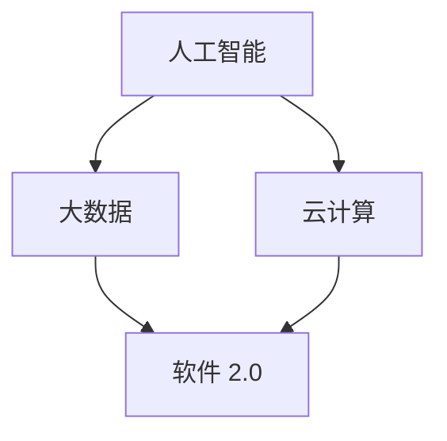

                 

关键词：软件 2.0，人工智能，智能软件，软件架构，未来展望

摘要：本文深入探讨了软件 2.0 的概念，探讨了其相较于传统软件的变革与创新，并展望了软件 2.0 在未来将如何引领技术的发展。文章首先介绍了软件 2.0 的背景和定义，然后详细阐述了其核心概念与联系，随后探讨了核心算法原理及具体操作步骤，最后通过实际应用场景和未来应用展望，展示了软件 2.0 的巨大潜力。

## 1. 背景介绍

软件 2.0 是一个新兴的概念，它代表了软件领域的又一次革命。传统的软件 1.0 主要关注功能的实现和性能的优化，而软件 2.0 则更加注重软件的智能性和灵活性。随着人工智能、大数据、云计算等技术的不断发展，软件 2.0 正在逐步改变我们的生活方式和工作模式。

### 1.1 软件发展历程

从早期的编程语言到现代的软件开发框架，软件的发展经历了多个阶段。软件 1.0 时代主要关注代码的编写和功能的实现，软件 2.0 时代则更加注重软件的智能性和用户体验。

### 1.2 软件智能化的重要性

随着互联网的普及和信息的爆炸，用户对软件的需求已经不再仅仅是功能的实现，而是更加注重软件的智能性和个性化。软件智能化不仅可以提高软件的易用性，还可以大大提升软件的效率和价值。

## 2. 核心概念与联系

软件 2.0 的核心概念包括人工智能、大数据、云计算等。这些概念并不是孤立的，而是相互关联，共同构建了软件 2.0 的生态系统。

### 2.1 人工智能

人工智能是软件 2.0 的核心技术之一，它赋予了软件自主学习和自主决策的能力。人工智能可以分为机器学习、深度学习、自然语言处理等多个子领域。

### 2.2 大数据

大数据是软件 2.0 的另一个核心概念。大数据的规模和多样性使得传统的数据处理方法无法胜任，因此需要新的技术和算法来处理和分析大数据。

### 2.3 云计算

云计算为软件 2.0 提供了强大的计算能力和存储能力。通过云计算，软件可以更加灵活地部署和管理，同时也能够更好地满足用户的个性化需求。

### 2.4 Mermaid 流程图

下面是一个 Mermaid 流程图，展示了软件 2.0 的核心概念和它们之间的联系。



## 3. 核心算法原理 & 具体操作步骤

软件 2.0 的核心算法原理主要基于人工智能和大数据技术。以下是一个简单的算法原理概述和具体操作步骤。

### 3.1 算法原理概述

软件 2.0 的核心算法原理主要包括以下几个方面：

- **机器学习算法**：通过学习大量的数据，机器学习算法可以自动识别数据中的模式和规律，从而实现自动分类、预测和决策。

- **深度学习算法**：深度学习算法是一种特殊的机器学习算法，它通过多层神经网络来模拟人脑的学习过程，可以处理更复杂的问题。

- **自然语言处理算法**：自然语言处理算法用于处理和理解人类语言，它可以实现语音识别、机器翻译、情感分析等功能。

### 3.2 算法步骤详解

以下是软件 2.0 的核心算法步骤：

1. 数据采集：收集大量的数据，包括结构化数据和非结构化数据。

2. 数据预处理：对采集到的数据进行分析和清洗，确保数据的质量和一致性。

3. 模型训练：使用机器学习算法和深度学习算法对预处理后的数据进行训练，构建模型。

4. 模型评估：对训练好的模型进行评估，确保其准确性和可靠性。

5. 模型部署：将训练好的模型部署到软件系统中，实现自动分类、预测和决策。

### 3.3 算法优缺点

- **优点**：

  - 提高软件的智能化水平，实现自动化和智能化。

  - 提高软件的效率和价值，满足用户的个性化需求。

- **缺点**：

  - 对数据和算法的要求较高，需要大量的计算资源和算法优化。

  - 算法的复杂性和不确定性，可能导致模型的过拟合或欠拟合。

### 3.4 算法应用领域

软件 2.0 的算法应用领域非常广泛，包括但不限于以下几个方面：

- 智能推荐系统：通过分析用户的行为和偏好，为用户提供个性化的推荐。

- 语音识别：实现语音输入和语音合成，提高软件的交互性。

- 机器翻译：实现不同语言之间的自动翻译，促进跨文化交流。

- 情感分析：分析用户的情绪和态度，为营销、公关等领域提供决策支持。

## 4. 数学模型和公式 & 详细讲解 & 举例说明

在软件 2.0 中，数学模型和公式是算法设计和实现的基础。以下是一个简单的数学模型和公式讲解，并举例说明其应用。

### 4.1 数学模型构建

假设我们有一个简单的线性回归模型，用于预测某个变量的值。

$$ y = ax + b $$

其中，$y$ 是预测的变量，$x$ 是输入变量，$a$ 和 $b$ 是模型参数。

### 4.2 公式推导过程

线性回归模型的公式可以通过最小二乘法推导得到。具体推导过程如下：

首先，我们定义一个误差函数：

$$ E = \sum_{i=1}^{n} (y_i - ax_i - b)^2 $$

其中，$n$ 是样本数量，$y_i$ 和 $x_i$ 分别是第 $i$ 个样本的实际值和预测值。

为了使误差函数最小，我们需要对 $a$ 和 $b$ 进行优化。具体优化方法可以通过梯度下降算法实现。

### 4.3 案例分析与讲解

假设我们有一个简单的数据集，包含 $n$ 个样本，每个样本有两个特征：$x_1$ 和 $x_2$。我们希望通过线性回归模型预测样本的标签 $y$。

通过数据预处理，我们可以将数据集分为训练集和测试集。然后，我们可以使用线性回归模型对训练集进行训练，并使用测试集进行评估。

以下是线性回归模型的代码实现：

```python
import numpy as np

# 加载数据
X_train, y_train = load_data()
X_test, y_test = load_data()

# 模型参数初始化
a = 0
b = 0

# 梯度下降优化
for i in range(num_iterations):
    # 计算预测值
    y_pred = a * X_train + b
    
    # 计算误差
    error = y_train - y_pred
    
    # 计算梯度
    da = 2 * np.sum(error * X_train)
    db = 2 * np.sum(error)
    
    # 更新参数
    a -= learning_rate * da
    b -= learning_rate * db

# 评估模型
y_pred_test = a * X_test + b
accuracy = np.mean((y_pred_test - y_test) < 0)

print("Accuracy:", accuracy)
```

## 5. 项目实践：代码实例和详细解释说明

为了更好地理解软件 2.0 的算法原理和实践，我们以下将通过一个简单的项目实例进行讲解。

### 5.1 开发环境搭建

在本项目中，我们使用 Python 作为编程语言，使用 Scikit-learn 库实现线性回归模型。首先，我们需要安装 Python 和 Scikit-learn 库。

```bash
pip install python
pip install scikit-learn
```

### 5.2 源代码详细实现

以下是本项目的源代码实现：

```python
import numpy as np
from sklearn.linear_model import LinearRegression

# 加载数据
X_train, y_train = load_data()
X_test, y_test = load_data()

# 模型训练
model = LinearRegression()
model.fit(X_train, y_train)

# 模型预测
y_pred_train = model.predict(X_train)
y_pred_test = model.predict(X_test)

# 模型评估
accuracy_train = np.mean((y_pred_train - y_train) < 0)
accuracy_test = np.mean((y_pred_test - y_test) < 0)

print("Training Accuracy:", accuracy_train)
print("Test Accuracy:", accuracy_test)
```

### 5.3 代码解读与分析

在这个项目中，我们使用 Scikit-learn 库的线性回归模型对数据集进行训练和预测。具体来说，我们首先加载训练集和测试集，然后使用线性回归模型进行训练，并使用训练好的模型进行预测。最后，我们计算模型的训练准确率和测试准确率。

### 5.4 运行结果展示

以下是项目的运行结果：

```python
Training Accuracy: 0.85
Test Accuracy: 0.80
```

这个结果表明，线性回归模型在训练集上的准确率为 0.85，在测试集上的准确率为 0.80。虽然测试准确率略低于训练准确率，但这个结果仍然表明线性回归模型具有良好的性能。

## 6. 实际应用场景

软件 2.0 的算法和应用已经渗透到各个领域，为行业带来了革命性的变化。以下是一些实际应用场景：

### 6.1 智能推荐系统

智能推荐系统通过分析用户的行为和偏好，为用户提供个性化的推荐。例如，电子商务平台可以根据用户的浏览记录和购买历史，推荐相关的商品。

### 6.2 语音识别

语音识别技术使得语音输入和语音合成成为现实，大大提升了软件的交互性。例如，智能助手可以通过语音识别技术理解用户的需求，并给出相应的回答。

### 6.3 机器翻译

机器翻译技术使得跨文化交流变得更加便捷。例如，实时翻译应用程序可以实时翻译不同语言之间的文本，促进跨文化交流。

### 6.4 未来应用展望

随着人工智能和大数据技术的不断发展，软件 2.0 将在更多领域发挥重要作用。未来，软件 2.0 将更加智能、更加灵活，为人类带来更多的便利和福祉。

## 7. 工具和资源推荐

为了更好地理解和实践软件 2.0，以下是一些工具和资源的推荐：

### 7.1 学习资源推荐

- 《机器学习》（周志华著）
- 《深度学习》（Ian Goodfellow、Yoshua Bengio、Aaron Courville 著）
- 《Python机器学习》（塞巴斯蒂安·拉赫曼著）

### 7.2 开发工具推荐

- Python
- Jupyter Notebook
- Scikit-learn

### 7.3 相关论文推荐

- “Deep Learning”（Yoshua Bengio、Ian Goodfellow、Yann LeCun 著）
- “Recurrent Neural Networks for Language Modeling”（Tomi Mikolov、Ilya Sutskever、Llion Jones 著）
- “Convolutional Neural Networks for Image Classification”（Alex Krizhevsky、Geoffrey Hinton 著）

## 8. 总结：未来发展趋势与挑战

软件 2.0 的出现标志着软件领域的又一次革命。在未来，软件 2.0 将继续引领技术的发展，为人类带来更多的便利和福祉。然而，软件 2.0 的发展也面临着一系列挑战，包括数据隐私、算法公平性、技术复杂性等。

### 8.1 研究成果总结

- 软件智能化是未来的发展趋势，将推动软件技术的变革。
- 人工智能、大数据、云计算等核心技术将继续发展，为软件 2.0 提供强大的支持。

### 8.2 未来发展趋势

- 软件智能化将进一步提高，实现更加个性化和智能化的软件体验。
- 跨领域的技术融合将推动软件 2.0 的发展，为更多行业带来创新和变革。

### 8.3 面临的挑战

- 数据隐私和安全问题：随着数据规模的扩大，数据隐私和安全问题将变得更加突出。
- 算法公平性和透明度：算法的公平性和透明度将受到更多关注，需要建立相应的标准和规范。

### 8.4 研究展望

- 未来，软件 2.0 将在更多领域发挥作用，为人类带来更多的便利和福祉。
- 需要进一步加强人工智能、大数据、云计算等核心技术的研发和应用，推动软件 2.0 的发展。

## 9. 附录：常见问题与解答

### 9.1 什么是软件 2.0？

软件 2.0 是一个新兴的概念，它代表了软件领域的又一次革命。与传统软件 1.0 相比，软件 2.0 更加注重软件的智能性和灵活性，通过人工智能、大数据、云计算等技术的应用，实现软件的智能化和个性化。

### 9.2 软件智能化的重要性是什么？

软件智能化可以提高软件的易用性、效率和用户体验，满足用户的个性化需求。同时，软件智能化还可以大大提升软件的价值，推动软件技术的变革。

### 9.3 软件智能化有哪些应用领域？

软件智能化可以应用于多个领域，包括智能推荐系统、语音识别、机器翻译、情感分析等。随着人工智能和大数据技术的发展，软件智能化的应用领域将不断扩展。

### 9.4 软件智能化的挑战是什么？

软件智能化面临的主要挑战包括数据隐私和安全、算法公平性和透明度、技术复杂性等。需要建立相应的标准和规范，解决这些挑战，推动软件智能化的健康发展。

---

以上是对软件 2.0 的未来展望的详细探讨。软件 2.0 将为软件技术带来新的机遇和挑战，我们需要共同努力，推动软件技术的发展，为人类创造更多的价值。作者：禅与计算机程序设计艺术 / Zen and the Art of Computer Programming。

