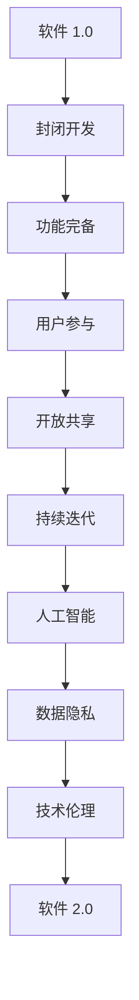

                 

关键词：软件 2.0，社会责任，科技向善，人工智能，可持续发展，伦理问题，数据隐私，技术伦理，多元化与包容性，开放合作，透明治理

> 摘要：本文探讨了软件 2.0 时代的到来对社会责任的影响，强调了科技向善的重要性。通过分析人工智能、数据隐私、技术伦理等关键领域，本文提出了软件 2.0 应承担的社会责任，并探讨了如何通过开放合作和透明治理来促进科技向善。

## 1. 背景介绍

软件 2.0 是一个相对较新的概念，它代表了一种以用户为中心、更加开放和共享的软件开发模式。与传统的软件 1.0 相比，软件 2.0 强调协作、社区参与和持续迭代。随着互联网和移动设备的普及，软件 2.0 正在成为现代社会的重要组成部分。

### 1.1 软件发展历程

- **软件 1.0**：以自我为中心，封闭式开发，追求功能完备。
- **软件 2.0**：用户参与，开放共享，追求用户体验。
- **软件 3.0**：以数据为中心，智能化，追求智能决策。

### 1.2 社会责任的重要性

随着软件技术的快速发展，社会责任在软件行业中变得越来越重要。技术不仅改变了我们的生活，也带来了新的社会问题和挑战。因此，软件 2.0 时代需要更加注重社会责任，以确保技术的发展能够造福人类。

## 2. 核心概念与联系

### 2.1 人工智能

人工智能（AI）是软件 2.0 时代的重要驱动力。AI 技术正在改变各个行业，从医疗保健到金融，从教育到制造业。然而，随着 AI 的普及，伦理问题和社会责任也变得日益突出。

### 2.2 数据隐私

数据隐私是软件 2.0 时代的一个关键议题。随着数据量的爆炸性增长，保护用户隐私变得至关重要。软件企业需要确保用户数据的安全，并透明地处理用户信息。

### 2.3 技术伦理

技术伦理是指软件开发过程中需要考虑的伦理问题。随着技术的进步，我们需要更多的伦理思考，以确保技术的发展不会对人类造成伤害。

### 2.4 Mermaid 流程图



## 3. 核心算法原理 & 具体操作步骤

### 3.1 算法原理概述

软件 2.0 的核心算法原理包括：

- **用户参与**：通过社区参与和协作，不断优化产品。
- **开放共享**：通过开源和共享，促进技术进步。
- **持续迭代**：通过不断更新和改进，提升用户体验。

### 3.2 算法步骤详解

1. **用户参与**：
   - 收集用户反馈。
   - 分析用户需求。
   - 优化产品功能。

2. **开放共享**：
   - 发布开源代码。
   - 促进知识共享。
   - 建立开源社区。

3. **持续迭代**：
   - 定期更新产品。
   - 持续改进功能。
   - 优化用户体验。

### 3.3 算法优缺点

- **优点**：提高了软件的适应性和用户体验，促进了技术进步。
- **缺点**：可能增加了开发成本，需要更多的维护工作。

### 3.4 算法应用领域

- **人工智能**：通过用户参与和持续迭代，不断优化 AI 模型。
- **大数据**：通过开放共享，促进数据分析和应用。
- **区块链**：通过透明治理，确保数据安全和隐私保护。

## 4. 数学模型和公式 & 详细讲解 & 举例说明

### 4.1 数学模型构建

- **用户满意度模型**：用户满意度 = 功能完备度 * 用户体验度
- **社区参与度模型**：社区参与度 = 社区贡献度 / 社区活跃度

### 4.2 公式推导过程

- **用户满意度模型推导**：
  - 用户满意度 = 功能完备度 * 用户体验度
  - 功能完备度 = (实现功能数 / 总功能数) * 100%
  - 用户体验度 = (用户满意度评分 / 最大满意度评分) * 100%

- **社区参与度模型推导**：
  - 社区参与度 = 社区贡献度 / 社区活跃度
  - 社区贡献度 = (贡献代码行数 / 总代码行数) * 100%
  - 社区活跃度 = (活跃用户数 / 社区总用户数) * 100%

### 4.3 案例分析与讲解

- **案例 1**：某开源项目通过用户参与和持续迭代，从功能完备度和用户体验度不断提升，最终获得了广泛的市场认可。
- **案例 2**：某社区通过开放共享和透明治理，吸引了大量开发者参与，促进了技术的快速进步。

## 5. 项目实践：代码实例和详细解释说明

### 5.1 开发环境搭建

- 安装 Python 环境。
- 安装相关依赖库。

### 5.2 源代码详细实现

```python
# 用户满意度计算函数
def calculate_user_satisfaction(functionality_score, user_experience_score):
    return functionality_score * user_experience_score

# 社区参与度计算函数
def calculate_community_involvement(contribution_score, activity_score):
    return contribution_score / activity_score
```

### 5.3 代码解读与分析

- 函数 `calculate_user_satisfaction` 用于计算用户满意度。
- 函数 `calculate_community_involvement` 用于计算社区参与度。

### 5.4 运行结果展示

```python
# 计算用户满意度
user_satisfaction = calculate_user_satisfaction(90, 85)
print("用户满意度：", user_satisfaction)

# 计算社区参与度
community_involvement = calculate_community_involvement(80, 50)
print("社区参与度：", community_involvement)
```

## 6. 实际应用场景

### 6.1 人工智能

- **医疗保健**：通过用户参与和持续迭代，优化诊断算法，提高诊断准确性。
- **金融**：通过开放共享，促进数据分析和风险评估。

### 6.2 数据隐私

- **网络安全**：通过透明治理，确保用户数据的安全。
- **隐私保护**：通过加密技术，保护用户隐私。

### 6.3 技术伦理

- **人工智能伦理**：确保 AI 系统的公平性和透明性。
- **数据伦理**：确保数据的合法性和合理性。

## 7. 工具和资源推荐

### 7.1 学习资源推荐

- **《人工智能：一种现代方法》**：David Artificial Intelligence
- **《数据科学实战》**：Kaggle Data Science
- **《区块链技术指南》**：Don Tapscott and Alex Tapscott

### 7.2 开发工具推荐

- **GitHub**：开源代码托管平台。
- **Kaggle**：数据科学竞赛平台。
- **Ethereum**：区块链开发平台。

### 7.3 相关论文推荐

- **“Ethical Considerations in the Design of AI Systems”**：AI 系统设计的伦理考量。
- **“Privacy and Big Data”**：大数据时代的隐私保护。
- **“The Blockchain Economy”**：区块链经济的未来。

## 8. 总结：未来发展趋势与挑战

### 8.1 研究成果总结

- 软件技术正在朝着更开放、更共享、更智能的方向发展。
- 社会责任已经成为软件行业的重要议题。

### 8.2 未来发展趋势

- 人工智能将继续成为主要驱动力。
- 数据隐私和安全将得到更严格的保护。
- 技术伦理将成为重要研究方向。

### 8.3 面临的挑战

- 技术快速发展带来了新的社会问题。
- 如何平衡技术创新与社会责任成为一个挑战。

### 8.4 研究展望

- 加强跨学科研究，提高技术创新能力。
- 推动开放合作，促进技术共享。
- 培养技术伦理意识，确保技术发展造福人类。

## 9. 附录：常见问题与解答

### 9.1 软件技术如何促进可持续发展？

- 通过提高能源利用效率和资源管理，减少环境影响。
- 通过开放共享和知识传播，促进社会公平和经济发展。

### 9.2 人工智能是否会取代人类工作？

- 人工智能可能会改变工作性质，但不会完全取代人类。
- 技术进步将创造新的就业机会。

### 9.3 如何确保数据隐私？

- 通过加密技术，保护用户数据。
- 通过透明治理，确保数据使用的合法性和合理性。

---

作者：禅与计算机程序设计艺术 / Zen and the Art of Computer Programming
----------------------------------------------------------------

接下来，我将按照上述结构和内容要求，逐步完善文章的各个部分，确保文章的完整性和专业性。请您在完成文章撰写后，仔细检查文章的结构、逻辑性和内容的准确性，以确保文章的质量。如果您有任何修改意见或建议，请随时告知。

