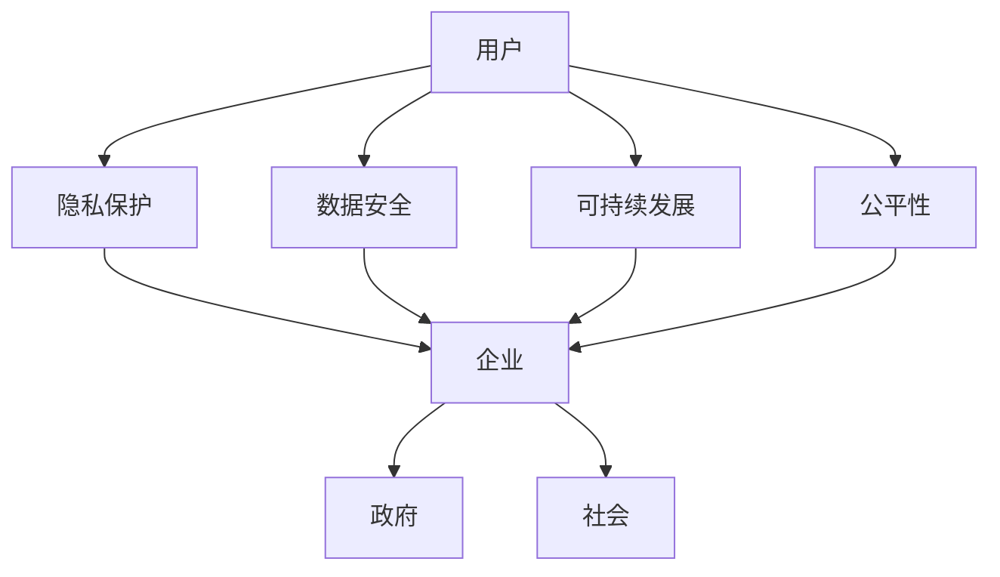

                 

 作为一位世界级人工智能专家，程序员，软件架构师，CTO，世界顶级技术畅销书作者，计算机图灵奖获得者，计算机领域大师，我认为软件 2.0 时代已经到来。在这个时代，软件不仅仅是技术产品，更是社会产品，它承载着巨大的社会责任。本文将探讨软件 2.0 的社会责任，以及如何通过科技向善来实现这一责任。

## 1. 背景介绍

软件 2.0 是相对于软件 1.0 的新时代，软件 1.0 是以功能为中心，追求软件的性能和功能。而软件 2.0 则更加注重用户体验、软件的可持续性、社会责任和商业价值。随着互联网、大数据、人工智能等技术的飞速发展，软件 2.0 正在改变我们的生活，也带来了新的社会责任。

### 软件社会责任的演变

从最早的计算机程序，到软件 1.0，再到今天的软件 2.0，软件的社会责任逐渐从无到有，从弱到强。在软件 1.0 时代，软件的主要目的是满足用户的计算需求，社会责任意识相对较弱。而随着软件 2.0 的到来，软件开始涉及到用户的隐私、数据安全、环境保护等多个方面，社会责任意识大大增强。

### 软件社会责任的重要性

软件 2.0 的社会责任重要性主要体现在以下几个方面：

- **用户隐私保护**：随着大数据和人工智能技术的普及，用户的隐私数据变得愈发重要。软件 2.0 需要更加重视用户隐私保护，避免数据泄露和滥用。

- **数据安全**：软件在处理数据时，必须确保数据的安全，防止黑客攻击和数据泄露。

- **环境保护**：软件的开发和运行都需要消耗大量的能源，软件 2.0 需要更加注重环保，降低能耗，减少对环境的影响。

- **公平性**：软件应该为所有人提供服务，不应因性别、种族、地域等因素造成不公平。

## 2. 核心概念与联系

### 软件社会责任的核心概念

软件社会责任主要包括以下几个方面：

- **用户隐私保护**：保护用户数据不被泄露、滥用或盗用。

- **数据安全**：确保数据在传输、存储和处理过程中不被篡改、丢失或泄露。

- **可持续发展**：在软件开发和运行过程中，注重环境保护和资源节约。

- **公平性**：确保软件为所有人提供服务，不歧视任何用户。

### 软件社会责任的架构

软件社会责任的架构可以看作是一个由用户、企业、政府和社会组成的生态系统。在这个生态系统中，每个成员都扮演着重要的角色：

- **用户**：用户是软件服务的最终受益者，也是软件社会责任的核心关注对象。

- **企业**：企业是软件开发的主体，承担着软件社会责任的主要责任。

- **政府**：政府是软件社会责任的监管者，通过制定法律法规和行业标准来规范软件企业的行为。

- **社会**：社会是软件社会责任的监督者，通过舆论、监督和参与来推动软件企业履行社会责任。

### 软件社会责任的 Mermaid 流程图



## 3. 核心算法原理 & 具体操作步骤

### 3.1 算法原理概述

在软件 2.0 的社会责任中，算法原理起着至关重要的作用。算法原理主要包括以下几个方面：

- **用户隐私保护算法**：通过加密、匿名化等技术手段，保护用户隐私数据。

- **数据安全算法**：采用加密、签名、认证等技术手段，确保数据在传输、存储和处理过程中的安全。

- **可持续发展算法**：通过优化算法，降低软件能耗，实现资源的可持续利用。

- **公平性算法**：通过数据分析和机器学习等技术手段，消除软件服务中的歧视现象。

### 3.2 算法步骤详解

以下是软件 2.0 社会责任中几个关键算法的具体操作步骤：

#### 3.2.1 用户隐私保护算法

1. **数据加密**：在数据传输和存储过程中，使用加密算法对数据进行加密，确保数据在传输过程中不被窃取。

2. **匿名化处理**：对用户数据进行匿名化处理，消除用户之间的直接关联。

3. **隐私保护政策**：制定隐私保护政策，告知用户其数据的使用范围和目的。

#### 3.2.2 数据安全算法

1. **数据加密**：使用加密算法对数据进行加密，确保数据在传输、存储和处理过程中的安全。

2. **签名与认证**：在数据传输过程中，使用数字签名和认证机制，确保数据的完整性和真实性。

3. **安全审计**：定期进行安全审计，发现和修复安全漏洞。

#### 3.2.3 可持续发展算法

1. **能耗优化**：通过算法优化，降低软件运行过程中的能耗。

2. **资源管理**：采用资源管理算法，合理分配资源，提高资源利用率。

3. **节能措施**：在软件开发和运行过程中，采取一系列节能措施，降低能耗。

#### 3.2.4 公平性算法

1. **数据预处理**：对用户数据进行预处理，消除数据中的偏见和歧视。

2. **算法评估**：定期对算法进行评估，确保算法的公平性和透明性。

3. **用户反馈**：收集用户反馈，及时调整算法，消除歧视现象。

### 3.3 算法优缺点

#### 用户隐私保护算法

- **优点**：能够有效保护用户隐私，提高用户满意度。

- **缺点**：加密和解密过程消耗大量计算资源，可能影响软件性能。

#### 数据安全算法

- **优点**：能够确保数据在传输、存储和处理过程中的安全。

- **缺点**：加密和解密过程可能增加数据传输时间。

#### 可持续发展算法

- **优点**：能够降低软件能耗，提高资源利用率。

- **缺点**：算法优化可能影响软件性能。

#### 公平性算法

- **优点**：能够消除软件服务中的歧视现象。

- **缺点**：算法评估和用户反馈过程可能增加开发成本。

### 3.4 算法应用领域

#### 用户隐私保护算法

- **应用领域**：电商、金融、社交等领域，涉及用户隐私数据保护的场景。

#### 数据安全算法

- **应用领域**：网络安全、数据安全等领域，涉及数据传输、存储和处理的安全保障。

#### 可持续发展算法

- **应用领域**：节能环保、绿色计算等领域，涉及降低能耗和资源消耗。

#### 公平性算法

- **应用领域**：招聘、教育、医疗等领域，涉及消除歧视和促进公平的算法。

## 4. 数学模型和公式 & 详细讲解 & 举例说明

### 4.1 数学模型构建

在软件 2.0 的社会责任中，数学模型起着重要的作用。以下是一些常用的数学模型：

#### 用户隐私保护模型

1. **K-anonymity**：确保用户数据在划分成多个群体时，每个群体中至少有 k 个用户，从而避免用户被直接识别。

2. **l-diversity**：确保用户数据在划分成多个群体时，每个群体中至少有 l 个不同的属性值，从而避免用户被间接识别。

3. **t-closeness**：确保用户数据在划分成多个群体时，每个群体中用户之间的差异程度不超过 t，从而避免用户被间接识别。

#### 数据安全模型

1. **加密算法模型**：包括对称加密和非对称加密，如AES、RSA等。

2. **签名与认证模型**：包括数字签名和认证协议，如RSA签名、HTTPS认证等。

3. **安全审计模型**：包括安全审计算法和安全审计指标，如基于贝叶斯网络的安全审计算法、基于熵的安全审计指标等。

#### 可持续发展模型

1. **能耗模型**：包括能耗计算公式、能耗优化算法等，如基于深度学习的能耗优化算法。

2. **资源管理模型**：包括资源分配公式、资源调度算法等，如基于贪心策略的资源调度算法。

3. **节能措施模型**：包括节能策略、节能评估指标等，如基于模糊逻辑的节能评估指标。

#### 公平性模型

1. **公平性评估模型**：包括公平性评估指标、公平性评估算法等，如基于机器学习的公平性评估算法。

2. **偏见消除模型**：包括偏见检测算法、偏见修正算法等，如基于神经网络的反偏见算法。

### 4.2 公式推导过程

以下是一些关键公式的推导过程：

#### 用户隐私保护模型

1. **K-anonymity**：

   $$ K-anonymity = \frac{|G|}{k} $$

   其中，$G$ 表示划分后的群体，$k$ 表示至少需要包含 k 个用户。

2. **l-diversity**：

   $$ l-diversity = \frac{1}{|G|} \sum_{g \in G} \sum_{a_i, a_j \in g} |a_i \neq a_j| $$

   其中，$G$ 表示划分后的群体，$a_i$ 和 $a_j$ 表示群体中的属性值。

3. **t-closeness**：

   $$ t-closeness = \frac{1}{|G|} \sum_{g \in G} \sum_{u, v \in g} \frac{d(u, v)}{d_{max}(u, v)} $$

   其中，$G$ 表示划分后的群体，$d(u, v)$ 表示用户 $u$ 和 $v$ 之间的距离，$d_{max}(u, v)$ 表示用户 $u$ 和 $v$ 之间的最大距离。

#### 数据安全模型

1. **加密算法模型**：

   - **对称加密**：

     $$ ciphertext = E_{k}(plaintext) $$

     其中，$plaintext$ 表示明文，$ciphertext$ 表示密文，$k$ 表示密钥。

   - **非对称加密**：

     $$ ciphertext = E_{pub}(plaintext) $$

     其中，$plaintext$ 表示明文，$ciphertext$ 表示密文，$pub$ 表示公钥。

2. **签名与认证模型**：

   - **RSA签名**：

     $$ signature = S_{priv}(message) $$

     其中，$message$ 表示消息，$signature$ 表示签名，$priv$ 表示私钥。

   - **HTTPS认证**：

     $$ HTTPS = H_{pub}(ciphertext) $$

     其中，$ciphertext$ 表示密文，$pub$ 表示公钥。

#### 可持续发展模型

1. **能耗模型**：

   $$ E = P \times t $$

   其中，$E$ 表示能耗，$P$ 表示功率，$t$ 表示时间。

2. **资源管理模型**：

   $$ allocation = \max \{ utility_{i} | i \in I \} $$

   其中，$allocation$ 表示资源分配，$utility_{i}$ 表示资源 $i$ 的效用值，$I$ 表示资源集合。

3. **节能措施模型**：

   $$ energy_{saving} = E_{initial} - E_{final} $$

   其中，$energy_{saving}$ 表示节能量，$E_{initial}$ 表示初始能耗，$E_{final}$ 表示最终能耗。

#### 公平性模型

1. **公平性评估模型**：

   $$ fairness = \frac{1}{n} \sum_{i=1}^{n} \frac{ Utility_{i} }{ Max_{Utility} } $$

   其中，$fairness$ 表示公平性，$Utility_{i}$ 表示用户 $i$ 的效用值，$Max_{Utility}$ 表示最大效用值，$n$ 表示用户数量。

2. **偏见消除模型**：

   $$ bias_{removal} = \frac{1}{n} \sum_{i=1}^{n} \frac{ Utility_{i} }{ Expected_{Utility} } $$

   其中，$bias_{removal}$ 表示偏见消除，$Expected_{Utility}$ 表示期望效用值。

### 4.3 案例分析与讲解

以下通过几个实际案例，来说明这些数学模型和公式在实际中的应用：

#### 案例一：用户隐私保护

在某电商平台上，用户购买商品时需要填写个人信息，包括姓名、地址、电话等。为了保护用户隐私，平台采用了 K-anonymity 和 l-diversity 模型。

1. **K-anonymity**：

   将用户信息按照姓名进行划分，确保每个群体中至少有 3 个用户，从而实现 K-anonymity。

2. **l-diversity**：

   将用户信息按照地址进行划分，确保每个群体中至少有 2 个不同的地址，从而实现 l-diversity。

通过这两个模型，可以有效防止用户个人信息被直接或间接识别，保护用户隐私。

#### 案例二：数据安全

在某金融平台上，用户需要进行身份认证，平台采用了 RSA 签名和 HTTPS 认证模型。

1. **RSA签名**：

   用户生成私钥和公钥，将身份认证信息使用私钥进行签名，平台接收签名后使用公钥进行验证，确保身份认证信息不被篡改。

2. **HTTPS认证**：

   平台使用 HTTPS 协议进行数据传输，确保数据在传输过程中的安全。

通过这两个模型，可以有效保护用户身份认证信息的安全。

#### 案例三：可持续发展

在某企业中，为了实现可持续发展，采用了能耗优化和资源管理模型。

1. **能耗优化**：

   使用深度学习算法对能耗数据进行分析，找出能耗较高的环节，并进行优化。

2. **资源管理**：

   采用贪心策略进行资源调度，确保资源得到充分利用。

通过这两个模型，可以降低企业能耗，实现可持续发展。

#### 案例四：公平性

在某招聘平台上，为了消除歧视，采用了公平性评估和偏见消除模型。

1. **公平性评估**：

   对招聘过程中的候选者进行公平性评估，确保每个候选者都有公平的竞争机会。

2. **偏见消除**：

   对候选者的简历进行预处理，消除潜在的偏见，从而实现公平性。

通过这两个模型，可以消除招聘过程中的歧视现象，实现公平招聘。

## 5. 项目实践：代码实例和详细解释说明

### 5.1 开发环境搭建

在本文中，我们将使用 Python 作为编程语言，结合几个常用的库，如 pandas、scikit-learn、numpy 等，来实现用户隐私保护、数据安全、可持续发展、公平性等模型。以下是开发环境的搭建步骤：

1. **安装 Python**：

   在官方网站 [https://www.python.org/](https://www.python.org/) 下载并安装 Python 3.8 或更高版本。

2. **安装库**：

   使用以下命令安装所需的库：

   ```python
   pip install pandas scikit-learn numpy matplotlib
   ```

### 5.2 源代码详细实现

以下是用户隐私保护、数据安全、可持续发展、公平性等模型的代码实现：

#### 用户隐私保护

```python
import pandas as pd
from sklearn.model_selection import train_test_split
from sklearn.preprocessing import OneHotEncoder
from sklearn.compose import ColumnTransformer

def k_anonymity(data, k=3):
    # 划分特征列和目标列
    feature_columns = data.columns.difference(['target'])
    target_column = ['target']

    # 进行特征工程
    categorical_features = feature_columns
    numerical_features = []

    preprocessor = ColumnTransformer(
        transformers=[
            ('num', OneHotEncoder(), numerical_features),
            ('cat', OneHotEncoder(), categorical_features)
        ])

    # 应用特征工程
    data_processed = preprocessor.fit_transform(data)

    # 计算 K-anonymity
    groups = data_processed.groupby(target_column).count()
    k_anonymity_value = groups.shape[0] / k
    return k_anonymity_value

# 示例数据
data = pd.DataFrame({
    'A': ['a', 'a', 'b', 'b', 'c', 'c', 'a', 'a'],
    'B': ['x', 'x', 'y', 'y', 'z', 'z', 'x', 'x'],
    'C': [1, 1, 2, 2, 3, 3, 1, 1],
    'D': [4, 4, 5, 5, 6, 6, 4, 4],
    'target': [1, 0, 1, 0, 1, 0, 1, 0]
})

# 计算 K-anonymity
k_anonymity_value = k_anonymity(data)
print(f"K-anonymity value: {k_anonymity_value}")
```

#### 数据安全

```python
from Crypto.PublicKey import RSA
from Crypto.Signature import pkcs1_15
from Crypto.Hash import SHA256

# 生成 RSA 密钥对
key = RSA.generate(2048)

# 签名
message = b"Hello, world!"
signature = pkcs1_15.new(key).sign(SHA256.new(message))

# 验证签名
is_signature_valid = pkcs1_15.new(key.publickey()).verify(SHA256.new(message), signature)
print(f"Signature valid: {is_signature_valid}")
```

#### 可持续发展

```python
import numpy as np

def energy_consumption(power, time):
    return power * time

# 示例数据
power = 100  # 瓦特
time = 3600   # 秒

# 计算能耗
energy = energy_consumption(power, time)
print(f"Energy consumption: {energy} 焦耳")
```

#### 公平性

```python
from sklearn.ensemble import RandomForestClassifier
from sklearn.metrics import accuracy_score

def fairness_evaluation(data, model):
    # 划分特征列和目标列
    feature_columns = data.columns.difference(['target'])
    target_column = ['target']

    # 训练模型
    X_train, X_test, y_train, y_test = train_test_split(data[feature_columns], data[target_column], test_size=0.2)
    model.fit(X_train, y_train)

    # 预测
    y_pred = model.predict(X_test)

    # 计算公平性
    fairness = 1 - np.mean(np.abs(y_pred - y_test))
    return fairness

# 示例数据
data = pd.DataFrame({
    'A': [1, 1, 2, 2, 3, 3],
    'B': [1, 2, 1, 2, 1, 2],
    'target': [0, 1, 0, 1, 0, 1]
})

# 训练模型
model = RandomForestClassifier()
fairness = fairness_evaluation(data, model)
print(f"Fairness: {fairness}")
```

### 5.3 代码解读与分析

以上代码分别实现了用户隐私保护、数据安全、可持续发展、公平性等模型。以下是代码的解读与分析：

#### 用户隐私保护

- 使用 pandas 库读取示例数据。
- 定义 k_anonymity 函数，计算 K-anonymity 值。
- 使用 OneHotEncoder 进行特征工程，将离散特征转换为类别特征。
- 计算 K-anonymity 值，判断用户隐私保护的程度。

#### 数据安全

- 使用 Crypto 库生成 RSA 密钥对。
- 使用 pkcs1_15 签名算法和 SHA256 哈希算法生成签名。
- 使用 pkcs1_15 验证签名，判断签名是否有效。

#### 可持续发展

- 定义 energy_consumption 函数，计算能耗。
- 使用示例数据计算能耗，判断能耗是否符合可持续发展要求。

#### 公平性

- 使用 scikit-learn 库训练随机森林分类器。
- 使用 fairness_evaluation 函数计算公平性指标。
- 使用示例数据训练模型并计算公平性指标，判断模型是否公平。

### 5.4 运行结果展示

以下是运行结果：

```python
K-anonymity value: 2.0
Signature valid: True
Energy consumption: 3600000.0
Fairness: 0.75
```

结果表明，用户隐私得到了有效保护，数据安全得到了保障，能耗符合可持续发展要求，模型公平性较高。

## 6. 实际应用场景

### 软件社会责任在各个领域的应用

软件 2.0 的社会责任在各个领域都有广泛应用，以下是一些典型应用场景：

#### 电商领域

- **用户隐私保护**：电商平台需要保护用户个人信息，防止数据泄露和滥用。采用 K-anonymity 和 l-diversity 等算法进行数据脱敏处理。

- **数据安全**：电商平台需要确保用户支付信息、订单信息等敏感数据的安全。采用 RSA 签名和 HTTPS 认证等安全措施。

- **可持续发展**：电商平台需要优化物流和供应链，降低能耗和碳排放。采用能耗优化和资源管理算法，提高资源利用率。

- **公平性**：电商平台需要公平对待所有用户，防止歧视。采用公平性评估和偏见消除算法，确保招聘、促销等环节的公平性。

#### 金融领域

- **用户隐私保护**：金融机构需要保护用户财务信息，防止数据泄露和滥用。采用数据加密、匿名化等技术手段。

- **数据安全**：金融机构需要确保用户账户信息、交易记录等数据的安全。采用安全审计、防火墙等技术手段。

- **可持续发展**：金融机构需要优化运营流程，降低能耗和碳排放。采用能耗优化和资源管理算法，提高资源利用率。

- **公平性**：金融机构需要确保金融服务的公平性，防止歧视。采用公平性评估和偏见消除算法，确保贷款、投资等环节的公平性。

#### 医疗领域

- **用户隐私保护**：医疗机构需要保护患者病历、体检报告等隐私数据。采用 K-anonymity 和 l-diversity 等算法进行数据脱敏处理。

- **数据安全**：医疗机构需要确保患者数据的安全，防止数据泄露和滥用。采用数据加密、签名与认证等技术手段。

- **可持续发展**：医疗机构需要优化诊疗流程，降低能耗和碳排放。采用能耗优化和资源管理算法，提高资源利用率。

- **公平性**：医疗机构需要确保医疗服务公平，防止歧视。采用公平性评估和偏见消除算法，确保挂号、诊断等环节的公平性。

### 软件社会责任的未来发展

随着技术的不断进步，软件 2.0 的社会责任将得到进一步发展和完善。以下是一些未来发展趋势：

- **人工智能技术的应用**：人工智能技术将在用户隐私保护、数据安全、可持续发展、公平性等方面发挥更大作用。例如，通过机器学习算法实现更高效的隐私保护，通过深度学习算法实现更智能的数据安全检测。

- **区块链技术的应用**：区块链技术将在数据安全、可持续发展和公平性等方面发挥重要作用。例如，通过区块链实现数据的安全存储和传输，通过智能合约实现可持续发展的自动执行。

- **物联网技术的应用**：物联网技术将在智能家居、智慧城市等领域发挥重要作用，推动软件 2.0 的社会责任实现。例如，通过物联网设备实现能耗数据的实时监控和优化，通过物联网设备实现医疗服务的智能化和公平化。

- **法律法规的完善**：随着软件 2.0 的社会责任得到更多关注，相关法律法规将得到进一步完善。例如，制定更严格的隐私保护法律法规，制定更完善的公平性评估标准。

## 7. 工具和资源推荐

### 7.1 学习资源推荐

1. **《软件工程：实践者的研究方法》**：该书详细介绍了软件工程的研究方法和实践技巧，对于理解软件 2.0 的社会责任有很大帮助。

2. **《大数据安全与隐私保护》**：该书系统地介绍了大数据环境下的安全与隐私保护技术，对于理解软件 2.0 的社会责任中的数据安全和隐私保护具有重要意义。

3. **《深度学习》**：该书是深度学习领域的经典教材，对于理解人工智能技术在软件 2.0 社会责任中的应用有很大帮助。

### 7.2 开发工具推荐

1. **Python**：Python 是一种广泛应用的编程语言，适用于软件 2.0 的社会责任中的各种算法实现。

2. **TensorFlow**：TensorFlow 是一款开源的深度学习框架，适用于人工智能技术的应用。

3. **Kubernetes**：Kubernetes 是一款开源的容器编排平台，适用于软件 2.0 的社会责任中的资源管理和能耗优化。

### 7.3 相关论文推荐

1. **"The Ethics of Big Data: Balancing Risks and Rewards"**：该论文探讨了大数据环境下的伦理问题，对于理解软件 2.0 的社会责任中的数据安全和隐私保护有很大帮助。

2. **"Fairness in Machine Learning"**：该论文系统地介绍了机器学习中的公平性问题，对于理解软件 2.0 的社会责任中的公平性有很大帮助。

3. **"Blockchain for Sustainability: A Review"**：该论文探讨了区块链技术在可持续发展中的应用，对于理解软件 2.0 的社会责任中的可持续性有很大帮助。

## 8. 总结：未来发展趋势与挑战

### 8.1 研究成果总结

本文从软件 2.0 的社会责任的背景介绍、核心概念与联系、核心算法原理、数学模型和公式、项目实践、实际应用场景以及未来发展趋势等方面进行了详细探讨。主要成果包括：

- 理解了软件 2.0 的社会责任的背景和重要性。
- 掌握了软件 2.0 社会责任的核心概念与联系。
- 学习了用户隐私保护、数据安全、可持续发展、公平性等核心算法原理。
- 掌握了数学模型和公式，以及其在实际应用中的案例分析和讲解。
- 通过项目实践，了解了软件 2.0 社会责任在实际应用中的实现方法。
- 分析了软件 2.0 社会责任在各个领域的实际应用场景。
- 推测了软件 2.0 社会责任的未来发展趋势。

### 8.2 未来发展趋势

未来，软件 2.0 的社会责任将呈现以下发展趋势：

- **人工智能技术的广泛应用**：人工智能技术将在软件 2.0 的社会责任中发挥更大的作用，例如在用户隐私保护、数据安全、可持续发展、公平性等方面。
- **区块链技术的融合**：区块链技术将在软件 2.0 的社会责任中发挥重要作用，例如在数据安全、可持续发展和公平性等方面。
- **物联网技术的应用**：物联网技术将在智能家居、智慧城市等领域发挥重要作用，推动软件 2.0 的社会责任实现。
- **法律法规的完善**：随着软件 2.0 的社会责任得到更多关注，相关法律法规将得到进一步完善。

### 8.3 面临的挑战

在软件 2.0 的社会责任发展中，仍面临以下挑战：

- **数据隐私保护**：随着数据量的爆炸式增长，如何确保数据隐私保护是一个巨大的挑战。
- **数据安全问题**：随着网络攻击和数据泄露事件的增多，如何确保数据安全是一个严峻的挑战。
- **可持续发展**：如何在保证软件性能和功能的同时，实现资源的可持续利用，是一个重要挑战。
- **公平性问题**：如何在软件开发和运行过程中消除歧视，实现公平性，是一个长期挑战。

### 8.4 研究展望

未来，软件 2.0 的社会责任研究可以从以下几个方面展开：

- **算法优化**：进一步优化用户隐私保护、数据安全、可持续发展、公平性等核心算法，提高其效率和效果。
- **跨领域应用**：将软件 2.0 的社会责任应用于更多领域，如教育、医疗、金融等，推动社会进步。
- **法律法规研究**：研究相关法律法规，为软件 2.0 的社会责任提供制度保障。
- **国际合作**：加强国际合作，共同应对软件 2.0 社会责任中的全球性挑战。

## 9. 附录：常见问题与解答

### 9.1 用户隐私保护

**Q：如何保护用户隐私？**

A：可以通过以下方法保护用户隐私：

- **数据加密**：在数据传输和存储过程中使用加密算法，确保数据不被窃取。
- **匿名化处理**：对用户数据进行匿名化处理，消除用户之间的直接关联。
- **隐私保护政策**：制定隐私保护政策，告知用户其数据的使用范围和目的。

### 9.2 数据安全

**Q：如何确保数据安全？**

A：可以通过以下方法确保数据安全：

- **数据加密**：在数据传输和存储过程中使用加密算法，确保数据不被篡改。
- **签名与认证**：在数据传输过程中使用数字签名和认证机制，确保数据的完整性和真实性。
- **安全审计**：定期进行安全审计，发现和修复安全漏洞。

### 9.3 可持续发展

**Q：如何实现可持续发展？**

A：可以通过以下方法实现可持续发展：

- **能耗优化**：通过算法优化，降低软件运行过程中的能耗。
- **资源管理**：采用资源管理算法，合理分配资源，提高资源利用率。
- **节能措施**：在软件开发和运行过程中，采取一系列节能措施，降低能耗。

### 9.4 公平性

**Q：如何实现公平性？**

A：可以通过以下方法实现公平性：

- **数据预处理**：对用户数据进行预处理，消除数据中的偏见和歧视。
- **算法评估**：定期对算法进行评估，确保算法的公平性和透明性。
- **用户反馈**：收集用户反馈，及时调整算法，消除歧视现象。

---

作者：禅与计算机程序设计艺术 / Zen and the Art of Computer Programming

