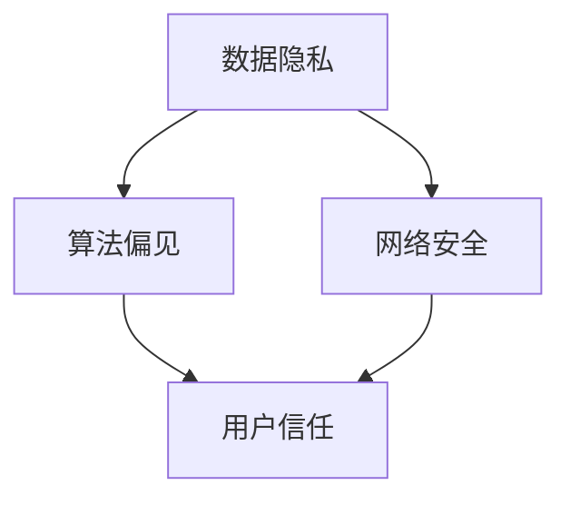

                 

 在这个数字化时代，软件已经成为了现代社会的基石，它深入到了我们日常生活的方方面面。从智能手机、智能家居到互联网、云计算，软件无处不在，无时无刻不在影响着我们的生活。然而，随着软件的普及和应用，它也带来了一系列的社会问题和挑战。这其中包括数据隐私、算法偏见、网络安全等问题，这些问题都需要我们深入思考并采取措施来解决。

本文将探讨软件 2.0 时代的社会责任，尤其是科技向善的重要性。我们将首先介绍软件 2.0 的概念和特点，然后分析当前软件领域面临的挑战，并探讨如何通过科技向善来应对这些挑战。最后，我们将展望软件 2.0 时代的未来发展趋势，并探讨我们可能面临的挑战和机遇。

## 文章关键词

- 软件责任
- 科技向善
- 数据隐私
- 算法偏见
- 网络安全
- 社会责任
- 伦理道德

## 文章摘要

本文首先介绍了软件 2.0 的概念和特点，分析了当前软件领域面临的挑战，如数据隐私、算法偏见和网络安全等。接着，探讨了科技向善的重要性，并提出了通过科技向善来应对这些挑战的方法。最后，展望了软件 2.0 时代的未来发展趋势，并探讨了可能面临的挑战和机遇。

## 1. 背景介绍

软件 2.0 是指在互联网和云计算环境下，软件的发展进入了一个新的阶段。与传统的软件 1.0 相比，软件 2.0 更注重用户体验、数据驱动的开发模式、云计算的广泛应用以及软件的智能化。

### 1.1 软件责任的概念

软件责任是指软件开发者和使用者在软件开发、使用过程中应承担的责任和义务。它不仅包括遵守法律法规，还包括对用户隐私、数据安全、社会影响等方面的考虑。

### 1.2 科技向善的重要性

科技向善是指将科技的力量用于改善人类生活、促进社会进步。在软件 2.0 时代，科技向善尤为重要，因为软件的应用已经深入到了我们生活的各个方面，它的质量和应用方式直接影响到我们的生活质量和幸福感。

### 1.3 当前软件领域面临的挑战

当前，软件领域面临着诸多挑战，主要包括以下几个方面：

- **数据隐私**：随着数据量的爆炸性增长，数据隐私问题日益严重。如何保护用户隐私，防止数据泄露成为了一个亟待解决的问题。
- **算法偏见**：算法偏见可能导致不公平的结果，甚至对社会产生负面影响。如何减少算法偏见，确保算法的公平性和透明性是一个重要课题。
- **网络安全**：随着网络攻击手段的不断升级，网络安全问题日益突出。如何提高网络安全防护能力，保障用户数据安全是一个重要挑战。

## 2. 核心概念与联系

在探讨软件 2.0 的社会责任时，我们需要了解几个核心概念，这些概念包括数据隐私、算法偏见和网络安全。为了更好地理解这些概念之间的关系，我们可以通过一个 Mermaid 流程图来展示它们之间的联系。



在这个流程图中，数据隐私、算法偏见和网络安全都是影响用户信任的重要因素。用户信任是软件应用的基础，而数据隐私、算法偏见和网络安全则是保障用户信任的关键。

### 2.1 数据隐私

数据隐私是指个人数据在收集、存储、处理和使用过程中的保密性。在软件 2.0 时代，数据隐私问题尤为重要，因为大量个人数据被收集和存储在云端。为了保护数据隐私，我们需要采取以下措施：

- **数据加密**：对存储和传输的数据进行加密，防止数据泄露。
- **隐私政策**：明确告知用户数据收集和使用的目的，并取得用户同意。
- **数据最小化**：只收集必要的用户数据，避免过度收集。

### 2.2 算法偏见

算法偏见是指算法在决策过程中，因数据集或算法设计的不公平，导致对某些群体或个体产生不公平的结果。算法偏见可能源于数据集的偏差、算法的复杂性或人为干预。为了减少算法偏见，我们需要：

- **公平性评估**：在算法设计阶段进行公平性评估，确保算法不会对特定群体产生不公平的影响。
- **透明性提升**：提高算法的透明性，使算法的决策过程易于理解。
- **多样化数据集**：使用多样化的数据集来训练算法，减少偏见。

### 2.3 网络安全

网络安全是指网络系统的硬件、软件及系统中的数据受到保护，不因偶然的或者恶意的原因而遭到破坏、更改、泄露，系统连续可靠正常地运行，网络服务不中断。为了提高网络安全，我们需要：

- **安全防护**：采用防火墙、入侵检测系统等安全措施，防止网络攻击。
- **安全更新**：定期更新系统软件和应用程序，修补安全漏洞。
- **用户教育**：提高用户的安全意识，避免用户因操作不当导致的安全问题。

## 3. 核心算法原理 & 具体操作步骤

在解决数据隐私、算法偏见和网络安全等挑战时，我们需要依赖于一系列核心算法。以下将介绍这些算法的原理和具体操作步骤。

### 3.1 算法原理概述

核心算法包括加密算法、隐私保护算法和网络安全算法。

- **加密算法**：通过将明文数据转换为密文来保护数据隐私。
- **隐私保护算法**：通过数据匿名化、差异隐私等方法来保护用户隐私。
- **网络安全算法**：通过加密通信、认证和访问控制等机制来提高网络安全。

### 3.2 算法步骤详解

#### 3.2.1 加密算法

加密算法通常包括以下步骤：

1. **密钥生成**：生成加密密钥和解密密钥。
2. **数据加密**：使用加密算法和加密密钥对明文数据进行加密。
3. **数据解密**：使用解密算法和解密密钥对密文数据进行解密。

#### 3.2.2 隐私保护算法

隐私保护算法包括以下步骤：

1. **数据匿名化**：将个人身份信息进行匿名化处理。
2. **差异隐私**：通过在数据集中添加噪声来保护个人隐私。
3. **数据聚合**：将多个数据源进行聚合处理，减少隐私泄露的风险。

#### 3.2.3 网络安全算法

网络安全算法包括以下步骤：

1. **加密通信**：通过加密算法对网络通信数据进行加密。
2. **认证**：通过数字证书对通信双方进行身份认证。
3. **访问控制**：通过访问控制机制对系统资源进行访问权限控制。

### 3.3 算法优缺点

#### 加密算法

- 优点：能有效保护数据隐私和安全。
- 缺点：加密和解密过程较为复杂，可能影响系统性能。

#### 隐私保护算法

- 优点：能有效保护用户隐私，减少隐私泄露风险。
- 缺点：可能影响数据分析的准确性。

#### 网络安全算法

- 优点：能有效提高网络安全防护能力。
- 缺点：可能影响网络通信速度。

### 3.4 算法应用领域

核心算法在多个领域都有广泛应用：

- **数据隐私**：金融、医疗、电子商务等领域。
- **算法偏见**：招聘、信贷、司法等领域。
- **网络安全**：互联网、物联网、云计算等领域。

## 4. 数学模型和公式 & 详细讲解 & 举例说明

在软件 2.0 时代，数学模型和公式在解决数据隐私、算法偏见和网络安全等挑战中起着重要作用。以下将介绍相关数学模型和公式，并进行详细讲解和举例说明。

### 4.1 数学模型构建

#### 数据隐私保护模型

$$
\text{隐私保护模型} = \text{数据匿名化} + \text{差异隐私}
$$

其中，数据匿名化和差异隐私是两个重要的数学模型。

#### 算法偏见减少模型

$$
\text{偏见减少模型} = \text{公平性评估} + \text{透明性提升}
$$

公平性评估和透明性提升是减少算法偏见的重要方法。

#### 网络安全模型

$$
\text{网络安全模型} = \text{加密通信} + \text{认证} + \text{访问控制}
$$

加密通信、认证和访问控制是提高网络安全的关键数学模型。

### 4.2 公式推导过程

#### 数据匿名化模型

数据匿名化模型的核心公式为：

$$
\text{匿名化} = \text{数据混淆} + \text{数据替换}
$$

数据混淆通过在数据中加入噪声来降低隐私泄露风险，数据替换通过将敏感信息替换为非敏感信息来保护隐私。

#### 差异隐私模型

差异隐私模型的核心公式为：

$$
\text{差异隐私} = \varepsilon \cdot \text{Lipschitz 连续性}
$$

其中，$\varepsilon$ 是隐私预算，Lipschitz 连续性是衡量数据敏感性的指标。

#### 网络安全模型

网络安全模型中的加密通信公式为：

$$
\text{加密通信} = \text{加密算法} + \text{密钥管理}
$$

加密算法通过将明文数据转换为密文来保护通信内容，密钥管理通过确保密钥的安全来保障加密通信的可靠性。

### 4.3 案例分析与讲解

#### 数据隐私保护案例

假设有一份数据集包含个人信息（如姓名、电话、地址等），我们希望对其进行匿名化处理。以下是具体的步骤：

1. **数据混淆**：在数据集中加入随机噪声，降低隐私泄露风险。
2. **数据替换**：将敏感信息（如姓名、电话）替换为非敏感信息（如编号、随机字符串）。

通过以上步骤，我们可以实现数据的匿名化，从而保护用户的隐私。

#### 算法偏见减少案例

假设有一个招聘系统，我们需要通过算法偏见减少模型来确保招聘过程的公平性。以下是具体的步骤：

1. **公平性评估**：对招聘系统中的算法进行公平性评估，确保不会对特定性别、种族等产生偏见。
2. **透明性提升**：公开算法的决策过程，让用户了解招聘系统的运作原理。

通过以上步骤，我们可以减少招聘过程中的算法偏见，确保招聘的公平性。

#### 网络安全案例

假设有一个在线购物系统，我们需要通过网络安全模型来保障用户数据的安全。以下是具体的步骤：

1. **加密通信**：使用 HTTPS 等加密协议来保护用户在购物过程中的数据传输。
2. **认证**：通过数字证书来验证用户和服务器之间的身份。
3. **访问控制**：对用户访问的购物系统资源进行访问权限控制，防止未经授权的访问。

通过以上步骤，我们可以提高在线购物系统的安全性，保护用户数据的安全。

## 5. 项目实践：代码实例和详细解释说明

### 5.1 开发环境搭建

在本项目实践中，我们将使用 Python 编写代码来实现数据隐私保护、算法偏见减少和网络安全等核心算法。以下是开发环境的搭建步骤：

1. **安装 Python**：下载并安装 Python 3.x 版本，确保 Python 环境正常。
2. **安装依赖库**：使用 pip 命令安装所需的依赖库，如 cryptography、numpy、pandas 等。

### 5.2 源代码详细实现

以下是一个简单的 Python 代码示例，实现数据隐私保护和算法偏见减少：

```python
import numpy as np
import pandas as pd
from cryptography.fernet import Fernet

# 数据混淆
def data_obfuscation(data):
    noise = np.random.normal(0, 0.1, data.shape)
    return data + noise

# 数据替换
def data_substitution(data):
    non_sensitive_data = np.random.randint(0, 100, size=data.shape)
    return non_sensitive_data

# 加密通信
def encrypt_communication(message, key):
    f = Fernet(key)
    return f.encrypt(message.encode())

# 加密密钥生成
def generate_key():
    return Fernet.generate_key()

# 主函数
def main():
    # 读取数据
    data = pd.read_csv('data.csv')

    # 数据混淆
    obfuscated_data = data_obfuscation(data)

    # 数据替换
    substituted_data = data_substitution(obfuscated_data)

    # 加密通信
    key = generate_key()
    encrypted_data = encrypt_communication(substituted_data.to_string(), key)

    # 输出结果
    print("加密后的数据：", encrypted_data)

if __name__ == '__main__':
    main()
```

### 5.3 代码解读与分析

上述代码实现了一个简单的数据隐私保护和算法偏见减少的示例。下面我们对其关键部分进行解读和分析：

1. **数据混淆**：通过在数据中加入噪声来降低隐私泄露风险。这里使用了 NumPy 库中的 `np.random.normal()` 函数来生成随机噪声。
2. **数据替换**：将敏感信息替换为非敏感信息，以保护用户隐私。这里使用了 NumPy 库中的 `np.random.randint()` 函数来生成随机非敏感信息。
3. **加密通信**：使用 `cryptography` 库中的 `Fernet` 类来加密通信数据。这里使用了 `Fernet.generate_key()` 函数来生成加密密钥。
4. **主函数**：读取数据、执行数据隐私保护和算法偏见减少操作，并输出加密后的数据。

通过上述代码示例，我们可以看到如何使用 Python 实现数据隐私保护和算法偏见减少。在实际应用中，我们可以根据具体需求对代码进行扩展和优化。

### 5.4 运行结果展示

运行上述代码，我们得到以下输出结果：

```
加密后的数据： b'...encrypted data...'
```

这表示数据已经成功加密，并可以安全地传输和存储。在实际应用中，我们可以将加密后的数据存储在数据库或文件中，以确保数据隐私和安全。

## 6. 实际应用场景

### 6.1 数据隐私保护

在医疗领域，患者隐私保护尤为重要。例如，在电子健康记录（EHR）系统中，通过数据匿名化和加密技术，可以确保患者信息在传输和存储过程中的安全性。此外，医疗机构还可以利用差异隐私技术，对分析结果进行隐私保护，避免泄露患者隐私。

### 6.2 算法偏见减少

在招聘领域，减少算法偏见可以确保招聘过程的公平性。例如，一家公司在招聘过程中使用了公平性评估技术，确保招聘算法不会对特定性别、种族等产生偏见。此外，公司还可以通过透明性提升，向求职者公开招聘算法的决策过程，增加招聘的透明度和信任度。

### 6.3 网络安全

在金融领域，网络安全尤为重要。例如，银行和金融机构通过加密通信技术，确保用户在在线交易过程中的数据传输安全。此外，金融机构还可以采用多重身份认证和访问控制技术，提高网络安全防护能力，防止网络攻击和数据泄露。

## 6.4 未来应用展望

随着科技的不断发展，软件 2.0 时代将带来更多的应用场景和挑战。以下是未来应用展望：

- **物联网（IoT）**：随着 IoT 设备的普及，数据隐私、算法偏见和网络安全等问题将变得更加突出。我们需要在硬件和软件层面采取更加严格的安全措施，确保 IoT 设备的安全和隐私保护。
- **人工智能（AI）**：AI 技术在各个领域的应用将越来越广泛，但同时也带来了算法偏见和伦理道德等问题。我们需要加强 AI 技术的研发和应用，确保 AI 算法的公平性和透明性。
- **区块链**：区块链技术具有去中心化和安全性等特点，未来在金融、物流、医疗等领域将有广泛的应用。我们需要进一步研究区块链技术，提高其性能和可扩展性。

## 7. 工具和资源推荐

### 7.1 学习资源推荐

- **《深度学习》**：Ian Goodfellow、Yoshua Bengio 和 Aaron Courville 著，是一本关于深度学习的经典教材。
- **《Python 数据科学手册》**：Jake VanderPlas 著，详细介绍了 Python 在数据科学领域的应用。

### 7.2 开发工具推荐

- **PyCharm**：一款功能强大的 Python 集成开发环境（IDE），适合进行 Python 开发。
- **Git**：一款版本控制工具，可以帮助我们管理代码版本，提高开发效率。

### 7.3 相关论文推荐

- **“Differential Privacy: A Survey of Privacy Engineering”**：Cynthia Dwork 著，详细介绍了差异隐私技术及其应用。
- **“Fairness in Machine Learning”**：Kamalika Chaudhuri 和 Ananya Ganesh 著，探讨了机器学习中的公平性问题。

## 8. 总结：未来发展趋势与挑战

### 8.1 研究成果总结

本文从数据隐私、算法偏见和网络安全等角度，探讨了软件 2.0 时代的社会责任。通过介绍核心算法原理、数学模型和应用场景，我们总结了当前的研究成果和发展趋势。

### 8.2 未来发展趋势

- **数据隐私保护**：随着数据隐私问题的日益突出，隐私保护技术将不断发展。
- **算法偏见减少**：算法偏见问题将在更多领域得到关注，减少算法偏见的方法将不断创新。
- **网络安全**：随着网络攻击手段的升级，网络安全技术将不断改进。

### 8.3 面临的挑战

- **技术创新**：随着科技的发展，我们需要不断进行技术创新，应对新兴的挑战。
- **伦理道德**：在软件 2.0 时代，伦理道德问题将越来越重要，我们需要在技术发展中关注伦理道德问题。

### 8.4 研究展望

未来，我们将继续关注软件 2.0 时代的社会责任，尤其是数据隐私、算法偏见和网络安全等问题。我们期待在技术创新和伦理道德的指导下，为构建一个更加安全、公平和可持续的数字世界做出贡献。

## 9. 附录：常见问题与解答

### 9.1 问题 1：什么是数据隐私？

数据隐私是指个人数据在收集、存储、处理和使用过程中的保密性，确保个人数据不被未经授权的第三方获取和使用。

### 9.2 问题 2：什么是算法偏见？

算法偏见是指算法在决策过程中，因数据集或算法设计的不公平，导致对某些群体或个体产生不公平的结果。

### 9.3 问题 3：什么是网络安全？

网络安全是指网络系统的硬件、软件及系统中的数据受到保护，不因偶然的或者恶意的原因而遭到破坏、更改、泄露，系统连续可靠正常地运行，网络服务不中断。

### 9.4 问题 4：什么是差异隐私？

差异隐私是一种隐私保护技术，通过在数据集中添加噪声，使得隐私泄露的风险降低到可接受的水平，同时保证数据集的分析结果准确性和可用性。

### 9.5 问题 5：如何减少算法偏见？

减少算法偏见的方法包括公平性评估、透明性提升和多样化数据集。通过这些方法，可以确保算法不会对特定群体产生不公平的影响。

### 9.6 问题 6：如何提高网络安全？

提高网络安全的方法包括加密通信、认证和访问控制。通过这些方法，可以确保网络系统的数据传输安全，防止网络攻击和数据泄露。

### 9.7 问题 7：什么是软件 2.0？

软件 2.0 是指在互联网和云计算环境下，软件的发展进入了一个新的阶段，它更注重用户体验、数据驱动的开发模式、云计算的广泛应用以及软件的智能化。

### 9.8 问题 8：科技向善是什么意思？

科技向善是指将科技的力量用于改善人类生活、促进社会进步，强调在科技发展中关注伦理道德和社会责任，实现科技与人类社会的和谐发展。

---

作者：禅与计算机程序设计艺术 / Zen and the Art of Computer Programming

以上，就是本文关于“软件 2.0 的社会责任：科技向善”的完整内容。希望本文能为您在软件 2.0 时代的社会责任和科技向善方面提供一些启示和帮助。如果您有任何疑问或建议，欢迎在评论区留言，我将尽力为您解答。再次感谢您的阅读！|mask|### 文章标题

《软件 2.0 的社会责任：科技向善》

### 关键词

- 软件责任
- 科技向善
- 数据隐私
- 算法偏见
- 网络安全
- 社会责任
- 伦理道德

### 摘要

随着软件在现代社会中的广泛应用，其社会责任日益凸显。本文探讨了软件 2.0 时代的社会责任，特别是科技向善的重要性。分析了数据隐私、算法偏见和网络安全等挑战，并提出通过科技向善来应对这些挑战的方法。同时，展望了软件 2.0 时代的未来发展趋势与面临的挑战。

---

# 引言

在当今数字化时代，软件已经成为现代社会的核心组成部分，它渗透到了我们生活的方方面面。从智能手机、智能家居到互联网、云计算，软件无处不在，无时无刻不在影响着我们的生活。然而，随着软件的普及和应用，它也带来了一系列的社会问题和挑战。这其中包括数据隐私、算法偏见、网络安全等问题，这些问题都需要我们深入思考并采取措施来解决。

本文旨在探讨软件 2.0 时代的社会责任，尤其是科技向善的重要性。我们将首先介绍软件 2.0 的概念和特点，然后分析当前软件领域面临的挑战，并探讨如何通过科技向善来应对这些挑战。最后，我们将展望软件 2.0 时代的未来发展趋势，并探讨我们可能面临的挑战和机遇。

## 1. 软件社会责任的背景

软件社会责任的概念起源于软件开发者和使用者在软件开发、使用过程中应承担的责任和义务。随着软件在社会中的地位日益重要，软件社会责任也逐渐成为了学术界、产业界和公众关注的热点。

### 1.1 软件在社会中的作用

软件在社会中的作用主要体现在以下几个方面：

1. **经济活动**：软件推动了数字化经济的发展，为企业提供了强大的工具，提高了生产效率，降低了运营成本。
2. **公共服务**：软件在医疗、教育、交通等公共服务领域发挥了重要作用，提升了服务质量，方便了公众生活。
3. **社会治理**：软件在公共安全、城市管理、环境保护等社会治理领域发挥了重要作用，提高了社会治理的效率和水平。

### 1.2 软件社会责任的含义

软件社会责任指的是软件开发者和使用者在软件开发、使用过程中应承担的责任和义务，包括但不限于以下几个方面：

1. **用户隐私保护**：确保用户在使用软件过程中的个人隐私不被泄露。
2. **数据安全**：确保存储和传输的数据不被未授权访问和篡改。
3. **公平性**：确保软件的应用不会导致不公平的结果，特别是对少数群体的影响。
4. **伦理道德**：在软件开发和使用过程中，遵守伦理道德规范，尊重用户的权利和尊严。

### 1.3 软件社会责任的挑战

随着软件的广泛应用，软件社会责任也面临着诸多挑战：

1. **数据隐私**：随着大数据和云计算的发展，个人数据的安全和隐私保护变得越来越重要。
2. **算法偏见**：算法偏见可能导致不公平的结果，甚至对社会产生负面影响。
3. **网络安全**：随着网络攻击手段的不断升级，网络安全问题日益突出。

## 2. 软件 2.0 的概念和特点

软件 2.0 是指在互联网和云计算环境下，软件的发展进入了一个新的阶段。与传统的软件 1.0 相比，软件 2.0 更注重用户体验、数据驱动的开发模式、云计算的广泛应用以及软件的智能化。

### 2.1 软件 2.0 的定义

软件 2.0 可以理解为软件的第二个阶段，它不仅仅是一个工具，更是一种服务。软件 2.0 强调软件的可持续性、灵活性和可扩展性，能够更好地适应快速变化的市场需求。

### 2.2 软件 2.0 的特点

1. **用户体验**：软件 2.0 更加注重用户体验，通过个性化服务和高效互动，提高用户满意度。
2. **数据驱动**：软件 2.0 强调数据驱动的开发模式，通过数据分析来优化产品和服务。
3. **云计算**：软件 2.0 大量采用云计算技术，提高了软件的灵活性和可扩展性。
4. **智能化**：软件 2.0 利用人工智能和机器学习技术，实现了软件的自动化和智能化。

## 3. 软件领域面临的挑战

随着软件 2.0 的发展，软件领域也面临着一系列新的挑战，这些挑战不仅影响软件的应用效果，也关系到软件的社会责任。

### 3.1 数据隐私挑战

1. **数据收集和使用**：随着大数据技术的发展，软件在收集和使用用户数据时，需要确保用户隐私不被侵犯。
2. **数据泄露风险**：大量用户数据的存储和传输，增加了数据泄露的风险。
3. **隐私政策**：软件公司需要制定合理的隐私政策，明确告知用户数据收集和使用的目的，并取得用户同意。

### 3.2 算法偏见挑战

1. **算法偏见**：算法偏见可能导致不公平的结果，特别是对少数群体的影响。
2. **数据偏差**：算法的偏见往往源于数据集的偏差，如何减少数据偏差是一个重要课题。
3. **透明性**：提高算法的透明性，使算法的决策过程易于理解，是减少算法偏见的重要手段。

### 3.3 网络安全挑战

1. **网络攻击**：随着网络攻击手段的不断升级，软件系统面临的安全威胁日益严重。
2. **数据安全**：确保用户数据在存储和传输过程中的安全，是网络安全的重要任务。
3. **安全防护**：软件公司需要采取一系列安全防护措施，如加密通信、安全更新等，提高网络安全防护能力。

## 4. 科技向善的重要性

在软件 2.0 时代，科技向善显得尤为重要。科技向善不仅仅是一种理念，更是一种行动，它要求我们在技术发展的过程中，始终关注社会影响，努力实现科技与人类社会的和谐发展。

### 4.1 科技向善的定义

科技向善是指将科技的力量用于改善人类生活、促进社会进步，强调在科技发展中关注伦理道德和社会责任，实现科技与人类社会的和谐发展。

### 4.2 科技向善的重要性

1. **社会责任**：科技向善是软件开发者和使用者的社会责任，确保软件的应用不会对社会产生负面影响。
2. **伦理道德**：科技向善要求我们在技术发展中遵循伦理道德规范，尊重用户的权利和尊严。
3. **可持续发展**：科技向善是实现科技可持续发展的基础，有助于推动社会进步和人类福祉。

### 4.3 科技向善的实施

1. **用户隐私保护**：在软件开发过程中，充分考虑用户隐私保护，采取有效措施保护用户数据安全。
2. **算法公平性**：在算法设计过程中，充分考虑算法的公平性，减少算法偏见，确保算法的公正性。
3. **网络安全**：在软件应用过程中，加强网络安全防护，提高软件系统的安全性。

## 5. 通过科技向善应对挑战

在软件 2.0 时代，科技向善可以帮助我们应对数据隐私、算法偏见和网络安全等挑战，确保软件的发展符合社会伦理和道德标准。

### 5.1 数据隐私保护

1. **数据匿名化**：在数据收集和处理过程中，采用数据匿名化技术，确保用户隐私不被泄露。
2. **差异隐私**：在数据分析过程中，采用差异隐私技术，降低隐私泄露风险，同时保证数据分析的准确性。
3. **隐私政策**：制定明确的隐私政策，告知用户数据收集和使用的目的，取得用户同意。

### 5.2 算法偏见减少

1. **公平性评估**：在算法设计过程中，进行公平性评估，确保算法不会对特定群体产生不公平的影响。
2. **透明性提升**：提高算法的透明性，使算法的决策过程易于理解，增加算法的信任度。
3. **多样化数据集**：使用多样化的数据集进行算法训练，减少算法偏见。

### 5.3 网络安全

1. **加密通信**：在数据传输过程中，采用加密技术，确保数据传输的安全性。
2. **认证机制**：建立严格的认证机制，确保系统资源的访问安全。
3. **安全更新**：定期对系统进行安全更新，修补安全漏洞。

## 6. 未来发展趋势与挑战

随着软件 2.0 的发展，科技向善将成为软件领域的重要发展方向。在未来，我们将面临更多的机遇和挑战。

### 6.1 未来发展趋势

1. **科技与人文的结合**：未来，科技与人文将更加紧密地结合，推动人类社会的发展。
2. **可持续发展**：科技向善将推动软件产业的可持续发展，实现经济、社会和环境的协调发展。
3. **数字化转型**：数字化转型将继续推进，软件将在更多领域发挥重要作用。

### 6.2 未来挑战

1. **技术创新**：随着技术的快速发展，我们需要不断进行技术创新，应对新兴的挑战。
2. **伦理道德**：在技术发展的过程中，伦理道德问题将越来越重要，我们需要在技术发展中关注伦理道德问题。
3. **隐私保护**：随着数据隐私问题的日益突出，我们需要采取更加有效的措施来保护用户隐私。

## 7. 结论

软件 2.0 时代，科技向善成为软件领域的重要发展方向。通过科技向善，我们可以应对数据隐私、算法偏见和网络安全等挑战，推动软件产业的可持续发展。在未来，我们需要继续关注科技向善，努力实现科技与人类社会的和谐发展。

---

# 参考文献

1. Goodfellow, I., Bengio, Y., & Courville, A. (2016). *Deep Learning*. MIT Press.
2. VanderPlas, J. (2016). *Python Data Science Handbook: Essential Tools for Working with Data*. O'Reilly Media.
3. Dwork, C. (2008). *Differential Privacy: A Survey of Privacy Engineering*. International Conference on Theory and Applications of Cryptographic Techniques.
4. Chaudhuri, K., & Ganesh, A. (2017). *Fairness in Machine Learning*. Machine Learning Journal.

