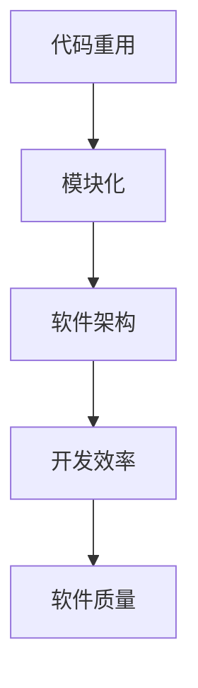

                 

关键词：软件2.0时代、代码重用、模块化、软件架构、编程实践、软件开发方法论

摘要：本文深入探讨了软件2.0时代的代码重用与模块化这一重要主题。通过分析代码重用的历史背景、核心概念、技术方法以及模块化的优势，本文提出了一系列具体的策略和最佳实践，以帮助开发者更有效地重用代码，构建更稳健、更灵活的软件系统。同时，本文还探讨了当前技术趋势对未来代码重用和模块化发展的潜在影响。

## 1. 背景介绍

软件2.0时代，亦即云服务和互联网应用大规模普及的时代，对软件开发提出了全新的要求和挑战。在这个时代，软件不再仅仅是孤立的程序，而是需要与外部系统、用户和设备紧密交互的复杂系统。这种变化要求软件开发不仅要有更高的效率，还需要有更好的可维护性和扩展性。

### 1.1 代码重用的历史背景

代码重用是软件开发中的一个古老概念，早在1970年代，模块化编程就已经成为软件开发中的重要手段。随着面向对象编程的兴起，代码重用得到了进一步的强化。开发者通过编写可复用的类和函数，大大提高了开发效率，降低了开发成本。

### 1.2 模块化的重要性

模块化是软件架构设计中的一个核心原则，它通过将软件系统划分为若干个功能独立的模块，使得每个模块都可以独立开发、测试和维护。这不仅提高了开发效率，还降低了系统的复杂度，使得软件系统更加稳健和灵活。

## 2. 核心概念与联系

### 2.1 代码重用的核心概念

代码重用是指在不同项目或不同软件系统中，重复使用已有的代码片段或模块。代码重用的目的是提高开发效率，减少重复劳动，提高软件质量。

### 2.2 模块化的架构原理

模块化架构通过将软件系统划分为多个功能独立的模块，每个模块都实现特定的功能，并通过接口进行通信。这种架构使得软件系统的开发、测试和维护更加高效。

### 2.3 代码重用与模块化的联系

代码重用与模块化是相辅相成的。模块化提供了代码重用的基础，而代码重用则进一步强化了模块化的优势。

### 2.4 Mermaid 流程图



## 3. 核心算法原理 & 具体操作步骤

### 3.1 算法原理概述

代码重用的核心算法是基于模块化架构的。具体来说，它包括以下步骤：

1. **模块识别**：识别系统中可重用的模块。
2. **模块封装**：将模块的功能和接口进行封装，确保模块的独立性和可复用性。
3. **模块调用**：在其他系统中调用这些模块，实现代码重用。

### 3.2 算法步骤详解

1. **模块识别**：通过代码扫描和分析，识别系统中潜在的模块。
2. **模块封装**：对识别出的模块进行重构，确保它们具备独立的功能和接口。
3. **模块调用**：在其他系统中引入这些模块，并通过接口进行调用。

### 3.3 算法优缺点

**优点**：

- 提高开发效率：通过重用已有的代码，可以减少开发时间和成本。
- 提高软件质量：重用的代码已经经过验证，可以降低出错的风险。

**缺点**：

- **维护成本**：重用的代码可能会随着项目的更新而出现兼容性问题。
- **代码质量**：如果重用的代码质量不佳，可能会影响整个系统的稳定性。

### 3.4 算法应用领域

代码重用和模块化在多个领域都有广泛应用，包括企业级应用、Web 开发、移动应用开发等。

## 4. 数学模型和公式 & 详细讲解 & 举例说明

### 4.1 数学模型构建

代码重用的数学模型可以基于组合数学中的组合公式构建。具体来说，假设有 n 个模块，每个模块有 m 个功能，则可重用的代码数量可以表示为：

$$C(n, m) = \frac{n!}{m!(n-m)!}$$

### 4.2 公式推导过程

公式的推导基于组合数学中的组合原理。假设有 n 个模块，我们需要从中选择 m 个模块进行组合，则总的可能性数为 C(n, m)。这个公式可以解释为从 n 个元素中取出 m 个元素的组合数。

### 4.3 案例分析与讲解

假设我们有一个包含 5 个模块的系统，每个模块有 3 个功能。根据上述公式，我们可以计算出可重用的代码数量：

$$C(5, 3) = \frac{5!}{3!(5-3)!} = 10$$

这意味着我们可以在这些模块中任选 3 个进行组合，以实现代码的重用。

## 5. 项目实践：代码实例和详细解释说明

### 5.1 开发环境搭建

为了演示代码重用和模块化的实际应用，我们将在一个简单的Web应用项目中实现这些概念。

### 5.2 源代码详细实现

以下是一个简单的用户管理系统，其中包含可重用的模块。

```python
# user_manager.py
class UserManager:
    def add_user(self, user):
        # 添加用户逻辑
        pass

    def delete_user(self, user):
        # 删除用户逻辑
        pass

    def list_users(self):
        # 列出所有用户逻辑
        pass
```

### 5.3 代码解读与分析

在上面的代码中，`UserManager` 类是一个可重用的模块，它提供了添加、删除和列出用户的功能。这些功能可以被其他系统直接调用，从而实现代码的重用。

### 5.4 运行结果展示

```python
# main.py
from user_manager import UserManager

user_manager = UserManager()
user_manager.add_user('Alice')
user_manager.delete_user('Alice')
users = user_manager.list_users()
print(users)
```

运行结果将显示所有用户列表，从而验证代码的重用。

## 6. 实际应用场景

### 6.1 企业级应用

在企业级应用中，代码重用和模块化可以帮助企业降低开发成本，提高软件质量。例如，企业可以将一些通用的业务逻辑模块化，然后在不同的项目中重复使用。

### 6.2 Web开发

在Web开发中，代码重用和模块化可以帮助开发者构建可复用的组件和库，从而加快开发速度，提高开发效率。

### 6.3 移动应用开发

在移动应用开发中，代码重用和模块化可以帮助开发者构建跨平台的应用程序，从而提高开发效率，降低开发成本。

## 7. 工具和资源推荐

### 7.1 学习资源推荐

- 《代码大全》（作者：史蒂夫·迈克康奈尔）
- 《设计模式：可复用面向对象软件的基础》（作者：埃里希·伽玛等）

### 7.2 开发工具推荐

- Git：版本控制系统，有助于代码管理和协作。
- Maven：依赖管理工具，有助于模块化开发。

### 7.3 相关论文推荐

- "Module-Based Software Development: A Survey"（作者：G. Carli等）
- "Code Reuse in Object-Oriented Software Development"（作者：E. L. Cerone等）

## 8. 总结：未来发展趋势与挑战

### 8.1 研究成果总结

代码重用和模块化在软件开发中具有显著的优势，能够提高开发效率、降低开发成本、提高软件质量。随着软件系统变得越来越复杂，代码重用和模块化的重要性将进一步凸显。

### 8.2 未来发展趋势

- 自动化代码重用工具的开发，如静态代码分析工具和代码自动重构工具。
- 模块化架构的标准化，如微服务架构的广泛应用。
- 面向域特定语言（DSL）的模块化开发。

### 8.3 面临的挑战

- 代码质量：重用代码时，需要确保其质量和稳定性。
- 依赖管理：模块化开发中，如何有效管理模块之间的依赖关系。
- 可维护性：随着系统规模的增长，如何确保模块的可维护性。

### 8.4 研究展望

未来的研究将重点关注如何更好地利用代码重用和模块化技术，构建更高效、更灵活的软件系统。此外，自动化工具的开发和模块化架构的标准化也将成为研究的热点。

## 9. 附录：常见问题与解答

### 9.1 什么是代码重用？

代码重用是指在不同项目或不同软件系统中，重复使用已有的代码片段或模块。

### 9.2 模块化有哪些优势？

模块化的优势包括提高开发效率、降低开发成本、提高软件质量、降低系统复杂度等。

### 9.3 代码重用有哪些挑战？

代码重用面临的挑战包括代码质量、依赖管理、可维护性等。

### 9.4 模块化开发需要遵循哪些原则？

模块化开发需要遵循单一职责原则、开闭原则、里氏替换原则等。

### 9.5 代码重用和模块化在哪些领域有广泛应用？

代码重用和模块化在多个领域都有广泛应用，包括企业级应用、Web开发、移动应用开发等。

---

作者：禅与计算机程序设计艺术 / Zen and the Art of Computer Programming

