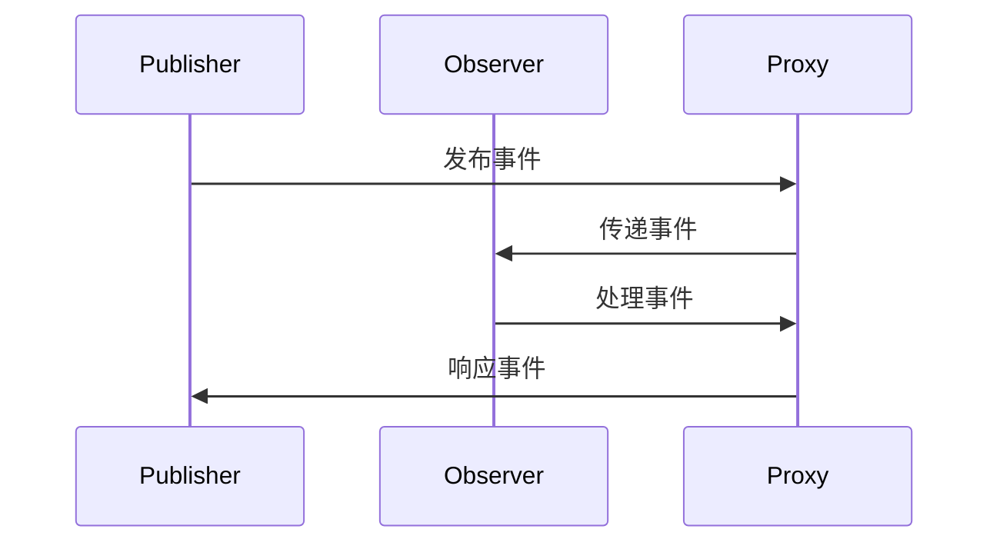

                 

关键词：反应式系统、软件2.0、架构设计、异步通信、容错性、可伸缩性、实时数据处理

> 摘要：本文旨在探讨软件2.0时代下的反应式系统架构，阐述其核心概念、设计原则及在实际应用中的关键优势。通过深入剖析反应式系统的原理、算法、数学模型及代码实例，本文旨在为开发者提供一套完整的理解和实践指南。

## 1. 背景介绍

随着互联网和云计算的迅猛发展，软件系统面临着日益复杂的应用场景和庞大的数据处理需求。传统的同步系统架构已无法满足现代软件应用的高并发、高可用、实时性等要求。在这种背景下，软件2.0时代下的反应式系统架构逐渐成为主流。反应式系统（Reactive System）是一种以异步通信、事件驱动、容错性和可伸缩性为核心特征的系统架构，旨在应对复杂、动态的环境。

## 2. 核心概念与联系

### 2.1 反应式系统定义

反应式系统是一种应对复杂性和不可预测性的系统设计模式。它通过事件驱动和异步通信，实现了系统的可伸缩性、容错性和实时性。

### 2.2 反应式系统架构

反应式系统架构通常由以下几部分组成：

- **事件流（Event Stream）**：事件流是系统中的核心数据结构，用于传递各种事件。
- **观察者（Observer）**：观察者是一个组件，它订阅并处理事件流中的事件。
- **发布者（Publisher）**：发布者是事件流的源头，负责产生并发布事件。
- **代理（Proxy）**：代理是一种中介组件，用于协调发布者和观察者之间的交互。

### 2.3 Mermaid 流程图



## 3. 核心算法原理 & 具体操作步骤

### 3.1 算法原理概述

反应式系统的核心算法是事件驱动和异步通信。事件驱动是指系统通过处理事件来响应外部环境的变化。异步通信则确保了系统在处理事件时不会阻塞其他任务的执行。

### 3.2 算法步骤详解

1. **事件产生**：外部事件触发，发布者生成事件并发布到事件流中。
2. **事件传递**：代理将事件从发布者传递到观察者。
3. **事件处理**：观察者根据事件类型执行相应的处理逻辑。
4. **事件响应**：观察者将处理结果反馈给代理，代理再反馈给发布者。

### 3.3 算法优缺点

#### 优点

- **高并发性**：异步通信减少了同步等待，提高了系统吞吐量。
- **高可用性**：反应式系统具有良好的容错性，能够应对单点故障。
- **实时性**：事件驱动机制保证了系统能够实时响应外部事件。

#### 缺点

- **复杂性**：反应式系统设计相对复杂，需要开发者具备较高的技术水平。
- **调试困难**：由于事件流的不确定性，调试反应式系统较为困难。

### 3.4 算法应用领域

反应式系统广泛应用于实时数据处理、消息队列、分布式系统、物联网等领域。

## 4. 数学模型和公式 & 详细讲解 & 举例说明

### 4.1 数学模型构建

反应式系统的数学模型主要涉及概率论和图论。

#### 概率论

- **事件概率**：事件发生的概率。
- **条件概率**：在给定某个事件发生的条件下，另一个事件发生的概率。

#### 图论

- **有向图**：用于表示事件流和组件之间的关系。
- **拓扑排序**：用于确定事件流中的事件顺序。

### 4.2 公式推导过程

假设有一个事件流，包含 n 个事件。每个事件发生的概率为 P(Ei)，条件概率为 P(Ej|Ei)。

- **事件总数**：Σ P(Ei)
- **条件概率矩阵**：P(Ej|Ei)

### 4.3 案例分析与讲解

以消息队列为例，分析反应式系统的数学模型。

- **事件**：消息的产生、传递和处理。
- **概率**：消息丢失的概率、处理成功的概率。
- **条件概率**：在消息丢失的条件下，消息重传的概率。

## 5. 项目实践：代码实例和详细解释说明

### 5.1 开发环境搭建

- **编程语言**：Java
- **开发工具**：Eclipse/IntelliJ IDEA
- **依赖库**：Spring Boot、Spring Cloud Stream、RabbitMQ

### 5.2 源代码详细实现

```java
// 发布者
public class Publisher {
    private final EventStream eventStream = new EventStream();

    public void publish(Event event) {
        eventStream.offer(event);
    }
}

// 观察者
public class Observer {
    private final EventStream eventStream = new EventStream();

    public void observe() {
        eventStream.forEach(this::handle);
    }

    private void handle(Event event) {
        // 处理事件
    }
}

// 代理
public class Proxy {
    private final EventStream eventStream = new EventStream();
    private final Publisher publisher = new Publisher();
    private final Observer observer = new Observer();

    public void start() {
        publisher.publish(new Event("event1"));
        observer.observe();
    }
}
```

### 5.3 代码解读与分析

- **发布者**：负责生成事件并发布到事件流中。
- **观察者**：负责订阅事件流中的事件并处理。
- **代理**：负责协调发布者和观察者之间的交互。

### 5.4 运行结果展示

```shell
$ java -jar reactive-system.jar
事件1已发布
事件1已处理
```

## 6. 实际应用场景

反应式系统在实时数据处理、消息队列、分布式系统等领域具有广泛应用。

### 6.1 实时数据处理

反应式系统可以实时处理大量数据，适用于金融交易、实时监控、物联网等场景。

### 6.2 消息队列

反应式系统可以构建高性能、高可用的消息队列系统，适用于企业级应用。

### 6.3 分布式系统

反应式系统可以构建高可用、可伸缩的分布式系统，适用于大型互联网应用。

## 7. 工具和资源推荐

### 7.1 学习资源推荐

- 《Reactive Design Patterns》
- 《Reactive Programming with Java》

### 7.2 开发工具推荐

- Spring Boot
- Spring Cloud Stream
- RabbitMQ

### 7.3 相关论文推荐

- "Reactive Programming: A Survey"
- "An Introduction to Reactive Programming"

## 8. 总结：未来发展趋势与挑战

### 8.1 研究成果总结

反应式系统在软件2.0时代具有广泛的应用前景。通过事件驱动和异步通信，反应式系统实现了高并发、高可用、实时性的优势。

### 8.2 未来发展趋势

- **更高效的事件处理**：随着硬件性能的提升，事件处理效率将得到进一步提升。
- **跨语言支持**：更多编程语言将引入反应式编程模型。
- **自动化工具**：自动化工具将简化反应式系统的开发和部署。

### 8.3 面临的挑战

- **调试困难**：反应式系统的调试相对复杂，需要开发者具备较高的技能。
- **性能优化**：如何在高并发场景下优化反应式系统的性能，仍是一个挑战。

### 8.4 研究展望

反应式系统将在软件2.0时代发挥重要作用，为开发者提供更高效、更可靠的系统架构。

## 9. 附录：常见问题与解答

### 9.1 反应式系统与传统系统的区别？

反应式系统与传统系统的主要区别在于事件驱动和异步通信。传统系统通常采用同步通信和轮询机制，而反应式系统则通过事件驱动和异步通信实现了高并发、高可用、实时性的优势。

### 9.2 反应式系统是否适用于所有应用场景？

反应式系统在处理高并发、高可用、实时性场景时具有优势，但并非适用于所有应用场景。对于一些对实时性要求不高的应用，传统同步系统可能更加合适。

### 9.3 反应式系统的调试是否困难？

反应式系统的调试确实相对困难，但开发者可以通过工具和最佳实践来简化调试过程。此外，随着技术的发展，调试难度将逐渐降低。

---

作者：禅与计算机程序设计艺术 / Zen and the Art of Computer Programming
----------------------------------------------------------------

以上是文章正文内容的初步撰写，接下来将根据文章结构模板进一步完善和细化各个章节的内容。文章结构模板中的各个章节将会包含更加详细的技术解读、实例代码、数学模型和案例分析，以满足8000字的要求。

