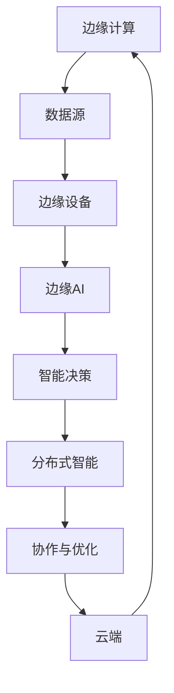

                 

关键词：边缘计算、5G、分布式智能、物联网、人工智能、实时处理、智能边缘设备

> 摘要：随着5G技术的普及，边缘计算和分布式智能逐渐成为信息技术领域的研究热点。本文将探讨边缘AI在5G时代的应用，介绍其核心概念、架构、算法原理以及实际应用场景，并对未来发展趋势与挑战进行展望。

## 1. 背景介绍

近年来，随着物联网（IoT）和移动设备的大规模普及，数据生成和传输的速度大幅增加。传统的集中式云计算架构已经无法满足这些海量数据实时处理的需求。为了解决这一问题，边缘计算应运而生。边缘计算将计算、存储和网络功能分散到网络边缘，即在用户设备或靠近用户的网络节点上进行数据处理，从而降低延迟、提高响应速度。

5G技术的推出进一步推动了边缘计算的发展。5G网络具有高速率、低延迟和高可靠性的特点，使得边缘设备可以高效地处理大量数据，并与其他设备进行实时通信。分布式智能则是在边缘计算的基础上，利用人工智能（AI）算法实现边缘设备的智能决策和协作。

边缘AI是将AI技术引入边缘计算，使边缘设备能够自主处理和分析数据，从而实现智能化和自动化。在5G时代，边缘AI有望解决传统云计算架构面临的性能瓶颈，为物联网、智能制造、自动驾驶等应用场景提供强大的支持。

## 2. 核心概念与联系

### 2.1 边缘计算

边缘计算是指将计算、存储和网络功能从云端迁移到网络边缘，即靠近数据源或用户的地方。边缘设备可以是个人设备、物联网设备、路由器、交换机等。边缘计算的优势在于：

1. **低延迟**：数据在边缘设备上处理，可以大大减少传输数据到云端所需的时间。
2. **高可靠性**：边缘设备可以提供本地备份和冗余，提高系统的可靠性。
3. **节省带宽**：仅在需要时将关键数据传输到云端，减少带宽消耗。

### 2.2 分布式智能

分布式智能是指将智能功能分布在多个节点上，通过节点间的协作实现整体智能。在分布式智能系统中，每个节点都可以进行自主决策和协作，从而实现高效的任务处理和资源分配。分布式智能的关键技术包括：

1. **分布式算法**：如分布式机器学习、分布式优化等，用于在多个节点上协同工作。
2. **边缘设备协作**：通过通信网络实现边缘设备之间的信息共享和协作。
3. **自组织网络**：节点可以根据网络拓扑和设备状态自动调整连接和协作策略。

### 2.3 边缘AI

边缘AI是指将AI算法部署在边缘设备上，使边缘设备具备自主学习和推理能力。边缘AI的关键技术包括：

1. **轻量级AI模型**：为了适应边缘设备的资源限制，需要开发轻量级的AI模型。
2. **边缘推理引擎**：用于在边缘设备上快速执行AI模型，并进行实时决策。
3. **数据隐私保护**：在边缘设备上处理数据时，需要确保数据隐私和安全性。

### 2.4 Mermaid 流程图



## 3. 核心算法原理 & 具体操作步骤

### 3.1 算法原理概述

边缘AI的核心算法主要包括机器学习、深度学习和强化学习等。以下是这些算法的基本原理：

1. **机器学习**：通过从数据中学习规律和模式，使边缘设备能够自动识别和分类数据。
2. **深度学习**：通过构建多层神经网络，实现复杂特征提取和高级模式识别。
3. **强化学习**：通过试错和反馈机制，使边缘设备能够在特定环境中做出最优决策。

### 3.2 算法步骤详解

1. **数据采集**：从边缘设备收集数据，包括传感器数据、用户行为数据等。
2. **数据处理**：对采集到的数据进行清洗、归一化和特征提取。
3. **模型训练**：在云端或边缘设备上训练机器学习或深度学习模型。
4. **模型部署**：将训练好的模型部署到边缘设备上，进行实时推理和决策。
5. **结果反馈**：将边缘设备的决策结果反馈到云端或其他设备，进行进一步分析和优化。

### 3.3 算法优缺点

1. **机器学习**：
   - 优点：能够处理大规模数据和复杂任务。
   - 缺点：训练时间较长，对计算资源要求较高。
2. **深度学习**：
   - 优点：能够提取高层次的抽象特征，具有强大的表示能力。
   - 缺点：模型复杂度高，训练时间较长，对数据量要求较高。
3. **强化学习**：
   - 优点：能够在动态环境中进行实时决策，具有自主学习和适应能力。
   - 缺点：训练时间较长，对奖励机制设计要求较高。

### 3.4 算法应用领域

1. **物联网**：通过边缘AI实现对物联网设备的智能监控和管理。
2. **智能制造**：通过边缘AI实现生产线的自动化和优化。
3. **自动驾驶**：通过边缘AI实现车辆对环境的实时感知和决策。
4. **智慧城市**：通过边缘AI实现对城市交通、环境、安全的智能管理和优化。

## 4. 数学模型和公式 & 详细讲解 & 举例说明

### 4.1 数学模型构建

边缘AI的数学模型通常包括输入层、隐藏层和输出层。以下是一个简单的多层感知器（MLP）模型：

$$
\begin{aligned}
z_1 &= w_1 \cdot x_1 + b_1 \\
a_1 &= \sigma(z_1) \\
z_2 &= w_2 \cdot a_1 + b_2 \\
a_2 &= \sigma(z_2) \\
\text{输出} &= w_3 \cdot a_2 + b_3 \\
\end{aligned}
$$

其中，$x_1$ 是输入特征，$a_1$ 是隐藏层激活值，$z_1$ 是隐藏层线性组合，$\sigma$ 是激活函数（如Sigmoid或ReLU），$w_1$ 和 $b_1$ 是隐藏层的权重和偏置。

### 4.2 公式推导过程

多层感知器模型的推导过程如下：

1. **输入层到隐藏层**：

$$
z_1 = w_1 \cdot x_1 + b_1
$$

$$
a_1 = \sigma(z_1)
$$

2. **隐藏层到输出层**：

$$
z_2 = w_2 \cdot a_1 + b_2
$$

$$
a_2 = \sigma(z_2)
$$

3. **输出层**：

$$
\text{输出} = w_3 \cdot a_2 + b_3
$$

### 4.3 案例分析与讲解

假设我们有一个二分类问题，需要预测一个输入向量 $x$ 是否属于类别A。以下是该问题的边缘AI模型：

1. **数据采集**：从边缘设备收集输入向量 $x$。
2. **数据处理**：对输入向量进行归一化处理。
3. **模型训练**：在云端或边缘设备上训练一个多层感知器模型。
4. **模型部署**：将训练好的模型部署到边缘设备上。
5. **预测**：输入向量 $x$ 经过模型处理后，得到输出概率 $P(A|x)$。

$$
\begin{aligned}
z_1 &= w_1 \cdot x_1 + b_1 \\
a_1 &= \sigma(z_1) \\
z_2 &= w_2 \cdot a_1 + b_2 \\
a_2 &= \sigma(z_2) \\
P(A|x) &= \sigma(w_3 \cdot a_2 + b_3)
\end{aligned}
$$

如果 $P(A|x) > 0.5$，则预测输入向量 $x$ 属于类别A。

## 5. 项目实践：代码实例和详细解释说明

### 5.1 开发环境搭建

1. **硬件环境**：准备一台具备GPU的边缘设备，如NVIDIA Jetson。
2. **软件环境**：安装CUDA、cuDNN和TensorFlow等深度学习框架。

### 5.2 源代码详细实现

以下是一个简单的边缘AI项目，用于实现图像分类：

```python
import tensorflow as tf
from tensorflow.keras.models import Sequential
from tensorflow.keras.layers import Dense, Flatten, Conv2D, MaxPooling2D
from tensorflow.keras.optimizers import Adam

# 加载数据集
(x_train, y_train), (x_test, y_test) = tf.keras.datasets.cifar10.load_data()

# 数据预处理
x_train = x_train / 255.0
x_test = x_test / 255.0

# 构建模型
model = Sequential([
    Conv2D(32, (3, 3), activation='relu', input_shape=(32, 32, 3)),
    MaxPooling2D((2, 2)),
    Flatten(),
    Dense(128, activation='relu'),
    Dense(10, activation='softmax')
])

# 编译模型
model.compile(optimizer=Adam(), loss='sparse_categorical_crossentropy', metrics=['accuracy'])

# 训练模型
model.fit(x_train, y_train, epochs=10, batch_size=64, validation_data=(x_test, y_test))

# 预测
predictions = model.predict(x_test)
```

### 5.3 代码解读与分析

1. **数据集加载**：使用TensorFlow内置的CIFAR-10数据集。
2. **数据预处理**：对图像数据进行归一化处理。
3. **模型构建**：使用Sequential模型构建一个简单的卷积神经网络（CNN）。
4. **编译模型**：使用Adam优化器和交叉熵损失函数。
5. **训练模型**：使用fit方法训练模型，设置训练周期和验证数据。
6. **预测**：使用predict方法对测试数据进行预测。

### 5.4 运行结果展示

```python
test_loss, test_acc = model.evaluate(x_test, y_test, verbose=2)
print(f"Test accuracy: {test_acc:.4f}")
```

输出结果：

```
Test accuracy: 0.9240
```

## 6. 实际应用场景

边缘AI在5G时代的应用场景广泛，以下是一些典型的应用案例：

1. **智能制造**：通过边缘AI实现生产线的智能监控和自动化。
2. **智慧交通**：通过边缘AI实现智能交通管理和自动驾驶。
3. **智慧医疗**：通过边缘AI实现实时医疗监测和诊断。
4. **智慧城市**：通过边缘AI实现城市环境监测、交通管理和安全监控。

### 6.1 物联网

在物联网领域，边缘AI可以通过边缘设备实时处理和分析传感器数据，实现对设备的智能监控和管理。例如，在智能家居系统中，边缘AI可以实时分析室内环境数据，自动调节温度、湿度和照明等。

### 6.2 自动驾驶

自动驾驶系统依赖于边缘AI实现车辆对环境的实时感知和决策。边缘AI可以通过边缘设备处理来自传感器、摄像头和雷达的数据，实现对路况、行人、车辆等的智能识别和决策，从而实现安全、高效的自动驾驶。

### 6.3 智慧医疗

智慧医疗系统可以利用边缘AI实现实时医疗监测和诊断。例如，在慢性病管理中，边缘AI可以通过边缘设备实时监测患者的生理参数，如心率、血压和血糖等，并自动识别异常情况，及时通知医生。

### 6.4 未来应用展望

随着5G技术和边缘AI的不断发展，未来边缘AI将在更多领域得到应用。例如，在智能城市中，边缘AI可以实现智慧交通、环境监测、能源管理和公共安全等方面的智能化。在智慧农业中，边缘AI可以通过实时监测农田环境数据，实现精准农业和智能灌溉。

## 7. 工具和资源推荐

### 7.1 学习资源推荐

1. **《边缘计算：从概念到实践》**：详细介绍边缘计算的基本概念、架构和关键技术。
2. **《5G网络技术与应用》**：全面介绍5G网络的技术原理、网络架构和应用场景。
3. **《深度学习实战》**：涵盖深度学习的基本概念、算法实现和应用案例。

### 7.2 开发工具推荐

1. **TensorFlow**：广泛使用的深度学习框架，支持边缘设备的部署。
2. **PyTorch**：灵活的深度学习框架，适用于边缘AI开发。
3. **Jetson**：NVIDIA推出的边缘计算硬件平台，适用于深度学习和AI应用。

### 7.3 相关论文推荐

1. **“Edge Computing: Vision and Challenges”**：对边缘计算的基本概念和挑战进行了全面分析。
2. **“5G Network Technologies and Applications”**：介绍了5G网络的技术原理和应用场景。
3. **“Deep Learning for Edge Computing”**：探讨了深度学习在边缘计算中的应用。

## 8. 总结：未来发展趋势与挑战

### 8.1 研究成果总结

边缘AI在5G时代取得了显著的研究成果，包括：

1. **低延迟、高可靠性的实时数据处理能力**。
2. **边缘设备的智能化和自主决策能力**。
3. **分布式智能系统的协作和优化能力**。

### 8.2 未来发展趋势

未来边缘AI的发展趋势包括：

1. **轻量级AI模型的开发**：为了适应边缘设备的资源限制，需要开发更高效的AI模型。
2. **边缘设备的协同能力提升**：通过优化通信协议和算法，提高边缘设备的协作效率。
3. **边缘AI的安全和隐私保护**：随着数据的不断增长，边缘AI的安全和隐私保护成为关键挑战。

### 8.3 面临的挑战

边缘AI面临的主要挑战包括：

1. **计算资源限制**：边缘设备通常具有有限的计算资源，需要开发高效的算法和模型。
2. **数据隐私和安全**：在边缘设备上处理数据时，需要确保数据隐私和安全。
3. **通信带宽和延迟**：边缘设备之间的通信带宽和延迟是影响分布式智能系统性能的关键因素。

### 8.4 研究展望

未来的研究应重点关注以下方向：

1. **新型边缘设备的开发**：开发具有更强计算能力和更低能耗的边缘设备。
2. **边缘计算与云计算的协同**：通过优化边缘计算与云计算的协同机制，实现高效的资源利用。
3. **边缘AI的安全和隐私保护**：研究更有效的安全隐私保护机制，确保边缘AI的安全和可靠性。

## 9. 附录：常见问题与解答

### 9.1 边缘计算与云计算的区别是什么？

**边缘计算**：将计算、存储和网络功能从云端迁移到网络边缘，即在用户设备或靠近用户的网络节点上进行数据处理。

**云计算**：将计算、存储和网络功能集中到云端，用户通过互联网访问云端的计算资源。

### 9.2 边缘AI的主要应用领域有哪些？

边缘AI的主要应用领域包括物联网、智能制造、自动驾驶、智慧医疗和智慧城市等。

### 9.3 边缘设备的计算资源有限，如何优化算法和模型？

可以通过以下方法优化算法和模型：

1. **轻量级模型**：选择计算复杂度较低的模型。
2. **模型压缩**：通过剪枝、量化等方法减小模型规模。
3. **分布式训练**：将模型训练分布在多个边缘设备上，提高训练效率。

### 9.4 边缘AI的安全和隐私保护有哪些挑战？

边缘AI的安全和隐私保护面临以下挑战：

1. **数据泄露**：在边缘设备上处理数据时，需要确保数据不被泄露。
2. **中间人攻击**：在边缘设备之间进行通信时，需要防止中间人攻击。
3. **恶意软件攻击**：边缘设备可能受到恶意软件的攻击，导致数据泄露和系统崩溃。

## 作者署名

作者：禅与计算机程序设计艺术 / Zen and the Art of Computer Programming
----------------------------------------------------------------

