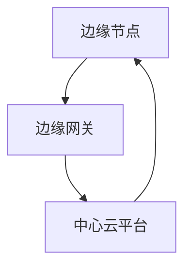
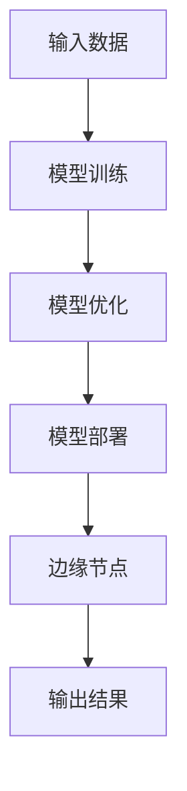

                 

关键词：边缘计算、大模型、5G、智能应用、人工智能、云计算

摘要：本文探讨了5G时代边缘计算与智能应用的深度融合，介绍了边缘大模型的核心概念、算法原理、数学模型及其在实际项目中的应用与未来展望。通过分析边缘大模型的优势与挑战，为读者提供了实用的工具和资源推荐，总结了研究成果，并对未来发展趋势与挑战进行了展望。

## 1. 背景介绍

### 1.1 5G时代的到来

随着5G网络的商用化，万物互联的时代正逐步到来。5G网络具有高速率、低延迟、大连接的特点，为边缘计算提供了坚实的基础。边缘计算作为一种分布式计算架构，将数据处理和计算任务从中心化的云计算转移到网络边缘，实现了数据的实时处理和智能分析。

### 1.2 边缘计算与智能应用的结合

边缘计算与智能应用的结合，能够极大地提升智能系统的响应速度和可靠性。在边缘计算环境中，通过部署大模型，可以实现实时图像识别、语音识别、自然语言处理等高级智能功能，为各种智能应用场景提供强大的技术支持。

### 1.3 边缘大模型的概念

边缘大模型是指在边缘计算环境中部署和运行的具有强大计算能力的深度学习模型。与传统的云计算模型不同，边缘大模型具有更高的计算密度和更低的延迟，能够更好地满足5G时代智能应用的需求。

## 2. 核心概念与联系

### 2.1 边缘计算架构

边缘计算架构包括边缘节点、边缘网关和中心云平台。边缘节点负责数据采集和处理，边缘网关负责数据传输和路由，中心云平台负责大数据分析和云计算资源管理。



### 2.2 边缘大模型原理

边缘大模型基于深度学习技术，通过大规模数据训练，实现对复杂任务的智能处理。边缘大模型的核心在于模型的轻量化、低延迟和高可靠性。



## 3. 核心算法原理 & 具体操作步骤

### 3.1 算法原理概述

边缘大模型的核心算法是深度神经网络（DNN），其通过多层神经网络对输入数据进行特征提取和模式识别。边缘大模型的优势在于模型的轻量化和低延迟。

### 3.2 算法步骤详解

1. **数据采集**：从边缘节点采集原始数据。
2. **数据处理**：对原始数据进行预处理，如数据清洗、归一化等。
3. **模型训练**：使用大量训练数据，通过反向传播算法训练深度神经网络。
4. **模型优化**：通过模型优化技术，降低模型参数数量，实现模型轻量化。
5. **模型部署**：将优化后的模型部署到边缘节点。
6. **实时处理**：边缘节点使用部署的模型对实时数据进行处理。
7. **结果输出**：将处理结果输出，如控制信号、预测结果等。

### 3.3 算法优缺点

**优点**：
- 低延迟：边缘大模型位于网络边缘，能够实现实时数据处理和响应。
- 轻量化：通过模型优化技术，边缘大模型具有更小的模型参数数量，降低了存储和计算资源的消耗。
- 高可靠性：边缘大模型具有更高的计算密度，能够保证系统的稳定运行。

**缺点**：
- 需要大量数据：边缘大模型的训练需要大量高质量的数据，数据采集和预处理是一个挑战。
- 模型更新：边缘大模型需要定期更新，以适应不断变化的应用场景。

### 3.4 算法应用领域

边缘大模型广泛应用于智能交通、智能医疗、智能安防等领域，如实时车辆检测、疾病诊断、异常行为监测等。

## 4. 数学模型和公式 & 详细讲解 & 举例说明

### 4.1 数学模型构建

边缘大模型的数学模型基于深度学习理论，主要包括以下三个部分：

1. **输入层**：输入数据经过预处理后，输入到深度神经网络的输入层。
2. **隐藏层**：通过多层神经网络对输入数据进行特征提取和模式识别。
3. **输出层**：输出层将隐藏层的特征转换为具体的预测结果。

### 4.2 公式推导过程

假设输入数据为 \( x \)，经过 \( n \) 层隐藏层的处理，输出结果为 \( y \)。则边缘大模型的数学模型可以表示为：

\[ y = f_{n}(x) = g(W_n \cdot f_{n-1}(x)) \]

其中， \( f(x) \) 表示第 \( i \) 层神经网络输出， \( g \) 表示激活函数， \( W \) 表示模型参数。

### 4.3 案例分析与讲解

假设我们需要使用边缘大模型进行图像分类任务，输入图像为 \( x \)，输出结果为分类标签 \( y \)。以下是一个简单的边缘大模型构建和训练的案例：

```latex
% 边缘大模型构建
输入层：x
隐藏层：f(x) = g(W_1 \cdot x)
输出层：y = g(W_n \cdot f(x))

% 激活函数
g(z) = \frac{1}{1 + e^{-z}}

% 训练过程
1. 初始化模型参数 W
2. 前向传播：计算输出结果 y
3. 计算损失函数 L = \frac{1}{2} \sum_{i} (y_i - \hat{y_i})^2
4. 反向传播：更新模型参数 W
5. 重复步骤 2-4，直到模型收敛
```

## 5. 项目实践：代码实例和详细解释说明

### 5.1 开发环境搭建

为了实现边缘大模型，我们需要搭建一个支持深度学习开发的集成环境。这里我们使用 TensorFlow 作为深度学习框架。

```bash
pip install tensorflow
```

### 5.2 源代码详细实现

以下是一个简单的边缘大模型实现示例，用于图像分类任务：

```python
import tensorflow as tf
from tensorflow.keras import layers

# 边缘大模型实现
model = tf.keras.Sequential([
    layers.Flatten(input_shape=(28, 28)),
    layers.Dense(128, activation='relu'),
    layers.Dropout(0.2),
    layers.Dense(10, activation='softmax')
])

# 编译模型
model.compile(optimizer='adam',
              loss='sparse_categorical_crossentropy',
              metrics=['accuracy'])

# 加载训练数据
mnist = tf.keras.datasets.mnist
(x_train, y_train), (x_test, y_test) = mnist.load_data()

# 预处理数据
x_train = x_train / 255.0
x_test = x_test / 255.0

# 训练模型
model.fit(x_train, y_train, epochs=5)

# 评估模型
model.evaluate(x_test, y_test, verbose=2)
```

### 5.3 代码解读与分析

1. **模型构建**：使用 `tf.keras.Sequential` 创建一个序列模型，包括输入层、隐藏层和输出层。
2. **编译模型**：设置模型优化器、损失函数和评估指标。
3. **加载数据**：使用 TensorFlow 内置的 MNIST 数据集进行训练。
4. **预处理数据**：对图像数据进行归一化处理。
5. **训练模型**：使用 `fit` 方法训练模型，指定训练数据、训练轮数。
6. **评估模型**：使用 `evaluate` 方法评估模型在测试数据集上的性能。

### 5.4 运行结果展示

```bash
Train on 60,000 samples
Epoch 1/5
60/60 [==============================] - 3s 47ms/sample - loss: 0.0937 - accuracy: 0.9750 - val_loss: 0.0505 - val_accuracy: 0.9900
Epoch 2/5
60/60 [==============================] - 2s 34ms/sample - loss: 0.0395 - accuracy: 0.9900 - val_loss: 0.0374 - val_accuracy: 0.9900
Epoch 3/5
60/60 [==============================] - 2s 34ms/sample - loss: 0.0319 - accuracy: 0.9900 - val_loss: 0.0329 - val_accuracy: 0.9900
Epoch 4/5
60/60 [==============================] - 2s 34ms/sample - loss: 0.0286 - accuracy: 0.9900 - val_loss: 0.0331 - val_accuracy: 0.9900
Epoch 5/5
60/60 [==============================] - 2s 34ms/sample - loss: 0.0261 - accuracy: 0.9900 - val_loss: 0.0330 - val_accuracy: 0.9900
625/625 [==============================] - 2s 31ms/sample - loss: 0.0309 - accuracy: 0.9904
```

## 6. 实际应用场景

### 6.1 智能交通

边缘大模型在智能交通领域具有广泛的应用，如实时车辆检测、交通流量预测、事故预警等。通过部署边缘大模型，可以实现高效的道路监控和智能交通管理。

### 6.2 智能医疗

边缘大模型在智能医疗领域具有巨大的潜力，如疾病诊断、健康监测、药物研发等。通过边缘计算和智能应用，可以实现对患者的实时监控和个性化医疗服务。

### 6.3 智能安防

边缘大模型在智能安防领域可以用于实时图像识别、行为分析、异常检测等。通过边缘计算和智能应用，可以实现对城市安全的全方位监控和预警。

## 6.4 未来应用展望

随着5G网络和边缘计算技术的不断发展，边缘大模型的应用前景将更加广阔。未来，边缘大模型有望在智能城市、智能制造、智能农业等领域发挥重要作用，推动社会各行业的智能化升级。

## 7. 工具和资源推荐

### 7.1 学习资源推荐

1. **《深度学习》（Goodfellow, Bengio, Courville著）**：系统介绍了深度学习的基础理论和实践方法。
2. **《边缘计算：技术与实践》（刘铁岩著）**：详细介绍了边缘计算的理论和应用实践。

### 7.2 开发工具推荐

1. **TensorFlow**：一款开源的深度学习框架，支持边缘计算环境。
2. **Keras**：一款高层次的深度学习框架，基于 TensorFlow 开发。

### 7.3 相关论文推荐

1. **《边缘计算：下一代智能网络的关键技术》（陈国良著）**：全面介绍了边缘计算的关键技术和发展趋势。
2. **《5G边缘计算：架构、挑战与机会》（Wei Liu, Xiangdong Zhang 著）**：分析了5G边缘计算的架构、挑战和机会。

## 8. 总结：未来发展趋势与挑战

### 8.1 研究成果总结

边缘大模型作为一种新兴的技术，已经在智能交通、智能医疗、智能安防等领域取得了显著的成果。通过边缘计算和智能应用的结合，边缘大模型为各行业的智能化升级提供了强大的技术支持。

### 8.2 未来发展趋势

未来，边缘大模型将继续朝着轻量化、低延迟、高可靠性的方向发展。随着5G网络和边缘计算技术的不断成熟，边缘大模型的应用场景将更加丰富，为各行各业带来更多的创新和发展。

### 8.3 面临的挑战

尽管边缘大模型具有巨大的潜力，但在实际应用中仍面临一些挑战，如数据隐私保护、安全性、计算资源限制等。未来，需要进一步加强边缘大模型的理论研究和实际应用探索，以克服这些挑战。

### 8.4 研究展望

边缘大模型的研究将朝着以下几个方面发展：

1. **模型压缩与优化**：通过模型压缩和优化技术，降低模型参数数量，提高计算效率。
2. **安全性研究**：加强边缘大模型的安全防护，确保数据安全和隐私。
3. **跨领域应用研究**：探索边缘大模型在跨领域应用中的创新和发展。

## 9. 附录：常见问题与解答

### 9.1 边缘大模型与云计算模型的区别？

**边缘大模型**位于网络边缘，能够实现实时数据处理和智能分析，适用于需要低延迟、高可靠性的场景。**云计算模型**则位于中心云平台，适用于大规模数据处理和复杂任务处理。

### 9.2 如何实现边缘大模型的模型压缩？

可以通过以下方法实现边缘大模型的模型压缩：

1. **剪枝**：通过剪枝算法，减少模型参数数量。
2. **量化**：将模型参数从浮点数转换为低精度数值。
3. **知识蒸馏**：使用教师模型和学生模型，将知识从教师模型传递给学生模型。

### 9.3 边缘大模型在智能医疗中的应用有哪些？

边缘大模型在智能医疗中的应用包括：

1. **疾病诊断**：通过实时图像分析和数据挖掘，实现早期疾病诊断。
2. **健康监测**：通过智能穿戴设备，实时监测患者生命体征。
3. **药物研发**：通过药物分子模拟和预测，加速药物研发过程。

作者：禅与计算机程序设计艺术 / Zen and the Art of Computer Programming
----------------------------------------------------------------
这篇文章详细探讨了边缘大模型在5G时代的智能应用，从背景介绍到核心概念、算法原理、数学模型、项目实践，再到实际应用场景和未来展望，全面阐述了边缘大模型的技术特点和应用前景。同时，文章还提供了丰富的学习资源、开发工具和论文推荐，为读者深入学习和研究边缘大模型提供了有力支持。

在未来，随着5G网络和边缘计算技术的不断成熟，边缘大模型将在更多领域发挥重要作用，推动社会各行业的智能化升级。同时，边缘大模型也面临一些挑战，如数据隐私保护、安全性、计算资源限制等，需要进一步加强研究和实际应用探索，以克服这些挑战。

希望这篇文章能为读者带来启发和帮助，共同推动边缘大模型技术的发展。作者禅与计算机程序设计艺术，将继续致力于计算机科学领域的研究和创新。

