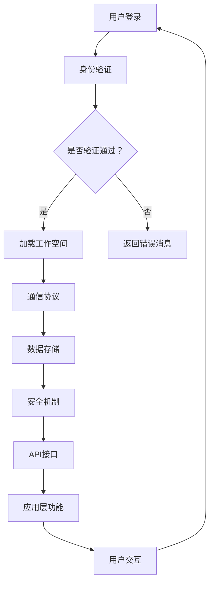

                 

远程协作平台在现代企业中扮演着至关重要的角色。随着全球化进程的加速和互联网技术的飞速发展，分布式团队已经成为许多公司的工作模式。在这种工作环境中，如何有效地连接和协同工作成为企业需要解决的核心问题。本文将探讨远程协作平台的基本概念、核心功能、实现原理、数学模型、应用实践以及未来展望，旨在为分布式团队提供有效的协作解决方案。

## 文章关键词

- 远程协作
- 分布式团队
- 远程协作平台
- 工作流管理
- 沟通工具
- 自动化
- 云计算
- 数字化转型

## 文章摘要

本文首先介绍了远程协作平台的基本概念和核心功能，分析了其在分布式团队中的重要性。随后，文章深入探讨了远程协作平台的技术架构和实现原理，包括通信协议、数据存储和安全机制。接着，文章提出了一个详细的数学模型来描述远程协作平台的工作机制。通过实际项目实践，本文展示了远程协作平台的代码实例和实现细节。最后，文章讨论了远程协作平台在多个行业中的应用场景，并对其未来发展趋势和面临的挑战进行了展望。

## 1. 背景介绍

随着信息技术的迅猛发展，远程工作逐渐成为主流。远程协作平台应运而生，它们通过提供高效、实时的沟通和协作工具，解决了分布式团队在地理位置分散情况下的协同问题。远程协作平台不仅支持文本、语音、视频等多种通信方式，还集成了项目管理、任务跟踪、文档共享等实用功能。

### 1.1 分布式团队的优势与挑战

分布式团队具有灵活的工作时间和地理位置优势，能够汇集全球最优秀的资源和人才。然而，这种工作模式也面临着沟通效率低、项目管理复杂、文化差异大等挑战。远程协作平台通过提供统一的工作空间和高效的协作工具，帮助团队克服这些困难。

### 1.2 远程协作平台的发展历程

远程协作平台的发展历程可以追溯到20世纪90年代的即时通讯工具。随着互联网技术的进步，这些工具逐渐演变成功能丰富的协作平台。如今，基于云计算和大数据技术的远程协作平台已经成为企业数字化转型的关键组件。

### 1.3 远程协作平台的主要功能

- **沟通与协作**：支持实时通信、消息传递、多人视频会议等。
- **项目管理**：包括任务分配、进度跟踪、里程碑管理等。
- **文档共享**：支持文档编辑、版本控制和权限管理。
- **代码协作**：集成版本控制、代码审查和持续集成等功能。

## 2. 核心概念与联系

远程协作平台的技术架构涉及多个核心概念和组件，这些组件相互协作，共同支撑起平台的功能。

### 2.1. 核心概念

- **用户身份验证**：确保只有授权用户才能访问平台资源。
- **通信协议**：如WebRTC、HTTP等，用于数据传输和通信。
- **数据存储**：包括实时数据库和文件存储系统，如MongoDB、Amazon S3等。
- **安全机制**：如TLS、AES加密等，保障数据传输和存储的安全。
- **API接口**：提供应用程序与平台交互的接口，如REST API、WebSocket等。

### 2.2. 技术架构

以下是一个简单的Mermaid流程图，展示了远程协作平台的技术架构：



### 2.3. 关联组件

- **用户身份验证**与**安全机制**紧密相关，用于保障平台的访问安全。
- **通信协议**和**数据存储**共同确保数据传输和存储的效率和可靠性。
- **API接口**提供应用程序与平台交互的桥梁，使得各种功能模块能够协同工作。

## 3. 核心算法原理 & 具体操作步骤

远程协作平台的核心算法涉及到数据同步、负载均衡和实时通信等关键环节。

### 3.1 算法原理概述

- **数据同步**：通过分布式协议实现实时数据的同步，确保所有用户看到的是一致的数据视图。
- **负载均衡**：通过算法将用户请求均匀分配到多个服务器上，提高系统处理能力。
- **实时通信**：利用WebSocket等协议实现低延迟、高并发的实时通信。

### 3.2 算法步骤详解

#### 3.2.1 数据同步算法

1. **事件驱动**：每当数据发生变化，触发同步事件。
2. **版本控制**：记录数据的版本号，确保同步过程中数据的一致性。
3. **多版本合并**：当多个用户对同一数据进行修改时，采用多版本合并算法。

#### 3.2.2 负载均衡算法

1. **轮询算法**：按顺序将请求分配到各个服务器。
2. **最小连接数算法**：选择当前连接数最少的服务器处理请求。
3. **响应时间算法**：根据服务器的响应时间分配请求。

#### 3.2.3 实时通信算法

1. **消息队列**：使用消息队列将用户的通信请求排序并处理。
2. **事件驱动**：基于事件驱动模型，实时响应用户的通信请求。
3. **心跳机制**：定期发送心跳消息，确保通信的稳定性和可靠性。

### 3.3 算法优缺点

- **数据同步算法**：优点是实时性强，缺点是处理复杂，需解决多版本合并问题。
- **负载均衡算法**：优点是提高系统处理能力，缺点是需根据实际情况调整策略。
- **实时通信算法**：优点是通信延迟低，缺点是资源消耗大，需优化网络通信。

### 3.4 算法应用领域

- **在线协作工具**：如Google Docs、Notion等，实现多人实时协作。
- **在线会议系统**：如Zoom、Microsoft Teams等，提供实时通信和协作功能。
- **云服务平台**：如AWS、Google Cloud等，提供远程协作平台的基础设施。

## 4. 数学模型和公式 & 详细讲解 & 举例说明

### 4.1 数学模型构建

远程协作平台的核心数学模型主要涉及图论和网络流理论。以下是一个简单的数学模型，用于描述数据同步过程：

$$
D(t) = \sum_{i=1}^{n} (V_i(t) - R_i(t))
$$

其中：
- \( D(t) \) 表示在时间 \( t \) 时刻的数据同步延迟。
- \( V_i(t) \) 表示第 \( i \) 个用户在时间 \( t \) 时刻的修改量。
- \( R_i(t) \) 表示第 \( i \) 个用户在时间 \( t \) 时刻的接收延迟。

### 4.2 公式推导过程

数据同步延迟 \( D(t) \) 可以通过以下步骤推导：

1. **用户修改量计算**：
   $$ V_i(t) = f_i(t) \times \Delta V_i $$
   其中，\( f_i(t) \) 表示用户 \( i \) 在时间 \( t \) 时刻的活动频率，\( \Delta V_i \) 表示用户 \( i \) 的修改量。

2. **接收延迟计算**：
   $$ R_i(t) = g_i(t) \times \Delta R_i $$
   其中，\( g_i(t) \) 表示用户 \( i \) 在时间 \( t \) 时刻的接收速度，\( \Delta R_i \) 表示用户 \( i \) 的接收延迟。

3. **数据同步延迟计算**：
   $$ D(t) = \sum_{i=1}^{n} (V_i(t) - R_i(t)) $$
   将用户修改量和接收延迟代入公式，得到数据同步延迟。

### 4.3 案例分析与讲解

假设有三个用户A、B、C，他们在不同时间进行数据修改，如下图所示：

| 时间 | 用户A修改量 | 用户B修改量 | 用户C修改量 |
|------|-------------|-------------|-------------|
| t1   | 5           | 3           | 2           |
| t2   | 7           | 5           | 4           |
| t3   | 10          | 7           | 6           |

根据上述数学模型，我们可以计算出每个用户在不同时间的接收延迟：

- **用户A**：
  $$ R_A(t1) = g_A(t1) \times \Delta R_A = 0.5 \times 2 = 1 $$
  $$ R_A(t2) = g_A(t2) \times \Delta R_A = 0.5 \times 3 = 1.5 $$
  $$ R_A(t3) = g_A(t3) \times \Delta R_A = 0.5 \times 4 = 2 $$

- **用户B**：
  $$ R_B(t1) = g_B(t1) \times \Delta R_B = 0.3 \times 2 = 0.6 $$
  $$ R_B(t2) = g_B(t2) \times \Delta R_B = 0.3 \times 3 = 0.9 $$
  $$ R_B(t3) = g_B(t3) \times \Delta R_B = 0.3 \times 4 = 1.2 $$

- **用户C**：
  $$ R_C(t1) = g_C(t1) \times \Delta R_C = 0.2 \times 2 = 0.4 $$
  $$ R_C(t2) = g_C(t2) \times \Delta R_C = 0.2 \times 3 = 0.6 $$
  $$ R_C(t3) = g_C(t3) \times \Delta R_C = 0.2 \times 4 = 0.8 $$

根据数学模型，我们可以计算出在时间 \( t3 \) 的数据同步延迟：

$$
D(t3) = (5 - 1) + (7 - 1.5) + (10 - 2) = 10.5
$$

这表明，在时间 \( t3 \) 时刻，整个系统的数据同步延迟为10.5。通过调整用户的活动频率和接收速度，我们可以优化数据同步的延迟，提高系统的实时性。

## 5. 项目实践：代码实例和详细解释说明

为了更好地展示远程协作平台的核心功能，以下我们将通过一个简单的项目实例，详细解释其代码实现和运行过程。

### 5.1 开发环境搭建

在开始之前，我们需要搭建一个基本的远程协作平台开发环境。以下是一个简化的步骤：

1. **安装Node.js**：远程协作平台通常基于Node.js构建，确保安装了Node.js环境。
2. **创建项目**：使用npm命令创建一个新项目，并初始化Git仓库。
   ```bash
   mkdir remote-collaboration-platform
   cd remote-collaboration-platform
   npm init -y
   git init
   ```
3. **安装依赖**：安装必要的Node.js模块，如Express、Socket.IO等。
   ```bash
   npm install express socket.io
   ```

### 5.2 源代码详细实现

以下是远程协作平台的核心代码实现：

```javascript
// app.js
const express = require('express');
const http = require('http');
const socketIO = require('socket.io');

const app = express();
const server = http.createServer(app);
const io = socketIO(server);

app.get('/', (req, res) => {
  res.sendFile(__dirname + '/index.html');
});

io.on('connection', (socket) => {
  console.log('用户连接：', socket.id);

  socket.on('joinRoom', (roomId) => {
    socket.join(roomId);
    console.log('用户加入房间：', roomId);
  });

  socket.on('sendMessage', (message) => {
    socket.broadcast.to(message.roomId).emit('receiveMessage', message);
  });

  socket.on('disconnect', () => {
    console.log('用户断开连接：', socket.id);
  });
});

server.listen(3000, () => {
  console.log('远程协作平台运行在 http://localhost:3000/');
});
```

### 5.3 代码解读与分析

1. **Express服务器**：使用Express框架创建HTTP服务器，处理HTTP请求。
2. **Socket.IO**：集成Socket.IO库，实现实时通信。Socket.IO通过WebSocket协议提供低延迟、高并发的通信能力。
3. **用户连接**：每当有用户连接到服务器时，会在控制台输出连接信息。
4. **加入房间**：用户可以通过`joinRoom`事件加入特定的房间，Socket.IO的`join`方法用于将用户加入到指定的房间。
5. **发送消息**：用户可以通过`sendMessage`事件发送消息，服务器将消息广播到指定房间的所有用户。
6. **断开连接**：用户断开连接时，会在控制台输出断开信息。

### 5.4 运行结果展示

1. **启动服务器**：
   ```bash
   node app.js
   ```
2. **访问平台**：在浏览器中输入`http://localhost:3000/`，会显示一个简单的HTML页面，用于测试实时通信功能。
3. **测试功能**：
   - 在页面中输入消息并点击发送，消息会实时显示在所有已连接用户的消息面板中。
   - 多个用户可以同时操作，实时更新页面内容。

通过这个简单的实例，我们可以看到远程协作平台的基本实现流程和功能。在实际应用中，还可以集成更多的功能模块，如项目管理、文档共享等，以提供更丰富的协作体验。

## 6. 实际应用场景

远程协作平台在多个行业中已经得到广泛应用，以下列举几个典型应用场景：

### 6.1 企业远程办公

企业远程办公是远程协作平台最直接的应用场景。通过远程协作平台，员工可以实现实时沟通、任务分配和进度跟踪，提高工作效率。例如，国际咨询公司McKinsey使用远程协作平台，帮助其全球团队在分散的地理位置上实现高效协同。

### 6.2 教育在线教学

在线教育平台利用远程协作平台，提供实时的课堂互动、作业批改和师生沟通功能。例如，Coursera使用远程协作平台，为全球学生提供在线课程支持，实现全球教育资源共享。

### 6.3 科技研发团队协作

科技研发团队通常分布在不同的地理位置，远程协作平台可以帮助团队实现代码共享、测试和部署。例如，谷歌的远程协作平台支持其全球研发团队在多个项目中进行高效协作。

### 6.4 医疗远程诊疗

远程诊疗平台利用远程协作平台，实现医生与患者的实时沟通、病历共享和远程会诊。例如，远程医疗公司Teladoc使用远程协作平台，提供在线诊疗服务，解决医疗资源分布不均的问题。

### 6.5 金融远程交易

金融行业利用远程协作平台，实现交易数据的实时分析和风险管理。例如，摩根士丹利使用远程协作平台，支持全球交易团队在实时交易环境中进行高效协作。

### 6.6 媒体内容创作

媒体内容创作团队通过远程协作平台，实现内容编辑、审批和发布。例如，Netflix使用远程协作平台，支持其全球内容团队在多个项目中高效协作，实现高质量内容创作。

## 7. 工具和资源推荐

为了帮助读者更好地了解和实现远程协作平台，以下推荐一些实用的工具和资源：

### 7.1 学习资源推荐

- **《远程协作平台设计与实现》**：一本关于远程协作平台设计和实现的深入教程，适合初学者和专业人士。
- **《Node.js实战：构建实时Web应用》**：详细介绍Node.js在构建实时应用中的应用，包括远程协作平台的实现。
- **《图解远程协作平台技术架构》**：通过图表和实例，生动展示远程协作平台的技术架构和工作原理。

### 7.2 开发工具推荐

- **Express.js**：一款流行的Node.js Web框架，适合快速开发Web应用。
- **Socket.IO**：一款支持实时双向通信的库，用于实现远程协作平台的核心功能。
- **MongoDB**：一款高性能、可扩展的NoSQL数据库，适用于存储实时数据。

### 7.3 相关论文推荐

- **《实时数据同步算法研究》**：探讨实时数据同步算法的设计和实现，对远程协作平台的数据同步机制有重要参考价值。
- **《分布式系统负载均衡策略研究》**：分析分布式系统负载均衡策略，为远程协作平台的性能优化提供指导。
- **《基于区块链的远程协作平台安全机制研究》**：研究区块链技术在远程协作平台安全机制中的应用，提高数据传输和存储的安全性能。

## 8. 总结：未来发展趋势与挑战

远程协作平台在现代企业中的作用日益重要，其未来发展也备受关注。以下是远程协作平台在未来可能的发展趋势和面临的挑战：

### 8.1 发展趋势

1. **人工智能与大数据的融合**：利用人工智能和大数据技术，实现更智能的协作工具和更精准的协作分析。
2. **区块链技术的应用**：通过区块链技术提高数据传输和存储的安全性和可靠性。
3. **边缘计算的支持**：借助边缘计算技术，降低数据传输延迟，提高实时通信的效率。
4. **跨平台集成**：实现不同平台间的无缝协作，提供更广泛的应用场景。

### 8.2 未来挑战

1. **数据隐私和安全**：在全球化背景下，如何保障数据隐私和安全成为重要挑战。
2. **网络延迟和带宽限制**：实时通信和数据同步对网络延迟和带宽有较高要求，需优化通信协议和网络架构。
3. **文化差异与协作障碍**：不同地区和文化背景的团队在协作过程中可能面临沟通障碍，需要设计更灵活的协作机制。
4. **技术更新的迭代**：随着技术的快速发展，远程协作平台需要不断迭代更新，以适应新的需求和技术变化。

### 8.3 研究展望

未来的研究可以从以下方面展开：

1. **智能协作工具的开发**：利用机器学习技术，开发更智能的协作工具，提高协作效率。
2. **跨平台协作机制的优化**：研究不同平台间的协作机制，实现更高效的无缝协作。
3. **安全隐私保护机制**：探索新的安全隐私保护技术，提高数据传输和存储的安全性能。
4. **实时通信和数据处理优化**：通过优化通信协议和网络架构，提高实时通信和数据处理能力。

## 9. 附录：常见问题与解答

### Q1：远程协作平台需要哪些技术支持？

A1：远程协作平台通常需要以下技术支持：

- **服务器技术**：如Node.js、Java等，用于构建后端服务。
- **前端技术**：如HTML、CSS、JavaScript等，用于构建用户界面。
- **数据库技术**：如MongoDB、MySQL等，用于存储用户数据和协作内容。
- **实时通信技术**：如WebSocket、Socket.IO等，用于实现实时通信。
- **安全机制**：如TLS、AES加密等，用于保障数据传输和存储的安全。

### Q2：远程协作平台有哪些主要功能？

A2：远程协作平台的主要功能包括：

- **实时通信**：支持文本、语音、视频等多种通信方式。
- **任务管理**：包括任务分配、进度跟踪、里程碑管理等。
- **文档共享**：支持文档编辑、版本控制和权限管理。
- **代码协作**：集成版本控制、代码审查和持续集成等功能。
- **项目管理**：提供项目计划、资源管理和风险评估等。

### Q3：如何确保远程协作平台的数据安全？

A3：确保远程协作平台的数据安全可以从以下几个方面入手：

- **加密传输**：使用TLS等加密协议，确保数据在传输过程中不被窃取。
- **权限控制**：对用户权限进行严格管理，确保只有授权用户可以访问敏感数据。
- **数据备份**：定期备份数据，防止数据丢失。
- **安全审计**：实施安全审计机制，及时发现和修复安全漏洞。
- **数据隐私保护**：遵循相关法律法规，保护用户数据的隐私。

### Q4：远程协作平台在中小企业中适用吗？

A4：远程协作平台在中小企业中也具有广泛适用性。中小企业可以通过远程协作平台实现以下目标：

- **提高工作效率**：通过实时沟通和协作，减少沟通障碍，提高工作效率。
- **降低运营成本**：远程协作平台可以减少企业对物理办公室的需求，降低运营成本。
- **灵活管理**：远程协作平台支持灵活的工作安排，便于企业根据业务需求进行管理。

### Q5：如何选择适合自己的远程协作平台？

A5：选择适合自己的远程协作平台可以从以下几个方面考虑：

- **功能需求**：根据企业实际需求，选择功能丰富、满足业务需求的平台。
- **用户体验**：用户体验是选择平台的重要因素，考虑平台的界面设计、操作便捷性等。
- **安全性能**：关注平台的数据安全性能，选择具备良好安全防护机制的平台。
- **成本预算**：根据企业的成本预算，选择性价比高的平台。
- **用户评价**：参考其他用户的评价和反馈，了解平台的实际应用效果。

---

本文从多个角度详细探讨了远程协作平台的基本概念、技术架构、核心算法、数学模型、实际应用和未来展望。通过本文，我们希望为分布式团队提供有效的协作解决方案，助力企业数字化转型和高效运营。作者：禅与计算机程序设计艺术 / Zen and the Art of Computer Programming。

