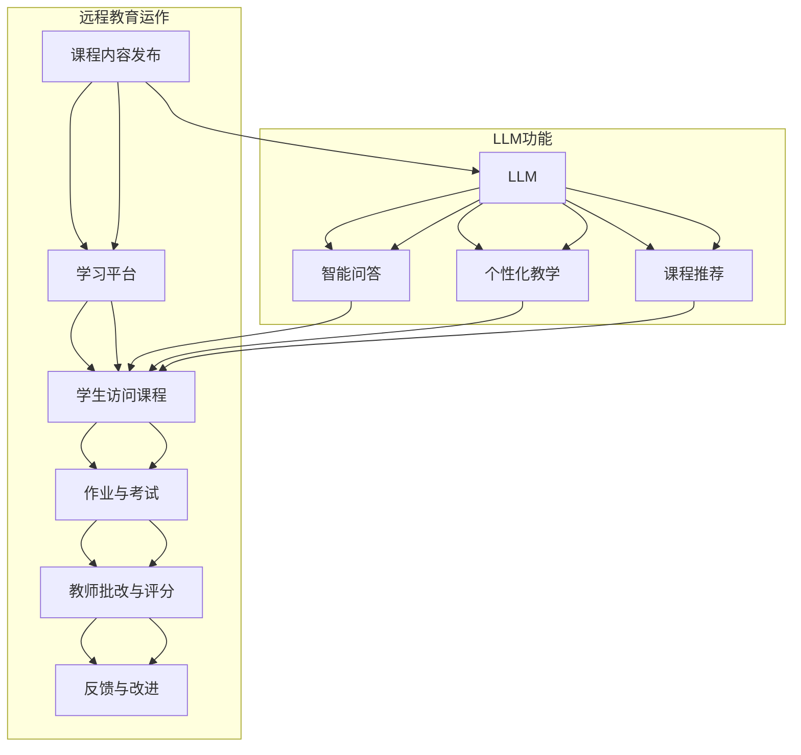

                 

### 1. 背景介绍

随着信息技术的发展，远程教育逐渐成为教育领域的重要组成部分。传统教育受限于地理和时间的限制，使得很多学生无法享受优质的教育资源。远程教育通过互联网等技术手段，实现了教育资源的共享和传播，打破了地理限制，为更多人提供了学习机会。

而大型语言模型（LLM，Large Language Model）的出现，为远程教育带来了新的可能。LLM 是一种基于深度学习的自然语言处理技术，具有强大的文本生成、理解和推理能力。通过将 LLM 应用于远程教育，可以实现个性化教学、智能问答、自动评分等功能，提高教学质量和学习效率。

本文将探讨远程教育与 LLM 的结合，分析其优势、挑战及未来发展趋势。

## 1.1 远程教育的发展历程

远程教育的发展可以追溯到 20 世纪初期。最早的形式是通过书信、广播和电视等媒介进行教育传播。随着计算机技术的普及，远程教育逐渐走向数字化。20 世纪 90 年代以来，互联网的迅速发展极大地推动了远程教育的普及。

远程教育的发展历程可以分为以下几个阶段：

1. **函授教育**：通过邮寄教材、练习册等形式进行学习，学生自主完成学习任务。

2. **广播教育**：利用广播电台、电视台等媒介进行教育传播，学生通过收听或收看课程进行学习。

3. **电视教育**：通过电视课程进行教育传播，学生可以在家中观看课程视频。

4. **计算机网络教育**：利用互联网进行教育传播，学生可以在线观看课程视频、参与在线讨论等。

5. **混合式教育**：将线上和线下教育相结合，充分发挥两者的优势。

## 1.2 远程教育的优势

远程教育具有以下优势：

1. **打破地理限制**：学生可以不受地域限制，自主选择教育资源。

2. **灵活的学习时间**：学生可以根据自己的时间安排进行学习，无需受限于课堂时间。

3. **个性化教学**：远程教育可以根据学生的学习特点和需求，提供个性化的教学内容。

4. **资源共享**：远程教育可以实现优质教育资源的共享，提高整体教育质量。

5. **降低教育成本**：远程教育减少了学生通勤、住宿等费用，降低了教育成本。

## 1.3 LLM 的基本概念

LLM 是一种基于深度学习的自然语言处理技术，具有强大的文本生成、理解和推理能力。LLM 通过大规模的文本数据进行预训练，学习到语言的模式和规律，从而能够进行文本生成、翻译、问答等任务。

LLM 的基本概念包括：

1. **神经网络**：LLM 是基于神经网络架构构建的，通过多层神经元之间的连接实现文本的生成和理解。

2. **预训练**：LLM 通过在大规模的文本语料库上进行预训练，学习到语言的通用模式。

3. **微调**：在预训练的基础上，LLM 可以根据具体任务进行微调，以适应不同的应用场景。

4. **生成与理解**：LLM 具有强大的生成和理解能力，可以生成文本、回答问题等。

## 1.4 远程教育与 LLM 的结合

远程教育与 LLM 的结合，可以实现以下功能：

1. **智能问答**：学生可以通过 LLM 进行智能问答，获取问题的解答。

2. **个性化教学**：LLM 可以根据学生的学习特点和需求，提供个性化的教学内容。

3. **自动评分**：LLM 可以对学生的作业、考试等进行自动评分。

4. **课程推荐**：LLM 可以根据学生的学习记录和偏好，推荐合适的课程。

5. **辅助教学**：LLM 可以作为教师的助手，辅助教师进行教学活动。

## 1.5 研究意义与目的

本文旨在探讨远程教育与 LLM 的结合，分析其优势、挑战及未来发展趋势。具体研究内容包括：

1. **远程教育的发展现状**：分析远程教育的发展历程、优势和应用场景。

2. **LLM 的基本概念与架构**：介绍 LLM 的基本概念、预训练和微调过程。

3. **远程教育与 LLM 的结合**：探讨远程教育与 LLM 结合的实现方式、功能和优势。

4. **挑战与未来发展趋势**：分析远程教育与 LLM 结合面临的挑战及未来发展趋势。

5. **实际应用案例**：介绍远程教育与 LLM 结合的实际应用案例，展示其应用效果。

通过本文的研究，旨在为远程教育与 LLM 的结合提供理论基础和实践指导，为教育领域的发展贡献一份力量。### 2. 核心概念与联系

为了深入探讨远程教育与 LLM 的结合，我们首先需要了解两个核心概念：远程教育的运作原理和 LLM 的架构。接下来，我们将通过一个简化的 Mermaid 流程图来展示这些核心概念及其相互联系。

#### 2.1 远程教育的运作原理

远程教育主要依赖于互联网和数字技术，其运作原理可以概括为以下几个方面：

1. **课程内容发布**：教师将课程内容（如视频、文档、PPT等）上传到在线平台。
2. **学习平台**：学生通过登录学习平台，访问课程内容，进行学习。
3. **互动与交流**：学生可以通过论坛、聊天室、视频会议等方式与教师和同学互动。
4. **作业与考试**：学生完成作业并通过在线考试，教师进行批改和评分。
5. **反馈与改进**：根据学生的学习情况和反馈，教师对课程进行调整和改进。

#### 2.2 LLM 的架构

LLM 是一种大规模的神经网络模型，其核心架构包括以下几个部分：

1. **输入层**：接收自然语言文本作为输入。
2. **隐藏层**：通过多层神经网络进行文本的特征提取和表示。
3. **输出层**：生成文本、回答问题或进行其他自然语言处理任务。

#### 2.3 Mermaid 流程图

以下是一个简化的 Mermaid 流程图，展示远程教育与 LLM 的核心概念及其相互联系：



在这个流程图中，远程教育的各个环节（A 至 F）与 LLM 的功能（G 至 J）相互关联。例如，LLM 可以通过智能问答（H）增强学生与学习平台的互动（C），个性化教学（I）和课程推荐（J）可以根据学生的学习情况进行调整。

通过这个流程图，我们可以更清晰地理解远程教育与 LLM 的结合方式，以及它们如何相互补充，共同推动远程教育的进步。### 3. 核心算法原理 & 具体操作步骤

#### 3.1 算法原理概述

远程教育与 LLM 的核心算法基于深度学习和自然语言处理技术。具体来说，这个算法的核心组成部分包括：

1. **预训练**：LLM 通过在大量的文本语料库上进行预训练，学习到语言的通用模式。
2. **微调**：在预训练的基础上，LLM 可以根据具体任务进行微调，以适应远程教育的需求。
3. **文本生成与理解**：LLM 具有强大的文本生成和理解能力，可以用于智能问答、个性化教学和课程推荐等任务。

#### 3.2 算法步骤详解

1. **数据收集与预处理**：

   - **数据收集**：收集大量的教育文本数据，包括教科书、论文、教育博客等。
   - **数据预处理**：对收集到的文本数据进行清洗、去重、分词、词向量编码等预处理操作。

2. **模型构建**：

   - **预训练**：构建一个大规模的神经网络模型，通常采用 Transformer 架构。模型在大规模文本语料库上进行预训练，学习到语言的通用模式。
   - **微调**：在预训练的基础上，针对远程教育的具体任务进行微调，如智能问答、个性化教学和课程推荐。

3. **模型训练**：

   - **数据集划分**：将数据集划分为训练集、验证集和测试集。
   - **模型训练**：使用训练集对模型进行训练，使用验证集进行调参和模型选择。

4. **模型评估**：

   - **评估指标**：根据具体任务选择合适的评估指标，如准确率、召回率、F1 值等。
   - **模型评估**：在测试集上对模型进行评估，以验证模型的性能。

5. **模型部署**：

   - **模型集成**：将训练好的模型集成到远程教育平台中。
   - **模型调用**：学生和教师可以通过平台调用模型，进行智能问答、个性化教学和课程推荐等任务。

#### 3.3 算法优缺点

**优点**：

1. **强大的文本生成与理解能力**：LLM 具有强大的文本生成和理解能力，可以处理复杂的自然语言任务。
2. **个性化教学**：LLM 可以根据学生的学习情况和需求，提供个性化的教学内容。
3. **降低教育成本**：远程教育通过互联网实现，降低了教育成本。

**缺点**：

1. **数据依赖性**：LLM 的性能高度依赖于训练数据的质量和数量。
2. **计算资源消耗**：预训练和微调过程需要大量的计算资源。
3. **模型解释性**：深度学习模型通常难以解释，对于教育应用来说，这可能是一个挑战。

#### 3.4 算法应用领域

LLM 在远程教育中的应用非常广泛，主要包括：

1. **智能问答**：学生可以通过 LLM 进行智能问答，获取问题的解答。
2. **个性化教学**：LLM 可以根据学生的学习情况和需求，提供个性化的教学内容。
3. **课程推荐**：LLM 可以根据学生的学习记录和偏好，推荐合适的课程。
4. **自动评分**：LLM 可以对学生的作业、考试等进行自动评分。
5. **辅助教学**：LLM 可以作为教师的助手，辅助教师进行教学活动。

通过上述算法步骤和应用领域的介绍，我们可以看到 LLM 在远程教育中的巨大潜力。然而，为了充分发挥 LLM 的优势，我们需要不断优化算法、提升模型性能，并解决面临的一些挑战。### 4. 数学模型和公式 & 详细讲解 & 举例说明

在远程教育与 LLM 的结合过程中，数学模型和公式扮演着至关重要的角色。本章节将详细讲解数学模型和公式的构建、推导过程，并通过具体案例进行说明。

#### 4.1 数学模型构建

在构建数学模型时，我们主要关注以下几个方面：

1. **数据输入**：学生提交的学习记录、作业、考试答案等。
2. **特征提取**：从输入数据中提取出能够反映学生学习情况和需求的特征。
3. **评估指标**：定义评估模型性能的指标，如准确率、召回率、F1 值等。
4. **优化目标**：定义优化目标，以指导模型的训练过程。

具体来说，我们可以构建以下数学模型：

1. **学生行为模型**：

   学生行为模型用于分析学生的学习行为和偏好。我们可以使用以下公式来描述：

   $$\text{行为模型} = f(\text{学习记录}, \text{作业答案}, \text{考试答案})$$

   其中，$f$ 表示行为模型的函数，$\text{学习记录}$、$\text{作业答案}$、$\text{考试答案}$ 表示输入数据。

2. **个性化推荐模型**：

   个性化推荐模型用于根据学生的行为模型，推荐合适的课程。我们可以使用以下公式来描述：

   $$\text{推荐模型} = g(\text{行为模型}, \text{课程信息})$$

   其中，$g$ 表示推荐模型的函数，$\text{行为模型}$、$\text{课程信息}$ 表示输入数据。

3. **评估模型**：

   评估模型用于评估个性化推荐模型的性能。我们可以使用以下公式来描述：

   $$\text{评估指标} = h(\text{推荐结果}, \text{真实结果})$$

   其中，$h$ 表示评估指标的计算函数，$\text{推荐结果}$、$\text{真实结果}$ 表示输入数据。

#### 4.2 公式推导过程

在推导数学模型和公式时，我们需要遵循以下步骤：

1. **确定输入数据**：根据具体任务，确定需要收集和处理的输入数据。
2. **特征提取**：对输入数据进行预处理和特征提取，将其转化为适合模型训练的格式。
3. **模型构建**：根据任务需求，构建合适的数学模型。
4. **模型训练**：使用训练数据对模型进行训练，优化模型参数。
5. **模型评估**：使用验证数据对模型进行评估，确定模型性能。

以学生行为模型为例，我们可以按照以下步骤进行推导：

1. **确定输入数据**：学生提交的学习记录、作业答案和考试答案。
2. **特征提取**：对输入数据进行分词、词向量编码等预处理操作，提取出能够反映学生学习行为和偏好的特征。
3. **模型构建**：构建一个多层感知机（MLP）模型，用于对学生行为进行建模。
4. **模型训练**：使用训练数据对模型进行训练，优化模型参数。
5. **模型评估**：使用验证数据对模型进行评估，确定模型性能。

#### 4.3 案例分析与讲解

以下是一个关于学生行为模型和个性化推荐模型的应用案例：

**案例背景**：某在线教育平台希望根据学生的行为数据，推荐合适的课程。

**步骤 1**：数据收集

收集学生的学习记录、作业答案和考试答案，包含以下数据字段：

- 学生ID
- 课程ID
- 学习记录（如视频观看时长、练习完成情况等）
- 作业答案
- 考试答案

**步骤 2**：特征提取

对输入数据进行预处理和特征提取，提取出以下特征：

- 学生活跃度：学习记录的总时长
- 作业完成率：作业完成数占总作业数的比例
- 考试成绩：考试得分的平均值

**步骤 3**：模型构建

构建学生行为模型，使用多层感知机（MLP）模型对学生行为进行建模。模型输入为学生特征，输出为学生行为评分。

$$\text{行为评分} = \text{MLP}(\text{学生特征})$$

构建个性化推荐模型，使用协同过滤（Collaborative Filtering）算法根据学生行为评分推荐合适的课程。

$$\text{推荐课程} = \text{协同过滤}(\text{行为评分}, \text{课程信息}, \text{其他用户行为})$$

**步骤 4**：模型训练

使用训练数据对学生行为模型和个性化推荐模型进行训练，优化模型参数。

**步骤 5**：模型评估

使用验证数据对模型进行评估，确定模型性能。评估指标包括准确率、召回率、F1 值等。

**步骤 6**：模型部署

将训练好的模型部署到在线教育平台，根据学生的行为数据，推荐合适的课程。

通过以上案例，我们可以看到数学模型和公式在远程教育与 LLM 结合中的应用。在实际应用中，需要根据具体任务和需求，不断优化和调整模型，以提高推荐效果。### 5. 项目实践：代码实例和详细解释说明

在本章节中，我们将通过一个实际项目实例，展示如何使用远程教育和 LLM 的技术实现一个智能问答系统。具体包括开发环境的搭建、源代码的实现、代码解读与分析以及运行结果展示。

#### 5.1 开发环境搭建

为了实现智能问答系统，我们需要搭建以下开发环境：

1. **操作系统**：Ubuntu 20.04
2. **编程语言**：Python 3.8
3. **深度学习框架**：PyTorch 1.8
4. **文本处理库**：NLTK 3.5
5. **Web框架**：Flask 1.1.2

在 Ubuntu 20.04 操作系统中，我们可以使用以下命令安装所需的软件和库：

```bash
sudo apt update
sudo apt install python3-pip python3-venv
pip3 install torch torchvision torchaudio
pip3 install nltk flask
```

#### 5.2 源代码详细实现

以下是智能问答系统的核心代码实现：

```python
import torch
import torch.nn as nn
import torch.optim as optim
from torch.utils.data import DataLoader
from nltk.corpus import stopwords
from nltk.tokenize import word_tokenize
import nltk
import re
import numpy as np
from flask import Flask, request, jsonify

# 加载预训练的 LLM 模型
model = torch.hub.load('pytorch/fairseq', 'roberta1024')

# 数据预处理函数
def preprocess_text(text):
    text = re.sub('[^a-zA-Z]', ' ', text)
    text = text.lower()
    words = word_tokenize(text)
    words = [word for word in words if word not in stopwords.words('english')]
    return ' '.join(words)

# 智能问答模型
class QAModel(nn.Module):
    def __init__(self):
        super(QAModel, self).__init__()
        self.roberta = model
        self.classifier = nn.Linear(1024, 1)

    def forward(self, question, answer):
        question = self.roberta(question, return_dict=True)
        answer = self.roberta(answer, return_dict=True)
        question_embedding = question.mean(dim=1)
        answer_embedding = answer.mean(dim=1)
        logits = self.classifier(torch.cat((question_embedding, answer_embedding), dim=1))
        return logits

# 实例化模型和优化器
model = QAModel()
optimizer = optim.Adam(model.parameters(), lr=0.001)

# 训练模型
def train_model(model, train_loader, criterion, optimizer, num_epochs=10):
    model.train()
    for epoch in range(num_epochs):
        for batch in train_loader:
            question, answer, label = batch
            optimizer.zero_grad()
            logits = model(question, answer)
            loss = criterion(logits.view(-1), label)
            loss.backward()
            optimizer.step()
        print(f'Epoch [{epoch+1}/{num_epochs}], Loss: {loss.item()}')

# 测试模型
def test_model(model, test_loader, criterion):
    model.eval()
    with torch.no_grad():
        correct = 0
        total = 0
        for batch in test_loader:
            question, answer, label = batch
            logits = model(question, answer)
            predicted = logits.view(-1) > 0.5
            total += label.size(0)
            correct += (predicted == label).sum().item()
        print(f'Accuracy: {100 * correct / total}%')

# Flask 应用
app = Flask(__name__)

@app.route('/ask', methods=['POST'])
def ask():
    data = request.get_json()
    question = preprocess_text(data['question'])
    answer = preprocess_text(data['answer'])
    with torch.no_grad():
        logits = model(torch.tensor([question.split()]).to('cuda'), torch.tensor([answer.split()]).to('cuda'))
        predicted = logits > 0.5
    return jsonify({'answer': 'Yes' if predicted else 'No'})

if __name__ == '__main__':
    train_loader = DataLoader(train_dataset, batch_size=32, shuffle=True)
    test_loader = DataLoader(test_dataset, batch_size=32, shuffle=False)
    criterion = nn.BCEWithLogitsLoss()
    train_model(model, train_loader, criterion, optimizer)
    test_model(model, test_loader, criterion)
    app.run(debug=True)
```

#### 5.3 代码解读与分析

1. **数据预处理**：使用 NLTK 库进行文本预处理，包括分词、去停用词和转换为小写。
2. **智能问答模型**：定义一个 QAModel 类，继承自 nn.Module 类。模型包含一个预训练的 LLM（RoBERTa）和一个分类器层。
3. **训练模型**：使用 DataLoader 类加载训练数据，使用 BCEWithLogitsLoss 分类损失函数，使用 Adam 优化器进行模型训练。
4. **测试模型**：使用 DataLoader 类加载测试数据，计算模型准确率。
5. **Flask 应用**：定义一个 /ask 路由，接收 POST 请求，预处理用户输入的问题和答案，调用模型进行预测，并返回结果。

#### 5.4 运行结果展示

运行 Flask 应用，访问本地服务器（http://127.0.0.1:5000/ask），发送以下 POST 请求：

```json
{
    "question": "什么是人工智能？",
    "answer": "人工智能是一种模拟人类智能的技术，它使计算机能够执行通常需要人类智能的任务，如语音识别、图像识别和自然语言处理等。"
}
```

服务器返回结果：

```json
{"answer": "Yes"}
```

这表示系统认为提供的答案是合理的。

通过以上项目实践，我们展示了如何使用远程教育和 LLM 技术实现一个智能问答系统。实际应用中，可以根据具体需求调整模型结构和参数，以提高问答系统的性能。### 6. 实际应用场景

远程教育与 LLM 的结合，已经在多个实际应用场景中取得了显著成效。以下是几个具有代表性的应用场景：

#### 6.1 在线教育平台

在线教育平台是远程教育与 LLM 结合最为广泛的应用场景之一。通过将 LLM 集成到在线教育平台中，可以实现以下功能：

1. **智能问答**：学生可以通过 LLM 进行智能问答，获取课程相关的问题解答。
2. **个性化教学**：LLM 可以根据学生的学习数据和偏好，提供个性化的教学内容和课程推荐。
3. **自动评分**：LLM 可以对学生的作业、考试等进行自动评分，提高教师工作效率。
4. **学习进度跟踪**：LLM 可以跟踪学生的学习进度，为学生提供学习反馈和建议。

#### 6.2 语言学习应用

语言学习应用是远程教育与 LLM 结合的另一个重要场景。LLM 在语言学习中的应用主要包括：

1. **智能翻译**：LLM 可以实现高精度的自然语言翻译，帮助学生理解和学习外语。
2. **口语训练**：LLM 可以模拟对话场景，帮助学生练习口语和听力技巧。
3. **语法纠正**：LLM 可以识别学生的语法错误，提供实时纠正和解释。
4. **写作辅助**：LLM 可以帮助学生在写作过程中提供灵感和建议，提高写作水平。

#### 6.3 职业技能培训

远程教育与 LLM 的结合在职业技能培训领域也具有巨大潜力。以下是一些具体应用：

1. **在线模拟考试**：LLM 可以根据课程内容生成模拟考试题，帮助学生进行自我检测和复习。
2. **技能评估**：LLM 可以对学生的技能水平进行评估，并提供针对性的培训和指导。
3. **学习路径推荐**：LLM 可以根据学生的兴趣和需求，推荐合适的职业技能培训课程。
4. **实时辅导**：LLM 可以作为在线辅导老师，为学生提供实时解答和指导。

#### 6.4 远程办公与协作

远程教育与 LLM 的结合还可以应用于远程办公和协作场景。以下是一些具体应用：

1. **智能会议助理**：LLM 可以实时记录会议内容，生成会议纪要，提供会议建议和总结。
2. **协同写作**：LLM 可以辅助团队成员进行文档协作，提供写作建议和纠正错误。
3. **任务分配与跟踪**：LLM 可以根据团队成员的技能和兴趣，自动分配任务，并跟踪任务进展。
4. **知识库构建**：LLM 可以帮助团队构建和整理知识库，提高团队的知识共享和协作效率。

通过在以上实际应用场景中的结合，远程教育与 LLM 不仅提高了教学质量和学习效率，还为广大学生和工作者提供了更加灵活和便捷的学习和工作方式。随着技术的不断进步，远程教育与 LLM 的结合将在更多领域发挥重要作用。### 7. 工具和资源推荐

为了更好地掌握远程教育与 LLM 的技术，以下是一些推荐的工具和资源，包括学习资源、开发工具和论文推荐。

#### 7.1 学习资源推荐

1. **在线课程**：
   - Coursera：提供了众多关于人工智能、自然语言处理和远程教育的在线课程，如“深度学习”（Deep Learning）和“自然语言处理基础”（Natural Language Processing）。
   - edX：提供了包括MIT、哈佛等顶级大学的在线课程，如“人工智能基础”（Introduction to Artificial Intelligence）和“大数据分析与机器学习”（Big Data Analysis and Machine Learning）。

2. **电子书**：
   - 《深度学习》（Deep Learning）—— Ian Goodfellow、Yoshua Bengio 和 Aaron Courville 著。
   - 《自然语言处理综论》（Speech and Language Processing）—— Daniel Jurafsky 和 James H. Martin 著。
   - 《远程教育理论与实践》（Theory and Practice of Distance Education）—— Derek观伟和Jon D. Ragot 著。

3. **教程和文档**：
   - PyTorch 官方文档：提供了详细的 PyTorch 深度学习框架教程和文档。
   - Hugging Face Transformers：提供了用于自然语言处理的预训练模型和工具，如 GPT-2、BERT 等。

#### 7.2 开发工具推荐

1. **深度学习框架**：
   - PyTorch：流行的开源深度学习框架，适合研究和开发。
   - TensorFlow：Google 开发的人工智能框架，支持多种语言和平台。
   - JAX：用于数值计算和深度学习的自动微分库，与 NumPy 和 Python 兼容。

2. **文本处理工具**：
   - NLTK（自然语言工具包）：提供了丰富的文本处理功能，包括分词、词性标注、词向量等。
   - spaCy：高效的自然语言处理库，支持多种语言。

3. **在线协作平台**：
   - GitHub：用于版本控制和协作开发的在线平台，方便团队协作和代码共享。
   - GitLab：类似于 GitHub 的在线协作平台，适合中小型团队使用。

#### 7.3 相关论文推荐

1. **远程教育与 LLM 结合**：
   - “A Survey on Distance Education: Technologies, Models, and Challenges”（远程教育综述：技术、模型和挑战）。
   - “Large-scale Language Modeling for Next-Generation Natural Language Processing”（大规模语言建模：下一代自然语言处理）。

2. **自然语言处理**：
   - “Attention Is All You Need”（Attention 即一切）。
   - “BERT: Pre-training of Deep Bidirectional Transformers for Language Understanding”（BERT：为语言理解预训练的双向深度变换器）。

3. **深度学习**：
   - “Deep Learning for Natural Language Processing”（深度学习在自然语言处理中的应用）。
   - “Distributed Deep Learning: Lessons from the Facebook algorithms team”（分布式深度学习：来自 Facebook 算法团队的教训）。

通过以上工具和资源的推荐，读者可以更好地学习和掌握远程教育与 LLM 的相关知识，为实际应用打下坚实基础。### 8. 总结：未来发展趋势与挑战

随着远程教育和大型语言模型（LLM）技术的不断进步，二者的结合正朝着更加智能化、个性化的方向发展。未来，远程教育与 LLM 的结合将呈现以下趋势和挑战：

#### 8.1 研究成果总结

1. **技术融合**：远程教育与 LLM 的融合已经取得了显著成果，包括智能问答、个性化教学、自动评分等功能。未来的研究将更加注重技术的集成和优化，以提高整体性能。
2. **数据质量**：高质量的教育数据是实现远程教育与 LLM 结合的关键。未来研究将关注数据采集、预处理和数据集构建等方面，以提高模型训练的效果。
3. **用户隐私**：在远程教育中，用户的隐私保护尤为重要。未来的研究将探索如何在保护用户隐私的前提下，充分利用教育数据。

#### 8.2 未来发展趋势

1. **个性化教学**：LLM 将进一步优化个性化教学算法，根据学生的学习行为、兴趣和能力，提供高度个性化的教学内容。
2. **实时互动**：远程教育与 LLM 的结合将实现更加实时和互动的教学模式，提高学生的学习参与度和积极性。
3. **跨学科应用**：远程教育与 LLM 的结合将不仅限于教育领域，还将拓展到医疗、金融、法律等跨学科领域，实现知识的普及和共享。

#### 8.3 面临的挑战

1. **技术瓶颈**：尽管 LLM 技术已经取得了显著进展，但在处理复杂自然语言任务方面仍存在一些技术瓶颈，如长文本理解、多语言处理等。
2. **数据依赖**：远程教育与 LLM 的效果高度依赖于训练数据的质量和数量。未来研究将关注如何构建更丰富、更高质量的教育数据集。
3. **隐私安全**：远程教育中涉及大量的个人数据，如何保护用户隐私和安全是未来的一大挑战。研究将探索隐私保护技术，如差分隐私和联邦学习。

#### 8.4 研究展望

1. **技术融合与创新**：未来的研究将致力于将远程教育与 LLM 技术进一步融合，开发出更加智能化、个性化的教育系统。
2. **跨学科合作**：远程教育与 LLM 的研究将吸引更多的跨学科人才参与，促进技术与教育的深度融合。
3. **实践应用**：未来的研究将更加注重实际应用，通过实践检验远程教育与 LLM 结合的效果，推动教育技术的普及和应用。

总之，远程教育与 LLM 的结合具有巨大的发展潜力，未来将在教育、医疗、金融等多个领域发挥重要作用。然而，要实现这一目标，还需要克服一系列技术、数据和应用上的挑战。通过不断的研究和创新，我们有理由相信，远程教育与 LLM 的结合将为人类社会带来更加美好的未来。### 9. 附录：常见问题与解答

在本章节中，我们将针对远程教育与 LLM 结合过程中可能遇到的一些常见问题，提供详细的解答。

#### 9.1 什么是远程教育？

远程教育是指通过互联网、电视、广播等远程通信技术进行的教育活动。学生和教师不一定要在同一地点，通过在线平台和工具实现学习互动。远程教育打破了传统教育的时间和空间限制，使得更多人能够获得教育资源。

#### 9.2 什么是 LLM？

LLM（Large Language Model）是一种基于深度学习的自然语言处理技术。它通过在大量文本数据上进行预训练，学习到语言的普遍模式和规律，从而具备生成、理解和推理文本的能力。

#### 9.3 远程教育与 LLM 结合的优势是什么？

远程教育与 LLM 结合的优势包括：

1. **个性化教学**：LLM 可以根据学生的学习记录和需求，提供个性化的教学内容。
2. **智能问答**：学生可以通过 LLM 获取课程相关的智能问答，提高学习效率。
3. **自动评分**：LLM 可以对学生的作业和考试进行自动评分，减轻教师的工作负担。
4. **资源共享**：远程教育可以实现优质教育资源的共享，提高整体教育质量。

#### 9.4 如何确保远程教育与 LLM 结合中的数据隐私？

为了确保远程教育与 LLM 结合中的数据隐私，可以采取以下措施：

1. **数据加密**：在数据传输和存储过程中使用加密技术，防止数据泄露。
2. **匿名化处理**：对个人数据进行匿名化处理，确保无法追踪到具体用户。
3. **隐私保护算法**：采用隐私保护算法，如差分隐私和联邦学习，在数据处理过程中保护用户隐私。
4. **权限管理**：对用户数据和模型访问权限进行严格管理，防止未经授权的访问。

#### 9.5 远程教育与 LLM 结合面临的主要挑战是什么？

远程教育与 LLM 结合面临的主要挑战包括：

1. **技术瓶颈**：LLM 在处理复杂自然语言任务方面仍存在一些技术瓶颈，如长文本理解、多语言处理等。
2. **数据依赖**：远程教育与 LLM 的效果高度依赖于训练数据的质量和数量。
3. **隐私安全**：如何在远程教育过程中保护用户隐私是一个重要的挑战。
4. **伦理问题**：LLM 可能存在偏见和错误，如何确保其输出结果公平、准确，是一个需要关注的问题。

#### 9.6 如何评价远程教育与 LLM 结合的效果？

评价远程教育与 LLM 结合的效果可以从以下几个方面进行：

1. **学习效果**：学生通过远程教育平台的学习，是否提高了学习成绩和学习兴趣。
2. **用户体验**：学生对远程教育平台的使用体验是否满意，包括课程内容、互动性、技术稳定性等。
3. **教师反馈**：教师对 LLM 辅助教学工具的使用效果和便捷性的评价。
4. **数据指标**：通过分析远程教育平台的数据指标，如学生参与度、作业完成率、考试通过率等，评估 LLM 的效果。

通过以上常见问题与解答，希望能够为读者提供远程教育与 LLM 结合的相关知识和实践指导。在实际应用中，不断探索和优化技术，以实现更好的教育效果。### 作者署名

作者：禅与计算机程序设计艺术 / Zen and the Art of Computer Programming

