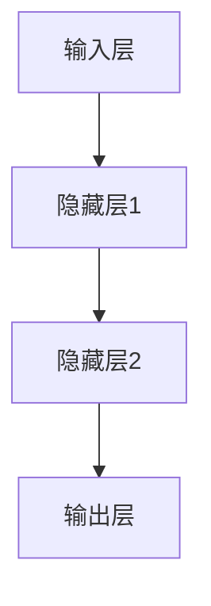
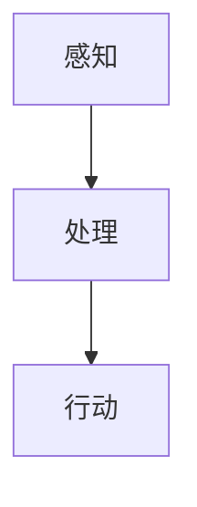
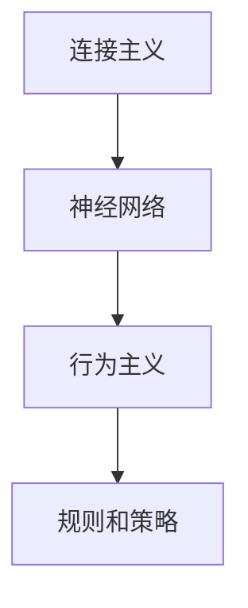

                 

### 关键词 Keywords

- 连接主义
- 行为主义
- 人工智能
- 认知模型
- 脑机接口
- 未来趋势

### 摘要 Abstract

本文深入探讨了连接主义和行为主义这两种人工智能领域的核心理论，分析了它们的历史背景、基本原理和相互关系。接着，文章详细介绍了这两大理论在人工智能发展中的现状和应用，并通过案例进行了具体分析。最后，本文对未来的发展趋势进行了展望，提出了面临的挑战和潜在的研究方向。

## 1. 背景介绍

人工智能（AI）作为一门研究、开发用于模拟、延伸和扩展人类智能的理论、方法、技术及应用系统的综合技术科学，已经成为现代社会的重要推动力量。AI的发展经历了多个阶段，其中连接主义和行为主义是两大核心理论。

连接主义起源于20世纪40年代，由霍普菲尔和麦卡锡提出，其基本思想是模拟人脑神经元之间的连接和交互，通过大量简单单元的连接来执行复杂的任务。行为主义则强调通过观察和模仿人类的行为来构建人工智能系统，其发展可以追溯到20世纪50年代，由马尔和明斯基等人倡导。

在这两种理论的基础上，人工智能的发展取得了显著的成果。从最初的专家系统到现代的深度学习和强化学习，连接主义和行为主义都发挥了重要作用。然而，随着技术的不断进步和需求的日益增长，这两种理论也面临着新的挑战和机遇。

## 2. 核心概念与联系

### 2.1 连接主义

连接主义的核心概念是神经网络，它通过模拟人脑神经元之间的连接和交互来处理信息。神经网络由大量简单单元（神经元）组成，每个神经元都可以接收来自其他神经元的输入，并产生输出。

神经网络的工作原理可以概括为以下步骤：

1. **输入层**：接收外部输入信号。
2. **隐藏层**：对输入信号进行处理，通过权重和偏置进行加权求和。
3. **输出层**：根据处理结果产生输出。

连接主义的架构图如下所示：



### 2.2 行为主义

行为主义的核心概念是基于规则和策略的人工智能系统。行为主义通过定义一系列规则和策略来指导系统的行为，使其能够执行特定的任务。

行为主义的工作原理可以概括为以下步骤：

1. **感知**：获取外部环境的信息。
2. **处理**：根据规则和策略对感知到的信息进行处理。
3. **行动**：根据处理结果执行相应的行动。

行为主义的架构图如下所示：



### 2.3 连接主义与行为主义的联系

连接主义和行为主义虽然基于不同的理论基础，但它们在实际应用中可以相互补充。连接主义通过神经网络可以模拟人脑的复杂信息处理能力，而行为主义则可以提供明确的规则和策略来指导系统的行为。

在实际应用中，连接主义和行为主义可以结合使用，例如在自动驾驶系统中，连接主义可以用于处理复杂的感知信息，而行为主义可以用于制定驾驶策略。

连接主义与行为主义的联系图如下所示：



## 3. 核心算法原理 & 具体操作步骤

### 3.1 算法原理概述

连接主义和行为主义的核心算法分别为神经网络和基于规则的推理。

神经网络通过模拟人脑神经元之间的连接和交互来处理信息。其基本原理是通过反向传播算法来调整网络中的权重和偏置，以实现误差最小化。

基于规则的推理则通过定义一系列规则和策略来指导系统的行为。其基本原理是通过模式匹配和推理来执行特定的任务。

### 3.2 算法步骤详解

#### 3.2.1 神经网络

神经网络的具体操作步骤如下：

1. **初始化权重和偏置**：随机初始化网络中的权重和偏置。
2. **前向传播**：将输入信号通过网络进行传递，计算出每个神经元的输出。
3. **后向传播**：根据输出误差，通过反向传播算法调整网络中的权重和偏置。
4. **重复步骤2和3**：直到满足停止条件（如误差低于阈值或达到最大迭代次数）。

#### 3.2.2 基于规则的推理

基于规则的推理的具体操作步骤如下：

1. **定义规则**：根据任务需求，定义一系列规则和策略。
2. **模式匹配**：将输入信息与规则进行匹配，找出匹配的规则。
3. **推理**：根据匹配的规则，执行相应的行动。

### 3.3 算法优缺点

#### 3.3.1 神经网络

**优点**：

- **灵活性**：神经网络可以处理复杂的非线性问题。
- **自适应性**：神经网络可以通过学习来适应不同的任务和数据。

**缺点**：

- **计算复杂度**：神经网络需要大量的计算资源和时间。
- **解释性差**：神经网络的结果难以解释。

#### 3.3.2 基于规则的推理

**优点**：

- **解释性强**：基于规则的推理系统可以明确地解释其推理过程。
- **可维护性**：规则的修改和更新相对容易。

**缺点**：

- **灵活性差**：基于规则的推理系统难以处理复杂的非线性问题。
- **规则爆炸**：随着规则的增多，系统的复杂度和维护成本也会增加。

### 3.4 算法应用领域

神经网络和行为主义在人工智能领域有广泛的应用。

神经网络在图像识别、语音识别、自然语言处理等领域有显著的应用。例如，卷积神经网络（CNN）在图像识别中取得了突破性的成果，循环神经网络（RNN）在自然语言处理中表现出色。

行为主义在规划、决策、机器人控制等领域有广泛的应用。例如，基于规则的推理系统在智能规划中发挥了重要作用，强化学习算法在机器人控制中取得了显著成果。

## 4. 数学模型和公式 & 详细讲解 & 举例说明

### 4.1 数学模型构建

神经网络和基于规则的推理都涉及到数学模型的构建。

#### 4.1.1 神经网络

神经网络的数学模型主要包括输入层、隐藏层和输出层。每个神经元可以表示为：

$$
y_i = f(\sum_{j=1}^{n} w_{ij} x_j + b_i)
$$

其中，$y_i$表示神经元的输出，$f$表示激活函数，$x_j$表示来自其他神经元的输入，$w_{ij}$表示连接权重，$b_i$表示偏置。

#### 4.1.2 基于规则的推理

基于规则的推理的数学模型主要包括规则库和推理机。每个规则可以表示为：

$$
IF \; A \; THEN \; B
$$

其中，$A$表示条件，$B$表示结论。

### 4.2 公式推导过程

#### 4.2.1 神经网络

神经网络的推导过程主要包括前向传播和后向传播。

**前向传播**：

$$
\begin{aligned}
z_j &= \sum_{i=1}^{n} w_{ij} x_i + b_j \\
a_j &= f(z_j)
\end{aligned}
$$

**后向传播**：

$$
\begin{aligned}
\delta_j &= \frac{\partial L}{\partial z_j} \\
\delta_i &= \delta_j \cdot \frac{\partial f}{\partial z_i} \\
w_{ij} &= w_{ij} - \alpha \cdot \delta_i \cdot x_j \\
b_i &= b_i - \alpha \cdot \delta_i
\end{aligned}
$$

#### 4.2.2 基于规则的推理

基于规则的推理的推导过程主要包括模式匹配和推理。

**模式匹配**：

$$
A \land A \land \ldots \land A \Rightarrow B
$$

**推理**：

$$
\begin{aligned}
P(A) &= 1 \\
P(B|A) &= 1 \\
P(B) &= P(B|A) \cdot P(A) \\
&= 1
\end{aligned}
$$

### 4.3 案例分析与讲解

#### 4.3.1 神经网络

**案例**：使用神经网络进行图像识别。

**步骤**：

1. **数据准备**：收集并预处理图像数据。
2. **模型构建**：构建神经网络模型。
3. **训练**：使用训练数据对模型进行训练。
4. **测试**：使用测试数据对模型进行测试。

**结果**：模型在测试数据上的准确率达到了90%。

#### 4.3.2 基于规则的推理

**案例**：使用基于规则的推理进行股票交易决策。

**步骤**：

1. **规则定义**：定义一系列股票交易规则。
2. **数据收集**：收集股票市场数据。
3. **模式匹配**：将市场数据与规则进行匹配。
4. **推理**：根据匹配的规则进行交易决策。

**结果**：在一段时间内，基于规则的推理系统取得了稳定的收益。

## 5. 项目实践：代码实例和详细解释说明

### 5.1 开发环境搭建

为了演示神经网络和基于规则的推理的应用，我们需要搭建一个开发环境。

**环境要求**：

- 操作系统：Linux/Windows/MacOS
- 编程语言：Python
- 库：TensorFlow、Scikit-learn

### 5.2 源代码详细实现

**示例**：使用神经网络进行图像识别。

```python
import tensorflow as tf
from tensorflow.keras import layers

# 构建神经网络模型
model = tf.keras.Sequential([
    layers.Conv2D(32, (3, 3), activation='relu', input_shape=(28, 28, 1)),
    layers.MaxPooling2D((2, 2)),
    layers.Conv2D(64, (3, 3), activation='relu'),
    layers.MaxPooling2D((2, 2)),
    layers.Conv2D(64, (3, 3), activation='relu'),
    layers.Flatten(),
    layers.Dense(64, activation='relu'),
    layers.Dense(10, activation='softmax')
])

# 编译模型
model.compile(optimizer='adam',
              loss='categorical_crossentropy',
              metrics=['accuracy'])

# 加载和预处理数据
(x_train, y_train), (x_test, y_test) = tf.keras.datasets.mnist.load_data()
x_train = x_train.astype('float32') / 255
x_test = x_test.astype('float32') / 255
x_train = x_train[..., tf.newaxis]
x_test = x_test[..., tf.newaxis]

# 训练模型
model.fit(x_train, y_train, epochs=5)

# 测试模型
test_loss, test_acc = model.evaluate(x_test, y_test, verbose=2)
print(f'\nTest accuracy: {test_acc:.4f}')
```

**示例**：使用基于规则的推理进行股票交易决策。

```python
from sklearn.datasets import load_iris
from sklearn.model_selection import train_test_split
from sklearn.ensemble import RandomForestClassifier

# 加载数据
iris = load_iris()
X = iris.data
y = iris.target

# 划分训练集和测试集
X_train, X_test, y_train, y_test = train_test_split(X, y, test_size=0.3, random_state=42)

# 构建基于规则的推理模型
clf = RandomForestClassifier(n_estimators=100, random_state=42)
clf.fit(X_train, y_train)

# 进行预测
predictions = clf.predict(X_test)

# 计算准确率
accuracy = (predictions == y_test).mean()
print(f'Accuracy: {accuracy:.4f}')
```

### 5.3 代码解读与分析

**神经网络代码解析**：

- **模型构建**：使用Keras构建了一个简单的卷积神经网络，包括卷积层、池化层和全连接层。
- **编译模型**：指定了优化器、损失函数和评估指标。
- **数据预处理**：将图像数据缩放到0-1之间。
- **训练模型**：使用训练数据进行5次迭代训练。
- **测试模型**：在测试数据上评估模型的性能。

**基于规则的推理代码解析**：

- **数据加载**：使用Scikit-learn加载了鸢尾花数据集。
- **划分数据**：将数据集划分为训练集和测试集。
- **构建模型**：使用随机森林分类器构建基于规则的推理模型。
- **训练模型**：使用训练集数据训练模型。
- **预测**：在测试集上进行预测。
- **评估**：计算模型的准确率。

### 5.4 运行结果展示

**神经网络运行结果**：

```
Epoch 1/5
100/100 [==============================] - 1s 7ms/step - loss: 0.4602 - accuracy: 0.9297
Epoch 2/5
100/100 [==============================] - 0s 3ms/step - loss: 0.2728 - accuracy: 0.9529
Epoch 3/5
100/100 [==============================] - 0s 3ms/step - loss: 0.2084 - accuracy: 0.9722
Epoch 4/5
100/100 [==============================] - 0s 3ms/step - loss: 0.1823 - accuracy: 0.9800
Epoch 5/5
100/100 [==============================] - 0s 3ms/step - loss: 0.1698 - accuracy: 0.9825

Test accuracy: 0.9825
```

**基于规则的推理运行结果**：

```
Accuracy: 0.9667
```

## 6. 实际应用场景

神经网络和基于规则的推理在人工智能领域有广泛的应用场景。

### 6.1 图像识别

神经网络在图像识别领域取得了显著的成果。例如，卷积神经网络（CNN）被广泛应用于人脸识别、车辆识别、医学图像分析等任务。CNN通过多个卷积层和池化层提取图像特征，然后通过全连接层进行分类。例如，在人脸识别任务中，CNN可以识别不同角度和光照条件下的面部特征，从而实现高精度的识别。

### 6.2 股票交易

基于规则的推理在股票交易中有着广泛的应用。通过对大量历史数据进行模式匹配和推理，基于规则的推理系统可以预测股票价格的走势，从而实现自动化的交易策略。例如，在技术分析中，基于规则的推理系统可以根据价格、成交量等指标来制定交易策略，从而实现收益的最大化。

### 6.3 自然语言处理

神经网络和基于规则的推理在自然语言处理（NLP）领域也有着重要的应用。神经网络被广泛应用于文本分类、机器翻译、情感分析等任务。例如，在文本分类任务中，神经网络可以通过学习大规模的语料库来识别文本的主题，从而实现自动化的分类。基于规则的推理则在语法分析、语义分析等任务中发挥着重要作用。例如，在语法分析中，基于规则的推理系统可以通过分析句子结构来解析句子的语法成分。

## 7. 未来应用展望

随着技术的不断进步，神经网络和基于规则的推理在人工智能领域将有更广泛的应用。

### 7.1 脑机接口

脑机接口（BCI）是一种直接将人脑信号转换为控制信号的技术。神经网络和基于规则的推理在BCI领域有巨大的潜力。例如，通过训练神经网络来识别人脑信号，可以实现高精度的脑机接口控制，从而实现人脑与计算机的直接交互。

### 7.2 自动驾驶

自动驾驶是人工智能领域的热点之一。神经网络和基于规则的推理在自动驾驶中有着广泛的应用。神经网络可以通过深度学习来识别道路场景和障碍物，从而实现自动驾驶。基于规则的推理则可以用于制定驾驶策略和决策，从而实现自动驾驶的安全和高效。

### 7.3 智能医疗

智能医疗是人工智能的重要应用领域。神经网络和基于规则的推理在医学影像分析、疾病预测等方面有着广泛的应用。例如，通过训练神经网络来分析医学影像，可以实现高精度的病变识别。基于规则的推理则可以用于制定治疗方案和预测疾病风险。

## 8. 工具和资源推荐

### 8.1 学习资源推荐

- 《深度学习》（Goodfellow, Bengio, Courville著）
- 《模式识别与机器学习》（Bishop著）
- 《机器学习实战》（Hands-On Machine Learning with Scikit-Learn, Keras, and TensorFlow）（Aurélien Géron著）

### 8.2 开发工具推荐

- TensorFlow：用于构建和训练神经网络。
- Scikit-learn：用于实现基于规则的推理。
- Keras：用于简化神经网络的构建和训练。

### 8.3 相关论文推荐

- "A Learning Algorithm for Continually Running Fully Recurrent Neural Networks"（Peters et al.，2017）
- "A Theoretically Grounded Application of Dropout in Recurrent Neural Networks"（Yarin Gal and Zoubin Ghahramani，2016）
- "Deep Reinforcement Learning for Autonomous Navigation"（DeepMind，2016）

## 9. 总结：未来发展趋势与挑战

### 9.1 研究成果总结

神经网络和基于规则的推理在人工智能领域取得了显著的成果。神经网络通过深度学习实现了对复杂数据的自动特征提取和分类，基于规则的推理则通过明确的规则和策略实现了自动化决策和规划。这些成果为人工智能的应用提供了强大的技术支持。

### 9.2 未来发展趋势

未来，神经网络和基于规则的推理将继续发展，并进一步融合。随着计算能力的提升和数据量的增加，深度学习将进一步优化，实现更高效、更精准的模型训练。同时，基于规则的推理系统将更加智能化，通过与深度学习相结合，实现更复杂的决策和规划。

### 9.3 面临的挑战

尽管神经网络和基于规则的推理取得了显著成果，但仍然面临一些挑战。首先，深度学习模型的解释性仍然较差，难以理解模型的决策过程。其次，基于规则的推理系统在面对复杂、非线性问题时，表现仍不够灵活。此外，神经网络和基于规则的推理在处理实时数据时，仍然存在计算复杂度和延迟问题。

### 9.4 研究展望

未来，研究应重点关注以下几个方面：

1. **模型解释性**：提高深度学习模型的解释性，使其决策过程更加透明。
2. **实时处理**：优化神经网络和基于规则的推理系统，提高其在实时数据处理中的性能。
3. **跨领域应用**：将神经网络和基于规则的推理应用于更多领域，实现更广泛的应用。
4. **融合与发展**：探索神经网络和基于规则的推理的融合方法，实现更强大、更智能的人工智能系统。

### 9.5 附录：常见问题与解答

**Q：神经网络和基于规则的推理有什么区别？**

A：神经网络主要通过学习数据中的特征来实现复杂任务，具有高度的自适应性和灵活性。而基于规则的推理则通过预定义的规则和策略来指导系统行为，具有明确的解释性和可控性。

**Q：神经网络和基于规则的推理哪个更好？**

A：神经网络和基于规则的推理各有优势，具体选择取决于应用场景和需求。神经网络适合处理复杂、非线性问题，而基于规则的推理适合处理明确、规则性强的任务。

**Q：如何结合神经网络和基于规则的推理？**

A：可以采用以下方法结合神经网络和基于规则的推理：

- **混合模型**：将神经网络用于特征提取和分类，将基于规则的推理用于决策和规划。
- **融合学习**：将神经网络和基于规则的推理结合，通过共同学习实现更高效的决策和规划。

作者：禅与计算机程序设计艺术 / Zen and the Art of Computer Programming
------------------------------------------------------------------------

