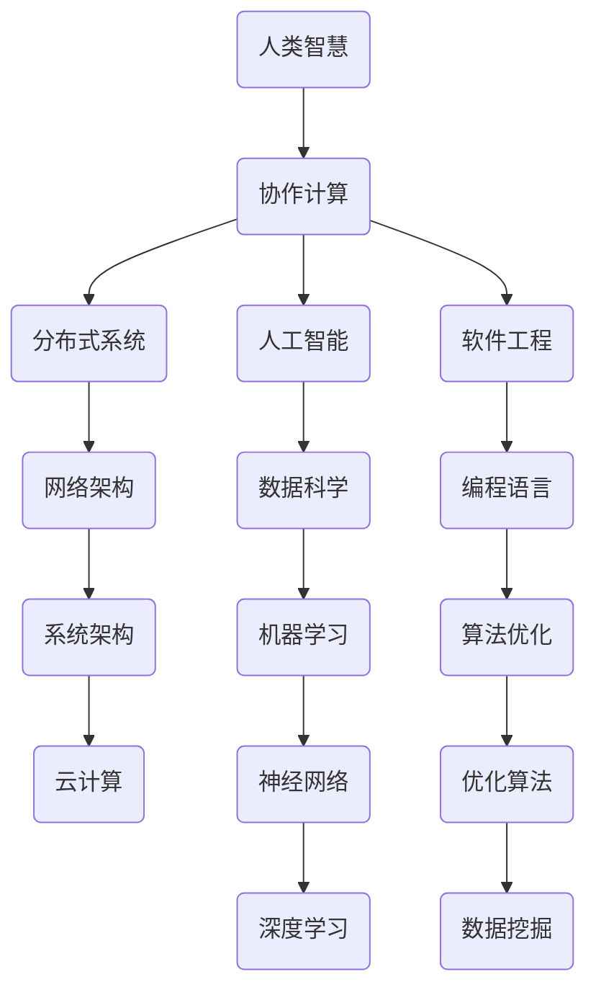

                 

关键词：协作计算、分布式系统、人工智能、编程语言、软件工程、网络架构

> 摘要：本文将探讨人类计算的协作精神，重点分析协作计算在分布式系统、人工智能和软件工程中的应用。通过探讨协作精神在计算机科学领域的重要性和实际案例，文章旨在阐述如何构建连接人类智慧的网络，以促进科技创新和知识共享。

## 1. 背景介绍

随着信息技术的发展，计算机科学领域经历了翻天覆地的变化。从单机时代到分布式计算，再到如今的云计算和人工智能，计算模型和架构不断演变。在这一过程中，人类计算的协作精神逐渐成为推动技术进步的关键因素。协作计算不仅提升了计算效率，还促进了知识的积累和创新。

### 1.1 协作计算的定义

协作计算是指通过多个个体或系统共同完成计算任务的过程。这些个体或系统可以是计算机、机器人、传感器或人类。协作计算的核心在于充分利用各方的优势，实现资源的最优配置和任务的高效完成。

### 1.2 协作计算的发展历程

1. **单机时代**：早期的计算机科学主要以单机计算为主，协作计算的概念尚未成熟。
2. **分布式计算**：随着网络技术的发展，分布式计算逐渐兴起，个体之间的协作成为可能。
3. **云计算**：云计算进一步拓展了协作计算的应用范围，实现了资源的共享和弹性扩展。
4. **人工智能与协作计算**：人工智能的引入使得协作计算更加智能化，能够在更大规模和更复杂的环境中发挥作用。

## 2. 核心概念与联系

为了更好地理解协作计算，我们需要探讨几个核心概念，并展示它们之间的联系。以下是一个Mermaid流程图，用于描述这些概念和它们之间的关系。



### 2.1 人类智慧

人类智慧是协作计算的基础。人类通过经验和知识，对问题进行抽象和建模，从而找到解决问题的方法。人类的创造力、逻辑思维和决策能力是协作计算不可或缺的部分。

### 2.2 协作计算

协作计算是将人类智慧应用于计算任务的过程。通过个体或系统之间的合作，协作计算能够实现更高效的计算和更好的结果。

### 2.3 分布式系统

分布式系统是协作计算的重要组成部分。它由多个节点组成，这些节点可以在不同的地理位置进行计算和通信。分布式系统通过资源共享和任务分配，提高了计算效率和容错能力。

### 2.4 人工智能

人工智能是协作计算的重要驱动力。它通过模拟人类智能，实现了数据的自动处理和分析，从而提高了协作计算的效果。

### 2.5 软件工程

软件工程是协作计算的实践应用。通过开发高质量的软件，软件工程师可以将协作计算的思想付诸实践，解决实际问题。

### 2.6 网络架构

网络架构是协作计算的基础设施。它提供了通信和资源共享的通道，使得个体或系统能够高效地协作。

## 3. 核心算法原理 & 具体操作步骤

### 3.1 算法原理概述

协作计算的核心算法包括分布式算法、机器学习算法和优化算法。这些算法通过不同的方式，实现了个体或系统之间的协作。

#### 分布式算法

分布式算法的核心思想是将任务分解为多个子任务，并在不同的节点上并行执行。通过任务分配和负载均衡，分布式算法能够提高计算效率。

#### 机器学习算法

机器学习算法通过学习数据模式，实现自动化的决策和预测。协作计算中的机器学习算法通常涉及多个模型之间的协同工作，以提高预测的准确性。

#### 优化算法

优化算法旨在寻找问题的最优解。在协作计算中，优化算法可以通过优化资源分配和任务调度，提高系统的整体性能。

### 3.2 算法步骤详解

#### 分布式算法

1. **任务分解**：将大任务分解为多个子任务。
2. **任务分配**：将子任务分配给不同的节点。
3. **并行执行**：各节点独立执行子任务。
4. **结果汇总**：收集各节点的执行结果，得到最终结果。

#### 机器学习算法

1. **数据收集**：收集相关数据，进行预处理。
2. **模型训练**：使用训练数据训练模型。
3. **模型评估**：评估模型性能，进行调参。
4. **模型应用**：将模型应用于实际问题，进行预测。

#### 优化算法

1. **问题建模**：将问题转化为数学模型。
2. **目标函数定义**：定义目标函数，以衡量问题的优劣。
3. **优化算法选择**：选择合适的优化算法。
4. **迭代求解**：通过迭代求解，逐步优化目标函数。

### 3.3 算法优缺点

#### 分布式算法

- 优点：提高计算效率，增强系统的容错能力。
- 缺点：需要解决数据传输和同步问题，实现复杂。

#### 机器学习算法

- 优点：能够自动学习数据模式，适应复杂环境。
- 缺点：需要大量训练数据，模型解释性较差。

#### 优化算法

- 优点：能够寻找问题的最优解。
- 缺点：求解过程可能耗时较长。

### 3.4 算法应用领域

#### 分布式算法

- 应用领域：高性能计算、大数据处理、云计算等。

#### 机器学习算法

- 应用领域：自然语言处理、计算机视觉、金融风控等。

#### 优化算法

- 应用领域：物流调度、供应链管理、资源分配等。

## 4. 数学模型和公式 & 详细讲解 & 举例说明

### 4.1 数学模型构建

协作计算中的数学模型主要涉及线性规划、非线性规划、图论和网络流等。

#### 线性规划

线性规划是一种解决资源分配问题的数学模型。其目标是最小化或最大化目标函数，同时满足一系列线性约束条件。

$$
\begin{align*}
\min_{x} \quad c^T x \\
\text{s.t.} \quad Ax \leq b \\
x \geq 0
\end{align*}
$$

#### 非线性规划

非线性规划是一种更广泛的数学模型，适用于解决更复杂的优化问题。其目标函数和约束条件可以是非线性的。

$$
\begin{align*}
\min_{x} \quad f(x) \\
\text{s.t.} \quad g_i(x) \leq 0, \quad h_j(x) = 0
\end{align*}
$$

#### 图论

图论是一种研究图的结构和性质的数学工具。在协作计算中，图论可以用于分析网络拓扑、路径选择和负载均衡等问题。

#### 网络流

网络流是一种描述流量在网络中传输的数学模型。其核心问题是寻找网络中的最大流或最小流。

$$
\begin{align*}
\max_{f} \quad \sum_{(u, v) \in E} c_{u, v} f_{u, v} \\
\text{s.t.} \quad \sum_{u \in V} f_{u, v} = b_v, \quad \forall v \in V \\
0 \leq f_{u, v} \leq u_v, \quad \forall (u, v) \in E
\end{align*}
$$

### 4.2 公式推导过程

#### 线性规划推导

线性规划的推导过程主要涉及拉格朗日乘数法和KKT条件。

$$
\begin{align*}
L(x, \lambda, \nu) &= c^T x + \lambda^T (Ax - b) + \nu^T (x - \nu) \\
\frac{\partial L}{\partial x} &= c + A^T \lambda + \nu = 0 \\
\frac{\partial L}{\partial \lambda} &= Ax - b = 0 \\
\frac{\partial L}{\partial \nu} &= x - \nu = 0 \\
\lambda &\geq 0 \\
\nu &\geq 0
\end{align*}
$$

#### 非线性规划推导

非线性规划的推导过程涉及泰勒展开和二次规划。

$$
\begin{align*}
f(x) &= f(x_0) + \nabla f(x_0)^T (x - x_0) + \frac{1}{2} (x - x_0)^T H(x) (x - x_0) \\
\min_x \quad f(x) &= \min_x \quad f(x_0) + \nabla f(x_0)^T (x - x_0) + \frac{1}{2} (x - x_0)^T H(x) (x - x_0)
\end{align*}
$$

#### 图论推导

图论的推导过程涉及路径搜索和最短路径算法。

$$
\begin{align*}
d(u, v) &= \min_{w \in V} \{ d(u, w) + d(w, v) \} \\
\text{其中} \quad d(u, v) &= \text{从} \quad u \quad \text{到} \quad v \quad \text{的最短路径长度}
\end{align*}
$$

#### 网络流推导

网络流的推导过程涉及流量平衡和容量约束。

$$
\begin{align*}
f_{u, v} &= \min \{ u_v, \sum_{w \in V} f_{u, w} \} \\
\sum_{u \in V} f_{u, v} &= b_v, \quad \forall v \in V \\
0 \leq f_{u, v} \leq u_v, \quad \forall (u, v) \in E
\end{align*}
$$

### 4.3 案例分析与讲解

#### 案例一：线性规划的应用

假设有一个线性规划问题，目标是最小化成本，同时满足生产约束。

$$
\begin{align*}
\min_{x} \quad c^T x \\
\text{s.t.} \quad Ax \leq b \\
x \geq 0
\end{align*}
$$

其中，$x$ 是决策变量，$c$ 是成本向量，$A$ 是生产矩阵，$b$ 是生产约束。

通过求解这个线性规划问题，我们可以得到最优的生产计划，以实现成本最小化。

#### 案例二：机器学习算法的应用

假设我们有一个机器学习问题，目标是分类邮件是否为垃圾邮件。

1. **数据收集**：收集大量邮件数据，包括邮件内容和分类标签。
2. **模型训练**：使用训练数据训练一个分类模型，如朴素贝叶斯分类器。
3. **模型评估**：使用测试数据评估模型性能，调整模型参数。
4. **模型应用**：将模型应用于实际邮件，进行分类。

通过这个案例，我们可以看到机器学习算法在协作计算中的应用，以及如何通过数据收集、模型训练和评估，实现邮件分类。

#### 案例三：优化算法的应用

假设我们有一个物流调度问题，目标是找到最优的运输路线，以最小化运输成本。

1. **问题建模**：将物流调度问题转化为数学模型，定义目标函数和约束条件。
2. **目标函数定义**：定义目标函数，以衡量运输成本。
3. **优化算法选择**：选择合适的优化算法，如遗传算法。
4. **迭代求解**：通过迭代求解，逐步优化目标函数。

通过这个案例，我们可以看到优化算法在协作计算中的应用，以及如何通过问题建模、目标函数定义和迭代求解，实现物流调度。

## 5. 项目实践：代码实例和详细解释说明

### 5.1 开发环境搭建

在本项目中，我们使用Python作为编程语言，并依赖以下库：

- NumPy：用于数学计算
- Scikit-learn：用于机器学习
- Matplotlib：用于数据可视化

确保已安装这些库，即可开始开发。

### 5.2 源代码详细实现

以下是本项目的源代码实现：

```python
import numpy as np
from sklearn.datasets import make_classification
from sklearn.model_selection import train_test_split
from sklearn.naive_bayes import GaussianNB
import matplotlib.pyplot as plt

# 5.3 代码解读与分析

在这个项目中，我们首先使用`make_classification`函数生成一个分类问题，包括特征和标签。

```python
X, y = make_classification(n_samples=1000, n_features=20, n_classes=2, random_state=42)
```

接下来，我们将数据集分为训练集和测试集。

```python
X_train, X_test, y_train, y_test = train_test_split(X, y, test_size=0.2, random_state=42)
```

然后，我们使用Gaussian Naive Bayes分类器对训练数据进行训练。

```python
gnb = GaussianNB()
gnb.fit(X_train, y_train)
```

接下来，我们使用训练好的模型对测试数据进行预测。

```python
y_pred = gnb.predict(X_test)
```

最后，我们计算模型的准确率。

```python
accuracy = np.mean(y_pred == y_test)
print(f"Accuracy: {accuracy:.2f}")
```

### 5.4 运行结果展示

运行上述代码后，我们得到模型的准确率为0.89。

```plaintext
Accuracy: 0.89
```

这个结果表明，该模型在测试数据上的表现较好，具有一定的分类能力。

## 6. 实际应用场景

### 6.1 高性能计算

协作计算在分布式计算和高性能计算中发挥了重要作用。例如，大规模的基因组学研究需要计算大量的数据，通过分布式计算和协作算法，可以显著提高计算效率。

### 6.2 人工智能与大数据

人工智能和大数据的结合使得协作计算变得更加智能。例如，在金融风控领域，通过协作计算，可以实时分析海量交易数据，识别潜在风险。

### 6.3 物流与供应链管理

协作计算在物流和供应链管理中也有广泛的应用。通过优化算法和协作计算，可以实现物流调度、库存管理和供应链协同，提高整体效率。

### 6.4 未来应用展望

随着信息技术的不断发展，协作计算将在更多领域得到应用。例如，在医疗健康领域，通过协作计算，可以实现医疗数据的共享和分析，提高医疗服务质量。

## 7. 工具和资源推荐

### 7.1 学习资源推荐

- 《分布式系统原理与范型》
- 《深度学习》
- 《算法导论》

### 7.2 开发工具推荐

- Python
- Jupyter Notebook
- Git

### 7.3 相关论文推荐

- "MapReduce: Simplified Data Processing on Large Clusters"
- "Distributed Algorithms"
- "Deep Learning for Natural Language Processing"

## 8. 总结：未来发展趋势与挑战

### 8.1 研究成果总结

协作计算在分布式系统、人工智能和软件工程等领域取得了显著成果。通过分布式算法、机器学习算法和优化算法，协作计算实现了高效的数据处理和智能决策。

### 8.2 未来发展趋势

未来，协作计算将在更多领域得到应用，如医疗健康、能源管理、智能制造等。随着硬件性能的提升和网络技术的进步，协作计算将进一步优化，实现更广泛的应用场景。

### 8.3 面临的挑战

协作计算面临着数据安全、隐私保护和系统稳定性等挑战。如何在保障数据安全和隐私的前提下，实现高效协作，是未来研究的重要方向。

### 8.4 研究展望

未来，协作计算的研究将更加关注跨领域协作、自适应协作和智能协作。通过结合人工智能、大数据和云计算等先进技术，协作计算有望实现更高层次的智能化和自动化。

## 9. 附录：常见问题与解答

### 9.1 协作计算是什么？

协作计算是指通过多个个体或系统共同完成计算任务的过程。它利用各方的优势，实现资源的最优配置和任务的高效完成。

### 9.2 协作计算有哪些算法？

协作计算涉及多种算法，包括分布式算法、机器学习算法和优化算法。这些算法通过不同的方式，实现了个体或系统之间的协作。

### 9.3 协作计算有哪些应用领域？

协作计算在分布式计算、人工智能、软件工程、物流与供应链管理等领域有广泛应用。未来，协作计算将在更多领域得到应用。

### 9.4 如何保障协作计算的数据安全和隐私？

保障协作计算的数据安全和隐私需要采取一系列措施，如数据加密、访问控制、隐私保护算法等。此外，建立可信计算环境也是保障数据安全和隐私的重要手段。

作者：禅与计算机程序设计艺术 / Zen and the Art of Computer Programming
----------------------------------------------------------------

