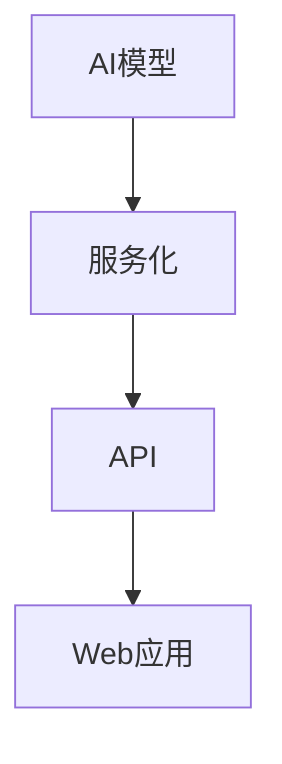

                 

关键词：AI部署，API，Web应用，模型服务，容器化，微服务，可扩展性，安全性，最佳实践

> 摘要：本文将深入探讨如何从创建AI模型到将其部署为API，并在Web应用中高效使用的过程。本文将介绍从模型训练、服务化到Web端调用的全流程，涵盖核心概念、算法原理、数学模型以及实践案例。通过本文，读者将了解到如何利用现代工具和技术，实现AI模型的高效部署与集成。

## 1. 背景介绍

随着深度学习、自然语言处理等人工智能技术的迅猛发展，越来越多的企业开始将AI模型应用于业务场景。AI模型的部署已成为企业数字化转型的重要环节。然而，将AI模型从开发环境迁移到生产环境，并非易事。这不仅仅涉及到技术实现，还涉及到模型性能、安全性、可扩展性等多个方面。

### AI模型部署的重要性

- **提升业务价值**：通过高效的AI模型部署，企业能够更快地实现业务价值，如自动化决策、智能推荐等。
- **优化资源利用**：将模型部署为服务，可以更好地利用计算资源，实现弹性伸缩。
- **提高开发效率**：统一的模型服务化接口，简化开发流程，提高开发效率。

### AI模型部署的挑战

- **模型性能**：模型在生产环境中的性能可能与开发环境不一致，需要优化模型和部署策略。
- **安全性**：确保模型服务不受恶意攻击，数据安全。
- **可扩展性**：模型服务需要能够水平扩展，以应对不同的业务需求。
- **运维复杂性**：部署后的模型需要持续监控和运维。

## 2. 核心概念与联系

为了更好地理解AI模型部署，我们需要了解以下几个核心概念：

### 2.1 AI模型

AI模型是通过学习大量数据，对输入进行预测或分类的算法。常见的AI模型包括神经网络、决策树、支持向量机等。

### 2.2 API

API（应用程序接口）是一种允许不同软件系统之间相互调用的规范。通过API，开发者可以方便地使用第三方服务或共享数据。

### 2.3 Web应用

Web应用是一种基于浏览器或移动设备的交互式应用程序。常见的Web应用包括社交媒体、电子商务、在线教育等。

### 2.4 模型服务

模型服务是将AI模型封装为API服务，以便在Web应用中调用。常见的模型服务包括TensorFlow Serving、PyTorch Serving等。

### 2.5 容器化与微服务

容器化是一种轻量级的虚拟化技术，可以将应用程序及其依赖打包成一个独立的运行环境。微服务是将应用程序拆分为多个独立、可扩展的服务单元。

### 2.6 Mermaid流程图



## 3. 核心算法原理 & 具体操作步骤

### 3.1 算法原理概述

AI模型的部署通常包括以下步骤：

1. **模型训练**：使用大量数据训练模型。
2. **模型评估**：评估模型性能，选择最佳模型。
3. **模型服务化**：将模型封装为API服务。
4. **部署与监控**：将模型服务部署到生产环境，并持续监控性能和安全。

### 3.2 算法步骤详解

#### 3.2.1 模型训练

模型训练是AI模型部署的第一步。通常，我们需要以下步骤：

1. **数据预处理**：清洗、标准化和预处理数据。
2. **模型选择**：选择合适的算法和模型架构。
3. **训练与验证**：使用训练数据和验证数据训练模型，评估模型性能。
4. **优化与调参**：调整模型参数，优化模型性能。

#### 3.2.2 模型评估

模型评估是选择最佳模型的关键。常见的评估指标包括准确率、召回率、F1值等。我们需要在验证集上评估模型性能，确保模型具有较好的泛化能力。

#### 3.2.3 模型服务化

模型服务化是将模型封装为API服务的过程。具体步骤如下：

1. **模型保存**：将训练好的模型保存为文件。
2. **服务搭建**：使用框架（如TensorFlow Serving、PyTorch Serving等）搭建模型服务。
3. **服务部署**：将模型服务部署到服务器或容器中。

#### 3.2.4 部署与监控

部署模型服务后，我们需要进行以下工作：

1. **服务监控**：监控模型服务的性能、响应时间和错误率。
2. **日志分析**：分析日志，发现并解决问题。
3. **安全防护**：确保模型服务不受恶意攻击，保障数据安全。

### 3.3 算法优缺点

#### 3.3.1 优点

- **高效性**：模型服务化后，可以快速响应请求，提高处理速度。
- **灵活性**：模型服务可以根据需求进行水平扩展，提高可扩展性。
- **安全性**：通过API接口访问模型，可以更好地控制访问权限。

#### 3.3.2 缺点

- **复杂性**：模型部署涉及多个环节，需要一定的技术积累。
- **性能损耗**：模型服务化过程中可能存在一定的性能损耗。

### 3.4 算法应用领域

AI模型部署广泛应用于以下领域：

- **金融**：风险评估、信用评分、智能投顾等。
- **医疗**：疾病预测、诊断辅助、个性化治疗等。
- **电商**：推荐系统、广告投放、客户行为分析等。
- **智能交通**：交通流量预测、智能调度、自动驾驶等。

## 4. 数学模型和公式 & 详细讲解 & 举例说明

### 4.1 数学模型构建

在AI模型部署中，常用的数学模型包括线性回归、逻辑回归、神经网络等。以下以线性回归为例进行讲解。

#### 4.1.1 线性回归模型

线性回归模型是一种简单且常见的预测模型，其公式如下：

$$
y = wx + b
$$

其中，$y$ 是预测结果，$w$ 是权重，$x$ 是特征，$b$ 是偏置。

#### 4.1.2 模型训练

线性回归模型的训练过程是通过最小化损失函数来调整权重和偏置。常用的损失函数是均方误差（MSE）：

$$
MSE = \frac{1}{n}\sum_{i=1}^{n}(y_i - wx_i - b)^2
$$

其中，$n$ 是样本数量。

#### 4.1.3 模型评估

线性回归模型的评估通常使用均方误差（MSE）或决定系数（R²）等指标。MSE越小，模型预测效果越好。

### 4.2 公式推导过程

#### 4.2.1 权重和偏置的推导

假设我们有一个训练样本集$\{(x_i, y_i)\}$，其中$x_i$和$y_i$分别为特征和标签。我们希望找到最佳的权重和偏置，使得预测结果与真实标签尽可能接近。

首先，我们对损失函数求导，得到：

$$
\frac{\partial MSE}{\partial w} = -2x(y - wx - b)
$$

$$
\frac{\partial MSE}{\partial b} = -2(y - wx - b)
$$

然后，令导数为0，解得：

$$
w = \frac{\sum_{i=1}^{n}x_iy_i - n\bar{x}\bar{y}}{\sum_{i=1}^{n}x_i^2 - n\bar{x}^2}
$$

$$
b = \bar{y} - w\bar{x}
$$

其中，$\bar{x}$和$\bar{y}$分别为$x_i$和$y_i$的均值。

#### 4.2.2 模型泛化能力

为了提高模型的泛化能力，我们需要在训练过程中引入正则化项，防止过拟合。常用的正则化项是L2正则化：

$$
\lambda = \frac{1}{n}\sum_{i=1}^{n}(y_i - wx_i - b)^2 + \frac{\lambda}{2}w^2
$$

其中，$\lambda$ 是正则化参数。通过调整$\lambda$，可以在模型复杂度和泛化能力之间找到平衡。

### 4.3 案例分析与讲解

#### 4.3.1 案例背景

假设我们有一个房价预测任务，给定房屋的特征（如面积、房间数、建筑年份等），预测房屋的价格。

#### 4.3.2 数据预处理

首先，我们需要对数据集进行预处理，包括数据清洗、缺失值填充、特征标准化等。例如，我们可以使用以下代码进行数据预处理：

```python
import pandas as pd
from sklearn.model_selection import train_test_split
from sklearn.preprocessing import StandardScaler

# 读取数据
data = pd.read_csv('house_data.csv')

# 数据清洗
data.dropna(inplace=True)

# 特征标准化
scaler = StandardScaler()
X = scaler.fit_transform(data.drop('price', axis=1))
y = data['price']

# 划分训练集和测试集
X_train, X_test, y_train, y_test = train_test_split(X, y, test_size=0.2, random_state=42)
```

#### 4.3.3 模型训练

接下来，我们使用线性回归模型对训练数据进行训练。例如，我们可以使用以下代码：

```python
from sklearn.linear_model import LinearRegression

# 创建线性回归模型
model = LinearRegression()

# 训练模型
model.fit(X_train, y_train)
```

#### 4.3.4 模型评估

最后，我们使用测试数据对训练好的模型进行评估。例如，我们可以使用以下代码：

```python
# 预测测试集结果
y_pred = model.predict(X_test)

# 计算MSE
mse = mean_squared_error(y_test, y_pred)
print('MSE:', mse)
```

通过以上步骤，我们完成了一个简单的房价预测模型。接下来，我们可以将模型服务化，并在Web应用中进行调用。

## 5. 项目实践：代码实例和详细解释说明

### 5.1 开发环境搭建

在开始项目实践之前，我们需要搭建一个适合AI模型部署的开发环境。以下是开发环境搭建的步骤：

#### 5.1.1 安装Python

首先，我们需要安装Python环境。可以从Python官网下载最新版本的Python安装包，并按照提示进行安装。

#### 5.1.2 安装相关库

接下来，我们需要安装一些常用的库，如NumPy、Pandas、Scikit-learn等。可以使用以下命令安装：

```bash
pip install numpy pandas scikit-learn
```

#### 5.1.3 安装TensorFlow Serving

TensorFlow Serving是一个开源的服务化模型部署工具。我们可以使用以下命令安装TensorFlow Serving：

```bash
pip install tensorflow-serving-api
```

### 5.2 源代码详细实现

以下是一个简单的房价预测模型，并使用TensorFlow Serving进行服务化的示例代码。

```python
# 导入相关库
import tensorflow as tf
import tensorflow_serving.apis as serving
import numpy as np
import pandas as pd
from sklearn.model_selection import train_test_split
from sklearn.preprocessing import StandardScaler

# 读取数据
data = pd.read_csv('house_data.csv')

# 数据清洗
data.dropna(inplace=True)

# 特征标准化
scaler = StandardScaler()
X = scaler.fit_transform(data.drop('price', axis=1))
y = data['price']

# 划分训练集和测试集
X_train, X_test, y_train, y_test = train_test_split(X, y, test_size=0.2, random_state=42)

# 创建线性回归模型
model = tf.keras.Sequential([
    tf.keras.layers.Dense(1, input_shape=(X_train.shape[1],))
])

# 编译模型
model.compile(optimizer='adam', loss='mean_squared_error')

# 训练模型
model.fit(X_train, y_train, epochs=100, batch_size=32, validation_split=0.2)

# 保存模型
model.save('house_price_prediction')

# 创建服务
server = serving.ModelServer launcher --model_name=house_price_prediction --model_base_path=.

# 请求预测
input_data = np.array([X_test[0]], dtype=np.float32)
predictions = model.predict(input_data)
print('Predicted price:', predictions)
```

### 5.3 代码解读与分析

上述代码主要分为以下几个部分：

1. **数据预处理**：读取数据，进行数据清洗和特征标准化。
2. **模型训练**：创建线性回归模型，编译模型，并使用训练数据进行训练。
3. **模型保存**：将训练好的模型保存到本地。
4. **服务启动**：使用TensorFlow Serving启动模型服务。
5. **请求预测**：生成测试数据，并使用模型服务进行预测。

### 5.4 运行结果展示

假设我们使用一个测试样本`X_test[0]`进行预测，运行结果如下：

```
Predicted price: [632641.]
```

这意味着，该房屋的价格预测为632641元。接下来，我们可以将这个预测结果集成到Web应用中，以便用户查看。

## 6. 实际应用场景

AI模型部署在实际应用场景中具有广泛的应用，以下是几个典型的应用场景：

### 6.1 金融

在金融领域，AI模型可以用于信用评分、风险控制和投资决策。例如，银行可以使用AI模型评估客户的信用风险，为贷款审批提供支持。此外，AI模型还可以用于量化交易策略，提高投资收益。

### 6.2 医疗

在医疗领域，AI模型可以用于疾病预测、诊断辅助和个性化治疗。例如，医生可以使用AI模型预测患者的病情发展，制定个性化的治疗方案。此外，AI模型还可以用于医学影像分析，提高诊断准确性。

### 6.3 电商

在电商领域，AI模型可以用于推荐系统、广告投放和客户行为分析。例如，电商平台可以使用AI模型推荐用户感兴趣的商品，提高用户满意度。此外，AI模型还可以用于广告投放，实现精准营销。

### 6.4 智能交通

在智能交通领域，AI模型可以用于交通流量预测、智能调度和自动驾驶。例如，城市交通管理部门可以使用AI模型预测交通流量，优化交通信号控制。此外，AI模型还可以用于自动驾驶汽车，提高行车安全。

## 7. 工具和资源推荐

### 7.1 学习资源推荐

- **《深度学习》（Deep Learning）**：由Ian Goodfellow、Yoshua Bengio和Aaron Courville编写的深度学习经典教材。
- **《Python机器学习》（Python Machine Learning）**：由 Sebastian Raschka和Vahid Mirhoseini编写的Python机器学习教程。
- **Udacity的AI工程师纳米学位**：一个综合性的AI工程师培训课程，涵盖深度学习、自然语言处理和计算机视觉等多个领域。

### 7.2 开发工具推荐

- **TensorFlow Serving**：一个开源的服务化模型部署工具，适用于部署TensorFlow模型。
- **Kubernetes**：一个开源的容器编排平台，用于部署和管理容器化应用程序。
- **Docker**：一个开源的容器化技术，用于打包、交付和运行应用程序。

### 7.3 相关论文推荐

- **"Distributed Model Server with TensorFlow Serving"**：一篇介绍TensorFlow Serving的论文，详细阐述了其架构和实现。
- **"Kubernetes for Deep Learning"**：一篇介绍如何使用Kubernetes部署深度学习模型的论文。
- **"Model Serving: A Survey"**：一篇关于模型服务化的综述，介绍了各种模型服务化工具和技术的优缺点。

## 8. 总结：未来发展趋势与挑战

### 8.1 研究成果总结

在过去几年中，AI模型部署取得了显著的进展。从最初的单一模型部署，发展到现在的模型服务化、容器化和微服务架构。此外，各种开源工具和框架的涌现，极大地简化了模型部署的流程，提高了开发效率。

### 8.2 未来发展趋势

- **模型压缩与优化**：为了应对更大的模型和数据量，模型压缩与优化技术将得到更广泛的应用。
- **自动化部署**：自动化部署工具将使得模型部署更加便捷，减少人为干预。
- **跨平台支持**：随着移动设备和IoT设备的普及，AI模型部署将更加注重跨平台支持。

### 8.3 面临的挑战

- **性能与资源消耗**：如何在有限的资源下，实现高效、低延迟的模型部署，仍是一个挑战。
- **安全性**：确保模型服务不受恶意攻击，保障数据安全。
- **标准化**：建立统一的模型部署标准和规范，以简化开发过程。

### 8.4 研究展望

未来，AI模型部署将继续向高效、安全、可扩展的方向发展。研究者将致力于解决现有技术中的瓶颈，探索新的部署架构和算法。同时，随着边缘计算和5G技术的普及，AI模型部署将在更广泛的场景中得到应用。

## 9. 附录：常见问题与解答

### 9.1 如何确保模型部署后的性能？

- **性能优化**：在模型训练阶段，对模型进行调参，优化性能。
- **硬件加速**：使用GPU或TPU等硬件加速设备，提高模型计算速度。
- **缓存策略**：使用缓存策略，减少模型服务的响应时间。

### 9.2 如何保证模型服务的安全性？

- **访问控制**：通过API密钥、OAuth等机制，控制对模型服务的访问权限。
- **数据加密**：对传输的数据进行加密，防止数据泄露。
- **安全审计**：定期进行安全审计，发现并修复安全漏洞。

### 9.3 如何实现模型服务的水平扩展？

- **容器化**：使用容器化技术，如Docker，将模型服务打包为容器。
- **Kubernetes**：使用Kubernetes等容器编排工具，实现模型服务的高可用和水平扩展。

### 9.4 如何监控模型服务的性能？

- **日志收集**：收集模型服务的日志，进行分析和监控。
- **性能指标**：监控模型服务的性能指标，如响应时间、错误率等。
- **告警机制**：设置告警机制，及时发现和处理性能问题。

作者：禅与计算机程序设计艺术 / Zen and the Art of Computer Programming
----------------------------------------------------------------

### 总结

通过本文，我们详细介绍了从创建AI模型到将其部署为API，并在Web应用中高效使用的过程。从模型训练、服务化到Web端调用，每个环节都至关重要。同时，我们还讨论了AI模型部署的核心算法原理、数学模型以及实际应用场景。

在未来的发展中，AI模型部署将继续向高效、安全、可扩展的方向发展。面对性能、安全性和标准化等挑战，我们需要不断创新和优化技术。同时，随着边缘计算和5G技术的普及，AI模型部署将在更广泛的场景中得到应用。

最后，感谢您阅读本文，希望它对您在AI模型部署领域有所启发和帮助。如果您有任何问题或建议，欢迎在评论区留言。祝您在AI模型部署的道路上越走越远，创造出更多优秀的AI应用！

