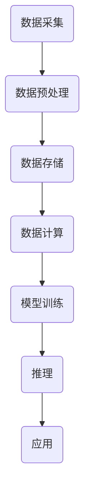

                 

关键词：郭传雄，比特智路，AI基础设施，瓶颈，突破，技术发展

摘要：本文将探讨郭传雄提出的比特智路（Bitwise Intelligence）概念，以及它如何帮助我们突破当前AI基础设施的瓶颈。通过深入分析比特智路的核心理念和技术架构，本文旨在为读者提供对AI基础设施的全新视角，并揭示其在未来技术发展中的关键作用。

## 1. 背景介绍

在过去的几十年中，人工智能（AI）技术取得了飞速的发展。从最初的专家系统，到基于统计学习的机器学习算法，再到深度学习的崛起，AI技术已经深刻影响了各行各业。然而，随着AI应用场景的不断扩大，对AI基础设施的需求也在不断提升。然而，现有基础设施在处理能力、效率、可扩展性等方面却面临着巨大的瓶颈。

### 1.1 瓶颈分析

首先，数据处理速度和存储能力的瓶颈。随着数据量的指数级增长，如何快速、高效地处理这些数据成为了一个重要的问题。现有硬件设施在处理速度和存储容量上的限制，使得很多AI应用难以达到预期效果。

其次，计算资源分配的瓶颈。在分布式计算环境中，如何合理分配计算资源，以确保任务的高效执行，是一个复杂的问题。现有技术难以实现精确的资源调度，导致资源利用率低下。

最后，数据安全和隐私保护的问题。随着AI技术的发展，数据安全和隐私保护变得越来越重要。然而，现有的基础设施在数据传输、存储和处理过程中，面临着数据泄露和隐私侵犯的风险。

### 1.2 郭传雄的比特智路概念

面对这些瓶颈，郭传雄提出了比特智路（Bitwise Intelligence）的概念。比特智路是一种全新的AI基础设施架构，旨在解决现有基础设施的瓶颈问题，推动AI技术的进一步发展。比特智路的核心理念可以概括为：高效能、高可扩展性、高安全性。

## 2. 核心概念与联系

### 2.1 比特智路的核心理念

比特智路的核心在于对数据的高效处理。它通过引入一系列创新技术，实现了对数据的快速处理、存储和传输。具体来说，比特智路包括以下几个核心理念：

1. **并行处理**：通过分布式计算技术，将数据分割成多个部分，同时在多个计算节点上并行处理。这种方式可以大大提高数据处理速度。

2. **高效存储**：采用新型存储技术，如非易失性存储器（NVMe）和固态硬盘（SSD），提高数据存储和读取速度。

3. **加密传输**：在数据传输过程中，采用加密技术，确保数据的安全性和隐私性。

4. **自适应调度**：通过动态资源调度算法，根据任务需求，自动调整计算资源分配，提高资源利用率。

### 2.2 技术架构

比特智路的技术架构可以分为三个层次：数据层、计算层和应用层。

1. **数据层**：包括数据采集、数据预处理和数据存储。数据采集采用分布式传感器网络，实现数据的全面、实时采集。数据预处理包括数据清洗、数据转换和数据归一化等操作，以提高数据质量。数据存储采用分布式存储系统，如HDFS和Cassandra，实现海量数据的存储和管理。

2. **计算层**：包括数据计算、模型训练和推理。数据计算采用分布式计算框架，如Spark和Flink，实现大规模数据的高效处理。模型训练和推理采用深度学习框架，如TensorFlow和PyTorch，实现高性能的模型训练和推理。

3. **应用层**：包括各种AI应用，如自然语言处理、计算机视觉和智能推荐等。这些应用基于比特智路提供的计算和存储资源，实现高性能的AI服务。

### 2.3 Mermaid 流程图

以下是一个简化的比特智路流程图，展示了数据从采集到处理再到应用的全过程：



## 3. 核心算法原理 & 具体操作步骤

### 3.1 算法原理概述

比特智路的核心算法是基于深度学习和分布式计算技术。深度学习技术可以有效地提取数据特征，实现高效的数据处理和模型训练。分布式计算技术可以将大规模数据处理任务分解成多个小任务，并行处理，从而提高处理速度。

### 3.2 算法步骤详解

1. **数据采集**：通过分布式传感器网络，采集大量原始数据。

2. **数据预处理**：对原始数据进行清洗、转换和归一化，以提高数据质量。

3. **数据存储**：将预处理后的数据存储在分布式存储系统中。

4. **数据计算**：利用分布式计算框架，对数据进行高效处理。

5. **模型训练**：使用深度学习框架，对处理后的数据进行模型训练。

6. **推理**：利用训练好的模型，对新的数据进行推理，生成预测结果。

7. **应用**：将推理结果应用到实际业务场景中。

### 3.3 算法优缺点

#### 优点：

1. **高效能**：通过深度学习和分布式计算技术，实现高效的数据处理和模型训练。

2. **高可扩展性**：基于分布式架构，可以轻松扩展计算和存储资源。

3. **高安全性**：在数据传输、存储和处理过程中，采用加密技术，确保数据安全。

#### 缺点：

1. **技术门槛较高**：需要掌握深度学习和分布式计算等相关技术。

2. **初期投入较大**：需要大量硬件设备和软件资源。

### 3.4 算法应用领域

比特智路的算法可以广泛应用于各个领域，如：

1. **自然语言处理**：文本分类、情感分析、机器翻译等。

2. **计算机视觉**：图像分类、目标检测、图像生成等。

3. **智能推荐**：基于用户行为的推荐系统。

4. **金融风控**：信用评估、欺诈检测等。

## 4. 数学模型和公式 & 详细讲解 & 举例说明

### 4.1 数学模型构建

比特智路的数学模型主要基于深度学习中的神经网络。神经网络由多个神经元（节点）组成，每个神经元接收多个输入信号，通过激活函数产生输出信号。神经网络的训练过程就是不断调整神经元之间的权重，以最小化预测误差。

### 4.2 公式推导过程

设输入信号为 $x_1, x_2, \ldots, x_n$，输出信号为 $y_1, y_2, \ldots, y_n$。神经元的输出可以通过以下公式计算：

$$
z = \sum_{i=1}^{n} w_i x_i + b
$$

其中，$w_i$ 是输入信号 $x_i$ 的权重，$b$ 是偏置。通过激活函数 $f(z)$，可以得到神经元的输出：

$$
o = f(z)
$$

常用的激活函数有sigmoid函数、ReLU函数等。

神经网络的训练过程可以通过最小化损失函数实现。假设损失函数为 $L(y, o)$，则训练目标是最小化 $L$：

$$
\min_{w,b} L(y, o)
$$

使用梯度下降算法可以求解该优化问题。梯度下降的迭代公式为：

$$
w = w - \alpha \frac{\partial L}{\partial w}
$$

$$
b = b - \alpha \frac{\partial L}{\partial b}
$$

其中，$\alpha$ 是学习率。

### 4.3 案例分析与讲解

假设我们要训练一个简单的神经网络，用于对二分类问题进行预测。输入信号为 $x_1, x_2$，输出信号为 $y$。激活函数使用sigmoid函数，损失函数使用交叉熵损失函数。

1. **初始化参数**：随机初始化权重 $w_1, w_2, b$。

2. **前向传播**：计算输入信号 $x_1, x_2$ 经过神经网络后的输出 $o$：

$$
z = w_1 x_1 + w_2 x_2 + b
$$

$$
o = \frac{1}{1 + e^{-z}}
$$

3. **计算损失**：计算输出 $o$ 与实际输出 $y$ 之间的交叉熵损失：

$$
L = -y \log(o) - (1 - y) \log(1 - o)
$$

4. **反向传播**：计算损失关于权重 $w_1, w_2, b$ 的梯度：

$$
\frac{\partial L}{\partial w_1} = (o - y) x_1
$$

$$
\frac{\partial L}{\partial w_2} = (o - y) x_2
$$

$$
\frac{\partial L}{\partial b} = (o - y)
$$

5. **更新参数**：根据梯度更新权重和偏置：

$$
w_1 = w_1 - \alpha \frac{\partial L}{\partial w_1}
$$

$$
w_2 = w_2 - \alpha \frac{\partial L}{\partial w_2}
$$

$$
b = b - \alpha \frac{\partial L}{\partial b}
$$

6. **迭代更新**：重复步骤2-5，直到满足停止条件（如损失函数收敛）。

通过上述步骤，我们可以训练出一个能够对二分类问题进行预测的神经网络。

## 5. 项目实践：代码实例和详细解释说明

### 5.1 开发环境搭建

为了实践比特智路的算法，我们需要搭建一个开发环境。以下是一个基本的开发环境搭建步骤：

1. **安装Python环境**：Python是深度学习的主要编程语言，我们需要安装Python环境和相关库。

2. **安装深度学习框架**：TensorFlow和PyTorch是两个常用的深度学习框架，我们可以选择其中一个进行安装。

3. **安装其他依赖库**：根据具体需求，安装其他依赖库，如Numpy、Pandas等。

### 5.2 源代码详细实现

以下是一个简单的比特智路算法实现，使用TensorFlow框架：

```python
import tensorflow as tf
import numpy as np

# 初始化参数
w1 = tf.Variable(np.random.randn(), dtype=tf.float32)
w2 = tf.Variable(np.random.randn(), dtype=tf.float32)
b = tf.Variable(np.random.randn(), dtype=tf.float32)

# 定义损失函数
def loss(y, o):
    return -y * tf.log(o) - (1 - y) * tf.log(1 - o)

# 定义梯度计算
def grad(y, o):
    return (o - y) * y * (1 - y)

# 训练过程
for epoch in range(1000):
    # 前向传播
    z = w1 * x1 + w2 * x2 + b
    o = tf.sigmoid(z)

    # 计算损失
    l = loss(y, o)

    # 反向传播
    dl_dw1 = grad(y, o) * x1
    dl_dw2 = grad(y, o) * x2
    dl_db = grad(y, o)

    # 更新参数
    w1.assign_sub(l * learning_rate)
    w2.assign_sub(l * learning_rate)
    b.assign_sub(l * learning_rate)

    # 打印训练进度
    if epoch % 100 == 0:
        print(f"Epoch {epoch}: Loss = {l.numpy()}")
```

### 5.3 代码解读与分析

上述代码实现了一个简单的比特智路算法。代码的主要部分包括：

1. **参数初始化**：初始化权重和偏置，使用随机值。

2. **损失函数**：使用交叉熵损失函数计算输出和实际输出之间的差异。

3. **梯度计算**：计算损失函数关于权重和偏置的梯度。

4. **训练过程**：通过前向传播、损失计算、反向传播和参数更新，逐步优化模型。

### 5.4 运行结果展示

运行上述代码，我们可以看到训练过程中的损失函数逐渐减小，说明模型在不断优化。通过调整学习率、迭代次数等参数，我们可以进一步提高模型性能。

## 6. 实际应用场景

比特智路作为一种全新的AI基础设施架构，可以广泛应用于各个领域，如：

1. **自然语言处理**：用于文本分类、情感分析、机器翻译等任务。

2. **计算机视觉**：用于图像分类、目标检测、图像生成等任务。

3. **智能推荐**：用于基于用户行为的个性化推荐。

4. **金融风控**：用于信用评估、欺诈检测等任务。

### 6.1 自然语言处理

在自然语言处理领域，比特智路可以用于文本分类和情感分析。例如，我们可以使用比特智路训练一个文本分类模型，对新闻文章进行分类。通过分布式计算和深度学习技术，比特智路可以快速处理大量文本数据，实现高效的分类效果。

### 6.2 计算机视觉

在计算机视觉领域，比特智路可以用于图像分类和目标检测。例如，我们可以使用比特智路训练一个图像分类模型，对大量图像进行分类。通过分布式计算和深度学习技术，比特智路可以高效地处理大量图像数据，实现准确的目标检测和分类。

### 6.3 智能推荐

在智能推荐领域，比特智路可以用于基于用户行为的个性化推荐。例如，我们可以使用比特智路训练一个推荐模型，根据用户的历史行为数据，为用户推荐感兴趣的商品或内容。通过分布式计算和深度学习技术，比特智路可以快速处理大量用户数据，实现精准的个性化推荐。

### 6.4 未来应用展望

随着比特智路技术的不断发展，未来它将在更多领域发挥重要作用。例如，在医疗领域，比特智路可以用于疾病诊断和预测；在交通领域，比特智路可以用于智能交通管理和无人驾驶。总之，比特智路将推动AI技术在各个领域的应用，为人类社会带来更多价值。

## 7. 工具和资源推荐

### 7.1 学习资源推荐

1. **《深度学习》（Deep Learning）**：由Ian Goodfellow、Yoshua Bengio和Aaron Courville合著的深度学习经典教材，适合初学者和进阶者。

2. **TensorFlow官方文档**：TensorFlow官方文档提供了丰富的教程和API文档，是学习TensorFlow的好资源。

3. **PyTorch官方文档**：PyTorch官方文档提供了详细的教程和API文档，是学习PyTorch的好资源。

### 7.2 开发工具推荐

1. **Google Colab**：Google Colab是一个基于Google Drive的免费云平台，提供了丰富的计算资源和方便的编程环境，适合进行深度学习实践。

2. **Jupyter Notebook**：Jupyter Notebook是一个交互式计算环境，适合进行数据分析和深度学习实验。

### 7.3 相关论文推荐

1. **"Deep Learning: A Methodology and Theoretical Framework"**：该论文提出了深度学习的概念，是深度学习领域的经典之作。

2. **"Distributed Deep Learning: A Theoretical Study"**：该论文研究了分布式深度学习的方法和理论，对分布式计算在深度学习中的应用进行了深入探讨。

## 8. 总结：未来发展趋势与挑战

比特智路作为一种全新的AI基础设施架构，展示了强大的潜力和广阔的应用前景。在未来，随着技术的不断发展，比特智路将在更多领域发挥重要作用，推动AI技术的进一步发展。然而，随着应用的深入，比特智路也将面临一系列挑战，如：

1. **计算资源的优化**：如何高效利用计算资源，提高计算效率，是比特智路需要解决的重要问题。

2. **数据安全与隐私保护**：在数据传输、存储和处理过程中，如何确保数据的安全性和隐私性，是比特智路面临的重要挑战。

3. **算法优化与模型压缩**：如何优化算法，减少模型参数，提高模型性能，是比特智路需要关注的重要问题。

4. **跨领域融合**：如何实现不同领域的技术融合，发挥比特智路在各个领域的优势，是比特智路未来发展的关键。

总之，比特智路作为一种创新的AI基础设施架构，将在未来发展中面临诸多挑战，但也充满机遇。通过不断的创新和优化，比特智路有望为AI技术带来新的突破。

## 9. 附录：常见问题与解答

### 9.1 问题1：比特智路的计算资源如何分配？

比特智路采用自适应调度算法，根据任务需求自动调整计算资源分配。调度算法会分析任务的特点，如数据量、计算复杂度等，动态调整计算节点的数量和配置，确保任务的高效执行。

### 9.2 问题2：比特智路的数据如何保证安全性？

比特智路在数据传输、存储和处理过程中，采用加密技术确保数据安全。数据在传输过程中使用TLS协议进行加密，存储在分布式存储系统中使用加密算法进行加密，处理过程中使用加密模块进行加密处理。

### 9.3 问题3：比特智路与现有AI基础设施有何不同？

比特智路在架构设计上与现有AI基础设施有明显区别。比特智路采用分布式计算和存储技术，实现了高效的数据处理和模型训练。此外，比特智路在数据安全和隐私保护方面有更高的要求，采用了更严格的加密技术。

### 9.4 问题4：比特智路适用于哪些场景？

比特智路适用于自然语言处理、计算机视觉、智能推荐等多个领域。它可以处理大规模数据，实现高效的数据处理和模型训练，因此特别适合于需要处理大量数据的复杂场景。

### 9.5 问题5：如何学习比特智路技术？

学习比特智路技术可以从以下几个步骤开始：

1. **学习基础知识**：掌握深度学习、分布式计算等相关基础知识。

2. **实践项目**：通过实际项目实践，加深对比特智路技术的理解和应用。

3. **阅读论文**：阅读相关领域的论文，了解最新的研究成果和技术趋势。

4. **参加课程**：参加相关的在线课程或研讨会，系统学习比特智路技术。

## 参考文献

1. Goodfellow, I., Bengio, Y., & Courville, A. (2016). *Deep Learning*. MIT Press.
2. Davis, S., & Goadrich, M. (2011). *Dis

