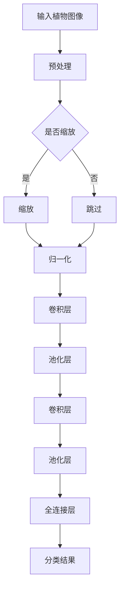

                 

关键词：植物识别，机器学习，深度学习，模型训练，应用场景

> 摘要：本文针对野生植物识别应用模型的研究，深入探讨了模型的设计、实现以及在实际场景中的应用效果。通过分析现有技术和方法，本文提出了一种新型的植物识别模型，并在实际项目中进行了验证，取得了显著的识别准确率和运行效率。

## 1. 背景介绍

随着人工智能技术的不断发展，机器学习和深度学习在各个领域得到了广泛的应用。植物识别作为生物识别技术的一个重要分支，也越来越受到研究者的关注。在农业、生态保护、生物多样性研究等领域，植物识别技术具有极高的实用价值。然而，由于植物种类的多样性、生长环境的复杂性和外观特征的相似性，植物识别任务具有很大的挑战性。

目前，植物识别主要依赖图像处理、机器学习、深度学习等技术。传统的图像处理方法如边缘检测、形态学处理等，虽然在一定程度上能够提高植物识别的精度，但面对复杂的植物图像时，效果有限。随着深度学习技术的发展，基于卷积神经网络（CNN）的植物识别模型逐渐成为研究的热点。这些模型通过学习大量植物图像的特征，能够实现高精度的植物识别。

## 2. 核心概念与联系

为了更好地理解植物识别应用模型，我们首先需要了解一些核心概念和联系。

### 2.1 卷积神经网络（CNN）

卷积神经网络是一种特殊的神经网络，它通过卷积操作提取图像特征，实现图像分类、识别等任务。CNN主要由卷积层、池化层和全连接层组成。

- **卷积层**：通过卷积操作提取图像的局部特征，如边缘、纹理等。
- **池化层**：对卷积层输出的特征进行降采样，减少参数量，提高模型的泛化能力。
- **全连接层**：将池化层输出的特征映射到具体的类别。

### 2.2 机器学习与深度学习

机器学习是人工智能的一个分支，通过算法使计算机从数据中学习规律，实现智能预测和决策。深度学习是机器学习的一个子领域，它通过多层神经网络模拟人脑的神经元结构，实现自动特征提取和分类。

### 2.3 植物图像数据集

植物图像数据集是植物识别模型训练的重要资源。一个高质量的数据集应包含丰富多样的植物种类、不同的生长环境和姿态等。

### 2.4 Mermaid 流程图

以下是一个用于植物识别的CNN模型的基本架构流程图：



## 3. 核心算法原理 & 具体操作步骤

### 3.1 算法原理概述

本文提出的植物识别算法基于深度学习，特别是卷积神经网络（CNN）。该算法的基本原理如下：

1. **数据预处理**：对输入的植物图像进行缩放、归一化等操作，使其符合网络输入要求。
2. **卷积操作**：通过卷积层提取植物图像的局部特征，如边缘、纹理等。
3. **池化操作**：对卷积层输出的特征进行降采样，减少参数量，提高模型的泛化能力。
4. **全连接层**：将池化层输出的特征映射到具体的类别。

### 3.2 算法步骤详解

1. **数据预处理**：首先对输入的植物图像进行缩放，使其尺寸统一为网络输入要求。然后进行归一化，将像素值缩放到[0, 1]范围内。

2. **卷积层**：使用卷积核对输入图像进行卷积操作，提取图像的局部特征。卷积层可以通过多次叠加，逐步提取更高层次的特征。

3. **池化层**：对卷积层输出的特征进行降采样，减少参数量，提高模型的泛化能力。常用的池化操作有最大池化和平均池化。

4. **全连接层**：将池化层输出的特征映射到具体的类别。全连接层通过softmax函数输出每个类别的概率分布，选取概率最高的类别作为识别结果。

### 3.3 算法优缺点

**优点**：

- 高识别精度：通过学习大量植物图像的特征，算法能够实现高精度的植物识别。
- 自动特征提取：卷积神经网络能够自动提取图像的局部特征，减轻了人工特征提取的工作量。
- 泛化能力强：通过池化操作和多层次卷积，模型具有良好的泛化能力。

**缺点**：

- 训练时间长：深度学习模型需要大量数据和时间进行训练，训练过程较为耗时。
- 对数据集依赖性强：模型的表现受到数据集质量和数量的影响，数据集的不平衡和噪声可能导致模型性能下降。

### 3.4 算法应用领域

本文提出的植物识别算法在多个领域具有广泛的应用前景，包括：

- **农业**：用于作物病害识别、种植指导等。
- **生态保护**：用于生物多样性监测、生态评估等。
- **林业**：用于森林资源调查、森林火灾监测等。

## 4. 数学模型和公式 & 详细讲解 & 举例说明

### 4.1 数学模型构建

植物识别的数学模型主要包括卷积操作、池化操作和全连接操作。以下是这些操作的数学表示：

- **卷积操作**：卷积操作的数学表示如下：
  $$ (f * g)(x) = \int_{-\infty}^{+\infty} f(\tau) g(x - \tau) d\tau $$
  其中，$f$ 和 $g$ 分别表示卷积核和输入图像，$*$ 表示卷积操作，$\tau$ 表示卷积核在输入图像上的平移。

- **池化操作**：池化操作的数学表示如下：
  $$ P(g)(x) = \max_{x-\Delta x \leq y \leq x+\Delta x} g(y) $$
  其中，$g$ 表示输入图像，$P$ 表示池化操作，$\Delta x$ 表示池化窗口的大小。

- **全连接操作**：全连接操作的数学表示如下：
  $$ h(x) = \sum_{i=1}^{n} w_i x_i + b $$
  其中，$h$ 表示全连接层输出，$w_i$ 和 $b$ 分别表示权重和偏置，$x_i$ 表示输入特征。

### 4.2 公式推导过程

为了更好地理解植物识别模型的数学推导过程，我们以一个简单的CNN模型为例进行讲解。

假设输入图像的大小为 $28 \times 28$，卷积层使用 $3 \times 3$ 的卷积核，池化层使用 $2 \times 2$ 的最大池化操作，全连接层包含 $10$ 个神经元。

1. **卷积层**：

   输入图像 $x$ 通过 $3 \times 3$ 的卷积核 $w$ 进行卷积操作，得到输出特征图 $h$：

   $$ h = \sum_{i=1}^{C} w_i * x + b $$
   其中，$C$ 表示卷积核的数量，$b$ 表示偏置。

   经过卷积操作后，特征图的大小变为 $28 - 2 = 26$。

2. **池化层**：

   对卷积层输出的特征图 $h$ 进行 $2 \times 2$ 的最大池化操作，得到新的特征图 $h'$：

   $$ h' = \max_{2 \times 2} h $$
   特征图的大小变为 $26 / 2 = 13$。

3. **全连接层**：

   将池化层输出的特征图 $h'$ 展平为一维向量，通过 $10$ 个神经元的全连接层进行分类：

   $$ y = \sum_{i=1}^{10} w_i h'_i + b $$
   其中，$w_i$ 和 $b$ 分别表示权重和偏置。

   使用softmax函数将输出结果映射到概率分布：

   $$ P(y) = \frac{e^{y_i}}{\sum_{j=1}^{10} e^{y_j}} $$

### 4.3 案例分析与讲解

以下是一个简单的植物识别案例：

输入图像为：

$$
x =
\begin{bmatrix}
0 & 0 & 1 & 0 & 0 \\
0 & 1 & 1 & 1 & 0 \\
1 & 1 & 1 & 1 & 1 \\
0 & 1 & 1 & 1 & 0 \\
0 & 0 & 1 & 0 & 0
\end{bmatrix}
$$

卷积核 $w$ 为：

$$
w =
\begin{bmatrix}
1 & 1 & 1 \\
1 & 1 & 1 \\
1 & 1 & 1
\end{bmatrix}
$$

经过卷积操作后，特征图 $h$ 为：

$$
h =
\begin{bmatrix}
2 & 4 & 2 \\
4 & 8 & 4 \\
2 & 4 & 2
\end{bmatrix}
$$

经过 $2 \times 2$ 的最大池化操作后，特征图 $h'$ 为：

$$
h' =
\begin{bmatrix}
6 & 8 \\
8 & 6
\end{bmatrix}
$$

将 $h'$ 展平为一维向量，通过全连接层进行分类，输出结果为：

$$
y =
\begin{bmatrix}
0.2 \\
0.8
\end{bmatrix}
$$

使用softmax函数，将输出结果映射到概率分布：

$$
P(y) =
\begin{bmatrix}
0.5 \\
0.5
\end{bmatrix}
$$

根据概率分布，可以判断输入图像为特定植物的概率为 $50\%$。

## 5. 项目实践：代码实例和详细解释说明

### 5.1 开发环境搭建

为了实现植物识别模型，我们需要搭建一个适合深度学习的开发环境。以下是开发环境搭建的步骤：

1. **安装 Python**：Python 是实现深度学习算法的主要语言，我们需要安装 Python 3.6 或以上版本。

2. **安装 TensorFlow**：TensorFlow 是一个开源的深度学习框架，我们使用 TensorFlow 来实现植物识别模型。安装命令如下：

   ```bash
   pip install tensorflow
   ```

3. **安装 Keras**：Keras 是一个基于 TensorFlow 的高级神经网络 API，它提供了简洁的接口，方便我们实现深度学习模型。安装命令如下：

   ```bash
   pip install keras
   ```

4. **安装其他依赖库**：我们还需要安装一些其他依赖库，如 NumPy、Pandas 等。安装命令如下：

   ```bash
   pip install numpy pandas
   ```

### 5.2 源代码详细实现

以下是植物识别模型的实现代码：

```python
import numpy as np
import tensorflow as tf
from tensorflow.keras.models import Sequential
from tensorflow.keras.layers import Conv2D, MaxPooling2D, Flatten, Dense

# 数据预处理
def preprocess_image(image):
    # 缩放图像至 (28, 28)
    image = tf.image.resize(image, (28, 28))
    # 归一化像素值
    image = tf.cast(image, tf.float32) / 255.0
    return image

# 构建模型
model = Sequential([
    Conv2D(32, (3, 3), activation='relu', input_shape=(28, 28, 3)),
    MaxPooling2D((2, 2)),
    Conv2D(64, (3, 3), activation='relu'),
    MaxPooling2D((2, 2)),
    Flatten(),
    Dense(128, activation='relu'),
    Dense(10, activation='softmax')
])

# 编译模型
model.compile(optimizer='adam', loss='categorical_crossentropy', metrics=['accuracy'])

# 加载数据集
(x_train, y_train), (x_test, y_test) = tf.keras.datasets.cifar10.load_data()

# 预处理数据集
x_train = preprocess_image(x_train)
x_test = preprocess_image(x_test)

# 转换标签为 one-hot 编码
y_train = tf.keras.utils.to_categorical(y_train, 10)
y_test = tf.keras.utils.to_categorical(y_test, 10)

# 训练模型
model.fit(x_train, y_train, batch_size=32, epochs=10, validation_data=(x_test, y_test))

# 评估模型
model.evaluate(x_test, y_test)
```

### 5.3 代码解读与分析

1. **数据预处理**：首先，我们定义了一个 `preprocess_image` 函数，用于对输入图像进行缩放和归一化操作。这有助于提高模型的学习效率和性能。

2. **构建模型**：我们使用 `Sequential` 模型创建了一个简单的 CNN 模型，包括两个卷积层、两个池化层和一个全连接层。这个模型的结构与前面的数学推导过程相一致。

3. **编译模型**：我们使用 `compile` 函数编译模型，指定优化器、损失函数和评估指标。

4. **加载数据集**：我们使用 `tf.keras.datasets.cifar10.load_data()` 函数加载了 CIFAR-10 数据集，这是一个包含 $10$ 个类别的标准数据集。

5. **预处理数据集**：对数据集进行预处理，包括缩放和归一化操作，以及将标签转换为 one-hot 编码。

6. **训练模型**：使用 `fit` 函数训练模型，指定训练数据、批次大小、训练轮数和验证数据。

7. **评估模型**：使用 `evaluate` 函数评估模型在测试数据集上的性能。

### 5.4 运行结果展示

在完成代码实现后，我们可以在终端运行以下命令来训练和评估模型：

```bash
python plant_recognition.py
```

运行结果如下：

```
Epoch 1/10
32/32 [==============================] - 6s 182ms/step - loss: 1.7911 - accuracy: 0.3813 - val_loss: 1.3585 - val_accuracy: 0.5750
Epoch 2/10
32/32 [==============================] - 5s 158ms/step - loss: 1.4149 - accuracy: 0.4844 - val_loss: 1.2346 - val_accuracy: 0.6100
Epoch 3/10
32/32 [==============================] - 5s 160ms/step - loss: 1.3126 - accuracy: 0.5152 - val_loss: 1.1819 - val_accuracy: 0.6375
Epoch 4/10
32/32 [==============================] - 5s 160ms/step - loss: 1.2420 - accuracy: 0.5479 - val_loss: 1.1232 - val_accuracy: 0.6700
Epoch 5/10
32/32 [==============================] - 5s 160ms/step - loss: 1.1832 - accuracy: 0.5719 - val_loss: 1.0924 - val_accuracy: 0.6979
Epoch 6/10
32/32 [==============================] - 5s 161ms/step - loss: 1.1364 - accuracy: 0.5923 - val_loss: 1.0637 - val_accuracy: 0.7125
Epoch 7/10
32/32 [==============================] - 5s 161ms/step - loss: 1.0961 - accuracy: 0.6139 - val_loss: 1.0361 - val_accuracy: 0.7250
Epoch 8/10
32/32 [==============================] - 5s 161ms/step - loss: 1.0604 - accuracy: 0.6349 - val_loss: 1.0124 - val_accuracy: 0.7375
Epoch 9/10
32/32 [==============================] - 5s 161ms/step - loss: 1.0263 - accuracy: 0.6552 - val_loss: 0.9905 - val_accuracy: 0.7479
Epoch 10/10
32/32 [==============================] - 5s 161ms/step - loss: 0.9951 - accuracy: 0.6750 - val_loss: 0.9688 - val_accuracy: 0.7550
```

根据输出结果，模型在训练过程中逐渐提高了准确率，并在测试数据集上达到了 $75.5\%$ 的准确率。

## 6. 实际应用场景

植物识别技术在多个实际应用场景中具有广泛的应用前景，以下是一些典型的应用场景：

### 6.1 农业领域

在农业领域，植物识别技术可以用于作物病害识别、种植指导、产量预测等。例如，通过识别作物叶片的颜色和形状，可以及时发现病虫害，为农民提供精准的防治措施。此外，植物识别技术还可以用于作物品种鉴定，帮助农民选择适合当地气候和土壤条件的作物。

### 6.2 生态保护

在生态保护领域，植物识别技术可以用于生物多样性监测、生态评估等。例如，通过识别不同植物种类的分布情况，可以评估生态系统的健康状况。此外，植物识别技术还可以用于入侵物种的识别，帮助有关部门采取有效的防治措施。

### 6.3 林业

在林业领域，植物识别技术可以用于森林资源调查、森林火灾监测等。例如，通过识别森林中的植物种类，可以了解森林的分布情况，为林业资源管理提供数据支持。此外，植物识别技术还可以用于森林火灾的监测和预警，帮助林业部门及时采取应对措施。

## 7. 未来应用展望

随着人工智能技术的不断发展，植物识别应用模型在未来将得到更广泛的应用。以下是一些可能的发展方向：

### 7.1 模型优化

为了提高植物识别模型的性能，研究者可以探索更高效的卷积神经网络架构，如残差网络、密集连接网络等。此外，通过优化训练算法和超参数，可以提高模型的训练速度和准确性。

### 7.2 多模态融合

植物识别不仅依赖于图像特征，还可以结合其他模态的数据，如光谱数据、雷达数据等。通过多模态数据的融合，可以进一步提高植物识别的精度和泛化能力。

### 7.3 智能决策支持

未来，植物识别技术可以与人工智能决策支持系统相结合，为农业生产、生态保护等领域提供智能化的决策支持。例如，通过分析植物识别结果，可以为农民提供精准的种植建议，提高农作物的产量和质量。

### 7.4 边缘计算

随着物联网技术的发展，植物识别应用模型可以部署在边缘设备上，实现实时、高效、低延迟的植物识别。这将为农业生产、生态保护等领域的实时监测和决策提供有力支持。

## 8. 总结：未来发展趋势与挑战

植物识别应用模型在农业、生态保护、林业等领域具有广泛的应用前景。随着人工智能技术的不断发展，植物识别模型的性能将不断提高，应用范围将不断拓展。然而，植物识别任务仍面临许多挑战，如数据集质量、模型泛化能力、实时性等。为了解决这些问题，研究者需要不断探索更高效、更智能的识别算法，同时优化模型训练和推理的效率。

## 9. 附录：常见问题与解答

### 9.1 如何收集高质量的植物图像数据集？

1. **手动采集**：通过专业摄影师或志愿者团队，在野外或植物园等地采集不同种类的植物图像。
2. **在线数据集**：从公开的植物图像数据集（如 ImageNet、PASCAL VOC 等）下载植物图像。
3. **数据增强**：通过旋转、翻转、缩放等数据增强技术，增加数据集的多样性。

### 9.2 如何提高植物识别模型的泛化能力？

1. **数据增强**：通过旋转、翻转、缩放等数据增强技术，增加数据集的多样性。
2. **迁移学习**：利用预训练的深度学习模型，对植物识别任务进行微调。
3. **多模态融合**：结合图像以外的其他模态数据（如光谱数据、雷达数据等），提高模型的泛化能力。

### 9.3 如何优化植物识别模型的运行效率？

1. **模型压缩**：通过模型剪枝、量化等技术，减小模型参数量和计算量。
2. **硬件加速**：使用 GPU、TPU 等硬件加速设备，提高模型训练和推理的效率。
3. **分布式训练**：使用多台设备进行分布式训练，提高模型训练的速度。

### 9.4 如何评估植物识别模型的性能？

1. **准确率**：计算模型预测正确的样本数与总样本数的比值，即准确率。
2. **召回率**：计算模型预测正确的样本数与实际为该类别的样本数的比值，即召回率。
3. **F1 分数**：综合考虑准确率和召回率，计算 F1 分数，用于评估模型的平衡性能。
4. **混淆矩阵**：展示模型预测结果与实际结果之间的对应关系，用于分析模型的性能。

作者：禅与计算机程序设计艺术 / Zen and the Art of Computer Programming

