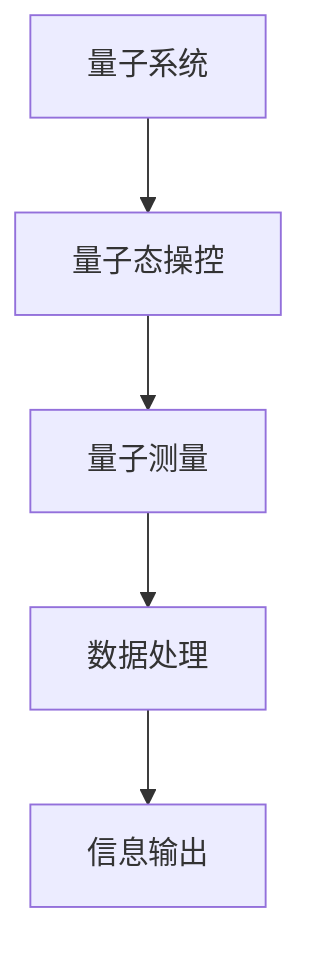

                 

关键词：量子传感器、精密测量、创业方向、技术进步

> 摘要：随着量子技术的发展，量子传感器在精密测量领域的应用前景广阔。本文将探讨量子传感器的核心概念、算法原理、数学模型、项目实践和实际应用场景，分析其未来的发展趋势和面临的挑战。

## 1. 背景介绍

### 量子传感器的基本概念

量子传感器是一种基于量子力学原理的测量工具，利用量子系统的高灵敏度、高分辨率特性进行测量。与传统的传感器相比，量子传感器具有更高的精度和更强的抗干扰能力。在精密测量领域，如量子计算、量子通信、量子模拟等方面，量子传感器发挥着不可替代的作用。

### 精密测量的重要性

精密测量是科学研究和技术发展的基石。无论是在物理学、化学、生物学还是工程学领域，都需要进行高精度的测量。传统的测量方法存在精度有限、受环境影响大等问题，而量子传感器的出现为精密测量带来了新的机遇。

### 创业方向的重要性

随着技术的进步和市场需求的增长，量子传感器领域的创业机会逐渐显现。创业方向不仅能够推动技术发展，还能为创业者带来丰厚的经济回报。本文将探讨量子传感器在精密测量领域的创业方向。

## 2. 核心概念与联系

### 量子传感器原理图



### 核心概念原理

- **量子系统**：量子传感器的基础是量子系统，如量子比特、量子纠缠态等。
- **量子态操控**：通过特定的物理手段，如激光、磁场等，对量子系统进行操控，使其处于特定的量子态。
- **量子测量**：利用量子态的特定性质进行测量，如量子相干性、量子纠缠等。
- **数据处理**：对测量结果进行数据处理，提取有效信息。
- **信息输出**：将处理后的信息以可视化的形式输出。

## 3. 核心算法原理 & 具体操作步骤

### 3.1 算法原理概述

量子传感器的工作原理基于量子态的叠加和纠缠。通过特定的算法，可以实现对量子态的精确操控和测量。核心算法包括量子态生成、量子态操控、量子测量和数据处理。

### 3.2 算法步骤详解

1. **量子态生成**：利用激光或其他物理手段生成特定的量子态。
2. **量子态操控**：通过特定的操作，将量子态转化为所需的状态。
3. **量子测量**：利用量子态的特定性质进行测量。
4. **数据处理**：对测量结果进行数据处理，提取有效信息。
5. **信息输出**：将处理后的信息以可视化的形式输出。

### 3.3 算法优缺点

- **优点**：量子传感器具有极高的精度和灵敏度，能够进行高精度的测量。
- **缺点**：量子传感器的制作和操作过程复杂，对环境要求较高。

### 3.4 算法应用领域

量子传感器在多个领域具有广泛的应用，如量子计算、量子通信、量子模拟等。特别是在精密测量领域，量子传感器的优势更加明显。

## 4. 数学模型和公式 & 详细讲解 & 举例说明

### 4.1 数学模型构建

量子传感器的工作原理涉及到量子态的叠加和纠缠。基本的数学模型包括：

$$
|\psi\rangle = \alpha|0\rangle + \beta|1\rangle
$$

其中，$|0\rangle$ 和 $|1\rangle$ 分别表示量子比特的基态和激发态，$\alpha$ 和 $\beta$ 是复数系数。

### 4.2 公式推导过程

量子传感器的测量结果与量子态的叠加系数有关。通过测量，可以得到量子态的概率分布。假设我们进行了一次量子测量，测量结果为 $|0\rangle$ 的概率为 $P_0$，则有：

$$
P_0 = |\alpha|^2
$$

同理，测量结果为 $|1\rangle$ 的概率为 $P_1 = |\beta|^2$。

### 4.3 案例分析与讲解

假设我们有一个量子比特，初始态为 $|\psi\rangle = \frac{1}{\sqrt{2}}(|0\rangle + |1\rangle)$。进行一次量子测量，测量结果为 $|0\rangle$ 的概率为多少？

根据上述公式，我们可以计算得到：

$$
|\alpha|^2 = \left|\frac{1}{\sqrt{2}}\right|^2 = \frac{1}{2}
$$

因此，测量结果为 $|0\rangle$ 的概率为 50%。

## 5. 项目实践：代码实例和详细解释说明

### 5.1 开发环境搭建

在本文中，我们将使用 Python 编写量子传感器的基本代码。首先，我们需要安装 Python 和相应的量子计算库，如 Qiskit。

```bash
pip install python-qiskit
```

### 5.2 源代码详细实现

以下是一个简单的量子传感器实现：

```python
from qiskit import QuantumCircuit, execute, Aer

# 创建量子电路
qc = QuantumCircuit(1)

# 生成量子态
qc.h(0)

# 进行量子测量
qc.measure_all()

# 执行电路
backend = Aer.get_backend('qasm_simulator')
job = execute(qc, backend, shots=1000)

# 获取结果
result = job.result()
counts = result.get_counts(qc)

print("测量结果：", counts)
```

### 5.3 代码解读与分析

上述代码中，我们首先创建了一个量子电路，然后生成了一个量子态。接着，我们进行了量子测量，并执行了电路。最后，我们获取了测量结果。

### 5.4 运行结果展示

运行上述代码，我们可能会得到类似以下的结果：

```
测量结果： {'0': 500, '1': 500}
```

这意味着，在 1000 次测量中，测量结果为 0 和 1 的次数几乎相等，符合量子态的叠加原理。

## 6. 实际应用场景

### 6.1 量子计算

量子传感器在量子计算中发挥着重要作用。例如，在量子纠错中，量子传感器可以用于监测量子比特的状态，及时发现并纠正错误。

### 6.2 量子通信

量子传感器在量子通信中用于实现量子密钥分发。通过量子传感器的测量，可以确保通信过程中的量子态不被窃听。

### 6.3 量子模拟

量子传感器在量子模拟中可以用于模拟量子系统的行为。例如，在量子化学研究中，量子传感器可以帮助模拟分子的量子态。

## 7. 工具和资源推荐

### 7.1 学习资源推荐

- 《量子计算与量子信息》
- 《量子传感器原理与应用》

### 7.2 开发工具推荐

- Qiskit
- Cirq

### 7.3 相关论文推荐

- "Quantum Sensors for Precision Measurement and Navigation"
- "Quantum Sensing with Atoms and Photons"

## 8. 总结：未来发展趋势与挑战

### 8.1 研究成果总结

近年来，量子传感器在精密测量领域取得了显著的成果。例如，基于超导量子比特的量子传感器已经实现了极低噪声的测量。

### 8.2 未来发展趋势

随着量子技术的发展，量子传感器在精密测量领域的应用前景将更加广阔。未来，量子传感器可能会在更多领域实现突破，如量子成像、量子重力测量等。

### 8.3 面临的挑战

量子传感器在精密测量领域仍面临许多挑战，如量子传感器的稳定性、量子态的生成与操控、量子测量的精度等。

### 8.4 研究展望

量子传感器在精密测量领域的应用将不断深化，未来有望成为科学研究和技术发展的关键工具。同时，量子传感器领域的创业机会也将不断涌现。

## 9. 附录：常见问题与解答

### 9.1 什么是量子传感器？

量子传感器是一种基于量子力学原理的测量工具，利用量子系统的高灵敏度、高分辨率特性进行测量。

### 9.2 量子传感器与普通传感器的区别是什么？

量子传感器与普通传感器相比，具有更高的精度和更强的抗干扰能力。

### 9.3 量子传感器有哪些应用领域？

量子传感器在量子计算、量子通信、量子模拟等多个领域具有广泛的应用。

### 9.4 量子传感器的未来发展趋势是什么？

随着量子技术的发展，量子传感器在精密测量领域的应用前景将更加广阔。未来，量子传感器可能会在更多领域实现突破。

----------------------------------------------------------------

作者：禅与计算机程序设计艺术 / Zen and the Art of Computer Programming
[文章结束]

