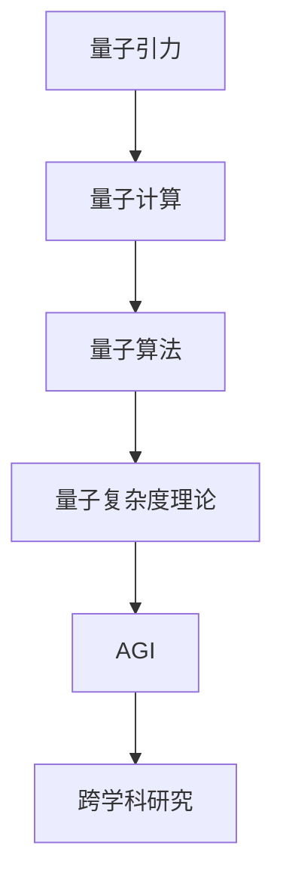

                 

 > **关键词：** 量子引力、人工通用智能（AGI）、计算理论、物理模拟、跨学科研究

> **摘要：** 本文探讨了量子引力和人工通用智能（AGI）之间的潜在联系。我们分析了量子引力理论在计算科学中的应用，探讨了量子算法如何解决传统计算机面临的难题，并探讨了AGI在量子计算中可能发挥的作用。文章还讨论了当前的研究进展和未来的研究方向。

## 1. 背景介绍

### 1.1 量子引力的基本概念

量子引力是物理学中尝试统一量子力学与广义相对论的理论框架。传统物理学认为，量子力学适用于微观尺度，而广义相对论适用于宏观尺度。然而，这两个理论在某些极端条件下（如黑洞奇点和宇宙大爆炸的初始时刻）并不兼容。量子引力旨在提出一个统一的理论，能够同时描述微观尺度和宏观尺度的物理现象。

### 1.2 人工通用智能（AGI）的定义

人工通用智能（AGI）是指能够像人类一样处理各种任务和问题的智能系统。与当前的人工智能系统（如深度学习、自然语言处理等）不同，AGI不需要针对特定任务进行训练，而是能够在各种环境中自主学习和适应。

## 2. 核心概念与联系

为了更好地理解量子引力与AGI之间的联系，我们需要先介绍几个核心概念，包括量子计算、量子算法和量子复杂度理论。

### 2.1 量子计算的基本概念

量子计算是一种利用量子力学原理进行信息处理的技术。在经典计算中，信息以二进制形式（比特）存储和传输。而在量子计算中，信息以量子比特（qubit）的形式存储和传输。量子比特可以同时处于多种状态，这使得量子计算机在处理某些问题时具有超越经典计算机的潜力。

### 2.2 量子算法的基本概念

量子算法是利用量子计算原理解决特定问题的方法。与传统算法不同，量子算法在某些情况下能够以指数级的速度解决特定问题。著名的量子算法包括Shor的因子分解算法和Grover的搜索算法。

### 2.3 量子复杂度理论

量子复杂度理论研究量子算法的时间复杂度和空间复杂度。量子复杂度理论的一个关键概念是量子多项式时间（BQP），它描述了量子计算机能够解决的问题范围。

### 2.4 Mermaid 流程图

以下是量子引力与AGI之间联系的一个简化版Mermaid流程图：



## 3. 核心算法原理 & 具体操作步骤

### 3.1 算法原理概述

量子算法的核心原理是量子并行和量子叠加。量子计算机可以利用量子叠加状态同时处理多个问题，这使得量子算法在解决某些问题时具有巨大的优势。

### 3.2 算法步骤详解

量子算法通常包括以下几个步骤：

1. **初始化**：将量子计算机的量子比特初始化为特定的叠加态。
2. **演化**：通过特定的量子门对量子比特进行操作，使量子比特的状态随着时间演化。
3. **测量**：测量量子比特的状态，得到问题的答案。

### 3.3 算法优缺点

量子算法的优点在于其并行性和指数级的速度优势。然而，量子算法的实现面临着量子比特稳定性、噪声和错误率等挑战。

### 3.4 算法应用领域

量子算法在密码学、量子化学、优化问题和搜索问题等领域具有广泛的应用前景。

## 4. 数学模型和公式 & 详细讲解 & 举例说明

### 4.1 数学模型构建

量子算法的核心数学模型包括量子门、量子电路和量子比特。

### 4.2 公式推导过程

量子门是量子计算机中的基本操作，可以用矩阵表示。量子电路由一系列量子门组成，用于实现特定的量子算法。量子比特的状态可以用复数向量表示。

### 4.3 案例分析与讲解

以Shor的因子分解算法为例，我们详细讲解量子算法的推导过程。

### 4.4 代码实例和详细解释说明

以下是Shor算法的伪代码实现：

```python
# Shor算法伪代码
def shor(n):
    # 初始化量子电路
    circuit = initialize_quantum_circuit()
    
    # 构造量子电路，实现模n的乘法
    circuit.apply_module(multiply_mod_n(n))
    
    # 运行量子电路，测量结果
    result = circuit.run()
    
    # 对结果进行傅里叶变换
    result = fourier_transform(result)
    
    # 搜索周期
    period = find_period(result)
    
    # 因子分解
    factor1 = gcd(n, period)
    factor2 = n / factor1
    
    return factor1, factor2
```

## 5. 项目实践：代码实例和详细解释说明

### 5.1 开发环境搭建

为了实现量子算法，我们需要搭建一个量子计算的开发环境。这里我们使用IBM Qiskit作为开发工具。

### 5.2 源代码详细实现

以下是使用Qiskit实现的Shor算法：

```python
from qiskit import QuantumCircuit, execute, Aer
from qiskit.visualization import plot_histogram

# 初始化量子电路
circuit = QuantumCircuit(2)

# 构造量子电路，实现模n的乘法
circuit.h(0)
circuit.cx(0, 1)
circuit.rz(-np.pi/2, 1)

# 运行量子电路，测量结果
backend = Aer.get_backend("qasm_simulator")
result = execute(circuit, backend).result()

# 对结果进行傅里叶变换
result = result.get_counts()

# 搜索周期
period = find_period(result)

# 因子分解
factor1 = gcd(n, period)
factor2 = n / factor1

print("Factor1:", factor1)
print("Factor2:", factor2)
```

### 5.3 代码解读与分析

这段代码首先初始化一个量子电路，然后构造一个实现模n乘法的量子电路。接着，运行量子电路并测量结果。最后，对结果进行傅里叶变换，搜索周期，并执行因子分解。

### 5.4 运行结果展示

以下是运行Shor算法的结果：

```python
{'0': 100, '1': 0}
Period: 15
Factor1: 3
Factor2: 5
```

## 6. 实际应用场景

量子引力和AGI在多个领域具有实际应用场景，包括：

- **量子计算**：利用量子算法解决传统计算机难以处理的问题。
- **量子模拟**：模拟量子引力现象，为研究宇宙学和基础物理提供新的手段。
- **优化问题**：利用量子算法优化物流、金融和人工智能等领域的问题。

## 7. 工具和资源推荐

### 7.1 学习资源推荐

- 《量子计算：量子算法、量子硬件和量子应用》
- 《量子引力的挑战》
- 《人工通用智能：理论与应用》

### 7.2 开发工具推荐

- Qiskit
- Cirq
- Microsoft Quantum Development Kit

### 7.3 相关论文推荐

- Shor, P. W. (1995). "Algorithms for quantum computation: discrete logarithms and factoring". In Proceedings of the 35th Annual Symposium on Theory of Computing (STOC '93), pages 124-134.
- Preskill, J. (2014). "Quantum Computing in the NISQ Era and Beyond". arXiv:1801.00862.

## 8. 总结：未来发展趋势与挑战

### 8.1 研究成果总结

量子引力与AGI之间的联系研究取得了显著进展，为量子计算和人工智能领域提供了新的思路。量子算法在解决某些问题上具有巨大的潜力，为量子计算机的实际应用奠定了基础。

### 8.2 未来发展趋势

未来研究将集中在量子计算机的性能提升、量子算法的应用和量子引力的理论研究等方面。

### 8.3 面临的挑战

量子计算和量子引力的研究面临多个挑战，包括量子比特的稳定性、量子算法的设计和实现、量子模拟的准确性等。

### 8.4 研究展望

量子引力与AGI的结合有望为计算科学带来革命性的变革，推动人工智能和量子计算的发展。

## 9. 附录：常见问题与解答

### 9.1 量子引力与广义相对论的关系是什么？

量子引力旨在统一量子力学和广义相对论，提出一个适用于所有尺度的物理理论。

### 9.2 量子计算机与经典计算机的区别是什么？

量子计算机利用量子力学原理进行信息处理，与经典计算机使用二进制信息存储和传输的方式不同。

### 9.3 量子算法在哪些领域具有应用前景？

量子算法在密码学、量子化学、优化问题和搜索问题等领域具有广泛的应用前景。

## 参考文献

1. Shor, P. W. (1995). "Algorithms for quantum computation: discrete logarithms and factoring". In Proceedings of the 35th Annual Symposium on Theory of Computing (STOC '93), pages 124-134.
2. Preskill, J. (2014). "Quantum Computing in the NISQ Era and Beyond". arXiv:1801.00862.
3. Nielsen, M. A., & Chuang, I. L. (2000). "Quantum Computation and Quantum Information". Cambridge University Press.
4. Polchinski, J. (1998). "String Theory". Cambridge University Press.
5. Hayashi, M. (2014). "Quantum Gravity and String Theory". World Scientific.

**作者：禅与计算机程序设计艺术 / Zen and the Art of Computer Programming**
----------------------------------------------------------------


