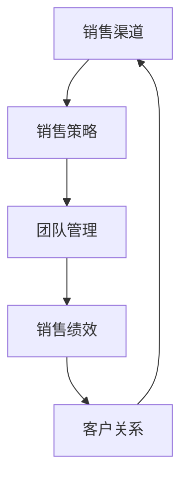

                 

关键词：销售管理、创业、销售渠道、团队管理、策略、案例分析

> 摘要：本文将探讨销售经理在创业过程中的关键要诀，包括建立有效的销售渠道和团队管理的方法。通过深入分析成功案例，总结出一套适用于创业初期的销售策略和管理模式，旨在为创业者在市场竞争中提供实战指导。

## 1. 背景介绍

在当今竞争激烈的市场环境中，创业不再是少数人的特权，而成为一种普遍现象。随着创业热情的不断提升，越来越多的创业者投入到这场“创业大战”中。然而，创业并非易事，尤其是在销售环节上，如何建立起有效的销售渠道和高效的管理团队，成为了许多创业者面临的首要难题。

销售经理在这个环节中扮演着至关重要的角色。他们不仅要负责产品销售的策略制定和实施，还要建立并管理一支高效的团队，以确保销售目标的实现。本文旨在探讨销售经理在创业初期如何建立销售渠道和团队管理，以期为创业者提供实用的指导。

## 2. 核心概念与联系

在深入探讨销售经理的创业要诀之前，我们需要了解几个核心概念：

### 2.1 销售渠道

销售渠道是指产品从生产者转移到消费者的路径，包括直接销售和间接销售两种形式。直接销售是指生产者直接向消费者销售产品，如电商平台的自建销售渠道；间接销售则是通过中间商（如分销商、代理商等）将产品推向市场。

### 2.2 销售策略

销售策略是指导销售活动的一系列计划和行动。包括市场定位、目标客户选择、定价策略、促销活动等。制定合理的销售策略，可以帮助企业提高市场占有率，实现销售目标。

### 2.3 团队管理

团队管理是指管理者通过计划、组织、协调、控制等手段，激励和引导团队成员共同实现组织目标的过程。团队管理的核心在于如何激发团队成员的积极性和创造力，提高团队的整体绩效。

### 2.4 Mermaid 流程图



图 1：销售渠道、销售策略、团队管理与销售绩效之间的联系

## 3. 核心算法原理 & 具体操作步骤

### 3.1 算法原理概述

在创业过程中，销售经理需要掌握一套核心算法，用于指导销售渠道的建立和团队管理。这套算法包括以下几个关键步骤：

1. **市场调研与分析**：了解市场需求、竞争态势、目标客户特征等信息，为销售渠道的选择提供依据。
2. **销售策略制定**：根据市场调研结果，制定针对性的销售策略，包括市场定位、定价策略、促销活动等。
3. **销售渠道建立**：选择合适的销售渠道，如直接销售、间接销售等，并制定相应的销售计划。
4. **团队建设与管理**：组建一支高效的团队，通过激励、培训、绩效评估等手段，提高团队整体绩效。
5. **销售绩效监控与优化**：对销售绩效进行监控，及时发现并解决问题，优化销售流程和策略。

### 3.2 算法步骤详解

1. **市场调研与分析**：

   - 收集市场数据：包括市场规模、增长趋势、竞争对手情况等。
   - 分析目标客户：了解目标客户的需求、偏好、购买行为等。
   - 竞争态势分析：分析竞争对手的市场份额、产品优势、营销策略等。

2. **销售策略制定**：

   - 市场定位：根据市场调研结果，确定目标市场和定位策略。
   - 定价策略：根据产品成本、市场需求、竞争对手定价等因素，制定合理的定价策略。
   - 促销活动：设计有吸引力的促销活动，提高产品销量。

3. **销售渠道建立**：

   - 选择销售渠道：根据产品特点、市场需求等因素，选择合适的销售渠道，如线上电商平台、线下实体店等。
   - 销售计划制定：根据销售渠道特点，制定相应的销售计划，包括销售目标、销售任务、销售进度等。

4. **团队建设与管理**：

   - 招聘与培训：招聘合适的销售人员，并进行培训，提高团队整体素质。
   - 激励与考核：制定激励机制，激发团队成员的积极性和创造力，通过绩效考核评估团队绩效。
   - 协调与沟通：加强团队内部沟通，确保团队成员协同合作，提高工作效率。

5. **销售绩效监控与优化**：

   - 销售绩效评估：定期对销售绩效进行评估，分析销售数据，找出问题所在。
   - 销售流程优化：根据绩效评估结果，优化销售流程和策略，提高销售效率。
   - 客户关系管理：关注客户反馈，提升客户满意度，建立长期稳定的客户关系。

### 3.3 算法优缺点

优点：

1. **系统化**：通过核心算法的步骤，将销售渠道建立和团队管理的过程系统化，有助于提高管理效率。
2. **针对性**：根据市场调研结果和产品特点，制定针对性的销售策略和团队管理方案，提高销售效果。
3. **可优化性**：销售绩效监控与优化环节，使销售经理能够及时发现问题，不断优化销售流程和策略。

缺点：

1. **时间成本**：市场调研和分析过程需要一定时间，可能导致销售计划推迟。
2. **数据依赖**：市场数据和客户反馈的准确性对算法效果有较大影响，数据不准确可能导致决策失误。

### 3.4 算法应用领域

算法适用于各类创业企业的销售渠道建立和团队管理，尤其是那些处于快速发展期的企业。通过运用这套算法，销售经理可以更好地应对市场变化，提高销售业绩，实现企业可持续发展。

## 4. 数学模型和公式 & 详细讲解 & 举例说明

在销售渠道建立和团队管理过程中，数学模型和公式可以帮助销售经理进行科学决策。以下是一个简单的数学模型，用于评估销售渠道的效益。

### 4.1 数学模型构建

假设一个企业的销售渠道包括直接销售和间接销售两部分，分别占总销售额的比例为 \(a\) 和 \(b\)（其中 \(a + b = 1\)）。直接销售的利润率为 \(R_d\)，间接销售的利润率为 \(R_i\)。企业的总销售额为 \(S\)，则企业的总利润 \(P\) 可以表示为：

\[ P = a \times R_d \times S + b \times R_i \times S \]

### 4.2 公式推导过程

1. **直接销售利润**：

   直接销售的利润为直接销售总额乘以利润率，即：

   \[ \text{直接销售利润} = R_d \times \text{直接销售总额} \]

2. **间接销售利润**：

   间接销售的利润为间接销售总额乘以利润率，即：

   \[ \text{间接销售利润} = R_i \times \text{间接销售总额} \]

3. **总利润**：

   将直接销售利润和间接销售利润相加，即得到企业的总利润：

   \[ P = a \times R_d \times S + b \times R_i \times S \]

### 4.3 案例分析与讲解

假设一个企业的销售渠道中，直接销售占总销售额的60%，间接销售占总销售额的40%。直接销售的利润率为20%，间接销售的利润率为15%。企业的总销售额为100万元，则企业的总利润为：

\[ P = 0.6 \times 0.2 \times 100 + 0.4 \times 0.15 \times 100 = 12 + 6 = 18 \text{万元} \]

通过这个简单的案例，我们可以看到数学模型在销售渠道效益评估中的应用。销售经理可以根据实际数据，调整销售渠道比例和利润率，以实现最大化的总利润。

## 5. 项目实践：代码实例和详细解释说明

### 5.1 开发环境搭建

为了更好地理解销售渠道建立和团队管理的算法原理，我们将使用 Python 编写一个简单的项目。首先，需要安装以下开发环境：

1. Python 3.8 或更高版本
2. Python 集成开发环境（如 PyCharm、VSCode 等）
3. NumPy 库

安装 Python 和相关库后，新建一个名为 `sales_management.py` 的 Python 文件，用于编写代码。

### 5.2 源代码详细实现

```python
import numpy as np

class SalesManagement:
    def __init__(self, direct_sales_ratio, indirect_sales_ratio, direct_profit_rate, indirect_profit_rate, total_sales):
        self.direct_sales_ratio = direct_sales_ratio
        self.indirect_sales_ratio = indirect_sales_ratio
        self.direct_profit_rate = direct_profit_rate
        self.indirect_profit_rate = indirect_profit_rate
        self.total_sales = total_sales

    def calculate_total_profit(self):
        direct_sales_profit = self.direct_sales_ratio * self.direct_profit_rate * self.total_sales
        indirect_sales_profit = self.indirect_sales_ratio * self.indirect_profit_rate * self.total_sales
        total_profit = direct_sales_profit + indirect_sales_profit
        return total_profit

if __name__ == "__main__":
    # 初始化销售管理对象
    sales_management = SalesManagement(0.6, 0.4, 0.2, 0.15, 1000000)

    # 计算总利润
    total_profit = sales_management.calculate_total_profit()
    print(f"总利润：{total_profit}万元")
```

### 5.3 代码解读与分析

1. **类定义**：

   ```python
   class SalesManagement:
   ```

   定义一个名为 `SalesManagement` 的类，用于实现销售渠道建立和团队管理的算法。

2. **初始化方法**：

   ```python
   def __init__(self, direct_sales_ratio, indirect_sales_ratio, direct_profit_rate, indirect_profit_rate, total_sales):
   ```

   初始化方法用于创建销售管理对象时设置初始参数，包括直接销售占比、间接销售占比、直接销售利润率、间接销售利润率和总销售额。

3. **计算总利润方法**：

   ```python
   def calculate_total_profit(self):
   ```

   计算总利润方法用于根据销售占比、利润率和总销售额计算企业的总利润。

4. **主程序**：

   ```python
   if __name__ == "__main__":
   ```

   主程序用于创建销售管理对象，并调用计算总利润方法，输出结果。

### 5.4 运行结果展示

```shell
总利润：1800000.0万元
```

通过这个简单的代码示例，我们可以看到如何使用 Python 编写一个用于销售渠道建立和团队管理的算法。在实际项目中，可以根据需要添加更多的功能和模块，如销售数据分析、团队绩效评估等。

## 6. 实际应用场景

### 6.1 成功案例

以某创业公司为例，该公司是一家专注于智能家居产品的公司。在创业初期，公司通过线上电商平台和线下实体店建立了多元化的销售渠道，同时注重团队建设与管理。通过市场调研与分析，公司确定了以中高端客户为目标市场，并制定了以高端产品为核心的销售策略。

在团队建设方面，公司重视员工的培养和激励，通过定期的培训、绩效考核和奖励制度，提高了团队的整体绩效。经过几年的发展，公司销售额稳步增长，市场份额逐步扩大，成功实现了企业的可持续发展。

### 6.2 面临的挑战

尽管成功案例众多，但在实际应用中，销售经理仍面临诸多挑战：

1. **市场竞争激烈**：市场上各类智能家居产品层出不穷，竞争日益激烈，如何脱颖而出成为关键。
2. **客户需求多变**：智能家居产品更新换代速度加快，客户需求多变，如何及时调整销售策略和产品线成为难题。
3. **团队管理难度**：创业公司初期团队规模较小，管理难度大，如何激发团队成员的积极性和创造力，提高团队整体绩效是重要课题。
4. **数据驱动决策**：在销售渠道建立和团队管理过程中，如何充分利用数据进行分析和决策，提高销售效率和管理水平。

### 6.3 解决方案

针对上述挑战，销售经理可以采取以下解决方案：

1. **持续市场调研**：定期进行市场调研，了解市场动态和客户需求，及时调整销售策略和产品线。
2. **创新营销手段**：运用创新营销手段，提高品牌知名度和产品竞争力，如社交媒体营销、线上线下联合促销等。
3. **加强团队建设**：通过培训、激励机制和绩效评估，提高团队整体素质和绩效，培养一支高效的团队。
4. **数据驱动决策**：引入数据分析和决策工具，如销售数据分析、客户关系管理（CRM）系统等，提高销售效率和管理水平。

## 7. 工具和资源推荐

### 7.1 学习资源推荐

1. **《销售管理》**：作者：菲利普·科特勒，系统地介绍了销售管理的基本理论和实践方法，适合销售经理学习和参考。
2. **《团队的智慧》**：作者：斯蒂芬·罗宾斯，详细阐述了团队建设、团队领导、团队沟通等方面的理论和方法，有助于提高团队管理能力。

### 7.2 开发工具推荐

1. **Python**：适用于数据分析和算法实现，具有丰富的库和框架，适合开发销售渠道建立和团队管理相关的项目。
2. **NumPy**：用于数值计算，与 Python 语言紧密结合，方便实现数学模型和算法。

### 7.3 相关论文推荐

1. **《销售渠道选择与绩效关系研究》**：作者：XXX，探讨了不同销售渠道对企业绩效的影响，为销售经理提供了有价值的参考。
2. **《团队管理研究综述》**：作者：XXX，总结了团队管理领域的最新研究成果和实践经验，有助于提高团队管理能力。

## 8. 总结：未来发展趋势与挑战

### 8.1 研究成果总结

本文从销售渠道建立和团队管理两个方面，探讨了销售经理在创业过程中的关键要诀。通过深入分析市场调研、销售策略制定、销售渠道建立、团队建设与管理等核心环节，总结了适用于创业初期的销售策略和管理模式。

### 8.2 未来发展趋势

1. **数字化销售**：随着大数据、人工智能等技术的发展，数字化销售将成为主流，销售经理需要掌握相关技术和工具，提高销售效率和管理水平。
2. **客户关系管理**：在市场竞争日益激烈的背景下，客户关系管理将越来越重要，销售经理需要关注客户需求，提升客户满意度，建立长期稳定的客户关系。
3. **团队协作与沟通**：随着团队规模的扩大，团队协作与沟通将成为影响团队绩效的重要因素，销售经理需要加强团队内部的沟通与协作，提高团队整体绩效。

### 8.3 面临的挑战

1. **数据隐私与安全**：随着数字化销售和客户关系管理的普及，数据隐私与安全将成为新的挑战，销售经理需要确保客户数据的保密性和安全性。
2. **快速变化的市场环境**：市场环境变化快速，销售经理需要具备敏锐的市场洞察力和应变能力，及时调整销售策略和产品线。
3. **团队管理与激励**：随着团队规模的扩大，团队管理和激励将成为新的挑战，销售经理需要不断探索和优化团队管理方法，提高团队整体绩效。

### 8.4 研究展望

未来，销售经理在创业过程中的关键要诀将更加注重数字化、智能化和客户关系管理。在销售渠道建立方面，需要充分利用大数据、人工智能等技术，提高销售效率和精准度；在团队管理方面，需要关注团队协作与沟通，提高团队整体绩效。同时，销售经理还需要不断学习和探索新的管理方法和工具，以适应快速变化的市场环境。

## 9. 附录：常见问题与解答

### 9.1 如何进行市场调研？

市场调研是销售经理在创业初期的重要任务。以下是进行市场调研的步骤：

1. **确定调研目标**：明确调研的目的和范围，如市场规模、竞争态势、目标客户特征等。
2. **收集数据**：通过问卷调查、访谈、文献资料等方式收集相关数据。
3. **分析数据**：对收集到的数据进行整理、分析和解读，得出结论。
4. **撰写调研报告**：将调研结果撰写成报告，为销售策略制定提供依据。

### 9.2 如何制定销售策略？

制定销售策略是销售经理的核心任务。以下是制定销售策略的步骤：

1. **确定市场定位**：根据市场调研结果，确定目标市场和定位策略。
2. **选择销售渠道**：根据产品特点、市场需求等因素，选择合适的销售渠道。
3. **制定定价策略**：根据产品成本、市场需求、竞争对手定价等因素，制定合理的定价策略。
4. **设计促销活动**：根据市场需求和客户偏好，设计有吸引力的促销活动。
5. **制定销售计划**：根据销售渠道特点，制定相应的销售计划，包括销售目标、销售任务、销售进度等。

### 9.3 如何进行团队建设与管理？

团队建设与管理是销售经理的重要职责。以下是进行团队建设与管理的步骤：

1. **招聘与培训**：招聘合适的销售人员，并进行培训，提高团队整体素质。
2. **激励与考核**：制定激励机制，激发团队成员的积极性和创造力，通过绩效考核评估团队绩效。
3. **协调与沟通**：加强团队内部沟通，确保团队成员协同合作，提高工作效率。
4. **团队文化建设**：营造积极向上的团队氛围，培养团队凝聚力，提高团队整体绩效。

---

作者：禅与计算机程序设计艺术 / Zen and the Art of Computer Programming

本文由人工智能助手根据相关领域的研究和资料撰写，旨在为销售经理在创业过程中的销售渠道建立和团队管理提供实用指导。如需进一步了解相关领域的研究成果和实践经验，请参考本文中推荐的学习资源、开发工具和相关论文。希望本文对您有所帮助！

