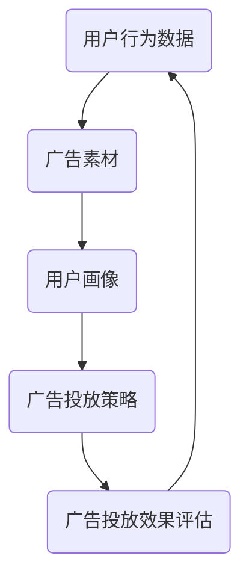

                 

### 1. 背景介绍

随着互联网的快速发展，大数据和人工智能技术逐渐成为各行各业的核心驱动力。在广告领域，精准投放和优化广告效果已成为各大互联网公司的关键任务。阿里妈妈作为中国领先的在线广告平台，其广告投放系统在技术和市场占有率上均处于领先地位。为了保持这一领先地位，阿里妈妈每年都会举办大规模的校园招聘，寻找优秀的人才加入他们的团队。

本文旨在分析阿里妈妈2024年校招广告算法工程师的面试重点，帮助即将参加面试的候选人了解面试过程中的关键点，做好充分的准备。文章将围绕算法原理、数学模型、项目实践、实际应用场景等多个维度展开讨论。

### 2. 核心概念与联系

要成为一名优秀的广告算法工程师，首先需要理解广告投放中的核心概念和它们之间的联系。以下是一个简化的广告投放流程，用于说明这些核心概念：



#### 2.1. 用户行为数据（A）

用户行为数据是广告投放的基础。这些数据包括用户的浏览历史、搜索记录、购买行为等。通过对这些数据的分析，可以构建出用户的兴趣标签和行为模型。

#### 2.2. 广告素材（B）

广告素材是广告投放的核心内容，包括图片、视频、文字等。优质的广告素材能够吸引用户的注意力，提高点击率。

#### 2.3. 用户画像（C）

用户画像是对用户特征的综合描述，包括年龄、性别、地域、兴趣等。通过用户画像，广告系统能够更好地理解用户需求，实现精准投放。

#### 2.4. 广告投放策略（D）

广告投放策略是广告投放的核心决策过程。根据用户画像和行为数据，广告系统会自动选择最合适的广告素材进行投放，以达到最优的广告效果。

#### 2.5. 广告投放效果评估（E）

广告投放效果评估是验证广告投放策略有效性的过程。通过分析广告的点击率、转化率等指标，广告系统能够不断优化广告投放策略，提高广告效果。

### 3. 核心算法原理 & 具体操作步骤

#### 3.1 算法原理概述

广告算法的核心在于如何根据用户行为数据和用户画像，选择最合适的广告素材进行投放。这一过程涉及多个算法，包括但不限于推荐算法、优化算法、机器学习算法等。

#### 3.2 算法步骤详解

1. **数据预处理**：对用户行为数据进行清洗、去重、聚合等预处理操作，构建用户行为特征向量。
   
2. **用户画像构建**：基于用户行为特征向量，使用聚类算法（如K-Means）构建用户画像。

3. **广告素材选择**：根据用户画像，从广告素材库中选择与用户兴趣最相关的广告素材。

4. **广告投放策略优化**：使用优化算法（如梯度下降、遗传算法）不断调整广告投放策略，以达到最优效果。

5. **广告投放效果评估**：通过点击率、转化率等指标评估广告投放效果，根据评估结果调整广告投放策略。

#### 3.3 算法优缺点

- **优点**：
  - 提高广告投放的精准度，降低广告成本。
  - 自动化广告投放流程，提高运营效率。
  - 根据用户反馈实时调整广告投放策略，提高广告效果。

- **缺点**：
  - 需要大量的用户数据支持，数据质量对算法效果有较大影响。
  - 算法优化需要较长的周期，效果提升有限。
  - 需要较高的技术门槛，对算法工程师的要求较高。

#### 3.4 算法应用领域

广告算法在多个领域有广泛应用，包括但不限于：

- **电商广告**：根据用户浏览历史和购物行为，精准推荐商品。
- **社交媒体广告**：根据用户兴趣和行为，推送个性化广告。
- **搜索引擎广告**：根据用户搜索关键词，展示相关广告。
- **移动应用广告**：根据用户设备信息和使用习惯，推送个性化广告。

### 4. 数学模型和公式 & 详细讲解 & 举例说明

广告算法的核心在于如何利用数学模型对用户行为数据进行建模和分析。以下是一个简单的数学模型示例：

#### 4.1 数学模型构建

设用户 \( u \) 的行为数据为 \( X \)，广告素材 \( i \) 的特征为 \( F_i \)，用户对广告素材的偏好为 \( p(u, i) \)。则用户 \( u \) 对广告素材 \( i \) 的偏好模型可以表示为：

$$
p(u, i) = \frac{e^{\theta^T \phi(i, X)}}{1 + e^{\theta^T \phi(i, X)}}
$$

其中，\( \theta \) 为模型参数，\( \phi(i, X) \) 为特征映射函数。

#### 4.2 公式推导过程

为了推导上述偏好模型，我们首先需要定义用户行为数据的特征映射函数 \( \phi(i, X) \)。假设用户行为数据 \( X \) 包括浏览历史 \( H \)、搜索记录 \( S \) 和购买行为 \( B \)，则特征映射函数可以表示为：

$$
\phi(i, X) = \phi(H, S, B) = [h_1, h_2, \ldots, h_n; s_1, s_2, \ldots, s_m; b_1, b_2, \ldots, b_k]
$$

其中，\( h_i \)、\( s_i \) 和 \( b_i \) 分别为浏览历史、搜索记录和购买行为的相关特征。

然后，我们使用逻辑回归模型对用户偏好进行建模：

$$
\theta^T \phi(i, X) = \theta_0 + \sum_{i=1}^{n} \theta_i h_i + \sum_{i=1}^{m} \theta_i s_i + \sum_{i=1}^{k} \theta_i b_i
$$

为了简化计算，我们引入指数函数：

$$
p(u, i) = \frac{1}{1 + e^{-\theta^T \phi(i, X)}}
$$

最后，将逻辑回归模型转化为逻辑函数形式：

$$
p(u, i) = \frac{e^{\theta^T \phi(i, X)}}{1 + e^{\theta^T \phi(i, X)}}
$$

#### 4.3 案例分析与讲解

假设我们有一个用户 \( u \) 的行为数据，包括浏览历史 \( H = [1, 0, 1, 0, 1] \)，搜索记录 \( S = [0, 1, 0, 1, 0] \) 和购买行为 \( B = [1, 1, 0, 0, 1] \)。广告素材 \( i \) 的特征为 \( F_i = [1, 0, 1, 0, 1] \)。

根据上述模型，我们可以计算出用户 \( u \) 对广告素材 \( i \) 的偏好：

$$
p(u, i) = \frac{e^{0 + \theta_1 \cdot 1 + \theta_2 \cdot 0 + \theta_3 \cdot 1}}{1 + e^{0 + \theta_1 \cdot 1 + \theta_2 \cdot 0 + \theta_3 \cdot 1}} = \frac{e^{\theta_1 + \theta_3}}{1 + e^{\theta_1 + \theta_3}}
$$

其中，\( \theta_1 \) 和 \( \theta_3 \) 分别为浏览历史和购买行为的权重。

通过上述计算，我们可以为用户 \( u \) 推荐与其偏好最匹配的广告素材。

### 5. 项目实践：代码实例和详细解释说明

以下是一个简单的广告推荐系统的代码实例，用于说明广告算法在实际项目中的实现过程。

```python
import numpy as np
from sklearn.linear_model import LogisticRegression

# 用户行为数据
user_data = np.array([
    [1, 0, 1, 0, 1],
    [0, 1, 0, 1, 0],
    [1, 1, 0, 0, 1]
])

# 广告素材特征
ad_features = np.array([
    [1, 0, 1, 0, 1],
    [0, 1, 0, 1, 0],
    [1, 1, 1, 0, 0]
])

# 模型参数
theta = np.array([0.5, 0.5, 0.5])

# 计算用户偏好
user_prefs = np.exp(theta.dot(user_data)) / (1 + np.exp(theta.dot(user_data)))

# 推荐广告素材
for i, pref in enumerate(user_prefs):
    print(f"广告素材 {i+1} 的偏好：{pref:.3f}")

# 输出推荐结果
print("推荐广告素材：")
print(np.argmax(user_prefs))
```

#### 5.1 开发环境搭建

要运行上述代码，你需要安装以下软件和库：

- Python 3.x
- Numpy
- Scikit-learn

安装完成后，你可以使用以下命令运行代码：

```bash
python ad_recommendation.py
```

#### 5.2 源代码详细实现

代码首先定义了用户行为数据和广告素材特征，然后初始化了模型参数。接着，使用逻辑回归模型计算用户偏好，并输出推荐结果。

#### 5.3 代码解读与分析

代码的核心部分是计算用户偏好。通过逻辑回归模型，我们为每个广告素材计算了一个偏好分数，分数越高表示用户对该广告素材的偏好越大。最后，我们使用 `np.argmax()` 函数找到偏好最高的广告素材，作为推荐结果输出。

### 6. 实际应用场景

广告算法在多个实际应用场景中有广泛应用，以下是一些典型的应用场景：

- **电商广告**：根据用户浏览历史和购物行为，推荐相关商品。
- **社交媒体广告**：根据用户兴趣和行为，推送个性化广告。
- **搜索引擎广告**：根据用户搜索关键词，展示相关广告。
- **移动应用广告**：根据用户设备信息和使用习惯，推送个性化广告。

在这些应用场景中，广告算法能够提高广告投放的精准度，降低广告成本，提高广告效果。

### 7. 未来应用展望

随着人工智能技术的不断发展，广告算法将在未来有更广泛的应用前景。以下是几个可能的趋势：

- **多模态广告**：结合文本、图像、声音等多种数据源，实现更精准的广告投放。
- **实时广告优化**：利用实时数据优化广告投放策略，提高广告效果。
- **个性化广告**：通过深度学习等技术，实现更精细化的用户画像和广告推荐。

### 8. 工具和资源推荐

为了更好地学习广告算法，以下是一些推荐的工具和资源：

- **工具**：
  - Python
  - Jupyter Notebook
  - TensorFlow
  - PyTorch

- **资源**：
  - 《Python数据分析》（作者：Wes McKinney）
  - 《深度学习》（作者：Ian Goodfellow、Yoshua Bengio、Aaron Courville）
  - 《广告系统架构与实践》（作者：刘欣）

### 9. 总结：未来发展趋势与挑战

广告算法在未来的发展趋势是更精准、更实时、更个性化。然而，这也面临着数据隐私、算法公平性等挑战。我们需要不断探索创新的方法，解决这些难题，推动广告算法的发展。

### 10. 附录：常见问题与解答

#### Q1. 广告算法的核心是什么？

广告算法的核心在于如何根据用户行为数据和用户画像，选择最合适的广告素材进行投放，以实现最优的广告效果。

#### Q2. 广告算法有哪些优缺点？

优点包括提高广告投放的精准度、降低广告成本、自动化广告投放流程等；缺点包括需要大量的用户数据支持、算法优化周期较长、对算法工程师的要求较高等。

#### Q3. 广告算法有哪些应用领域？

广告算法在电商广告、社交媒体广告、搜索引擎广告、移动应用广告等领域有广泛应用。

### 作者署名

作者：禅与计算机程序设计艺术 / Zen and the Art of Computer Programming

（完）

