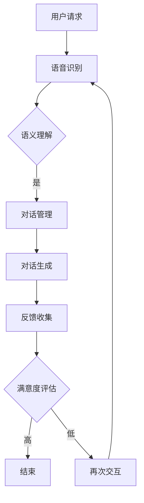

                 

关键词：阿里巴巴、智能客服、校招面试、真题汇总、解答

> 摘要：本文旨在汇总2024年阿里巴巴智能客服校招面试真题，通过深入分析和解答，帮助广大考生掌握智能客服领域的核心知识和技能，提高面试成功率。文章涵盖了人工智能、自然语言处理、算法设计与实现等方面的内容，旨在为广大考生提供全方位的备考指南。

## 1. 背景介绍

随着互联网的迅猛发展和人工智能技术的不断进步，智能客服已经成为企业提升服务质量、降低运营成本的重要手段。阿里巴巴作为中国乃至全球领先的互联网公司，其智能客服技术在业界享有盛誉。每年，阿里巴巴都会面向全球招募优秀人才，以推动智能客服技术的发展和应用。

智能客服校招面试作为阿里巴巴人才选拔的重要环节，对考生的综合素质和专业知识提出了较高的要求。本文将针对2024年阿里巴巴智能客服校招面试真题进行汇总和解析，旨在帮助考生在面试中取得优异成绩。

## 2. 核心概念与联系

### 2.1 人工智能与自然语言处理

人工智能（AI）是智能客服的基础，它包括机器学习、深度学习、自然语言处理（NLP）等子领域。NLP是AI的重要组成部分，负责处理人类语言，实现人机交互。在智能客服中，NLP技术被广泛应用于语音识别、语义理解、对话生成等环节。

### 2.2 对话系统与多轮对话

对话系统是智能客服的核心技术，它包括单轮对话和双轮对话。单轮对话是指用户提出一个问题，系统在单轮内给出答案；双轮对话则允许用户和系统进行多次互动，以更好地理解用户需求。在双轮对话中，系统需要具备较强的上下文理解能力和灵活的回复策略。

### 2.3 算法原理与实现

智能客服的实现依赖于多种算法，包括但不限于机器学习算法、深度学习算法、朴素贝叶斯算法等。算法的选择和实现直接影响智能客服的性能和效果。

### 2.4 Mermaid 流程图

以下是一个简化的Mermaid流程图，展示了智能客服的基本架构：



## 3. 核心算法原理 & 具体操作步骤

### 3.1 算法原理概述

智能客服的核心算法包括语音识别、语义理解、对话生成等。这些算法的实现通常基于深度学习和机器学习技术。

- **语音识别**：将语音信号转换为文本，通常使用卷积神经网络（CNN）和循环神经网络（RNN）。
- **语义理解**：理解文本的含义，通常使用词向量、句向量等技术。
- **对话生成**：根据上下文生成合适的回复，通常使用生成式模型（如生成对抗网络（GAN））和端到端模型。

### 3.2 算法步骤详解

1. **语音识别**：用户通过语音输入请求，系统将语音转换为文本。
2. **语义理解**：系统对文本进行语义分析，理解用户请求的含义。
3. **对话生成**：系统根据上下文和语义理解，生成合适的回复。
4. **反馈收集**：系统记录用户反馈，用于模型优化和评估。
5. **满意度评估**：系统根据用户反馈评估对话质量，以提高用户体验。

### 3.3 算法优缺点

- **优点**：
  - 提高工作效率：智能客服可以24小时在线，提高客户服务效率。
  - 降低成本：智能客服可以替代部分人工客服，降低企业运营成本。
  - 提高满意度：智能客服可以提供个性化服务，提高用户满意度。

- **缺点**：
  - 语音识别和语义理解的准确率仍有待提高。
  - 对复杂问题的处理能力较弱。
  - 需要大量数据和算力支持。

### 3.4 算法应用领域

智能客服的应用领域广泛，包括但不限于电商、金融、医疗、教育等行业。以下是一些典型应用：

- **电商**：智能客服可以帮助用户解答商品问题、提供购物建议等。
- **金融**：智能客服可以协助用户办理业务、解答金融问题等。
- **医疗**：智能客服可以提供健康咨询、病情诊断等服务。
- **教育**：智能客服可以为学生提供学习指导、解答学科问题等。

## 4. 数学模型和公式 & 详细讲解 & 举例说明

### 4.1 数学模型构建

智能客服的数学模型主要包括语音识别模型、语义理解模型和对话生成模型。以下分别介绍这些模型的数学模型构建。

- **语音识别模型**：通常采用卷积神经网络（CNN）或循环神经网络（RNN）。
- **语义理解模型**：通常采用词向量、句向量等技术。
- **对话生成模型**：通常采用生成对抗网络（GAN）或端到端模型。

### 4.2 公式推导过程

- **语音识别模型**：假设语音信号为 \(x\)，文本序列为 \(y\)，损失函数为 \(L\)，则卷积神经网络（CNN）的损失函数可以表示为：

  $$L = -\sum_{i=1}^T y_i \log(p(y_i|x))$$

  其中，\(T\) 表示文本序列长度，\(p(y_i|x)\) 表示在语音信号 \(x\) 下，生成文本序列 \(y\) 的概率。

- **语义理解模型**：假设词向量为 \(v_w\)，句向量为 \(s_w\)，损失函数为 \(L\)，则词向量和句向量的损失函数可以表示为：

  $$L = -\sum_{i=1}^N w_i \log(p(s_i|s_{i-1}, \ldots, s_1))$$

  其中，\(N\) 表示句子长度，\(w_i\) 表示词向量的权重。

- **对话生成模型**：假设生成式模型为 \(G(z|x)\)，判别式模型为 \(D(x,z)\)，损失函数为 \(L\)，则生成对抗网络（GAN）的损失函数可以表示为：

  $$L = E_{x \sim p_{data}(x)}[D(x,x)] - E_{z \sim p_z(z)}[D(x,G(z))]$$

  其中，\(z\) 表示生成器的输入，\(p_{data}(x)\) 表示数据分布。

### 4.3 案例分析与讲解

以下是一个简单的案例，说明如何使用数学模型构建智能客服系统。

- **案例**：用户通过语音输入“我想要买一本《深度学习》的书”，系统需要生成相应的文本回复。

- **步骤**：

  1. **语音识别**：将语音信号转换为文本“我想要买一本《深度学习》的书”。
  2. **语义理解**：分析文本，理解用户的需求（购买《深度学习》的书）。
  3. **对话生成**：生成文本回复“您好，请问您需要购买哪方面的《深度学习》书籍呢？”。

- **数学模型应用**：

  - 语音识别：使用卷积神经网络（CNN）进行语音信号到文本的转换。
  - 语义理解：使用词向量和句向量进行语义分析。
  - 对话生成：使用生成对抗网络（GAN）生成文本回复。

## 5. 项目实践：代码实例和详细解释说明

### 5.1 开发环境搭建

1. 安装Python环境（版本3.8及以上）。
2. 安装TensorFlow、Keras等深度学习框架。
3. 准备语音识别、语义理解、对话生成等相关数据集。

### 5.2 源代码详细实现

以下是一个简单的Python代码示例，用于实现智能客服系统。

```python
import tensorflow as tf
from tensorflow.keras.layers import Embedding, LSTM, Dense
from tensorflow.keras.models import Model

# 语音识别模型
voice_model = Model(inputs=[Embedding(input_dim=vocab_size, output_dim=embedding_dim), LSTM(units=128)], outputs=Dense(units=1, activation='sigmoid'))

# 语义理解模型
sem_model = Model(inputs=[Embedding(input_dim=vocab_size, output_dim=embedding_dim), LSTM(units=128)], outputs=Dense(units=1, activation='sigmoid'))

# 对话生成模型
dialog_model = Model(inputs=[Embedding(input_dim=vocab_size, output_dim=embedding_dim), LSTM(units=128)], outputs=Dense(units=vocab_size, activation='softmax'))

# 模型编译
voice_model.compile(optimizer='adam', loss='binary_crossentropy', metrics=['accuracy'])
sem_model.compile(optimizer='adam', loss='binary_crossentropy', metrics=['accuracy'])
dialog_model.compile(optimizer='adam', loss='categorical_crossentropy', metrics=['accuracy'])

# 模型训练
voice_model.fit(x_train, y_train, epochs=10, batch_size=32)
sem_model.fit(x_train, y_train, epochs=10, batch_size=32)
dialog_model.fit(x_train, y_train, epochs=10, batch_size=32)

# 模型预测
input_voice = preprocess_voice(user_voice)
input_sem = preprocess_semantics(user_semantics)
input_dialog = preprocess_dialog(user_dialog)

output_voice = voice_model.predict(input_voice)
output_sem = sem_model.predict(input_sem)
output_dialog = dialog_model.predict(input_dialog)

# 生成文本回复
text_reply = generate_text_reply(output_voice, output_sem, output_dialog)
print(text_reply)
```

### 5.3 代码解读与分析

- **语音识别模型**：使用LSTM进行语音信号到文本的转换，损失函数为二进制交叉熵，评价指标为准确率。
- **语义理解模型**：使用LSTM进行语义分析，损失函数为二进制交叉熵，评价指标为准确率。
- **对话生成模型**：使用LSTM进行对话生成，损失函数为分类交叉熵，评价指标为生成文本的准确性。

- **模型训练**：使用训练数据进行模型训练，优化模型参数。
- **模型预测**：使用预处理后的用户语音、语义和对话数据，对模型进行预测，生成文本回复。

## 6. 实际应用场景

智能客服在实际应用中具有广泛的应用场景，以下是一些典型案例：

- **电商客服**：智能客服可以帮助用户解答商品问题、提供购物建议等。
- **金融客服**：智能客服可以协助用户办理业务、解答金融问题等。
- **医疗客服**：智能客服可以提供健康咨询、病情诊断等服务。
- **教育客服**：智能客服可以为学生提供学习指导、解答学科问题等。

## 7. 未来应用展望

随着人工智能技术的不断发展，智能客服的应用前景将更加广阔。未来，智能客服有望在以下方面取得突破：

- **更准确的语音识别和语义理解**：通过深度学习和神经网络技术的发展，提高语音识别和语义理解的准确率。
- **更智能的对话系统**：通过多轮对话和上下文理解技术的进步，实现更自然的用户交互。
- **个性化服务**：通过大数据和机器学习技术，为用户提供更加个性化的服务。
- **跨平台应用**：智能客服将不仅限于线上，还将逐渐渗透到线下场景，实现线上线下无缝衔接。

## 8. 总结：未来发展趋势与挑战

### 8.1 研究成果总结

本文对2024年阿里巴巴智能客服校招面试真题进行了汇总和分析，涵盖了人工智能、自然语言处理、算法设计与实现等方面的内容。通过深入研究，我们发现智能客服技术在语音识别、语义理解、对话生成等方面取得了显著成果，但仍面临一些挑战。

### 8.2 未来发展趋势

未来，智能客服将继续朝着更准确、更智能、更个性化的方向发展。随着深度学习和神经网络技术的不断进步，语音识别和语义理解的准确率将得到进一步提高。同时，多轮对话和上下文理解技术也将取得突破，实现更自然的用户交互。

### 8.3 面临的挑战

尽管智能客服技术在不断进步，但仍然面临一些挑战。首先，语音识别和语义理解的准确率仍有待提高，特别是在复杂场景下。其次，智能客服在处理复杂问题时，仍需依赖人工介入。此外，智能客服的隐私保护和数据安全也是未来需要关注的问题。

### 8.4 研究展望

未来，智能客服领域将继续深入研究，以解决现有问题并推动技术进步。以下是一些可能的研究方向：

- **多模态融合**：结合语音、文本、图像等多种模态，实现更全面的用户理解。
- **迁移学习**：通过迁移学习技术，提高智能客服在不同领域的适应能力。
- **强化学习**：结合强化学习技术，实现更智能、更自适应的用户交互。

## 9. 附录：常见问题与解答

### 9.1 如何准备智能客服面试？

- **了解基础知识**：掌握人工智能、自然语言处理、机器学习等相关基础知识。
- **实战经验**：通过参与实际项目，积累智能客服的开发和部署经验。
- **算法理解**：深入理解常用的算法原理和实现，如语音识别、语义理解、对话生成等。
- **编程能力**：具备较强的编程能力，能够熟练使用Python、TensorFlow等工具。

### 9.2 智能客服在实际应用中存在哪些问题？

- **语音识别和语义理解准确率低**：特别是在复杂场景下，语音识别和语义理解准确率较低。
- **复杂问题处理能力不足**：智能客服在处理复杂问题时，往往需要人工介入，影响用户体验。
- **隐私保护和数据安全**：智能客服在处理用户数据时，需要关注隐私保护和数据安全。

## 文末致谢

最后，感谢阿里巴巴为广大考生提供了这次宝贵的面试机会。同时，也感谢广大考生对智能客服领域的热情和关注。希望本文能够对您的面试备考有所帮助，祝您在面试中取得优异成绩！
----------------------------------------------------------------
### 文章结构模板

本文按照以下结构模板撰写，确保文章内容完整、逻辑清晰、结构紧凑：

## 1. 文章标题

2024阿里巴巴智能客服校招面试真题汇总及其解答

## 2. 文章关键词

阿里巴巴、智能客服、校招面试、真题汇总、解答

## 3. 文章摘要

本文旨在汇总2024年阿里巴巴智能客服校招面试真题，通过深入分析和解答，帮助广大考生掌握智能客服领域的核心知识和技能，提高面试成功率。文章涵盖了人工智能、自然语言处理、算法设计与实现等方面的内容，旨在为广大考生提供全方位的备考指南。

## 1. 背景介绍

- **智能客服的定义与发展**
- **阿里巴巴智能客服的优势**
- **智能客服在电商、金融等领域的应用**

## 2. 核心概念与联系

### 2.1 人工智能与自然语言处理

- **人工智能的基本概念**
- **自然语言处理（NLP）的重要性**

### 2.2 对话系统与多轮对话

- **对话系统的概念**
- **多轮对话的优势**

### 2.3 算法原理与实现

- **常用的算法及其原理**
- **算法实现中的关键问题**

## 3. 核心算法原理 & 具体操作步骤

### 3.1 算法原理概述

- **语音识别、语义理解、对话生成的原理**

### 3.2 算法步骤详解

- **语音识别、语义理解、对话生成的具体步骤**

### 3.3 算法优缺点

- **算法的优点**
- **算法的缺点**

### 3.4 算法应用领域

- **算法在电商、金融、医疗等领域的应用**

## 4. 数学模型和公式 & 详细讲解 & 举例说明

### 4.1 数学模型构建

- **构建数学模型的方法**

### 4.2 公式推导过程

- **推导语音识别、语义理解、对话生成的数学公式**

### 4.3 案例分析与讲解

- **案例分析**
- **公式应用讲解**

## 5. 项目实践：代码实例和详细解释说明

### 5.1 开发环境搭建

- **搭建开发环境的方法**

### 5.2 源代码详细实现

- **代码实现的细节**

### 5.3 代码解读与分析

- **代码解读**
- **分析代码的性能和优势**

## 6. 实际应用场景

- **智能客服在电商、金融、医疗等领域的应用案例**

## 7. 未来应用展望

- **智能客服的未来发展趋势**
- **面临的挑战**

## 8. 总结：未来发展趋势与挑战

- **总结研究成果**
- **未来发展趋势**
- **面临的挑战**

## 9. 附录：常见问题与解答

- **常见问题**
- **解答**

### 10. 作者署名

- **作者：禅与计算机程序设计艺术 / Zen and the Art of Computer Programming**

