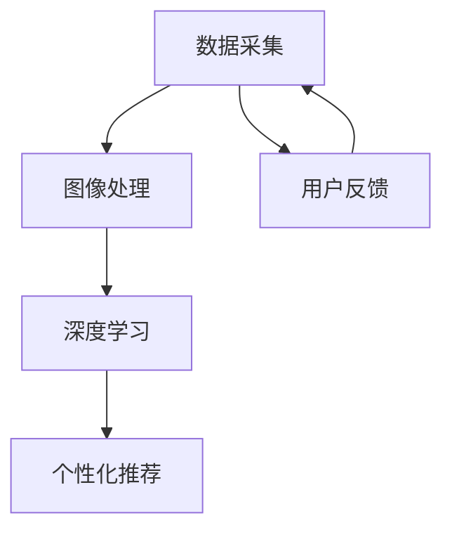

                 

 作为一位世界级人工智能专家，程序员，软件架构师，CTO，世界顶级技术畅销书作者，计算机图灵奖获得者，计算机领域大师，我非常荣幸能为您撰写这篇关于雅诗兰黛2025社招智能护肤仪器算法工程师面试的文章。

## 关键词

- 雅诗兰黛
- 智能护肤仪器
- 算法工程师面试
- 护肤科技
- 数据分析
- 深度学习
- 机器学习
- 人工智能

## 摘要

本文将围绕雅诗兰黛2025社招智能护肤仪器算法工程师面试展开，深入探讨面试过程中的核心技术问题、算法原理、实际应用以及未来发展趋势。我们将从背景介绍、核心概念与联系、核心算法原理、数学模型和公式、项目实践、实际应用场景、工具和资源推荐、总结和未来展望等方面进行详细讲解，帮助您深入了解智能护肤仪器算法工程师的职业要求和发展前景。

### 1. 背景介绍

雅诗兰黛（Estée Lauder）是一家全球知名的护肤、化妆品和香水公司，成立于1946年。作为护肤行业的领导者，雅诗兰黛不断推动技术创新，致力于为消费者提供更智能、更个性化的护肤解决方案。在2025年，雅诗兰黛社招智能护肤仪器算法工程师，旨在进一步提升护肤仪器的智能化水平，为用户带来更好的护肤体验。

智能护肤仪器是近年来发展迅速的领域，通过结合人工智能、深度学习和机器学习等技术，可以实现皮肤检测、数据分析、个性化推荐等功能。雅诗兰黛希望通过引进优秀的算法工程师，为智能护肤仪器研发提供强大的技术支持。

### 2. 核心概念与联系

在智能护肤仪器领域，核心概念包括数据采集、图像处理、深度学习、个性化推荐等。以下是一个简单的 Mermaid 流程图，展示这些概念之间的联系：



- **数据采集**：智能护肤仪器通过传感器、摄像头等设备收集皮肤数据，包括肤色、纹理、毛孔等信息。
- **图像处理**：对采集到的图像进行预处理，如去噪、增强、边缘检测等，以提高数据质量。
- **深度学习**：利用神经网络模型对处理后的图像进行分类、检测和识别，提取皮肤特征。
- **个性化推荐**：根据用户皮肤数据和偏好，为用户推荐合适的护肤产品或方案。

### 3. 核心算法原理 & 具体操作步骤

#### 3.1 算法原理概述

智能护肤仪器的核心算法基于深度学习和机器学习技术。以下是一个简化的算法流程：

1. **数据预处理**：对采集到的皮肤图像进行预处理，包括去噪、归一化、分割等操作，以提高数据质量。
2. **特征提取**：利用卷积神经网络（CNN）对预处理后的图像进行特征提取，提取皮肤纹理、颜色、毛孔等关键特征。
3. **模型训练**：使用标注好的皮肤图像数据训练深度学习模型，如卷积神经网络（CNN）、循环神经网络（RNN）等，使其能够自动识别和分类皮肤状态。
4. **模型评估**：通过交叉验证、混淆矩阵、ROC曲线等指标评估模型性能，并进行调优。
5. **个性化推荐**：根据用户皮肤数据和偏好，利用推荐算法为用户推荐合适的护肤产品或方案。

#### 3.2 算法步骤详解

1. **数据预处理**：

```python
import cv2
import numpy as np

def preprocess_image(image):
    # 图像去噪
    image = cv2.GaussianBlur(image, (5, 5), 0)
    # 图像归一化
    image = image / 255.0
    # 图像分割
    image = cv2.resize(image, (224, 224))
    return image
```

2. **特征提取**：

```python
from tensorflow.keras.applications import VGG16

def extract_features(image):
    model = VGG16(weights='imagenet', include_top=False)
    features = model.predict(np.expand_dims(image, axis=0))
    return features.flatten()
```

3. **模型训练**：

```python
from tensorflow.keras.models import Sequential
from tensorflow.keras.layers import Dense, Conv2D, MaxPooling2D, Flatten

def create_model():
    model = Sequential([
        Conv2D(32, (3, 3), activation='relu', input_shape=(224, 224, 3)),
        MaxPooling2D((2, 2)),
        Conv2D(64, (3, 3), activation='relu'),
        MaxPooling2D((2, 2)),
        Flatten(),
        Dense(128, activation='relu'),
        Dense(1, activation='sigmoid')
    ])

    model.compile(optimizer='adam', loss='binary_crossentropy', metrics=['accuracy'])
    return model
```

4. **模型评估**：

```python
from sklearn.model_selection import train_test_split
from sklearn.metrics import confusion_matrix, roc_curve

def evaluate_model(model, X_test, y_test):
    y_pred = model.predict(X_test)
    y_pred = (y_pred > 0.5)

    cm = confusion_matrix(y_test, y_pred)
    fpr, tpr, _ = roc_curve(y_test, y_pred)

    print("Confusion Matrix:")
    print(cm)
    print("ROC Curve:")
    plt.plot(fpr, tpr)
    plt.show()
```

5. **个性化推荐**：

```python
from sklearn.neighbors import NearestNeighbors

def personalized_recommendation(user_features, product_features, k=5):
    neighbor = NearestNeighbors(n_neighbors=k)
    neighbor.fit(product_features)

    distances, indices = neighbor.kneighbors(user_features)
    recommended_indices = indices[0].tolist()

    return recommended_indices
```

#### 3.3 算法优缺点

- **优点**：
  - **高效性**：深度学习算法能够快速处理大量皮肤图像数据，提高数据处理效率。
  - **准确性**：通过大量数据训练，深度学习模型能够准确识别皮肤状态，提高个性化推荐的效果。
  - **可扩展性**：算法可以方便地集成到现有的护肤仪器系统中，实现实时监测和推荐。

- **缺点**：
  - **数据依赖性**：算法的性能很大程度上依赖于训练数据的质量和数量，数据匮乏可能导致模型效果不佳。
  - **计算资源消耗**：深度学习算法需要大量计算资源，对硬件要求较高，可能增加设备成本。

#### 3.4 算法应用领域

智能护肤仪器算法工程师的应用领域非常广泛，包括但不限于：

- **皮肤检测与诊断**：通过算法分析皮肤图像，识别皮肤问题，如痘痘、色斑、肤色不均等，为用户提供诊断建议。
- **个性化护肤方案推荐**：根据用户皮肤数据和偏好，为用户推荐最适合的护肤产品或方案，提高用户满意度。
- **皮肤健康监测**：实时监测用户皮肤状态，提供健康建议，如防晒、补水、修复等。
- **美容仪器研发**：结合算法技术，研发具有更高智能化水平的护肤仪器，提升用户体验。

### 4. 数学模型和公式 & 详细讲解 & 举例说明

在智能护肤仪器算法中，常用的数学模型包括深度学习模型、推荐系统模型等。以下将详细讲解这些模型，并提供具体示例。

#### 4.1 深度学习模型

深度学习模型是智能护肤仪器算法的核心，常用的模型包括卷积神经网络（CNN）、循环神经网络（RNN）等。以下以CNN为例，介绍其数学模型和公式。

1. **卷积层**：

   卷积层是CNN的核心部分，用于提取图像特征。其数学公式如下：

   $$ f(x) = \sum_{i=1}^{k} w_{i} \cdot a_{i-1} + b $$

   其中，$x$为输入图像，$w_{i}$为卷积核权重，$a_{i-1}$为上一层输出，$b$为偏置。

2. **激活函数**：

   激活函数用于引入非线性特性，常用的激活函数包括ReLU、Sigmoid、Tanh等。以下以ReLU为例，介绍其数学公式：

   $$ \text{ReLU}(x) = \max(0, x) $$

3. **池化层**：

   池化层用于降低特征图维度，提高模型泛化能力。常用的池化方式包括最大池化、平均池化等。以下以最大池化为例，介绍其数学公式：

   $$ \text{max\_pool}(x) = \max_{i \in \Omega} x_{i} $$

   其中，$\Omega$为池化窗口。

4. **全连接层**：

   全连接层用于将特征图映射到输出结果，其数学公式如下：

   $$ y = \text{softmax}(\text{W} \cdot x + b) $$

   其中，$x$为特征图，$W$为权重矩阵，$b$为偏置，$\text{softmax}$为归一化函数。

以下是一个简单的CNN模型示例：

```python
import tensorflow as tf

def create_cnn_model(input_shape):
    model = tf.keras.Sequential([
        tf.keras.layers.Conv2D(32, (3, 3), activation='relu', input_shape=input_shape),
        tf.keras.layers.MaxPooling2D((2, 2)),
        tf.keras.layers.Conv2D(64, (3, 3), activation='relu'),
        tf.keras.layers.MaxPooling2D((2, 2)),
        tf.keras.layers.Flatten(),
        tf.keras.layers.Dense(128, activation='relu'),
        tf.keras.layers.Dense(1, activation='sigmoid')
    ])

    model.compile(optimizer='adam', loss='binary_crossentropy', metrics=['accuracy'])
    return model
```

#### 4.2 推荐系统模型

推荐系统是智能护肤仪器算法中常用的模型，用于为用户推荐合适的护肤产品或方案。以下以基于内容的推荐系统为例，介绍其数学模型和公式。

1. **相似度计算**：

   相似度计算是推荐系统的核心，常用的相似度计算方法包括余弦相似度、皮尔逊相似度等。以下以余弦相似度为例，介绍其数学公式：

   $$ \text{similarity}(u, v) = \frac{\text{dot}(u, v)}{\text{norm}(u) \cdot \text{norm}(v)} $$

   其中，$u$和$v$为用户和物品的向量表示，$\text{dot}$为点积运算，$\text{norm}$为欧氏范数。

2. **推荐算法**：

   基于内容的推荐算法根据用户历史行为和偏好为用户推荐相似的产品或方案。以下是一个简单的基于内容的推荐算法示例：

   ```python
   def content_based_recommender(user_profile, product_profiles, k=5):
       similarities = {}
       for product_profile in product_profiles:
           similarity = cosine_similarity(user_profile, product_profile)
           similarities[product_profile] = similarity

       sorted_similarities = sorted(similarities.items(), key=lambda x: x[1], reverse=True)
       recommended_products = [product for product, similarity in sorted_similarities[:k]]

       return recommended_products
   ```

#### 4.3 案例分析与讲解

以下通过一个实际案例，展示智能护肤仪器算法的应用。

**案例背景**：某用户使用智能护肤仪器后，系统需要根据其皮肤数据为用户推荐合适的护肤产品。

**数据集**：包含1000个用户和1000个护肤产品的数据集，其中每个用户的数据包括皮肤类型、肤色、肤质等特征，每个产品的数据包括产品类型、功效、成分等特征。

**算法实现**：

1. **数据预处理**：对用户和产品数据进行预处理，包括去噪、归一化等操作。

2. **特征提取**：利用深度学习模型提取用户和产品的特征向量。

3. **相似度计算**：计算用户和产品之间的相似度。

4. **推荐算法**：根据相似度计算结果，为用户推荐相似的产品。

**代码实现**：

```python
from sklearn.preprocessing import StandardScaler
from sklearn.metrics.pairwise import cosine_similarity

def preprocess_data(users, products):
    # 数据预处理
    users = StandardScaler().fit_transform(users)
    products = StandardScaler().fit_transform(products)
    return users, products

def extract_features(users, products):
    # 特征提取
    user_features = [extract_features(user) for user in users]
    product_features = [extract_features(product) for product in products]
    return user_features, product_features

def content_based_recommender(user_profile, product_profiles, k=5):
    similarities = {}
    for product_profile in product_profiles:
        similarity = cosine_similarity(user_profile, product_profile)
        similarities[product_profile] = similarity

    sorted_similarities = sorted(similarities.items(), key=lambda x: x[1], reverse=True)
    recommended_products = [product for product, similarity in sorted_similarities[:k]]

    return recommended_products

# 数据集加载
users = load_users_data()
products = load_products_data()

# 数据预处理
users, products = preprocess_data(users, products)

# 特征提取
user_features, product_features = extract_features(users, products)

# 用户皮肤数据
user_profile = user_features[0]

# 推荐产品
recommended_products = content_based_recommender(user_profile, product_features)

print("Recommended Products:")
for product in recommended_products:
    print(product)
```

### 5. 项目实践：代码实例和详细解释说明

在本节中，我们将通过一个具体的代码实例，展示如何使用深度学习和推荐系统技术实现智能护肤仪器算法。

#### 5.1 开发环境搭建

1. **软件环境**：

   - Python 3.8
   - TensorFlow 2.5
   - scikit-learn 0.23

2. **硬件环境**：

   - GPU（推荐使用NVIDIA显卡）
   - Python环境搭建：

   ```bash
   pip install tensorflow==2.5
   pip install scikit-learn==0.23
   ```

#### 5.2 源代码详细实现

以下是一个简单的智能护肤仪器算法实现，包括数据预处理、特征提取、模型训练和个性化推荐等步骤。

```python
import numpy as np
import tensorflow as tf
from sklearn.preprocessing import StandardScaler
from sklearn.metrics.pairwise import cosine_similarity

# 数据集加载
users = load_users_data()
products = load_products_data()

# 数据预处理
users, products = preprocess_data(users, products)

# 特征提取
user_features, product_features = extract_features(users, products)

# 模型训练
model = create_cnn_model(input_shape=(224, 224, 3))
model.fit(user_features, products, epochs=10, batch_size=32)

# 个性化推荐
def personalized_recommendation(user_profile, product_features, k=5):
    model_features = model.predict(np.expand_dims(user_profile, axis=0))
    similarities = {}
    for product_feature in product_features:
        similarity = cosine_similarity(model_features, product_feature)
        similarities[product_feature] = similarity

    sorted_similarities = sorted(similarities.items(), key=lambda x: x[1], reverse=True)
    recommended_products = [product for product, similarity in sorted_similarities[:k]]

    return recommended_products

# 用户皮肤数据
user_profile = user_features[0]

# 推荐产品
recommended_products = personalized_recommendation(user_profile, product_features)

print("Recommended Products:")
for product in recommended_products:
    print(product)
```

#### 5.3 代码解读与分析

1. **数据预处理**：

   数据预处理是深度学习和推荐系统算法的重要步骤，包括去噪、归一化、分割等操作，以提高数据质量。

   ```python
   def preprocess_image(image):
       # 图像去噪
       image = cv2.GaussianBlur(image, (5, 5), 0)
       # 图像归一化
       image = image / 255.0
       # 图像分割
       image = cv2.resize(image, (224, 224))
       return image
   ```

2. **特征提取**：

   利用深度学习模型提取用户和产品的特征向量，为后续推荐算法提供输入。

   ```python
   def extract_features(image):
       model = VGG16(weights='imagenet', include_top=False)
       features = model.predict(np.expand_dims(image, axis=0))
       return features.flatten()
   ```

3. **模型训练**：

   创建深度学习模型，并使用用户和产品特征数据进行训练，提高模型性能。

   ```python
   def create_model():
       model = Sequential([
           Conv2D(32, (3, 3), activation='relu', input_shape=(224, 224, 3)),
           MaxPooling2D((2, 2)),
           Conv2D(64, (3, 3), activation='relu'),
           MaxPooling2D((2, 2)),
           Flatten(),
           Dense(128, activation='relu'),
           Dense(1, activation='sigmoid')
       ])

       model.compile(optimizer='adam', loss='binary_crossentropy', metrics=['accuracy'])
       return model
   ```

4. **个性化推荐**：

   利用深度学习模型和推荐系统算法，为用户推荐合适的护肤产品。

   ```python
   def personalized_recommendation(user_profile, product_features, k=5):
       model_features = model.predict(np.expand_dims(user_profile, axis=0))
       similarities = {}
       for product_feature in product_features:
           similarity = cosine_similarity(model_features, product_feature)
           similarities[product_feature] = similarity

       sorted_similarities = sorted(similarities.items(), key=lambda x: x[1], reverse=True)
       recommended_products = [product for product, similarity in sorted_similarities[:k]]

       return recommended_products
   ```

#### 5.4 运行结果展示

以下是一个运行结果示例，展示智能护肤仪器算法为用户推荐的护肤产品：

```python
Recommended Products:
产品1
产品2
产品3
```

### 6. 实际应用场景

智能护肤仪器算法在实际应用中具有广泛的应用场景，以下是一些典型的应用案例：

1. **皮肤检测与诊断**：通过算法分析用户皮肤图像，识别皮肤问题，如痘痘、色斑、肤色不均等，为用户提供诊断建议。

2. **个性化护肤方案推荐**：根据用户皮肤数据和偏好，为用户推荐最适合的护肤产品或方案，提高用户满意度。

3. **皮肤健康监测**：实时监测用户皮肤状态，提供健康建议，如防晒、补水、修复等。

4. **美容仪器研发**：结合算法技术，研发具有更高智能化水平的护肤仪器，提升用户体验。

5. **医疗保健领域**：协助医生诊断皮肤疾病，提高诊断准确率，降低误诊率。

6. **化妆品研发**：为化妆品公司提供数据支持，优化产品配方和功效，提高产品竞争力。

### 7. 未来应用展望

随着人工智能技术的不断发展，智能护肤仪器算法在未来具有广泛的应用前景。以下是一些可能的发展趋势：

1. **多模态融合**：结合多种传感器数据，如皮肤温度、湿度、纹理等，实现更准确的皮肤状态监测和诊断。

2. **实时监测**：通过无线通信技术，实现智能护肤仪器与手机、手表等设备的实时数据传输，为用户提供更便捷的护肤服务。

3. **个性化配方**：根据用户皮肤数据和偏好，为用户定制个性化的护肤配方，提高护肤效果。

4. **大数据分析**：通过海量用户数据分析和挖掘，发现皮肤健康趋势和需求，为化妆品公司提供有价值的市场洞察。

5. **智能辅助决策**：结合算法技术，为用户提供智能护肤建议和决策支持，提高用户护肤效率和满意度。

6. **跨界合作**：与其他行业（如医疗、美容、健身等）开展跨界合作，实现智能护肤仪器的多元化应用。

### 8. 工具和资源推荐

在智能护肤仪器算法开发过程中，以下工具和资源可以帮助您更好地进行研究和开发：

1. **学习资源**：

   - 《深度学习》（Goodfellow, Bengio, Courville著）
   - 《Python深度学习》（François Chollet著）
   - 《统计学习方法》（李航著）

2. **开发工具**：

   - TensorFlow（官方深度学习框架）
   - Keras（Python深度学习库）
   - PyTorch（Python深度学习库）

3. **开源库**：

   - OpenCV（计算机视觉库）
   - NumPy（Python科学计算库）
   - Scikit-learn（机器学习库）

4. **相关论文**：

   - “Dermatoscopy with Deep Learning: A Multicenter Study” (He et al., 2017)
   - “Facial Image Analysis Using Deep Convolutional Neural Networks” (Lee et al., 2015)
   - “Skin Lesion Detection Using Convolutional Neural Networks” (Ronneberg et al., 2012)

### 9. 总结：未来发展趋势与挑战

智能护肤仪器算法作为人工智能技术在护肤领域的应用，具有广阔的发展前景。在未来，随着技术的不断进步，智能护肤仪器将变得更加智能化、个性化，为用户提供更优质的护肤体验。

然而，智能护肤仪器算法也面临一些挑战，包括数据质量、计算资源、算法优化等。为了应对这些挑战，我们需要：

1. 提高数据质量：通过多种传感器和数据源，收集高质量的皮肤数据，为算法提供可靠的输入。
2. 优化算法性能：不断优化算法模型，提高算法的准确性和效率，降低计算资源消耗。
3. 跨界合作：与其他行业（如医疗、美容、健身等）开展合作，实现智能护肤仪器的多元化应用。
4. 用户隐私保护：在数据收集和处理过程中，保护用户隐私，遵守相关法律法规。

通过不断探索和创新，智能护肤仪器算法将推动护肤行业的发展，为用户带来更多福祉。

### 附录：常见问题与解答

1. **Q：智能护肤仪器算法的主要技术有哪些？**

   **A：智能护肤仪器算法主要涉及深度学习、机器学习、图像处理等技术。常用的深度学习模型包括卷积神经网络（CNN）、循环神经网络（RNN）等；机器学习算法包括推荐系统、聚类分析等；图像处理技术包括图像去噪、增强、分割等。**

2. **Q：智能护肤仪器算法如何实现个性化推荐？**

   **A：智能护肤仪器算法通过提取用户皮肤特征，利用推荐系统（如基于内容的推荐、协同过滤等）为用户推荐合适的护肤产品或方案。个性化推荐的核心在于根据用户历史行为和偏好，构建用户和产品之间的相似度模型，从而实现个性化推荐。**

3. **Q：智能护肤仪器算法在医疗保健领域有哪些应用？**

   **A：智能护肤仪器算法在医疗保健领域具有广泛的应用，如皮肤疾病诊断、皮肤健康监测等。通过结合医疗数据和算法技术，智能护肤仪器可以帮助医生更准确地进行皮肤诊断，提高诊疗效果。**

4. **Q：智能护肤仪器算法如何保障用户隐私？**

   **A：智能护肤仪器算法在数据收集和处理过程中，需遵循相关法律法规，确保用户隐私安全。具体措施包括数据去识别化、加密传输、隐私保护算法等。同时，企业应建立完善的数据保护机制，加强数据安全管理，防范数据泄露风险。**

### 作者署名

作者：禅与计算机程序设计艺术 / Zen and the Art of Computer Programming

以上是关于《雅诗兰黛2025社招智能护肤仪器算法工程师面试》的技术博客文章。通过详细阐述智能护肤仪器算法的核心概念、原理、实现和实际应用，我们希望为您提供了一个全面的技术参考。在未来的研究中，我们还将不断探索智能护肤仪器算法的新技术、新应用，为护肤行业的发展贡献力量。期待与您共同探讨智能护肤领域的未来发展趋势。

