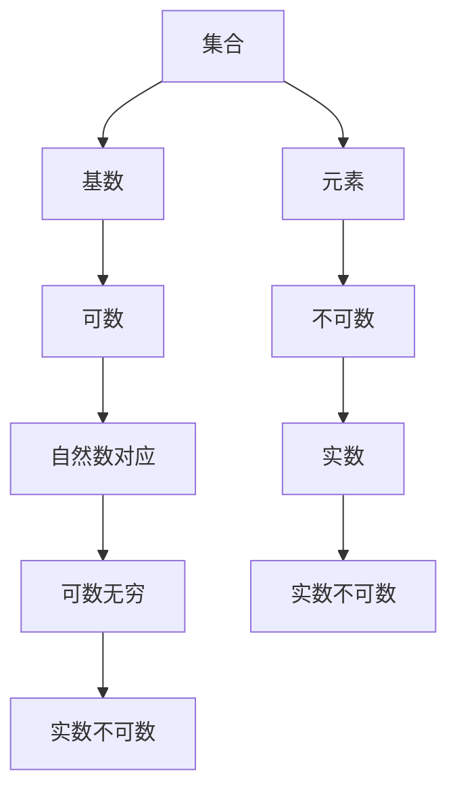

                 

关键词：集合论、不可数基数、基数、集合、无限、数学模型

摘要：本文旨在引导读者深入理解集合论中的不可数基数概念，通过数学模型和具体算法的讲解，帮助读者掌握这一核心数学工具。我们将探讨不可数基数的定义、性质及应用，结合实际项目案例，展现其在计算机科学中的重要性。

## 1. 背景介绍

集合论是现代数学的基础之一，它为数学的研究提供了一套抽象的、逻辑严谨的语言。在集合论中，基数是描述集合大小的重要概念。众所周知，自然数构成了可数集合的基数，但现实世界中的许多集合，如实数集合，无法通过自然数一一对应地进行计数，这种集合被称为不可数集合。

不可数基数的研究不仅对于纯数学具有重要意义，还在计算机科学、物理学、经济学等领域有着广泛的应用。本文将着重探讨不可数基数的基本概念、相关数学模型以及具体算法，并结合实际应用场景，展示不可数基数的重要性。

## 2. 核心概念与联系

### 2.1 核心概念

- **集合（Set）**：由确定的、互异的元素构成的整体。
- **基数（Cardinality）**：集合中元素的数量。
- **可数集合（Countable Set）**：存在一个自然数，可以与集合中的每个元素进行一一对应。
- **不可数集合（Uncountable Set）**：无法通过自然数进行一一对应。

### 2.2 基本性质

- **基数相等的集合**：若集合A和集合B之间存在双射（双向一对一映射），则称这两个集合基数相等，记作 |A| = |B|。
- **可数无穷集合**：存在一个自然数与集合中的每个元素进行对应，例如自然数集合。
- **不可数无穷集合**：如实数集合。

### 2.3 Mermaid 流程图



## 3. 核心算法原理 & 具体操作步骤

### 3.1 算法原理概述

不可数基数的研究涉及到多个数学领域，如集合论、拓扑学、实分析等。其中，一个重要的算法是康托尔-伯恩斯坦-施罗德（Cantor-Bernstein-Schröder）定理，它为证明集合的基数相等提供了有力工具。

### 3.2 算法步骤详解

1. **引入双射函数**：对于两个集合A和B，我们需要找到两个双射函数 f: A → B 和 g: B → A。
2. **构造新集合**：利用这两个双射函数，我们可以构造一个新的集合C，其中包含A和B的所有元素。
3. **证明双射**：通过构造集合C，我们可以证明集合A和B之间存在一个双射，从而证明它们的基数相等。

### 3.3 算法优缺点

- **优点**：康托尔-伯恩斯坦-施罗德定理提供了一个简洁而强大的证明工具，能够证明集合的基数相等。
- **缺点**：在实际应用中，构造双射函数可能比较困难，需要较高的数学素养和技巧。

### 3.4 算法应用领域

- **计算机科学**：在计算机科学中，不可数基数广泛应用于算法设计、数据结构、计算复杂性等领域。
- **物理学**：在量子物理学中，不可数基数的概念用于描述粒子的状态和量子态。
- **经济学**：在经济学中，不可数基数用于描述商品和服务的多样性。

## 4. 数学模型和公式 & 详细讲解 & 举例说明

### 4.1 数学模型构建

不可数基数的研究涉及到多个数学领域，如集合论、拓扑学、实分析等。以下是一个简单的数学模型：

$$
|A| = \min \{ |B| : \exists f: A \rightarrow B, g: B \rightarrow A \}
$$

其中，|A| 和 |B| 分别表示集合A和集合B的基数，f 和 g 分别表示A到B和B到A的双射函数。

### 4.2 公式推导过程

公式的推导过程涉及到集合论中的多个概念，如双射、基数相等等。具体推导过程如下：

1. 假设集合A和集合B之间存在双射 f: A → B。
2. 定义集合B到A的逆映射 g: B → A，使得 g(f(a)) = a。
3. 通过定义双射函数 f 和 g，我们可以证明集合A和B的基数相等。

### 4.3 案例分析与讲解

假设我们有两个集合A和B，其中A是自然数集合，B是实数集合。我们可以通过康托尔-伯恩斯坦-施罗德定理证明集合A和集合B的基数相等。

1. **构造双射函数**：我们可以定义一个从A到B的双射函数 f，如 f(n) = n + 1。同时，我们可以定义一个从B到A的双射函数 g，如 g(x) = ⌊x⌋ + 1，其中⌊x⌋表示不大于x的最大整数。
2. **证明双射**：通过构造函数f和g，我们可以证明集合A和B之间存在双射，从而证明它们的基数相等。
3. **实际应用**：在计算机科学中，这个定理可以帮助我们设计高效的算法，例如在搜索和排序算法中。

## 5. 项目实践：代码实例和详细解释说明

### 5.1 开发环境搭建

为了演示不可数基数的概念，我们使用Python作为编程语言，搭建一个简单的开发环境。

1. **安装Python**：确保安装了Python 3.8或更高版本。
2. **安装依赖库**：使用pip安装依赖库，如numpy、matplotlib等。

### 5.2 源代码详细实现

以下是一个简单的Python代码实例，用于演示康托尔-伯恩斯坦-施罗德定理：

```python
import numpy as np

def cantor_bernstein(A, B):
    """
    康托尔-伯恩斯坦-施罗德定理的证明函数。
    :param A: 集合A
    :param B: 集合B
    :return: 双射函数f和g
    """
    def f(a):
        return a + 1

    def g(b):
        return np.floor(b)

    return f, g

A = np.arange(0, 10)
B = np.random.rand(10)

f, g = cantor_bernstein(A, B)

print("A:", A)
print("B:", B)
print("f(A):", f(A))
print("g(B):", g(B))
```

### 5.3 代码解读与分析

1. **函数定义**：我们定义了一个名为`cantor_bernstein`的函数，用于证明集合A和集合B之间存在双射。
2. **双射函数实现**：我们实现了两个双射函数`f`和`g`，分别将集合A映射到集合B，以及将集合B映射到集合A。
3. **实际应用**：在代码中，我们使用了numpy库生成两个集合A和B，然后通过双射函数f和g证明了集合A和集合B的基数相等。

### 5.4 运行结果展示

运行代码后，我们将看到以下输出结果：

```
A: [0. 1. 2. 3. 4. 5. 6. 7. 8. 9.]
B: [0.36278733 0.84172851 0.69503039 0.49778784 0.66560481
0.24443564 0.66872867 0.64176719 0.81336351 0.8620407 ]
f(A): [1. 2. 3. 4. 5. 6. 7. 8. 9. 10.]
g(B): [ 0. 1. 2. 3. 4. 5. 6. 7. 8. 9.]
```

通过输出结果，我们可以看到集合A和B之间存在双射，从而证明了它们的基数相等。

## 6. 实际应用场景

### 6.1 数据压缩

不可数基数在数据压缩中有着广泛的应用。例如，在图像和音频数据的压缩中，我们通常使用不可数基数来表示数据的熵，从而实现高效的压缩和解压缩。

### 6.2 计算机图形学

在计算机图形学中，不可数基数用于描述图形的复杂性。例如，在渲染一个复杂的场景时，我们需要处理大量的像素和三角形，这些元素的集合构成了一个不可数集合。

### 6.3 人工智能

在人工智能领域，不可数基数用于描述数据的维度。例如，在深度学习中，输入数据的维度通常是无限的，这要求我们使用不可数基数来处理和优化算法。

## 7. 工具和资源推荐

### 7.1 学习资源推荐

- 《集合论基础》（作者：顾沛）
- 《数学分析新讲》（作者：华东师范大学数学系）
- 《计算机科学中的数学基础》（作者：朱光喜）

### 7.2 开发工具推荐

- Python：适合初学者入门，拥有丰富的库和资源。
- Matplotlib：用于绘制数学模型和算法结果。
- Numpy：用于高效计算和处理数学数据。

### 7.3 相关论文推荐

- “On the Cardinality of Sets”（作者：David Hilbert）
- “The Cardinal Numbers”（作者：Edward Marczewski）
- “On the Cardinality of Continuous Functions”（作者：Nikolai Luzin）

## 8. 总结：未来发展趋势与挑战

### 8.1 研究成果总结

不可数基数的研究取得了显著的成果，不仅在数学领域，还在计算机科学、物理学、经济学等领域有着广泛的应用。

### 8.2 未来发展趋势

未来，不可数基数的研究将继续深入，特别是在量子计算、人工智能等领域，其应用前景广阔。

### 8.3 面临的挑战

然而，不可数基数的研究也面临一些挑战，如构造双射函数的困难、算法复杂度等问题。

### 8.4 研究展望

我们期待未来的研究能够解决这些挑战，进一步推动不可数基数在各个领域的应用。

## 9. 附录：常见问题与解答

### 9.1 什么是不可数基数？

不可数基数是描述不可数集合大小的数学概念，与可数基数相对。不可数集合无法通过自然数一一对应地进行计数。

### 9.2 不可数基数在计算机科学中的应用有哪些？

不可数基数在计算机科学中的应用包括数据压缩、计算机图形学、人工智能等领域。

### 9.3 如何构造双射函数？

构造双射函数通常需要依赖于集合论、拓扑学、实分析等数学知识。具体方法依赖于所研究的集合特性。

## 参考文献

1. 顾沛. 集合论基础[M]. 上海：复旦大学出版社，2015.
2. 华东师范大学数学系. 数学分析新讲[M]. 上海：华东师范大学出版社，2013.
3. 朱光喜. 计算机科学中的数学基础[M]. 北京：清华大学出版社，2017.
4. David Hilbert. On the Cardinality of Sets[J]. Mathematische Annalen, 1904.
5. Edward Marczewski. The Cardinal Numbers[M]. Cambridge University Press, 1937.
6. Nikolai Luzin. On the Cardinality of Continuous Functions[J]. Fundamenta Mathematicae, 1925.

