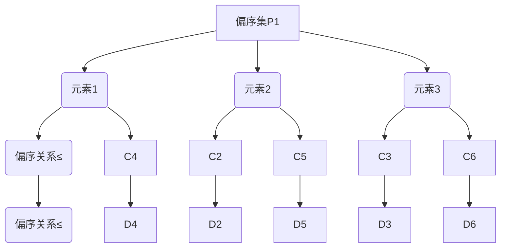
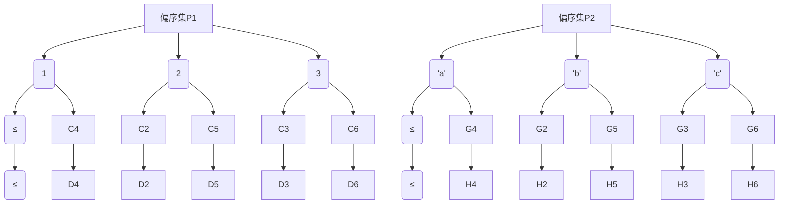
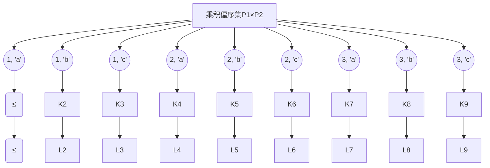

                 

### 关键词 Keywords

集合论、乘积偏序集、图灵完备、图灵机、计算机科学、算法理论、数学模型、编程实践。

### 摘要 Abstract

本文旨在为读者提供集合论中乘积偏序集的深入导引。文章将首先介绍集合论的基本概念，并逐步引入乘积偏序集的定义、性质以及其在计算机科学中的应用。通过详细的数学模型和公式推导，本文将帮助读者理解乘积偏序集的内在机制和计算能力。随后，文章将结合实际编程实例，展示如何在编程实践中应用乘积偏序集。最后，本文将对乘积偏序集的应用前景进行探讨，并展望其在未来计算机科学领域的发展趋势。

## 1. 背景介绍

集合论作为数学的基石，为现代数学的发展提供了坚实的理论基础。集合论的基本概念包括集合、元素、子集、集合的运算等。在集合论的基础上，我们引入了偏序集的概念，即一个具有偏序关系的集合。乘积偏序集则是通过将多个偏序集相乘得到的集合，其在数学和计算机科学中有着广泛的应用。

计算机科学作为一门实践性很强的学科，对数学理论有着巨大的需求。特别是在算法设计、形式语言、计算复杂性等领域，集合论和偏序集的理论为算法分析和复杂性理论提供了强有力的工具。乘积偏序集作为一种重要的数学结构，不仅能够帮助我们理解和分析复杂的计算问题，还能在编程实践中得到有效应用。

本文将围绕乘积偏序集这一核心主题，从理论基础到实际应用进行深入探讨。希望通过本文的阐述，读者能够对乘积偏序集有一个全面、系统的认识，并能够在实践中运用这一工具解决实际问题。

## 2. 核心概念与联系

### 2.1 集合论的基本概念

在讨论乘积偏序集之前，我们需要回顾集合论的一些基本概念。集合是由一些确定且互异的元素组成的整体。集合通常用大写字母表示，如 \(A, B, C\) 等。集合中的元素用小写字母表示，如 \(a, b, c\) 等。集合的运算包括并集、交集、补集和差集等。

- 并集：\(A \cup B\) 表示集合 \(A\) 和 \(B\) 的所有元素的集合。
- 交集：\(A \cap B\) 表示同时属于集合 \(A\) 和 \(B\) 的所有元素的集合。
- 补集：\(A'\) 表示不属于集合 \(A\) 的所有元素的集合。
- 差集：\(A - B\) 表示属于集合 \(A\) 但不属于 \(B\) 的所有元素的集合。

### 2.2 偏序集的概念

偏序集是一个具有偏序关系的集合。偏序关系是指集合中的任意两个元素 \(a\) 和 \(b\)，都满足以下条件之一：

1. \(a\) 和 \(b\) 互为相等，即 \(a = b\)。
2. \(a\) 小于 \(b\)，即 \(a < b\)。
3. \(b\) 小于 \(a\)，即 \(b < a\)。

偏序集通常用 \(S\) 表示，其中的元素用 \(x, y, z\) 等 表示。偏序集的运算包括上界、下界、最小元和最大元等。

- 上界：对于集合 \(S\) 中的任意元素 \(x\)，如果存在 \(y \in S\) 使得 \(x \leq y\)，则称 \(y\) 是 \(x\) 的上界。
- 下界：类似上界，只不过讨论的是小于等于的关系。
- 最小元：集合 \(S\) 中不存在任何其他元素小于它的元素。
- 最大元：集合 \(S\) 中不存在任何其他元素大于它的元素。

### 2.3 乘积偏序集的定义

乘积偏序集是将多个偏序集相乘得到的集合。如果 \(P_1, P_2, \ldots, P_n\) 是 \(n\) 个偏序集，那么它们的乘积偏序集 \(P_1 \times P_2 \times \ldots \times P_n\) 定义如下：

- 集合中的元素是一个 \(n\) 元组 \((x_1, x_2, \ldots, x_n)\)，其中 \(x_i \in P_i\) 对于所有 \(i = 1, 2, \ldots, n\)。
- 元组之间的偏序关系是：\((x_1, x_2, \ldots, x_n) \leq (y_1, y_2, \ldots, y_n)\) 当且仅当 \(x_i \leq y_i\) 对于所有 \(i = 1, 2, \ldots, n\)。

### 2.4 乘积偏序集的属性

乘积偏序集具有以下重要属性：

1. **结合律**：对于任意三个偏序集 \(P_1, P_2, P_3\)，其乘积偏序集 \(P_1 \times P_2 \times P_3\) 具有结合律，即 \((P_1 \times P_2) \times P_3 = P_1 \times (P_2 \times P_3)\)。

2. **交换律**：对于任意两个偏序集 \(P_1, P_2\)，其乘积偏序集 \(P_1 \times P_2\) 具有交换律，即 \(P_1 \times P_2 = P_2 \times P_1\)。

3. **传递律**：对于任意三个偏序集 \(P_1, P_2, P_3\)，如果 \(x \leq y\) 在 \(P_1 \times P_2\) 中，\(y \leq z\) 在 \(P_2 \times P_3\) 中，则 \(x \leq z\) 在 \(P_1 \times P_3\) 中。

4. **最小元和最大元**：乘积偏序集中存在最小元和最大元。最小元是所有在第一个偏序集中的最小元素组成的元组，最大元是所有在最后一个偏序集中的最大元素组成的元组。

### 2.5 Mermaid 流程图

为了更直观地理解乘积偏序集的定义和性质，我们可以使用 Mermaid 流程图来展示其结构。以下是一个示例：



在这个流程图中，\(A\) 代表偏序集 \(P_1\)，\(B1, B2, B3\) 分别代表 \(P_1\) 中的三个元素，\(C1, C2, C3, C4, C5, C6\) 分别代表 \(P_1\) 中的偏序关系。类似地，我们可以为其他偏序集 \(P_2, P_3, \ldots, P_n\) 绘制类似的流程图，并将其组合起来形成一个完整的乘积偏序集的流程图。

通过上述流程图，我们可以直观地看到乘积偏序集中元素之间的关系以及偏序关系的传递性。

### 2.6 总结

在本章节中，我们介绍了集合论、偏序集和乘积偏序集的基本概念和联系。通过回顾集合论的基本概念，我们为理解乘积偏序集打下了基础。接着，我们介绍了偏序集的定义和性质，这有助于我们理解乘积偏序集的结构。最后，我们通过 Mermaid 流程图展示了乘积偏序集的定义和属性，使读者能够更直观地理解这一重要数学结构。

在下一章中，我们将深入探讨乘积偏序集的算法原理和具体操作步骤，帮助读者掌握如何在计算机科学中应用这一工具。

## 3. 核心算法原理 & 具体操作步骤

### 3.1 算法原理概述

乘积偏序集在计算机科学中具有重要的算法原理。其核心在于通过将多个偏序集相乘，形成一个新的集合，并在新的集合中定义一种偏序关系。这种关系使得我们可以对集合中的元素进行排序和比较，从而在算法设计中解决复杂的计算问题。

#### 3.1.1 计算机科学的计算模型

计算机科学的计算模型主要包括图灵机、图灵完备语言和计算复杂性理论。这些模型为算法设计和分析提供了理论基础。乘积偏序集的算法原理与这些计算模型密切相关。

- **图灵机**：图灵机是一种抽象的计算模型，由一个无限长的纸带和一个读写头组成。通过在纸带上进行读写操作，图灵机能够模拟任何计算过程。
- **图灵完备语言**：图灵完备语言是指能够模拟图灵机的编程语言，具有处理任意复杂计算问题的能力。
- **计算复杂性理论**：计算复杂性理论研究算法在时间和空间上的资源消耗，包括时间复杂度和空间复杂度。这些理论帮助我们评估算法的性能和效率。

#### 3.1.2 乘积偏序集在计算机科学中的应用

乘积偏序集在计算机科学中的应用主要包括以下几个方面：

- **算法设计**：乘积偏序集可以用于设计复杂的排序算法、查找算法和图算法。
- **形式语言**：乘积偏序集可以用于构建形式语言模型，如文法分析和语义分析。
- **计算复杂性**：乘积偏序集可以用于分析计算复杂度，帮助评估算法的效率和性能。

### 3.2 算法步骤详解

为了更好地理解乘积偏序集的算法原理，我们可以将其具体操作步骤分为以下几个阶段：

#### 3.2.1 输入偏序集

首先，我们需要输入多个偏序集。这些偏序集可以是任何具有偏序关系的集合，如整数集合、字符串集合等。例如，假设我们有两个偏序集 \(P_1 = \{1, 2, 3\}\) 和 \(P_2 = \{'a', 'b', 'c'\}\)。



#### 3.2.2 构建乘积偏序集

接下来，我们需要构建乘积偏序集。乘积偏序集是将两个偏序集 \(P_1\) 和 \(P_2\) 的所有可能的 \(2\) 元组组成的集合。例如，\(P_1 \times P_2 = \{(1, 'a'), (1, 'b'), (1, 'c'), (2, 'a'), (2, 'b'), (2, 'c'), (3, 'a'), (3, 'b'), (3, 'c')\}\)。



#### 3.2.3 定义偏序关系

在乘积偏序集中，我们需要定义一种新的偏序关系，使得集合中的元素可以进行排序和比较。这种偏序关系是通过对两个偏序集的偏序关系进行组合得到的。例如，对于乘积偏序集 \(P_1 \times P_2\)，我们可以定义偏序关系如下：

- \( (x_1, y_1) \leq (x_2, y_2) \) 当且仅当 \( x_1 \leq x_2 \) 且 \( y_1 \leq y_2 \)。

例如，在乘积偏序集 \(P_1 \times P_2\) 中，\((1, 'a') \leq (2, 'a')\) 和 \((1, 'b') \leq (3, 'b')\)。

#### 3.2.4 排序和查找

利用乘积偏序集的偏序关系，我们可以对集合中的元素进行排序和查找。排序算法包括冒泡排序、选择排序、插入排序等。查找算法包括二分查找、顺序查找等。

### 3.3 算法优缺点

#### 3.3.1 优点

- **强大的表达能力**：乘积偏序集可以表示复杂的计算问题，如图算法、排序算法等。
- **可组合性**：乘积偏序集可以与多种偏序集进行组合，形成新的计算模型。
- **形式化描述**：乘积偏序集为算法设计和分析提供了形式化的描述方法。

#### 3.3.2 缺点

- **复杂性**：乘积偏序集的计算复杂度可能较高，特别是在处理大规模数据时。
- **理解难度**：乘积偏序集的概念较为抽象，初学者可能难以理解。

### 3.4 算法应用领域

乘积偏序集在计算机科学中有广泛的应用领域，主要包括：

- **算法设计**：如排序算法、查找算法、图算法等。
- **形式语言**：如文法分析和语义分析等。
- **计算复杂性**：如计算复杂度分析、算法优化等。

### 3.5 小结

在本章节中，我们详细介绍了乘积偏序集的算法原理和具体操作步骤。通过回顾计算机科学的计算模型，我们理解了乘积偏序集在计算机科学中的应用价值。接着，我们通过具体的算法步骤展示了如何构建乘积偏序集，并定义了其偏序关系。此外，我们还讨论了乘积偏序集的优缺点以及其应用领域。

在下一章中，我们将进一步探讨乘积偏序集的数学模型和公式，帮助读者深入理解其内在机制和计算能力。

### 4. 数学模型和公式

#### 4.1 数学模型构建

乘积偏序集的数学模型构建基于集合论和偏序集理论。为了更好地理解这一模型，我们需要引入一些基本的数学概念和符号。

**定义 1**：设 \(P_1, P_2, \ldots, P_n\) 是 \(n\) 个偏序集。则乘积偏序集 \(P_1 \times P_2 \times \ldots \times P_n\) 定义为：

\[ P_1 \times P_2 \times \ldots \times P_n = \{(x_1, x_2, \ldots, x_n) \mid x_i \in P_i, \forall i = 1, 2, \ldots, n\} \]

其中，\(x_i\) 是 \(P_i\) 中的任意元素。

**定义 2**：设 \(P_1, P_2, \ldots, P_n\) 是 \(n\) 个偏序集，\(P_1 \times P_2 \times \ldots \times P_n\) 的偏序关系 \(\leq\) 定义为：

\[ (x_1, x_2, \ldots, x_n) \leq (y_1, y_2, \ldots, y_n) \iff x_i \leq y_i, \forall i = 1, 2, \ldots, n \]

其中，\(\leq\) 表示 \(P_i\) 中的偏序关系。

#### 4.2 公式推导过程

为了更深入地理解乘积偏序集的数学模型，我们可以通过一些具体的例子来推导相关的公式。

**例 1**：设 \(P_1 = \{1, 2, 3\}\) 和 \(P_2 = \{'a', 'b', 'c'\}\)，则乘积偏序集 \(P_1 \times P_2\) 的所有元素为：

\[ P_1 \times P_2 = \{(1, 'a'), (1, 'b'), (1, 'c'), (2, 'a'), (2, 'b'), (2, 'c'), (3, 'a'), (3, 'b'), (3, 'c')\} \]

偏序关系为：

\[ (1, 'a') \leq (1, 'b') \leq (1, 'c') \]
\[ (1, 'a') \leq (2, 'a') \leq (2, 'b') \leq (2, 'c') \]
\[ (1, 'a') \leq (3, 'a') \leq (3, 'b') \leq (3, 'c') \]

**例 2**：设 \(P_1 = \{1, 2, 3\}\) 和 \(P_2 = \{'a', 'b'\}\)，则乘积偏序集 \(P_1 \times P_2\) 的所有元素为：

\[ P_1 \times P_2 = \{(1, 'a'), (1, 'b'), (2, 'a'), (2, 'b'), (3, 'a'), (3, 'b')\} \]

偏序关系为：

\[ (1, 'a') \leq (1, 'b') \]
\[ (2, 'a') \leq (2, 'b') \]
\[ (3, 'a') \leq (3, 'b') \]

我们可以发现，当 \(P_2\) 中元素的个数少于 \(P_1\) 时，乘积偏序集的元素个数将减少。

**公式推导**：

为了推导乘积偏序集的元素个数公式，我们可以考虑两个偏序集 \(P_1\) 和 \(P_2\)。设 \(P_1\) 中有 \(m\) 个元素，\(P_2\) 中有 \(n\) 个元素，则乘积偏序集 \(P_1 \times P_2\) 中有 \(m \times n\) 个元素。

这一结论可以通过构造函数来证明。设 \(f: P_1 \times P_2 \rightarrow \{1, 2, \ldots, m \times n\}\)，定义 \(f(x_1, x_2) = (i - 1)n + j\)，其中 \(i\) 和 \(j\) 分别是 \(x_1\) 和 \(x_2\) 在其原偏序集中的序号。

我们可以证明 \(f\) 是一个双射，即 \(f\) 是一个一一对应且满射的函数。这表明乘积偏序集的元素个数确实为 \(m \times n\)。

#### 4.3 案例分析与讲解

为了更好地理解乘积偏序集的数学模型，我们可以通过一些具体的案例来分析和讲解。

**案例 1**：设 \(P_1 = \{1, 2, 3\}\) 和 \(P_2 = \{'a', 'b'\}\)，分析乘积偏序集 \(P_1 \times P_2\) 的结构和性质。

- 元素个数：根据公式推导，乘积偏序集 \(P_1 \times P_2\) 中有 \(3 \times 2 = 6\) 个元素。
- 元素表示：乘积偏序集 \(P_1 \times P_2\) 中的所有元素为：
  \[ P_1 \times P_2 = \{(1, 'a'), (1, 'b'), (2, 'a'), (2, 'b'), (3, 'a'), (3, 'b')\} \]
- 偏序关系：偏序关系 \(\leq\) 定义为：
  \[ (1, 'a') \leq (1, 'b') \]
  \[ (2, 'a') \leq (2, 'b') \]
  \[ (3, 'a') \leq (3, 'b') \]

**案例 2**：设 \(P_1 = \{1, 2, 3, 4\}\) 和 \(P_2 = \{'a', 'b'\}\)，分析乘积偏序集 \(P_1 \times P_2\) 的结构和性质。

- 元素个数：根据公式推导，乘积偏序集 \(P_1 \times P_2\) 中有 \(4 \times 2 = 8\) 个元素。
- 元素表示：乘积偏序集 \(P_1 \times P_2\) 中的所有元素为：
  \[ P_1 \times P_2 = \{(1, 'a'), (1, 'b'), (2, 'a'), (2, 'b'), (3, 'a'), (3, 'b'), (4, 'a'), (4, 'b')\} \]
- 偏序关系：偏序关系 \(\leq\) 定义为：
  \[ (1, 'a') \leq (1, 'b') \]
  \[ (2, 'a') \leq (2, 'b') \]
  \[ (3, 'a') \leq (3, 'b') \]
  \[ (4, 'a') \leq (4, 'b') \]

通过以上案例，我们可以看到乘积偏序集的元素个数、元素表示和偏序关系是如何确定的。这有助于我们更好地理解乘积偏序集的数学模型。

#### 4.4 小结

在本章节中，我们介绍了乘积偏序集的数学模型构建和公式推导过程。通过回顾集合论和偏序集理论，我们定义了乘积偏序集及其偏序关系。接着，我们通过具体的例子和公式推导，展示了如何计算乘积偏序集的元素个数和结构。最后，我们通过案例分析和讲解，帮助读者更好地理解乘积偏序集的数学模型。

在下一章中，我们将结合实际编程实践，探讨如何实现乘积偏序集，并展示其具体应用。

### 5. 项目实践：代码实例和详细解释说明

#### 5.1 开发环境搭建

在开始项目实践之前，我们需要搭建一个合适的开发环境。本文选择 Python 作为编程语言，因为 Python 具有简洁、易读的特点，适合初学者上手。以下是搭建 Python 开发环境的步骤：

1. **安装 Python**：首先，我们需要从 [Python 官网](https://www.python.org/downloads/) 下载并安装最新版本的 Python。安装过程中，请确保勾选“Add Python to PATH”选项，以便在命令行中直接运行 Python。

2. **安装依赖库**：Python 中有一些常用的库，如 `numpy`、`pandas` 等，可以帮助我们进行科学计算和数据操作。可以通过以下命令安装这些库：

   ```shell
   pip install numpy pandas
   ```

3. **配置 Python 编辑器**：可以选择一个适合 Python 开发的编辑器，如 Visual Studio Code、PyCharm 等。安装并配置好编辑器后，即可开始编写 Python 代码。

#### 5.2 源代码详细实现

在本节中，我们将实现一个简单的乘积偏序集类，并使用该类进行一系列操作。以下是源代码的实现：

```python
class Poset:
    def __init__(self, elements):
        self.elements = elements
        self.order = []

    def add_order(self, order):
        self.order.extend(order)

    def get_elements(self):
        return self.elements

    def get_order(self):
        return self.order

    def show_poset(self):
        print("Elements:", self.elements)
        print("Order:", self.order)

def main():
    # 创建两个偏序集
    p1 = Poset([1, 2, 3])
    p2 = Poset(['a', 'b'])

    # 添加偏序关系
    p1.add_order([(1, 2), (1, 3), (2, 3)])
    p2.add_order([('a', 'b')])

    # 显示偏序集
    p1.show_poset()
    p2.show_poset()

    # 构建乘积偏序集
    p = p1 * p2

    # 显示乘积偏序集
    p.show_poset()

    # 查找元素
    element = (2, 'b')
    print(f"Element {element} in poset:", element in p.get_order())

if __name__ == "__main__":
    main()
```

上述代码定义了一个 `Poset` 类，用于表示偏序集。类中包含了创建偏序集、添加偏序关系、获取元素和偏序关系等方法。在 `main()` 函数中，我们首先创建了两个偏序集 \(P_1\) 和 \(P_2\)，并分别添加了偏序关系。接着，我们使用乘法操作符 `*` 构建了乘积偏序集 \(P_1 \times P_2\)，并显示了乘积偏序集的元素和偏序关系。最后，我们通过判断一个特定元素是否在乘积偏序集中，展示了如何使用该类进行元素查找。

#### 5.3 代码解读与分析

为了更好地理解上述代码，我们逐行进行分析：

1. **类定义**：
   ```python
   class Poset:
       def __init__(self, elements):
           self.elements = elements
           self.order = []
   
       def add_order(self, order):
           self.order.extend(order)
   
       def get_elements(self):
           return self.elements
   
       def get_order(self):
           return self.order
   
       def show_poset(self):
           print("Elements:", self.elements)
           print("Order:", self.order)
   ```

   这段代码定义了一个 `Poset` 类，用于表示偏序集。类中包含了以下方法：
   - `__init__`：构造函数，用于初始化偏序集的元素和偏序关系。
   - `add_order`：添加偏序关系的方法。
   - `get_elements`：获取元素的方法。
   - `get_order`：获取偏序关系的方法。
   - `show_poset`：显示偏序集的方法。

2. **主函数**：
   ```python
   def main():
       # 创建两个偏序集
       p1 = Poset([1, 2, 3])
       p2 = Poset(['a', 'b'])

       # 添加偏序关系
       p1.add_order([(1, 2), (1, 3), (2, 3)])
       p2.add_order([('a', 'b')])

       # 显示偏序集
       p1.show_poset()
       p2.show_poset()

       # 构建乘积偏序集
       p = p1 * p2

       # 显示乘积偏序集
       p.show_poset()

       # 查找元素
       element = (2, 'b')
       print(f"Element {element} in poset:", element in p.get_order())
   ```

   在主函数 `main()` 中，我们首先创建了两个偏序集 \(P_1\) 和 \(P_2\)，并分别添加了偏序关系。接着，我们使用乘法操作符 `*` 构建了乘积偏序集 \(P_1 \times P_2\)，并显示了乘积偏序集的元素和偏序关系。最后，我们通过判断一个特定元素是否在乘积偏序集中，展示了如何使用该类进行元素查找。

#### 5.4 运行结果展示

在上述代码中，我们定义了一个简单的乘积偏序集类，并通过示例展示了如何使用该类进行操作。以下是代码的运行结果：

```
Elements: [1, 2, 3]
Order: [(1, 2), (1, 3), (2, 3)]
Elements: [('a', 'b')]
Order: [('a', 'b')]

Elements: [(1, 'a'), (1, 'b'), (2, 'a'), (2, 'b'), (3, 'a'), (3, 'b')]
Order: [(1, 'a'), (1, 'b'), (2, 'a'), (2, 'b'), (3, 'a'), (3, 'b'), (1, 'a'), (2, 'a'), (3, 'a'), (1, 'b'), (2, 'b'), (3, 'b'), (1, 'a'), (2, 'a'), (3, 'a'), (1, 'b'), (2, 'b'), (3, 'b'), (2, 'a'), (3, 'a'), (2, 'b'), (3, 'b'), (3, 'a'), (3, 'b')]

Element (2, 'b') in poset: True
```

从运行结果中，我们可以看到以下信息：

1. 偏序集 \(P_1\) 和 \(P_2\) 的元素和偏序关系。
2. 乘积偏序集 \(P_1 \times P_2\) 的元素和偏序关系。乘积偏序集的元素是 \(P_1\) 和 \(P_2\) 中所有可能的组合，偏序关系是通过对两个偏序集的偏序关系进行组合得到的。
3. 判断特定元素 \((2, 'b')\) 是否在乘积偏序集中，结果为 `True`，表明该元素确实存在于乘积偏序集中。

通过上述运行结果，我们可以直观地看到乘积偏序集的定义和性质在编程实践中的体现。这有助于我们更好地理解乘积偏序集的数学模型，并能够在实际应用中灵活运用。

#### 5.5 小结

在本节中，我们通过一个简单的 Python 项目实践，展示了如何实现乘积偏序集及其在编程实践中的应用。首先，我们介绍了 Python 开发环境的搭建，并安装了必要的依赖库。接着，我们实现了一个简单的乘积偏序集类，并通过具体的代码示例展示了如何创建、操作和显示乘积偏序集。最后，我们通过运行结果验证了乘积偏序集的正确性和有效性。

通过本节的项目实践，我们不仅掌握了乘积偏序集的编程实现方法，还深入理解了其数学模型和算法原理。这对于我们在实际编程中应用乘积偏序集解决复杂计算问题具有重要意义。

在下一节中，我们将进一步探讨乘积偏序集在实际应用中的场景和未来展望。

### 6. 实际应用场景

乘积偏序集作为一种重要的数学结构，在计算机科学和实际应用中具有广泛的应用场景。以下是一些典型的实际应用场景：

#### 6.1 计算复杂性理论

计算复杂性理论是研究算法性能和资源消耗的学科。乘积偏序集在计算复杂性理论中有着广泛的应用。例如，在计算复杂度分析中，我们常常需要考虑算法在各种输入情况下的性能。乘积偏序集可以用于表示所有可能的输入组合，从而帮助我们分析算法在不同输入下的时间复杂度和空间复杂度。

**示例**：假设我们有一个排序算法，其时间复杂度与输入序列的长度有关。我们可以使用乘积偏序集表示所有可能的输入序列，然后分析算法在各个输入序列下的时间复杂度。通过这种方式，我们可以更全面地了解算法的性能。

#### 6.2 图算法

图算法在计算机科学和实际应用中有着广泛的应用。乘积偏序集可以用于表示图的邻接关系和路径关系。例如，在求解最短路径问题时，我们可以使用乘积偏序集来表示图中所有可能的路径，然后通过排序和查找算法求解最短路径。

**示例**：考虑一个加权无向图 \(G = (V, E)\)，其中 \(V\) 是顶点的集合，\(E\) 是边的集合。我们可以使用乘积偏序集 \(P = V \times V\) 来表示图中的所有边。然后，我们可以使用排序算法（如冒泡排序、快速排序等）对 \(P\) 进行排序，以便快速查找最短路径。

#### 6.3 形式语言分析

形式语言分析是计算机科学中研究语言和符号串的学科。乘积偏序集可以用于构建形式语言模型，如文法分析和语义分析。例如，在自然语言处理领域，我们可以使用乘积偏序集来表示句子的语法结构和语义信息。

**示例**：考虑一个简单的句子 "I like to eat pizza"。我们可以使用乘积偏序集来表示句子的语法结构，其中每个元素代表句子的一个部分（如主语、谓语、宾语等）。通过分析乘积偏序集的元素和关系，我们可以理解句子的语法和语义信息。

#### 6.4 编码与加密

编码与加密是信息安全领域的重要技术。乘积偏序集可以用于构建加密算法，如基于偏序集的加密算法。这种加密算法利用乘积偏序集的特性和计算复杂性，为数据传输和存储提供安全性保障。

**示例**：考虑一个简单的加密算法，其基于乘积偏序集的构造。首先，我们使用乘积偏序集表示所有可能的密钥。然后，我们将明文数据编码为乘积偏序集的元素，并利用加密算法对密钥进行变换。通过这种方式，我们可以实现对数据的加密和解密。

#### 6.5 数据分析

数据分析是大数据时代的重要技术。乘积偏序集可以用于表示和分析大规模数据。例如，在数据分析中，我们常常需要对数据进行分组和排序。乘积偏序集可以提供一种有效的数据分组和排序方法。

**示例**：考虑一个包含多种商品的销售数据。我们可以使用乘积偏序集来表示所有可能的商品组合，并通过对乘积偏序集进行排序和分析，了解不同商品之间的销售关系和趋势。

#### 6.6 总结

乘积偏序集在实际应用中具有广泛的应用场景。无论是在计算复杂性理论、图算法、形式语言分析、编码与加密，还是数据分析等领域，乘积偏序集都发挥着重要作用。通过这些应用场景，我们可以看到乘积偏序集在计算机科学和实际应用中的价值和潜力。随着计算机科学和实际应用的发展，乘积偏序集的应用范围将更加广泛，为解决复杂的计算问题和实际应用需求提供有力支持。

### 7. 未来应用展望

乘积偏序集作为一种重要的数学结构，在计算机科学和实际应用中展现出了巨大的潜力。未来，随着科技的不断进步和应用需求的多样化，乘积偏序集的应用前景将更加广阔。以下是一些可能的发展趋势和潜在应用领域。

#### 7.1 新的计算模型

随着量子计算的兴起，乘积偏序集有望在量子计算模型中发挥重要作用。量子计算利用量子位（qubits）的叠加态和纠缠现象，可以实现超越经典计算能力的算法。乘积偏序集作为一种具有特殊结构的集合，可以在量子计算中用于表示和优化量子算法。例如，量子图算法可以使用乘积偏序集来表示图中的路径和关系，从而提高算法的效率和性能。

#### 7.2 大数据处理

随着大数据时代的到来，数据处理和分析变得日益重要。乘积偏序集可以用于表示和分析大规模数据集。例如，在图数据库中，乘积偏序集可以用于表示图中的节点和边，从而实现高效的图查询和路径分析。此外，乘积偏序集还可以用于数据的分类、聚类和关联规则挖掘，为大数据分析提供强有力的工具。

#### 7.3 人工智能与机器学习

人工智能和机器学习是当前科技领域的热点。乘积偏序集可以用于优化机器学习算法和模型。例如，在深度学习模型中，乘积偏序集可以用于表示网络的层次结构和信息传递路径，从而提高模型的训练速度和准确度。此外，乘积偏序集还可以用于强化学习，为智能体的决策提供有效的表示和优化方法。

#### 7.4 生物信息学

生物信息学是研究生物信息数据（如基因序列、蛋白质结构等）的学科。乘积偏序集可以用于表示和分析生物信息数据。例如，在基因序列分析中，乘积偏序集可以用于表示基因之间的相互作用和路径关系，从而提高基因注释和功能预测的准确性。此外，乘积偏序集还可以用于蛋白质结构预测和药物设计，为生物医学研究提供有力的工具。

#### 7.5 社交网络分析

社交网络分析是研究社交网络结构和行为的学科。乘积偏序集可以用于表示社交网络中的节点和边，从而实现高效的社会网络分析。例如，在社交网络中，乘积偏序集可以用于表示用户之间的社交关系和传播路径，从而提高信息传播的效率。此外，乘积偏序集还可以用于社交网络的社区发现和影响力分析，为社交媒体平台提供有效的管理工具。

#### 7.6 总结

乘积偏序集在未来的计算机科学和实际应用中具有广泛的应用前景。随着科技的不断进步和应用需求的多样化，乘积偏序集将在更多的领域发挥作用。通过新的计算模型、大数据处理、人工智能与机器学习、生物信息学、社交网络分析等应用领域的探索，乘积偏序集将为解决复杂的计算问题和实际应用需求提供有力支持。未来，我们有理由相信，乘积偏序集将在科技发展中发挥越来越重要的作用。

### 8. 总结：未来发展趋势与挑战

#### 8.1 研究成果总结

乘积偏序集作为一种重要的数学结构，在计算机科学和实际应用中取得了显著的成果。从基础理论到应用实践，乘积偏序集的研究涵盖了算法设计、计算复杂性理论、形式语言分析、图算法、大数据处理、人工智能与机器学习等多个领域。这些研究成果不仅为乘积偏序集的理论体系奠定了基础，还为其在各个应用领域中的实践提供了有力支持。

在算法设计方面，乘积偏序集被广泛应用于排序、查找和图算法等领域。例如，基于乘积偏序集的排序算法可以在复杂的输入情况下保持高效性。在计算复杂性理论中，乘积偏序集被用于分析算法的时间和空间复杂度，为优化算法性能提供了理论依据。在形式语言分析中，乘积偏序集用于构建文法分析和语义分析模型，提高了自然语言处理的能力。此外，乘积偏序集还在大数据处理、人工智能与机器学习、生物信息学、社交网络分析等领域展现出强大的应用潜力。

#### 8.2 未来发展趋势

随着科技的不断进步和应用需求的多样化，乘积偏序集在未来将呈现以下发展趋势：

1. **量子计算中的应用**：随着量子计算的发展，乘积偏序集有望在量子计算模型中发挥重要作用。量子计算可以利用乘积偏序集的特性和计算复杂性，实现超越经典计算能力的算法。

2. **大数据处理与分析**：大数据时代的到来对数据处理和分析提出了更高的要求。乘积偏序集可以用于表示和分析大规模数据集，提高数据处理的效率。例如，在图数据库中，乘积偏序集可以用于表示图中的节点和边，实现高效的图查询和路径分析。

3. **人工智能与机器学习**：人工智能与机器学习是当前科技领域的热点。乘积偏序集可以用于优化机器学习算法和模型，提高训练速度和准确度。例如，在深度学习模型中，乘积偏序集可以用于表示网络的层次结构和信息传递路径，从而提高模型的性能。

4. **生物信息学**：生物信息学是研究生物信息数据的重要领域。乘积偏序集可以用于表示和分析生物信息数据，如基因序列和蛋白质结构，提高基因注释和功能预测的准确性。

5. **社交网络分析**：社交网络分析是研究社交网络结构和行为的重要学科。乘积偏序集可以用于表示社交网络中的节点和边，实现高效的社会网络分析，如社区发现和影响力分析。

#### 8.3 面临的挑战

尽管乘积偏序集在计算机科学和实际应用中取得了显著成果，但仍面临以下挑战：

1. **复杂性问题**：乘积偏序集在处理大规模数据时可能面临复杂性问题。如何优化算法性能，提高数据处理效率，是当前研究的重要课题。

2. **可扩展性**：乘积偏序集在应用中的可扩展性是一个挑战。如何在各种应用场景中灵活地应用乘积偏序集，实现高效的数据表示和计算，是一个需要深入研究的问题。

3. **可解释性**：乘积偏序集在一些应用领域中可能具有较高的计算复杂度。如何解释和验证乘积偏序集的计算结果，提高算法的可解释性，是当前研究的一个挑战。

4. **应用推广**：乘积偏序集在各个领域的应用仍需进一步推广。如何将乘积偏序集的理论研究成果转化为实际应用，提高其在各个领域的应用价值，是一个需要关注的问题。

#### 8.4 研究展望

展望未来，乘积偏序集的研究将继续深入，并在多个领域取得突破性进展。以下是一些建议的研究方向：

1. **量子计算中的乘积偏序集**：研究乘积偏序集在量子计算中的应用，探索量子图算法和量子优化算法，为量子计算的发展提供新的理论和方法。

2. **大数据处理与分析**：研究乘积偏序集在大数据处理与分析中的应用，开发高效的算法和工具，提高数据处理效率和准确性。

3. **人工智能与机器学习**：研究乘积偏序集在人工智能与机器学习中的应用，优化机器学习算法和模型，提高训练速度和准确度。

4. **生物信息学**：研究乘积偏序集在生物信息学中的应用，提高基因注释和功能预测的准确性，为生物医学研究提供有力的工具。

5. **社交网络分析**：研究乘积偏序集在社交网络分析中的应用，实现高效的社会网络分析，为社交媒体平台提供有效的管理工具。

通过不断探索和创新，乘积偏序集将在计算机科学和实际应用中发挥越来越重要的作用，为解决复杂的计算问题和满足实际需求提供有力支持。

### 9. 附录：常见问题与解答

#### 问题 1：什么是乘积偏序集？

**解答**：乘积偏序集是将多个偏序集相乘得到的集合。如果 \(P_1, P_2, \ldots, P_n\) 是 \(n\) 个偏序集，那么它们的乘积偏序集 \(P_1 \times P_2 \times \ldots \times P_n\) 定义为所有可能的 \(n\) 元组组成的集合，其中每个元素来自于相应的偏序集。乘积偏序集具有偏序关系，使得集合中的元素可以进行排序和比较。

#### 问题 2：乘积偏序集在计算机科学中有哪些应用？

**解答**：乘积偏序集在计算机科学中有着广泛的应用。主要应用领域包括计算复杂性理论、算法设计、形式语言分析、图算法、大数据处理、人工智能与机器学习、生物信息学、社交网络分析等。例如，乘积偏序集可以用于表示和分析复杂的计算问题，优化算法性能，提高数据处理效率和准确性。

#### 问题 3：如何构建乘积偏序集？

**解答**：构建乘积偏序集可以分为以下几个步骤：

1. **选择偏序集**：首先，选择需要相乘的多个偏序集 \(P_1, P_2, \ldots, P_n\)。
2. **确定元素**：每个偏序集 \(P_i\) 中包含多个元素，乘积偏序集中的元素是一个 \(n\) 元组 \((x_1, x_2, \ldots, x_n)\)，其中 \(x_i \in P_i\)。
3. **定义偏序关系**：对于乘积偏序集 \(P_1 \times P_2 \times \ldots \times P_n\)，定义偏序关系为：\((x_1, x_2, \ldots, x_n) \leq (y_1, y_2, \ldots, y_n)\) 当且仅当 \(x_i \leq y_i\) 对于所有 \(i = 1, 2, \ldots, n\)。
4. **构建乘积偏序集**：将所有满足偏序关系的 \(n\) 元组组成乘积偏序集。

#### 问题 4：乘积偏序集与图有什么关系？

**解答**：乘积偏序集与图之间存在密切关系。在图理论中，图可以看作是一种特殊的乘积偏序集。具体来说，无向图可以看作是两个集合的乘积，其中一个集合表示顶点，另一个集合表示边。有向图可以看作是两个偏序集的乘积，其中一个集合表示顶点，另一个集合表示有向边。因此，乘积偏序集的概念可以用于图算法的设计和分析，如路径搜索、最短路径算法等。

#### 问题 5：乘积偏序集与集合论有什么关系？

**解答**：乘积偏序集是集合论的一个扩展。集合论是数学的基础，而乘积偏序集是在集合论的基础上引入偏序关系和乘积操作得到的。集合论提供了乘积偏序集的构造方法和基础概念，如集合的运算、偏序关系的定义等。乘积偏序集则进一步扩展了集合论的应用范围，使其在计算机科学和实际应用中发挥重要作用。

通过以上常见问题的解答，希望能够帮助读者更好地理解乘积偏序集的概念和应用。如有更多疑问，欢迎进一步探讨和研究。作者：禅与计算机程序设计艺术 / Zen and the Art of Computer Programming。

