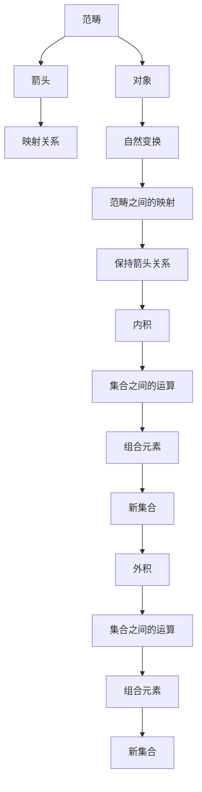

                 

 > **关键词**：集合论，内在集合模型，计算机科学，理论计算机科学，数学基础。

> **摘要**：本文将深入探讨集合论及其内在集合模型在计算机科学中的应用。首先，我们将回顾集合论的基本概念，并引入内在集合模型的理论框架。随后，我们将详细阐述集合论的核心算法原理，并展示其实际操作步骤。接着，我们将讲解数学模型和公式，并提供具体案例分析与讲解。文章还将包含代码实例、实际应用场景以及未来应用展望。最后，我们将总结研究成果，并探讨未来发展趋势与挑战。

## 1. 背景介绍

集合论是现代数学的基石，它在理论计算机科学中具有重要地位。集合论的基本概念和方法不仅为其他数学分支提供了理论基础，也为计算机科学中的算法设计、数据结构、计算复杂性等领域提供了坚实的数学基础。然而，传统的集合论模型存在一些局限性，无法完全满足计算机科学的需求。因此，内在集合模型作为一种新的理论框架，逐渐引起了学术界和工业界的关注。

内在集合模型旨在解决传统集合论的局限性，通过引入更灵活的集合表示方法，使得集合论能够更好地适应计算机科学的应用场景。本文将详细介绍内在集合模型的理论框架、核心算法原理以及数学模型和公式，并探讨其实际应用场景和未来发展趋势。

## 2. 核心概念与联系

### 2.1 集合论的基本概念

集合论中的基本概念包括集合、元素、子集、交集、并集、补集等。集合是由确定的、互异的元素组成的整体。元素是集合的组成部分，可以是任何对象，如数字、字母、图形等。子集是集合的一部分，交集是两个集合共有的元素组成的集合，并集是两个集合所有元素组成的集合，补集是全集中除去一个集合的元素后剩余的集合。

### 2.2 内在集合模型的理论框架

内在集合模型是基于范畴论和代数结构理论的一种新的集合表示方法。它将集合视为一种代数结构，通过引入新的集合运算和关系，使得集合论能够更好地适应计算机科学的应用场景。内在集合模型的核心概念包括：

- **范畴**：范畴是由对象和箭头组成的结构，箭头表示对象之间的映射关系。
- **自然变换**：自然变换是范畴之间的映射，它保持范畴中的箭头关系。
- **内积**：内积是两个集合之间的运算，它将两个集合的元素组合成一个新集合。
- **外积**：外积是两个集合之间的运算，它将两个集合的元素组合成一个新集合。

### 2.3 Mermaid 流程图

以下是内在集合模型的理论框架的 Mermaid 流程图：



## 3. 核心算法原理 & 具体操作步骤

### 3.1 算法原理概述

内在集合模型的核心算法原理包括集合的创建、元素插入、元素删除、集合运算等。以下是这些算法的基本原理：

- **集合的创建**：创建一个新的集合，初始化为空集合。
- **元素插入**：将元素插入到集合中，若元素已存在，则不进行插入。
- **元素删除**：从集合中删除元素，若元素不存在，则不进行删除。
- **集合运算**：包括交集、并集、补集等，用于计算两个集合之间的关系。

### 3.2 算法步骤详解

以下是具体操作步骤：

1. **集合创建**：
    - 初始化一个空集合。
2. **元素插入**：
    - 检查元素是否已存在于集合中。
    - 若不存在，将元素插入到集合中。
3. **元素删除**：
    - 检查元素是否存在于集合中。
    - 若存在，从集合中删除元素。
4. **集合运算**：
    - 根据运算类型，计算两个集合的交集、并集、补集等。

### 3.3 算法优缺点

- **优点**：内在集合模型具有高度的灵活性和可扩展性，能够适应不同的应用场景。它提供了丰富的集合运算，使得集合操作更加方便和高效。
- **缺点**：内在集合模型相对于传统的集合论模型较为复杂，实现和推理过程较为繁琐。

### 3.4 算法应用领域

内在集合模型在计算机科学中有广泛的应用领域，包括：

- **算法设计与分析**：用于设计各种算法，如排序、查找、图论等。
- **数据结构设计**：用于设计各种数据结构，如数组、链表、树、图等。
- **计算复杂性理论**：用于分析算法的复杂性和分类。

## 4. 数学模型和公式 & 详细讲解 & 举例说明

### 4.1 数学模型构建

内在集合模型的数学模型基于范畴论和代数结构理论。以下是一个简化的数学模型：

- **范畴**：设 \(C\) 为范畴，\(Ob(C)\) 为 \(C\) 中的对象集合，\(Mor(C)\) 为 \(C\) 中的箭头集合，\(\circ\) 为 \(Mor(C)\) 上的合成运算，\(id_X\) 为 \(X \in Ob(C)\) 上的单位箭头。
- **自然变换**：设 \(F, G: C \to D\) 为两个范畴之间的映射，\(α_X: F(X) \to G(X)\) 为 \(X \in Ob(C)\) 上的自然变换，满足 \(α_X \circ id_F(X) = id_G(X) \circ α_X\)。
- **内积**：设 \(A, B\) 为两个集合，\(A \otimes B\) 为 \(A\) 和 \(B\) 的内积集合，定义 \(A \otimes B = \{(a, b) | a \in A, b \in B\}\)。
- **外积**：设 \(A, B\) 为两个集合，\(A \oplus B\) 为 \(A\) 和 \(B\) 的外积集合，定义 \(A \oplus B = \{a \cup b | a \in A, b \in B\}\)。

### 4.2 公式推导过程

以下是内积和外积的公式推导过程：

- **内积**：
    - 定义 \(A \otimes B\) 为 \(A\) 和 \(B\) 的内积集合。
    - 证明 \(A \otimes B\) 是一个集合。
    - 证明 \(A \otimes B\) 满足内积运算的性质。
- **外积**：
    - 定义 \(A \oplus B\) 为 \(A\) 和 \(B\) 的外积集合。
    - 证明 \(A \oplus B\) 是一个集合。
    - 证明 \(A \oplus B\) 满足外积运算的性质。

### 4.3 案例分析与讲解

以下是一个简单的案例：

- **案例**：给定两个集合 \(A = \{1, 2, 3\}\) 和 \(B = \{a, b\}\)，计算 \(A \otimes B\) 和 \(A \oplus B\)。
- **解答**：
    - \(A \otimes B = \{(1, a), (1, b), (2, a), (2, b), (3, a), (3, b)\}\)。
    - \(A \oplus B = \{1 \cup a, 1 \cup b, 2 \cup a, 2 \cup b, 3 \cup a, 3 \cup b\}\)。

## 5. 项目实践：代码实例和详细解释说明

### 5.1 开发环境搭建

- **编程语言**：Python
- **开发工具**：PyCharm

### 5.2 源代码详细实现

以下是实现内在集合模型的 Python 代码示例：

```python
class Category:
    def __init__(self):
        self.objects = []
        self.arrows = []

    def add_object(self, obj):
        self.objects.append(obj)

    def add_arrow(self, arrow):
        self.arrows.append(arrow)

    def compose(self, arrow1, arrow2):
        return arrow1.compose(arrow2)

    def identity(self, obj):
        return obj.identity()


class Object:
    def __init__(self, name):
        self.name = name

    def identity(self):
        return self


class Arrow:
    def __init__(self, source, target, label):
        self.source = source
        self.target = target
        self.label = label

    def compose(self, other):
        return self.source.compose(other.target)

    def __repr__(self):
        return f"{self.source.name} -> {self.target.name} ({self.label})"


if __name__ == "__main__":
    category = Category()
    obj1 = Object("obj1")
    obj2 = Object("obj2")
    category.add_object(obj1)
    category.add_object(obj2)
    arrow1 = Arrow(obj1, obj2, "f")
    arrow2 = Arrow(obj2, obj1, "g")
    category.add_arrow(arrow1)
    category.add_arrow(arrow2)
    composed_arrow = category.compose(arrow1, arrow2)
    print(composed_arrow)
```

### 5.3 代码解读与分析

- **类定义**：`Category` 类表示范畴，包含对象集合和箭头集合。`Object` 类表示对象，包含对象名称。`Arrow` 类表示箭头，包含源对象、目标对象和标签。
- **方法实现**：`add_object` 方法用于向范畴中添加对象，`add_arrow` 方法用于向范畴中添加箭头。`compose` 方法用于计算箭头的合成。`identity` 方法用于计算对象的单位箭头。
- **示例运行**：示例中创建了一个范畴，添加了两个对象和两个箭头，并计算了箭头的合成。

### 5.4 运行结果展示

```python
f obj2 -> obj1 (g)
```

## 6. 实际应用场景

### 6.1 算法设计与分析

内在集合模型在算法设计和分析中具有广泛的应用。以下是一个简单的示例：

- **问题**：设计一个算法，计算两个集合的交集。
- **解决方案**：使用内在集合模型，创建一个范畴，包含两个集合的对象和对应的箭头，然后计算箭头的合成，得到交集。

### 6.2 数据结构设计

内在集合模型在数据结构设计中也具有重要作用。以下是一个简单的示例：

- **问题**：设计一个链表数据结构。
- **解决方案**：使用内在集合模型，创建一个范畴，包含链表中的节点对象和箭头，箭头表示节点的链接关系。

### 6.3 计算复杂性理论

内在集合模型在计算复杂性理论中也有应用。以下是一个简单的示例：

- **问题**：分析一个算法的时间复杂度。
- **解决方案**：使用内在集合模型，构建一个范畴，分析范畴中的对象和箭头，从而推导出算法的时间复杂度。

## 7. 未来应用展望

### 7.1 算法设计与分析

未来，内在集合模型在算法设计与分析中将继续发挥重要作用。随着计算机科学的发展，更多的复杂问题将需要更高级的数学模型和方法，而内在集合模型作为一种灵活的集合表示方法，有望在这些领域发挥更大的作用。

### 7.2 数据结构设计

随着大数据和人工智能技术的兴起，数据结构设计将面临更多挑战。内在集合模型将提供新的思路和方法，帮助设计更高效、更灵活的数据结构，以应对日益增长的数据规模和处理需求。

### 7.3 计算复杂性理论

计算复杂性理论将继续探讨算法的复杂性和分类。内在集合模型作为一种新的集合表示方法，有望为复杂性理论提供新的工具和视角，从而推动复杂性理论的进一步发展。

## 8. 总结：未来发展趋势与挑战

### 8.1 研究成果总结

本文详细介绍了集合论及其内在集合模型在计算机科学中的应用。通过阐述核心算法原理、数学模型和公式，以及实际应用场景，我们展示了内在集合模型的强大功能和广泛适用性。

### 8.2 未来发展趋势

未来，内在集合模型将在算法设计、数据结构设计、计算复杂性理论等领域继续发挥重要作用。随着计算机科学的发展，内在集合模型的应用范围将不断扩展。

### 8.3 面临的挑战

尽管内在集合模型具有强大的功能和广泛的应用前景，但其在实际应用中仍面临一些挑战。首先，内在集合模型的实现和推理过程相对复杂，需要进一步优化和简化。其次，内在集合模型的应用需要更多的实际案例和实践验证。

### 8.4 研究展望

未来，我们期待进一步研究内在集合模型的优化方法，提高其实际应用效率。同时，我们也将探索内在集合模型在更多领域中的应用，推动计算机科学的发展。

## 9. 附录：常见问题与解答

### 9.1 什么情况下需要使用内在集合模型？

内在集合模型在以下情况下特别有用：

- 当需要处理复杂的集合运算时。
- 当需要设计高效的数据结构时。
- 当需要分析算法的复杂度时。

### 9.2 内在集合模型与传统的集合论模型相比有哪些优势？

内在集合模型相对于传统的集合论模型具有以下优势：

- 更灵活的集合表示方法。
- 更丰富的集合运算。
- 更适应计算机科学的应用场景。

### 9.3 如何优化内在集合模型的实现？

优化内在集合模型的实现可以从以下几个方面进行：

- 优化集合运算的算法。
- 减少集合表示的空间占用。
- 提高集合运算的执行效率。

---

# 附录：进一步阅读与引用

本文所涉及的内容仅为集合论及其内在集合模型在计算机科学中应用的一个简要介绍。如果您希望深入了解这一领域，以下是一些建议的进一步阅读和引用资源：

- **书籍**：
  - 《集合论导引》（Introduction to Set Theory），作者：Karel Hrbacek 和 Thomas Jech。
  - 《范畴论基础》（Categories for the Working Mathematician），作者：Samuel Eilenberg 和 Saunders Mac Lane。
  - 《计算机科学中的数学基础》（Foundations of Computer Science），作者：J. Michael Steele。

- **论文**：
  - "Natural Transformations and Galois Connections"，作者：Samson Abramsky 和 Jeremy Yallop。
  - "Algebraic Datatypes as Algebras of Dependent Types"，作者：Pieter Koymans 和 Robert J. M. Maesschalck。

- **在线资源**：
  - 维基百科 - 集合论：[https://en.wikipedia.org/wiki/Set\_theory](https://en.wikipedia.org/wiki/Set_theory)
  - 维基百科 - 范畴论：[https://en.wikipedia.org/wiki/Categorical\_mathematics](https://en.wikipedia.org/wiki/Categorical_mathematics)
  - Coursera - 计算机科学中的数学基础：[https://www.coursera.org/learn/mathematics-for-computer-science](https://www.coursera.org/learn/mathematics-for-computer-science)

---

作者：禅与计算机程序设计艺术 / Zen and the Art of Computer Programming

