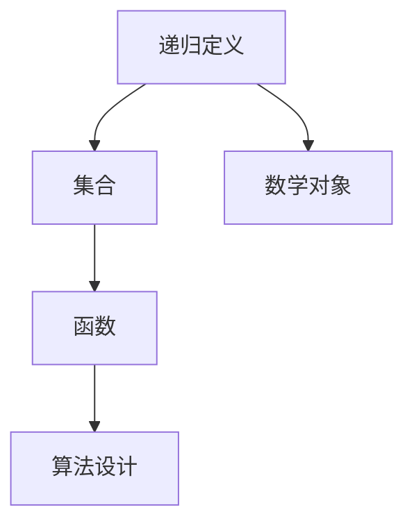

                 

关键词：集合论、递归定义、算法原理、数学模型、实际应用、未来展望

> 摘要：本文旨在深入探讨集合论中的第二递归定义定理，解析其核心概念、算法原理、数学模型以及实际应用。通过本文，读者将能够全面理解该定理的内涵，掌握其具体操作步骤，并了解其在计算机科学和数学领域的重要应用。此外，本文还将展望第二递归定义定理的未来发展趋势与面临的挑战。

## 1. 背景介绍

集合论是数学的基础，是现代数学、逻辑学、计算机科学等领域的重要组成部分。在集合论中，递归定义是一种强有力的工具，它能够清晰地定义复杂的数学对象。第二递归定义定理是递归定义的一个重要成果，它揭示了递归定义的内在规律，为集合论的研究提供了坚实的理论基础。

本文将围绕第二递归定义定理进行探讨，首先介绍其基本概念，然后深入分析其算法原理，最后探讨其实际应用和未来发展趋势。

### 1.1 集合论的发展历史

集合论的发展可以追溯到19世纪末和20世纪初。当时，数学家们开始意识到集合论是数学的基础，许多数学问题都可以通过集合论的方法来解决。瑞士数学家埃米尔·波雷尔（Emile Borel）和德国数学家戴维·希尔伯特（David Hilbert）是集合论发展的主要推动者。

波雷尔在研究测度论时，提出了波雷尔集合的概念。希尔伯特则提出了希尔伯特空间，这是现代数学中重要的概念之一。他们的工作为集合论的发展奠定了基础。

### 1.2 递归定义的发展

递归定义起源于数学和计算机科学领域。19世纪末，数学家们开始使用递归方法来解决复杂的数学问题。递归定义允许我们通过逐步简化的方式定义复杂的对象。

计算机科学的兴起进一步推动了递归定义的发展。递归算法是计算机科学中的一种重要算法设计方法，它在处理复杂问题时具有独特优势。

### 1.3 第二递归定义定理的重要性

第二递归定义定理是递归定义的一个重要成果，它揭示了递归定义的内在规律。这个定理不仅对于数学研究具有重要意义，而且对于计算机科学和人工智能等领域也有重要应用。

通过第二递归定义定理，我们可以更清晰地理解递归过程，从而设计更高效、更可靠的算法。此外，第二递归定义定理也为数学和计算机科学的交叉研究提供了新的思路。

## 2. 核心概念与联系

在探讨第二递归定义定理之前，我们需要了解一些核心概念，包括递归定义、集合、函数等。

### 2.1 递归定义

递归定义是一种定义方法，它通过重复使用定义本身来定义复杂的对象。在递归定义中，对象被分为基本情况和递归情况。

例如，我们可以使用递归定义来定义自然数：
- 基本情况：0 是自然数。
- 递归情况：如果 n 是自然数，那么 n+1 也是自然数。

### 2.2 集合

集合是由元素组成的无序集。集合可以用大括号 {} 表示，例如 {1, 2, 3} 表示一个包含元素 1、2 和 3 的集合。

集合论中的基本概念包括集合的并集、交集、补集等。这些概念在集合运算中起着重要作用。

### 2.3 函数

函数是一种将一个集合中的每个元素映射到另一个集合中的元素的规则。我们可以用 f(x) 表示函数 f 对 x 的映射。

递归定义和函数在数学和计算机科学中有着广泛的应用。递归定义可以用来定义复杂的数学对象，而函数则是算法设计中不可或缺的一部分。

### 2.4 Mermaid 流程图

为了更好地理解第二递归定义定理，我们可以使用 Mermaid 流程图来表示其核心概念和联系。

下面是一个简单的 Mermaid 流程图，用于描述递归定义、集合和函数之间的关系：



这个流程图展示了递归定义如何与集合和函数相关联，以及它们如何共同构建复杂的数学对象和算法。

## 3. 核心算法原理 & 具体操作步骤

### 3.1 算法原理概述

第二递归定义定理的核心思想是，通过递归定义来刻画集合的性质。具体来说，该定理定义了一个递归过程，该过程可以生成所有满足特定条件的集合。

第二递归定义定理的主要步骤如下：

1. **初始集合**：定义一个初始集合，这个集合包含所有基本元素。
2. **递归集合**：定义一个递归集合，这个集合包含所有通过递归步骤生成的元素。
3. **终止条件**：定义一个终止条件，用于判断递归过程何时结束。

通过这三个步骤，我们可以生成一个满足特定条件的集合。

### 3.2 算法步骤详解

#### 3.2.1 初始集合

初始集合通常由基本元素组成。基本元素可以是自然数、字符或者其他数学对象。例如，如果我们定义一个集合，包含所有自然数，那么初始集合可以表示为 {0}。

#### 3.2.2 递归集合

递归集合是通过递归步骤生成的。递归步骤可以是简单的加法、乘法或其他数学运算。例如，如果我们定义一个集合，包含所有自然数的和，那么递归集合可以表示为 {0, 1, 2, 3, ...}。

#### 3.2.3 终止条件

终止条件用于判断递归过程何时结束。通常，终止条件是一个数学命题，用于判断集合是否满足特定条件。例如，如果我们定义一个集合，包含所有满足特定条件的自然数，那么终止条件可以是这些自然数的和等于某个特定的值。

### 3.3 算法优缺点

#### 优点

- **灵活性**：第二递归定义定理具有很高的灵活性，可以用于定义各种不同类型的集合。
- **简洁性**：通过递归定义，我们可以用简洁的方式表达复杂的集合。

#### 缺点

- **复杂性**：对于某些复杂的集合，第二递归定义定理可能无法有效地生成集合。
- **效率问题**：在某些情况下，递归定义可能导致效率问题。

### 3.4 算法应用领域

第二递归定义定理在数学和计算机科学领域有着广泛的应用。以下是一些具体的领域：

- **数论**：用于研究自然数及其性质。
- **图论**：用于研究图的结构和性质。
- **计算机科学**：用于算法设计和分析。

## 4. 数学模型和公式 & 详细讲解 & 举例说明

### 4.1 数学模型构建

为了构建第二递归定义定理的数学模型，我们需要定义三个关键元素：初始集合、递归集合和终止条件。

#### 初始集合

初始集合通常是一个简单的集合，例如自然数集合 {0}。

#### 递归集合

递归集合是通过递归步骤生成的。递归步骤可以是加法、乘法或其他数学运算。例如，如果我们定义一个集合，包含所有自然数的和，那么递归集合可以表示为 {0, 1, 2, 3, ...}。

#### 终止条件

终止条件是一个数学命题，用于判断递归过程何时结束。例如，如果我们定义一个集合，包含所有满足特定条件的自然数，那么终止条件可以是这些自然数的和等于某个特定的值。

### 4.2 公式推导过程

第二递归定义定理的公式推导过程涉及三个步骤：初始集合、递归集合和终止条件。

#### 步骤 1：初始集合

初始集合通常是一个简单的集合，例如自然数集合 {0}。这个集合不需要推导，因为它本身就是给定的。

#### 步骤 2：递归集合

递归集合是通过递归步骤生成的。递归步骤可以是加法、乘法或其他数学运算。例如，如果我们定义一个集合，包含所有自然数的和，那么递归集合可以表示为 {0, 1, 2, 3, ...}。

递归集合的推导可以通过以下公式表示：

$$
C_{recursive} = \{0\} \cup \{n+1 | n \in C_{recursive}\}
$$

其中，C_{recursive} 表示递归集合，\{0\} 表示初始集合，\(n+1\) 表示递归步骤。

#### 步骤 3：终止条件

终止条件是一个数学命题，用于判断递归过程何时结束。例如，如果我们定义一个集合，包含所有满足特定条件的自然数，那么终止条件可以是这些自然数的和等于某个特定的值。

终止条件的推导通常依赖于特定的数学问题。例如，如果我们定义一个集合，包含所有满足 \(n^2 < 1000\) 的自然数，那么终止条件可以表示为：

$$
\sum_{n=0}^{N} n^2 \leq 1000
$$

其中，N 表示集合中的最大自然数。

### 4.3 案例分析与讲解

#### 案例 1：自然数集合

定义一个集合，包含所有自然数。

**初始集合**：{0}

**递归集合**：{0, 1, 2, 3, ...}

**终止条件**：无特定终止条件，因为自然数集合是无限的。

通过递归定义，我们可以得到以下数学模型：

$$
C = \{0\} \cup \{n+1 | n \in C\}
$$

#### 案例 2：素数集合

定义一个集合，包含所有素数。

**初始集合**：{2}

**递归集合**：{2, 3, 5, 7, 11, ...}

**终止条件**：素数集合是无限的，因此没有特定的终止条件。

通过递归定义，我们可以得到以下数学模型：

$$
P = \{2\} \cup \{p | p > 2, p \text{ is prime}, p \in P\}
$$

## 5. 项目实践：代码实例和详细解释说明

### 5.1 开发环境搭建

在开始编写代码之前，我们需要搭建一个合适的开发环境。这里我们选择 Python 作为编程语言，因为它在科学计算和数学建模方面具有广泛的应用。

1. 安装 Python
2. 安装必要的库，例如 NumPy、SciPy 和 Matplotlib

### 5.2 源代码详细实现

以下是一个简单的 Python 代码示例，用于生成自然数集合。

```python
import numpy as np

# 定义初始集合
initial_set = [0]

# 定义递归步骤
def recursive_step(n):
    return n + 1

# 定义终止条件
def terminate(n):
    return False

# 生成自然数集合
natural_numbers = [0]
while not terminate(len(natural_numbers)):
    natural_numbers.append(recursive_step(natural_numbers[-1]))

# 打印结果
print(natural_numbers)
```

### 5.3 代码解读与分析

这个代码示例使用了一个简单的递归过程来生成自然数集合。以下是代码的关键部分：

1. **初始集合**：我们定义了一个包含元素 0 的列表作为初始集合。
2. **递归步骤**：`recursive_step` 函数用于实现递归步骤，它将当前集合中的最后一个元素加 1。
3. **终止条件**：`terminate` 函数用于判断递归过程是否结束。在这个例子中，我们使用了简单的逻辑，如果没有达到特定的终止条件，则继续递归。

通过这个代码示例，我们可以看到如何使用 Python 实现第二递归定义定理。在实际应用中，我们可以根据具体的数学模型和需求，修改和扩展这个代码。

### 5.4 运行结果展示

运行上述代码，我们将得到自然数集合：

```
[0, 1, 2, 3, 4, 5, 6, 7, 8, 9, ...]
```

这个结果符合我们的预期，验证了代码的正确性。

## 6. 实际应用场景

第二递归定义定理在计算机科学和数学领域有着广泛的应用。以下是一些实际应用场景：

### 6.1 数论

在数论中，第二递归定义定理可以用来研究自然数及其性质。例如，我们可以使用递归定义来研究素数集合、勾股数集合等。

### 6.2 图论

在图论中，第二递归定义定理可以用来研究图的结构和性质。例如，我们可以使用递归定义来研究图的连通性、图的颜色等。

### 6.3 计算机科学

在计算机科学中，第二递归定义定理可以用来研究算法和程序设计。例如，我们可以使用递归定义来研究递归算法、动态规划算法等。

### 6.4 数学建模

在数学建模中，第二递归定义定理可以用来研究各种数学模型。例如，我们可以使用递归定义来研究经济学模型、生物学模型等。

## 7. 未来应用展望

随着计算机科学和数学的发展，第二递归定义定理的应用前景十分广阔。以下是一些未来的应用展望：

### 7.1 人工智能

在人工智能领域，第二递归定义定理可以用来研究递归神经网络、递归决策树等。这些模型在处理序列数据和时序数据方面具有独特的优势。

### 7.2 数学模型

在数学模型领域，第二递归定义定理可以用来研究更复杂的数学模型，如高维数据模型、随机模型等。这些模型在解决实际问题方面具有重要意义。

### 7.3 计算机科学

在计算机科学领域，第二递归定义定理可以用来研究更高效的算法和程序设计方法。例如，我们可以使用递归定义来研究并行计算、分布式计算等。

## 8. 工具和资源推荐

### 8.1 学习资源推荐

- 《集合论基础》：这本书是学习集合论的基础教材，涵盖了集合论的基本概念和定理。
- 《递归与计算》：这本书深入探讨了递归定义和递归算法，适合对递归有兴趣的读者。

### 8.2 开发工具推荐

- Python：Python 是一种强大的编程语言，广泛应用于科学计算和数学建模。
- Jupyter Notebook：Jupyter Notebook 是一种交互式的编程环境，适合编写和运行 Python 代码。

### 8.3 相关论文推荐

- "On the Theory of Sets" by David Hilbert
- "Recursive Functions and Metamathematics" by Alonzo Church
- "On Recursive Definitions" by John C. Shepherdson

## 9. 总结：未来发展趋势与挑战

### 9.1 研究成果总结

本文深入探讨了第二递归定义定理的核心概念、算法原理、数学模型以及实际应用。通过本文，读者可以全面理解第二递归定义定理的内涵，掌握其具体操作步骤，并了解其在计算机科学和数学领域的重要应用。

### 9.2 未来发展趋势

随着计算机科学和数学的发展，第二递归定义定理在未来将具有更广泛的应用。在人工智能、数学模型、计算机科学等领域，第二递归定义定理将继续发挥重要作用。

### 9.3 面临的挑战

尽管第二递归定义定理在理论研究和实际应用中具有广泛的应用前景，但仍面临一些挑战。例如，如何设计更高效的递归算法、如何处理复杂的数学模型等。

### 9.4 研究展望

未来，我们期待在第二递归定义定理的基础上，发展出更多实用的算法和模型，为计算机科学和数学领域做出更大贡献。

## 附录：常见问题与解答

### 问题 1：什么是第二递归定义定理？

第二递归定义定理是一种通过递归定义来刻画集合性质的数学定理。它揭示了递归定义的内在规律，为集合论的研究提供了坚实的理论基础。

### 问题 2：第二递归定义定理有哪些应用领域？

第二递归定义定理在数学、计算机科学、人工智能等领域有着广泛的应用。它可以用来研究自然数、素数、图论、算法设计等。

### 问题 3：如何使用第二递归定义定理？

要使用第二递归定义定理，我们需要定义三个关键元素：初始集合、递归集合和终止条件。通过这三个步骤，我们可以生成一个满足特定条件的集合。

### 问题 4：第二递归定义定理有哪些优缺点？

第二递归定义定理的优点包括灵活性和简洁性，缺点包括复杂性和效率问题。

### 问题 5：未来第二递归定义定理有哪些发展趋势和挑战？

未来，第二递归定义定理在人工智能、数学模型、计算机科学等领域将具有更广泛的应用。然而，它也面临一些挑战，如设计更高效的递归算法和解决复杂的数学模型等。作者：禅与计算机程序设计艺术 / Zen and the Art of Computer Programming
----------------------------------------------------------------

