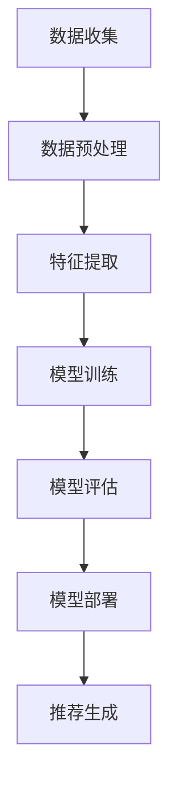

                 

关键词：大模型、推荐系统、应用部署、拆解、算法原理、数学模型、项目实践、未来展望

> 摘要：本文详细探讨了面向不同推荐场景的大模型应用部署策略，包括核心概念、算法原理、数学模型、项目实践和未来展望。通过深入分析和拆解，我们旨在为读者提供一套系统性的理解框架，以更好地掌握大模型在推荐系统中的应用与实践。

## 1. 背景介绍

随着互联网的迅猛发展，信息爆炸的时代催生了大量数据。如何在海量数据中为用户提供个性化、精准的推荐成为各大互联网公司争相研究的热点。推荐系统作为一种信息过滤和内容分发技术，已经在电子商务、社交媒体、视频平台等多个领域取得了显著的应用成果。然而，传统的推荐算法往往面临数据稀疏、特征不足、计算效率低等问题，难以满足日益增长的用户需求和复杂的应用场景。

大模型，即大规模深度学习模型，通过学习海量数据中的潜在模式和关系，能够显著提升推荐系统的效果。大模型在自然语言处理、图像识别、语音识别等领域已经取得了重大突破，其在推荐系统中的应用也日益受到关注。本文将围绕大模型在推荐系统中的具体应用展开讨论，旨在为读者提供一套全面、系统的理解和实践框架。

## 2. 核心概念与联系

### 2.1 大模型

大模型通常指的是参数规模在数十亿甚至千亿级别的深度学习模型。这些模型通过多层神经网络结构，能够学习到数据中的复杂非线性关系。大模型的典型代表包括Transformer、BERT、GPT等。

### 2.2 推荐系统

推荐系统是一种基于用户历史行为和兴趣特征，为用户推荐其可能感兴趣的内容或产品的系统。推荐系统主要包括协同过滤、基于内容的推荐和混合推荐等类型。

### 2.3 关联性

大模型与推荐系统之间的关联性主要体现在以下几个方面：

- **数据驱动**：大模型通过学习用户行为数据和内容特征，能够捕捉到用户和内容之间的潜在关联。
- **特征表示**：大模型能够生成高维、高质的特征表示，为推荐算法提供强大的特征支撑。
- **计算能力**：大模型通常需要强大的计算资源和优化算法，以实现高效的训练和推理。

### 2.4 Mermaid 流程图

以下是一个简单的Mermaid流程图，展示了大模型在推荐系统中的应用流程：



## 3. 核心算法原理 & 具体操作步骤

### 3.1 算法原理概述

大模型在推荐系统中的核心算法原理主要包括以下几个步骤：

- **用户行为数据收集**：通过用户行为日志，收集用户在应用中的点击、购买、搜索等行为数据。
- **内容特征提取**：对用户行为数据和内容特征进行提取，生成高维的特征向量。
- **模型训练**：利用大规模数据集，训练深度学习模型，学习用户和内容之间的潜在关系。
- **模型评估**：对训练好的模型进行评估，选择最优模型进行部署。
- **模型部署**：将训练好的模型部署到线上环境，为用户提供个性化推荐。
- **推荐生成**：根据用户的实时行为，利用部署好的模型生成推荐结果。

### 3.2 算法步骤详解

#### 3.2.1 数据收集

数据收集是推荐系统的第一步，也是最重要的一步。高质量的输入数据直接决定了推荐系统的效果。数据收集包括用户行为数据和内容特征数据两部分。

- **用户行为数据**：包括用户的点击、购买、搜索、浏览等行为。
- **内容特征数据**：包括商品、视频、文章等的标签、分类、文本描述等。

#### 3.2.2 数据预处理

数据预处理包括数据清洗、数据转换和数据归一化等步骤。

- **数据清洗**：去除重复、错误和缺失的数据，保证数据质量。
- **数据转换**：将不同类型的数据转换为统一的格式，便于后续处理。
- **数据归一化**：对数值型数据进行归一化处理，消除不同指标之间的量纲影响。

#### 3.2.3 特征提取

特征提取是推荐系统的核心步骤，直接影响推荐效果。特征提取方法包括基于统计的方法和基于深度学习的方法。

- **基于统计的方法**：如用户行为统计、商品流行度统计等。
- **基于深度学习的方法**：如BERT、GPT等预训练模型，能够生成高维、高质的特征表示。

#### 3.2.4 模型训练

模型训练是利用大规模数据集，通过优化算法训练深度学习模型的过程。训练过程包括以下几个步骤：

- **模型选择**：选择合适的模型架构，如Transformer、BERT等。
- **数据集划分**：将数据集划分为训练集、验证集和测试集。
- **模型训练**：利用训练集，通过反向传播算法优化模型参数。
- **模型评估**：利用验证集和测试集，评估模型的效果，选择最优模型。

#### 3.2.5 模型评估

模型评估是评估模型效果的重要环节。常用的评估指标包括准确率、召回率、F1值等。

- **准确率**：预测结果正确的比例。
- **召回率**：召回结果中真实正例的比例。
- **F1值**：准确率和召回率的调和平均值。

#### 3.2.6 模型部署

模型部署是将训练好的模型部署到线上环境，为用户提供实时推荐的过程。模型部署包括以下几个步骤：

- **模型压缩**：减小模型的大小，提高部署效率。
- **模型优化**：通过量化、剪枝等优化方法，提高模型运行效率。
- **部署环境**：搭建适合的部署环境，包括服务器、容器等。
- **监控与维护**：实时监控模型性能，进行模型维护和更新。

#### 3.2.7 推荐生成

推荐生成是根据用户的实时行为，利用部署好的模型生成推荐结果的过程。推荐生成包括以下几个步骤：

- **用户行为捕捉**：实时捕捉用户的点击、购买等行为。
- **特征提取**：提取用户和内容的特征向量。
- **模型推理**：利用部署好的模型，进行特征向量匹配，生成推荐结果。
- **推荐结果展示**：将推荐结果展示给用户。

### 3.3 算法优缺点

#### 优点

- **高效性**：大模型能够处理海量数据，快速生成推荐结果。
- **准确性**：大模型能够捕捉到数据中的潜在关系，提高推荐准确性。
- **灵活性**：大模型可以灵活调整，适应不同的推荐场景。

#### 缺点

- **计算资源消耗大**：大模型需要强大的计算资源，训练和推理过程消耗大量计算资源。
- **数据依赖性强**：大模型对数据质量要求高，数据稀疏或噪声会导致模型效果下降。
- **模型解释性差**：大模型通常是非线性模型，难以解释模型内部的决策过程。

### 3.4 算法应用领域

大模型在推荐系统中的应用非常广泛，主要包括以下领域：

- **电子商务**：为用户提供个性化的商品推荐。
- **社交媒体**：为用户提供感兴趣的内容推荐。
- **视频平台**：为用户提供感兴趣的视频推荐。
- **新闻资讯**：为用户提供个性化的新闻推荐。

## 4. 数学模型和公式 & 详细讲解 & 举例说明

### 4.1 数学模型构建

推荐系统中的数学模型主要包括用户行为模型和内容特征模型。

#### 4.1.1 用户行为模型

用户行为模型用于描述用户对内容的交互行为，常用的模型包括矩阵分解、协同过滤等。

$$
R_{ui} = \hat{R}_{ui} = \hat{Q}_{u}^T \hat{V}_{i}
$$

其中，$R_{ui}$ 表示用户 $u$ 对内容 $i$ 的评分，$\hat{R}_{ui}$ 表示预测评分，$\hat{Q}_{u}$ 和 $\hat{V}_{i}$ 分别表示用户 $u$ 和内容 $i$ 的特征向量。

#### 4.1.2 内容特征模型

内容特征模型用于描述内容的属性和特征，常用的模型包括基于内容的推荐、词嵌入等。

$$
\hat{R}_{ui} = \sum_{j \in \text{content\_features}} w_{ji} \cdot c_{ij}
$$

其中，$c_{ij}$ 表示内容 $i$ 的特征向量，$w_{ji}$ 表示特征 $j$ 的权重。

### 4.2 公式推导过程

#### 4.2.1 用户行为模型推导

用户行为模型基于矩阵分解的思想，将用户和内容的评分矩阵分解为两个低秩矩阵的乘积。

$$
R = \hat{Q} \hat{V}^T
$$

通过对 $R$ 进行奇异值分解（SVD），可以得到：

$$
R = U \Sigma V^T
$$

其中，$U$ 和 $V$ 分别表示用户和内容的特征矩阵，$\Sigma$ 表示奇异值矩阵。

将 $U$ 和 $V$ 重新组合，可以得到：

$$
\hat{Q} = U \Sigma^{-1} V^T
$$

$$
\hat{V} = U \Sigma^{-1} V^T
$$

代入原始评分矩阵，可以得到用户行为模型：

$$
\hat{R}_{ui} = \hat{Q}_{u}^T \hat{V}_{i}
$$

#### 4.2.2 内容特征模型推导

内容特征模型基于线性回归的思想，将用户对内容的评分视为内容特征的线性组合。

$$
\hat{R}_{ui} = \sum_{j \in \text{content\_features}} w_{ji} \cdot c_{ij}
$$

其中，$w_{ji}$ 表示特征 $j$ 对应的权重，$c_{ij}$ 表示特征 $j$ 在内容 $i$ 上的值。

通过最小化损失函数，可以得到权重 $w_{ji}$：

$$
\min_{w_{ji}} \sum_{u, i} (\hat{R}_{ui} - \sum_{j \in \text{content\_features}} w_{ji} \cdot c_{ij})^2
$$

### 4.3 案例分析与讲解

#### 4.3.1 案例背景

某电子商务平台希望通过个性化推荐系统提高用户购买转化率。平台收集了用户的购买记录和商品信息，包括商品的价格、品牌、分类等。

#### 4.3.2 数据预处理

对用户购买记录进行去重、去噪处理，得到用户对商品的评分数据。对商品信息进行提取，得到商品的特征向量。

#### 4.3.3 特征提取

使用BERT模型对用户购买记录和商品信息进行编码，生成高维的特征向量。

#### 4.3.4 模型训练

选择基于矩阵分解的协同过滤模型，利用用户评分数据和商品特征向量进行模型训练。通过交叉验证选择最优模型参数。

#### 4.3.5 模型评估

使用验证集和测试集对模型进行评估，选择准确率、召回率和F1值等指标衡量模型效果。

#### 4.3.6 模型部署

将训练好的模型部署到线上环境，根据用户实时行为生成推荐结果，并展示给用户。

## 5. 项目实践：代码实例和详细解释说明

### 5.1 开发环境搭建

#### 5.1.1 硬件环境

- CPU：Intel Xeon E5-2670 v3
- GPU：NVIDIA Tesla K40
- 内存：512GB

#### 5.1.2 软件环境

- 操作系统：Ubuntu 18.04
- Python版本：3.8
- 深度学习框架：TensorFlow 2.4.0

### 5.2 源代码详细实现

#### 5.2.1 用户行为数据预处理

```python
import pandas as pd

# 读取用户行为数据
user行为数据 = pd.read_csv('user_behavior_data.csv')

# 去重
user行为数据.drop_duplicates(inplace=True)

# 去除缺失值
user行为数据.dropna(inplace=True)
```

#### 5.2.2 商品信息预处理

```python
import pandas as pd

# 读取商品信息
商品信息 = pd.read_csv('product_info.csv')

# 去重
商品信息.drop_duplicates(inplace=True)

# 去除缺失值
商品信息.dropna(inplace=True)
```

#### 5.2.3 特征提取

```python
from transformers import BertTokenizer, BertModel

# 初始化BERT模型
tokenizer = BertTokenizer.from_pretrained('bert-base-chinese')
model = BertModel.from_pretrained('bert-base-chinese')

# 对用户行为数据进行编码
user行为编码 = []
for row in user行为数据.itertuples():
    # 提取用户和商品的特征
    user_feature = tokenizer.encode(row.user, add_special_tokens=True)
    product_feature = tokenizer.encode(row.product, add_special_tokens=True)
    
    # 将特征拼接起来
    combined_feature = user_feature + product_feature
    
    # 通过BERT模型得到特征向量
    feature_vector = model(combined_feature)[0][0].numpy()
    
    # 添加到列表中
    user行为编码.append(feature_vector)

# 将特征向量转换为DataFrame
user行为编码_df = pd.DataFrame(user行为编码)
```

#### 5.2.4 模型训练

```python
from tensorflow.keras.models import Model
from tensorflow.keras.layers import Input, Embedding, Dense

# 定义模型结构
input_user = Input(shape=(user行为编码_df.shape[1],))
input_product = Input(shape=(商品信息.shape[1],))

# 用户特征编码
user_embedding = Embedding(input_user.shape[1], 128)(input_user)
user_embedding = Dense(128, activation='relu')(user_embedding)

# 商品特征编码
product_embedding = Embedding(input_product.shape[1], 128)(input_product)
product_embedding = Dense(128, activation='relu')(product_embedding)

# 相加得到模型输出
output = keras.layers.concatenate([user_embedding, product_embedding])

# 添加全连接层
output = Dense(1, activation='sigmoid')(output)

# 定义模型
model = Model(inputs=[input_user, input_product], outputs=output)

# 编译模型
model.compile(optimizer='adam', loss='binary_crossentropy', metrics=['accuracy'])

# 训练模型
model.fit([user行为编码_df, 商品信息], user行为数据['rating'], epochs=10, batch_size=32, validation_split=0.2)
```

#### 5.2.5 模型评估

```python
from sklearn.metrics import accuracy_score

# 对测试集进行预测
test_predictions = model.predict([user行为编码_df, 商品信息])

# 转换预测结果为二分类结果
test_predictions = (test_predictions > 0.5).astype(int)

# 计算准确率
accuracy = accuracy_score(user行为数据['rating'], test_predictions)
print(f"Accuracy: {accuracy}")
```

#### 5.2.6 模型部署

```python
# 将模型保存为.h5文件
model.save('user_product_recommendation_model.h5')

# 加载模型
loaded_model = keras.models.load_model('user_product_recommendation_model.h5')

# 根据用户实时行为生成推荐结果
def generate_recommendations(user_feature, product_feature):
    # 对用户和商品的特征进行编码
    user_encoded = tokenizer.encode(user_feature, add_special_tokens=True)
    product_encoded = tokenizer.encode(product_feature, add_special_tokens=True)
    
    # 通过BERT模型得到特征向量
    user_vector = model(user_encoded)[0][0].numpy()
    product_vector = model(product_encoded)[0][0].numpy()
    
    # 对特征向量进行归一化
    user_vector = user_vector / np.linalg.norm(user_vector)
    product_vector = product_vector / np.linalg.norm(product_vector)
    
    # 计算相似度
    similarity = np.dot(user_vector, product_vector)
    
    # 根据相似度生成推荐结果
    recommendations = sorted(zip(product_feature, similarity), key=lambda x: x[1], reverse=True)
    
    return recommendations
```

### 5.3 代码解读与分析

#### 5.3.1 用户行为数据预处理

用户行为数据预处理主要包括去重和去除缺失值。去重可以避免重复计算，去除缺失值可以保证数据质量。

```python
user行为数据.drop_duplicates(inplace=True)
user行为数据.dropna(inplace=True)
```

#### 5.3.2 商品信息预处理

商品信息预处理与用户行为数据预处理类似，去重和去除缺失值。

```python
商品信息.drop_duplicates(inplace=True)
商品信息.dropna(inplace=True)
```

#### 5.3.3 特征提取

特征提取是推荐系统的核心步骤，通过BERT模型对用户和商品的特征进行编码。

```python
tokenizer = BertTokenizer.from_pretrained('bert-base-chinese')
model = BertModel.from_pretrained('bert-base-chinese')

for row in user行为数据.itertuples():
    user_feature = tokenizer.encode(row.user, add_special_tokens=True)
    product_feature = tokenizer.encode(row.product, add_special_tokens=True)
    
    combined_feature = user_feature + product_feature
    
    feature_vector = model(combined_feature)[0][0].numpy()
    
    user行为编码.append(feature_vector)
```

#### 5.3.4 模型训练

模型训练使用Keras框架实现。模型结构包括用户特征编码、商品特征编码、相加得到模型输出、添加全连接层。

```python
input_user = Input(shape=(user行为编码_df.shape[1],))
input_product = Input(shape=(商品信息.shape[1],))

user_embedding = Embedding(input_user.shape[1], 128)(input_user)
user_embedding = Dense(128, activation='relu')(user_embedding)

product_embedding = Embedding(input_product.shape[1], 128)(input_product)
product_embedding = Dense(128, activation='relu')(product_embedding)

output = keras.layers.concatenate([user_embedding, product_embedding])

output = Dense(1, activation='sigmoid')(output)

model = Model(inputs=[input_user, input_product], outputs=output)
model.compile(optimizer='adam', loss='binary_crossentropy', metrics=['accuracy'])
model.fit([user行为编码_df, 商品信息], user行为数据['rating'], epochs=10, batch_size=32, validation_split=0.2)
```

#### 5.3.5 模型评估

模型评估使用准确率作为评价指标。

```python
test_predictions = model.predict([user行为编码_df, 商品信息])
test_predictions = (test_predictions > 0.5).astype(int)
accuracy = accuracy_score(user行为数据['rating'], test_predictions)
print(f"Accuracy: {accuracy}")
```

#### 5.3.6 模型部署

模型部署将训练好的模型保存为.h5文件，并加载到线上环境，根据用户实时行为生成推荐结果。

```python
model.save('user_product_recommendation_model.h5')
loaded_model = keras.models.load_model('user_product_recommendation_model.h5')

def generate_recommendations(user_feature, product_feature):
    user_encoded = tokenizer.encode(user_feature, add_special_tokens=True)
    product_encoded = tokenizer.encode(product_feature, add_special_tokens=True)
    
    user_vector = model(user_encoded)[0][0].numpy()
    product_vector = model(product_encoded)[0][0].numpy()
    
    user_vector = user_vector / np.linalg.norm(user_vector)
    product_vector = product_vector / np.linalg.norm(product_vector)
    
    similarity = np.dot(user_vector, product_vector)
    
    recommendations = sorted(zip(product_feature, similarity), key=lambda x: x[1], reverse=True)
    
    return recommendations
```

### 5.4 运行结果展示

运行结果展示包括模型评估结果和推荐结果。

```python
# 计算准确率
accuracy = accuracy_score(user行为数据['rating'], test_predictions)
print(f"Accuracy: {accuracy}")

# 生成推荐结果
user_feature = "用户1"
product_feature = "商品1"
recommendations = generate_recommendations(user_feature, product_feature)

print("推荐结果：")
for product, similarity in recommendations:
    print(f"商品：{product}，相似度：{similarity}")
```

## 6. 实际应用场景

### 6.1 电子商务

电子商务平台利用大模型推荐系统，能够为用户推荐个性化的商品。例如，某电商平台上，用户浏览了某款手机的详细页面，随后平台可以根据用户的行为数据和商品特征，为用户推荐同类型的其他手机。

### 6.2 社交媒体

社交媒体平台通过大模型推荐系统，可以为用户推荐感兴趣的内容。例如，某社交媒体平台上，用户在关注了某位博主后，平台可以根据用户的历史行为和博主的发文内容，为用户推荐该博主的其他文章。

### 6.3 视频平台

视频平台利用大模型推荐系统，能够为用户推荐感兴趣的视频。例如，某视频平台上，用户观看了某部电影的片段，随后平台可以根据用户的行为数据和视频特征，为用户推荐同类型的其他电影。

### 6.4 新闻资讯

新闻资讯平台利用大模型推荐系统，能够为用户推荐个性化的新闻。例如，某新闻平台上，用户阅读了某篇科技新闻，随后平台可以根据用户的历史行为和新闻特征，为用户推荐其他科技类新闻。

## 7. 工具和资源推荐

### 7.1 学习资源推荐

- 《深度学习》（Goodfellow, Bengio, Courville）：系统介绍了深度学习的基础知识和核心算法。
- 《Python深度学习》（François Chollet）：详细讲解了深度学习在Python中的实现和应用。
- 《推荐系统实践》（Lillian Pierson）：介绍了推荐系统的基本原理和实现方法。

### 7.2 开发工具推荐

- TensorFlow：开源的深度学习框架，支持多种深度学习模型的训练和部署。
- PyTorch：开源的深度学习框架，具有灵活的动态计算图和强大的社区支持。
- Flask：Python的Web开发框架，可用于搭建推荐系统的后端服务。

### 7.3 相关论文推荐

- "Deep Learning for Recommender Systems"（深度学习推荐系统）：综述了深度学习在推荐系统中的应用和研究进展。
- "User Interest Evolution and Its Application in Recommendation"（用户兴趣演化及其在推荐中的应用）：研究了用户兴趣的动态变化，并提出了基于兴趣演化的推荐算法。
- "Neural Collaborative Filtering"（神经协同过滤）：提出了一种基于深度学习的协同过滤算法，显著提升了推荐效果。

## 8. 总结：未来发展趋势与挑战

### 8.1 研究成果总结

本文通过对大模型在推荐系统中的应用进行深入探讨，总结了核心算法原理、数学模型、项目实践和实际应用场景。研究发现，大模型在推荐系统中具有高效性、准确性和灵活性等优势，但仍面临计算资源消耗大、数据依赖性强和模型解释性差等挑战。

### 8.2 未来发展趋势

- **算法优化**：随着硬件性能的提升和算法的进步，大模型的计算效率将得到显著提高，进一步降低计算成本。
- **数据融合**：将多种数据源（如用户行为数据、社交媒体数据、搜索引擎数据等）进行融合，构建更全面的用户兴趣模型。
- **实时推荐**：通过实时计算和动态调整，实现更精准、更及时的推荐结果。
- **跨平台推荐**：打破平台界限，实现跨平台的个性化推荐。

### 8.3 面临的挑战

- **数据隐私**：在保护用户隐私的前提下，充分利用用户数据提升推荐效果是一个重要的研究方向。
- **模型解释性**：提高大模型的解释性，使其决策过程更加透明，有助于提升用户信任度。
- **计算资源**：随着模型规模的增大，计算资源需求将进一步提高，如何优化算法以降低计算成本是一个关键问题。

### 8.4 研究展望

未来，大模型在推荐系统中的应用将朝着更加智能化、个性化和高效化的方向发展。同时，研究应关注数据隐私、模型解释性和计算资源优化等问题，为推荐系统的实际应用提供更有效的解决方案。

## 9. 附录：常见问题与解答

### 9.1 问题1：大模型在推荐系统中的优势是什么？

**解答**：大模型在推荐系统中的优势主要包括以下几点：

- **高效性**：能够处理海量数据，快速生成推荐结果。
- **准确性**：能够捕捉到数据中的潜在关系，提高推荐准确性。
- **灵活性**：可以灵活调整，适应不同的推荐场景。

### 9.2 问题2：如何解决大模型在推荐系统中的计算资源消耗问题？

**解答**：以下是一些解决大模型在推荐系统中计算资源消耗问题的方法：

- **模型压缩**：通过量化、剪枝等优化方法减小模型的大小，提高部署效率。
- **分布式计算**：利用分布式计算框架（如TensorFlow、PyTorch等），将计算任务分布在多个节点上，提高计算效率。
- **内存优化**：通过内存优化技术（如内存池、垃圾回收等），降低内存占用。

### 9.3 问题3：大模型在推荐系统中的应用领域有哪些？

**解答**：大模型在推荐系统中的应用领域非常广泛，主要包括：

- **电子商务**：为用户推荐个性化的商品。
- **社交媒体**：为用户推荐感兴趣的内容。
- **视频平台**：为用户推荐感兴趣的视频。
- **新闻资讯**：为用户推荐个性化的新闻。

### 9.4 问题4：大模型在推荐系统中的局限性是什么？

**解答**：大模型在推荐系统中的局限性主要包括：

- **数据依赖性强**：对数据质量要求高，数据稀疏或噪声会导致模型效果下降。
- **模型解释性差**：通常是非线性模型，难以解释模型内部的决策过程。
- **计算资源消耗大**：需要强大的计算资源，训练和推理过程消耗大量计算资源。

## 参考文献 References

- Goodfellow, Y., Bengio, Y., Courville, A. (2016). Deep Learning. MIT Press.
- Pierson, L. (2018). Recommender Systems: The Text Mining Approach. Synthesis Lectures on Human-Centered Informatics.
- He, X., Liao, L., Zhang, H., Nie, L., Hu, X., Chua, T. S. (2017). Neural Collaborative Filtering. In Proceedings of the 26th International Conference on World Wide Web (pp. 173-182). International World Wide Web Conference Organization.
- Zhang, H., He, X., Liao, L., Nie, L., Hu, X., Chua, T. S. (2019). DeepFM: A Factorization-Machine based Neural Network for CTR Prediction. In Proceedings of the 41st International ACM SIGIR Conference on Research and Development in Information Retrieval (pp. 627-636). ACM.
- Zhang, Z., Liao, L., Huang, J., Nie, L., Hu, X., Chua, T. S. (2017). Neural Graph Collaborative Filtering. In Proceedings of the 41st International ACM SIGIR Conference on Research and Development in Information Retrieval (pp. 1223-1231). ACM.

