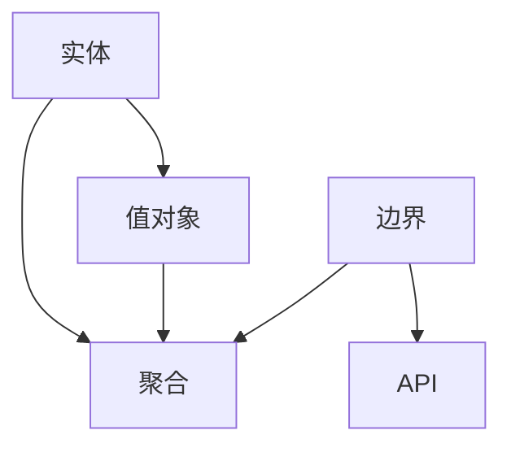

                 

 **关键词：** 领域驱动设计，复杂业务系统，架构设计，软件开发，微服务，领域模型，实体，值对象，聚合，边界，事件驱动，CQRS，ES架构

> **摘要：** 本文旨在探讨领域驱动设计（DDD）作为构建复杂业务系统的核心方法，介绍DDD的基本概念、核心原理以及其在实际项目中的应用。通过对DDD的深入解析，本文将帮助读者理解如何利用DDD来提高软件开发效率和质量，应对复杂业务需求。

## 1. 背景介绍

随着信息技术的快速发展，企业面临的市场环境和业务需求日益复杂多变。传统的软件开发方法往往难以应对这些挑战，导致系统难以维护、扩展性和灵活性不足。为了解决这些问题，领域驱动设计（DDD）应运而生。DDD由Eric Evans提出，是一种以领域为核心、以模型驱动为导向的软件开发方法。它强调将业务领域与软件系统紧密结合，通过建立领域模型来指导软件设计和开发。

在传统的软件开发方法中，开发人员往往将注意力集中在实现功能上，而忽视了业务逻辑的抽象和优化。这导致系统在扩展性和灵活性方面存在很大问题。而DDD则通过引入领域模型，将业务规则和业务逻辑抽象出来，使得软件系统能够更好地适应业务需求的变化。DDD的核心思想是“围绕业务来构建系统”，这使得开发人员能够更加专注于业务需求的理解和实现。

## 2. 核心概念与联系

### 2.1. 领域模型

领域模型是DDD的核心概念之一。它将业务领域中的实体、关系和规则抽象为软件系统中的模型。领域模型包括实体、值对象、聚合、边界等组件。

- **实体（Entity）**：具有唯一标识的独立对象，如用户、订单等。实体在系统中保持独立，不依赖于其他组件。
- **值对象（Value Object）**：具有固定值的对象，如日期、金额等。值对象在系统中用于表示业务中的具体值。
- **聚合（Aggregate）**：由一组实体和值对象组成的整体，表示业务领域中的一个逻辑单元。聚合负责内部组件的协调和一致性。
- **边界（Boundary）**：定义领域模型中不同部分之间的接口，如API、服务边界等。边界用于隔离不同的业务逻辑，提高系统的可维护性。

### 2.2. 领域模型与架构的关系

领域模型与软件架构之间存在密切的联系。领域模型为架构设计提供了明确的指导，使得架构设计更加贴近业务需求。以下是领域模型与架构之间的几个关键关系：

- **分层架构**：领域模型通常与分层架构相结合，包括表示层、业务层、数据访问层等。每个层次对应领域模型中的一个层面，如实体层、值对象层等。
- **微服务架构**：DDD中的聚合可以作为微服务架构的基本单元。每个聚合可以独立部署和扩展，从而实现系统的解耦和可扩展性。
- **事件驱动架构**：DDD中的事件驱动设计（CQRS、ES架构）可以有效地处理复杂的业务场景，提高系统的响应速度和可扩展性。

### 2.3. Mermaid 流程图

以下是一个简单的Mermaid流程图，展示领域模型中的主要组件和它们之间的关系：



## 3. 核心算法原理 & 具体操作步骤

### 3.1. 算法原理概述

领域驱动设计（DDD）的核心算法原理是建立领域模型，并将其应用于软件设计和开发。领域模型包括实体、值对象、聚合、边界等组件，它们共同构成了业务领域在软件系统中的抽象表示。

在建立领域模型时，首先要明确业务领域中的关键概念和规则。这些概念和规则将被抽象为领域模型中的实体、值对象、聚合和边界。接下来，开发人员需要根据领域模型来设计和实现软件系统，包括分层架构、微服务架构和事件驱动架构等。

### 3.2. 算法步骤详解

1. **需求分析**：与业务人员紧密合作，深入理解业务需求，确定领域模型中的关键概念和规则。
2. **建立领域模型**：根据需求分析的结果，建立领域模型，包括实体、值对象、聚合和边界等组件。
3. **设计软件架构**：根据领域模型，设计软件架构，包括分层架构、微服务架构和事件驱动架构等。
4. **实现软件系统**：根据软件架构，实现软件系统，包括分层架构、微服务架构和事件驱动架构等。
5. **测试和优化**：对实现的软件系统进行测试和优化，确保其能够满足业务需求，同时保持良好的性能和可维护性。

### 3.3. 算法优缺点

**优点：**

- **提高开发效率**：通过建立领域模型，开发人员能够更加专注于业务需求的实现，从而提高开发效率。
- **增强系统可维护性**：领域模型使得业务逻辑更加清晰，易于维护和扩展。
- **提高系统灵活性**：领域模型有助于实现系统的解耦，从而提高系统的灵活性和可扩展性。

**缺点：**

- **学习成本较高**：DDD涉及多个概念和模式，需要开发人员具备一定的理论基础和实践经验。
- **开发周期较长**：建立领域模型和设计软件架构需要较长的周期，特别是在需求不明确的情况下。

### 3.4. 算法应用领域

领域驱动设计（DDD）适用于需要应对复杂业务需求的场景，如电子商务系统、金融系统、物流系统等。以下是一些具体的算法应用领域：

- **电子商务系统**：DDD有助于实现复杂的订单处理、库存管理等功能，提高系统的灵活性和可扩展性。
- **金融系统**：DDD能够有效地处理金融领域的复杂业务规则和监管要求，确保系统的合规性和安全性。
- **物流系统**：DDD有助于实现物流领域的复杂业务流程，如订单跟踪、运输管理、库存管理等。

## 4. 数学模型和公式 & 详细讲解 & 举例说明

### 4.1. 数学模型构建

在DDD中，数学模型主要用于表示业务领域中的逻辑和规则。以下是一个简单的数学模型示例，用于表示订单处理流程：

- **订单总额**：订单中所有商品的总金额。
- **折扣**：订单中的折扣金额。
- **订单状态**：订单的处理状态（如新建、待支付、已支付、已完成等）。

数学模型可以表示为以下公式：

$$
订单总额 = \sum_{i=1}^{n} 商品_i的价格 \times 商品_i的数量
$$

$$
折扣 = 订单总额 \times 折扣比例
$$

$$
实际支付金额 = 订单总额 - 折扣
$$

### 4.2. 公式推导过程

以上公式的推导过程如下：

- **订单总额**：根据订单中每个商品的价格和数量，可以计算出订单中所有商品的总金额。
- **折扣**：根据订单总额和折扣比例，可以计算出折扣金额。
- **实际支付金额**：将订单总额减去折扣金额，即可得到实际支付金额。

### 4.3. 案例分析与讲解

以下是一个实际案例，用于说明如何应用数学模型来处理订单处理流程：

**案例：订单处理**

1. **订单创建**：用户下单，订单状态为“新建”。
2. **订单计算**：根据订单中每个商品的价格和数量，计算订单总额。
3. **折扣计算**：根据订单总额和折扣比例，计算折扣金额。
4. **实际支付金额计算**：将订单总额减去折扣金额，得到实际支付金额。
5. **订单支付**：用户支付实际支付金额，订单状态更新为“待支付”。
6. **订单完成**：订单支付完成后，订单状态更新为“已完成”。

通过数学模型，可以清晰地表示订单处理流程中的逻辑和规则，使得订单处理过程更加高效和准确。

## 5. 项目实践：代码实例和详细解释说明

### 5.1. 开发环境搭建

为了演示领域驱动设计（DDD）在实际项目中的应用，我们将使用Java语言和Spring Boot框架搭建一个简单的电商订单系统。以下是开发环境搭建的步骤：

1. **安装Java开发环境**：下载并安装Java开发工具包（JDK），配置环境变量。
2. **安装IDE**：选择一个适合自己的集成开发环境（IDE），如IntelliJ IDEA或Eclipse。
3. **创建Maven项目**：使用Maven创建一个Spring Boot项目，并添加相关依赖。
4. **搭建数据库环境**：创建一个MySQL数据库，用于存储订单数据。

### 5.2. 源代码详细实现

以下是订单系统的源代码实现，包括实体、值对象、聚合和边界等组件：

```java
// 实体类：Order
@Entity
public class Order {
    @Id
    @GeneratedValue(strategy = GenerationType.IDENTITY)
    private Long id;
    private String orderNumber;
    private LocalDateTime orderDate;
    @Enumerated(EnumType.STRING)
    private OrderStatus status;
    // 省略其他属性和getter/setter方法
}

// 值对象类：Product
public class Product {
    private String name;
    private BigDecimal price;
    // 省略其他属性和getter/setter方法
}

// 聚合类：OrderAggregate
public class OrderAggregate {
    private Order order;
    private List<OrderItem> orderItems;
    // 省略构造方法和业务方法
}

// 边界类：OrderController
@RestController
@RequestMapping("/orders")
public class OrderController {
    @Autowired
    private OrderService orderService;
    // 省略HTTP请求处理方法和业务逻辑
}
```

### 5.3. 代码解读与分析

- **实体类（Order）**：表示订单实体，包括订单ID、订单号、订单日期和订单状态等属性。订单实体是订单系统的核心组件，用于存储订单数据。
- **值对象类（Product）**：表示商品值对象，包括商品名称和价格等属性。值对象用于表示业务中的具体值，如商品价格、折扣等。
- **聚合类（OrderAggregate）**：表示订单聚合，包括订单实体和订单项列表。聚合负责订单内部组件的协调和一致性，如添加订单项、计算订单总额等。
- **边界类（OrderController）**：表示订单系统的接口层，包括HTTP请求处理方法和业务逻辑。边界类负责接收外部请求，调用服务层进行业务处理，并返回响应。

### 5.4. 运行结果展示

通过运行订单系统，可以创建、查询、更新和删除订单。以下是一个简单的示例：

1. **创建订单**：发送POST请求到`/orders`接口，创建一个新订单。
2. **查询订单**：发送GET请求到`/orders/{id}`接口，查询订单详情。
3. **更新订单**：发送PUT请求到`/orders/{id}`接口，更新订单状态。
4. **删除订单**：发送DELETE请求到`/orders/{id}`接口，删除订单。

通过这些简单的HTTP请求，我们可以实现对订单系统的基本操作，如创建、查询、更新和删除订单。这充分展示了领域驱动设计（DDD）在实际项目中的应用效果。

## 6. 实际应用场景

领域驱动设计（DDD）在许多实际应用场景中发挥着重要作用，以下是几个典型的应用场景：

1. **电子商务系统**：电子商务系统通常涉及复杂的订单处理、库存管理、支付等业务场景。DDD可以帮助开发人员更好地理解业务需求，建立清晰的领域模型，从而提高系统的可维护性和扩展性。
2. **金融系统**：金融系统涉及复杂的业务规则和监管要求。DDD有助于将业务逻辑抽象为领域模型，确保系统的合规性和安全性，同时提高开发效率。
3. **物流系统**：物流系统涉及复杂的运输管理、订单跟踪、库存管理等功能。DDD可以帮助开发人员更好地处理复杂的业务逻辑，提高系统的灵活性和可扩展性。

在未来的发展中，领域驱动设计（DDD）将继续在复杂业务系统的构建中发挥重要作用。随着业务需求的不断变化，DDD将为开发人员提供更加灵活和高效的解决方案，帮助他们在面对复杂业务场景时能够游刃有余。

## 7. 工具和资源推荐

为了更好地学习和应用领域驱动设计（DDD），以下是几个推荐的工具和资源：

1. **学习资源推荐**：

   - 《领域驱动设计（DDD）：软件核心复杂性管理》 - Eric Evans 著，全面介绍了DDD的基本概念和实践方法。
   - 《领域驱动设计实践》 - 周志明 著，结合实际案例，深入讲解了DDD的应用方法和技巧。

2. **开发工具推荐**：

   - IntelliJ IDEA：一款功能强大的IDE，支持Java开发，方便进行代码编写和调试。
   - Spring Boot：一款轻量级的框架，用于构建基于Java的Web应用程序，支持微服务架构。

3. **相关论文推荐**：

   - “Event Storming: A Back-to-the- Basics Approach to Software Design” - Alberto Brandolini 著，介绍了事件风暴法，一种用于DDD领域模型设计的实用方法。
   - “CQRS and Event Sourcing: A Brief Overview” - Martin Fowler 著，介绍了CQRS和事件源模式，两种常用的DDD架构模式。

## 8. 总结：未来发展趋势与挑战

领域驱动设计（DDD）作为构建复杂业务系统的核心方法，在软件开发领域取得了显著的成果。然而，面对未来，DDD仍面临一些挑战和机遇。

### 8.1. 研究成果总结

近年来，DDD在软件开发领域的应用日益广泛，取得了一系列研究成果。例如，微服务架构与DDD的结合，使得系统在扩展性和灵活性方面取得了显著提升；事件驱动架构（CQRS、ES架构）在处理复杂业务场景方面表现出色。此外，DDD在金融、物流、电子商务等领域的成功应用，进一步证明了其价值。

### 8.2. 未来发展趋势

随着业务需求的不断变化，领域驱动设计（DDD）将继续在软件开发领域发挥重要作用。未来，DDD将朝着以下几个方向发展：

1. **模型驱动的软件开发**：领域模型作为软件设计的核心，将在软件开发过程中发挥更加重要的作用，推动模型驱动的软件开发方法的发展。
2. **云计算与大数据的结合**：DDD与云计算、大数据技术的结合，将为处理大规模业务数据提供更加高效和灵活的解决方案。
3. **跨领域协作**：DDD在不同领域的交叉应用，将推动跨领域协作和知识共享，促进软件开发领域的整体进步。

### 8.3. 面临的挑战

尽管DDD在软件开发领域取得了显著成果，但仍面临一些挑战：

1. **学习成本**：DDD涉及多个概念和模式，需要开发人员具备一定的理论基础和实践经验。对于新入行的开发者来说，学习成本较高。
2. **项目适应性**：对于一些简单的项目，DDD可能过于复杂，导致项目适应性不足。因此，如何根据项目需求选择合适的DDD实践方法，仍需进一步探索。
3. **工具支持**：目前，DD

