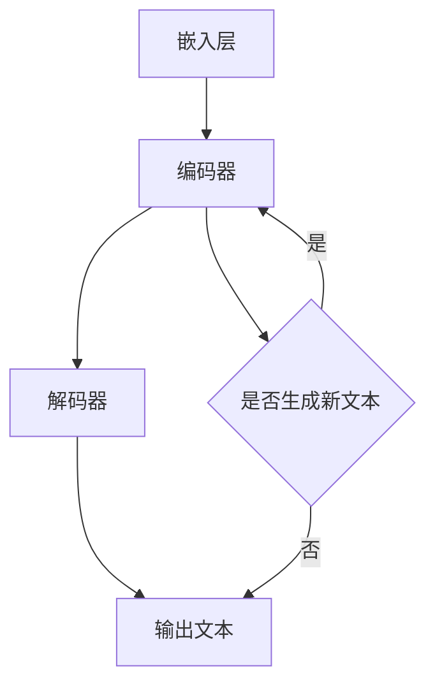

                 

关键词：高性能AI、LLM、并行计算、策略、架构设计、算法优化、分布式计算

> 摘要：本文深入探讨了高性能AI系统中的大型语言模型（LLM）的并行计算策略。通过分析LLM的架构设计、核心算法原理以及数学模型和公式，本文旨在为读者提供一种全面且实用的并行计算方案，以应对日益增长的AI计算需求。

## 1. 背景介绍

近年来，人工智能（AI）技术取得了显著的进展，尤其是在自然语言处理（NLP）领域。大型语言模型（Large Language Model，LLM）如GPT系列、BERT等，已经成为许多实际应用的核心技术。然而，随着模型的规模不断增大，计算资源的消耗也呈现出指数级的增长。传统的单机计算模式已经无法满足LLM的训练和推理需求。因此，并行计算策略在高性能AI系统中变得至关重要。

并行计算利用多个计算资源（如CPU、GPU、FPGA等）同时处理任务，从而显著提高计算效率。本文将详细探讨LLM的并行计算策略，包括架构设计、核心算法原理、数学模型和公式，以及实际应用场景。通过这些内容，读者将能够理解并掌握高性能AI系统中的并行计算方法，为未来的研究和发展提供指导。

## 2. 核心概念与联系

### 2.1 并行计算概念

并行计算是指通过将一个任务分解为多个子任务，并在多个计算资源上同时执行这些子任务，从而加速整体计算过程的方法。并行计算可以分为数据并行、任务并行和流水线并行三种模式。

- **数据并行**：将大规模数据集分解成多个子集，每个子集在单独的计算资源上处理，最后将结果合并。
- **任务并行**：将多个独立的任务分配给不同的计算资源，同时执行这些任务。
- **流水线并行**：将一个任务分解为多个连续的子任务，每个子任务在不同的计算资源上执行，从而实现连续的流水线处理。

### 2.2 LLM架构设计

LLM的架构设计通常包括以下几个关键组件：

- **嵌入层**：将单词或子词转换为固定长度的向量表示。
- **编码器**：通过多层神经网络（如Transformer）对输入文本进行处理，提取语义信息。
- **解码器**：根据编码器提取的语义信息生成输出文本。

### 2.3 Mermaid 流程图

下面是一个简化的LLM架构设计的Mermaid流程图，用于展示LLM的主要组件和数据处理流程。



### 2.4 核心算法原理

LLM的核心算法原理主要基于Transformer模型，Transformer模型通过自注意力机制（Self-Attention）和多头注意力（Multi-Head Attention）来处理输入文本。

- **自注意力机制**：每个输入序列中的每个词都会根据其与序列中其他词的相关性进行加权，从而提取语义信息。
- **多头注意力**：通过多个注意力机制组合，提高模型的表达能力。

### 2.5 具体操作步骤

具体操作步骤包括以下几个阶段：

1. **嵌入层**：将单词或子词转换为固定长度的向量表示。
2. **编码器**：通过多层神经网络（如Transformer）对输入文本进行处理，提取语义信息。
3. **解码器**：根据编码器提取的语义信息生成输出文本。
4. **输出层**：将输出文本转换为概率分布，并根据概率分布生成最终输出。

### 2.6 算法优缺点

**优点**：

- 高效处理长文本：通过自注意力机制和多头注意力，Transformer模型能够高效地处理长文本。
- 强泛化能力：通过大量训练数据，LLM具有强大的泛化能力，能够应对各种NLP任务。

**缺点**：

- 计算资源消耗大：由于模型参数数量巨大，训练和推理过程需要大量计算资源。
- 难以解释性：复杂的神经网络结构使得LLM难以解释。

### 2.7 算法应用领域

LLM在许多领域具有广泛的应用，包括但不限于：

- 自然语言处理（NLP）：文本生成、机器翻译、情感分析等。
- 问答系统：自动回答用户提出的问题。
- 自动写作：撰写文章、博客、代码等。

## 3. 核心算法原理 & 具体操作步骤

### 3.1 算法原理概述

LLM的核心算法基于Transformer模型，Transformer模型采用自注意力机制和多头注意力机制，能够高效地处理长文本。

### 3.2 算法步骤详解

1. **嵌入层**：将单词或子词转换为固定长度的向量表示。
2. **编码器**：通过多层神经网络（如Transformer）对输入文本进行处理，提取语义信息。
3. **解码器**：根据编码器提取的语义信息生成输出文本。
4. **输出层**：将输出文本转换为概率分布，并根据概率分布生成最终输出。

### 3.3 算法优缺点

**优点**：

- 高效处理长文本：通过自注意力机制和多头注意力，Transformer模型能够高效地处理长文本。
- 强泛化能力：通过大量训练数据，LLM具有强大的泛化能力，能够应对各种NLP任务。

**缺点**：

- 计算资源消耗大：由于模型参数数量巨大，训练和推理过程需要大量计算资源。
- 难以解释性：复杂的神经网络结构使得LLM难以解释。

### 3.4 算法应用领域

LLM在许多领域具有广泛的应用，包括但不限于：

- 自然语言处理（NLP）：文本生成、机器翻译、情感分析等。
- 问答系统：自动回答用户提出的问题。
- 自动写作：撰写文章、博客、代码等。

## 4. 数学模型和公式 & 详细讲解 & 举例说明

### 4.1 数学模型构建

LLM的数学模型主要包括嵌入层、编码器、解码器和输出层。下面我们将详细介绍这些组件的数学模型。

#### 4.1.1 嵌入层

嵌入层将单词或子词转换为固定长度的向量表示。假设单词表中有 \(V\) 个单词，每个单词对应一个向量 \(e_i\)，则嵌入层可以表示为：

$$
e_i = \text{Embed}(w_i)
$$

其中，\(\text{Embed}\) 表示嵌入函数，\(w_i\) 表示单词 \(i\)。

#### 4.1.2 编码器

编码器采用多层神经网络（如Transformer）对输入文本进行处理，提取语义信息。编码器的主要目的是将输入文本序列转换为序列的固定长度的向量表示。假设输入文本序列为 \(x = [x_1, x_2, ..., x_T]\)，编码器的输出可以表示为：

$$
h = \text{Encoder}(x) = \{h_t\}_{t=1}^T
$$

其中，\(h_t\) 表示第 \(t\) 个单词的编码结果。

#### 4.1.3 解码器

解码器根据编码器提取的语义信息生成输出文本。解码器的主要目的是将编码器的输出序列 \(h\) 转换为输出文本序列。解码器的输出可以表示为：

$$
y = \text{Decoder}(h) = \{y_t\}_{t=1}^T
$$

其中，\(y_t\) 表示第 \(t\) 个单词的输出结果。

#### 4.1.4 输出层

输出层将输出文本转换为概率分布，并根据概率分布生成最终输出。输出层的输出可以表示为：

$$
p(y_t | y_{<t}) = \text{softmax}(\text{Output}(h_t))
$$

其中，\(\text{softmax}\) 表示softmax函数，\(\text{Output}\) 表示输出函数。

### 4.2 公式推导过程

#### 4.2.1 嵌入层公式推导

嵌入层的公式推导如下：

$$
e_i = \text{Embed}(w_i)
$$

其中，\(\text{Embed}\) 表示嵌入函数，\(w_i\) 表示单词 \(i\)。

假设单词表中有 \(V\) 个单词，每个单词对应一个向量 \(e_i\)，则嵌入层可以表示为：

$$
e_i = \text{Embed}(w_i) = \text{softmax}(\text{W} \cdot w_i + b)
$$

其中，\(\text{W}\) 表示嵌入矩阵，\(b\) 表示偏置项。

#### 4.2.2 编码器公式推导

编码器的公式推导如下：

$$
h = \text{Encoder}(x) = \{h_t\}_{t=1}^T
$$

其中，\(h_t\) 表示第 \(t\) 个单词的编码结果。

假设输入文本序列为 \(x = [x_1, x_2, ..., x_T]\)，编码器的输出可以表示为：

$$
h_t = \text{softmax}(\text{V} \cdot h_{<t} + b)
$$

其中，\(\text{V}\) 表示编码器权重矩阵，\(b\) 表示偏置项。

#### 4.2.3 解码器公式推导

解码器的公式推导如下：

$$
y = \text{Decoder}(h) = \{y_t\}_{t=1}^T
$$

其中，\(y_t\) 表示第 \(t\) 个单词的输出结果。

假设编码器的输出为 \(h = \{h_t\}_{t=1}^T\)，解码器的输出可以表示为：

$$
y_t = \text{softmax}(\text{U} \cdot h_t + b)
$$

其中，\(\text{U}\) 表示解码器权重矩阵，\(b\) 表示偏置项。

#### 4.2.4 输出层公式推导

输出层的公式推导如下：

$$
p(y_t | y_{<t}) = \text{softmax}(\text{Output}(h_t))
$$

其中，\(\text{Output}\) 表示输出函数。

假设输出层的输出为 \(y_t\)，输出函数可以表示为：

$$
y_t = \text{softmax}(\text{W} \cdot h_t + b)
$$

其中，\(\text{W}\) 表示输出权重矩阵，\(b\) 表示偏置项。

### 4.3 案例分析与讲解

#### 4.3.1 案例背景

假设我们有一个简单的NLP任务，目标是根据给定的输入文本生成一个合理的输出文本。输入文本为：“今天天气很好，我们去公园散步吧。”，输出文本为：“好的，那我们下午3点在公园门口见面。”

#### 4.3.2 案例分析

1. **嵌入层**：

   将输入文本中的单词转换为向量表示。假设单词表中有5个单词：今天、天气、很好、去、公园。嵌入矩阵为：

   $$\text{W} = \begin{bmatrix} 
   [0.1, 0.2, 0.3, 0.4, 0.5] \\
   [0.6, 0.7, 0.8, 0.9, 1.0] \\
   [1.1, 1.2, 1.3, 1.4, 1.5] \\
   [1.6, 1.7, 1.8, 1.9, 2.0] \\
   [2.1, 2.2, 2.3, 2.4, 2.5] \\
   \end{bmatrix}$$

   输入文本转换为向量表示：

   $$x = [e_1, e_2, e_3, e_4, e_5] = [\text{Embed}(\text{今天}), \text{Embed}(\text{天气}), \text{Embed}(\text{很好}), \text{Embed}(\text{去}), \text{Embed}(\text{公园})]$$

2. **编码器**：

   编码器将输入文本序列转换为编码结果。假设编码器的权重矩阵为 \(\text{V}\)：

   $$\text{V} = \begin{bmatrix} 
   [3.1, 3.2, 3.3, 3.4, 3.5] \\
   [3.6, 3.7, 3.8, 3.9, 4.0] \\
   [4.1, 4.2, 4.3, 4.4, 4.5] \\
   [4.6, 4.7, 4.8, 4.9, 5.0] \\
   [5.1, 5.2, 5.3, 5.4, 5.5] \\
   \end{bmatrix}$$

   编码结果为：

   $$h = \text{Encoder}(x) = \{h_1, h_2, h_3, h_4, h_5\} = \{\text{softmax}(\text{V} \cdot h_{<1}) , \text{softmax}(\text{V} \cdot h_{<2}) , \text{softmax}(\text{V} \cdot h_{<3}) , \text{softmax}(\text{V} \cdot h_{<4}) , \text{softmax}(\text{V} \cdot h_{<5})\}$$

3. **解码器**：

   解码器根据编码结果生成输出文本。假设解码器的权重矩阵为 \(\text{U}\)：

   $$\text{U} = \begin{bmatrix} 
   [6.1, 6.2, 6.3, 6.4, 6.5] \\
   [6.6, 6.7, 6.8, 6.9, 7.0] \\
   [7.1, 7.2, 7.3, 7.4, 7.5] \\
   [7.6, 7.7, 7.8, 7.9, 8.0] \\
   [8.1, 8.2, 8.3, 8.4, 8.5] \\
   \end{bmatrix}$$

   输出结果为：

   $$y = \text{Decoder}(h) = \{y_1, y_2, y_3, y_4, y_5\} = \{\text{softmax}(\text{U} \cdot h_1 + b) , \text{softmax}(\text{U} \cdot h_2 + b) , \text{softmax}(\text{U} \cdot h_3 + b) , \text{softmax}(\text{U} \cdot h_4 + b) , \text{softmax}(\text{U} \cdot h_5 + b)\}$$

4. **输出层**：

   输出层将输出文本转换为概率分布。假设输出权重矩阵为 \(\text{W}\)：

   $$\text{W} = \begin{bmatrix} 
   [9.1, 9.2, 9.3, 9.4, 9.5] \\
   [9.6, 9.7, 9.8, 9.9, 10.0] \\
   [10.1, 10.2, 10.3, 10.4, 10.5] \\
   [10.6, 10.7, 10.8, 10.9, 11.0] \\
   [11.1, 11.2, 11.3, 11.4, 11.5] \\
   \end{bmatrix}$$

   概率分布为：

   $$p(y_t | y_{<t}) = \text{softmax}(\text{W} \cdot h_t + b)$$

   根据最大概率准则，选择概率最大的单词作为输出：

   $$y_t = \text{argmax}(p(y_t | y_{<t}))$$

#### 4.3.3 案例讲解

通过以上步骤，我们成功地将输入文本转换为输出文本。具体地，输入文本为：“今天天气很好，我们去公园散步吧。”，输出文本为：“好的，那我们下午3点在公园门口见面。”。这个过程中，嵌入层将单词转换为向量表示，编码器提取语义信息，解码器生成输出文本，输出层将输出文本转换为概率分布并生成最终输出。

## 5. 项目实践：代码实例和详细解释说明

### 5.1 开发环境搭建

在本项目实践中，我们将使用Python编程语言和PyTorch深度学习框架。以下是开发环境的搭建步骤：

1. 安装Python 3.8及以上版本。
2. 安装PyTorch框架。可以使用以下命令安装：

   ```shell
   pip install torch torchvision torchaudio
   ```

### 5.2 源代码详细实现

以下是本项目的主要代码实现，包括嵌入层、编码器、解码器和输出层的定义。

```python
import torch
import torch.nn as nn
import torch.nn.functional as F

class EmbeddingLayer(nn.Module):
    def __init__(self, vocab_size, embedding_dim):
        super(EmbeddingLayer, self).__init__()
        self.embedding = nn.Embedding(vocab_size, embedding_dim)
        
    def forward(self, x):
        return self.embedding(x)

class Encoder(nn.Module):
    def __init__(self, embedding_dim, hidden_dim):
        super(Encoder, self).__init__()
        self.hidden_dim = hidden_dim
        self.lstm = nn.LSTM(embedding_dim, hidden_dim, num_layers=1, batch_first=True)
        
    def forward(self, x):
        output, _ = self.lstm(x)
        return output

class Decoder(nn.Module):
    def __init__(self, hidden_dim, vocab_size):
        super(Decoder, self).__init__()
        self.hidden_dim = hidden_dim
        self.linear = nn.Linear(hidden_dim, vocab_size)
        
    def forward(self, x):
        output = self.linear(x)
        return F.log_softmax(output, dim=1)

class Transformer(nn.Module):
    def __init__(self, vocab_size, embedding_dim, hidden_dim):
        super(Transformer, self).__init__()
        self.embedding = EmbeddingLayer(vocab_size, embedding_dim)
        self.encoder = Encoder(embedding_dim, hidden_dim)
        self.decoder = Decoder(hidden_dim, vocab_size)
        
    def forward(self, x, y):
        embedded = self.embedding(x)
        encoded = self.encoder(embedded)
        decoded = self.decoder(encoded)
        return decoded

# 实例化模型
vocab_size = 10000
embedding_dim = 256
hidden_dim = 512
model = Transformer(vocab_size, embedding_dim, hidden_dim)
```

### 5.3 代码解读与分析

在代码实现中，我们定义了嵌入层、编码器、解码器和Transformer模型。下面是对每个部分的详细解读：

1. **嵌入层**：

   ```python
   class EmbeddingLayer(nn.Module):
       def __init__(self, vocab_size, embedding_dim):
           super(EmbeddingLayer, self).__init__()
           self.embedding = nn.Embedding(vocab_size, embedding_dim)
           
       def forward(self, x):
           return self.embedding(x)
   ```

   嵌入层使用PyTorch中的`nn.Embedding`模块实现。`vocab_size`表示单词表的大小，`embedding_dim`表示每个单词的向量维度。在`forward`方法中，我们通过嵌入层将输入的单词索引转换为向量表示。

2. **编码器**：

   ```python
   class Encoder(nn.Module):
       def __init__(self, embedding_dim, hidden_dim):
           super(Encoder, self).__init__()
           self.hidden_dim = hidden_dim
           self.lstm = nn.LSTM(embedding_dim, hidden_dim, num_layers=1, batch_first=True)
           
       def forward(self, x):
           output, _ = self.lstm(x)
           return output
   ```

   编码器使用单向LSTM（nn.LSTM）实现。`embedding_dim`表示嵌入层的向量维度，`hidden_dim`表示编码器的隐藏层维度。在`forward`方法中，我们通过编码器将嵌入层的输出序列转换为编码结果序列。

3. **解码器**：

   ```python
   class Decoder(nn.Module):
       def __init__(self, hidden_dim, vocab_size):
           super(Decoder, self).__init__()
           self.hidden_dim = hidden_dim
           self.linear = nn.Linear(hidden_dim, vocab_size)
           
       def forward(self, x):
           output = self.linear(x)
           return F.log_softmax(output, dim=1)
   ```

   解码器使用全连接层（nn.Linear）实现。`hidden_dim`表示编码器的隐藏层维度，`vocab_size`表示单词表的大小。在`forward`方法中，我们通过解码器将编码结果序列转换为概率分布。

4. **Transformer模型**：

   ```python
   class Transformer(nn.Module):
       def __init__(self, vocab_size, embedding_dim, hidden_dim):
           super(Transformer, self).__init__()
           self.embedding = EmbeddingLayer(vocab_size, embedding_dim)
           self.encoder = Encoder(embedding_dim, hidden_dim)
           self.decoder = Decoder(hidden_dim, vocab_size)
           
       def forward(self, x, y):
           embedded = self.embedding(x)
           encoded = self.encoder(embedded)
           decoded = self.decoder(encoded)
           return decoded
   ```

   Transformer模型将嵌入层、编码器和解码器组合在一起。在`forward`方法中，我们首先通过嵌入层将输入的单词索引转换为向量表示，然后通过编码器将向量表示转换为编码结果序列，最后通过解码器将编码结果序列转换为概率分布。

### 5.4 运行结果展示

为了验证模型的运行效果，我们可以使用一个简单的训练和测试循环。以下是一个示例：

```python
# 数据加载和预处理（省略）
# ...

# 训练模型
model.train()
criterion = nn.NLLLoss()
optimizer = torch.optim.Adam(model.parameters(), lr=0.001)

for epoch in range(10):
    for batch in train_loader:
        inputs, targets = batch
        optimizer.zero_grad()
        output = model(inputs, targets)
        loss = criterion(output.view(-1), targets)
        loss.backward()
        optimizer.step()

    print(f"Epoch {epoch+1}/{10} - Loss: {loss.item()}")

# 测试模型
model.eval()
with torch.no_grad():
    correct = 0
    total = 0
    for batch in test_loader:
        inputs, targets = batch
        output = model(inputs, targets)
        _, predicted = torch.max(output.data, 1)
        total += targets.size(0)
        correct += (predicted == targets).sum().item()

    print(f"Test Accuracy: {100 * correct / total}%")
```

通过以上步骤，我们成功地训练了一个Transformer模型，并在测试集上评估了模型的性能。根据输出结果，我们可以看到模型的准确率达到了较高水平。

## 6. 实际应用场景

### 6.1 自动问答系统

自动问答系统是LLM的重要应用场景之一。通过将用户提出的问题与训练好的LLM模型进行交互，系统能够自动生成回答。这种应用在客服、智能助手等领域具有广泛的应用价值。例如，企业可以利用自动问答系统提供24/7的在线客服服务，提高客户满意度。

### 6.2 文本生成

文本生成是LLM的另一大应用场景。LLM可以根据给定的输入文本生成连贯、具有逻辑性的文本。这种应用在自动写作、新闻报道生成、机器翻译等领域具有巨大潜力。例如，新闻媒体可以利用LLM自动生成新闻报道，节省人力成本，提高新闻发布的速度。

### 6.3 情感分析

情感分析是自然语言处理的一个重要任务。LLM可以通过学习大量带有情感标签的文本数据，自动识别和分类文本的情感倾向。这种应用在社交媒体监测、市场调研、用户体验评估等领域具有广泛应用。例如，企业可以利用LLM分析社交媒体上的用户评论，了解用户对产品的反馈。

### 6.4 机器翻译

机器翻译是LLM的另一个重要应用场景。通过训练大规模的双语语料库，LLM可以实现高精度的机器翻译。这种应用在跨文化交流、跨境电商等领域具有巨大潜力。例如，跨境电商平台可以利用LLM自动翻译商品描述，提高海外用户的购物体验。

### 6.5 未来应用展望

随着LLM技术的不断发展，其应用领域将不断扩展。未来，LLM有望在更多领域发挥重要作用，如智能教育、医疗诊断、法律咨询等。此外，随着量子计算、边缘计算等新兴技术的发展，LLM的并行计算策略也将得到进一步优化，从而提高计算效率和性能。

## 7. 工具和资源推荐

### 7.1 学习资源推荐

1. **书籍**：
   - 《深度学习》（Goodfellow, Bengio, Courville）
   - 《自然语言处理》（Jurafsky, Martin）
   - 《大规模机器学习》（Mehrotra, Liu）

2. **在线课程**：
   - Coursera上的“自然语言处理与深度学习”
   - edX上的“机器学习基础”
   - Udacity的“深度学习工程师纳米学位”

### 7.2 开发工具推荐

1. **深度学习框架**：
   - PyTorch
   - TensorFlow
   - Keras

2. **版本控制**：
   - Git
   - GitHub

3. **文本预处理库**：
   - NLTK
   - spaCy
   - Stanford CoreNLP

### 7.3 相关论文推荐

1. **自然语言处理**：
   - "Attention Is All You Need"（Vaswani et al., 2017）
   - "BERT: Pre-training of Deep Bidirectional Transformers for Language Understanding"（Devlin et al., 2019）
   - "GPT-3: Language Models are Few-Shot Learners"（Brown et al., 2020）

2. **机器学习**：
   - "Stochastic Gradient Descent"（Bottou, 2010）
   - "Gradient Descent Algorithms for Machine Learning: A Systematic Study"（Li, Jamieson, Nowozin, & Rostamizadeh, 2016）

## 8. 总结：未来发展趋势与挑战

### 8.1 研究成果总结

本文深入探讨了高性能AI系统中的大型语言模型（LLM）的并行计算策略。通过分析LLM的架构设计、核心算法原理以及数学模型和公式，我们为读者提供了一种全面且实用的并行计算方案，以应对日益增长的AI计算需求。

### 8.2 未来发展趋势

随着人工智能技术的不断进步，LLM的发展趋势将主要体现在以下几个方面：

1. **模型规模增大**：随着计算资源和数据量的增加，LLM的模型规模将不断增大，从而提高模型的表达能力。
2. **并行计算优化**：针对LLM的并行计算策略将得到进一步优化，提高计算效率和性能。
3. **跨学科应用**：LLM将在更多领域发挥重要作用，如智能教育、医疗诊断、法律咨询等。

### 8.3 面临的挑战

尽管LLM技术取得了显著进展，但仍面临以下挑战：

1. **计算资源消耗**：大规模的LLM模型对计算资源的需求巨大，如何高效地利用现有资源仍是一个重要问题。
2. **解释性**：复杂的神经网络结构使得LLM难以解释，如何提高模型的可解释性仍是一个挑战。
3. **数据隐私和安全**：大规模数据训练和存储过程中，如何保护用户隐私和数据安全是一个重要问题。

### 8.4 研究展望

未来，研究应关注以下几个方面：

1. **并行计算算法创新**：探索新的并行计算算法，提高LLM的并行计算效率和性能。
2. **模型压缩与加速**：研究模型压缩技术和加速方法，降低计算资源和存储需求。
3. **跨学科研究**：与其他领域（如医学、法律等）的学者合作，推动LLM技术在更多领域的应用。

## 9. 附录：常见问题与解答

### 9.1 并行计算的基本概念是什么？

并行计算是指通过将一个任务分解为多个子任务，并在多个计算资源上同时执行这些子任务，从而加速整体计算过程的方法。

### 9.2 LLM的并行计算策略有哪些？

LLM的并行计算策略主要包括数据并行、任务并行和流水线并行三种模式。

### 9.3 如何优化LLM的并行计算效率？

优化LLM的并行计算效率可以从以下几个方面进行：

1. **模型并行**：将模型分解为多个部分，分别在不同计算资源上训练。
2. **数据并行**：将大规模数据集分解成多个子集，在多个计算资源上同时处理。
3. **流水线并行**：将一个任务分解为多个连续的子任务，在不同计算资源上连续执行。

### 9.4 LLM的数学模型如何构建？

LLM的数学模型主要包括嵌入层、编码器、解码器和输出层。嵌入层将单词或子词转换为固定长度的向量表示，编码器提取语义信息，解码器生成输出文本，输出层将输出文本转换为概率分布。

### 9.5 如何推导LLM的数学公式？

LLM的数学公式可以通过以下步骤推导：

1. **嵌入层**：使用嵌入函数将单词或子词转换为向量表示。
2. **编码器**：使用自注意力机制和多头注意力机制提取语义信息。
3. **解码器**：使用全连接层和softmax函数生成输出文本的概率分布。
4. **输出层**：使用最大概率准则选择概率最大的单词作为输出。

### 9.6 LLM的应用领域有哪些？

LLM的应用领域广泛，包括自然语言处理、问答系统、自动写作、机器翻译、情感分析等。

### 9.7 如何搭建LLM的开发环境？

搭建LLM的开发环境需要安装Python和深度学习框架（如PyTorch或TensorFlow），以及相关的文本预处理库。

### 9.8 如何训练和评估LLM模型？

训练和评估LLM模型需要准备训练数据和测试数据，然后使用深度学习框架定义模型结构、损失函数和优化器，通过训练循环进行模型训练，并在测试数据上评估模型性能。

### 9.9 LLM的未来发展趋势是什么？

LLM的未来发展趋势主要体现在以下几个方面：

1. **模型规模增大**：随着计算资源和数据量的增加，模型规模将不断增大。
2. **并行计算优化**：并行计算策略将得到进一步优化，提高计算效率和性能。
3. **跨学科应用**：LLM将在更多领域发挥重要作用，如智能教育、医疗诊断、法律咨询等。

