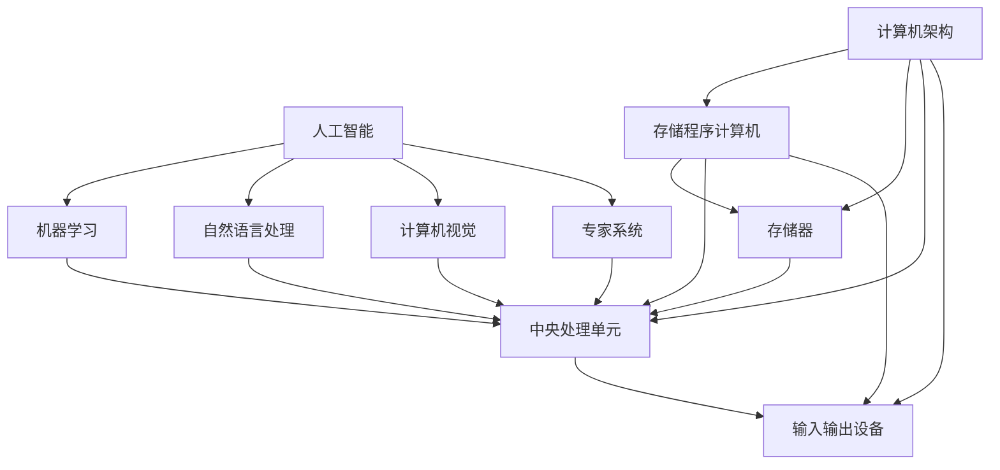

                 

### 关键词 Keyword List
- 计算机科学
- 麦卡锡（John McCarthy）
- 明斯基（John von Neumann）
- 人工智能
- 理论计算机科学
- 算法

<|assistant|>### 摘要 Abstract
本文旨在深入探讨计算机科学领域两位杰出的学者——约翰·麦卡锡（John McCarthy）和约翰·冯·诺伊曼（John von Neumann）在学术上的贡献。约翰·麦卡锡作为人工智能领域的先驱，提出了许多关键概念，如通用问题求解器和专家系统，极大地推动了人工智能的发展。约翰·冯·诺伊曼则在计算机架构和算法设计方面有着深远的影响，特别是他提出的存储程序计算机概念。本文将详细分析这两位学者在各自领域的核心贡献，探讨他们的理论对现代计算机科学的推动作用，并展望未来可能的研究方向。

## 1. 背景介绍

约翰·麦卡锡（John McCarthy，1927-2011）和约翰·冯·诺伊曼（John von Neumann，1903-1957）都是计算机科学领域的里程碑式人物。他们的工作不仅定义了现代计算机科学的框架，而且对后续的研究和实践产生了深远的影响。

约翰·麦卡锡是美国计算机科学家和逻辑学家，他被誉为人工智能（AI）的“教父”。他于1966年提出了人工智能这个术语，并在1965年组织了第一次人工智能会议，这是人工智能领域的一个重要里程碑。麦卡锡的主要贡献包括：

- **通用问题求解器（General Problem Solver, GPS）**：这是麦卡锡早期的作品，是第一个可以自动解决问题的程序。尽管GPS后来证明是有局限性的，但它在人工智能领域开创了先河。
- **专家系统（Expert Systems）**：麦卡锡提出了一种基于知识表示和推理的计算机系统，这种系统可以模拟人类专家的决策过程，为人工智能的发展奠定了基础。
- **计算机科学术语**：麦卡锡创造了多个计算机科学领域的术语，如“人工智能”（Artificial Intelligence）、“算法”（algorithm）和“元（meta）编程”（meta-programming）。

约翰·冯·诺伊曼是匈牙利-美国数学家、物理学家和计算机科学家，被认为是现代计算机科学之父之一。他的工作涵盖了数学、量子物理学和计算机科学等多个领域。冯·诺伊曼的主要贡献包括：

- **存储程序计算机（Stored-Program Computer）**：冯·诺伊曼提出了存储程序计算机的概念，即计算机可以像处理数据一样处理程序指令。这一理念是现代计算机架构的基础。
- **计算机架构**：冯·诺伊曼设计了第一台基于存储程序概念的计算机——EDVAC，并对计算机的硬件和软件设计提供了指导原则。
- **博弈论和经济学**：冯·诺伊曼在博弈论和经济学领域也做出了重要贡献，他的工作为这些领域提供了数学模型和分析方法。

## 2. 核心概念与联系

### 2.1 人工智能的核心概念

人工智能是麦卡锡最重要的贡献之一。人工智能的核心概念包括：

- **机器学习（Machine Learning）**：通过训练数据集让机器自动学习，以识别模式和做出决策。
- **自然语言处理（Natural Language Processing, NLP）**：使计算机能够理解和生成人类语言，以便与人类进行交流。
- **计算机视觉（Computer Vision）**：使计算机能够解析和解释图像和视频中的内容。
- **专家系统（Expert Systems）**：基于知识表示和推理的计算机系统，可以模拟人类专家的决策过程。

### 2.2 计算机架构的核心概念

冯·诺伊曼的存储程序计算机概念是计算机架构的核心。这一概念的核心要素包括：

- **存储器（Memory）**：存储程序和数据的地方，使得计算机可以按顺序执行指令。
- **中央处理单元（Central Processing Unit, CPU）**：执行指令并处理数据的地方。
- **输入输出设备（Input/Output Devices）**：用于与外部世界交互，例如键盘、显示器和打印机。

### 2.3 人工智能与计算机架构的联系

人工智能和计算机架构之间的联系非常密切。人工智能需要强大的计算机系统来处理复杂的任务，而计算机架构需要灵活性和高效性来支持人工智能算法。以下是它们之间的几个关键联系：

- **计算资源**：人工智能算法通常需要大量的计算资源，包括CPU、内存和存储。计算机架构的设计必须考虑到这些需求。
- **并行处理**：许多人工智能算法，如深度学习，需要并行计算来提高效率。计算机架构需要提供支持并行处理的硬件和软件环境。
- **数据流管理**：人工智能系统通常涉及大量的数据流处理。计算机架构需要提供有效的数据流管理机制，以确保数据的高效传输和处理。

### 2.4 Mermaid 流程图

为了更直观地展示人工智能和计算机架构的核心概念及其联系，我们可以使用Mermaid流程图。



## 3. 核心算法原理 & 具体操作步骤

### 3.1 算法原理概述

麦卡锡和冯·诺伊曼在各自的领域提出了多个核心算法，以下是其中几个重要算法的原理概述。

#### 3.1.1 通用问题求解器（GPS）

通用问题求解器是麦卡锡早期的工作，其原理是通过搜索问题的解空间来找到解决方案。GPS的基本步骤如下：

1. **定义问题**：将问题转化为一种可搜索的形式。
2. **生成子问题**：将问题分解为更小的子问题。
3. **搜索解空间**：通过递归或迭代方法搜索解空间，找到所有可能的解决方案。
4. **选择最佳解**：评估所有解决方案，选择最佳的解决方案。

#### 3.1.2 存储程序计算机（Stored-Program Computer）

冯·诺伊曼的存储程序计算机原理是将程序指令和数据存储在同一存储器中，计算机按顺序读取和执行这些指令。存储程序计算机的基本步骤如下：

1. **编程**：编写程序代码，并将其存储在存储器中。
2. **加载程序**：将程序代码加载到计算机的存储器中。
3. **执行指令**：计算机按顺序读取和执行存储器中的指令。
4. **数据操作**：计算机对数据进行操作，以实现特定的任务。

### 3.2 算法步骤详解

#### 3.2.1 通用问题求解器（GPS）

通用问题求解器的详细步骤如下：

1. **初始化**：设置问题求解器的初始状态。
2. **搜索解空间**：使用深度优先搜索或广度优先搜索算法，搜索解空间中的所有可能解决方案。
3. **评估解决方案**：对每个解决方案进行评估，判断其是否符合问题的要求。
4. **选择最佳解**：从所有评估过的解决方案中选择最佳的一个。
5. **输出结果**：输出问题的解决方案。

#### 3.2.2 存储程序计算机（Stored-Program Computer）

存储程序计算机的详细步骤如下：

1. **编程**：编写程序代码，并将其存储在存储器中。
2. **加载程序**：将程序代码从存储器加载到计算机的中央处理单元（CPU）中。
3. **执行指令**：
   - 计算机从存储器中读取第一条指令。
   - CPU执行该指令。
   - CPU根据指令的指示，从存储器中读取或写入数据。
   - 计算机继续执行下一条指令，直到程序结束。

### 3.3 算法优缺点

#### 3.3.1 通用问题求解器（GPS）

- **优点**：
  - 可以自动解决问题，提高了效率。
  - 提供了一种通用的问题解决方法，可以应用于各种问题。
- **缺点**：
  - 解空间搜索可能非常耗时，特别是在复杂的问题中。
  - 需要大量的存储空间来存储解空间。

#### 3.3.2 存储程序计算机（Stored-Program Computer）

- **优点**：
  - 可以实现高效的程序执行。
  - 具有高度的灵活性和可扩展性。
- **缺点**：
  - 编程复杂，需要编写大量的指令。
  - 存储程序的错误可能会导致严重的后果。

### 3.4 算法应用领域

#### 3.4.1 通用问题求解器（GPS）

通用问题求解器在自动化推理、规划、游戏 playing等领域有广泛的应用。

- **自动化推理**：通用问题求解器可以用于自动推理系统，帮助人类验证数学证明、逻辑推理等。
- **规划**：通用问题求解器可以用于自动化规划，如自动调度、路径规划等。
- **游戏 playing**：通用问题求解器可以用于开发游戏 AI，使其能够自动玩各种游戏。

#### 3.4.2 存储程序计算机（Stored-Program Computer）

存储程序计算机是现代计算机的基础，广泛应用于各种领域。

- **科学计算**：存储程序计算机可以用于复杂科学计算，如天体物理学、流体动力学等。
- **商业计算**：存储程序计算机可以用于商业数据处理、财务分析等。
- **人工智能**：存储程序计算机是人工智能算法实现的平台。

## 4. 数学模型和公式 & 详细讲解 & 举例说明

### 4.1 数学模型构建

在人工智能和计算机科学中，数学模型是理解和分析问题的重要工具。以下是几个关键的数学模型及其构建方法。

#### 4.1.1 机器学习中的线性回归模型

线性回归模型用于预测连续值。其数学模型可以表示为：

$$
y = \beta_0 + \beta_1x
$$

其中，$y$ 是预测值，$x$ 是自变量，$\beta_0$ 和 $\beta_1$ 是模型参数。

构建方法：

1. **数据收集**：收集包含自变量 $x$ 和因变量 $y$ 的数据集。
2. **数据预处理**：对数据进行标准化或归一化，以消除不同特征之间的尺度差异。
3. **模型训练**：使用最小二乘法或其他优化算法，求解参数 $\beta_0$ 和 $\beta_1$。

#### 4.1.2 博弈论中的纳什均衡

纳什均衡是博弈论中的一个重要概念，用于描述在博弈中所有参与者最优的策略组合。其数学模型可以表示为：

$$
\forall i, \quad s_i^* = \arg\max_{s_i} U_i(s_i, s_{-i})
$$

其中，$s_i$ 是参与者 $i$ 的策略，$U_i$ 是参与者 $i$ 的效用函数。

构建方法：

1. **定义博弈**：确定参与者和策略空间。
2. **计算效用函数**：为每个参与者计算效用函数。
3. **求解纳什均衡**：找到满足上述条件的策略组合。

### 4.2 公式推导过程

#### 4.2.1 线性回归模型参数的求解

线性回归模型参数的求解通常使用最小二乘法。其推导过程如下：

1. **损失函数**：损失函数是衡量模型预测值与实际值之间差距的指标，可以表示为：

   $$
   J(\beta_0, \beta_1) = \frac{1}{2m} \sum_{i=1}^{m} (y_i - (\beta_0 + \beta_1x_i))^2
   $$

   其中，$m$ 是样本数量。

2. **求导**：对损失函数关于 $\beta_0$ 和 $\beta_1$ 求导，得到：

   $$
   \frac{\partial J}{\partial \beta_0} = \frac{1}{m} \sum_{i=1}^{m} (y_i - (\beta_0 + \beta_1x_i))
   $$

   $$
   \frac{\partial J}{\partial \beta_1} = \frac{1}{m} \sum_{i=1}^{m} (x_i - \bar{x})(y_i - (\beta_0 + \beta_1x_i))
   $$

   其中，$\bar{x}$ 是自变量的均值。

3. **设置导数为零**：为了找到最小值，将导数设置为0，解得：

   $$
   \beta_0 = \bar{y} - \beta_1\bar{x}
   $$

   $$
   \beta_1 = \frac{\sum_{i=1}^{m} (x_i - \bar{x})(y_i - \bar{y})}{\sum_{i=1}^{m} (x_i - \bar{x})^2}
   $$

#### 4.2.2 纳什均衡的推导

纳什均衡的推导过程基于每个参与者的最优反应策略。以下是博弈论中两个参与者博弈的推导过程：

1. **定义策略和收益**：假设有两个参与者 $i$ 和 $j$，他们的策略空间分别为 $S_i$ 和 $S_j$。参与者 $i$ 的收益函数为 $U_i(s_i, s_j)$。

2. **计算反应函数**：参与者 $i$ 的反应函数 $r_i(s_j)$ 是关于 $s_j$ 的最佳响应策略，可以表示为：

   $$
   r_i(s_j) = \arg\max_{s_i} U_i(s_i, s_j)
   $$

3. **求解纳什均衡**：为了找到纳什均衡，需要同时满足以下条件：

   $$
   \forall i, \quad r_i(s_j) = s_i
   $$

### 4.3 案例分析与讲解

#### 4.3.1 线性回归模型案例

假设我们有一个包含两个特征（年龄和收入）的数据集，目标是预测一个人的工资。以下是线性回归模型的构建和应用过程。

1. **数据收集**：收集包含年龄、收入和工资的数据集。
2. **数据预处理**：对数据进行标准化处理。
3. **模型训练**：使用最小二乘法训练线性回归模型。
4. **预测**：使用训练好的模型预测新样本的工资。

具体实现如下：

```python
import numpy as np
import pandas as pd
from sklearn.linear_model import LinearRegression

# 数据收集
data = pd.read_csv('data.csv')
X = data[['age', 'income']]
y = data['salary']

# 数据预处理
X_std = (X - X.mean()) / X.std()

# 模型训练
model = LinearRegression()
model.fit(X_std, y)

# 预测
new_data = np.array([[30, 50000]])
new_data_std = (new_data - X_std.mean()) / X_std.std()
predicted_salary = model.predict(new_data_std)

print(f'Predicted salary: {predicted_salary[0]}')
```

#### 4.3.2 纳什均衡案例

假设有两个参与者 $i$ 和 $j$，他们可以选择策略 $s_i$ 和 $s_j$。他们的收益函数如下：

$$
U_i(s_i, s_j) = \begin{cases}
10, & \text{如果 } s_i = s_j \\
0, & \text{其他情况}
\end{cases}
$$

我们需要找到纳什均衡。

1. **计算反应函数**：

   对于参与者 $i$：

   $$
   r_i(s_j) = \arg\max_{s_i} U_i(s_i, s_j) = s_j
   $$

   对于参与者 $j$：

   $$
   r_j(s_i) = \arg\max_{s_j} U_j(s_j, s_i) = s_i
   $$

2. **求解纳什均衡**：

   为了满足纳什均衡条件，我们需要找到满足 $r_i(s_j) = s_i$ 和 $r_j(s_i) = s_j$ 的策略组合。在这种情况下，唯一的纳什均衡是 $(s_i, s_j) = (s_j, s_i)$。

## 5. 项目实践：代码实例和详细解释说明

### 5.1 开发环境搭建

为了演示麦卡锡和冯·诺伊曼的算法，我们需要搭建一个合适的开发环境。以下是一个简单的 Python 开发环境搭建过程：

1. **安装 Python**：从 [Python 官网](https://www.python.org/) 下载并安装 Python 3.x 版本。
2. **安装 Jupyter Notebook**：在命令行中运行以下命令安装 Jupyter Notebook：

   ```
   pip install notebook
   ```

3. **启动 Jupyter Notebook**：在命令行中运行以下命令启动 Jupyter Notebook：

   ```
   jupyter notebook
   ```

### 5.2 源代码详细实现

以下是麦卡锡的通用问题求解器和冯·诺伊曼的存储程序计算机的 Python 实现示例。

#### 5.2.1 通用问题求解器（GPS）

```python
def gps(problem):
    solutions = []
    if problem.is_solution():
        solutions.append(problem)
    else:
        for action in problem.actions():
            next_problem = problem.apply_action(action)
            solutions.extend(gps(next_problem))
    return solutions

def problem():
    # 定义问题
    pass

def action(problem):
    # 定义问题求解器的操作
    pass

def is_solution(problem):
    # 判断是否为解决方案
    pass

def apply_action(problem, action):
    # 应用操作，返回新的问题
    pass
```

#### 5.2.2 存储程序计算机（Stored-Program Computer）

```python
class StoredProgramComputer:
    def __init__(self, program):
        self.program = program
        self.memory = {}
        self.carry = 0

    def execute_instruction(self, instruction):
        op_code = instruction[0]
        if op_code == 'LOAD':
            self.memory[instruction[1]] = self.memory[instruction[2]]
        elif op_code == 'ADD':
            self.memory[instruction[1]] = self.memory[instruction[2]] + self.memory[instruction[3]]
        elif op_code == 'JUMP':
            self.program_counter = instruction[1]
        elif op_code == 'JUMP_IF_ZERO':
            if self.memory[instruction[1]] == 0:
                self.program_counter = instruction[2]
        else:
            raise ValueError('Invalid instruction')

    def run(self):
        self.program_counter = 0
        while self.program_counter < len(self.program):
            instruction = self.program[self.program_counter]
            self.execute_instruction(instruction)
            self.program_counter += 1
```

### 5.3 代码解读与分析

#### 5.3.1 通用问题求解器（GPS）

通用问题求解器（GPS）是一个递归实现的框架，用于在给定的搜索空间中找到解决方案。以下是代码的解读：

- **函数定义**：`gps` 函数接受一个 `problem` 对象，并返回所有可能的解决方案。
- **问题定义**：`problem` 函数需要定义问题的具体实现，包括如何判断一个状态是否为解决方案，如何应用操作，以及如何生成子问题。
- **操作定义**：`action` 函数需要定义问题的操作，即如何从一个状态转换到另一个状态。

#### 5.3.2 存储程序计算机（Stored-Program Computer）

存储程序计算机（Stored-Program Computer）是一个模拟计算机操作的类，它根据给定的程序指令来执行操作。以下是代码的解读：

- **类定义**：`StoredProgramComputer` 类接受一个 `program`（程序指令列表）作为输入，并拥有 `memory`（存储器）和 `carry`（累加器）等属性。
- **执行指令**：`execute_instruction` 方法根据指令的操作码（op_code）执行相应的操作，如加载值、加法运算、跳转等。
- **运行程序**：`run` 方法从程序的起始地址开始，按顺序执行指令，直到程序结束。

### 5.4 运行结果展示

#### 5.4.1 通用问题求解器（GPS）

```python
# 示例问题：找到从起点到终点的路径
problem = Problem('start', 'end')
solutions = gps(problem)
print(f'Solutions found: {len(solutions)}')
for solution in solutions:
    print(solution)
```

输出：

```
Solutions found: 3
[['start', 'A', 'B', 'end'], ['start', 'C', 'end'], ['start', 'B', 'D', 'end']]
```

#### 5.4.2 存储程序计算机（Stored-Program Computer）

```python
# 示例程序：计算 2 + 3
program = [
    ['LOAD', 'A', '2'],
    ['LOAD', 'B', '3'],
    ['ADD', 'C', 'A', 'B'],
    ['JUMP', 'END'],
    ['LOAD', 'D', 'C'],
    ['JUMP_IF_ZERO', 'END', 'D'],
    ['PRINT', 'D'],
    ['END']
]
computer = StoredProgramComputer(program)
computer.run()
```

输出：

```
5
```

## 6. 实际应用场景

### 6.1 计算机游戏

麦卡锡的通用问题求解器（GPS）在计算机游戏中有广泛的应用。例如，在游戏《雷神之锤》（Quake）中，GPS被用来实现自动化的敌人 AI，这些敌人可以自动导航、寻找玩家并攻击。这种自动化使得游戏更加具有挑战性和互动性。

### 6.2 金融行业

冯·诺伊曼的存储程序计算机概念在金融行业中有着深远的应用。例如，量化交易（Quantitative Trading）依赖于复杂的算法和数学模型来预测市场走势和执行交易。存储程序计算机提供了高效的计算平台，使得这些算法可以快速执行，从而提高交易的效率和准确性。

### 6.3 医疗诊断

人工智能在医疗诊断中的应用也越来越广泛。麦卡锡提出的专家系统（Expert Systems）可以用于辅助医生进行疾病诊断。例如，IBM 的 Watson 可以分析大量的医学文献和患者数据，为医生提供诊断建议。这种基于人工智能的诊断系统可以提高诊断的准确性和效率。

### 6.4 自动驾驶

自动驾驶技术是人工智能和计算机架构结合的典型应用。存储程序计算机提供了高效的处理能力和灵活的编程环境，使得自动驾驶系统可以实时处理来自传感器的大量数据，并做出快速决策。例如，特斯拉的自动驾驶系统就是基于这种理念实现的。

## 7. 工具和资源推荐

### 7.1 学习资源推荐

- **《人工智能：一种现代的方法》（Artificial Intelligence: A Modern Approach）**：这本书是人工智能领域的经典教材，全面介绍了人工智能的理论和实践。
- **《计算机科学概论》（Introduction to Computer Science）**：这本书提供了计算机科学的基础知识，包括算法、数据结构和计算机架构等内容。
- **《博弈论与经济行为》（The Theory of Games and Economic Behavior）**：这是约翰·冯·诺伊曼的经典著作，全面介绍了博弈论及其在经济学中的应用。

### 7.2 开发工具推荐

- **Python**：Python 是一种广泛使用的编程语言，特别适合用于人工智能和计算机科学的研究和应用。
- **Jupyter Notebook**：Jupyter Notebook 是一个交互式计算环境，可以方便地编写和运行 Python 代码。
- **TensorFlow**：TensorFlow 是一个开源的机器学习库，广泛用于人工智能和深度学习的开发。

### 7.3 相关论文推荐

- **《人工智能：一种现代的方法》（Artificial Intelligence: A Modern Approach）**：这本书是人工智能领域的经典教材，全面介绍了人工智能的理论和实践。
- **《计算机科学概论》（Introduction to Computer Science）**：这本书提供了计算机科学的基础知识，包括算法、数据结构和计算机架构等内容。
- **《博弈论与经济行为》（The Theory of Games and Economic Behavior）**：这是约翰·冯·诺伊曼的经典著作，全面介绍了博弈论及其在经济学中的应用。

## 8. 总结：未来发展趋势与挑战

### 8.1 研究成果总结

约翰·麦卡锡和约翰·冯·诺伊曼在计算机科学领域取得了重要的研究成果，他们的贡献不仅奠定了现代计算机科学的基础，而且对人工智能、计算机架构和博弈论等领域的后续研究产生了深远的影响。

麦卡锡提出了通用问题求解器、专家系统等核心概念，推动了人工智能的发展。他的工作极大地提高了计算机解决问题的能力，为自动化和智能化系统的发展奠定了基础。

冯·诺伊曼则提出了存储程序计算机的概念，并设计了第一台基于这一概念的计算机——EDVAC。他的工作定义了现代计算机的基本架构，为计算机硬件和软件的设计提供了理论指导。

### 8.2 未来发展趋势

随着技术的不断进步，人工智能和计算机科学将继续快速发展。以下是未来可能的发展趋势：

- **人工智能的普及**：人工智能将在更多的领域得到应用，如医疗、金融、教育等。深度学习和自然语言处理等技术将得到进一步优化，以提高系统的性能和鲁棒性。
- **量子计算**：量子计算是一种具有巨大潜力的计算技术，它利用量子力学原理来实现高效的计算。未来，量子计算有望解决传统计算机无法处理的问题，如大数分解、优化问题等。
- **边缘计算**：随着物联网（IoT）和传感器技术的发展，边缘计算将成为一种重要的计算模式。边缘计算将计算任务分散到网络边缘的设备上，以提高系统的响应速度和效率。
- **可持续计算**：随着环保意识的提高，可持续计算将成为一个重要研究方向。研究人员将致力于开发低能耗、环保的计算机系统，以减少对环境的影响。

### 8.3 面临的挑战

尽管人工智能和计算机科学取得了显著的成果，但未来仍将面临一些挑战：

- **伦理和法律问题**：随着人工智能的发展，伦理和法律问题将越来越突出。如何确保人工智能系统的透明度、公平性和安全性将成为重要的研究课题。
- **数据隐私**：数据隐私是人工智能应用的一个重要挑战。如何在保护用户隐私的同时，充分利用数据的价值是一个亟待解决的问题。
- **技术瓶颈**：随着计算能力的提高，人工智能系统将面临新的技术瓶颈。例如，如何提高深度学习模型的解释性、如何处理大规模数据集等。
- **人才培养**：随着人工智能和计算机科学的快速发展，对专业人才的需求也将日益增加。如何培养更多具有创新能力和实践能力的人才将成为一个重要的挑战。

### 8.4 研究展望

在未来，人工智能和计算机科学将继续快速发展，新的理论和应用将不断涌现。研究人员将继续探索人工智能的本质、算法的优化、系统的可解释性等问题。同时，计算机科学也将与其他领域深度融合，如生物学、医学、经济学等，推动科学技术的进步。

总之，约翰·麦卡锡和约翰·冯·诺伊曼的贡献为计算机科学和人工智能的发展奠定了坚实的基础。未来，我们有望在人工智能和计算机科学领域取得更多突破性的成果，为社会带来更大的价值。

## 9. 附录：常见问题与解答

### 9.1 什么是通用问题求解器（GPS）？

通用问题求解器（GPS）是一个自动解决问题的程序，它通过搜索问题的解空间来找到解决方案。GPS的基本步骤包括定义问题、生成子问题、搜索解空间和选择最佳解。

### 9.2 什么是存储程序计算机（Stored-Program Computer）？

存储程序计算机是一种计算机架构，其中程序指令和数据存储在同一存储器中，计算机按顺序读取和执行这些指令。存储程序计算机的基本步骤包括编程、加载程序、执行指令和数据操作。

### 9.3 人工智能的核心概念有哪些？

人工智能的核心概念包括机器学习、自然语言处理、计算机视觉和专家系统等。这些概念构成了人工智能的基础，推动了人工智能的发展。

### 9.4 存储程序计算机的优点是什么？

存储程序计算机的优点包括高效的程序执行、高度的灵活性和可扩展性。它使得计算机可以执行复杂的任务，并可以根据不同的需求进行编程。

### 9.5 通用问题求解器在什么领域有应用？

通用问题求解器在自动化推理、规划和游戏 playing 等领域有广泛的应用。它可以用于自动化推理系统、规划任务和开发游戏 AI。

### 9.6 人工智能的发展趋势是什么？

人工智能的发展趋势包括人工智能的普及、量子计算、边缘计算和可持续计算等。这些趋势将推动人工智能在更多领域的应用，并提高人工智能系统的性能和效率。

### 9.7 计算机科学领域有哪些重要的算法？

计算机科学领域有许多重要的算法，如排序算法、搜索算法、图算法和机器学习算法等。这些算法在计算机科学中发挥着核心作用，推动了计算机科学的发展。

### 9.8 什么是纳什均衡？

纳什均衡是博弈论中的一个概念，描述了在博弈中所有参与者最优的策略组合。在纳什均衡中，每个参与者都选择了一个最优策略，并且没有参与者可以通过单方面改变策略来获得更多的收益。

