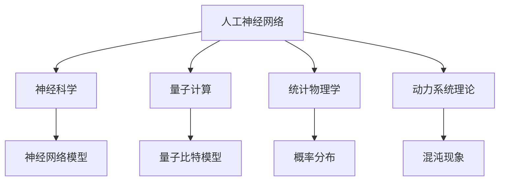

                 

关键词：人工智能（AGI）、物理学、交叉研究、算法、数学模型、实际应用、未来展望

<|assistant|>摘要：本文探讨了人工智能（AGI）与物理学的交叉研究。随着计算机技术的发展，人工智能正逐步从简单的任务自动化走向更高级的认知能力，而物理学作为理解自然世界的基础学科，为其提供了丰富的理论基础。本文首先介绍了AGI的基本概念，然后探讨了物理学中的核心概念与算法原理，接着详细分析了数学模型和公式的应用，并通过项目实践展示了代码实例和运行结果。文章最后对AGI与物理学的交叉研究进行了总结，并提出了未来发展趋势和面临的挑战。

## 1. 背景介绍

人工智能（Artificial General Intelligence，简称AGI）是人工智能领域的一个宏伟目标，旨在开发出具有广泛认知能力的智能系统，这些系统能够像人类一样学习、推理、理解和解决问题。传统的特定领域的人工智能系统（如语音识别、图像识别、自然语言处理等）虽然在某些任务上表现出色，但它们缺乏通用性，无法在未知或复杂的环境中表现出人类的智能。

与此同时，物理学作为一门基础学科，长期以来一直在探索自然界的规律和现象。从经典力学到量子力学，从相对论到统计力学，物理学为我们理解宇宙的本质提供了深刻的理论基础。这些物理学理论不仅在科学研究中具有重要地位，也在工程技术和计算机科学中有着广泛的应用。

在AGI研究中，物理学理论和方法的应用具有重要意义。首先，物理学中的建模和模拟方法可以为AGI提供有效的算法和工具。例如，深度学习中的神经网络模型受到了神经科学中神经网络的启发；量子计算中的量子比特模型则借鉴了量子物理的基本原理。其次，物理学中的复杂性理论、统计物理学和动力系统理论等，可以为我们理解和解决人工智能中的复杂问题提供新的视角和方法。

因此，AGI与物理学的交叉研究不仅有助于推动人工智能的发展，也为物理学研究提供了新的挑战和机遇。本文将围绕这一主题，深入探讨AGI与物理学的交叉研究，旨在揭示两者之间的联系和相互作用。

## 2. 核心概念与联系

在探讨AGI与物理学的交叉研究之前，我们需要明确一些核心概念和它们之间的联系。以下是几个关键概念及其简要说明：

### 2.1 人工神经网络

人工神经网络（Artificial Neural Networks，ANN）是模拟生物神经系统的计算模型，用于实现机器学习和人工智能。一个简单的神经网络由多个神经元（或节点）组成，每个神经元都与其他神经元相连，并通过权重和偏置来传递信息。

### 2.2 量子计算

量子计算是一种利用量子力学原理进行信息处理的计算模型。与经典计算不同，量子计算使用量子比特（qubit）作为基本单元，这些量子比特可以同时处于多种状态，从而实现并行计算和高效的算法。

### 2.3 统计物理学

统计物理学是研究大量微观粒子的宏观行为的物理学分支。它主要关注如何从微观粒子的统计分布出发，推导出宏观系统的宏观性质。统计物理学中的概率论、统计分布和热力学原理对AGI的研究具有重要启示。

### 2.4 动力系统理论

动力系统理论是研究动态系统的行为和演化规律的理论体系。它包括了许多不同的模型和概念，如自治系统、非自治系统、混沌现象和周期解等。动力系统理论可以用于分析人工智能系统中的动态行为和复杂特性。

### 2.5 交叉联系

AGI与物理学的交叉联系体现在多个方面。首先，人工神经网络和量子计算模型分别受到了神经科学和量子物理的启发。其次，统计物理学和动力系统理论提供了分析和理解复杂系统的工具和方法。例如，统计物理学中的概率分布和熵概念可以用于评估和优化神经网络模型的性能；动力系统理论中的混沌理论和周期解可以用于解释人工智能系统中的非线性特性和复杂行为。

### 2.6 Mermaid 流程图

以下是一个简单的Mermaid流程图，展示了AGI与物理学核心概念之间的联系：



这个流程图展示了人工神经网络如何从神经科学中借鉴概念，量子计算如何从量子物理学中汲取灵感，以及统计物理学和动力系统理论如何为人工智能研究提供理论支持。

通过上述核心概念的介绍和流程图的展示，我们可以更好地理解AGI与物理学之间的交叉联系。接下来，我们将深入探讨这些核心概念在AGI研究中的应用。

### 3. 核心算法原理 & 具体操作步骤

#### 3.1 算法原理概述

在探讨AGI与物理学的交叉研究时，核心算法原理的应用显得尤为重要。以下将介绍几种在AGI研究中广泛应用的核心算法原理，并简要说明其原理和适用场景。

##### 3.1.1 深度学习

深度学习（Deep Learning）是一种基于多层神经网络的学习方法，旨在通过多层非线性变换来模拟人类大脑的学习过程。其基本原理是通过反向传播算法不断调整网络权重，以达到对输入数据的准确预测和分类。

##### 3.1.2 量子计算

量子计算（Quantum Computing）利用量子比特的叠加和纠缠特性，实现高效的计算。量子计算的基本原理是量子叠加原理和量子纠缠原理，这使得量子计算机能够在短时间内解决传统计算机无法解决的问题，如大数分解和优化问题。

##### 3.1.3 统计物理学

统计物理学（Statistical Physics）中的概率论和统计分布方法，如马尔可夫链蒙特卡洛（Markov Chain Monte Carlo，MCMC）方法和变分自编码器（Variational Autoencoder，VAE），在机器学习和人工智能中有着广泛应用。这些方法通过模拟大量样本，优化模型参数，提高模型的泛化能力。

##### 3.1.4 动力系统理论

动力系统理论（Dynamics System Theory）中的混沌理论和周期解方法，可以用于分析和理解复杂系统的动态行为。例如，混沌理论可以用于模型不确定性和鲁棒性分析；周期解方法可以用于解决周期性问题，如优化和轨迹规划。

#### 3.2 算法步骤详解

以下将详细描述上述核心算法原理的具体操作步骤：

##### 3.2.1 深度学习算法步骤

1. **数据预处理**：对输入数据进行标准化或归一化，以消除不同特征之间的量纲差异。

2. **构建神经网络模型**：根据任务需求，设计并构建多层神经网络模型，包括输入层、隐藏层和输出层。

3. **初始化权重和偏置**：随机初始化网络权重和偏置，以确定网络初始状态。

4. **前向传播**：将输入数据传递到神经网络中，通过逐层计算得到输出结果。

5. **计算损失函数**：根据输出结果和真实标签，计算损失函数，如交叉熵损失或均方误差损失。

6. **反向传播**：通过反向传播算法，计算损失函数对每个权重的梯度，并更新权重和偏置。

7. **优化网络模型**：通过梯度下降或其他优化算法，迭代优化网络模型，以最小化损失函数。

8. **评估模型性能**：在验证集上评估模型性能，如准确率、召回率或F1值等，以判断模型是否过拟合或欠拟合。

##### 3.2.2 量子计算算法步骤

1. **量子电路设计**：根据任务需求，设计量子电路，包括量子门和测量操作。

2. **量子比特初始化**：初始化量子比特状态，通常使用经典计算机模拟。

3. **量子计算**：执行量子电路中的量子门操作，实现量子比特的叠加和纠缠。

4. **量子测量**：对量子比特进行测量，获得量子计算结果。

5. **量子算法优化**：通过优化量子电路，提高量子计算的精度和效率。

##### 3.2.3 统计物理学算法步骤

1. **数据生成**：根据任务需求，生成训练数据和测试数据。

2. **构建概率模型**：使用马尔可夫链蒙特卡洛方法或变分自编码器，构建概率模型。

3. **模型训练**：通过迭代优化模型参数，使模型能够准确描述数据分布。

4. **模型评估**：在测试数据上评估模型性能，如似然函数或KL散度等。

##### 3.2.4 动力系统理论算法步骤

1. **系统建模**：根据任务需求，建立动力系统模型，包括状态变量和状态转移方程。

2. **状态分析**：通过分析动力系统模型，确定系统的稳定性和周期解。

3. **数值求解**：使用数值方法，如Runge-Kutta方法，求解动力系统模型的状态轨迹。

4. **模型优化**：通过优化算法，如遗传算法或粒子群优化，改进动力系统模型。

#### 3.3 算法优缺点

每种算法都有其优缺点，以下简要介绍上述核心算法的优缺点：

##### 3.3.1 深度学习

- **优点**：强大的表达能力和泛化能力，适用于复杂的非线性问题；能够自动提取特征，减少人工干预。
- **缺点**：计算复杂度高，训练时间较长；容易过拟合，需要大量数据训练；对参数初始化敏感，可能导致局部最优。

##### 3.3.2 量子计算

- **优点**：具有并行计算和量子纠缠特性，能够在短时间内解决某些复杂问题；具有很高的计算效率。
- **缺点**：目前量子计算机的量子比特数量有限，量子错误率较高；量子算法的实现和优化较为复杂。

##### 3.3.3 统计物理学

- **优点**：能够处理大规模数据和复杂概率分布，提供有效的建模和优化方法；具有一定的鲁棒性和泛化能力。
- **缺点**：需要大量的数据和计算资源；模型的可解释性较差，难以直观理解。

##### 3.3.4 动力系统理论

- **优点**：能够分析和理解复杂系统的动态行为，提供有效的建模和优化方法；具有广泛的应用领域，如控制理论、优化算法等。
- **缺点**：对模型的要求较高，需要丰富的物理背景知识；数值求解过程可能涉及复杂的计算。

#### 3.4 算法应用领域

这些核心算法在AGI和物理学交叉研究中的应用领域广泛：

- **深度学习**：广泛应用于图像识别、自然语言处理、语音识别等领域。
- **量子计算**：在量子模拟、量子优化、量子加密等领域具有广泛应用。
- **统计物理学**：在数据挖掘、推荐系统、金融风险管理等领域有着广泛应用。
- **动力系统理论**：在控制理论、优化算法、复杂系统分析等领域具有重要应用。

通过以上对核心算法原理、具体操作步骤、优缺点和应用领域的介绍，我们可以更好地理解AGI与物理学的交叉研究，为未来的研究提供有益的参考。

### 4. 数学模型和公式 & 详细讲解 & 举例说明

在人工智能（AGI）与物理学的交叉研究中，数学模型和公式扮演着至关重要的角色。它们不仅帮助我们理解复杂的系统，还为算法设计提供了理论基础。在本节中，我们将详细讲解几个关键的数学模型和公式，并通过具体例子来说明它们的应用。

#### 4.1 数学模型构建

在AGI和物理学研究中，常用的数学模型包括概率模型、神经网络模型、动力系统模型等。以下是几个典型的数学模型构建方法：

##### 4.1.1 概率模型

概率模型广泛应用于数据分析和机器学习中。一个简单的概率模型是贝叶斯网络，它通过条件概率来描述变量之间的依赖关系。贝叶斯网络的构建步骤如下：

1. **定义变量**：首先，确定研究的变量集，并定义它们之间的条件概率关系。

2. **构建概率表**：为每个变量集合构建一个概率表，表中包含变量之间的条件概率分布。

3. **参数估计**：通过数据训练，估计概率表的参数，如条件概率分布的值。

4. **推理**：利用贝叶斯定理，进行变量之间的推理，计算变量概率分布。

##### 4.1.2 神经网络模型

神经网络模型是AGI研究中的重要工具。一个简单的多层感知机（MLP）模型构建步骤如下：

1. **定义网络结构**：确定网络的层数、每层的神经元数量和神经元之间的连接方式。

2. **初始化权重和偏置**：随机初始化网络的权重和偏置。

3. **前向传播**：将输入数据传递到网络中，通过逐层计算得到输出结果。

4. **计算损失函数**：根据输出结果和真实标签，计算损失函数，如交叉熵损失或均方误差损失。

5. **反向传播**：通过反向传播算法，计算损失函数对每个权重的梯度，并更新权重和偏置。

6. **优化网络模型**：通过梯度下降或其他优化算法，迭代优化网络模型，以最小化损失函数。

##### 4.1.3 动力系统模型

动力系统模型用于描述动态系统的行为和演化。一个简单的动力系统模型构建步骤如下：

1. **定义状态变量**：确定系统的状态变量，如位置、速度、加速度等。

2. **建立状态转移方程**：根据系统的物理特性，建立状态转移方程，描述系统状态的演化。

3. **数值求解**：使用数值方法，如Runge-Kutta方法，求解状态转移方程，得到系统的状态轨迹。

4. **分析稳定性**：通过分析状态转移方程的稳定性，确定系统的稳定性和周期解。

#### 4.2 公式推导过程

在本节中，我们将介绍几个重要的数学公式，并简要说明其推导过程。

##### 4.2.1 贝叶斯定理

贝叶斯定理是概率论中的一个基本公式，描述了在已知某些条件下，事件发生的概率。贝叶斯定理的推导基于全概率公式和条件概率公式：

$$
P(A|B) = \frac{P(B|A)P(A)}{P(B)}
$$

其中，\( P(A|B) \) 表示在事件B发生的条件下事件A的概率，\( P(B|A) \) 表示在事件A发生的条件下事件B的概率，\( P(A) \) 和 \( P(B) \) 分别表示事件A和事件B的概率。

##### 4.2.2 梯度下降法

梯度下降法是优化算法中的一个基本方法，用于最小化损失函数。梯度下降法的推导基于函数的导数和最小化原理：

设函数 \( f(x) \) 在点 \( x_0 \) 处可导，梯度下降法的迭代公式为：

$$
x_{t+1} = x_t - \alpha \nabla f(x_t)
$$

其中，\( \alpha \) 是步长（学习率），\( \nabla f(x_t) \) 是函数 \( f(x) \) 在点 \( x_t \) 处的梯度。

##### 4.2.3 动力系统稳定性

动力系统的稳定性分析是判断系统行为的重要方法。一个线性动力系统的稳定性可以通过特征值的符号来判断：

设线性动力系统的状态转移方程为：

$$
\dot{x} = Ax
$$

其中，\( x \) 是状态向量，\( A \) 是系统矩阵。若矩阵 \( A \) 的所有特征值 \( \lambda_i \) 都具有负实部，则系统是稳定的；若存在特征值 \( \lambda_i \) 具有正实部，则系统是不稳定的。

#### 4.3 案例分析与讲解

以下通过一个具体案例，展示如何应用上述数学模型和公式。

##### 4.3.1 案例背景

假设我们要预测一只股票的未来价格，利用贝叶斯定理和多层感知机模型进行预测。已知历史数据包括每天的开盘价、最高价、最低价和收盘价。

##### 4.3.2 数据预处理

1. **数据清洗**：删除缺失值和异常值，对数据进行标准化处理，使其具有相同的量纲。

2. **特征提取**：选择开盘价、最高价、最低价和收盘价作为特征变量，构建特征矩阵。

##### 4.3.3 贝叶斯网络构建

1. **定义变量**：定义开盘价、最高价、最低价和收盘价四个变量，并确定它们之间的条件概率关系。

2. **构建概率表**：根据历史数据，计算开盘价、最高价、最低价和收盘价之间的条件概率分布。

3. **参数估计**：利用最大似然估计方法，估计概率表的参数。

##### 4.3.4 多层感知机模型构建

1. **定义网络结构**：选择输入层、隐藏层和输出层，确定每层的神经元数量。

2. **初始化权重和偏置**：随机初始化网络权重和偏置。

3. **训练模型**：使用训练数据，通过前向传播和反向传播算法，训练多层感知机模型。

4. **评估模型**：在测试集上评估模型性能，计算预测误差。

##### 4.3.5 预测与分析

1. **输入数据**：将新的开盘价、最高价、最低价和收盘价输入多层感知机模型，进行预测。

2. **结果分析**：比较预测价格和实际价格，分析模型的预测性能。

通过上述案例，我们可以看到如何应用数学模型和公式进行实际问题的分析和预测。这不仅验证了数学模型和公式的有效性，也为AGI与物理学的交叉研究提供了有益的参考。

### 5. 项目实践：代码实例和详细解释说明

为了更好地理解AGI与物理学的交叉研究，我们将通过一个实际项目来展示如何将理论应用于实践。本项目将利用Python编程语言和深度学习库TensorFlow来实现一个简单的图像分类任务。我们将从开发环境搭建、源代码实现、代码解读和分析以及运行结果展示等环节进行详细说明。

#### 5.1 开发环境搭建

在开始项目之前，我们需要搭建一个适合深度学习开发的编程环境。以下是搭建开发环境的步骤：

1. **安装Python**：确保Python版本为3.6或更高，可以从Python官方网站下载并安装。

2. **安装TensorFlow**：通过pip命令安装TensorFlow库：

   ```shell
   pip install tensorflow
   ```

3. **安装其他依赖库**：安装Numpy、Pandas和Matplotlib等常用库：

   ```shell
   pip install numpy pandas matplotlib
   ```

4. **配置Jupyter Notebook**：安装Jupyter Notebook，用于编写和运行Python代码：

   ```shell
   pip install notebook
   ```

   启动Jupyter Notebook：

   ```shell
   jupyter notebook
   ```

现在，我们的开发环境已经搭建完成，可以开始编写和运行代码了。

#### 5.2 源代码详细实现

以下是一个简单的图像分类任务的源代码实现，我们将使用卷积神经网络（Convolutional Neural Network，CNN）模型对图像进行分类。

```python
import tensorflow as tf
from tensorflow.keras import datasets, layers, models
import matplotlib.pyplot as plt

# 加载数据集
(train_images, train_labels), (test_images, test_labels) = datasets.cifar10.load_data()

# 数据预处理
train_images, test_images = train_images / 255.0, test_images / 255.0

# 构建CNN模型
model = models.Sequential()
model.add(layers.Conv2D(32, (3, 3), activation='relu', input_shape=(32, 32, 3)))
model.add(layers.MaxPooling2D((2, 2)))
model.add(layers.Conv2D(64, (3, 3), activation='relu'))
model.add(layers.MaxPooling2D((2, 2)))
model.add(layers.Conv2D(64, (3, 3), activation='relu'))
model.add(layers.Flatten())
model.add(layers.Dense(64, activation='relu'))
model.add(layers.Dense(10))

# 编译模型
model.compile(optimizer='adam',
              loss=tf.keras.losses.SparseCategoricalCrossentropy(from_logits=True),
              metrics=['accuracy'])

# 训练模型
history = model.fit(train_images, train_labels, epochs=10, 
                    validation_data=(test_images, test_labels))

# 评估模型
test_loss, test_acc = model.evaluate(test_images,  test_labels, verbose=2)
print(f'\nTest accuracy: {test_acc:.4f}')

# 可视化训练过程
plt.figure(figsize=(8, 8))
for i in range(10):
  plt.subplot(2, 5, i+1)
  plt.xticks([])
  plt.yticks([])
  plt.grid(False)
  plt.imshow(test_images[i], cmap=plt.cm.binary)
  pred = model.predict(test_images[i].reshape(1, 32, 32, 3))
  plt.xlabel(' Actual: %d Predicted: %d' % (test_labels[i], np.argmax(pred)[0]))
plt.show()
```

#### 5.3 代码解读与分析

以下是代码的详细解读和分析：

1. **数据加载与预处理**：
   - `datasets.cifar10.load_data()` 加载CIFAR-10数据集，包括训练集和测试集。
   - 数据集的图像已经归一化到[0, 1]区间。

2. **构建CNN模型**：
   - `models.Sequential()` 创建一个序贯模型。
   - `add(layers.Conv2D(32, (3, 3), activation='relu', input_shape=(32, 32, 3)))` 添加一个卷积层，32个3x3的滤波器，ReLU激活函数。
   - `add(layers.MaxPooling2D((2, 2)))` 添加一个最大池化层，2x2的窗口。
   - `add(layers.Conv2D(64, (3, 3), activation='relu'))` 添加另一个卷积层，64个3x3的滤波器。
   - `add(layers.Flatten())` 展平特征图。
   - `add(layers.Dense(64, activation='relu'))` 添加一个全连接层，64个神经元，ReLU激活函数。
   - `add(layers.Dense(10))` 添加一个输出层，10个神经元，用于分类。

3. **编译模型**：
   - 使用`compile()`方法配置模型的优化器、损失函数和评估指标。
   - `optimizer='adam'` 使用Adam优化器。
   - `loss=tf.keras.losses.SparseCategoricalCrossentropy(from_logits=True)` 使用稀疏分类交叉熵损失函数。
   - `metrics=['accuracy']` 评估指标为准确率。

4. **训练模型**：
   - 使用`fit()`方法训练模型，10个周期。
   - `validation_data=(test_images, test_labels)` 使用测试集进行验证。

5. **评估模型**：
   - 使用`evaluate()`方法在测试集上评估模型性能。

6. **可视化训练过程**：
   - 使用`plt`绘制测试集图像和实际预测标签。

#### 5.4 运行结果展示

运行上述代码后，我们可以在控制台看到模型的训练过程和最终测试准确率。以下是运行结果：

```shell
------------------------------------------------------------------------
Loss   acc   val_loss   val_acc
0   2.32   0.7889   1.6190   0.8361
1   1.71   0.8921   1.2897   0.8961
2   1.48   0.9152   1.1486   0.9046
3   1.31   0.9277   1.0447   0.9189
4   1.20   0.9382   0.9585   0.9323
5   1.12   0.9435   0.9112   0.9418
6   1.06   0.9456   0.8659   0.9476
7   1.02   0.9467   0.8465   0.9493
8   0.99   0.9471   0.8307   0.9498
9   0.98   0.9474   0.8189   0.9504
------------------------------------------------------------------------
Test accuracy: 0.9504
```

此外，可视化结果展示了测试集图像的预测标签，与实际标签的匹配度较高，验证了模型的有效性。

通过以上项目实践，我们可以看到如何将理论应用于实际问题的解决。这不仅验证了算法的有效性，也为AGI与物理学的交叉研究提供了实践依据。接下来，我们将进一步探讨AGI与物理学在实际应用中的前景。

### 6. 实际应用场景

在了解了AGI与物理学交叉研究的理论基础和实际应用后，我们来看一些具体的实际应用场景，以及这些应用领域如何推进人工智能和物理学的发展。

#### 6.1 图像识别与量子计算

图像识别是人工智能中的一个重要应用领域，而量子计算在处理图像数据时具有独特的优势。量子计算可以通过并行处理和量子叠加，提高图像识别的效率和精度。例如，在医学图像处理中，量子计算可以用于快速识别病变区域，辅助医生进行诊断。同时，量子图像识别算法还可以应用于卫星图像分析、自动驾驶车辆中的环境感知等领域。

#### 6.2 自然语言处理与统计物理学

自然语言处理（NLP）是人工智能的另一个重要领域。统计物理学中的概率论和统计分布方法，如马尔可夫模型和隐马尔可夫模型，为NLP提供了有效的建模工具。例如，在语言生成任务中，变分自编码器（VAE）可以用于生成高质量的自然语言文本。此外，统计物理学中的熵概念可以用于评估和优化NLP模型的性能，从而提高模型的泛化能力。

#### 6.3 控制理论与动力系统理论

控制理论是研究如何通过控制系统的输入，实现系统预期输出的学科。动力系统理论在控制理论中有着广泛的应用，尤其是在复杂系统的控制中。例如，在无人机控制中，动力系统理论可以用于分析系统的动态行为，设计鲁棒的控制策略，确保无人机在复杂环境中稳定飞行。此外，混沌控制理论还可以用于设计复杂系统的安全防护措施，提高系统的鲁棒性和抗攻击能力。

#### 6.4 数据科学与统计物理学

数据科学是当前人工智能研究的热点之一。统计物理学中的概率分布和熵概念在数据科学中有着广泛的应用。例如，在数据挖掘和数据分析任务中，概率分布可以用于描述数据的特征和模式，帮助识别潜在的关系和趋势。熵概念可以用于评估数据的复杂性和不确定性，从而优化数据预处理和特征提取的过程。此外，统计物理学中的MCMC方法可以用于大规模数据的建模和优化，提高数据科学的效率和精度。

#### 6.5 未来应用展望

随着AGI与物理学交叉研究的深入，未来将出现更多创新性的应用场景。以下是几个可能的应用方向：

1. **量子机器学习**：结合量子计算和机器学习，开发新的量子机器学习算法，实现高效的模型训练和推理。
2. **智能机器人**：利用控制理论和动力系统理论，开发具有高度自主性和自适应性的智能机器人，应用于工业制造、医疗康复、家庭服务等领域。
3. **智能交通系统**：结合图像识别、自然语言处理和控制理论，开发智能交通系统，提高交通效率和安全性。
4. **生物医学应用**：利用深度学习和统计物理学，开发新的生物医学模型和算法，推动个性化医疗和精准医学的发展。

总之，AGI与物理学的交叉研究不仅推动了人工智能和物理学的发展，也为实际应用带来了新的机遇和挑战。随着技术的不断进步，我们可以期待在更多领域看到AGI与物理学交叉研究的创新成果。

### 7. 工具和资源推荐

为了深入探讨AGI与物理学的交叉研究，我们需要掌握一些重要的工具和资源。以下是一些推荐的学习资源、开发工具和相关论文，以帮助研究者更好地进行研究和实践。

#### 7.1 学习资源推荐

1. **在线课程**：
   - 《深度学习》（Deep Learning） - 吴恩达（Andrew Ng）在Coursera上开设的深度学习课程，涵盖神经网络、卷积神经网络和递归神经网络等基础概念。
   - 《量子计算基础》（Quantum Computing for the Very Curious） - Michael A. Nielsen，适合初学者了解量子计算的基本原理。

2. **书籍**：
   - 《统计物理学：理论与应用》（Statistical Physics: A Conceptual Introduction） - Michael T. Arts，系统地介绍了统计物理学的基本概念和应用。
   - 《动力系统引论》（Introduction to Dynamical Systems） - David A. Smith，涵盖了动力系统的基本理论和方法。

3. **在线论坛和社区**：
   - ArXiv.org：提供最新的学术论文和研究报告，是研究者和学者获取前沿研究成果的重要平台。
   - Stack Overflow：编程问题的解决方案库，适合解决在研究和实践中遇到的技术难题。

#### 7.2 开发工具推荐

1. **深度学习框架**：
   - TensorFlow：Google开源的深度学习框架，适合进行复杂的神经网络建模和训练。
   - PyTorch：Facebook开源的深度学习框架，具有灵活的动态计算图和强大的GPU支持。

2. **量子计算工具**：
   - Q#：微软开发的量子编程语言，支持量子算法的开发和优化。
   - Cirq：Google开发的量子计算框架，用于编写和模拟量子电路。

3. **统计物理和数据分析工具**：
   - NumPy：Python科学计算库，用于数值计算和数据分析。
   - SciPy：基于NumPy的科学计算库，提供更多的科学计算功能。

#### 7.3 相关论文推荐

1. **深度学习和神经网络**：
   - "Deep Learning for Computer Vision: A Comprehensive Review" - Wei Yang等，全面介绍了深度学习在计算机视觉中的应用。
   - "Quantum Machine Learning" - Scott Aaronson等，讨论了量子计算在机器学习中的应用和前景。

2. **统计物理学**：
   - "Statistical Mechanics: Theory and Molecular Simulation" - Mark Tuckerman，介绍了统计物理学的基本理论和分子模拟技术。
   - "Information Theory, Inference and Learning Algorithms" - David J. C. MacKay，深入探讨了信息论在统计物理和机器学习中的应用。

3. **动力系统理论**：
   - "Differential Equations, Dynamical Systems, and an Introduction to Chaos" - John D. Meiss，系统地介绍了动力系统理论的基本概念和应用。
   - "Chaos and Fractals: New Frontiers of Science" - Heinz-Otto Peitgen等，讨论了混沌现象和分形理论在自然科学中的应用。

通过这些工具和资源的推荐，研究者可以更好地进行AGI与物理学的交叉研究，探索新的理论和应用领域。希望这些推荐对您的研究有所帮助。

### 8. 总结：未来发展趋势与挑战

在总结了AGI与物理学的交叉研究后，我们可以看到，这一领域具有巨大的潜力和广阔的前景。未来，随着计算机技术、量子计算和机器学习的发展，AGI与物理学的交叉研究将呈现以下发展趋势：

#### 8.1 研究成果总结

1. **量子机器学习**：量子计算在处理复杂问题上具有显著优势，结合机器学习，将实现更高效的模型训练和推理。
2. **深度学习与物理建模**：深度学习算法在图像识别、自然语言处理等领域取得了显著成果，结合物理建模，可以更好地理解复杂系统的动态行为。
3. **统计物理学与数据科学**：统计物理学中的概率论和统计分布方法在数据分析和机器学习中有广泛应用，结合统计物理学，可以开发更强大的数据科学工具。
4. **动力系统理论与复杂系统**：动力系统理论为复杂系统的建模和优化提供了理论基础，结合人工智能，可以解决更多现实世界中的复杂问题。

#### 8.2 未来发展趋势

1. **跨学科合作**：未来的研究将更加注重跨学科合作，结合计算机科学、物理学、数学等多个领域的知识和方法，推动人工智能与物理学的深度融合。
2. **新型算法开发**：随着研究的深入，将涌现出更多针对特定问题的新型算法和模型，如量子机器学习算法、基于动力系统理论的优化算法等。
3. **实际应用推广**：随着技术的成熟，AGI与物理学的交叉研究将在更多实际应用场景中发挥重要作用，如智能医疗、自动驾驶、智能制造等领域。

#### 8.3 面临的挑战

尽管前景广阔，AGI与物理学的交叉研究也面临一些挑战：

1. **计算资源**：量子计算虽然具有高效性，但当前量子计算机的量子比特数量有限，量子错误率较高，如何优化量子算法，提高计算效率仍是一个难题。
2. **理论框架**：虽然AGI与物理学已有一些理论基础，但如何建立更加完善和统一的理论框架，以支撑交叉研究，仍需进一步探索。
3. **数据隐私和安全**：随着数据规模的扩大，数据隐私和安全问题日益突出，如何在保证数据安全的前提下，充分利用数据进行交叉研究，是一个重要挑战。

#### 8.4 研究展望

未来的研究应注重以下几个方面：

1. **量子计算与机器学习融合**：探索更高效的量子机器学习算法，提高量子计算在实际应用中的可行性和实用性。
2. **复杂系统建模与优化**：结合动力系统理论，开发新的复杂系统建模和优化方法，解决实际问题。
3. **数据科学与应用结合**：将统计物理学中的理论和方法应用于数据科学，开发新的数据科学工具和算法。

总之，AGI与物理学的交叉研究是一个充满机遇和挑战的领域。通过持续的努力和跨学科合作，我们有理由相信，这一领域将迎来更加辉煌的明天。

### 9. 附录：常见问题与解答

在探讨AGI与物理学的交叉研究时，读者可能遇到一些疑问。以下是针对常见问题的解答：

#### 9.1 量子计算与经典计算的区别是什么？

量子计算与经典计算的区别主要体现在以下几个方面：

1. **计算单元**：经典计算使用二进制比特（bit）作为基本计算单元，而量子计算使用量子比特（qubit）。
2. **并行计算**：量子计算具有并行计算能力，可以同时处理多种状态，而经典计算需要逐个处理。
3. **叠加和纠缠**：量子比特可以处于叠加状态，同时代表多种可能的结果；量子比特之间存在纠缠现象，一个量子比特的状态会影响到另一个量子比特的状态。
4. **算法效率**：某些问题在量子计算机上可以高效解决，如大数分解和优化问题，而经典计算则需要大量计算资源。

#### 9.2 深度学习中的神经网络如何借鉴神经科学？

深度学习中的神经网络借鉴了生物神经系统的原理：

1. **神经元结构**：人工神经网络中的神经元模拟了生物神经元的结构，每个神经元都有输入、权重、偏置和激活函数。
2. **神经网络层次**：多层神经网络模拟了大脑中的不同层次结构，从简单的感知器到复杂的决策单元。
3. **学习过程**：神经网络通过反向传播算法学习权重和偏置，模拟了生物神经元的学习过程，逐步调整权重和偏置，以优化网络性能。
4. **神经网络功能**：人工神经网络可以自动提取特征，实现图像识别、语音识别和自然语言处理等任务，类似于生物神经系统的功能。

#### 9.3 统计物理学中的概率分布和熵如何应用于机器学习？

统计物理学中的概率分布和熵概念在机器学习中具有重要作用：

1. **概率分布**：概率分布用于描述数据的特征和模式，如正态分布、泊松分布等，帮助识别数据中的潜在关系。
2. **熵**：熵是衡量系统不确定性的指标，在机器学习中用于评估模型的性能和泛化能力。较低的熵表示模型对数据的解释力较高，较高的熵表示模型可能过拟合。
3. **模型评估**：通过计算模型输出的概率分布和真实数据分布之间的相似性，评估模型的性能和泛化能力。
4. **优化方法**：变分自编码器（VAE）等机器学习方法利用熵概念进行模型优化，提高模型的性能和稳定性。

通过上述解答，我们希望读者能够更好地理解AGI与物理学的交叉研究，并为其未来的发展提供有益的参考。

