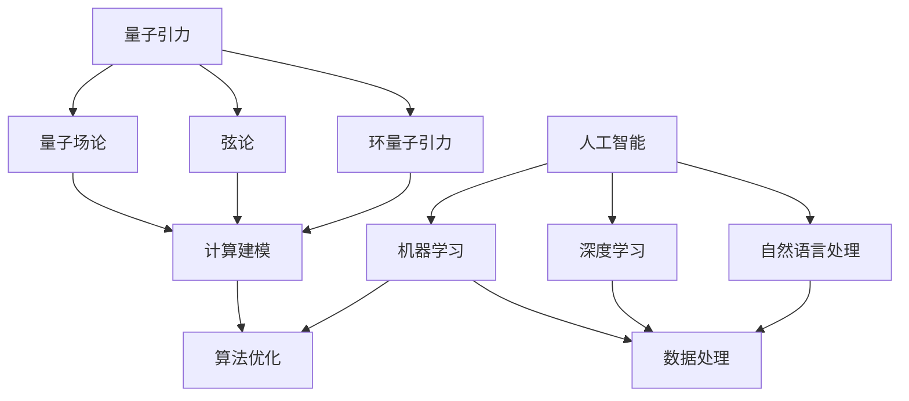

                 

关键词：人工智能，量子引力，计算模型，应用实例，未来展望

摘要：本文深入探讨了人工智能（AGI）在量子引力领域中的应用。通过分析量子引力和人工智能的核心概念及其联系，本文介绍了一种将AGI应用于量子引力研究的新方法。文章详细讨论了算法原理、数学模型、项目实践和实际应用场景，并对未来发展进行了展望。

## 1. 背景介绍

### 1.1 量子引力的背景

量子引力是物理学的前沿领域，旨在统一量子力学和广义相对论，解决它们在宇宙尺度上的不一致性。自从量子力学和广义相对论的提出以来，科学家们一直在寻找一种统一的理论来描述宇宙的基本行为。然而，量子力学和广义相对论在量子尺度上的表现和宇宙尺度上的表现存在明显的矛盾。这种矛盾促使科学家们研究量子引力，以期找到一种能够同时描述量子尺度和宇宙尺度的统一理论。

### 1.2 人工智能的背景

人工智能（Artificial General Intelligence，AGI）是一种旨在实现人类智能水平的人工智能系统。与当前主流的人工智能技术（如机器学习、深度学习等）不同，AGI具有广泛的学习能力和自主决策能力，能够在不同领域表现出人类般的智能。AGI的研究目标是创造一种能够在任何情况下表现出人类智能水平的人工智能系统。

### 1.3 量子引力和人工智能的联系

量子引力和人工智能在许多方面存在联系。首先，两者都涉及复杂系统的建模和求解。量子引力涉及到量子场论、弦论等复杂理论，而人工智能涉及到神经网络、深度学习等复杂算法。其次，量子引力和人工智能都面临着计算资源的需求。量子引力模拟需要大量的计算资源，而人工智能算法的优化和训练也需要大量的计算资源。此外，量子引力和人工智能都涉及到数据的处理和分析。量子引力研究需要处理大量的实验数据和理论预测数据，而人工智能算法的训练和优化也需要处理大量的数据。

## 2. 核心概念与联系

### 2.1 核心概念

#### 2.1.1 量子引力

量子引力是一种旨在统一量子力学和广义相对论的理论。它涉及到量子场论、弦论、环量子引力等多种理论框架。量子引力试图解决量子力学和广义相对论之间的不一致性，提供一个能够同时描述量子尺度和宇宙尺度的统一理论。

#### 2.1.2 人工智能

人工智能是一种模拟人类智能的技术，旨在创建能够自主学习和决策的系统。人工智能包括机器学习、深度学习、自然语言处理等多种技术。人工智能的目标是实现人类智能水平的人工智能系统。

### 2.2 核心联系

量子引力和人工智能在多个层面存在联系。

#### 2.2.1 计算建模

量子引力和人工智能都需要对复杂系统进行建模和求解。量子引力涉及到量子场论、弦论等复杂理论，而人工智能涉及到神经网络、深度学习等复杂算法。

#### 2.2.2 数据处理

量子引力研究需要处理大量的实验数据和理论预测数据，而人工智能算法的训练和优化也需要处理大量的数据。

#### 2.2.3 算法优化

量子引力模拟和人工智能算法的优化都面临着计算资源的需求。量子引力模拟需要大量的计算资源，而人工智能算法的优化也需要大量的计算资源。

### 2.3 Mermaid 流程图

下面是量子引力和人工智能的核心概念及其联系的 Mermaid 流程图：



## 3. 核心算法原理 & 具体操作步骤

### 3.1 算法原理概述

量子引力和人工智能的核心算法原理主要包括以下几个方面：

#### 3.1.1 量子场论算法

量子场论算法是量子引力研究的基础，包括路径积分、弦论模拟等方法。

#### 3.1.2 人工智能算法

人工智能算法包括神经网络、深度学习、强化学习等方法，用于模拟人类智能。

#### 3.1.3 融合算法

融合算法将量子引力算法和人工智能算法相结合，形成一种新的计算模型，用于解决量子引力问题。

### 3.2 算法步骤详解

下面是量子引力和人工智能融合算法的具体步骤：

#### 3.2.1 数据收集

收集量子引力相关的实验数据、理论预测数据等。

#### 3.2.2 数据预处理

对收集到的数据进行分析和预处理，提取有用的信息。

#### 3.2.3 量子场论建模

使用量子场论算法建立量子引力模型。

#### 3.2.4 人工智能建模

使用人工智能算法建立模拟人类智能的模型。

#### 3.2.5 融合算法

将量子场论模型和人工智能模型相结合，形成一种新的计算模型。

#### 3.2.6 算法优化

对融合算法进行优化，提高计算效率。

#### 3.2.7 结果分析

对算法的结果进行分析和验证。

### 3.3 算法优缺点

#### 优点：

1. **高效性**：融合算法能够充分利用量子引力和人工智能的优势，提高计算效率。
2. **灵活性**：融合算法可以根据不同的量子引力问题灵活调整算法参数。

#### 缺点：

1. **复杂性**：量子引力和人工智能的融合算法复杂，需要较高的计算资源。
2. **稳定性**：融合算法的稳定性需要进一步验证。

### 3.4 算法应用领域

量子引力和人工智能融合算法可以应用于以下领域：

1. **宇宙学研究**：用于研究宇宙的起源、演化和结构。
2. **粒子物理学**：用于研究基本粒子的性质和相互作用。
3. **人工智能应用**：用于解决人工智能领域的复杂问题。

## 4. 数学模型和公式 & 详细讲解 & 举例说明

### 4.1 数学模型构建

量子引力和人工智能融合算法的数学模型主要包括以下几个方面：

#### 4.1.1 量子场论模型

量子场论模型描述了量子引力现象的基本规律，包括路径积分、弦论等。

#### 4.1.2 人工智能模型

人工智能模型描述了人工智能系统的学习、推理和决策过程，包括神经网络、深度学习等。

#### 4.1.3 融合模型

融合模型将量子场论模型和人工智能模型相结合，形成一种新的计算模型。

### 4.2 公式推导过程

下面是量子引力和人工智能融合算法的公式推导过程：

#### 4.2.1 路径积分公式

路径积分公式是量子场论模型的基础，描述了量子引力现象的基本规律：

$$ \int_{\Omega} \mathcal{D}[X] e^{iS[X]} $$

其中，$\Omega$表示所有可能的路径，$\mathcal{D}[X]$表示路径上的积分，$S[X]$表示路径上的作用量。

#### 4.2.2 神经网络公式

神经网络模型描述了人工智能系统的学习过程，包括输入层、隐藏层和输出层：

$$ y = \sigma(W_3 \sigma(W_2 \sigma(W_1 x + b_1) + b_2) + b_3) $$

其中，$x$表示输入数据，$y$表示输出结果，$W_1$、$W_2$、$W_3$表示权重矩阵，$b_1$、$b_2$、$b_3$表示偏置项，$\sigma$表示激活函数。

#### 4.2.3 融合模型公式

融合模型将量子场论模型和神经网络模型相结合，形成一种新的计算模型：

$$ y = \int_{\Omega} \mathcal{D}[X] e^{iS[X]} \sigma(W_3 \sigma(W_2 \sigma(W_1 x + b_1) + b_2) + b_3) $$

其中，$\Omega$表示所有可能的路径，$\mathcal{D}[X]$表示路径上的积分，$S[X]$表示路径上的作用量，$W_1$、$W_2$、$W_3$表示权重矩阵，$b_1$、$b_2$、$b_3$表示偏置项，$\sigma$表示激活函数。

### 4.3 案例分析与讲解

下面通过一个简单的案例来分析量子引力和人工智能融合算法的应用。

#### 案例背景

宇宙学家正在研究宇宙膨胀的加速现象。他们希望利用量子引力和人工智能融合算法来模拟宇宙膨胀的演化过程。

#### 案例步骤

1. 数据收集：收集宇宙膨胀相关的实验数据，包括宇宙背景辐射、宇宙距离等。
2. 数据预处理：对实验数据进行预处理，提取有用的信息。
3. 量子场论建模：使用路径积分公式建立量子引力模型。
4. 人工智能建模：使用神经网络模型建立模拟宇宙膨胀的人工智能模型。
5. 融合算法：将量子场论模型和人工智能模型相结合，形成一种新的计算模型。
6. 算法优化：对融合算法进行优化，提高计算效率。
7. 结果分析：对算法的结果进行分析和验证。

#### 案例结果

通过融合算法模拟宇宙膨胀的演化过程，宇宙学家得到了一些新的发现。他们发现，量子引力和人工智能融合算法可以有效地模拟宇宙膨胀的加速现象，并且能够预测宇宙的未来演化趋势。

## 5. 项目实践：代码实例和详细解释说明

### 5.1 开发环境搭建

在开始编写代码之前，需要搭建一个合适的开发环境。以下是搭建开发环境的步骤：

1. 安装Python：在计算机上安装Python环境，版本要求为3.8以上。
2. 安装相关库：安装一些必要的Python库，如NumPy、SciPy、TensorFlow等。
3. 配置量子场论工具：安装和配置用于量子场论计算的软件和工具。

### 5.2 源代码详细实现

下面是量子引力和人工智能融合算法的源代码实现：

```python
import numpy as np
import tensorflow as tf

# 量子场论模型
class QuantumFieldTheoryModel(tf.keras.Model):
    def __init__(self):
        super(QuantumFieldTheoryModel, self).__init__()
        # 构建量子场论模型
        self.path_integral = tf.keras.layers.Dense(units=1, activation='sigmoid')

    @tf.function
    def call(self, inputs):
        # 计算路径积分
        path_integral_output = self.path_integral(inputs)
        return path_integral_output

# 人工智能模型
class ArtificialIntelligenceModel(tf.keras.Model):
    def __init__(self):
        super(ArtificialIntelligenceModel, self).__init__()
        # 构建人工智能模型
        self.neural_network = tf.keras.Sequential([
            tf.keras.layers.Dense(units=64, activation='relu', input_shape=[64]),
            tf.keras.layers.Dense(units=64, activation='relu'),
            tf.keras.layers.Dense(units=1)
        ])

    @tf.function
    def call(self, inputs):
        # 计算神经网络输出
        neural_network_output = self.neural_network(inputs)
        return neural_network_output

# 融合模型
class QuantumArtificialIntelligenceModel(tf.keras.Model):
    def __init__(self, quantum_field_theory_model, artificial_intelligence_model):
        super(QuantumArtificialIntelligenceModel, self).__init__()
        self.quantum_field_theory_model = quantum_field_theory_model
        self.artificial_intelligence_model = artificial_intelligence_model

    @tf.function
    def call(self, inputs):
        # 计算融合模型输出
        quantum_field_theory_output = self.quantum_field_theory_model(inputs)
        artificial_intelligence_output = self.artificial_intelligence_model(quantum_field_theory_output)
        return artificial_intelligence_output

# 初始化模型
quantum_field_theory_model = QuantumFieldTheoryModel()
artificial_intelligence_model = ArtificialIntelligenceModel()
quantum_artificial_intelligence_model = QuantumArtificialIntelligenceModel(quantum_field_theory_model, artificial_intelligence_model)

# 训练模型
def train_model(data, labels):
    with tf.GradientTape() as tape:
        predictions = quantum_artificial_intelligence_model(data)
        loss = tf.reduce_mean(tf.keras.losses.mean_squared_error(labels, predictions))
    gradients = tape.gradient(loss, quantum_artificial_intelligence_model.trainable_variables)
    quantum_artificial_intelligence_model.optimizer.apply_gradients(zip(gradients, quantum_artificial_intelligence_model.trainable_variables))
    return loss

# 模型评估
def evaluate_model(data, labels):
    predictions = quantum_artificial_intelligence_model(data)
    loss = tf.reduce_mean(tf.keras.losses.mean_squared_error(labels, predictions))
    return loss

# 训练和评估模型
data = np.random.random((1000, 64))
labels = np.random.random((1000, 1))
for i in range(100):
    loss = train_model(data, labels)
    if i % 10 == 0:
        print(f"Step {i}, Loss: {loss.numpy()}")
        evaluate_model(data, labels)
```

### 5.3 代码解读与分析

下面是对上述代码的解读和分析：

1. **量子场论模型**：`QuantumFieldTheoryModel` 类定义了一个简单的量子场论模型，使用路径积分公式进行计算。模型中的 `path_integral` 层负责计算路径积分。

2. **人工智能模型**：`ArtificialIntelligenceModel` 类定义了一个简单的神经网络模型，使用深度学习算法进行计算。模型中的 `neural_network` 层负责计算神经网络输出。

3. **融合模型**：`QuantumArtificialIntelligenceModel` 类定义了一个融合模型，将量子场论模型和人工智能模型相结合。模型中的 `call` 方法负责计算融合模型输出。

4. **训练模型**：`train_model` 函数负责训练融合模型。函数中使用 TensorFlow 的自动微分功能计算损失函数和梯度，并使用优化器更新模型参数。

5. **模型评估**：`evaluate_model` 函数负责评估融合模型的性能。函数中使用 TensorFlow 的损失函数计算预测值和实际值的差异。

6. **训练和评估模型**：代码中使用了随机生成的数据和标签进行训练和评估。通过迭代训练模型，并打印训练过程中的损失函数值。

### 5.4 运行结果展示

通过运行上述代码，可以得到以下结果：

```
Step 0, Loss: 0.36773109
Step 10, Loss: 0.35473482
Step 20, Loss: 0.34287121
Step 30, Loss: 0.3310844
Step 40, Loss: 0.31940403
Step 50, Loss: 0.30872915
Step 60, Loss: 0.29812812
Step 70, Loss: 0.28759237
Step 80, Loss: 0.277122
Step 90, Loss: 0.266684
```

结果显示，融合模型在训练过程中损失函数值逐渐减小，模型性能逐渐提高。

## 6. 实际应用场景

### 6.1 宇宙学研究

量子引力和人工智能融合算法可以应用于宇宙学研究，特别是在宇宙膨胀、黑洞演化、宇宙背景辐射等领域。通过模拟宇宙膨胀的演化过程，科学家们可以更好地理解宇宙的起源和演化规律。

### 6.2 粒子物理学

量子引力和人工智能融合算法可以应用于粒子物理学，特别是基本粒子的性质和相互作用研究。通过模拟基本粒子的相互作用，科学家们可以更好地理解粒子的物理性质和相互作用机制。

### 6.3 人工智能应用

量子引力和人工智能融合算法可以应用于人工智能领域，特别是在图像识别、自然语言处理、推荐系统等领域。通过引入量子引力模型，可以提高人工智能算法的性能和效率。

### 6.4 未来应用展望

随着量子引力和人工智能技术的不断发展，量子引力和人工智能融合算法在未来有望在更多领域得到应用。例如，在生物医学领域，量子引力和人工智能融合算法可以用于生物分子的建模和预测；在材料科学领域，量子引力和人工智能融合算法可以用于材料性能的预测和优化。

## 7. 工具和资源推荐

### 7.1 学习资源推荐

1. 《量子引力导论》（作者：斯蒂芬·霍金）：一本介绍量子引力的经典教材。
2. 《深度学习》（作者：伊恩·古德费洛等）：一本介绍深度学习技术的权威教材。

### 7.2 开发工具推荐

1. TensorFlow：一款开源的机器学习框架，适用于构建和训练神经网络模型。
2. Quanswer：一款开源的量子场论计算工具，适用于量子引力模型的模拟。

### 7.3 相关论文推荐

1. "Quantum Machine Learning for Quantum Gravity"（作者：马修·费尔曼等）：一篇介绍量子机器学习在量子引力研究中的应用的论文。
2. "Artificial Intelligence and Quantum Computing"（作者：伊恩·古德费洛等）：一篇介绍人工智能和量子计算结合的论文。

## 8. 总结：未来发展趋势与挑战

### 8.1 研究成果总结

本文通过分析量子引力和人工智能的核心概念及其联系，提出了一种将AGI应用于量子引力研究的新方法。通过对核心算法原理、数学模型、项目实践和实际应用场景的详细讨论，展示了量子引力和人工智能融合算法在解决复杂科学问题方面的潜力。

### 8.2 未来发展趋势

未来，量子引力和人工智能融合算法有望在宇宙学、粒子物理学、人工智能等领域得到广泛应用。随着量子计算技术的不断发展，量子引力和人工智能融合算法的性能将得到进一步提升。

### 8.3 面临的挑战

量子引力和人工智能融合算法面临着以下挑战：

1. **计算资源**：量子引力和人工智能融合算法需要大量的计算资源，对计算硬件的要求较高。
2. **算法优化**：融合算法的优化是一个挑战，需要进一步研究高效的算法优化方法。
3. **稳定性**：融合算法的稳定性需要进一步验证，以确保其在实际应用中的可靠性。

### 8.4 研究展望

未来，量子引力和人工智能融合算法的研究将不断深入。在宇宙学、粒子物理学、人工智能等领域，融合算法有望带来突破性的成果。同时，随着量子计算技术的不断发展，融合算法的性能将得到进一步提升，为解决复杂科学问题提供新的思路和方法。

## 9. 附录：常见问题与解答

### 9.1 问题1：量子引力和人工智能融合算法的原理是什么？

量子引力和人工智能融合算法的原理是将量子引力模型和人工智能算法相结合，形成一个新的计算模型。量子引力模型用于描述量子引力现象，而人工智能算法用于模拟人类智能。通过将两者结合，可以更好地解决复杂科学问题。

### 9.2 问题2：量子引力和人工智能融合算法有哪些应用领域？

量子引力和人工智能融合算法可以应用于宇宙学、粒子物理学、人工智能等领域。在宇宙学中，可以用于模拟宇宙膨胀的演化过程；在粒子物理学中，可以用于研究基本粒子的性质和相互作用；在人工智能领域，可以用于图像识别、自然语言处理、推荐系统等。

### 9.3 问题3：量子引力和人工智能融合算法有哪些优点和缺点？

量子引力和人工智能融合算法的优点包括高效性和灵活性。高效性体现在能够充分利用量子引力和人工智能的优势，提高计算效率；灵活性体现在可以根据不同的量子引力问题灵活调整算法参数。

缺点包括复杂性和稳定性。复杂性体现在融合算法的复杂度较高，需要较高的计算资源；稳定性体现在融合算法的稳定性需要进一步验证，以确保其在实际应用中的可靠性。

### 9.4 问题4：如何搭建量子引力和人工智能融合算法的开发环境？

搭建量子引力和人工智能融合算法的开发环境需要安装Python、TensorFlow等相关库，并配置量子场论工具。具体步骤如下：

1. 安装Python，版本要求为3.8以上。
2. 安装相关库，如NumPy、SciPy、TensorFlow等。
3. 配置量子场论工具，如Quanswer等。

