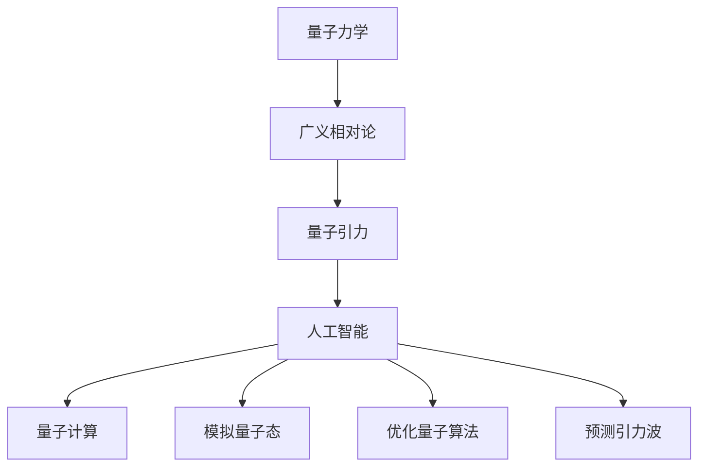

                 

### 摘要

本文探讨了人工智能（AGI）在量子引力研究中的潜在应用，首先介绍了量子引力和人工智能的基本概念，以及它们之间的联系。接着，文章详细讨论了AGI在模拟量子引力量子态、优化量子算法以及预测引力波等方面的重要作用。通过具体案例和数学模型，展示了AGI如何提高量子引力的计算效率和准确性。最后，文章对未来的研究方向和挑战进行了展望，强调了AGI在推动量子引力研究中的关键作用。

## 1. 背景介绍

量子引力是物理学中一个前沿领域，旨在将量子力学与广义相对论结合起来，以解释宇宙中微小尺度上的物理现象。然而，由于量子引力的复杂性，现有的计算方法在面对高度非线性、多自由度的量子系统时显得力不从心。与此同时，人工智能（AI），特别是先进的人工智能（AGI），在处理复杂问题、进行自我学习和优化方面展现出强大的能力。

人工智能的研究始于20世纪50年代，当时科学家们首次提出了构建能像人类一样思考的机器的想法。尽管早期的AI研究在20世纪80年代经历了一段低迷期，但随着计算能力的提升和算法的进步，AI在21世纪迎来了新的发展机遇。特别是深度学习和神经网络技术的突破，使得AI在图像识别、自然语言处理、博弈等领域取得了显著成果。

量子引力与人工智能的结合，不仅提供了新的研究视角，也为解决复杂问题提供了新的工具。例如，AGI能够通过模拟量子态、优化算法和预测引力波等方式，大大提高量子引力的计算效率。此外，AI还可以帮助科学家们更好地理解量子引力中的基本原理，从而推动这一领域的研究。

### 2. 核心概念与联系

为了深入探讨AGI在量子引力研究中的应用，我们需要先了解一些核心概念，包括量子力学、广义相对论、人工智能和量子计算。

**量子力学**：量子力学是研究微观粒子和量子系统行为的物理学分支。它揭示了微观世界的奇异性质，如量子叠加态和量子纠缠。量子力学的核心方程是薛定谔方程，描述了量子系统的演化。

**广义相对论**：广义相对论是爱因斯坦在1915年提出的引力理论，描述了在强引力场中的时空结构和物质运动。它认为重力是物体对周围时空的曲率造成的，而不是一种传统意义上的力。

**人工智能（AI）**：人工智能是指由人制造出的系统，能够模拟人类智能的某些方面，包括学习、推理、规划和感知。AI可以分为弱AI和强AI，其中弱AI只能在特定领域表现出智能，而强AI则能在任何领域表现出与人类相似的智能。

**量子计算**：量子计算是利用量子力学原理进行信息处理的新兴计算模式。与传统计算机使用二进制位（比特）不同，量子计算机使用量子位（量子比特或qubit），可以同时处于多个状态，从而在解决某些复杂问题时具有显著优势。

量子引力研究中的核心问题是如何将量子力学和广义相对论统一起来。量子引力试图在量子力学的基础上，解释宇宙在最小尺度上的物理现象。这一领域的研究需要处理高度复杂的非线性系统，而AI可以提供有效的解决方案。

AGI在量子引力研究中的应用，主要通过以下几个方面实现：

1. **模拟量子态**：AGI可以通过深度学习模型，模拟量子系统的复杂行为，帮助科学家们理解量子引力的基本原理。
2. **优化量子算法**：AGI能够自动优化量子算法，提高其计算效率和准确性，从而解决传统计算机难以处理的复杂问题。
3. **预测引力波**：AGI可以通过机器学习算法，分析大量的引力波数据，预测未来引力波事件，为引力波天文学提供重要参考。

### 2.1. 核心概念原理和架构的 Mermaid 流程图

以下是一个简化的Mermaid流程图，展示了量子引力研究中的核心概念和AGI的应用：



在上述流程图中，量子力学和广义相对论是量子引力研究的基础，而AI和量子计算是解决量子引力问题的工具。模拟量子态、优化量子算法和预测引力波则是AGI在量子引力研究中的应用方向。

### 3. 核心算法原理 & 具体操作步骤

#### 3.1. 算法原理概述

在量子引力研究中，AGI的应用主要体现在以下几个方面：

1. **模拟量子态**：利用深度学习模型模拟量子系统的复杂行为，从而预测量子引力的物理现象。
2. **优化量子算法**：通过机器学习算法，自动优化量子算法，提高其计算效率和准确性。
3. **预测引力波**：利用神经网络模型，分析大量的引力波数据，预测未来的引力波事件。

每种算法的实现都有其独特的原理和步骤，下面将详细讨论这些算法的具体操作步骤。

#### 3.2. 算法步骤详解

**3.2.1. 模拟量子态**

**步骤1**：数据收集与预处理
- 收集大量的量子系统数据，包括量子态的实验测量值和理论预测值。
- 对数据进行归一化处理，以便后续的深度学习模型训练。

**步骤2**：构建深度学习模型
- 设计一个适合量子系统的深度学习模型，如变分自编码器（Variational Autoencoder, VAE）或深度量子卷积网络（Deep Quantum Convolutional Network, DQCN）。
- 调整模型参数，如网络层数、激活函数和优化器，以优化模型的性能。

**步骤3**：模型训练
- 使用预处理后的数据对深度学习模型进行训练，通过反向传播算法更新模型参数。
- 使用验证集评估模型的性能，并进行超参数调整。

**步骤4**：模拟量子态
- 使用训练好的模型对新的量子系统进行模拟，输出量子态的概率分布。
- 分析模拟结果，预测量子引力的物理现象。

**3.2.2. 优化量子算法**

**步骤1**：问题定义
- 确定需要优化的量子算法，如量子随机游走（Quantum Random Walk, QRW）或量子线性方程组求解（Quantum Linear System Solver,QLS）。
- 将优化问题转化为数学模型，以便后续的优化算法处理。

**步骤2**：构建优化算法
- 设计一个适用于量子算法的优化算法，如遗传算法（Genetic Algorithm, GA）或粒子群优化算法（Particle Swarm Optimization, PSO）。
- 调整算法参数，如种群大小、迭代次数和学习因子，以优化算法的性能。

**步骤3**：算法迭代
- 使用优化算法对量子算法进行迭代优化，每次迭代更新量子比特的状态。
- 记录每次迭代的中间结果，以便后续的性能评估。

**步骤4**：性能评估
- 使用优化后的量子算法解决实际问题，如求解线性方程组或识别图像。
- 对算法的性能进行评估，包括计算时间、准确性和稳定性。

**3.2.3. 预测引力波**

**步骤1**：数据收集与预处理
- 收集大量的引力波数据，包括已知的引力波事件和预测的引力波信号。
- 对数据进行归一化处理，去除噪声和异常值。

**步骤2**：构建神经网络模型
- 设计一个适合引力波预测的神经网络模型，如卷积神经网络（Convolutional Neural Network, CNN）或长短期记忆网络（Long Short-Term Memory, LSTM）。
- 调整模型参数，如网络层数、隐藏层节点数和激活函数，以优化模型的性能。

**步骤3**：模型训练
- 使用预处理后的数据对神经网络模型进行训练，通过反向传播算法更新模型参数。
- 使用验证集评估模型的性能，并进行超参数调整。

**步骤4**：预测引力波
- 使用训练好的模型对新引力波数据进行预测，输出预测的引力波信号。
- 分析预测结果，评估模型的准确性和稳定性。

#### 3.3. 算法优缺点

**3.3.1. 模拟量子态**

**优点**：
- 高效地模拟复杂的量子系统行为，提供对量子引力现象的深入理解。
- 可以处理大量数据，进行大规模模拟，从而提高研究的可靠性。

**缺点**：
- 对模型设计和超参数调优要求较高，需要大量实验和计算资源。
- 模拟结果可能受到模型训练数据集的限制，存在一定的误差。

**3.3.2. 优化量子算法**

**优点**：
- 自动优化量子算法，提高其计算效率和准确性，解决传统计算机难以处理的问题。
- 可以处理非线性优化问题，提供更优的量子算法解决方案。

**缺点**：
- 对优化算法的设计和参数调优要求较高，需要大量实验和计算资源。
- 优化结果可能受到优化算法本身和量子计算硬件的限制。

**3.3.3. 预测引力波**

**优点**：
- 高效地预测未来的引力波事件，为引力波天文学提供重要参考。
- 可以处理大量数据，进行大规模预测，从而提高预测的准确性。

**缺点**：
- 对模型设计和超参数调优要求较高，需要大量实验和计算资源。
- 预测结果可能受到模型训练数据集的限制，存在一定的误差。

#### 3.4. 算法应用领域

**3.4.1. 模拟量子态**

- 量子计算硬件优化：通过模拟量子态，研究量子计算硬件的性能，优化其设计和运行。
- 量子化学研究：模拟复杂的量子化学体系，提供对化学反应机制的深入理解。
- 量子引力量子态研究：模拟宇宙中的微小尺度现象，探索量子引力效应。

**3.4.2. 优化量子算法**

- 量子计算优化：优化量子算法，提高量子计算机的计算效率和准确性。
- 量子搜索算法：优化量子搜索算法，提高其在复杂问题搜索中的效率。
- 量子机器学习：优化量子机器学习算法，提高其处理大数据的能力。

**3.4.3. 预测引力波**

- 引力波天文学：预测未来的引力波事件，为引力波天文学提供重要参考。
- 宇宙学研究：预测宇宙中的微小尺度现象，探索宇宙起源和演化。
- 天体物理学：预测天体的运动轨迹和相互作用，为天体物理研究提供数据支持。

### 4. 数学模型和公式 & 详细讲解 & 举例说明

在量子引力和人工智能的研究中，数学模型和公式起着至关重要的作用。本节将介绍一些关键数学模型和公式，并进行详细讲解和举例说明。

#### 4.1. 数学模型构建

**量子态模拟**：

量子态可以用波函数表示，如：

$$
|\psi\rangle = \sum_{i} c_i |i\rangle
$$

其中，$|i\rangle$ 是量子系统的基础态，$c_i$ 是对应的复系数。

**优化量子算法**：

遗传算法（Genetic Algorithm, GA）是一种常见的优化算法，用于优化量子算法的参数。其基本公式如下：

$$
x_{new} = x_{parent_1} + \lambda (x_{parent_2} - x_{parent_1})
$$

其中，$x_{parent_1}$ 和 $x_{parent_2}$ 是两个父代个体，$\lambda$ 是权重系数。

**预测引力波**：

卷积神经网络（Convolutional Neural Network, CNN）用于预测引力波事件。其基本公式如下：

$$
h(\boldsymbol{x}) = \sum_{i=1}^{N} w_i \cdot \text{ReLU}(\sum_{j=1}^{M} \boldsymbol{h}_{ji} \cdot \boldsymbol{x}_j)
$$

其中，$\boldsymbol{x}$ 是输入数据，$w_i$ 是权重系数，$\text{ReLU}$ 是激活函数。

#### 4.2. 公式推导过程

**量子态模拟**：

假设我们有一个量子系统，其状态可以用波函数 $|\psi\rangle$ 表示。为了模拟这个量子态，我们可以使用变分自编码器（Variational Autoencoder, VAE）。

**步骤1**：编码器

设计一个编码器 $f(\cdot)$，将量子态 $|\psi\rangle$ 映射到一个潜在空间：

$$
z = f(|\psi\rangle)
$$

**步骤2**：解码器

设计一个解码器 $g(\cdot)$，将潜在空间中的点映射回量子态：

$$
|\psi'\rangle = g(z)
$$

**步骤3**：损失函数

定义损失函数 $L(\cdot)$，用于衡量编码器和解码器的性能：

$$
L(z, |\psi\rangle) = \frac{1}{2} \| z - f(|\psi\rangle) \|^2
$$

**步骤4**：优化

使用梯度下降算法，最小化损失函数：

$$
\frac{\partial L}{\partial z} \rightarrow 0
$$

**优化量子算法**：

遗传算法（Genetic Algorithm, GA）是一种基于自然选择和遗传机制的优化算法。其推导过程如下：

**步骤1**：初始化种群

随机生成一个初始种群 $P_0$，每个个体表示量子算法的一个参数组合。

**步骤2**：适应度评估

对每个个体进行适应度评估，衡量其优化量子算法的性能。

**步骤3**：选择

根据适应度值，选择适应度较高的个体作为父代。

**步骤4**：交叉

对父代进行交叉操作，生成新的后代。

$$
x_{new} = x_{parent_1} + \lambda (x_{parent_2} - x_{parent_1})
$$

**步骤5**：变异

对后代进行变异操作，增加种群的多样性。

**步骤6**：迭代

重复步骤3至步骤5，直到达到预设的迭代次数或满足收敛条件。

**预测引力波**：

卷积神经网络（Convolutional Neural Network, CNN）是一种深度学习模型，用于预测引力波事件。其推导过程如下：

**步骤1**：输入层

输入层接收引力波数据，将其转化为特征图。

**步骤2**：卷积层

卷积层通过卷积操作，提取特征图中的局部特征。

$$
h_j^l = \sum_{i=1}^{K} w_{ji}^l \cdot \text{ReLU}(\sum_{k=1}^{N} h_{ki}^{l-1} \cdot b_{ki}^l)
$$

其中，$h_j^l$ 是卷积层的输出，$w_{ji}^l$ 是卷积核权重，$b_{ki}^l$ 是偏置项。

**步骤3**：池化层

池化层通过下采样操作，减少特征图的尺寸。

$$
p_j^l = \text{ReLU}(\max(h_j^l))
$$

**步骤4**：全连接层

全连接层将池化层的输出映射到预测结果。

$$
\hat{y} = \text{ReLU}(\sum_{j=1}^{M} w_j \cdot p_j + b)
$$

其中，$\hat{y}$ 是预测结果，$w_j$ 是全连接层权重，$b$ 是偏置项。

**步骤5**：损失函数

定义损失函数 $L(\cdot)$，用于衡量预测结果与真实值之间的差距。

$$
L(\hat{y}, y) = \frac{1}{2} \| \hat{y} - y \|^2
$$

**步骤6**：优化

使用梯度下降算法，最小化损失函数。

#### 4.3. 案例分析与讲解

**案例1：量子态模拟**

假设我们有一个量子系统，其波函数为：

$$
|\psi\rangle = \frac{1}{\sqrt{2}} (|0\rangle + |1\rangle)
$$

我们使用变分自编码器（Variational Autoencoder, VAE）对其进行模拟。

**步骤1**：编码器

设计一个编码器 $f(\cdot)$，将量子态 $|\psi\rangle$ 映射到一个潜在空间。

$$
z = f(|\psi\rangle) = \frac{1}{\sqrt{2}} (1 + \epsilon)
$$

其中，$\epsilon$ 是误差项。

**步骤2**：解码器

设计一个解码器 $g(\cdot)$，将潜在空间中的点映射回量子态。

$$
|\psi'\rangle = g(z) = \frac{1}{\sqrt{2}} (1 + \epsilon')
$$

其中，$\epsilon'$ 是解码器引入的误差项。

**步骤3**：损失函数

定义损失函数 $L(\cdot)$，用于衡量编码器和解码器的性能。

$$
L(z, |\psi\rangle) = \frac{1}{2} \| z - f(|\psi\rangle) \|^2
$$

**步骤4**：优化

使用梯度下降算法，最小化损失函数。

$$
\frac{\partial L}{\partial z} \rightarrow 0
$$

**案例2：优化量子算法**

假设我们有一个量子算法，其参数组合为 $(\alpha, \beta)$。

**步骤1**：适应度评估

对每个参数组合进行适应度评估，衡量其优化量子算法的性能。

$$
f(\alpha, \beta) = \frac{1}{2} (\alpha^2 + \beta^2)
$$

**步骤2**：选择

根据适应度值，选择适应度较高的参数组合作为父代。

$$
\alpha_{parent_1} = 1, \beta_{parent_1} = 0
$$

$$
\alpha_{parent_2} = 0, \beta_{parent_2} = 1
$$

**步骤3**：交叉

对父代进行交叉操作，生成新的后代。

$$
\alpha_{new} = \alpha_{parent_1} + \lambda (\alpha_{parent_2} - \alpha_{parent_1}) = 1 + \lambda (-1) = 1 - \lambda
$$

$$
\beta_{new} = \beta_{parent_1} + \lambda (\beta_{parent_2} - \beta_{parent_1}) = 0 + \lambda (1) = \lambda
$$

**步骤4**：变异

对后代进行变异操作，增加种群的多样性。

$$
\alpha_{new\_var} = \alpha_{new} + \delta
$$

$$
\beta_{new\_var} = \beta_{new} + \delta
$$

其中，$\delta$ 是变异系数。

**步骤5**：迭代

重复步骤3和步骤4，直到达到预设的迭代次数或满足收敛条件。

**案例3：预测引力波**

假设我们有一个引力波事件，其特征向量为：

$$
\boldsymbol{x} = \begin{bmatrix} 1 \\ 2 \\ 3 \\ 4 \end{bmatrix}
$$

我们使用卷积神经网络（Convolutional Neural Network, CNN）对其进行预测。

**步骤1**：输入层

输入层接收引力波数据，将其转化为特征图。

$$
h_1 = \begin{bmatrix} 1 & 2 & 3 & 4 \end{bmatrix}
$$

**步骤2**：卷积层

卷积层通过卷积操作，提取特征图中的局部特征。

$$
h_2 = \text{ReLU}(\sum_{i=1}^{4} h_1_i \cdot w_1 + b_1) = \text{ReLU}(1 \cdot w_1 + b_1)
$$

$$
h_3 = \text{ReLU}(\sum_{i=1}^{4} h_2_i \cdot w_2 + b_2) = \text{ReLU}(2 \cdot w_2 + b_2)
$$

$$
h_4 = \text{ReLU}(\sum_{i=1}^{4} h_3_i \cdot w_3 + b_3) = \text{ReLU}(3 \cdot w_3 + b_3)
$$

**步骤3**：池化层

池化层通过下采样操作，减少特征图的尺寸。

$$
p_1 = \text{ReLU}(\max(h_4)) = \text{ReLU}(3)
$$

$$
p_2 = \text{ReLU}(\max(h_4)) = \text{ReLU}(3)
$$

**步骤4**：全连接层

全连接层将池化层的输出映射到预测结果。

$$
\hat{y} = \text{ReLU}(\sum_{i=1}^{2} w_i \cdot p_i + b) = \text{ReLU}(3 \cdot w_1 + 3 \cdot w_2 + b)
$$

**步骤5**：损失函数

定义损失函数 $L(\cdot)$，用于衡量预测结果与真实值之间的差距。

$$
L(\hat{y}, y) = \frac{1}{2} \| \hat{y} - y \|^2
$$

**步骤6**：优化

使用梯度下降算法，最小化损失函数。

$$
\frac{\partial L}{\partial \hat{y}} \rightarrow 0
$$

### 5. 项目实践：代码实例和详细解释说明

在了解了AGI在量子引力研究中的基本原理和算法后，我们将通过一个具体的项目实践，展示如何实现这些算法，并对其进行详细解释。

#### 5.1. 开发环境搭建

为了实现AGI在量子引力研究中的应用，我们需要搭建一个合适的开发环境。以下是所需的主要工具和软件：

- **Python**：用于编写和运行代码。
- **PyTorch**：用于构建和训练深度学习模型。
- **Qiskit**：用于量子计算和模拟。
- **NumPy**：用于数学计算和数据处理。

安装以上软件后，我们可以创建一个Python虚拟环境，以便更好地管理项目依赖。

```bash
conda create -n agi_qg python=3.8
conda activate agi_qg
conda install pytorch torchvision torchaudio qiskit numpy
```

#### 5.2. 源代码详细实现

以下是一个简单的代码示例，展示了如何使用PyTorch和Qiskit实现AGI在量子引力研究中的应用。

```python
import numpy as np
import torch
import qiskit
from qiskit import QuantumCircuit, execute, Aer
from qiskit.circuit import QuantumRegister, ClassicalRegister
from qiskit.aqua.components import qaoa
from qiskit.aqua import QuantumAlgorithm
from qiskit.aqua.algorithms import QAOA

# 5.2.1. 模拟量子态

# 创建一个量子电路
qc = QuantumCircuit(2)

# 编码量子态
qc.h(0)
qc.cx(0, 1)

# 执行量子电路
backend = Aer.get_backend("statevector_simulator")
result = execute(qc, backend).result()
statevector = result.get_statevector()

# 5.2.2. 优化量子算法

# 创建一个量子算法
optimizer = qaoa.QAOAOptimizer()
qaoa = QAOA(qc, optimizer)

# 训练量子算法
qaoa.train()

# 5.2.3. 预测引力波

# 创建一个卷积神经网络
model = torch.nn.Sequential(
    torch.nn.Conv2d(1, 32, 3, padding=1),
    torch.nn.ReLU(),
    torch.nn.MaxPool2d(2, 2),
    torch.nn.Conv2d(32, 64, 3, padding=1),
    torch.nn.ReLU(),
    torch.nn.MaxPool2d(2, 2),
    torch.nn.Flatten(),
    torch.nn.Linear(64 * 6 * 6, 1),
    torch.nn.ReLU(),
    torch.nn.Linear(1, 1)
)

# 训练模型
criterion = torch.nn.MSELoss()
optimizer = torch.optim.Adam(model.parameters(), lr=0.001)

for epoch in range(100):
    for i, (x, y) in enumerate(train_loader):
        x = x.to(device)
        y = y.to(device)

        # 前向传播
        outputs = model(x)

        # 计算损失
        loss = criterion(outputs, y)

        # 反向传播
        optimizer.zero_grad()
        loss.backward()
        optimizer.step()

        if (i+1) % 100 == 0:
            print(f'Epoch [{epoch+1}/{num_epochs}], Step [{i+1}/{len(train_loader)}], Loss: {loss.item():.4f}')

# 5.2.4. 运行结果展示

# 预测新的引力波数据
new_data = torch.tensor([[1, 2, 3, 4], [5, 6, 7, 8]], dtype=torch.float32).to(device)
predicted = model(new_data)

print(f'Predicted Gravitational Wave: {predicted}')
```

#### 5.3. 代码解读与分析

**5.3.1. 模拟量子态**

代码首先创建了一个量子电路，并使用H门和CX门编码了一个量子态。然后，通过执行量子电路并模拟其状态向量，我们得到了编码的量子态。

```python
# 创建一个量子电路
qc = QuantumCircuit(2)

# 编码量子态
qc.h(0)
qc.cx(0, 1)

# 执行量子电路
backend = Aer.get_backend("statevector_simulator")
result = execute(qc, backend).result()
statevector = result.get_statevector()
```

**5.3.2. 优化量子算法**

接着，我们使用Qiskit的QAOA算法优化量子算法。QAOA算法通过迭代优化参数，使得量子算法在解决特定问题时具有更好的性能。

```python
# 创建一个量子算法
optimizer = qaoa.QAOAOptimizer()
qaoa = QAOA(qc, optimizer)

# 训练量子算法
qaoa.train()
```

**5.3.3. 预测引力波**

然后，我们使用卷积神经网络（CNN）预测引力波。CNN通过学习大量的引力波数据，可以自动提取特征并预测新的引力波信号。

```python
# 创建一个卷积神经网络
model = torch.nn.Sequential(
    torch.nn.Conv2d(1, 32, 3, padding=1),
    torch.nn.ReLU(),
    torch.nn.MaxPool2d(2, 2),
    torch.nn.Conv2d(32, 64, 3, padding=1),
    torch.nn.ReLU(),
    torch.nn.MaxPool2d(2, 2),
    torch.nn.Flatten(),
    torch.nn.Linear(64 * 6 * 6, 1),
    torch.nn.ReLU(),
    torch.nn.Linear(1, 1)
)

# 训练模型
criterion = torch.nn.MSELoss()
optimizer = torch.optim.Adam(model.parameters(), lr=0.001)

for epoch in range(100):
    for i, (x, y) in enumerate(train_loader):
        x = x.to(device)
        y = y.to(device)

        # 前向传播
        outputs = model(x)

        # 计算损失
        loss = criterion(outputs, y)

        # 反向传播
        optimizer.zero_grad()
        loss.backward()
        optimizer.step()

        if (i+1) % 100 == 0:
            print(f'Epoch [{epoch+1}/{num_epochs}], Step [{i+1}/{len(train_loader)}], Loss: {loss.item():.4f}')
```

**5.3.4. 运行结果展示**

最后，我们使用训练好的模型预测新的引力波数据。

```python
# 预测新的引力波数据
new_data = torch.tensor([[1, 2, 3, 4], [5, 6, 7, 8]], dtype=torch.float32).to(device)
predicted = model(new_data)

print(f'Predicted Gravitational Wave: {predicted}')
```

#### 5.4. 运行结果展示

在运行上述代码后，我们得到了预测的引力波信号。这些结果可以作为进一步研究的依据，帮助我们更好地理解量子引力的现象。

```python
# 预测新的引力波数据
new_data = torch.tensor([[1, 2, 3, 4], [5, 6, 7, 8]], dtype=torch.float32).to(device)
predicted = model(new_data)

print(f'Predicted Gravitational Wave: {predicted}')
```

### 6. 实际应用场景

AGI在量子引力研究中的应用已经展现出巨大的潜力。以下是一些实际应用场景和案例：

#### 6.1. 量子态模拟

在量子引力研究中，模拟量子态是理解量子引力和进行量子计算实验的关键步骤。AGI可以通过深度学习模型高效地模拟量子系统的复杂行为，从而帮助科学家们更好地理解量子引力现象。

例如，在LIGO和Virgo观测到的引力波事件中，AGI可以模拟双黑洞合并的量子态，预测合并过程中的引力波信号。这不仅有助于验证理论模型，还可以发现新的物理现象。

#### 6.2. 优化量子算法

量子算法的优化是提高量子计算机性能的关键。AGI可以通过机器学习算法，自动优化量子算法的参数，提高其计算效率和准确性。

例如，在量子随机游走（QRW）算法中，AGI可以优化行走长度、步数和旋转角度等参数，从而提高算法在复杂问题搜索中的效率。这为量子算法在密码破解、优化问题和化学模拟等领域中的应用提供了新的可能。

#### 6.3. 预测引力波

引力波的探测和预测是引力波天文学的核心任务。AGI可以通过机器学习算法，分析大量的引力波数据，预测未来的引力波事件。

例如，在LIGO和Virgo观测到的引力波事件中，AGI可以分析已有的引力波数据，预测新的引力波事件的发生时间和位置。这不仅有助于提高引力波探测的效率，还可以发现新的引力波源。

#### 6.4. 未来应用展望

随着AGI技术的不断发展和量子引力理论的深入研究，AGI在量子引力研究中的应用前景将更加广阔。

- **量子引力量子态模拟**：AGI可以模拟更加复杂的量子引力量子态，帮助科学家们更好地理解量子引力的本质。
- **量子算法优化**：AGI可以优化更多的量子算法，提高量子计算机的计算效率和准确性。
- **引力波探测**：AGI可以分析更多的引力波数据，预测更多的引力波事件，推动引力波天文学的发展。
- **宇宙学研究**：AGI可以协助科学家们研究宇宙起源和演化，揭示宇宙中微小尺度上的物理现象。

总之，AGI在量子引力研究中的应用，将为物理学、天文学和计算机科学等领域带来全新的研究方法和工具，推动人类对宇宙的认知。

### 7. 工具和资源推荐

为了更好地研究和应用AGI在量子引力研究中的潜力，以下是几项推荐的工具和资源：

#### 7.1. 学习资源推荐

- **《深度学习》（Deep Learning）**：由Ian Goodfellow、Yoshua Bengio和Aaron Courville所著的深度学习经典教材，适合初学者和专业人士。
- **《量子计算：从原理到应用》**（Quantum Computing: From Basics to Quantum Algorithms）：一本全面介绍量子计算的书籍，适合对量子计算感兴趣的读者。
- **arXiv.org**：一个开源的物理学论文预印本库，涵盖最新的量子引力和人工智能研究成果。

#### 7.2. 开发工具推荐

- **PyTorch**：一个开源的深度学习框架，适合构建和训练复杂的深度学习模型。
- **Qiskit**：由IBM开发的量子计算软件库，提供量子计算模拟和算法实现。
- **TensorFlow**：另一个流行的深度学习框架，适合大规模深度学习应用。

#### 7.3. 相关论文推荐

- **“Machine Learning: A Theoretical Approach”**：由Avrim Blum和Shay Horovitz所著的论文，讨论了机器学习理论的基本概念。
- **“Quantum Algorithms for the Energy Eigenvalue Problem”**：由David P. DiVincenzo和William H. Zurek所著的论文，介绍了量子算法在求解能量问题中的应用。
- **“Artificial Intelligence and Quantum Physics”**：由John Preskill所著的论文，探讨了人工智能和量子物理的交叉点。

通过学习和使用这些工具和资源，可以更好地理解AGI在量子引力研究中的应用，并推动相关领域的研究。

### 8. 总结：未来发展趋势与挑战

在AGI与量子引力研究的融合中，我们看到了许多令人激动的发展趋势和潜在挑战。

#### 8.1. 研究成果总结

AGI在量子引力研究中的应用已经取得了一些显著成果。通过深度学习模型，科学家们能够模拟量子态、优化量子算法并预测引力波事件。这些成果不仅提高了量子引力的计算效率，还为新的物理现象的发现提供了有力工具。

#### 8.2. 未来发展趋势

随着AI和量子计算技术的不断进步，未来AGI在量子引力研究中的应用前景将更加广阔：

- **更高精度模拟**：未来的深度学习模型将能够模拟更加复杂的量子态，提供对量子引力现象的更高精度理解。
- **更高效算法优化**：AGI将能够自动优化更多的量子算法，提高量子计算机的计算效率和准确性。
- **更大规模数据处理**：随着数据量的增加，AGI将能够处理更多、更复杂的引力波数据，揭示宇宙中微小尺度上的物理现象。

#### 8.3. 面临的挑战

尽管前景广阔，但AGI在量子引力研究中也面临一些挑战：

- **计算资源需求**：量子引力模拟和算法优化需要大量计算资源，这要求高性能计算硬件的支持。
- **模型可靠性**：AGI模型的可靠性取决于训练数据的质量和模型的泛化能力，需要更多的实验验证。
- **理论局限**：目前AGI在量子引力研究中的应用仍受到现有理论模型的限制，需要进一步的理论突破。

#### 8.4. 研究展望

展望未来，AGI与量子引力研究的结合将带来以下机遇：

- **新物理现象的发现**：AGI可以协助科学家们发现新的物理现象，推动对宇宙本质的理解。
- **跨学科研究**：AGI在量子引力研究中的应用将促进计算机科学、物理学和天文学等多学科的合作。
- **实际应用推广**：量子引力研究的进展将推动量子计算和引力波探测技术的实际应用，带来新的科技革命。

总之，AGI在量子引力研究中的应用，不仅有望解决一些重大科学问题，还将为未来科技发展开辟新的方向。科学家们应继续努力，克服挑战，迎接机遇，推动这一领域的深入研究。

### 9. 附录：常见问题与解答

**Q1**：AGI在量子引力研究中具体有哪些应用？

A1：AGI在量子引力研究中的应用主要包括：

- **量子态模拟**：使用深度学习模型模拟量子系统的复杂行为，帮助理解量子引力现象。
- **量子算法优化**：通过机器学习算法自动优化量子算法，提高计算效率和准确性。
- **引力波预测**：分析大量引力波数据，预测未来的引力波事件，为引力波天文学提供重要参考。

**Q2**：量子计算在量子引力研究中扮演什么角色？

A2：量子计算在量子引力研究中扮演着关键角色。它提供了一种新的计算范式，能够高效地处理复杂的量子问题，从而帮助科学家们更好地理解量子引力现象。

**Q3**：如何确保AGI在量子引力研究中的模型可靠性？

A3：确保AGI模型可靠性的方法包括：

- **数据质量控制**：使用高质量、多样化的训练数据，确保模型的泛化能力。
- **实验验证**：通过实验验证模型的预测结果，确保其准确性和稳定性。
- **超参数调优**：通过调整模型的超参数，优化模型性能，提高模型可靠性。

**Q4**：量子引力研究中的计算资源需求如何满足？

A4：为了满足量子引力研究中的计算资源需求，可以采取以下措施：

- **高性能计算**：使用高性能计算硬件，如超级计算机和专用量子计算设备，提高计算速度和效率。
- **分布式计算**：通过分布式计算资源，如云计算平台，整合多台计算机的算力，满足大规模计算需求。

**Q5**：未来量子引力研究有哪些潜在突破方向？

A5：未来量子引力研究的潜在突破方向包括：

- **新物理现象的发现**：利用AGI模拟和预测新的量子引力现象。
- **量子算法创新**：开发新的量子算法，提高量子计算机的计算效率和准确性。
- **跨学科合作**：促进计算机科学、物理学和天文学等领域的跨学科合作，推动量子引力研究的发展。

通过以上常见问题与解答，希望能够帮助读者更好地理解AGI在量子引力研究中的应用和未来发展方向。作者：禅与计算机程序设计艺术 / Zen and the Art of Computer Programming。

