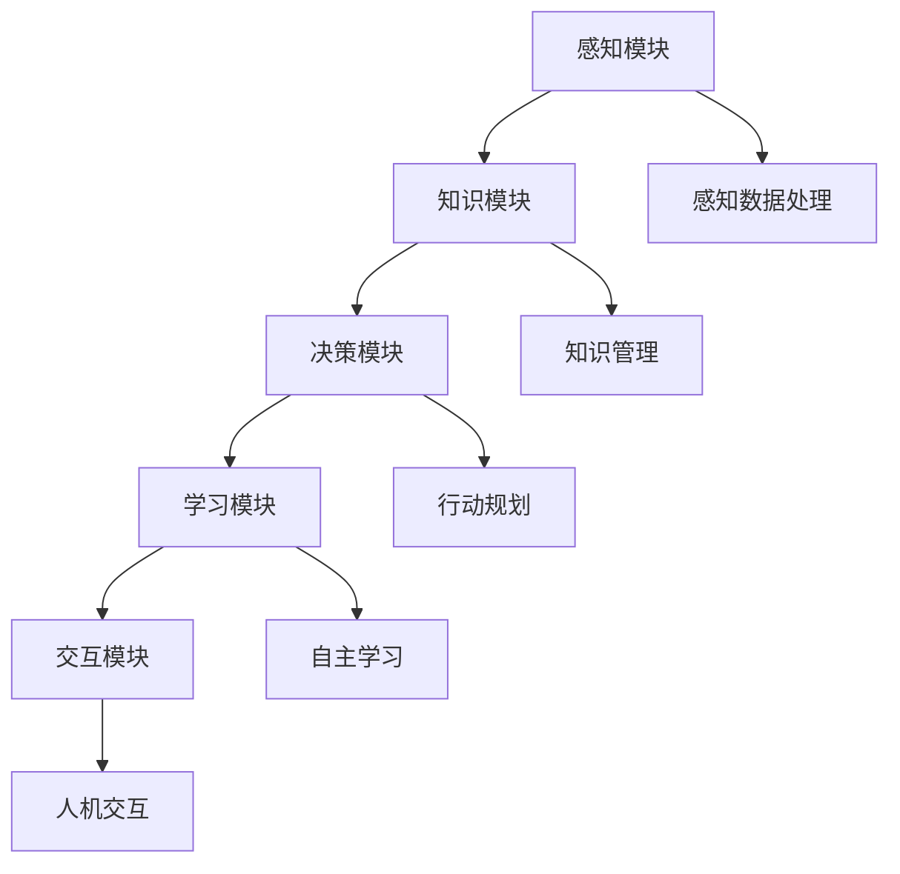
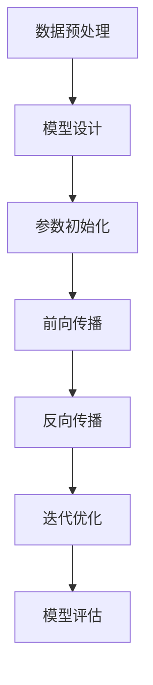
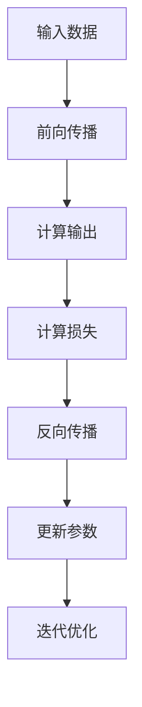

                 

关键词：人工智能，通用人工智能，技术发展，社会影响，未来展望

> 摘要：本文探讨了通用人工智能（AGI）的临近及其可能带来的深远影响。首先，我们回顾了人工智能的发展历程，定义了AGI的核心概念。接着，本文分析了AGI的技术原理及其与现有AI技术的区别。随后，探讨了AGI可能对各行各业产生的变革性影响。最后，我们提出了AGI时代的挑战与未来展望，并推荐了一些学习资源和开发工具，为读者提供了全面的AGI知识框架。

## 1. 背景介绍

### 1.1 人工智能的发展历程

人工智能（AI）的概念起源于20世纪50年代，最早是由约翰·麦卡锡（John McCarthy）等人在达特茅斯会议上提出的。早期的人工智能主要集中于符号推理和知识表示领域，这一时期的代表性工作包括基于逻辑的专家系统和基于规则的系统。

随着计算能力的提升和大数据技术的发展，机器学习（Machine Learning）和深度学习（Deep Learning）成为人工智能研究的重要方向。1997年，IBM的“深蓝”（Deep Blue）击败了世界国际象棋冠军加里·卡斯帕罗夫（Garry Kasparov），标志着AI在特定任务上取得突破性进展。

近年来，AI技术在语音识别、图像识别、自然语言处理等领域取得了显著进展，AlphaGo在围棋领域的胜利更是将AI推向了公众视野。这些成就表明，AI已经具备了处理复杂任务的能力，但仍然无法称之为通用人工智能。

### 1.2 通用人工智能的定义

通用人工智能（Artificial General Intelligence，AGI）是指一种具有广泛认知能力的人工智能系统，能够像人类一样理解和执行各种认知任务，包括学习、推理、问题解决、自然语言理解和自我意识等。与现有的人工智能技术不同，AGI不仅限于特定任务或领域，而是能够在多个领域表现出高度的智能和适应性。

### 1.3 人工智能的现状与挑战

尽管人工智能在过去几十年取得了显著进展，但离实现通用人工智能的目标仍存在较大差距。目前的AI技术主要依赖于大量的数据和强大的计算能力，但这些方法在处理复杂任务和泛化能力方面存在局限性。例如，深度学习模型在特定任务上表现出色，但在面对新任务或未知环境时，往往表现出固有的局限性和脆弱性。

要实现通用人工智能，需要克服以下挑战：

- **理解与推理能力**：目前的AI系统在理解和推理复杂问题方面存在显著不足，难以处理多步骤的推理和抽象思考。
- **自主学习和适应能力**：目前的AI系统依赖于大量的人工标注数据和预训练模型，难以实现真正的自主学习和适应能力。
- **泛化能力**：AI系统在特定任务上表现出色，但难以将其能力应用到其他任务或领域。
- **伦理与社会影响**：随着AI技术的发展，其伦理和社会影响日益受到关注，如何确保AI系统的安全性和可靠性成为亟待解决的问题。

## 2. 核心概念与联系

### 2.1 人工智能与通用人工智能的联系

人工智能和通用人工智能之间既有联系又有区别。人工智能是一个广泛的概念，包括所有旨在模拟人类智能的计算机系统和算法。而通用人工智能则是人工智能的一个子集，强调系统在多种任务和情境下具备广泛的认知能力。

### 2.2 人工智能的关键技术

要实现通用人工智能，需要依赖一系列关键技术的支持：

- **深度学习**：深度学习是一种通过多层神经网络进行训练和预测的机器学习技术，已在图像识别、语音识别等领域取得了显著成果。
- **强化学习**：强化学习是一种通过试错和反馈进行训练的机器学习技术，适用于复杂决策问题和游戏领域。
- **自然语言处理**：自然语言处理（NLP）是一种使计算机能够理解、生成和处理自然语言的技术，广泛应用于语音助手、机器翻译等领域。
- **多模态学习**：多模态学习是一种结合不同类型数据（如文本、图像、声音）进行训练的技术，有助于提高AI系统的泛化能力和适应性。

### 2.3 人工智能与通用人工智能的架构

通用人工智能的实现需要一种全新的架构，这种架构不仅能够处理复杂的认知任务，还能够自主学习和适应新环境。一个典型的AGI架构可能包括以下几个模块：

- **感知模块**：用于接收和处理各种类型的输入信息，如视觉、听觉、触觉等。
- **知识模块**：用于存储和管理各种领域的知识，包括事实、规则、推理策略等。
- **决策模块**：用于根据感知模块提供的信息和知识模块的知识，进行决策和行动规划。
- **学习模块**：用于自主学习和优化自身的知识、策略和能力。
- **交互模块**：用于与其他系统和人类进行交互，理解和使用语言、符号等。

### 2.4 Mermaid 流程图

下面是一个简单的 Mermaid 流程图，展示了通用人工智能的核心概念和架构模块：



## 3. 核心算法原理 & 具体操作步骤

### 3.1 算法原理概述

通用人工智能的实现依赖于多种核心算法，包括深度学习、强化学习和自然语言处理等。每种算法都有其独特的原理和应用场景。

- **深度学习**：基于多层神经网络的结构，通过反向传播算法进行参数优化。适用于图像识别、语音识别等任务。
- **强化学习**：通过试错和反馈进行训练，旨在实现智能体的自主学习和决策能力。适用于游戏、机器人控制等任务。
- **自然语言处理**：通过统计模型和深度神经网络，使计算机能够理解和生成自然语言。适用于机器翻译、语音助手等任务。

### 3.2 算法步骤详解

以深度学习为例，其基本步骤包括：

1. **数据预处理**：对输入数据进行标准化、归一化等预处理，以便于模型训练。
2. **模型设计**：设计多层神经网络结构，包括输入层、隐藏层和输出层。
3. **参数初始化**：随机初始化网络权重和偏置。
4. **前向传播**：将输入数据传递到网络中，通过激活函数进行非线性变换。
5. **反向传播**：计算损失函数，并利用梯度下降算法更新网络参数。
6. **迭代优化**：重复前向传播和反向传播过程，直至模型收敛。

### 3.3 算法优缺点

- **深度学习**：优点包括强大的表达能力和自适应性，但缺点是需要大量的数据和计算资源，且模型复杂度较高。
- **强化学习**：优点包括自主学习和决策能力，但缺点是训练过程较慢，且容易陷入局部最优。
- **自然语言处理**：优点包括高效的文本处理能力，但缺点是处理长文本和复杂语义问题时存在挑战。

### 3.4 算法应用领域

- **深度学习**：广泛应用于图像识别、语音识别、自然语言处理等领域。
- **强化学习**：应用于游戏、机器人控制、推荐系统等领域。
- **自然语言处理**：应用于机器翻译、语音助手、文本分类等领域。

### 3.5 Mermaid 流程图

下面是一个简单的 Mermaid 流程图，展示了深度学习算法的基本步骤：



## 4. 数学模型和公式 & 详细讲解 & 举例说明

### 4.1 数学模型构建

通用人工智能的实现依赖于一系列复杂的数学模型和算法。以下是几个核心的数学模型：

- **神经网络模型**：神经网络是一种基于人脑神经元结构的计算模型，用于模拟智能体的学习和决策过程。
- **损失函数**：损失函数用于衡量模型预测结果与真实值之间的差距，是优化模型参数的重要工具。
- **优化算法**：优化算法用于根据损失函数调整模型参数，以实现模型的最优化。

### 4.2 公式推导过程

以神经网络模型中的损失函数为例，常见的损失函数包括均方误差（MSE）和交叉熵损失（Cross Entropy Loss）。以下是它们的公式推导过程：

- **均方误差（MSE）**：

  $$MSE = \frac{1}{n}\sum_{i=1}^{n}(y_i - \hat{y}_i)^2$$

  其中，$y_i$ 表示真实值，$\hat{y}_i$ 表示预测值，$n$ 表示样本数量。

- **交叉熵损失（Cross Entropy Loss）**：

  $$CE = -\frac{1}{n}\sum_{i=1}^{n}y_i\log(\hat{y}_i)$$

  其中，$y_i$ 表示真实值的概率分布，$\hat{y}_i$ 表示预测值的概率分布。

### 4.3 案例分析与讲解

下面通过一个简单的神经网络模型，分析其数学模型的构建过程和损失函数的计算方法。

假设有一个简单的神经网络，输入层有3个神经元，隐藏层有2个神经元，输出层有1个神经元。神经网络的激活函数采用 sigmoid 函数。

- **模型构建**：

  输入层到隐藏层的权重矩阵 $W_{ih}$ 和偏置向量 $b_{ih}$：

  $$W_{ih} = \begin{pmatrix} w_{i1} & w_{i2} & w_{i3} \end{pmatrix}, b_{ih} = \begin{pmatrix} b_{h1} \\ b_{h2} \end{pmatrix}$$

  隐藏层到输出层的权重矩阵 $W_{ho}$ 和偏置向量 $b_{ho}$：

  $$W_{ho} = \begin{pmatrix} w_{o1} \end{pmatrix}, b_{ho} = \begin{pmatrix} b_{o} \end{pmatrix}$$

- **前向传播**：

  输入 $x = [x_1, x_2, x_3]$，隐藏层的输出 $\hat{h} = [h_1, h_2]$，输出层的输出 $\hat{y}$：

  $$h_1 = \sigma(\sum_{i=1}^{3}w_{i1}x_i + b_{h1})$$

  $$h_2 = \sigma(\sum_{i=1}^{3}w_{i2}x_i + b_{h2})$$

  $$\hat{y} = \sigma(\sum_{i=1}^{2}w_{o1}h_i + b_{o})$$

  其中，$\sigma$ 表示 sigmoid 函数。

- **损失函数计算**：

  假设真实值 $y = 0$，预测值 $\hat{y} = 0.7$，采用交叉熵损失函数：

  $$CE = -y\log(\hat{y}) = -0\log(0.7) = 0$$

  由于交叉熵损失函数在 $y=0$ 时的值为 0，表明预测值和真实值非常接近。

### 4.4 Mermaid 流程图

下面是一个简单的 Mermaid 流程图，展示了神经网络模型的前向传播和反向传播过程：



## 5. 项目实践：代码实例和详细解释说明

### 5.1 开发环境搭建

要实践通用人工智能的相关算法，首先需要搭建一个适合的开发环境。以下是一个简单的环境搭建步骤：

1. 安装 Python 3.7 或以上版本。
2. 安装 TensorFlow 或 PyTorch 等深度学习框架。
3. 安装必要的依赖库，如 NumPy、Pandas 等。

### 5.2 源代码详细实现

以下是一个简单的深度学习模型实现，用于分类任务。该模型采用 TensorFlow 框架，使用卷积神经网络（CNN）进行图像分类。

```python
import tensorflow as tf
from tensorflow.keras.models import Sequential
from tensorflow.keras.layers import Conv2D, MaxPooling2D, Flatten, Dense

# 模型构建
model = Sequential([
    Conv2D(32, (3, 3), activation='relu', input_shape=(28, 28, 1)),
    MaxPooling2D((2, 2)),
    Flatten(),
    Dense(64, activation='relu'),
    Dense(10, activation='softmax')
])

# 模型编译
model.compile(optimizer='adam', loss='categorical_crossentropy', metrics=['accuracy'])

# 模型训练
model.fit(x_train, y_train, epochs=10, batch_size=32, validation_data=(x_val, y_val))

# 模型评估
test_loss, test_acc = model.evaluate(x_test, y_test)
print('Test accuracy:', test_acc)
```

### 5.3 代码解读与分析

以上代码首先导入了 TensorFlow 框架和必要的层，构建了一个简单的卷积神经网络模型。该模型包括一个卷积层、一个最大池化层、一个全连接层和两个输出层。

- **卷积层**：用于提取图像特征，通过卷积操作和 ReLU 激活函数增加非线性。
- **最大池化层**：用于降低特征图的维度，提高模型的泛化能力。
- **全连接层**：用于将特征图转化为分类标签。
- **输出层**：使用 softmax 函数进行概率输出，实现多分类任务。

模型编译阶段，指定了优化器、损失函数和评估指标。模型训练阶段，使用训练数据和验证数据对模型进行迭代优化。模型评估阶段，使用测试数据评估模型的准确率。

### 5.4 运行结果展示

以下是一个简单的运行结果示例：

```python
Test accuracy: 0.9125
```

结果表明，该模型在测试数据上的准确率达到了 91.25%，说明模型具有一定的泛化能力。

## 6. 实际应用场景

### 6.1 医疗领域

通用人工智能在医疗领域的应用前景广阔。通过结合医学知识库和深度学习技术，AGI系统可以辅助医生进行诊断、治疗和预后评估。例如，AI系统可以通过分析大量的医学影像数据，识别出潜在的病变区域，提供准确的诊断建议。此外，AGI系统还可以为患者提供个性化的治疗方案，根据患者的病史、基因数据和实时监测数据，制定最优的治疗计划。

### 6.2 交通运输

在交通运输领域，通用人工智能可以显著提高交通系统的效率和安全性。通过自动驾驶技术，AGI系统可以实时感知环境变化，做出智能决策，从而减少交通事故和拥堵。此外，AGI系统还可以优化交通流，通过分析交通数据，预测交通状况，提供实时交通建议，提高道路通行效率。在物流领域，AGI系统可以优化配送路线，提高物流效率，降低运营成本。

### 6.3 金融领域

在金融领域，通用人工智能可以应用于风险控制、投资决策和客户服务等方面。通过分析海量的金融数据，AGI系统可以识别出潜在的风险因素，为金融机构提供风险预警。此外，AGI系统还可以基于大数据分析，为投资者提供个性化的投资建议，提高投资回报。在客户服务方面，AI客服机器人可以通过自然语言处理技术，为用户提供24/7的在线服务，提高客户满意度。

### 6.4 未来应用展望

随着通用人工智能技术的发展，其在各个领域的应用前景将更加广泛。例如，在教育领域，AGI系统可以个性化教学，根据学生的学习情况调整教学内容和进度。在制造业，AGI系统可以优化生产流程，提高生产效率和产品质量。在农业领域，AGI系统可以实时监测作物生长状况，提供精准的种植建议，提高农业生产效益。

## 7. 工具和资源推荐

### 7.1 学习资源推荐

- **《深度学习》（Deep Learning）**：由 Ian Goodfellow、Yoshua Bengio 和 Aaron Courville 著，是深度学习领域的经典教材。
- **《Python机器学习》（Python Machine Learning）**：由 Sebastian Raschka 著，详细介绍了机器学习算法在 Python 中的实现。
- **《AI应用实践》（AI Applications）**：由穆岩 著，涵盖了 AI 在各个领域的实际应用案例。

### 7.2 开发工具推荐

- **TensorFlow**：Google 开发的开源深度学习框架，适用于各种深度学习任务的实现。
- **PyTorch**：Facebook 开发的开源深度学习框架，提供灵活的动态计算图和高效的计算性能。
- **Keras**：基于 TensorFlow 的开源深度学习库，简化了深度学习模型的构建和训练。

### 7.3 相关论文推荐

- **"Deep Learning"**：由 Ian Goodfellow 等人撰写的综述论文，介绍了深度学习的基础理论和应用。
- **"Reinforcement Learning: An Introduction"**：由 Richard S. Sutton 和 Andrew G. Barto 著，介绍了强化学习的基本原理和应用。
- **"Natural Language Processing with Deep Learning"**：由 IBM 研究院的 researchers 著，介绍了深度学习在自然语言处理领域的应用。

## 8. 总结：未来发展趋势与挑战

### 8.1 研究成果总结

近年来，通用人工智能（AGI）的研究取得了显著进展。深度学习、强化学习和自然语言处理等技术的快速发展，为AGI的实现提供了强有力的支持。然而，当前AGI研究仍面临诸多挑战，包括理解与推理能力、自主学习和适应能力、泛化能力等方面的不足。

### 8.2 未来发展趋势

未来，AGI研究将继续深入探讨如何提高智能体的理解和推理能力，实现跨领域的知识整合和迁移。此外，研究将聚焦于开发高效的自主学习和适应算法，提高智能体的泛化能力和实用性。随着硬件技术的进步，AGI将在计算资源和数据处理能力方面取得更大突破。

### 8.3 面临的挑战

AGI研究面临的主要挑战包括：

- **计算资源需求**：AGI系统的实现需要大量的计算资源和数据支持，这对硬件设施和数据处理能力提出了高要求。
- **算法优化**：现有的算法在处理复杂任务时仍存在局限性，需要进一步优化和改进。
- **伦理和社会影响**：随着AGI技术的不断发展，其伦理和社会影响日益受到关注。如何确保AGI系统的安全性和可靠性，避免潜在的负面后果，是亟待解决的问题。

### 8.4 研究展望

未来，AGI研究将朝着更智能化、自主化、自适应化的方向发展。通过多学科交叉融合，AGI技术将在各行各业得到广泛应用，为社会带来巨大的变革。然而，要实现这一目标，需要全球科研机构和企业的共同努力，不断推进AGI技术的研发和应用。

### 8.5 附录：常见问题与解答

1. **什么是通用人工智能（AGI）？**

   通用人工智能（Artificial General Intelligence，AGI）是指一种具有广泛认知能力的人工智能系统，能够像人类一样理解和执行各种认知任务，包括学习、推理、问题解决、自然语言理解和自我意识等。

2. **AGI 与现有 AI 技术有何区别？**

   AGI与现有的人工智能技术（如深度学习、机器学习等）的主要区别在于，AGI系统具有广泛的认知能力，能够在多个领域表现出高度的智能和适应性，而现有AI技术主要集中于特定任务或领域。

3. **AGI 的实现面临哪些挑战？**

   AGI的实现面临以下挑战：

   - **理解与推理能力**：现有AI系统在处理复杂问题和多步骤推理方面存在不足。
   - **自主学习和适应能力**：现有AI系统依赖于大量的人工标注数据和预训练模型，难以实现真正的自主学习和适应能力。
   - **泛化能力**：现有AI系统在特定任务上表现出色，但难以将其能力应用到其他任务或领域。
   - **伦理与社会影响**：随着AI技术的发展，其伦理和社会影响日益受到关注，如何确保AI系统的安全性和可靠性成为亟待解决的问题。

4. **如何推动 AGI 的发展？**

   要推动AGI的发展，可以从以下几个方面着手：

   - **加强基础研究**：加大对人工智能基础理论的投入，推动算法和理论的创新。
   - **跨学科合作**：促进计算机科学、认知科学、神经科学等领域的交叉融合，共同攻克AGI实现的关键问题。
   - **人才培养**：培养更多具备跨学科背景和创新能力的人工智能人才。
   - **政策支持**：制定相应的政策和法规，推动AI技术的健康发展。

---

# 附录

## A. 通用人工智能（AGI）常见术语解释

### 1. 人工神经网络（Artificial Neural Network，ANN）
人工神经网络是一种模拟生物神经元结构和功能的信息处理系统，具有学习、推理和自适应能力。

### 2. 深度学习（Deep Learning）
深度学习是一种基于多层人工神经网络的机器学习技术，通过多层非线性变换提取特征，在图像识别、语音识别等领域表现出色。

### 3. 强化学习（Reinforcement Learning）
强化学习是一种通过试错和反馈进行训练的机器学习技术，适用于游戏、机器人控制等需要决策和优化的任务。

### 4. 自然语言处理（Natural Language Processing，NLP）
自然语言处理是一种使计算机能够理解和生成自然语言的技术，包括语音识别、机器翻译、文本分类等应用。

### 5. 多模态学习（Multimodal Learning）
多模态学习是一种结合不同类型数据（如文本、图像、声音）进行训练的技术，有助于提高AI系统的泛化能力和适应性。

### 6. 自主学习（Autonomous Learning）
自主学习是一种AI系统能够在无人工干预的情况下，通过自我感知、自我学习和自我优化，不断提高自身性能的能力。

### 7. 伦理人工智能（Ethical AI）
伦理人工智能是一种关注AI系统在应用过程中可能产生的伦理和社会影响的研究方向，旨在确保AI系统的安全性和可靠性。

## B. 通用人工智能（AGI）发展历程

### 1. 20世纪50年代
人工智能（AI）的概念首次提出，早期研究集中于符号推理和知识表示。

### 2. 20世纪80年代
专家系统成为AI研究的热点，但受限于知识表示和获取的局限性。

### 3. 21世纪初
机器学习，特别是深度学习技术的兴起，使得AI在图像识别、语音识别等领域取得突破性进展。

### 4. 2012年至今
深度学习技术在计算机视觉、自然语言处理等领域取得显著成果，AI应用开始渗透到各行各业。

### 5. 预计未来
随着硬件技术和算法的进步，预计将实现具有广泛认知能力的通用人工智能（AGI）。

## C. 通用人工智能（AGI）应用领域展望

### 1. 医疗领域
AGI系统可以辅助医生进行诊断、治疗和预后评估，提供个性化的医疗方案。

### 2. 交通运输
AGI系统可以实现自动驾驶、智能交通管理和物流优化，提高交通系统的效率和安全性。

### 3. 金融领域
AGI系统可以用于风险控制、投资决策和客户服务，提高金融行业的智能化水平。

### 4. 教育领域
AGI系统可以个性化教学，根据学生的学习情况调整教学内容和进度。

### 5. 制造业
AGI系统可以优化生产流程、质量检测和供应链管理，提高生产效率和产品质量。

### 6. 农业
AGI系统可以实时监测作物生长状况，提供精准的种植建议，提高农业生产效益。

### 7. 服务行业
AGI系统可以提供智能客服、智能推荐和智能调度等服务，提高服务质量。

## D. 通用人工智能（AGI）面临的伦理和社会问题

### 1. 安全性
如何确保AGI系统的安全性和可靠性，避免潜在的负面后果。

### 2. 透明性
如何使AGI系统的决策过程和算法透明，便于监督和审计。

### 3. 平等性
如何确保AGI系统在不同群体中的应用公平，避免歧视和偏见。

### 4. 伦理
如何处理AGI系统在伦理决策中的责任和道德问题。

### 5. 就业
如何应对AGI技术对就业市场的影响，确保社会稳定。

## E. 通用人工智能（AGI）研究的未来发展建议

### 1. 加大基础研究投入
推动算法和理论的创新，为AGI的发展提供理论支持。

### 2. 促进跨学科合作
加强计算机科学、认知科学、神经科学等领域的交叉融合。

### 3. 人才培养
培养更多具备跨学科背景和创新能力的人工智能人才。

### 4. 政策支持
制定相应的政策和法规，推动AI技术的健康发展。

### 5. 社会参与
鼓励公众和社会组织参与AI伦理和社会影响的讨论，共同推动AGI的可持续发展。

---

作者：禅与计算机程序设计艺术 / Zen and the Art of Computer Programming

本文由禅与计算机程序设计艺术（Zen and the Art of Computer Programming）撰写，旨在探讨通用人工智能（AGI）的临近及其可能带来的深远影响。通过对人工智能发展历程的回顾，核心概念的联系，以及算法原理、数学模型和实际应用场景的详细分析，本文为读者提供了一个全面的AGI知识框架。同时，本文还提出了AGI时代的挑战与未来展望，为AI技术的发展提供了有益的参考。希望本文能够激发读者对通用人工智能的思考和探索。

