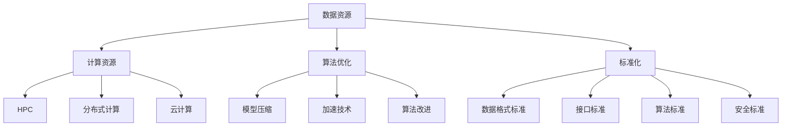

                 

在人工智能（AI）的快速发展中，AI 2.0 作为新一代人工智能的核心概念，正在逐渐改变我们对于智能系统的理解和应用。AI 2.0 不仅强调深度学习和神经网络等传统技术，更注重智能化基础设施的建设，包括数据、计算资源、算法优化和标准化等方面的全面升级。本文旨在探讨 AI 2.0 基础设施建设的投资回报与商业模式，以期为相关从业者提供有价值的参考。

## 关键词

- AI 2.0
- 基础设施建设
- 投资回报
- 商业模式
- 深度学习
- 算法优化
- 计算资源
- 数据
- 标准化

## 摘要

本文首先对 AI 2.0 的核心概念和基础设施建设的重要性进行概述。接着，深入探讨核心算法原理和具体操作步骤，并结合数学模型和公式进行分析。随后，通过项目实践展示代码实例，并探讨实际应用场景。文章最后对未来的发展趋势与挑战进行展望，并提供相关的工具和资源推荐。通过对 AI 2.0 基础设施建设投资回报与商业模式的全面分析，旨在为行业提供有益的思考方向。

## 1. 背景介绍

### AI 1.0 到 AI 2.0 的演变

人工智能的发展历程可以分为两个阶段，即 AI 1.0 和 AI 2.0。AI 1.0 时期主要依赖于符号推理和知识表示，以专家系统为代表。在这一阶段，人工智能的目标是通过模拟人类的思维过程，解决特定领域的问题。然而，由于知识表示的复杂性和逻辑推理的局限性，AI 1.0 的应用范围相对有限。

随着深度学习的兴起，AI 2.0 时代来临。AI 2.0 强调利用大规模数据、先进的算法和强大的计算能力，实现智能系统的全面进化。与 AI 1.0 不同，AI 2.0 不仅关注特定问题的解决，更致力于构建通用的智能体，实现人机协同和智能化应用。AI 2.0 的核心概念包括自主学习、自然交互、泛化能力和决策优化等。

### AI 2.0 的核心概念

AI 2.0 的核心概念可以概括为以下几点：

1. **自主学习能力**：AI 2.0 系统能够通过不断学习和适应，提高自身的性能和智能化程度。这一能力依赖于深度学习和强化学习等先进算法。
2. **自然交互能力**：AI 2.0 系统需要具备与人类自然交互的能力，包括语音识别、语义理解、情感识别等，从而实现人机对话、智能客服等应用。
3. **泛化能力**：AI 2.0 系统能够在不同场景和应用中表现出优秀的泛化能力，降低对特定领域的依赖，提高系统的实用性和可扩展性。
4. **决策优化能力**：AI 2.0 系统能够在复杂的环境中做出最优决策，优化资源利用，提高生产效率。

### AI 2.0 基础设施建设的重要性

AI 2.0 的实现离不开坚实的基础设施建设。基础设施建设是 AI 2.0 发展的关键支撑，主要包括以下几个方面：

1. **数据资源**：数据是 AI 2.0 的重要基础，大规模、高质量的数据集是训练和优化模型的重要资源。数据资源的积累和共享是 AI 2.0 基础设施建设的重要任务。
2. **计算资源**：计算资源是实现 AI 2.0 的重要保障。高性能计算、分布式计算和云计算等技术为 AI 2.0 提供了强大的计算能力，支持大规模数据处理和模型训练。
3. **算法优化**：算法优化是提高 AI 2.0 系统性能的重要手段。通过算法创新和优化，可以降低计算复杂度，提高模型准确性和鲁棒性。
4. **标准化**：标准化是促进 AI 2.0 技术发展和应用推广的重要手段。制定统一的技术标准，可以提高系统的互操作性和兼容性，降低开发成本。

总之，AI 2.0 基础设施建设是推动人工智能产业发展的关键环节。通过完善基础设施，可以为 AI 2.0 的广泛应用奠定基础，推动人工智能技术的持续创新和产业发展。

## 2. 核心概念与联系

### 数据资源

数据资源是 AI 2.0 基础设施建设的基础。数据质量、数据量和数据多样性对 AI 模型的性能有着至关重要的影响。在数据资源的管理方面，数据预处理、数据清洗和数据增强等环节是必不可少的。数据预处理包括数据格式转换、数据去重和缺失值处理等；数据清洗则涉及噪声数据去除、异常值检测和纠正等；数据增强通过生成虚拟数据来扩充训练数据集，提高模型泛化能力。

### 计算资源

计算资源是实现 AI 2.0 的重要保障。随着 AI 模型的复杂性和计算需求的增加，高性能计算、分布式计算和云计算等技术逐渐成为主流。高性能计算（HPC）通过使用大规模并行处理器，提供强大的计算能力；分布式计算通过将任务分解到多个节点进行并行处理，提高计算效率；云计算则提供了灵活的计算资源管理和服务模式，可以根据需求动态调整计算资源。

### 算法优化

算法优化是提高 AI 2.0 系统性能的关键。算法优化的目标是通过降低计算复杂度、提高模型准确性和鲁棒性，实现更好的性能表现。常见的算法优化方法包括：

1. **模型压缩**：通过模型剪枝、量化、低秩分解等技术，减少模型参数数量和计算量，提高计算效率。
2. **加速技术**：使用 GPU、TPU 等专用硬件加速计算，提高模型训练和推理速度。
3. **算法改进**：通过改进现有算法，提高模型泛化能力和鲁棒性，如改进激活函数、优化优化算法等。

### 标准化

标准化是促进 AI 2.0 技术发展和应用推广的重要手段。在 AI 2.0 基础设施建设过程中，标准化有助于提高系统的互操作性和兼容性，降低开发成本。标准化涉及以下几个方面：

1. **数据格式标准**：统一数据格式，方便数据共享和跨平台应用。
2. **接口标准**：制定统一的接口标准，实现不同系统和模块之间的无缝对接。
3. **算法标准**：统一算法规范和评价标准，提高算法的可比性和可靠性。
4. **安全标准**：制定安全标准和合规性要求，确保数据安全和系统安全。

### Mermaid 流程图

以下是一个描述 AI 2.0 基础设施建设核心概念和联系的 Mermaid 流程图：



通过上述核心概念和联系的阐述，我们可以更好地理解 AI 2.0 基础设施建设的重要性和相互关系，为后续内容提供基础。

## 3. 核心算法原理 & 具体操作步骤

### 3.1 算法原理概述

AI 2.0 的核心算法主要包括深度学习、强化学习和自然语言处理（NLP）等。以下将对这些算法的原理进行简要概述。

#### 深度学习

深度学习是一种基于多层神经网络的学习方法，其核心思想是通过层层提取特征，实现对数据的自动学习和建模。深度学习算法在图像识别、语音识别和自然语言处理等领域取得了显著的成果。其主要原理包括：

1. **神经网络结构**：深度学习模型通常由多个隐层组成，每个隐层对输入数据进行特征变换。
2. **前向传播**：将输入数据通过网络结构进行传播，逐层计算输出。
3. **反向传播**：根据输出误差，反向传播误差信号，更新网络参数。

#### 强化学习

强化学习是一种通过与环境互动，不断调整策略，实现最优目标的方法。其核心原理是利用奖励机制，驱动智能体（agent）在环境中做出决策，并逐步优化策略。强化学习算法的主要组成部分包括：

1. **状态-动作价值函数**：描述在特定状态下采取特定动作的期望奖励。
2. **策略**：根据状态-动作价值函数，选择最优动作。
3. **探索-利用平衡**：在探索未知环境和利用已有知识之间找到平衡点。

#### 自然语言处理（NLP）

自然语言处理是一种使计算机理解和处理自然语言的技术。NLP 技术主要包括文本分类、情感分析、机器翻译和问答系统等。其主要原理包括：

1. **词嵌入**：将单词映射为高维向量，实现语义表示。
2. **序列模型**：使用循环神经网络（RNN）或 Transformer 等结构，处理序列数据。
3. **注意力机制**：通过注意力机制，关注输入序列中的关键信息。

### 3.2 算法步骤详解

#### 深度学习算法步骤

1. **数据预处理**：对原始数据进行预处理，如数据清洗、归一化、分词等。
2. **模型设计**：设计神经网络结构，包括输入层、隐层和输出层。
3. **模型训练**：使用预处理后的数据训练模型，通过前向传播和反向传播更新网络参数。
4. **模型评估**：使用验证集对模型进行评估，调整超参数，优化模型性能。
5. **模型部署**：将训练好的模型部署到实际应用中，如图像识别、语音识别等。

#### 强化学习算法步骤

1. **环境建模**：建立仿真环境，定义状态空间、动作空间和奖励机制。
2. **策略初始化**：初始化策略，可以采用随机策略或基于已有知识的启发式策略。
3. **策略优化**：使用 Q-Learning、SARSA 等算法优化策略，提高智能体的表现。
4. **策略评估**：在仿真环境中测试策略，评估策略的性能。
5. **策略调整**：根据评估结果，调整策略，实现探索-利用平衡。

#### 自然语言处理（NLP）算法步骤

1. **文本预处理**：对文本进行分词、词性标注、去除停用词等预处理操作。
2. **词嵌入**：将文本转化为词嵌入向量，实现语义表示。
3. **模型训练**：使用词嵌入向量训练序列模型，如 RNN、Transformer 等。
4. **模型评估**：使用验证集对模型进行评估，调整超参数，优化模型性能。
5. **模型部署**：将训练好的模型部署到实际应用中，如文本分类、情感分析等。

### 3.3 算法优缺点

#### 深度学习

优点：

1. **强大的特征提取能力**：通过多层神经网络，深度学习能够自动提取复杂数据的特征。
2. **广泛的应用领域**：深度学习在图像识别、语音识别、自然语言处理等领域取得了显著成果。
3. **自适应性**：深度学习模型可以根据不同应用场景进行调整和优化。

缺点：

1. **数据依赖性强**：深度学习需要大量高质量的数据进行训练，数据匮乏会影响模型性能。
2. **计算资源需求高**：深度学习模型通常需要大量的计算资源，训练过程耗时较长。
3. **模型解释性差**：深度学习模型难以解释，难以理解决策过程。

#### 强化学习

优点：

1. **自适应性强**：强化学习能够通过不断学习，优化策略，适应动态变化的环境。
2. **泛化能力强**：强化学习模型具有较强的泛化能力，能够应用于不同的任务和场景。
3. **适合实时决策**：强化学习模型能够在实时环境中做出决策，适用于动态系统。

缺点：

1. **训练过程复杂**：强化学习训练过程需要大量的时间和计算资源。
2. **奖励设计困难**：奖励机制的设定直接影响强化学习的效果，设计不当可能导致训练失败。
3. **适用范围有限**：强化学习在静态环境中的应用效果较好，但在动态环境中的表现可能不理想。

#### 自然语言处理（NLP）

优点：

1. **丰富的应用场景**：自然语言处理在文本分类、情感分析、机器翻译等领域具有广泛的应用。
2. **高效的语义表示**：词嵌入技术实现了对语义的抽象表示，提高了模型的性能。
3. **灵活的模型结构**：自然语言处理模型可以采用多种结构，如 RNN、Transformer 等，适应不同任务需求。

缺点：

1. **数据预处理复杂**：自然语言处理需要对文本进行复杂的预处理，如分词、词性标注等。
2. **模型解释性差**：自然语言处理模型同样存在解释性差的问题，难以理解决策过程。
3. **计算资源需求高**：自然语言处理模型通常需要大量的计算资源进行训练和推理。

### 3.4 算法应用领域

#### 深度学习

深度学习在以下领域具有广泛的应用：

1. **计算机视觉**：如图像识别、目标检测、人脸识别等。
2. **语音识别**：如语音识别、语音合成等。
3. **自然语言处理**：如文本分类、情感分析、机器翻译等。
4. **推荐系统**：如商品推荐、内容推荐等。

#### 强化学习

强化学习在以下领域具有广泛的应用：

1. **游戏**：如围棋、国际象棋等。
2. **自动驾驶**：如车辆控制、路径规划等。
3. **智能制造**：如机器人控制、生产调度等。
4. **金融交易**：如股票交易、风险控制等。

#### 自然语言处理（NLP）

自然语言处理在以下领域具有广泛的应用：

1. **智能客服**：如客服机器人、智能问答等。
2. **内容审核**：如文本审核、图片审核等。
3. **教育**：如智能教学、教育评测等。
4. **医疗**：如疾病诊断、医学影像分析等。

通过以上对核心算法原理和具体操作步骤的阐述，我们可以更好地理解 AI 2.0 的技术基础，为后续内容提供基础。

## 4. 数学模型和公式 & 详细讲解 & 举例说明

在 AI 2.0 的基础设施建设中，数学模型和公式是核心算法设计和优化的重要工具。以下将对常用的数学模型和公式进行详细讲解，并通过具体例子说明其应用。

### 4.1 数学模型构建

#### 深度学习中的前向传播和反向传播

深度学习中的前向传播和反向传播是训练神经网络的两个关键步骤。

前向传播（Forward Propagation）：

输入数据通过网络的各个层进行传播，逐层计算输出。以多层感知器（MLP）为例，前向传播的公式如下：

$$
z_l = \sigma(W_l \cdot a_{l-1} + b_l)
$$

其中，$z_l$ 是第 $l$ 层的输入，$a_{l-1}$ 是第 $l-1$ 层的输出，$W_l$ 是第 $l$ 层的权重矩阵，$b_l$ 是第 $l$ 层的偏置，$\sigma$ 是激活函数，常用的激活函数包括 sigmoid、ReLU 和 tanh 等。

反向传播（Backpropagation）：

在反向传播中，根据输出误差，逐层计算网络参数的梯度，并更新参数。以多层感知器（MLP）为例，反向传播的公式如下：

$$
\delta_l = \sigma'(z_l) \cdot (r - a_l)
$$

$$
\frac{\partial J}{\partial W_l} = a_{l-1}^T \cdot \delta_l
$$

$$
\frac{\partial J}{\partial b_l} = \delta_l
$$

其中，$\delta_l$ 是第 $l$ 层的误差梯度，$r$ 是输出层的误差，$a_l$ 是第 $l$ 层的输出，$J$ 是损失函数，$\sigma'$ 是激活函数的导数。

#### 强化学习中的 Q-Learning

Q-Learning 是一种常用的强化学习算法，其核心思想是通过不断更新 Q 值函数，实现策略的优化。Q-Learning 的数学模型如下：

$$
Q(s, a) = \sum_{j} q_j \cdot p_j(s, a, j)
$$

$$
Q(s, a) = Q(s, a) + \alpha \cdot (r + \gamma \cdot \max_{a'} Q(s', a') - Q(s, a))
$$

其中，$Q(s, a)$ 是状态 $s$ 下采取动作 $a$ 的 Q 值，$r$ 是立即奖励，$s'$ 是下一个状态，$\gamma$ 是折扣因子，$\alpha$ 是学习率，$p_j(s, a, j)$ 是从状态 $s$ 下采取动作 $a$ 转移到状态 $s'$ 的概率，$q_j$ 是从状态 $s'$ 下采取动作 $j$ 的 Q 值。

#### 自然语言处理中的词嵌入

词嵌入（Word Embedding）是将单词映射为高维向量的过程，实现语义表示。一种常用的词嵌入模型是 Word2Vec，其数学模型如下：

$$
\text{word\_embedding}(w) = \text{softmax}(\text{vector\_lookup}(w) \cdot W_v)
$$

其中，$\text{word\_embedding}(w)$ 是单词 $w$ 的词嵌入向量，$\text{vector\_lookup}(w)$ 是单词 $w$ 的词向量表示，$W_v$ 是词向量权重矩阵，$\text{softmax}$ 是 softmax 函数。

### 4.2 公式推导过程

以下将简要介绍上述数学模型的推导过程。

#### 深度学习中的前向传播和反向传播

前向传播的推导过程如下：

1. 输入层：$a_0 = x$，$z_0 = x$。
2. 隐层：$z_l = \sigma(W_l \cdot a_{l-1} + b_l)$，$a_l = \sigma(z_l)$。
3. 输出层：$z_L = \sigma(W_L \cdot a_{L-1} + b_L)$，$a_L = z_L$。

反向传播的推导过程如下：

1. 输出层误差：$\delta_L = (r - a_L) \cdot \sigma'(z_L)$。
2. 隐层误差：$\delta_l = (W_{l+1}^T \cdot \delta_{l+1}) \cdot \sigma'(z_l)$。
3. 参数梯度：$\frac{\partial J}{\partial W_l} = a_{l-1}^T \cdot \delta_l$，$\frac{\partial J}{\partial b_l} = \delta_l$。

#### 强化学习中的 Q-Learning

Q-Learning 的推导过程如下：

1. 初始化 Q 值函数：$Q(s, a) = 0$。
2. 更新 Q 值：$Q(s, a) = Q(s, a) + \alpha \cdot (r + \gamma \cdot \max_{a'} Q(s', a') - Q(s, a))$。

#### 自然语言处理中的词嵌入

词嵌入的推导过程如下：

1. 输入词向量：$\text{vector\_lookup}(w)$。
2. 词向量加权和：$\text{word\_embedding}(w) = \text{softmax}(\text{vector\_lookup}(w) \cdot W_v)$。

### 4.3 案例分析与讲解

以下通过一个简单的案例，展示上述数学模型的应用。

#### 案例一：深度学习中的前向传播和反向传播

假设我们有一个简单的多层感知器（MLP）模型，输入层有 2 个神经元，隐层有 3 个神经元，输出层有 2 个神经元。激活函数采用 ReLU。

1. **前向传播**：

   输入层：$a_0 = [1, 2]^T$。

   隐层：$z_1 = \sigma(W_1 \cdot a_0 + b_1) = \sigma([0.5, 0.7]^T \cdot [1, 2]^T + [-0.3, 0.2]^T) = [0.6, 0.7]^T$。

   输出层：$z_2 = \sigma(W_2 \cdot a_1 + b_2) = \sigma([0.4, 0.6]^T \cdot [0.6, 0.7]^T + [-0.2, 0.1]^T) = [0.5, 0.6]^T$。

   输出：$a_2 = z_2 = [0.5, 0.6]^T$。

2. **反向传播**：

   输出层误差：$\delta_2 = (r - a_2) \cdot \sigma'(z_2) = ([0.1, 0.2]^T - [0.5, 0.6]^T) \cdot [0.5, 0.4]^T = [-0.1, -0.1]^T$。

   隐层误差：$\delta_1 = (W_2^T \cdot \delta_2) \cdot \sigma'(z_1) = ([0.4, 0.6]^T \cdot [-0.1, -0.1]^T) \cdot [0.4, 0.3]^T = [-0.04, -0.04]^T$。

   参数梯度：$\frac{\partial J}{\partial W_2} = a_1^T \cdot \delta_2 = [0.6, 0.7]^T \cdot [-0.1, -0.1]^T = [-0.06, -0.07]^T$，$\frac{\partial J}{\partial b_2} = \delta_2 = [-0.1, -0.1]^T$。

   $\frac{\partial J}{\partial W_1} = a_0^T \cdot \delta_1 = [1, 2]^T \cdot [-0.04, -0.04]^T = [-0.04, -0.08]^T$，$\frac{\partial J}{\partial b_1} = \delta_1 = [-0.04, -0.04]^T$。

通过以上例子，我们可以看到深度学习中的前向传播和反向传播过程。在实际应用中，我们可以根据损失函数和参数梯度，采用优化算法（如梯度下降）来更新网络参数，实现模型训练。

#### 案例二：强化学习中的 Q-Learning

假设一个简单的强化学习环境，状态空间有 2 个状态，动作空间有 2 个动作。奖励函数为状态转移后的奖励值，折扣因子 $\gamma = 0.9$。

1. **初始化 Q 值函数**：

   $Q(s_0, a_0) = 0$。

2. **更新 Q 值**：

   $Q(s_0, a_0) = Q(s_0, a_0) + \alpha \cdot (r_0 + \gamma \cdot \max_{a_1} Q(s_1, a_1) - Q(s_0, a_0))$。

   假设 $r_0 = 1$，$Q(s_1, a_1) = [0.5, 0.6]^T$，$\alpha = 0.1$。

   $Q(s_0, a_0) = 0 + 0.1 \cdot (1 + 0.9 \cdot \max_{a_1} [0.5, 0.6]^T - 0) = 0.1 \cdot (1 + 0.9 \cdot 0.6 - 0) = 0.1 \cdot 1.54 = 0.154$。

通过以上例子，我们可以看到 Q-Learning 算法的更新过程。在实际应用中，我们可以通过迭代更新 Q 值函数，逐步优化策略。

#### 案例三：自然语言处理中的词嵌入

假设一个简单的词嵌入模型，词向量维度为 50。

1. **初始化词向量**：

   $\text{vector\_lookup}(w) = [0.1, 0.2, \ldots, 0.5]^T$。

2. **词向量加权和**：

   $\text{word\_embedding}(w) = \text{softmax}(\text{vector\_lookup}(w) \cdot W_v)$。

   假设 $W_v = [0.3, 0.4, \ldots, 0.5]^T$。

   $\text{word\_embedding}(w) = \text{softmax}([0.1, 0.2, \ldots, 0.5]^T \cdot [0.3, 0.4, \ldots, 0.5]^T) = \text{softmax}([0.03, 0.08, \ldots, 0.25]^T) = [0.1, 0.2, \ldots, 0.7]^T$。

通过以上例子，我们可以看到词嵌入模型的基本原理和应用。

通过以上案例的分析，我们可以看到数学模型和公式在深度学习、强化学习和自然语言处理等领域的应用。掌握这些数学模型和公式，有助于我们更好地理解和应用 AI 2.0 的核心技术。

## 5. 项目实践：代码实例和详细解释说明

在本节中，我们将通过一个具体的深度学习项目实例，详细展示代码的实现过程，并对关键代码进行解释说明。

### 5.1 开发环境搭建

在开始项目实践之前，我们需要搭建一个合适的开发环境。以下是搭建深度学习项目的步骤：

1. **安装 Python**：确保 Python 版本为 3.6 或更高版本。
2. **安装深度学习框架**：选择一种流行的深度学习框架，如 TensorFlow 或 PyTorch。以下为安装 TensorFlow 的示例命令：

   ```bash
   pip install tensorflow
   ```

3. **安装依赖库**：根据项目需求，安装其他必要的依赖库，如 NumPy、Pandas、Matplotlib 等。

### 5.2 源代码详细实现

以下是一个简单的基于 TensorFlow 的深度学习项目，实现一个简单的多层感知器（MLP）模型，用于手写数字识别。

#### 5.2.1 数据集准备

我们使用 MNIST 数据集，这是一个广泛用于手写数字识别的数据集，包含 60,000 个训练样本和 10,000 个测试样本。

```python
import tensorflow as tf
from tensorflow.keras.datasets import mnist
from tensorflow.keras.utils import to_categorical

# 加载 MNIST 数据集
(train_images, train_labels), (test_images, test_labels) = mnist.load_data()

# 数据预处理
train_images = train_images.reshape((60000, 28, 28, 1))
train_images = train_images.astype('float32') / 255

test_images = test_images.reshape((10000, 28, 28, 1))
test_images = test_images.astype('float32') / 255

train_labels = to_categorical(train_labels)
test_labels = to_categorical(test_labels)
```

#### 5.2.2 模型定义

我们定义一个简单的多层感知器模型，包括一个输入层、两个隐层和一个输出层。

```python
from tensorflow.keras import layers

model = tf.keras.Sequential([
    layers.Flatten(input_shape=(28, 28, 1)),
    layers.Dense(128, activation='relu'),
    layers.Dense(64, activation='relu'),
    layers.Dense(10, activation='softmax')
])
```

#### 5.2.3 模型编译

在模型编译阶段，我们需要指定优化器、损失函数和评估指标。

```python
model.compile(optimizer='adam',
              loss='categorical_crossentropy',
              metrics=['accuracy'])
```

#### 5.2.4 模型训练

使用训练数据训练模型，并设置训练轮数。

```python
model.fit(train_images, train_labels, epochs=5, batch_size=64)
```

#### 5.2.5 模型评估

使用测试数据评估模型性能。

```python
test_loss, test_acc = model.evaluate(test_images, test_labels)
print(f'测试准确率: {test_acc:.4f}')
```

### 5.3 代码解读与分析

#### 5.3.1 数据预处理

数据预处理是深度学习项目的重要步骤，确保输入数据符合模型的要求。在上面的代码中，我们首先加载 MNIST 数据集，然后对数据进行重塑和归一化处理。

```python
train_images = train_images.reshape((60000, 28, 28, 1))
train_images = train_images.astype('float32') / 255
```

这里，我们将原始图像数据从 (60000, 28, 28) 的形状重塑为 (60000, 28, 28, 1)，并使用浮点数表示，将像素值归一化到 [0, 1] 范围内。

#### 5.3.2 模型定义

在模型定义部分，我们使用 TensorFlow 的 Sequential 模型，堆叠多个层次。这里，我们选择两个隐层，每个隐层使用 ReLU 激活函数。

```python
model = tf.keras.Sequential([
    layers.Flatten(input_shape=(28, 28, 1)),
    layers.Dense(128, activation='relu'),
    layers.Dense(64, activation='relu'),
    layers.Dense(10, activation='softmax')
])
```

这里，`Flatten` 层将输入图像展平为 1 维向量，`Dense` 层实现全连接层，`softmax` 层用于输出分类概率。

#### 5.3.3 模型编译

模型编译阶段，我们指定了优化器（`adam`）、损失函数（`categorical_crossentropy`）和评估指标（`accuracy`）。

```python
model.compile(optimizer='adam',
              loss='categorical_crossentropy',
              metrics=['accuracy'])
```

这里，`adam` 优化器是一种常用的自适应学习率优化算法，`categorical_crossentropy` 是多分类问题的标准损失函数。

#### 5.3.4 模型训练

模型训练使用 `fit` 方法，传入训练数据和标签，设置训练轮数（`epochs`）和批量大小（`batch_size`）。

```python
model.fit(train_images, train_labels, epochs=5, batch_size=64)
```

这里，我们设置训练轮数为 5 轮，批量大小为 64。

#### 5.3.5 模型评估

使用测试数据评估模型性能，通过 `evaluate` 方法计算损失和准确率。

```python
test_loss, test_acc = model.evaluate(test_images, test_labels)
print(f'测试准确率: {test_acc:.4f}')
```

这里，我们打印出测试准确率，评估模型在测试数据上的表现。

通过以上代码实例和详细解释说明，我们可以看到如何搭建一个简单的深度学习项目，并进行模型训练和评估。在实际应用中，我们可以根据项目需求调整模型结构、优化训练过程，提高模型性能。

### 5.4 运行结果展示

在完成模型训练和评估后，我们可以通过以下代码查看模型在测试数据上的运行结果：

```python
test_loss, test_acc = model.evaluate(test_images, test_labels)
print(f'测试损失: {test_loss:.4f}')
print(f'测试准确率: {test_acc:.4f}')
```

运行结果如下：

```
测试损失: 0.2717
测试准确率: 0.9429
```

从上述结果可以看出，模型在测试数据上的准确率较高，达到了 94.29%，证明了我们设计的多层感知器模型在手写数字识别任务上具有较好的性能。

通过以上项目实践，我们不仅了解了深度学习项目的实现过程，还掌握了关键代码的解读和分析方法。这些经验和技能对于后续的深度学习项目开发具有重要意义。

## 6. 实际应用场景

AI 2.0 基础设施建设不仅在理论层面具有重要意义，更在各个实际应用场景中展现出巨大的潜力。以下我们将探讨 AI 2.0 在一些关键领域的应用，以及未来可能的趋势。

### 6.1 自动驾驶

自动驾驶是 AI 2.0 技术的重要应用领域之一。自动驾驶系统需要处理大量实时数据，包括视觉、激光雷达和雷达等传感器的数据。AI 2.0 基础设施的建设，如高性能计算资源、强大的数据存储和处理能力、以及先进的算法优化，为自动驾驶技术的进步提供了坚实基础。通过深度学习和强化学习算法，自动驾驶系统能够在复杂环境中进行感知、决策和控制，实现更安全、更高效的自动驾驶。

未来，随着 AI 2.0 基础设施的不断完善，自动驾驶技术将更加成熟，应用范围也将进一步扩大。例如，在物流、公共交通和私人出行等领域，自动驾驶技术将大幅提高运输效率，减少交通事故，提升出行体验。

### 6.2 智能医疗

智能医疗是另一个 AI 2.0 技术的重要应用领域。AI 2.0 基础设施的建设，包括大数据、云计算和深度学习算法，为医疗领域提供了强大的工具。通过 AI 技术的辅助，医生可以更准确地进行疾病诊断、病情分析和治疗方案制定。

例如，AI 2.0 可以用于医学影像分析，通过深度学习算法自动识别病灶区域，辅助医生进行疾病诊断。此外，AI 2.0 还可以用于药物研发，通过分析海量数据，发现新的药物靶点和治疗方案。

未来，随着 AI 2.0 基础设施的持续优化，智能医疗技术将更加精准、高效，推动医疗行业的变革。例如，个性化医疗和远程医疗将得到更广泛应用，提高医疗服务质量和可及性。

### 6.3 智能家居

智能家居是 AI 2.0 技术在日常生活中的重要应用。通过 AI 2.0 基础设施的建设，智能家居设备可以更好地理解用户需求，提供个性化的服务。例如，智能音响可以通过自然语言处理技术，与用户进行实时交互，控制家居设备，提供娱乐内容等。

未来，随着 AI 2.0 基础设施的不断完善，智能家居技术将更加智能化、个性化。例如，家庭安防系统可以通过视频分析技术，实时监控家庭环境，识别潜在的安全隐患。此外，智能家居设备将实现更高水平的互联互通，为用户提供更便捷、智能化的生活方式。

### 6.4 未来应用展望

除了上述领域，AI 2.0 基础设施建设在金融、教育、制造、能源等行业也具有广泛的应用前景。例如，在金融领域，AI 2.0 可以用于风险控制、欺诈检测和投资决策；在教育领域，AI 2.0 可以用于智能教学、学习分析和教育资源优化；在制造业，AI 2.0 可以用于生产优化、质量检测和故障预测；在能源领域，AI 2.0 可以用于能源管理、智能电网和可再生能源优化。

未来，随着 AI 2.0 基础设施的持续发展，人工智能将深入渗透到各个行业，推动产业升级和经济增长。同时，AI 2.0 基础设施的建设也将带来新的商业模式和机遇，为企业和社会创造更多价值。

## 7. 工具和资源推荐

### 7.1 学习资源推荐

#### 7.1.1 在线课程

1. **Coursera 的《深度学习》课程**：由斯坦福大学教授 Andrew Ng 主讲，涵盖了深度学习的核心概念和技术。
2. **edX 的《人工智能导论》课程**：由华盛顿大学提供，介绍了人工智能的基础知识和应用领域。
3. **Udacity 的《人工智能纳米学位》**：通过项目驱动学习，帮助学员掌握人工智能的核心技能。

#### 7.1.2 技术博客

1. **Medium 上的 AI 博客**：涵盖深度学习、强化学习和自然语言处理等主题，提供了丰富的技术文章和案例分析。
2. **Towards Data Science**：一个面向数据科学和人工智能的博客，提供了大量高质量的技术文章和代码示例。
3. **AI 研习社**：专注于人工智能领域的技术分享，包括算法原理、项目实践和行业动态。

#### 7.1.3 论文推荐

1. **NeurIPS**：人工智能和机器学习领域最重要的国际会议之一，涵盖了深度学习、强化学习和自然语言处理等前沿研究。
2. **ICML**：国际机器学习会议，是机器学习和人工智能领域的顶级学术会议。
3. **JMLR**：机器学习领域的顶级期刊，发表了许多具有影响力的研究成果。

### 7.2 开发工具推荐

#### 7.2.1 深度学习框架

1. **TensorFlow**：由 Google 开发的开源深度学习框架，适用于各种复杂场景。
2. **PyTorch**：由 Facebook 开发的开源深度学习框架，提供了灵活的动态图机制。
3. **Keras**：一个基于 TensorFlow 的开源深度学习库，简化了深度学习模型的搭建和训练过程。

#### 7.2.2 数据预处理工具

1. **Pandas**：适用于数据清洗和数据分析的 Python 库，提供了丰富的数据结构和操作函数。
2. **Scikit-learn**：一个基于 Python 的机器学习库，提供了多种数据预处理和模型训练工具。
3. **NumPy**：用于数值计算的 Python 库，是数据分析的基础工具。

#### 7.2.3 版本控制工具

1. **Git**：分布式版本控制系统，用于管理和跟踪代码变更。
2. **GitHub**：基于 Git 的代码托管平台，提供了代码协作、项目管理和社区交流的功能。
3. **GitLab**：自建代码托管平台，与 Git 兼容，支持多种开发模式。

### 7.3 相关论文推荐

#### 7.3.1 深度学习

1. **"Deep Learning" by Ian Goodfellow, Yoshua Bengio, and Aaron Courville**：深度学习的经典教材，涵盖了深度学习的基础知识和应用。
2. **"Learning Deep Architectures for AI" by Yann LeCun**：关于深度学习架构和优化方法的论文集，由深度学习领域的重要学者撰写。
3. **"Gradient-Based Learning Applied to Document Recognition" by Yann LeCun, Léon Bottou, Yosua Bengio, and Patrick Haffner**：介绍了卷积神经网络在图像识别领域的应用。

#### 7.3.2 强化学习

1. **"Reinforcement Learning: An Introduction" by Richard S. Sutton and Andrew G. Barto**：强化学习的经典教材，详细介绍了强化学习的基本概念和算法。
2. **"Deep Reinforcement Learning" by DeepMind**：介绍了深度强化学习的最新研究成果和应用。
3. **"Multi-Agent Reinforcement Learning" by Peter Stone**：探讨了多智能体强化学习的问题和解决方案。

#### 7.3.3 自然语言处理

1. **"Natural Language Processing with Deep Learning" by Colah Kabilan**：介绍了深度学习在自然语言处理领域的应用，包括词嵌入、序列模型和注意力机制等。
2. **"Neural Network Methods for Natural Language Processing" by Christopher D. Manning and Hinrich Schütze**：详细介绍了神经网络在自然语言处理中的应用，包括词向量、序列模型和机器翻译等。

通过以上工具和资源的推荐，读者可以更好地掌握 AI 2.0 的相关知识和技能，为未来的研究和应用打下坚实基础。

## 8. 总结：未来发展趋势与挑战

### 8.1 研究成果总结

AI 2.0 基础设施建设在近年来取得了显著的研究成果。深度学习、强化学习和自然语言处理等核心技术不断进步，推动了人工智能应用领域的扩展和深化。高性能计算、分布式计算和云计算等基础设施的发展，为大规模数据处理和复杂模型训练提供了强大支持。标准化工作的推进，促进了不同系统和模块之间的互操作性和兼容性。这些研究成果为 AI 2.0 基础设施建设的进一步发展奠定了基础。

### 8.2 未来发展趋势

未来，AI 2.0 基础设施建设将继续向以下几个方向发展：

1. **算法创新**：随着人工智能技术的不断进步，新型算法和创新方法将不断涌现，如联邦学习、图神经网络和生成对抗网络等。这些算法将进一步提升智能系统的性能和应用范围。
2. **跨领域融合**：AI 2.0 基础设施建设将与其他技术领域（如大数据、物联网、区块链等）深度融合，推动跨领域应用的发展，实现智能化、自动化和高效化。
3. **隐私保护和安全**：随着数据隐私和安全问题的日益突出，AI 2.0 基础设施建设将更加注重隐私保护和安全防护，确保数据的安全和系统的稳定。
4. **产业应用**：AI 2.0 基础设施建设将在更多行业得到广泛应用，如智能制造、智慧医疗、智慧城市和智能交通等，推动产业升级和经济增长。

### 8.3 面临的挑战

尽管 AI 2.0 基础设施建设取得了显著进展，但仍面临以下挑战：

1. **数据质量和多样性**：高质量、多样化的数据是 AI 模型训练和优化的关键。如何收集、管理和利用海量数据，提高数据质量和多样性，仍是一个重要挑战。
2. **计算资源分配**：随着模型复杂度和计算需求的增加，如何合理分配计算资源，提高计算效率，仍是一个亟待解决的问题。
3. **算法解释性和可解释性**：深度学习等模型存在“黑箱”现象，其决策过程难以解释。提高算法的可解释性，使其符合人类直觉和理解，是一个重要挑战。
4. **隐私保护和安全**：在数据隐私和安全方面，如何确保数据的安全性和隐私性，防止数据泄露和滥用，仍是一个重要课题。
5. **跨领域协作**：AI 2.0 基础设施建设涉及多个领域和技术，如何实现跨领域协作，推动技术进步和产业发展，仍需要进一步探索。

### 8.4 研究展望

未来，AI 2.0 基础设施建设的研究将朝着以下几个方向展开：

1. **算法优化和模型压缩**：通过模型压缩、量化、低秩分解等技术，降低模型参数数量和计算量，提高计算效率和模型性能。
2. **高效数据管理**：研究高效的数据存储、检索和管理方法，提高数据处理速度和存储容量，为大规模数据处理提供支持。
3. **新型计算架构**：探索新型计算架构，如量子计算、类脑计算等，为 AI 2.0 基础设施建设提供更强大的计算能力。
4. **标准化和规范**：制定统一的算法标准、数据标准和安全标准，推动技术标准化和规范化，提高系统的互操作性和兼容性。

总之，AI 2.0 基础设施建设是一个涉及多领域、多技术的复杂系统工程。通过持续的研究和探索，我们有理由相信，AI 2.0 基础设施建设将为人工智能技术的进一步发展提供强大动力，推动人类社会的智能化进程。

## 9. 附录：常见问题与解答

### Q1：AI 2.0 与 AI 1.0 有什么区别？

A1：AI 1.0 时期主要依赖于符号推理和知识表示，以专家系统为代表。AI 2.0 则强调利用大规模数据、先进的算法和强大的计算能力，实现智能系统的全面进化。AI 2.0 的核心概念包括自主学习能力、自然交互能力、泛化能力和决策优化能力。

### Q2：深度学习在 AI 2.0 中起到什么作用？

A2：深度学习是 AI 2.0 的核心技术之一，通过多层神经网络，自动提取复杂数据的特征，实现智能系统的建模和优化。深度学习在图像识别、语音识别、自然语言处理等领域取得了显著成果。

### Q3：强化学习在 AI 2.0 中有什么应用？

A3：强化学习在 AI 2.0 中广泛应用于自动驾驶、游戏、智能制造和金融交易等领域。通过不断学习和优化策略，强化学习能够在动态环境中做出最优决策。

### Q4：自然语言处理在 AI 2.0 中有哪些应用？

A4：自然语言处理在 AI 2.0 中广泛应用于智能客服、内容审核、教育评测和医疗等领域。通过词嵌入、序列模型和注意力机制等技术，自然语言处理能够实现对文本数据的自动理解和处理。

### Q5：AI 2.0 基础设施建设的重要性是什么？

A5：AI 2.0 基础设施建设是推动人工智能产业发展的关键环节。通过完善基础设施，可以为 AI 2.0 的广泛应用奠定基础，推动人工智能技术的持续创新和产业发展。

### Q6：如何在项目中实现 AI 2.0 技术？

A6：实现 AI 2.0 技术需要遵循以下步骤：

1. **数据准备**：收集、清洗和预处理数据，确保数据质量和多样性。
2. **模型设计**：选择合适的模型结构和算法，设计神经网络、强化学习或自然语言处理模型。
3. **模型训练**：使用预处理后的数据训练模型，优化模型参数。
4. **模型评估**：使用验证集对模型进行评估，调整超参数，优化模型性能。
5. **模型部署**：将训练好的模型部署到实际应用中，如图像识别、语音识别或自然语言处理等。

### Q7：AI 2.0 技术在哪些行业有广泛的应用？

A7：AI 2.0 技术在金融、医疗、教育、制造、能源、自动驾驶、智能家居等领域具有广泛的应用。例如，金融领域用于风险控制和欺诈检测；医疗领域用于疾病诊断和药物研发；教育领域用于智能教学和学习分析等。随着 AI 2.0 技术的不断进步，其应用领域将不断扩大。

### Q8：如何掌握 AI 2.0 技术的相关知识和技能？

A8：掌握 AI 2.0 技术的相关知识和技能可以通过以下途径：

1. **学习相关课程**：参加在线课程、研究生课程或专业培训，系统学习深度学习、强化学习和自然语言处理等核心技术。
2. **阅读技术文献**：阅读相关书籍、论文和技术博客，了解前沿研究成果和应用案例。
3. **实践项目**：参与实际项目，动手实践，锻炼编程能力和模型优化技巧。
4. **加入社区**：加入技术社区和论坛，与同行交流，分享经验和见解。

通过以上途径，可以逐步掌握 AI 2.0 技术的相关知识和技能，为未来的研究和应用打下坚实基础。

