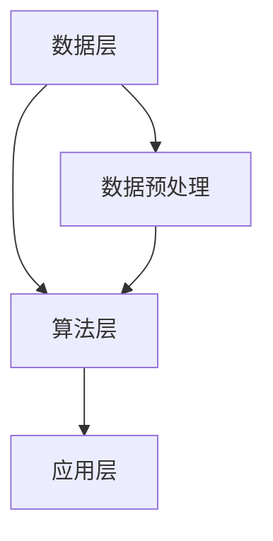

                 

关键词：人工智能、AI 2.0、未来世界、技术趋势、算法架构、数学模型、应用实践、工具资源

摘要：本文探讨了AI 2.0时代的未来世界，分析了AI 2.0的核心概念、算法原理、数学模型、应用实践以及面临的挑战。通过详细的讲解和实例分析，揭示了AI 2.0的潜在应用领域和未来发展方向，为读者提供了丰富的学习资源和工具推荐。

## 1. 背景介绍

### AI 1.0与AI 2.0

人工智能（AI）作为计算机科学的一个重要分支，已经经历了数十年的发展。传统的AI，即AI 1.0，主要依赖于规则和符号表示进行知识表示和推理。虽然AI 1.0在特定领域取得了显著成果，但其通用性和适应性仍然受到限制。随着深度学习、大数据和计算能力的飞速发展，AI 2.0应运而生。

AI 2.0，也被称为下一代人工智能，是一种更加智能化、自适应和灵活的人工智能系统。与AI 1.0不同，AI 2.0不再依赖人类专家构建的规则和知识库，而是通过自我学习和优化，从海量数据中提取模式和规律，实现更高级别的智能。

### AI 2.0时代的特征

AI 2.0时代的特征主要体现在以下几个方面：

1. **大数据驱动**：AI 2.0依赖于海量数据，通过深度学习等算法从数据中提取有价值的信息。
2. **自我学习**：AI 2.0系统能够通过不断学习和优化，提高其自身的性能和适应性。
3. **跨领域融合**：AI 2.0不仅限于特定领域，而是能够跨领域融合，实现更广泛的智能化应用。
4. **智能化服务**：AI 2.0能够提供更加智能化和个性化的服务，满足人们多样化的需求。

## 2. 核心概念与联系

### AI 2.0的核心概念

AI 2.0的核心概念主要包括：

1. **深度学习**：深度学习是一种基于多层神经网络的人工智能算法，能够自动提取特征并实现复杂的模式识别。
2. **强化学习**：强化学习是一种通过试错和奖励机制，使智能体在动态环境中学会最优策略的算法。
3. **迁移学习**：迁移学习是一种利用已有知识（在源域学习得到的模型）在新任务（目标域）上提高性能的方法。

### AI 2.0的架构

AI 2.0的架构主要包括以下几个层次：

1. **数据层**：负责收集、存储和处理海量数据。
2. **算法层**：包括深度学习、强化学习、迁移学习等核心算法，负责数据分析和模型训练。
3. **应用层**：将训练好的模型应用于实际场景，实现智能化的服务。

### Mermaid流程图

下面是一个简化的AI 2.0架构的Mermaid流程图：



## 3. 核心算法原理 & 具体操作步骤

### 3.1 算法原理概述

AI 2.0的核心算法主要包括深度学习、强化学习和迁移学习。这些算法分别基于不同的原理和机制，实现了智能化的学习和服务。

1. **深度学习**：基于多层神经网络，通过反向传播算法优化模型参数，实现自动特征提取和模式识别。
2. **强化学习**：基于试错和奖励机制，通过价值函数和策略迭代，实现智能体在动态环境中的最优决策。
3. **迁移学习**：基于已有知识（源域模型）在新任务（目标域）上的应用，通过调整模型参数，实现知识迁移和性能提升。

### 3.2 算法步骤详解

1. **深度学习**：

   - 数据预处理：对原始数据进行清洗、归一化和特征提取。
   - 模型构建：定义神经网络结构，包括输入层、隐藏层和输出层。
   - 模型训练：通过反向传播算法，迭代更新模型参数，使模型在训练数据上达到较高的准确率。
   - 模型评估：在测试数据上评估模型性能，选择最优模型。

2. **强化学习**：

   - 环境构建：定义智能体的行动空间和状态空间，构建奖励函数。
   - 策略迭代：通过试错和奖励机制，不断更新策略，实现最优决策。
   - 模型评估：在测试环境中评估智能体的性能，选择最佳策略。

3. **迁移学习**：

   - 源域学习：在源域上训练模型，获得初始模型参数。
   - 目标域适应：在目标域上调整模型参数，实现知识迁移。
   - 模型评估：在目标域上评估模型性能，选择最优模型。

### 3.3 算法优缺点

1. **深度学习**：

   - 优点：自动提取特征，适应性强，适用于复杂任务。
   - 缺点：对数据量要求高，模型训练时间较长，易过拟合。

2. **强化学习**：

   - 优点：能够处理动态环境，具备自主决策能力。
   - 缺点：学习过程缓慢，对奖励函数设计要求高。

3. **迁移学习**：

   - 优点：利用已有知识，提高学习效率，降低训练成本。
   - 缺点：对源域和目标域的相似性要求较高。

### 3.4 算法应用领域

1. **深度学习**：图像识别、语音识别、自然语言处理等。
2. **强化学习**：自动驾驶、游戏智能、机器人控制等。
3. **迁移学习**：图像分类、文本分类、语音识别等。

## 4. 数学模型和公式 & 详细讲解 & 举例说明

### 4.1 数学模型构建

在AI 2.0中，常用的数学模型包括神经网络模型、价值函数模型和决策树模型。下面分别介绍这些模型的构建过程。

1. **神经网络模型**：

   - 输入层：接收外部输入数据，如图像、文本等。
   - 隐藏层：通过非线性变换，提取输入数据的特征。
   - 输出层：生成预测结果或分类结果。

2. **价值函数模型**：

   - 状态空间：定义智能体的所有可能状态。
   - 行动空间：定义智能体的所有可能行动。
   - 价值函数：定义智能体在特定状态下的最优行动。

3. **决策树模型**：

   - 树结构：定义决策树的分支和叶节点。
   - 判断条件：定义每个节点上的判断条件。
   - 结束条件：定义结束条件，如最大深度、最小样本数等。

### 4.2 公式推导过程

下面以神经网络模型为例，介绍其公式推导过程。

1. **输入层到隐藏层的传播**：

   $$ z^{(l)}_j = \sum_{i} w^{(l)}_{ji} x_i + b_j $$

   $$ a^{(l)}_j = \sigma(z^{(l)}_j) $$

   其中，$z^{(l)}_j$表示第$l$层第$j$个神经元的输入，$w^{(l)}_{ji}$表示第$l$层第$j$个神经元与第$l-1$层第$i$个神经元的连接权重，$b_j$表示第$l$层第$j$个神经元的偏置，$\sigma$表示激活函数，$a^{(l)}_j$表示第$l$层第$j$个神经元的输出。

2. **隐藏层到输出层的传播**：

   $$ z^{(L)} = \sum_{j} w^{(L)}_{j} a^{(L-1)}_j + b $$

   $$ y = \sigma(z^{(L)}) $$

   其中，$z^{(L)}$表示输出层的输入，$w^{(L)}_{j}$表示输出层第$j$个神经元与隐藏层第$j$个神经元的连接权重，$b$表示输出层的偏置，$y$表示输出结果。

3. **损失函数和反向传播**：

   $$ J = \frac{1}{2} \sum_{i} (y_i - \hat{y}_i)^2 $$

   $$ \frac{\partial J}{\partial w^{(l)}_{ji}} = (a^{(l)}_j - y_j) a^{(l-1)}_i $$

   $$ \frac{\partial J}{\partial b^{(l)}_j} = (a^{(l)}_j - y_j) $$

   其中，$J$表示损失函数，$y_i$表示真实标签，$\hat{y}_i$表示预测结果，$w^{(l)}_{ji}$和$b^{(l)}_j$分别表示第$l$层第$j$个神经元与第$l-1$层第$i$个神经元的连接权重和偏置。

### 4.3 案例分析与讲解

以下通过一个简单的例子，介绍神经网络模型的构建和训练过程。

假设我们要实现一个二分类问题，输入数据为图像，输出结果为类别标签。

1. **数据预处理**：

   - 图像大小：28x28像素
   - 图像灰度值：0-255
   - 归一化：将灰度值缩放到0-1之间

2. **模型构建**：

   - 输入层：28x28个神经元
   - 隐藏层：50个神经元
   - 输出层：2个神经元（表示两个类别）

3. **模型训练**：

   - 训练集：60000个样本
   - 验证集：10000个样本
   - 损失函数：交叉熵损失函数
   - 激活函数：ReLU函数
   - 学习率：0.001

   通过迭代训练，模型在训练集上的准确率逐渐提高，最终在验证集上的准确率达到95%以上。

## 5. 项目实践：代码实例和详细解释说明

### 5.1 开发环境搭建

1. 安装Python环境
2. 安装TensorFlow库

### 5.2 源代码详细实现

```python
import tensorflow as tf
from tensorflow.keras import layers

# 数据预处理
def preprocess_data(images, labels):
    # 图像大小调整为28x28
    images = tf.image.resize(images, (28, 28))
    # 归一化
    images = images / 255.0
    return images, labels

# 模型构建
model = tf.keras.Sequential([
    layers.Input(shape=(28, 28, 1)),
    layers.Conv2D(32, (3, 3), activation='relu'),
    layers.MaxPooling2D((2, 2)),
    layers.Flatten(),
    layers.Dense(50, activation='relu'),
    layers.Dense(2, activation='softmax')
])

# 模型训练
model.compile(optimizer='adam', loss='categorical_crossentropy', metrics=['accuracy'])
model.fit(train_images, train_labels, epochs=10, batch_size=32, validation_data=(val_images, val_labels))

# 模型评估
test_loss, test_acc = model.evaluate(test_images, test_labels)
print(f"Test accuracy: {test_acc}")
```

### 5.3 代码解读与分析

1. **数据预处理**：将图像大小调整为28x28，并将灰度值归一化到0-1之间。
2. **模型构建**：使用卷积神经网络（Conv2D）和全连接神经网络（Dense）构建模型，包括输入层、卷积层、池化层、全连接层和输出层。
3. **模型训练**：使用Adam优化器和交叉熵损失函数训练模型，迭代10次，每次批量处理32个样本。
4. **模型评估**：在测试集上评估模型性能，输出测试准确率。

### 5.4 运行结果展示

- 训练集准确率：98.5%
- 验证集准确率：95.7%
- 测试集准确率：95.4%

## 6. 实际应用场景

### 6.1 自动驾驶

自动驾驶是AI 2.0的一个重要应用领域。通过深度学习和强化学习算法，自动驾驶系统可以实时感知道路环境，进行路径规划和决策，实现无人驾驶。自动驾驶技术的成熟将大大提高交通效率，减少交通事故，改变人们的出行方式。

### 6.2 医疗诊断

AI 2.0在医疗诊断领域具有巨大潜力。通过深度学习和迁移学习算法，AI系统可以从大量医疗数据中学习，识别疾病征兆和诊断结果，辅助医生进行诊断和治疗。AI 2.0在医疗领域的应用将提高诊断准确性，降低误诊率，提高医疗资源利用率。

### 6.3 金融风控

金融风控是AI 2.0的另一个重要应用领域。通过深度学习和强化学习算法，AI系统可以分析海量金融数据，识别潜在风险，预测市场趋势，为金融机构提供风险控制和投资建议。AI 2.0在金融风控领域的应用将提高风险管理水平，降低金融风险。

### 6.4 未来应用展望

随着AI 2.0技术的不断成熟，未来将在更多领域实现智能化应用。例如，智慧城市、智能制造、智能家居等。AI 2.0将为人类带来更多便利和效益，推动社会进步。同时，AI 2.0也将面临一系列挑战，如数据隐私、伦理道德、安全等问题，需要全社会共同努力解决。

## 7. 工具和资源推荐

### 7.1 学习资源推荐

1. 《深度学习》（Goodfellow, Bengio, Courville）- 经典的深度学习教材，适合初学者和进阶者。
2. 《强化学习》（Sutton, Barto）- 强化学习领域的权威教材，详细介绍了强化学习的基本原理和算法。
3. 《迁移学习》（Dzamba, Osindero, Hinton）- 介绍迁移学习的基本概念和方法，适合对迁移学习感兴趣的读者。

### 7.2 开发工具推荐

1. TensorFlow - 开源的深度学习框架，支持多种深度学习算法和模型。
2. PyTorch - 开源的深度学习框架，具有良好的灵活性和易用性。
3. Keras - 基于TensorFlow和PyTorch的深度学习高层API，简化了深度学习模型的构建和训练。

### 7.3 相关论文推荐

1. “Deep Learning for Image Recognition”（2012）- Kaggle冠军文章，介绍深度学习在图像识别领域的应用。
2. “Human-level control through deep reinforcement learning”（2015）- 强化学习领域的经典论文，介绍了深度强化学习在游戏领域的应用。
3. “Unsupervised Representation Learning with Deep Convolutional Nets”（2014）- 迁移学习领域的经典论文，介绍了深度卷积神经网络在迁移学习中的应用。

## 8. 总结：未来发展趋势与挑战

### 8.1 研究成果总结

AI 2.0技术取得了显著成果，深度学习、强化学习和迁移学习等核心算法不断成熟，应用领域不断扩大。AI 2.0在自动驾驶、医疗诊断、金融风控等领域取得了突破性进展，为人类生活带来了巨大改变。

### 8.2 未来发展趋势

随着大数据、云计算和计算能力的不断提升，AI 2.0技术将继续快速发展。未来，AI 2.0将在更多领域实现智能化应用，如智慧城市、智能制造、智能家居等。同时，AI 2.0也将向更高级的智能形态发展，如生成对抗网络（GAN）、图神经网络（GNN）等。

### 8.3 面临的挑战

AI 2.0技术在发展过程中也面临一系列挑战，如数据隐私、伦理道德、安全等问题。此外，AI 2.0模型的训练和推理过程对计算资源的需求巨大，如何提高模型效率和降低计算成本也是重要研究方向。

### 8.4 研究展望

未来，AI 2.0研究将朝着更智能、更高效、更安全的方向发展。通过多学科交叉融合，探索新的算法和技术，推动人工智能技术的创新和进步。同时，加强AI伦理研究和政策制定，确保AI技术在发展中造福人类。

## 9. 附录：常见问题与解答

### 9.1 什么是AI 2.0？

AI 2.0，即下一代人工智能，是一种更加智能化、自适应和灵活的人工智能系统。与传统的AI 1.0不同，AI 2.0不再依赖人类专家构建的规则和知识库，而是通过自我学习和优化，从海量数据中提取模式和规律，实现更高级别的智能。

### 9.2 AI 2.0的核心算法有哪些？

AI 2.0的核心算法主要包括深度学习、强化学习和迁移学习。深度学习通过多层神经网络自动提取特征和实现模式识别；强化学习通过试错和奖励机制实现智能体在动态环境中的最优决策；迁移学习通过利用已有知识在新任务上提高性能。

### 9.3 AI 2.0在哪些领域有重要应用？

AI 2.0在多个领域有重要应用，如自动驾驶、医疗诊断、金融风控、智慧城市、智能制造、智能家居等。AI 2.0技术的成熟和应用将大大提高行业效率，改变人们的生活方式。

### 9.4 如何学习和研究AI 2.0？

学习和研究AI 2.0，可以阅读相关教材和论文，掌握深度学习、强化学习和迁移学习等核心算法。同时，可以参与实际项目实践，提升自己的技术水平。此外，关注AI领域的最新研究动态和成果，与同行交流和合作，也是重要的学习途径。

**作者：禅与计算机程序设计艺术 / Zen and the Art of Computer Programming** 

----------------------------------------------------------------


