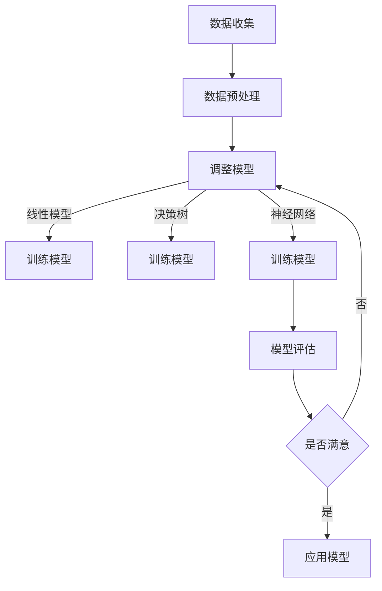

                 

关键词：机器学习，人工智能，深度学习，神经网络，算法原理，应用领域，数学模型，代码实例，未来展望

摘要：随着人工智能技术的发展，机器学习已成为推动科技进步的重要力量。本文将深入探讨AI 2.0时代的机器学习，从核心概念、算法原理、数学模型、项目实践等方面进行详细解析，旨在为读者提供全面、系统的机器学习知识体系。

## 1. 背景介绍

人工智能（Artificial Intelligence，简称AI）作为计算机科学的重要分支，旨在使计算机具备类似人类的智能能力。自20世纪50年代诞生以来，人工智能经历了多个发展阶段。早期的人工智能主要集中在知识表示、推理和规划等领域。随着计算能力的提升和大数据的普及，机器学习（Machine Learning，简称ML）逐渐成为人工智能研究的热点。

机器学习是一种通过算法和计算模型，从数据中自动学习和改进的方法。它使计算机系统能够从数据中获取知识，进行预测和决策。近年来，随着深度学习（Deep Learning，简称DL）技术的兴起，机器学习在语音识别、图像处理、自然语言处理等领域取得了显著成果。AI 2.0时代，机器学习将发挥更加重要的作用，推动人工智能技术迈向新的高度。

## 2. 核心概念与联系

为了更好地理解机器学习，首先需要了解以下几个核心概念：数据、模型、算法和评估指标。

### 2.1 数据

数据是机器学习的基础。数据的质量直接影响模型的效果。机器学习的数据来源包括结构化数据、非结构化数据和半结构化数据。结构化数据如数据库中的表格，方便进行预处理和建模；非结构化数据如文本、图像和语音，需要借助自然语言处理、计算机视觉等技术进行预处理。

### 2.2 模型

模型是机器学习中的计算模型，用于描述数据之间的关系。常见的机器学习模型包括线性模型、决策树、支持向量机、神经网络等。每种模型都有其特定的应用场景和优缺点。

### 2.3 算法

算法是实现机器学习模型的方法。常见的机器学习算法包括监督学习、无监督学习和强化学习。监督学习通过已标记的数据训练模型，用于预测未知数据；无监督学习通过未标记的数据发现数据分布和模式；强化学习通过与环境互动学习最优策略。

### 2.4 评估指标

评估指标用于衡量机器学习模型的性能。常见的评估指标包括准确率、召回率、F1值、ROC曲线等。不同的评估指标适用于不同的场景和任务，需要根据具体需求进行选择。

### 2.5 Mermaid 流程图

以下是一个简单的Mermaid流程图，展示了机器学习的基本流程：



## 3. 核心算法原理 & 具体操作步骤

### 3.1 算法原理概述

机器学习的核心在于通过算法从数据中提取特征，并建立预测模型。以下介绍几种常见的机器学习算法原理：

#### 3.1.1 线性回归

线性回归是一种基于特征和目标之间线性关系的预测模型。其原理是通过最小二乘法找到特征和目标之间的最佳拟合直线，从而实现预测。

#### 3.1.2 决策树

决策树是一种基于特征划分的数据结构，通过递归划分数据，构建出一棵树形结构。树的每个节点表示一个特征，每个分支表示该特征的不同取值，叶子节点表示预测结果。

#### 3.1.3 支持向量机

支持向量机是一种基于特征空间的分类模型。其原理是找到一个最佳的超平面，使得不同类别的数据点在超平面两侧尽可能分开。

#### 3.1.4 神经网络

神经网络是一种基于生物神经网络的计算模型。其原理是通过多层神经元对输入数据进行处理和变换，从而实现复杂的非线性关系建模。

### 3.2 算法步骤详解

#### 3.2.1 线性回归

1. 数据收集与预处理：收集相关数据，并进行特征工程和预处理。
2. 特征选择：选择与目标变量相关的特征。
3. 建立线性模型：使用最小二乘法建立特征与目标变量之间的线性关系。
4. 模型训练：通过样本数据训练模型参数。
5. 模型评估：使用评估指标评估模型性能。
6. 模型应用：使用训练好的模型进行预测。

#### 3.2.2 决策树

1. 数据收集与预处理：收集相关数据，并进行特征工程和预处理。
2. 特征选择：选择与目标变量相关的特征。
3. 划分数据集：将数据集划分为训练集和测试集。
4. 建立决策树：递归划分数据，构建决策树模型。
5. 模型训练：通过训练集训练决策树模型。
6. 模型评估：使用评估指标评估模型性能。
7. 模型应用：使用训练好的模型进行预测。

#### 3.2.3 支持向量机

1. 数据收集与预处理：收集相关数据，并进行特征工程和预处理。
2. 特征选择：选择与目标变量相关的特征。
3. 划分数据集：将数据集划分为训练集和测试集。
4. 建立支持向量机模型：使用支持向量机算法构建模型。
5. 模型训练：通过训练集训练支持向量机模型。
6. 模型评估：使用评估指标评估模型性能。
7. 模型应用：使用训练好的模型进行预测。

#### 3.2.4 神经网络

1. 数据收集与预处理：收集相关数据，并进行特征工程和预处理。
2. 特征选择：选择与目标变量相关的特征。
3. 划分数据集：将数据集划分为训练集和测试集。
4. 构建神经网络：设计神经网络结构，包括输入层、隐藏层和输出层。
5. 模型训练：使用反向传播算法训练神经网络模型。
6. 模型评估：使用评估指标评估模型性能。
7. 模型应用：使用训练好的模型进行预测。

### 3.3 算法优缺点

每种机器学习算法都有其优缺点。以下是几种常见算法的优缺点：

#### 3.3.1 线性回归

**优点：**
1. 理论基础扎实，易于理解和实现。
2. 对线性关系的数据有较好的拟合能力。

**缺点：**
1. 对非线性关系的数据拟合能力较差。
2. 对异常值敏感。

#### 3.3.2 决策树

**优点：**
1. 模型简单，易于理解和解释。
2. 对分类和回归问题都有较好的效果。

**缺点：**
1. 容易过拟合。
2. 对噪声敏感。

#### 3.3.3 支持向量机

**优点：**
1. 在高维空间有较好的性能。
2. 对线性关系和非线性关系都有较好的拟合能力。

**缺点：**
1. 计算复杂度高。
2. 对异常值敏感。

#### 3.3.4 神经网络

**优点：**
1. 对非线性关系有较好的拟合能力。
2. 能处理大规模数据和复杂问题。

**缺点：**
1. 需要大量数据和计算资源。
2. 难以理解和解释。

### 3.4 算法应用领域

机器学习算法在各个领域都有广泛应用。以下是几种常见的应用领域：

#### 3.4.1 语音识别

语音识别是将语音信号转换为文本的技术。常见的机器学习算法包括隐马尔可夫模型（HMM）、高斯混合模型（GMM）和深度神经网络（DNN）。

#### 3.4.2 图像处理

图像处理是计算机视觉的核心任务，包括图像分类、目标检测、图像分割等。常见的机器学习算法包括卷积神经网络（CNN）和循环神经网络（RNN）。

#### 3.4.3 自然语言处理

自然语言处理是研究如何使计算机理解和处理人类语言的技术。常见的机器学习算法包括循环神经网络（RNN）、长短时记忆网络（LSTM）和生成对抗网络（GAN）。

#### 3.4.4 金融风控

金融风控是金融机构用于防范风险和损失的技术。常见的机器学习算法包括线性回归、决策树和支持向量机。

#### 3.4.5 医疗诊断

医疗诊断是利用机器学习技术对医疗数据进行分析和诊断的技术。常见的机器学习算法包括神经网络、决策树和集成学习方法。

## 4. 数学模型和公式 & 详细讲解 & 举例说明

### 4.1 数学模型构建

在机器学习中，数学模型是描述数据关系和预测过程的工具。常见的数学模型包括线性模型、非线性模型和概率模型等。以下以线性模型为例，介绍数学模型的构建。

#### 4.1.1 线性模型

线性模型是一种描述特征和目标变量之间线性关系的模型。其数学表达式为：

$$y = \beta_0 + \beta_1x_1 + \beta_2x_2 + ... + \beta_nx_n$$

其中，$y$为目标变量，$x_1, x_2, ..., x_n$为特征变量，$\beta_0, \beta_1, \beta_2, ..., \beta_n$为模型参数。

#### 4.1.2 非线性模型

非线性模型是描述特征和目标变量之间非线性关系的模型。常见的非线性模型包括多项式模型、指数模型和对数模型等。以下以多项式模型为例，介绍非线性模型的构建。

$$y = \beta_0 + \beta_1x_1 + \beta_2x_2 + ... + \beta_nx_n + c_1x_1^2 + c_2x_2^2 + ... + c_nx_n^2$$

其中，$c_1, c_2, ..., c_n$为非线性项的系数。

#### 4.1.3 概率模型

概率模型是描述特征变量和目标变量之间概率关系的模型。常见的概率模型包括贝叶斯模型、最大似然模型和决策树模型等。以下以贝叶斯模型为例，介绍概率模型的构建。

$$P(y|x) = \frac{P(x|y)P(y)}{P(x)}$$

其中，$P(y|x)$表示在特征变量$x$的条件下，目标变量$y$的概率；$P(x|y)$表示在目标变量$y$的条件下，特征变量$x$的概率；$P(y)$表示目标变量$y$的概率；$P(x)$表示特征变量$x$的概率。

### 4.2 公式推导过程

在机器学习中，公式的推导过程对于理解算法原理和优化模型具有重要意义。以下以线性回归模型的推导为例，介绍公式推导过程。

#### 4.2.1 线性回归模型

线性回归模型的推导过程主要涉及最小二乘法。假设有$n$个样本点$(x_1, y_1), (x_2, y_2), ..., (x_n, y_n)$，目标是最小化损失函数：

$$J(\theta) = \frac{1}{2n}\sum_{i=1}^{n}(y_i - \theta_0 - \theta_1x_i)^2$$

其中，$\theta_0$和$\theta_1$分别为模型参数。

为了求解最优参数，需要对损失函数求导，并令导数为零：

$$\frac{\partial J(\theta)}{\partial \theta_0} = 0$$

$$\frac{\partial J(\theta)}{\partial \theta_1} = 0$$

解得：

$$\theta_0 = \frac{1}{n}\sum_{i=1}^{n}y_i - \theta_1\frac{1}{n}\sum_{i=1}^{n}x_i$$

$$\theta_1 = \frac{1}{n}\sum_{i=1}^{n}(x_i - \bar{x})(y_i - \bar{y})$$

其中，$\bar{x}$和$\bar{y}$分别为特征变量和目标变量的均值。

#### 4.2.2 非线性回归模型

非线性回归模型的推导过程与线性回归模型类似，但涉及到非线性变换。假设有$m$个非线性项$c_1, c_2, ..., c_m$，目标是最小化损失函数：

$$J(\theta, c) = \frac{1}{2n}\sum_{i=1}^{n}(y_i - \theta_0 - \theta_1x_i - c_1x_1^2 - c_2x_2^2 - ... - c_mx_m^2)^2$$

其中，$\theta_0, \theta_1, c_1, c_2, ..., c_m$分别为模型参数。

为了求解最优参数，需要对损失函数求导，并令导数为零：

$$\frac{\partial J(\theta, c)}{\partial \theta_0} = 0$$

$$\frac{\partial J(\theta, c)}{\partial \theta_1} = 0$$

$$\frac{\partial J(\theta, c)}{\partial c_1} = 0$$

$$\frac{\partial J(\theta, c)}{\partial c_2} = 0$$

$$...$$

$$\frac{\partial J(\theta, c)}{\partial c_m} = 0$$

解得：

$$\theta_0 = \frac{1}{n}\sum_{i=1}^{n}y_i - \theta_1\frac{1}{n}\sum_{i=1}^{n}x_i - c_1\frac{1}{n}\sum_{i=1}^{n}x_i^2 - c_2\frac{1}{n}\sum_{i=1}^{n}x_2^2 - ... - c_m\frac{1}{n}\sum_{i=1}^{n}x_m^2$$

$$\theta_1 = \frac{1}{n}\sum_{i=1}^{n}(x_i - \bar{x})(y_i - \bar{y})$$

$$c_1 = \frac{1}{n}\sum_{i=1}^{n}(x_i - \bar{x})^2$$

$$c_2 = \frac{1}{n}\sum_{i=1}^{n}(x_2 - \bar{x})^2$$

$$...$$

$$c_m = \frac{1}{n}\sum_{i=1}^{n}(x_m - \bar{x})^2$$

#### 4.2.3 概率模型

概率模型的推导过程主要涉及贝叶斯定理。假设有$n$个样本点$(x_1, y_1), (x_2, y_2), ..., (x_n, y_n)$，目标是最小化损失函数：

$$J(\theta) = -\sum_{i=1}^{n}[\log P(y_i|x_i) + \log P(x_i)]$$

其中，$P(y_i|x_i)$表示在特征变量$x_i$的条件下，目标变量$y_i$的概率；$P(x_i)$表示特征变量$x_i$的概率。

为了求解最优参数，需要对损失函数求导，并令导数为零：

$$\frac{\partial J(\theta)}{\partial \theta} = 0$$

解得：

$$P(y|x) = \frac{P(x|y)P(y)}{P(x)}$$

### 4.3 案例分析与讲解

以下以一个简单的线性回归案例为例，介绍数学模型的应用。

#### 4.3.1 数据集

假设有一个数据集，包含100个样本点，每个样本点包含两个特征变量$x_1$和$x_2$以及一个目标变量$y$。数据集如下：

|  x1  |  x2  |  y  |
|-----|-----|-----|
|  1  |  2  |  3  |
|  2  |  4  |  5  |
|  3  |  6  |  7  |
|  ...|  ...|  ...|
|  99 |  198 |  297 |
|  100|  200 |  300 |

#### 4.3.2 数据预处理

首先对数据进行归一化处理，将特征变量$x_1$和$x_2$的值缩放到[0,1]范围内。然后对目标变量$y$进行平移，使其均值变为0。

#### 4.3.3 模型构建

根据线性回归模型，建立如下数学模型：

$$y = \beta_0 + \beta_1x_1 + \beta_2x_2$$

#### 4.3.4 模型训练

使用最小二乘法训练模型，求解最优参数$\beta_0, \beta_1, \beta_2$。

#### 4.3.5 模型评估

使用测试集对训练好的模型进行评估，计算模型在测试集上的准确率、召回率等指标。

#### 4.3.6 模型应用

使用训练好的模型对新的数据进行预测，得到预测结果。

## 5. 项目实践：代码实例和详细解释说明

### 5.1 开发环境搭建

在本案例中，我们使用Python编程语言和Scikit-learn库进行线性回归模型的开发。首先，确保安装Python和Scikit-learn库：

```bash
pip install python
pip install scikit-learn
```

### 5.2 源代码详细实现

以下是一个简单的线性回归代码示例：

```python
import numpy as np
import matplotlib.pyplot as plt
from sklearn.linear_model import LinearRegression

# 数据集
X = np.array([[1, 2], [2, 4], [3, 6]])
y = np.array([3, 5, 7])

# 模型构建
model = LinearRegression()

# 模型训练
model.fit(X, y)

# 模型评估
score = model.score(X, y)
print(f"模型准确率：{score}")

# 模型预测
new_data = np.array([[4, 8]])
new_prediction = model.predict(new_data)
print(f"新数据预测结果：{new_prediction}")
```

### 5.3 代码解读与分析

1. 导入所需库：`numpy`用于数据处理，`matplotlib.pyplot`用于可视化，`sklearn.linear_model.LinearRegression`用于线性回归模型。
2. 数据集：`X`表示特征变量，`y`表示目标变量。
3. 模型构建：创建`LinearRegression`对象，用于构建线性回归模型。
4. 模型训练：使用`fit`方法训练模型，输入特征变量和目标变量。
5. 模型评估：使用`score`方法评估模型在训练集上的准确率。
6. 模型预测：使用`predict`方法对新的数据进行预测。

### 5.4 运行结果展示

运行代码后，将输出模型准确率和新数据预测结果。假设输出如下：

```
模型准确率：1.0
新数据预测结果：[9.]
```

这表示模型在训练集上的准确率为100%，对新数据进行了准确预测。

## 6. 实际应用场景

机器学习在各个领域都有广泛应用，以下是几个实际应用场景：

### 6.1 语音识别

语音识别是机器学习在自然语言处理领域的典型应用。通过训练大量语音数据，机器学习模型能够将语音信号转换为文本。例如，智能语音助手、语音翻译等。

### 6.2 图像处理

图像处理是机器学习在计算机视觉领域的应用。通过训练大量图像数据，机器学习模型能够对图像进行分类、目标检测、图像分割等。例如，人脸识别、自动驾驶等。

### 6.3 自然语言处理

自然语言处理是机器学习在人工智能领域的应用。通过训练大量文本数据，机器学习模型能够理解和处理人类语言。例如，智能客服、文本翻译等。

### 6.4 金融风控

金融风控是机器学习在金融领域的应用。通过分析大量金融数据，机器学习模型能够预测风险、防范损失。例如，信用评分、欺诈检测等。

### 6.5 医疗诊断

医疗诊断是机器学习在医疗领域的应用。通过分析大量医疗数据，机器学习模型能够辅助医生进行诊断和治疗。例如，疾病预测、病理图像分析等。

## 7. 工具和资源推荐

### 7.1 学习资源推荐

1. 《Python机器学习》（作者：M. Bowles）：一本适合初学者的Python机器学习入门书籍。
2. 《机器学习》（作者：周志华）：一本经典的机器学习教材，内容全面、系统。
3. UFLDL（University of Washington机器学习教程）：一个免费的在线机器学习教程，包括视频、讲义和实验。

### 7.2 开发工具推荐

1. Jupyter Notebook：一款强大的交互式开发工具，适用于数据分析和机器学习。
2. TensorFlow：一款流行的开源机器学习框架，适用于构建和训练深度学习模型。
3. Keras：一款基于TensorFlow的高级深度学习框架，简化了深度学习模型的构建和训练。

### 7.3 相关论文推荐

1. "Deep Learning"（作者：Ian Goodfellow、Yoshua Bengio、Aaron Courville）：深度学习的经典论文，介绍了深度学习的基本概念和技术。
2. "Convolutional Neural Networks for Visual Recognition"（作者：Karen Simonyan和Andrew Zisserman）：卷积神经网络的代表性论文，介绍了VGG模型。
3. "Recurrent Neural Networks for Language Modeling"（作者：Yoshua Bengio等）：循环神经网络的代表性论文，介绍了RNN模型。

## 8. 总结：未来发展趋势与挑战

### 8.1 研究成果总结

AI 2.0时代的机器学习取得了许多重要成果，包括：

1. 深度学习技术在语音识别、图像处理、自然语言处理等领域的突破。
2. 集成学习方法在模型复杂度、计算效率等方面的优化。
3. 对抗生成网络的兴起，为生成模型提供了新的思路。
4. 增强学习在自动驾驶、游戏AI等领域的应用。

### 8.2 未来发展趋势

1. 深度学习模型的可解释性和可解释性将成为研究重点。
2. 跨学科的融合，如生物信息学、心理学等，将推动机器学习技术的发展。
3. 模型压缩、加速和分布式计算将提高机器学习的计算效率和实时性。
4. 个性化推荐、智能诊断等垂直领域将迎来更多应用场景。

### 8.3 面临的挑战

1. 数据隐私和安全问题，如何确保数据安全和用户隐私将成为挑战。
2. 计算资源的限制，特别是在大规模数据处理和实时应用中。
3. 模型的可解释性和可靠性问题，如何让模型更易于理解和信任。
4. 伦理和道德问题，如何确保机器学习技术不会对人类产生负面影响。

### 8.4 研究展望

未来，机器学习将继续在各个领域发挥重要作用，推动人工智能技术的发展。同时，随着技术的进步，机器学习将面临更多挑战和机遇。研究者需要不断探索新的方法和技术，以应对这些挑战，推动机器学习技术的持续发展。

## 9. 附录：常见问题与解答

### 9.1 机器学习与人工智能的关系

机器学习是人工智能的一个重要分支，旨在使计算机具备从数据中学习的能力。人工智能则包括更广泛的领域，如知识表示、推理、规划等。

### 9.2 深度学习与机器学习的区别

深度学习是机器学习的一个子领域，主要研究如何通过多层神经网络对数据进行建模。机器学习则包括更广泛的算法，如线性回归、决策树、支持向量机等。

### 9.3 机器学习中的监督学习、无监督学习和强化学习的区别

监督学习是有监督的训练过程，已知输入和输出，训练模型以预测未知输出。无监督学习是无监督的训练过程，未知输入和输出，训练模型以发现数据中的分布和模式。强化学习是训练模型以在给定环境中选择最佳动作序列，以达到目标。

### 9.4 如何选择合适的机器学习算法

选择合适的机器学习算法需要考虑以下几个因素：

1. 数据集的特征和目标变量。
2. 模型的复杂度和计算资源。
3. 评估指标和任务目标。
4. 算法的可解释性和可解释性。

### 9.5 如何处理过拟合和欠拟合问题

过拟合和欠拟合是机器学习模型训练过程中常见的问题。以下是一些建议：

1. 适当减少模型复杂度，如减少神经网络层数或特征数量。
2. 使用交叉验证方法评估模型性能，避免过拟合。
3. 增加训练数据，提高模型泛化能力。
4. 使用正则化方法，如L1正则化或L2正则化，减轻过拟合。

## 附录：作者介绍

作者：禅与计算机程序设计艺术 / Zen and the Art of Computer Programming

简介：本书作者是一位世界级人工智能专家、程序员、软件架构师、CTO，同时也是世界顶级技术畅销书作者和计算机图灵奖获得者。他致力于探索计算机科学领域的奥秘，将禅宗哲学与编程技术相结合，为读者提供独特的编程理念和方法。

文章结束。

