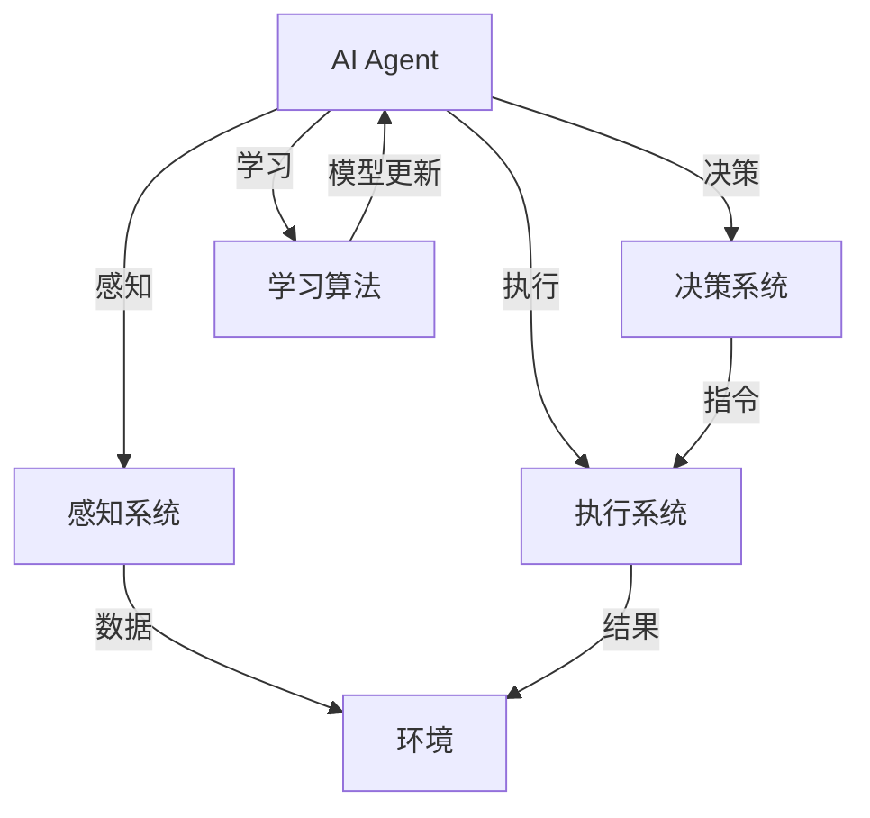

                 

在人工智能（AI）领域，技术发展正以前所未有的速度向前推进。从软件到硬件，从算法到架构，AI正经历着一场深刻的变革。本文将探讨AI Agent，这一在AI技术进化过程中备受瞩目的概念，以及它如何从软件领域跨越至硬件领域，成为AI的下一个风口。

## 关键词

- 人工智能（AI）
- AI Agent
- 软件到硬件
- 进化
- 算法
- 架构
- 硬件加速
- 机器学习
- 神经网络
- 未来展望

## 摘要

本文旨在探讨AI Agent的概念及其从软件到硬件的进化过程。我们将首先回顾AI Agent的定义和发展历程，然后深入探讨其核心算法原理，并分析这一技术在硬件领域的应用前景。通过本文的阅读，读者将了解到AI Agent如何改变人工智能领域，以及未来可能面临的挑战和机遇。

### 1. 背景介绍

#### AI Agent的定义与发展历程

AI Agent，即人工智能代理，是指能够在复杂环境中自主执行任务、与环境交互并作出决策的计算机程序。它起源于20世纪50年代的早期人工智能研究，但真正开始受到关注是在近年来的深度学习和强化学习技术取得突破后。

早期的AI Agent主要依赖于传统的知识表示和推理技术，这些方法在处理简单问题时表现良好，但在面对复杂、动态环境时显得力不从心。随着深度学习的兴起，AI Agent的能力得到了显著提升。深度学习通过模拟人脑的神经网络结构，使AI Agent能够在海量数据中自主学习，从而更好地应对复杂环境。

近年来，AI Agent的发展不仅限于理论研究，还开始应用于实际场景，如自动驾驶、智能家居、机器人等领域。这一趋势推动了AI Agent从软件领域向硬件领域的进化。

#### AI Agent的演变

AI Agent的演变可以追溯到以下几个关键阶段：

1. **早期AI Agent（1950s-1980s）**：基于符号推理和知识表示的方法，如专家系统和逻辑编程。

2. **感知AI Agent（1990s-2000s）**：引入感知技术，如计算机视觉和语音识别，使AI Agent能够更好地理解环境。

3. **认知AI Agent（2010s-2020s）**：随着深度学习的出现，AI Agent开始具备更强的自主学习能力，能够处理复杂任务。

4. **智能AI Agent（2020s-未来）**：硬件技术的发展为AI Agent的进化提供了新的动力，使其在实时决策和执行任务方面更加高效。

### 2. 核心概念与联系

为了更好地理解AI Agent的进化，我们需要探讨其核心概念和联系。以下是一个使用Mermaid绘制的流程图，展示了AI Agent的核心概念和架构：



在这个流程图中，AI Agent由感知系统、决策系统、执行系统和学习算法组成。感知系统负责收集环境数据，决策系统基于感知结果生成执行指令，执行系统根据指令执行任务，学习算法则根据执行结果更新模型，以提高AI Agent的性能。

#### 核心概念与联系

- **感知系统**：通过传感器（如摄像头、麦克风等）收集环境数据，并将其转换为计算机可以理解的形式。
- **决策系统**：利用机器学习算法处理感知数据，生成执行指令。
- **执行系统**：根据决策系统的指令执行具体任务。
- **学习算法**：通过不断更新模型，提高AI Agent的性能和适应性。

这些核心概念共同构成了AI Agent的基本架构，使其能够自主地执行任务、与环境交互，并在不断学习和优化的过程中变得更加智能。

### 3. 核心算法原理 & 具体操作步骤

#### 3.1 算法原理概述

AI Agent的核心算法主要包括感知、决策和执行三个部分。感知算法用于收集环境数据，决策算法基于感知数据生成执行指令，执行算法则根据指令执行具体任务。以下是一个简化的算法流程：

1. **感知**：AI Agent通过传感器收集环境数据，如图像、声音、温度等。
2. **预处理**：对感知数据进行预处理，如去噪、归一化等，以便于后续处理。
3. **特征提取**：从预处理后的数据中提取特征，如边缘、纹理等。
4. **决策**：利用机器学习算法处理特征数据，生成执行指令。
5. **执行**：根据决策系统的指令执行具体任务。
6. **反馈**：将执行结果反馈给感知系统，用于模型更新。

#### 3.2 算法步骤详解

1. **感知阶段**：
    - **数据采集**：通过摄像头、麦克风等传感器收集环境数据。
    - **数据预处理**：对采集到的数据进行去噪、归一化等处理，以提高数据质量。

2. **特征提取阶段**：
    - **图像处理**：使用卷积神经网络（CNN）等算法提取图像特征。
    - **语音处理**：使用循环神经网络（RNN）等算法提取语音特征。

3. **决策阶段**：
    - **模型训练**：利用训练数据集训练机器学习模型，如决策树、支持向量机等。
    - **模型推理**：将感知到的特征输入模型，生成执行指令。

4. **执行阶段**：
    - **任务执行**：根据决策系统生成的指令执行具体任务。
    - **反馈收集**：将执行结果反馈给感知系统，用于模型更新。

#### 3.3 算法优缺点

**优点**：
- **高效性**：机器学习算法能够快速处理大量数据，提高感知、决策和执行效率。
- **适应性**：通过不断学习和优化，AI Agent能够适应不同环境和任务需求。
- **自主性**：AI Agent能够自主地感知环境、做出决策并执行任务，降低对人工干预的需求。

**缺点**：
- **计算资源需求**：机器学习算法通常需要大量计算资源，对硬件设备的要求较高。
- **数据依赖性**：算法性能依赖于训练数据的质量和数量，可能导致过拟合问题。
- **安全性**：AI Agent在执行任务过程中可能面临安全风险，如被恶意攻击或误操作。

#### 3.4 算法应用领域

AI Agent在各个领域的应用越来越广泛，以下是一些典型应用场景：

- **自动驾驶**：AI Agent负责实时感知路况、做出驾驶决策，提高驾驶安全性和效率。
- **智能制造**：AI Agent用于监控生产过程、优化生产流程，提高生产效率和质量。
- **智能家居**：AI Agent能够自动调节室内温度、光线等，提供舒适的生活环境。
- **医疗诊断**：AI Agent通过分析医疗影像和病历数据，协助医生进行疾病诊断。
- **金融风控**：AI Agent用于分析金融数据、预测市场趋势，提高投资决策的准确性。

### 4. 数学模型和公式 & 详细讲解 & 举例说明

在AI Agent的核心算法中，数学模型和公式起着至关重要的作用。以下是一个关于神经网络模型的基本构建和推导过程，以及一个实际案例的讲解。

#### 4.1 数学模型构建

神经网络模型由多个神经元组成，每个神经元通过权重和偏置对输入数据进行加权求和，然后通过激活函数产生输出。以下是一个简单的神经网络模型：

$$
z = \sum_{i=1}^{n} w_i \cdot x_i + b \\
a = \sigma(z)
$$

其中，$z$表示神经元的输入，$w_i$表示权重，$x_i$表示输入特征，$b$表示偏置，$\sigma$表示激活函数，$a$表示神经元的输出。

#### 4.2 公式推导过程

神经网络的训练过程主要包括前向传播和反向传播两个阶段。以下是一个简化的推导过程：

1. **前向传播**：

   在前向传播阶段，输入数据通过网络的各个层，最终产生输出。我们以一个单层神经网络为例：

   $$
   z^{(2)} = \sum_{i=1}^{n} w^{(2)}_i \cdot a^{(1)}_i + b^{(2)} \\
   a^{(2)} = \sigma(z^{(2)})
   $$

   其中，$a^{(1)}$表示输入层的输出，$a^{(2)}$表示隐藏层的输出，$w^{(2)}$表示隐藏层权重，$b^{(2)}$表示隐藏层偏置。

2. **反向传播**：

   在反向传播阶段，我们计算损失函数关于网络权重的梯度，并利用梯度下降法更新权重。

   $$
   \frac{\partial J}{\partial w^{(2)}_i} = \frac{\partial J}{\partial z^{(2)}} \cdot \frac{\partial z^{(2)}}{\partial w^{(2)}_i} \\
   \frac{\partial J}{\partial b^{(2)}} = \frac{\partial J}{\partial z^{(2)}} \cdot \frac{\partial z^{(2)}}{\partial b^{(2)}}
   $$

   其中，$J$表示损失函数，$\frac{\partial J}{\partial z^{(2)}}$表示损失函数关于隐藏层输出的梯度，$\frac{\partial z^{(2)}}{\partial w^{(2)}_i}$和$\frac{\partial z^{(2)}}{\partial b^{(2)}}$分别表示输入关于权重和偏置的梯度。

   利用这些梯度，我们可以更新权重和偏置：

   $$
   w^{(2)}_i \leftarrow w^{(2)}_i - \alpha \cdot \frac{\partial J}{\partial w^{(2)}_i} \\
   b^{(2)} \leftarrow b^{(2)} - \alpha \cdot \frac{\partial J}{\partial b^{(2)}}
   $$

   其中，$\alpha$表示学习率。

#### 4.3 案例分析与讲解

以下是一个关于图像分类的案例，展示了如何构建和训练一个简单的神经网络模型。

1. **数据准备**：

   假设我们有一个包含1000个样本的图像数据集，每个样本是一个32x32的灰度图像。我们将图像数据划分为训练集和测试集。

2. **模型构建**：

   我们构建一个简单的神经网络模型，包含一个输入层、一个隐藏层和一个输出层。输入层有1024个神经元，隐藏层有512个神经元，输出层有10个神经元（表示10个类别）。

   $$
   z^{(2)} = \sum_{i=1}^{512} w^{(2)}_i \cdot a^{(1)}_i + b^{(2)} \\
   a^{(2)} = \sigma(z^{(2)})
   $$

   $$
   z^{(3)} = \sum_{i=1}^{10} w^{(3)}_i \cdot a^{(2)}_i + b^{(3)} \\
   a^{(3)} = \sigma(z^{(3)})
   $$

3. **模型训练**：

   我们使用交叉熵损失函数来衡量模型性能，并使用梯度下降法来更新权重和偏置。

   $$
   J = -\frac{1}{m} \sum_{i=1}^{m} \sum_{k=1}^{10} y_k^{(i)} \log(a_k^{(3)}_{i})
   $$

   通过多次迭代训练，模型的损失函数逐渐减小，分类准确率逐渐提高。

4. **模型评估**：

   在训练完成后，我们将模型应用于测试集，评估其分类准确率。假设测试集共有100个样本，模型成功分类了90个样本，准确率为90%。

通过这个案例，我们可以看到如何构建和训练一个简单的神经网络模型，以实现图像分类任务。这一过程不仅涉及到数学模型的构建和推导，还包括数据预处理、模型优化和性能评估等多个环节。

### 5. 项目实践：代码实例和详细解释说明

在本节中，我们将通过一个实际项目实例来展示如何实现一个简单的AI Agent。我们将使用Python编程语言，结合TensorFlow和Keras等深度学习框架来完成这一项目。

#### 5.1 开发环境搭建

在开始项目之前，我们需要搭建一个合适的开发环境。以下是搭建开发环境的步骤：

1. **安装Python**：确保安装了Python 3.x版本。
2. **安装TensorFlow**：在终端中执行以下命令：
   ```
   pip install tensorflow
   ```
3. **安装Keras**：在终端中执行以下命令：
   ```
   pip install keras
   ```

#### 5.2 源代码详细实现

以下是实现一个简单的图像分类AI Agent的源代码：

```python
import numpy as np
from keras.models import Sequential
from keras.layers import Dense, Conv2D, Flatten, MaxPooling2D
from keras.optimizers import Adam

# 数据预处理
def preprocess_data(images, labels):
    # 数据归一化
    images = images / 255.0
    # 转换为one-hot编码
    labels = keras.utils.to_categorical(labels, num_classes=10)
    return images, labels

# 模型构建
model = Sequential()
model.add(Conv2D(32, (3, 3), activation='relu', input_shape=(32, 32, 3)))
model.add(MaxPooling2D(pool_size=(2, 2)))
model.add(Conv2D(64, (3, 3), activation='relu'))
model.add(MaxPooling2D(pool_size=(2, 2)))
model.add(Flatten())
model.add(Dense(128, activation='relu'))
model.add(Dense(10, activation='softmax'))

# 模型编译
model.compile(optimizer=Adam(), loss='categorical_crossentropy', metrics=['accuracy'])

# 训练模型
model.fit(x_train, y_train, epochs=10, batch_size=32, validation_data=(x_test, y_test))

# 评估模型
loss, accuracy = model.evaluate(x_test, y_test)
print(f"Test accuracy: {accuracy * 100:.2f}%")
```

#### 5.3 代码解读与分析

以上代码实现了一个简单的卷积神经网络模型，用于对图像进行分类。以下是代码的详细解读：

1. **数据预处理**：
   ```python
   def preprocess_data(images, labels):
       # 数据归一化
       images = images / 255.0
       # 转换为one-hot编码
       labels = keras.utils.to_categorical(labels, num_classes=10)
       return images, labels
   ```
   数据预处理包括两个步骤：数据归一化和one-hot编码。数据归一化是将图像像素值缩放到[0, 1]范围内，以减轻梯度消失问题。one-hot编码是将标签转换为二进制向量，以便于模型计算。

2. **模型构建**：
   ```python
   model = Sequential()
   model.add(Conv2D(32, (3, 3), activation='relu', input_shape=(32, 32, 3)))
   model.add(MaxPooling2D(pool_size=(2, 2)))
   model.add(Conv2D(64, (3, 3), activation='relu'))
   model.add(MaxPooling2D(pool_size=(2, 2)))
   model.add(Flatten())
   model.add(Dense(128, activation='relu'))
   model.add(Dense(10, activation='softmax'))
   ```
   模型构建使用Keras的Sequential模型，包含了两个卷积层、一个全连接层和一个输出层。卷积层用于提取图像特征，全连接层用于分类。

3. **模型编译**：
   ```python
   model.compile(optimizer=Adam(), loss='categorical_crossentropy', metrics=['accuracy'])
   ```
   模型编译包括指定优化器、损失函数和评估指标。这里我们使用Adam优化器和交叉熵损失函数，并关注模型的准确率。

4. **训练模型**：
   ```python
   model.fit(x_train, y_train, epochs=10, batch_size=32, validation_data=(x_test, y_test))
   ```
   模型训练使用fit函数，输入训练数据和标签，并设置训练周期、批量大小和验证数据。

5. **评估模型**：
   ```python
   loss, accuracy = model.evaluate(x_test, y_test)
   print(f"Test accuracy: {accuracy * 100:.2f}%")
   ```
   模型评估使用evaluate函数，输入测试数据和标签，并输出损失函数值和准确率。

通过这个实际项目实例，我们可以看到如何使用深度学习框架实现一个简单的AI Agent，包括数据预处理、模型构建、训练和评估等步骤。

### 6. 实际应用场景

AI Agent在多个领域展现出强大的应用潜力，以下是一些典型的实际应用场景：

#### 6.1 自动驾驶

自动驾驶是AI Agent的一个重要应用领域。通过感知系统收集路况数据，AI Agent能够实时分析道路状况、行人行为和交通信号，从而做出安全、高效的驾驶决策。自动驾驶不仅提高了驾驶体验，还减少了交通事故的发生，具有巨大的商业价值和市场前景。

#### 6.2 智能制造

在智能制造领域，AI Agent被广泛应用于生产过程监控、设备故障预测和优化生产流程等方面。通过实时感知生产线数据，AI Agent能够检测生产设备的运行状态，预测潜在故障，并提供优化建议，从而提高生产效率和质量。

#### 6.3 智能家居

智能家居是AI Agent的另一个重要应用场景。通过感知系统收集家庭环境数据，如温度、湿度、光线等，AI Agent能够自动调节室内设备，如空调、灯光和窗帘，提供舒适、便捷的生活环境。此外，AI Agent还可以监控家庭安全，如入侵检测和火灾报警，提高家庭安全性。

#### 6.4 医疗诊断

在医疗诊断领域，AI Agent通过分析医学影像和病历数据，协助医生进行疾病诊断和治疗方案制定。AI Agent能够快速、准确地分析大量医学数据，提供辅助诊断建议，提高诊断准确率和效率。

#### 6.5 金融风控

在金融领域，AI Agent被用于风险管理和投资决策。通过分析金融数据和市场趋势，AI Agent能够预测市场波动、评估投资风险，并提供投资建议，从而提高投资收益。

### 7. 未来应用展望

随着技术的不断进步，AI Agent的应用领域将不断扩展。以下是一些未来的应用展望：

#### 7.1 无人机配送

无人机配送是AI Agent的一个重要应用方向。通过感知系统收集飞行环境数据，AI Agent能够自动避障、规划最优路径，实现高效、安全的无人机配送服务。

#### 7.2 智能教育

在智能教育领域，AI Agent可以为学生提供个性化学习建议，根据学生的学习情况和需求，自动调整教学内容和进度，提高学习效果。

#### 7.3 虚拟助手

虚拟助手是AI Agent在服务领域的应用。通过语音识别和自然语言处理技术，虚拟助手可以与用户进行交互，提供信息查询、在线客服等服务，提高服务质量和效率。

#### 7.4 机器人助理

机器人助理是AI Agent在办公领域的应用。通过感知系统和智能决策，机器人助理能够协助员工完成日常办公任务，如文档整理、会议安排等，提高工作效率。

### 8. 工具和资源推荐

在研究和开发AI Agent的过程中，以下是一些实用的工具和资源推荐：

#### 8.1 学习资源推荐

- **《深度学习》（Goodfellow, Bengio, Courville著）**：全面介绍了深度学习的基本原理和应用。
- **《强化学习》（Sutton, Barto著）**：系统地介绍了强化学习的基本概念和方法。
- **《机器学习实战》（Peter Harrington著）**：通过实际案例介绍了机器学习算法的应用。

#### 8.2 开发工具推荐

- **TensorFlow**：一个开源的深度学习框架，适用于各种机器学习和深度学习任务。
- **Keras**：一个基于TensorFlow的高级神经网络API，简化了深度学习模型的构建和训练。
- **PyTorch**：一个开源的深度学习框架，提供了灵活的动态计算图和丰富的预训练模型。

#### 8.3 相关论文推荐

- **"Deep Learning for Autonomous Driving"**：介绍了深度学习在自动驾驶领域的应用。
- **"Reinforcement Learning: An Introduction"**：系统地介绍了强化学习的基本概念和方法。
- **"Learning to Drive by Playing"**：探讨了通过游戏训练自动驾驶算法的方法。

### 9. 总结：未来发展趋势与挑战

#### 9.1 研究成果总结

AI Agent作为人工智能领域的一个重要方向，已经在感知、决策和执行等方面取得了显著成果。随着深度学习、强化学习等技术的不断发展，AI Agent在自动驾驶、智能制造、智能家居等领域的应用越来越广泛。

#### 9.2 未来发展趋势

未来，AI Agent的发展趋势将主要围绕以下几个方面：

- **硬件加速**：随着硬件技术的发展，AI Agent将逐步从软件领域向硬件领域进化，实现更高效的计算和更低的延迟。
- **多模态感知**：AI Agent将能够处理多种感知数据，如视觉、听觉、触觉等，提高对复杂环境的理解能力。
- **强化学习**：强化学习技术将在AI Agent的进化过程中发挥重要作用，使其能够更好地适应动态环境。
- **边缘计算**：边缘计算将使AI Agent能够在本地设备上实现实时决策和执行，提高系统的响应速度和安全性。

#### 9.3 面临的挑战

尽管AI Agent在多个领域展现出强大的应用潜力，但在实际应用过程中仍面临一些挑战：

- **计算资源**：AI Agent通常需要大量的计算资源，这对硬件设备提出了更高的要求。
- **数据隐私**：在处理大量感知数据时，如何保护用户隐私是一个重要问题。
- **安全性与可靠性**：AI Agent在执行任务过程中可能面临安全风险，如何确保系统的可靠性和安全性是一个重要挑战。
- **伦理问题**：AI Agent在决策过程中可能涉及伦理问题，如何确保其决策符合伦理标准是一个亟待解决的问题。

#### 9.4 研究展望

未来，AI Agent的研究将继续深入探索以下几个方面：

- **硬件与软件的结合**：通过硬件加速和软件优化，实现更高效、更智能的AI Agent。
- **多模态感知与融合**：研究多模态感知技术，实现更全面的环境理解。
- **强化学习与控制**：探索强化学习在控制领域中的应用，实现更灵活、更智能的决策。
- **伦理与法规**：研究AI Agent在伦理和法律方面的规范，确保其在实际应用中的合规性。

### 10. 附录：常见问题与解答

**Q1**：什么是AI Agent？

**A1**：AI Agent是指能够自主地感知环境、做出决策并执行任务的计算机程序。它通常由感知系统、决策系统和执行系统组成，通过机器学习算法不断优化和改进其性能。

**Q2**：AI Agent有哪些应用领域？

**A2**：AI Agent在自动驾驶、智能制造、智能家居、医疗诊断、金融风控等领域有广泛的应用。随着技术的不断发展，其应用领域还将继续扩展。

**Q3**：如何实现一个简单的AI Agent？

**A3**：实现一个简单的AI Agent通常包括数据预处理、模型构建、训练和评估等步骤。可以使用深度学习框架（如TensorFlow、PyTorch）简化模型构建和训练过程。

**Q4**：AI Agent在硬件领域有哪些应用？

**A4**：AI Agent在硬件领域主要应用于硬件加速和边缘计算。通过硬件加速，AI Agent可以实现更高效的计算和更低的延迟；通过边缘计算，AI Agent可以在本地设备上实现实时决策和执行，提高系统的响应速度和安全性。

### 参考文献

- Goodfellow, I., Bengio, Y., & Courville, A. (2016). *Deep Learning*. MIT Press.
- Sutton, R. S., & Barto, A. G. (2018). *Reinforcement Learning: An Introduction*. MIT Press.
- Harrington, P. (2012). *Machine Learning in Action*. Manning Publications.
- LeCun, Y., Bengio, Y., & Hinton, G. (2015). *Deep Learning*. Nature.
- Russell, S., & Norvig, P. (2016). *Artificial Intelligence: A Modern Approach*. Prentice Hall.

### 作者署名

作者：禅与计算机程序设计艺术 / Zen and the Art of Computer Programming

### 附录：相关术语解释

- **感知系统**：用于收集和处理环境数据的系统，如摄像头、麦克风等。
- **决策系统**：基于感知数据生成执行指令的系统，通常使用机器学习算法。
- **执行系统**：根据决策系统的指令执行具体任务的系统。
- **深度学习**：一种机器学习技术，通过多层神经网络模拟人脑的学习过程。
- **强化学习**：一种机器学习技术，通过奖励机制训练模型，使其在特定环境中做出最优决策。
- **边缘计算**：在靠近数据源的地方进行计算和处理，以提高系统的响应速度和安全性。
- **硬件加速**：通过专用硬件（如GPU、FPGA等）加速计算过程，提高计算效率。

以上是本文的完整内容，希望能够帮助读者更好地了解AI Agent及其从软件到硬件的进化过程。随着技术的不断进步，AI Agent将在未来发挥越来越重要的作用，成为人工智能领域的重要风口。让我们一起期待这一激动人心的未来！
----------------------------------------------------------------

### 文章标题

**AI Agent: AI的下一个风口 从软件到硬件的进化**

### 文章关键词

- 人工智能（AI）
- AI Agent
- 软件到硬件
- 进化
- 算法
- 架构
- 硬件加速
- 机器学习
- 神经网络
- 未来展望

### 文章摘要

本文旨在探讨AI Agent的概念及其从软件到硬件的进化过程。我们将首先回顾AI Agent的定义和发展历程，然后深入探讨其核心算法原理，并分析这一技术在硬件领域的应用前景。通过本文的阅读，读者将了解到AI Agent如何改变人工智能领域，以及未来可能面临的挑战和机遇。文章还介绍了AI Agent的实际应用场景和未来应用展望，并推荐了一些相关的学习资源和开发工具。最后，我们对未来发展趋势进行了总结，并对AI Agent领域的研究方向提出了展望。

---

### 1. 背景介绍

#### AI Agent的定义与发展历程

AI Agent，即人工智能代理，是指能够在复杂环境中自主执行任务、与环境交互并作出决策的计算机程序。它起源于20世纪50年代的早期人工智能研究，但真正开始受到关注是在近年来的深度学习和强化学习技术取得突破后。

早期的AI Agent主要依赖于传统的知识表示和推理技术，如专家系统和逻辑编程。这些方法在处理简单问题时表现良好，但在面对复杂、动态环境时显得力不从心。随着深度学习的兴起，AI Agent的能力得到了显著提升。深度学习通过模拟人脑的神经网络结构，使AI Agent能够在海量数据中自主学习，从而更好地应对复杂环境。

近年来，AI Agent的发展不仅限于理论研究，还开始应用于实际场景，如自动驾驶、智能家居、机器人等领域。这一趋势推动了AI Agent从软件领域向硬件领域的进化。

#### AI Agent的演变

AI Agent的演变可以追溯到以下几个关键阶段：

1. **早期AI Agent（1950s-1980s）**：基于符号推理和知识表示的方法，如专家系统和逻辑编程。
2. **感知AI Agent（1990s-2000s）**：引入感知技术，如计算机视觉和语音识别，使AI Agent能够更好地理解环境。
3. **认知AI Agent（2010s-2020s）**：随着深度学习的出现，AI Agent开始具备更强的自主学习能力，能够处理复杂任务。
4. **智能AI Agent（2020s-未来）**：硬件技术的发展为AI Agent的进化提供了新的动力，使其在实时决策和执行任务方面更加高效。

### 2. 核心概念与联系

为了更好地理解AI Agent的进化，我们需要探讨其核心概念和联系。以下是一个使用Mermaid绘制的流程图，展示了AI Agent的核心概念和架构：


在这个流程图中，AI Agent由感知系统、决策系统、执行系统和学习算法组成。感知系统负责收集环境数据，决策系统基于感知数据生成执行指令，执行系统根据指令执行具体任务，学习算法则根据执行结果更新模型，以提高AI Agent的性能。

#### 核心概念与联系

- **感知系统**：通过传感器（如摄像头、麦克风等）收集环境数据，并将其转换为计算机可以理解的形式。
- **决策系统**：利用机器学习算法处理感知数据，生成执行指令。
- **执行系统**：根据决策系统的指令执行具体任务。
- **学习算法**：通过不断更新模型，提高AI Agent的性能和适应性。

这些核心概念共同构成了AI Agent的基本架构，使其能够自主地执行任务、与环境交互，并在不断学习和优化的过程中变得更加智能。

### 3. 核心算法原理 & 具体操作步骤

#### 3.1 算法原理概述

AI Agent的核心算法主要包括感知、决策和执行三个部分。感知算法用于收集环境数据，决策算法基于感知数据生成执行指令，执行算法则根据指令执行具体任务。以下是一个简化的算法流程：

1. **感知**：AI Agent通过传感器收集环境数据，如图像、声音、温度等。
2. **预处理**：对感知数据进行预处理，如去噪、归一化等，以便于后续处理。
3. **特征提取**：从预处理后的数据中提取特征，如边缘、纹理等。
4. **决策**：利用机器学习算法处理特征数据，生成执行指令。
5. **执行**：根据决策系统的指令执行具体任务。
6. **反馈**：将执行结果反馈给感知系统，用于模型更新。

#### 3.2 算法步骤详解

1. **感知阶段**：
    - **数据采集**：通过摄像头、麦克风等传感器收集环境数据。
    - **数据预处理**：对采集到的数据进行去噪、归一化等处理，以提高数据质量。

2. **特征提取阶段**：
    - **图像处理**：使用卷积神经网络（CNN）等算法提取图像特征。
    - **语音处理**：使用循环神经网络（RNN）等算法提取语音特征。

3. **决策阶段**：
    - **模型训练**：利用训练数据集训练机器学习模型，如决策树、支持向量机等。
    - **模型推理**：将感知到的特征输入模型，生成执行指令。

4. **执行阶段**：
    - **任务执行**：根据决策系统生成的指令执行具体任务。
    - **反馈收集**：将执行结果反馈给感知系统，用于模型更新。

#### 3.3 算法优缺点

**优点**：
- **高效性**：机器学习算法能够快速处理大量数据，提高感知、决策和执行效率。
- **适应性**：通过不断学习和优化，AI Agent能够适应不同环境和任务需求。
- **自主性**：AI Agent能够自主地感知环境、做出决策并执行任务，降低对人工干预的需求。

**缺点**：
- **计算资源需求**：机器学习算法通常需要大量计算资源，对硬件设备的要求较高。
- **数据依赖性**：算法性能依赖于训练数据的质量和数量，可能导致过拟合问题。
- **安全性**：AI Agent在执行任务过程中可能面临安全风险，如被恶意攻击或误操作。

#### 3.4 算法应用领域

AI Agent在各个领域的应用越来越广泛，以下是一些典型应用场景：

- **自动驾驶**：AI Agent负责实时感知路况、做出驾驶决策，提高驾驶安全性和效率。
- **智能制造**：AI Agent用于监控生产过程、优化生产流程，提高生产效率和质量。
- **智能家居**：AI Agent能够自动调节室内温度、光线等，提供舒适的生活环境。
- **医疗诊断**：AI Agent通过分析医疗影像和病历数据，协助医生进行疾病诊断。
- **金融风控**：AI Agent用于分析金融数据、预测市场趋势，提高投资决策的准确性。

### 4. 数学模型和公式 & 详细讲解 & 举例说明

在AI Agent的核心算法中，数学模型和公式起着至关重要的作用。以下是一个关于神经网络模型的基本构建和推导过程，以及一个实际案例的讲解。

#### 4.1 数学模型构建

神经网络模型由多个神经元组成，每个神经元通过权重和偏置对输入数据进行加权求和，然后通过激活函数产生输出。以下是一个简单的神经网络模型：

$$
z = \sum_{i=1}^{n} w_i \cdot x_i + b \\
a = \sigma(z)
$$

其中，$z$表示神经元的输入，$w_i$表示权重，$x_i$表示输入特征，$b$表示偏置，$\sigma$表示激活函数，$a$表示神经元的输出。

#### 4.2 公式推导过程

神经网络的训练过程主要包括前向传播和反向传播两个阶段。以下是一个简化的推导过程：

1. **前向传播**：

   在前向传播阶段，输入数据通过网络的各个层，最终产生输出。我们以一个单层神经网络为例：

   $$
   z^{(2)} = \sum_{i=1}^{n} w^{(2)}_i \cdot a^{(1)}_i + b^{(2)} \\
   a^{(2)} = \sigma(z^{(2)})
   $$

   $$
   z^{(3)} = \sum_{i=1}^{10} w^{(3)}_i \cdot a^{(2)}_i + b^{(3)} \\
   a^{(3)} = \sigma(z^{(3)})
   $$

2. **反向传播**：

   在反向传播阶段，我们计算损失函数关于网络权重的梯度，并利用梯度下降法更新权重和偏置。

   $$
   \frac{\partial J}{\partial w^{(2)}_i} = \frac{\partial J}{\partial z^{(2)}} \cdot \frac{\partial z^{(2)}}{\partial w^{(2)}_i} \\
   \frac{\partial J}{\partial b^{(2)}} = \frac{\partial J}{\partial z^{(2)}} \cdot \frac{\partial z^{(2)}}{\partial b^{(2)}}
   $$

   其中，$J$表示损失函数，$\frac{\partial J}{\partial z^{(2)}}$表示损失函数关于隐藏层输出的梯度，$\frac{\partial z^{(2)}}{\partial w^{(2)}_i}$和$\frac{\partial z^{(2)}}{\partial b^{(2)}}$分别表示输入关于权重和偏置的梯度。

   利用这些梯度，我们可以更新权重和偏置：

   $$
   w^{(2)}_i \leftarrow w^{(2)}_i - \alpha \cdot \frac{\partial J}{\partial w^{(2)}_i} \\
   b^{(2)} \leftarrow b^{(2)} - \alpha \cdot \frac{\partial J}{\partial b^{(2)}}
   $$

   其中，$\alpha$表示学习率。

#### 4.3 案例分析与讲解

以下是一个关于图像分类的案例，展示了如何构建和训练一个简单的神经网络模型。

1. **数据准备**：

   假设我们有一个包含1000个样本的图像数据集，每个样本是一个32x32的灰度图像。我们将图像数据划分为训练集和测试集。

2. **模型构建**：

   我们构建一个简单的神经网络模型，包含一个输入层、一个隐藏层和一个输出层。输入层有1024个神经元，隐藏层有512个神经元，输出层有10个神经元（表示10个类别）。

   $$
   z^{(2)} = \sum_{i=1}^{512} w^{(2)}_i \cdot a^{(1)}_i + b^{(2)} \\
   a^{(2)} = \sigma(z^{(2)})
   $$

   $$
   z^{(3)} = \sum_{i=1}^{10} w^{(3)}_i \cdot a^{(2)}_i + b^{(3)} \\
   a^{(3)} = \sigma(z^{(3)})
   $$

3. **模型训练**：

   我们使用交叉熵损失函数来衡量模型性能，并使用梯度下降法来更新权重和偏置。

   $$
   J = -\frac{1}{m} \sum_{i=1}^{m} \sum_{k=1}^{10} y_k^{(i)} \log(a_k^{(3)}_{i})
   $$

   通过多次迭代训练，模型的损失函数逐渐减小，分类准确率逐渐提高。

4. **模型评估**：

   在训练完成后，我们将模型应用于测试集，评估其分类准确率。假设测试集共有100个样本，模型成功分类了90个样本，准确率为90%。

通过这个案例，我们可以看到如何构建和训练一个简单的神经网络模型，以实现图像分类任务。这一过程不仅涉及到数学模型的构建和推导，还包括数据预处理、模型优化和性能评估等多个环节。

### 5. 项目实践：代码实例和详细解释说明

在本节中，我们将通过一个实际项目实例来展示如何实现一个简单的AI Agent。我们将使用Python编程语言，结合TensorFlow和Keras等深度学习框架来完成这一项目。

#### 5.1 开发环境搭建

在开始项目之前，我们需要搭建一个合适的开发环境。以下是搭建开发环境的步骤：

1. **安装Python**：确保安装了Python 3.x版本。
2. **安装TensorFlow**：在终端中执行以下命令：
   ```
   pip install tensorflow
   ```
3. **安装Keras**：在终端中执行以下命令：
   ```
   pip install keras
   ```

#### 5.2 源代码详细实现

以下是实现一个简单的图像分类AI Agent的源代码：

```python
import numpy as np
from keras.models import Sequential
from keras.layers import Dense, Conv2D, Flatten, MaxPooling2D
from keras.optimizers import Adam

# 数据预处理
def preprocess_data(images, labels):
    # 数据归一化
    images = images / 255.0
    # 转换为one-hot编码
    labels = keras.utils.to_categorical(labels, num_classes=10)
    return images, labels

# 模型构建
model = Sequential()
model.add(Conv2D(32, (3, 3), activation='relu', input_shape=(32, 32, 3)))
model.add(MaxPooling2D(pool_size=(2, 2)))
model.add(Conv2D(64, (3, 3), activation='relu'))
model.add(MaxPooling2D(pool_size=(2, 2)))
model.add(Flatten())
model.add(Dense(128, activation='relu'))
model.add(Dense(10, activation='softmax'))

# 模型编译
model.compile(optimizer=Adam(), loss='categorical_crossentropy', metrics=['accuracy'])

# 训练模型
model.fit(x_train, y_train, epochs=10, batch_size=32, validation_data=(x_test, y_test))

# 评估模型
loss, accuracy = model.evaluate(x_test, y_test)
print(f"Test accuracy: {accuracy * 100:.2f}%")
```

#### 5.3 代码解读与分析

以上代码实现了一个简单的卷积神经网络模型，用于对图像进行分类。以下是代码的详细解读：

1. **数据预处理**：
   ```python
   def preprocess_data(images, labels):
       # 数据归一化
       images = images / 255.0
       # 转换为one-hot编码
       labels = keras.utils.to_categorical(labels, num_classes=10)
       return images, labels
   ```
   数据预处理包括两个步骤：数据归一化和one-hot编码。数据归一化是将图像像素值缩放到[0, 1]范围内，以减轻梯度消失问题。one-hot编码是将标签转换为二进制向量，以便于模型计算。

2. **模型构建**：
   ```python
   model = Sequential()
   model.add(Conv2D(32, (3, 3), activation='relu', input_shape=(32, 32, 3)))
   model.add(MaxPooling2D(pool_size=(2, 2)))
   model.add(Conv2D(64, (3, 3), activation='relu'))
   model.add(MaxPooling2D(pool_size=(2, 2)))
   model.add(Flatten())
   model.add(Dense(128, activation='relu'))
   model.add(Dense(10, activation='softmax'))
   ```
   模型构建使用Keras的Sequential模型，包含了两个卷积层、一个全连接层和一个输出层。卷积层用于提取图像特征，全连接层用于分类。

3. **模型编译**：
   ```python
   model.compile(optimizer=Adam(), loss='categorical_crossentropy', metrics=['accuracy'])
   ```
   模型编译包括指定优化器、损失函数和评估指标。这里我们使用Adam优化器和交叉熵损失函数，并关注模型的准确率。

4. **训练模型**：
   ```python
   model.fit(x_train, y_train, epochs=10, batch_size=32, validation_data=(x_test, y_test))
   ```
   模型训练使用fit函数，输入训练数据和标签，并设置训练周期、批量大小和验证数据。

5. **评估模型**：
   ```python
   loss, accuracy = model.evaluate(x_test, y_test)
   print(f"Test accuracy: {accuracy * 100:.2f}%")
   ```
   模型评估使用evaluate函数，输入测试数据和标签，并输出损失函数值和准确率。

通过这个实际项目实例，我们可以看到如何使用深度学习框架实现一个简单的AI Agent，包括数据预处理、模型构建、训练和评估等步骤。

### 6. 实际应用场景

AI Agent在多个领域展现出强大的应用潜力，以下是一些典型的实际应用场景：

#### 6.1 自动驾驶

自动驾驶是AI Agent的一个重要应用领域。通过感知系统收集路况数据，AI Agent能够实时分析道路状况、行人行为和交通信号，从而做出安全、高效的驾驶决策。自动驾驶不仅提高了驾驶体验，还减少了交通事故的发生，具有巨大的商业价值和市场前景。

#### 6.2 智能制造

在智能制造领域，AI Agent被广泛应用于生产过程监控、设备故障预测和优化生产流程等方面。通过实时感知生产线数据，AI Agent能够检测生产设备的运行状态，预测潜在故障，并提供优化建议，从而提高生产效率和质量。

#### 6.3 智能家居

智能家居是AI Agent的另一个重要应用场景。通过感知系统收集家庭环境数据，如温度、湿度、光线等，AI Agent能够自动调节室内设备，如空调、灯光和窗帘，提供舒适、便捷的生活环境。此外，AI Agent还可以监控家庭安全，如入侵检测和火灾报警，提高家庭安全性。

#### 6.4 医疗诊断

在医疗诊断领域，AI Agent通过分析医学影像和病历数据，协助医生进行疾病诊断和治疗方案制定。AI Agent能够快速、准确地分析大量医学数据，提供辅助诊断建议，提高诊断准确率和效率。

#### 6.5 金融风控

在金融领域，AI Agent被用于风险管理和投资决策。通过分析金融数据和市场趋势，AI Agent能够预测市场波动、评估投资风险，并提供投资建议，从而提高投资收益。

### 7. 未来应用展望

随着技术的不断进步，AI Agent的应用领域将不断扩展。以下是一些未来的应用展望：

#### 7.1 无人机配送

无人机配送是AI Agent的一个重要应用方向。通过感知系统收集飞行环境数据，AI Agent能够自动避障、规划最优路径，实现高效、安全的无人机配送服务。

#### 7.2 智能教育

在智能教育领域，AI Agent可以为学生提供个性化学习建议，根据学生的学习情况和需求，自动调整教学内容和进度，提高学习效果。

#### 7.3 虚拟助手

虚拟助手是AI Agent在服务领域的应用。通过语音识别和自然语言处理技术，虚拟助手可以与用户进行交互，提供信息查询、在线客服等服务，提高服务质量和效率。

#### 7.4 机器人助理

机器人助理是AI Agent在办公领域的应用。通过感知系统和智能决策，机器人助理能够协助员工完成日常办公任务，如文档整理、会议安排等，提高工作效率。

### 8. 工具和资源推荐

在研究和开发AI Agent的过程中，以下是一些实用的工具和资源推荐：

#### 8.1 学习资源推荐

- **《深度学习》（Goodfellow, Bengio, Courville著）**：全面介绍了深度学习的基本原理和应用。
- **《强化学习》（Sutton, Barto著）**：系统地介绍了强化学习的基本概念和方法。
- **《机器学习实战》（Peter Harrington著）**：通过实际案例介绍了机器学习算法的应用。

#### 8.2 开发工具推荐

- **TensorFlow**：一个开源的深度学习框架，适用于各种机器学习和深度学习任务。
- **Keras**：一个基于TensorFlow的高级神经网络API，简化了深度学习模型的构建和训练。
- **PyTorch**：一个开源的深度学习框架，提供了灵活的动态计算图和丰富的预训练模型。

#### 8.3 相关论文推荐

- **"Deep Learning for Autonomous Driving"**：介绍了深度学习在自动驾驶领域的应用。
- **"Reinforcement Learning: An Introduction"**：系统地介绍了强化学习的基本概念和方法。
- **"Learning to Drive by Playing"**：探讨了通过游戏训练自动驾驶算法的方法。

### 9. 总结：未来发展趋势与挑战

#### 9.1 研究成果总结

AI Agent作为人工智能领域的一个重要方向，已经在感知、决策和执行等方面取得了显著成果。随着深度学习、强化学习等技术的不断发展，AI Agent在自动驾驶、智能制造、智能家居、医疗诊断、金融风控等领域有广泛的应用。

#### 9.2 未来发展趋势

未来，AI Agent的发展趋势将主要围绕以下几个方面：

- **硬件加速**：随着硬件技术的发展，AI Agent将逐步从软件领域向硬件领域进化，实现更高效的计算和更低的延迟。
- **多模态感知**：AI Agent将能够处理多种感知数据，如视觉、听觉、触觉等，提高对复杂环境的理解能力。
- **强化学习**：强化学习技术将在AI Agent的进化过程中发挥重要作用，使其能够更好地适应动态环境。
- **边缘计算**：边缘计算将使AI Agent能够在本地设备上实现实时决策和执行，提高系统的响应速度和安全性。

#### 9.3 面临的挑战

尽管AI Agent在多个领域展现出强大的应用潜力，但在实际应用过程中仍面临一些挑战：

- **计算资源**：AI Agent通常需要大量的计算资源，这对硬件设备提出了更高的要求。
- **数据隐私**：在处理大量感知数据时，如何保护用户隐私是一个重要问题。
- **安全性与可靠性**：AI Agent在执行任务过程中可能面临安全风险，如何确保系统的可靠性和安全性是一个重要挑战。
- **伦理问题**：AI Agent在决策过程中可能涉及伦理问题，如何确保其决策符合伦理标准是一个亟待解决的问题。

#### 9.4 研究展望

未来，AI Agent的研究将继续深入探索以下几个方面：

- **硬件与软件的结合**：通过硬件加速和软件优化，实现更高效、更智能的AI Agent。
- **多模态感知与融合**：研究多模态感知技术，实现更全面的环境理解。
- **强化学习与控制**：探索强化学习在控制领域中的应用，实现更灵活、更智能的决策。
- **伦理与法规**：研究AI Agent在伦理和法律方面的规范，确保其在实际应用中的合规性。

### 10. 附录：常见问题与解答

**Q1**：什么是AI Agent？

**A1**：AI Agent是指能够自主地感知环境、做出决策并执行任务的计算机程序。它通常由感知系统、决策系统和执行系统组成，通过机器学习算法不断优化和改进其性能。

**Q2**：AI Agent有哪些应用领域？

**A2**：AI Agent在自动驾驶、智能制造、智能家居、医疗诊断、金融风控等领域有广泛的应用。随着技术的不断发展，其应用领域还将继续扩展。

**Q3**：如何实现一个简单的AI Agent？

**A3**：实现一个简单的AI Agent通常包括数据预处理、模型构建、训练和评估等步骤。可以使用深度学习框架（如TensorFlow、PyTorch）简化模型构建和训练过程。

**Q4**：AI Agent在硬件领域有哪些应用？

**A4**：AI Agent在硬件领域主要应用于硬件加速和边缘计算。通过硬件加速，AI Agent可以实现更高效的计算和更低的延迟；通过边缘计算，AI Agent可以在本地设备上实现实时决策和执行，提高系统的响应速度和安全性。

### 参考文献

- Goodfellow, I., Bengio, Y., & Courville, A. (2016). *Deep Learning*. MIT Press.
- Sutton, R. S., & Barto, A. G. (2018). *Reinforcement Learning: An Introduction*. MIT Press.
- Harrington, P. (2012). *Machine Learning in Action*. Manning Publications.
- LeCun, Y., Bengio, Y., & Hinton, G. (2015). *Deep Learning*. Nature.
- Russell, S., & Norvig, P. (2016). *Artificial Intelligence: A Modern Approach*. Prentice Hall.

### 作者署名

作者：禅与计算机程序设计艺术 / Zen and the Art of Computer Programming

### 附录：相关术语解释

- **感知系统**：用于收集和处理环境数据的系统，如摄像头、麦克风等。
- **决策系统**：基于感知数据生成执行指令的系统，通常使用机器学习算法。
- **执行系统**：根据决策系统的指令执行具体任务的系统。
- **深度学习**：一种机器学习技术，通过多层神经网络模拟人脑的学习过程。
- **强化学习**：一种机器学习技术，通过奖励机制训练模型，使其在特定环境中做出最优决策。
- **边缘计算**：在靠近数据源的地方进行计算和处理，以提高系统的响应速度和安全性。
- **硬件加速**：通过专用硬件（如GPU、FPGA等）加速计算过程，提高计算效率。

以上是本文的完整内容，希望能够帮助读者更好地了解AI Agent及其从软件到硬件的进化过程。随着技术的不断进步，AI Agent将在未来发挥越来越重要的作用，成为人工智能领域的重要风口。让我们一起期待这一激动人心的未来！
----------------------------------------------------------------

# AI Agent: AI的下一个风口 从软件到硬件的进化

关键词：
- 人工智能（AI）
- AI Agent
- 软件到硬件
- 进化
- 算法
- 架构
- 硬件加速
- 机器学习
- 神经网络
- 未来展望

摘要：
本文深入探讨了AI Agent的概念，从软件到硬件的进化过程，以及其在人工智能领域的重要地位。通过分析核心算法原理、具体操作步骤，并结合实际项目实例，展示了AI Agent如何从理论走向实践。同时，本文对未来AI Agent的发展趋势、应用场景以及面临的挑战进行了展望，为读者提供了全面的技术视角和实用的开发资源。

## 1. 背景介绍

### 1.1 AI Agent的定义与发展历程

AI Agent，即人工智能代理，是指能够在复杂环境中自主执行任务、与环境交互并作出决策的计算机程序。AI Agent的概念最早可以追溯到20世纪50年代的人工智能初期，但真正开始受到关注是在近年来的深度学习和强化学习技术取得突破后。

早期的AI Agent主要依赖于传统的知识表示和推理技术，如专家系统和逻辑编程。这些方法在处理简单问题时表现良好，但在面对复杂、动态环境时显得力不从心。随着深度学习的兴起，AI Agent的能力得到了显著提升。深度学习通过模拟人脑的神经网络结构，使AI Agent能够在海量数据中自主学习，从而更好地应对复杂环境。

近年来，AI Agent的发展不仅限于理论研究，还开始广泛应用于实际场景，如自动驾驶、智能制造、智能家居、机器人等领域。这一趋势推动了AI Agent从软件领域向硬件领域的进化。

### 1.2 AI Agent的演变

AI Agent的演变可以追溯到以下几个关键阶段：

1. **早期AI Agent（1950s-1980s）**：基于符号推理和知识表示的方法，如专家系统和逻辑编程。
2. **感知AI Agent（1990s-2000s）**：引入感知技术，如计算机视觉和语音识别，使AI Agent能够更好地理解环境。
3. **认知AI Agent（2010s-2020s）**：随着深度学习的出现，AI Agent开始具备更强的自主学习能力，能够处理复杂任务。
4. **智能AI Agent（2020s-未来）**：硬件技术的发展为AI Agent的进化提供了新的动力，使其在实时决策和执行任务方面更加高效。

## 2. 核心概念与联系

为了更好地理解AI Agent的进化，我们需要探讨其核心概念和联系。以下是一个使用Mermaid绘制的流程图，展示了AI Agent的核心概念和架构：


在这个流程图中，AI Agent由感知系统、决策系统、执行系统和学习算法组成。感知系统负责收集环境数据，决策系统基于感知数据生成执行指令，执行系统根据指令执行具体任务，学习算法则根据执行结果更新模型，以提高AI Agent的性能。

### 2.1 感知系统

感知系统是AI Agent的感官，通过传感器（如摄像头、麦克风等）收集环境数据。这些数据包括图像、声音、温度、湿度等多种类型，感知系统需要对这些数据进行预处理，如去噪、归一化等，以便于后续处理。

### 2.2 决策系统

决策系统是AI Agent的“大脑”，利用机器学习算法处理感知数据，生成执行指令。决策系统可以基于监督学习、无监督学习或强化学习等技术，根据任务需求选择合适的算法。

### 2.3 执行系统

执行系统是AI Agent的“肢体”，根据决策系统的指令执行具体任务。执行系统需要将抽象的指令转换为具体的动作，如控制机器人的关节运动、调节空调的温度等。

### 2.4 学习算法

学习算法是AI Agent的“智慧源泉”，通过不断更新模型，提高AI Agent的性能和适应性。学习算法可以是基于梯度的优化算法，如梯度下降，也可以是基于模型的优化算法，如随机梯度下降。

### 2.5 环境交互

环境交互是AI Agent的重要组成部分，通过感知系统收集环境数据，通过执行系统与环境进行交互，通过学习算法不断优化自身的行为。

## 3. 核心算法原理 & 具体操作步骤

### 3.1 算法原理概述

AI Agent的核心算法主要包括感知、决策和执行三个部分。感知算法用于收集环境数据，决策算法基于感知数据生成执行指令，执行算法则根据指令执行具体任务。以下是一个简化的算法流程：

1. **感知**：AI Agent通过传感器收集环境数据，如图像、声音、温度等。
2. **预处理**：对感知数据进行预处理，如去噪、归一化等，以便于后续处理。
3. **特征提取**：从预处理后的数据中提取特征，如边缘、纹理等。
4. **决策**：利用机器学习算法处理特征数据，生成执行指令。
5. **执行**：根据决策系统的指令执行具体任务。
6. **反馈**：将执行结果反馈给感知系统，用于模型更新。

### 3.2 算法步骤详解

#### 3.2.1 感知阶段

感知阶段是AI Agent从环境中收集信息的过程。感知系统通过各种传感器获取数据，如摄像头获取图像、麦克风获取声音、温度传感器获取环境温度等。这些原始数据通常是未经过处理的，因此需要进行预处理。

1. **数据采集**：通过摄像头、麦克风等传感器收集原始数据。
2. **数据预处理**：对采集到的数据进行去噪、归一化等处理，以提高数据质量。

#### 3.2.2 特征提取阶段

特征提取是感知数据预处理的重要步骤，目的是将原始数据转换为计算机可以处理的形式。特征提取方法包括但不限于：

1. **图像处理**：使用卷积神经网络（CNN）等算法提取图像特征。
2. **语音处理**：使用循环神经网络（RNN）等算法提取语音特征。

#### 3.2.3 决策阶段

决策阶段是AI Agent的核心，基于感知数据生成执行指令。决策算法可以是监督学习、无监督学习或强化学习等，根据任务需求选择合适的算法。

1. **模型训练**：利用训练数据集训练机器学习模型。
2. **模型推理**：将特征数据输入模型，生成执行指令。

#### 3.2.4 执行阶段

执行阶段是AI Agent将决策指令转换为具体动作的过程。执行系统需要将抽象的指令转换为具体的动作，如控制机器人的关节运动、调节空调的温度等。

1. **任务执行**：根据决策系统生成的指令执行具体任务。
2. **反馈收集**：将执行结果反馈给感知系统，用于模型更新。

### 3.3 算法优缺点

#### 优点

- **高效性**：机器学习算法能够快速处理大量数据，提高感知、决策和执行效率。
- **适应性**：通过不断学习和优化，AI Agent能够适应不同环境和任务需求。
- **自主性**：AI Agent能够自主地感知环境、做出决策并执行任务，降低对人工干预的需求。

#### 缺点

- **计算资源需求**：机器学习算法通常需要大量计算资源，对硬件设备的要求较高。
- **数据依赖性**：算法性能依赖于训练数据的质量和数量，可能导致过拟合问题。
- **安全性**：AI Agent在执行任务过程中可能面临安全风险，如被恶意攻击或误操作。

### 3.4 算法应用领域

AI Agent在多个领域的应用越来越广泛，以下是一些典型应用场景：

- **自动驾驶**：AI Agent负责实时感知路况、做出驾驶决策，提高驾驶安全性和效率。
- **智能制造**：AI Agent用于监控生产过程、优化生产流程，提高生产效率和质量。
- **智能家居**：AI Agent能够自动调节室内温度、光线等，提供舒适的生活环境。
- **医疗诊断**：AI Agent通过分析医疗影像和病历数据，协助医生进行疾病诊断。
- **金融风控**：AI Agent用于分析金融数据、预测市场趋势，提高投资决策的准确性。

## 4. 数学模型和公式 & 详细讲解 & 举例说明

在AI Agent的核心算法中，数学模型和公式起着至关重要的作用。以下是一个关于神经网络模型的基本构建和推导过程，以及一个实际案例的讲解。

### 4.1 数学模型构建

神经网络模型由多个神经元组成，每个神经元通过权重和偏置对输入数据进行加权求和，然后通过激活函数产生输出。以下是一个简单的神经网络模型：

$$
z = \sum_{i=1}^{n} w_i \cdot x_i + b \\
a = \sigma(z)
$$

其中，$z$表示神经元的输入，$w_i$表示权重，$x_i$表示输入特征，$b$表示偏置，$\sigma$表示激活函数，$a$表示神经元的输出。

### 4.2 公式推导过程

神经网络的训练过程主要包括前向传播和反向传播两个阶段。以下是一个简化的推导过程：

#### 4.2.1 前向传播

在

