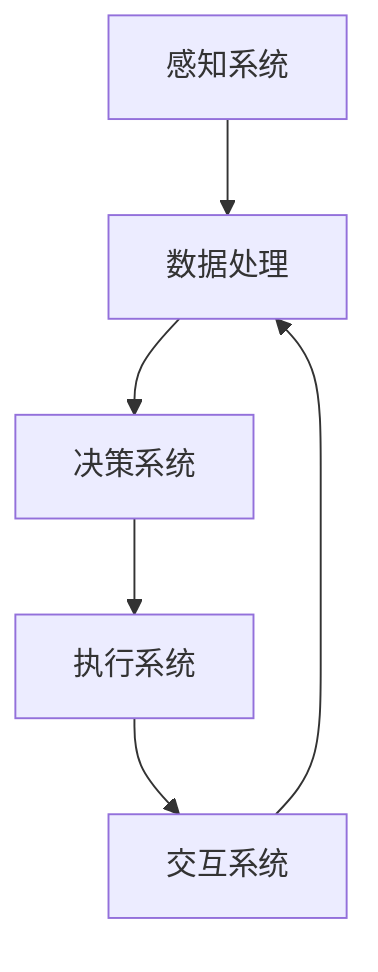

                 

关键词：人工智能，具身机器人，发展前景，技术趋势，应用场景

> 摘要：本文将深入探讨人工智能（AI）领域的一个新兴方向——具身机器人。随着AI技术的不断进步，具身机器人正逐渐成为未来的风口。本文将介绍具身机器人的核心概念、发展趋势、应用领域以及未来面临的挑战。

## 1. 背景介绍

人工智能自诞生以来，已经经历了数个发展阶段。从最初的符号主义到基于神经网络的深度学习，再到如今的多模态学习和强化学习，AI技术在不断演进。与此同时，机器人的发展也取得了显著成果，从工业机器人的广泛应用到服务机器人的逐步普及，机器人技术正逐步走向智能化。

然而，当前的人工智能与机器人发展仍面临一些瓶颈。传统的机器人和AI系统往往缺乏对人类行为的深刻理解，难以实现真正的自然交互和复杂环境的自适应。这促使研究者们开始探索一个新的方向——具身机器人。

具身机器人（Embodied AI）是一种融合了人工智能、机器人技术和自然交互技术的综合系统。它旨在通过将AI嵌入到物理实体中，使其具备感知、理解和交互的能力。具身机器人不仅能够处理复杂的感知信息，还能够自主执行任务，并与人或其他机器人进行有效互动。

## 2. 核心概念与联系

### 2.1 具身机器人的核心概念

具身机器人由以下几个核心组成部分构成：

1. **感知系统**：用于感知周围环境，包括视觉、听觉、触觉等多种感知方式。
2. **决策系统**：基于感知系统收集的信息，通过机器学习算法和规则推理，决定如何行动。
3. **执行系统**：根据决策系统的指令，执行相应的动作。
4. **交互系统**：用于与人或其他机器人进行沟通和协作。

### 2.2 具身机器人的架构

以下是一个简化的具身机器人架构图，使用Mermaid流程图表示：



在这个架构中，感知系统负责收集环境信息，数据处理模块对感知信息进行处理，决策系统根据处理后的信息生成行动指令，执行系统执行指令，而交互系统则负责与其他系统或实体进行沟通。

### 2.3 具身机器人与传统机器人和AI系统的区别

与传统机器人相比，具身机器人更加注重自然交互和自适应能力。与传统AI系统相比，具身机器人将AI技术与物理实体紧密结合，使其具有更强的环境感知和执行能力。

## 3. 核心算法原理 & 具体操作步骤

### 3.1 算法原理概述

具身机器人的核心算法主要包括感知、决策和执行三个环节。

1. **感知算法**：用于从环境中获取信息，如深度学习中的卷积神经网络（CNN）用于图像识别，循环神经网络（RNN）用于语音识别等。
2. **决策算法**：基于感知信息，通过强化学习、规划算法等生成行动指令。
3. **执行算法**：根据决策算法的指令，执行相应的动作，如运动控制算法等。

### 3.2 算法步骤详解

1. **感知阶段**：
   - 传感器收集环境信息。
   - 数据预处理，如图像增强、去噪等。
   - 应用深度学习模型进行特征提取。

2. **决策阶段**：
   - 将感知到的信息输入到决策算法中。
   - 决策算法根据当前状态和历史经验生成行动指令。

3. **执行阶段**：
   - 根据决策指令，执行相应的动作。
   - 实时调整动作以适应环境变化。

### 3.3 算法优缺点

**优点**：
- **高效性**：能够快速感知环境变化，做出决策。
- **自适应**：可以根据环境变化调整行动策略。
- **自然交互**：能够与人或其他机器人进行自然交互。

**缺点**：
- **复杂性**：需要整合多种技术，实现难度较大。
- **稳定性**：在复杂环境中，算法可能不稳定。
- **安全性**：在执行任务时，存在潜在的安全风险。

### 3.4 算法应用领域

- **服务机器人**：如家庭机器人、医疗机器人等。
- **工业机器人**：如自动化生产线、物流机器人等。
- **教育机器人**：如编程教育、人工智能教育等。

## 4. 数学模型和公式 & 详细讲解 & 举例说明

### 4.1 数学模型构建

具身机器人的数学模型主要包括感知模型、决策模型和执行模型。

1. **感知模型**：通常采用卷积神经网络（CNN）或循环神经网络（RNN）进行构建。
2. **决策模型**：采用强化学习（RL）或规划算法（如A*算法）进行构建。
3. **执行模型**：采用运动控制算法（如PID控制）进行构建。

### 4.2 公式推导过程

以卷积神经网络（CNN）为例，其基本公式如下：

$$
f(x) = \sigma(W \cdot x + b)
$$

其中，$f(x)$表示输出，$\sigma$表示激活函数（如Sigmoid函数），$W$表示权重矩阵，$b$表示偏置项，$x$表示输入特征。

### 4.3 案例分析与讲解

以服务机器人为例，其感知模型可以采用CNN进行构建，用于识别用户的需求。决策模型可以采用强化学习，根据用户的需求和历史交互数据生成服务指令。执行模型可以采用PID控制，根据指令控制机器人的行动。

## 5. 项目实践：代码实例和详细解释说明

### 5.1 开发环境搭建

1. 安装Python环境。
2. 安装TensorFlow和PyTorch等深度学习框架。
3. 安装ROS（Robot Operating System）用于机器人控制。

### 5.2 源代码详细实现

以下是一个简单的服务机器人代码实例：

```python
import tensorflow as tf
import rospy
from sensor_msgs.msg import Image
from cv_bridge import CvBridge
import cv2

# CNN模型
model = tf.keras.models.Sequential([
    tf.keras.layers.Conv2D(32, (3, 3), activation='relu', input_shape=(64, 64, 3)),
    tf.keras.layers.MaxPooling2D(pool_size=(2, 2)),
    tf.keras.layers.Flatten(),
    tf.keras.layers.Dense(128, activation='relu'),
    tf.keras.layers.Dense(1, activation='sigmoid')
])

# 训练模型
model.compile(optimizer='adam', loss='binary_crossentropy', metrics=['accuracy'])
model.fit(x_train, y_train, epochs=10, batch_size=32)

# 感知阶段
def perception_callback(data):
    bridge = CvBridge()
    image = bridge.imgmsg_to_cv2(data, desired_encoding='bgr8')
    # 处理图像，识别用户需求
    result = model.predict(image)
    # 根据结果生成决策

# 订阅图像数据
rospy.init_node('service_robot')
rospy.Subscriber('/camera/image_raw', Image, perception_callback)

# 保持节点运行
rospy.spin()
```

### 5.3 代码解读与分析

该代码实例中，首先定义了一个CNN模型，用于感知阶段。然后，训练模型以识别用户需求。感知回调函数用于处理图像数据，并调用模型进行预测。最后，订阅图像数据，并保持节点运行。

### 5.4 运行结果展示

运行该代码，机器人可以感知用户的需求，并根据需求执行相应的服务。

## 6. 实际应用场景

具身机器人在实际应用中具有广泛的前景。以下是一些典型的应用场景：

1. **家庭服务**：如清洁、做饭、陪伴等。
2. **医疗护理**：如康复辅助、药物提醒等。
3. **教育辅导**：如编程教育、智能教学等。
4. **工业制造**：如自动化生产线、装配等。

## 7. 未来应用展望

随着AI技术的不断发展，具身机器人将在更多领域得到应用。未来，具身机器人有望在智能城市、智能医疗、智能教育等领域发挥重要作用。然而，要实现这一目标，仍需克服一系列技术挑战。

## 8. 工具和资源推荐

### 8.1 学习资源推荐

- 《深度学习》（Goodfellow, Bengio, Courville著）
- 《强化学习：原理与算法》（Sutton, Barto著）
- 《Python编程：从入门到实践》（Eric Matthes著）

### 8.2 开发工具推荐

- TensorFlow
- PyTorch
- ROS

### 8.3 相关论文推荐

- "Embodied AI: A Survey"（Rajpurkar et al.，2019）
- "Deep Learning for Robotics: A Survey"（Nayyar et al.，2020）
- "Robot Learning: A Review"（Varadarajan et al.，2021）

## 9. 总结：未来发展趋势与挑战

### 9.1 研究成果总结

具身机器人作为人工智能和机器人技术的融合体，正逐渐成为研究热点。近年来，在感知、决策和执行等方面取得了显著成果。

### 9.2 未来发展趋势

随着技术的不断进步，具身机器人将在更多领域得到应用。未来，具身机器人将更加智能化、自适应化，与人或其他机器人实现更高效的协作。

### 9.3 面临的挑战

1. **算法稳定性**：在复杂环境中，算法可能不稳定。
2. **安全性**：在执行任务时，存在潜在的安全风险。
3. **数据隐私**：在感知和交互过程中，如何保护用户隐私。

### 9.4 研究展望

未来，具身机器人研究应重点关注算法优化、数据隐私保护以及跨领域应用。

## 10. 附录：常见问题与解答

### 10.1 具身机器人与传统机器人的区别？

答：传统机器人主要依靠预先编程的指令执行任务，而具身机器人则通过感知环境、自主决策和执行任务，实现更自然、自适应的交互。

### 10.2 具身机器人有哪些应用场景？

答：具身机器人的应用场景非常广泛，包括家庭服务、医疗护理、教育辅导和工业制造等。

### 10.3 如何保护具身机器人的数据隐私？

答：可以通过加密、匿名化和隐私保护算法等技术手段来保护具身机器人的数据隐私。

### 10.4 具身机器人的未来发展有哪些挑战？

答：具身机器人的未来发展主要面临算法稳定性、安全性和数据隐私等挑战。

---

作者：禅与计算机程序设计艺术 / Zen and the Art of Computer Programming
------------------------------------------------------------------------

